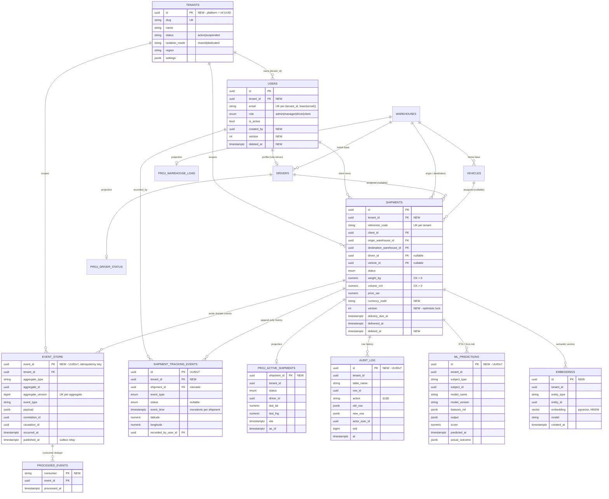

# Phase 3 — PostgreSQL Database Architecture (Mesaar)

Status: **Draft for approval.** Extends the existing FastAPI/SQLAlchemy backend and the
accepted ADRs; nothing here contradicts the current code or migrations — it is the
target-state design the current schema grows into.

This document is **design only** (no DDL/ORM code). It is the data-tier companion to
[`02-architecture.md`](02-architecture.md) and ADR-001…006.

| Reference | Decision this design implements |
|---|---|
| ADR-001 | Shared multitenancy, row-level `tenant_id` + RLS, platform tenant |
| ADR-002 | PostgreSQL-only, monthly partitioning of the event/tracking stream |
| ADR-003 | Celery/Redis consumers of the event store (idempotent) |
| ADR-004 | CQRS-lite: aggregate is truth, append-only events, optimistic `version` |
| ADR-005 | `/v1` contract — schema changes must stay additive within a major version |
| ADR-006 | `proj_*` projection tables rebuilt from the event log |

---

## 0. Conventions & engine baseline

Carried forward from the current models ([`app/models/*`](../app/models), [`0001_baseline`](../migrations/versions/0001_baseline.py)):

| Standard | Rule | Rationale |
|---|---|---|
| Engine | PostgreSQL 16+ | Partitioning, `MERGE`, logical replication, generated columns |
| Surrogate PK | `uuid` | Federation-safe, non-enumerable, client-generatable |
| **PK generation** | **UUIDv7** for high-insert tables (events, audit, projections); UUIDv4 acceptable for low-churn reference tables | UUIDv4 is random → B-tree page splits, WAL bloat, poor cache locality on append-heavy tables. UUIDv7 is time-ordered → near-sequential inserts while staying globally unique. **This is the one change from today's `uuid4` default and should be adopted before the event/audit tables ship.** |
| Time | `timestamptz` only, UTC, `now()` server default | Already enforced via `TimestampMixin`; never store naive timestamps |
| Money | `numeric(12,2)` + explicit `currency_code` (ISO-4217) | Existing `price_sar` assumes SAR; add currency for multi-market |
| Quantities | `numeric(12,2)` weight / `numeric(12,3)` volume | Matches current precision |
| Geo (lat/lng) | `numeric(9,6)` today → **PostGIS `geography(Point,4326)`** when routing/geofencing lands (see §9) | 6 dp ≈ 0.11 m; sufficient until spatial queries need an index |
| Enums | **VARCHAR + CHECK** (`native_enum=False`), not native `ENUM` | Already the convention. Adding a value is an additive migration, not an `ALTER TYPE` lock — important for status evolution and AI-driven categories |
| Semi-structured | `jsonb` (+ GIN), never `json` | Event payloads, settings, feature blobs, model I/O |
| Naming | `pk_/uq_/ck_/fk_/ix_` per [`app/db/base.py`](../app/db/base.py) `NAMING_CONVENTION` | Deterministic, migration-stable |
| Soft delete | `deleted_at timestamptz NULL` on **aggregates** (not on immutable event/audit tables) | Preserves referential history; hard delete reserved for erasure flows (§8) |
| Lifecycle cols | `created_at`, `updated_at` (exist) + **`created_by`, `updated_by`, `version`, `tenant_id`** (new) | Audit + optimistic locking + tenancy |

**Required extensions:** `pgcrypto` (UUID/hashing), `pg_trgm` (fuzzy search), `btree_gist`
(exclusion constraints), `pgvector` (§9), `postgis` (§9, when triggered), `pgaudit` (§6, optional).

---

## 1. ERD (target state)

`NEW` marks tables introduced by this design; the rest exist today (see the as-built
[`docs/diagrams/erd.mmd`](diagrams/erd.mmd)). Every business table gains `tenant_id`.

Projections `proj_driver_status`, `proj_warehouse_load`, `proj_sla_risk`,
`proj_driver_daily_stats` (ADR-006) follow the same shape as `proj_active_shipments`
and are omitted from the diagram for readability.

---

## 2. Tables

Grouped by bounded context ([`02-architecture.md`](02-architecture.md) §3).

### 2.1 Existing core (extended with `tenant_id`, `version`, `deleted_at`, actor cols)

| Table | Grain / aggregate | Notes |
|---|---|---|
| `tenants` `NEW` | One row per customer org; nil-UUID = platform (tenant 0, ADR-001) | `isolation_mode` enables the hybrid escape hatch |
| `users` | Identity root | Email unique **per tenant**; `role` drives RBAC |
| `drivers` | Driver operational profile (1:1 with a `role=driver` user) | `is_available` for dispatch |
| `vehicles` | Fleet asset | `status`, capacity |
| `warehouses` | Node in the network | lat/lng → PostGIS later |
| `shipments` | **Order/Execution aggregate root** | Richest lifecycle; gains `version` for optimistic locking |
| `shipment_tracking_events` | **Append-only** per-shipment history | Partitioned by month (ADR-002); domain-meaningful audit |

### 2.2 Eventing & audit `NEW`

| Table | Purpose |
|---|---|
| `event_store` | Canonical append-only domain-event log **and** transactional outbox (§7) |
| `processed_events` | Per-consumer idempotency ledger (ADR-003/004) |
| `idempotency_keys` | API-level dedupe for unsafe POSTs (assign/accept/create) |
| `audit_log` (schema `audit`) | Generic row-level before/after history via triggers (§6) |
| `outbox_relay_state` | Cursor/heartbeat for the publisher (lag monitoring) |

### 2.3 Read models / projections `NEW` (ADR-006)

| Table | Feeds |
|---|---|
| `proj_active_shipments` | Ops board, live map |
| `proj_driver_status` | Dispatch availability |
| `proj_warehouse_load` | Capacity overview |
| `proj_sla_risk` | Exception center |
| `proj_driver_daily_stats` | Driver-app KPIs |

Projections are **derived and disposable** — rebuildable by replaying `event_store`.
Each carries `tenant_id` and an `as_of` timestamp (UI shows "as of"; ADR-006).

### 2.4 AI / ML `NEW` (§9)

| Table | Purpose |
|---|---|
| `embeddings` | pgvector vectors for semantic search / matching |
| `ml_features_shipment` | Point-in-time feature snapshots (offline/online parity) |
| `ml_predictions` | Inference log: ETA, SLA-risk, pricing, fraud — with `actual_outcome` for feedback |
| `documents` + `document_chunks` | RAG corpus (policies, POD text) with chunk embeddings |

---

## 3. Keys

### 3.1 Primary keys
- **Surrogate UUID PK on every table.** UUIDv7 for append-heavy tables (`event_store`,
  `shipment_tracking_events`, `audit_log`, `ml_predictions`, projections); UUIDv4 fine
  for reference tables (`tenants`, `warehouses`).
- **Partitioned tables** (`shipment_tracking_events`, `event_store`, `audit_log`) use a
  **composite PK including the partition key** (e.g. `(id, event_time)` /
  `(event_id, occurred_at)`) because PostgreSQL requires the partition column in any
  unique/primary key.
- **Projections** are keyed by their subject (`proj_active_shipments.shipment_id` is both
  PK and FK) — one current row per subject.
- **`processed_events`** uses a natural composite PK `(consumer, event_id)`.

### 3.2 Business / natural keys (uniqueness becomes per-tenant — ADR-001)

| Table | Natural key (target) | Was (single-tenant) |
|---|---|---|
| `users` | `(tenant_id, lower(email))` | `email` |
| `warehouses` | `(tenant_id, code)` | `code` |
| `vehicles` | `(tenant_id, plate_number)`, `(tenant_id, vin)` | `plate_number`, `vin` |
| `drivers` | `(tenant_id, license_number)`, `(tenant_id, user_id)` | `license_number`, `user_id` |
| `shipments` | `(tenant_id, reference_code)` | `reference_code` |
| `event_store` | `(aggregate_id, aggregate_version)` — optimistic-concurrency key | — |
| `tenants` | `slug` (global) | — |

### 3.3 Foreign keys & `ON DELETE` semantics (current behavior preserved)

| Child → Parent | Action | Intent |
|---|---|---|
| `shipments.client_id → users` | **RESTRICT** | A client with shipments cannot be hard-deleted (use soft delete / deactivate) |
| `shipments.origin/destination_warehouse_id → warehouses` | **RESTRICT** | Network nodes are referenced history |
| `shipments.driver_id → drivers` | **SET NULL** | Unassign on driver removal; shipment survives |
| `shipments.vehicle_id → vehicles` | **SET NULL** | Unassign on vehicle removal |
| `drivers.user_id → users` | **CASCADE** | Profile is a dependent part of the identity |
| `drivers/vehicles.home_warehouse_id → warehouses` | **SET NULL** | Optional home base |
| `shipment_tracking_events.shipment_id → shipments` | **CASCADE** | History scoped to its shipment |
| `shipment_tracking_events.recorded_by_user_id → users` | **SET NULL** | Keep the event, drop the actor link |
| every `*.tenant_id → tenants` `NEW` | **RESTRICT** | A tenant with data is never silently deleted; offboarding is an explicit purge job |

> **FK indexing caveat:** PostgreSQL does **not** auto-index foreign keys. Every FK column
> above needs a backing index (§5) or deletes/joins on the parent table degrade.

---

## 4. Constraints

### 4.1 Domain (CHECK) constraints

| Constraint | Where | Note |
|---|---|---|
| `weight_kg > 0`, `volume_m3 > 0` | `shipments` | Exists today |
| `price_sar >= 0` | `shipments` | New |
| `capacity_weight_kg >= 0`, `capacity_volume_m3 >= 0` | `warehouses`, `vehicles` | New |
| `latitude BETWEEN -90 AND 90`, `longitude BETWEEN -180 AND 180` | `warehouses`, tracking events | New; cheap correctness guard |
| `version >= 1` | aggregates | Optimistic-lock invariant |
| `delivered_at IS NULL OR delivered_at >= created_at` (and similarly `assigned_at`, `cancelled_at`) | `shipments` | DB-enforceable temporal sanity; full cross-state ordering stays in `shipment_service` |
| enum domain (`status IN (...)`) | all enum cols | Implicit in VARCHAR+CHECK convention |
| `currency_code ~ '^[A-Z]{3}$'` | money tables | ISO-4217 shape |

### 4.2 Uniqueness & partial-unique (business invariants worth enforcing in the DB)

| Rule | Mechanism |
|---|---|
| Per-tenant natural keys (§3.2) | Composite `UNIQUE` (functional `lower(email)` for users) |
| **One active assignment per driver** | Partial unique index on `(tenant_id, driver_id)` `WHERE status IN ('assigned','in_transit') AND deleted_at IS NULL` — prevents double-booking a driver |
| **One active assignment per vehicle** | Partial unique on `(tenant_id, vehicle_id)` with the same predicate |
| One open shipment per reference | `(tenant_id, reference_code)` unique |
| Per-aggregate event ordering | `UNIQUE(aggregate_id, aggregate_version)` on `event_store` — rejects concurrent writers at the same version |

Partial-unique indexes are the senior-grade way to express "only one *active*" without a
status table or trigger; they cost nothing on inactive rows.

### 4.3 Exclusion constraints (optional, `btree_gist`)
- Prevent overlapping vehicle reservations in a future scheduling table:
  exclude where `vehicle_id` equal **and** time ranges overlap. Reserved for when
  pre-booking/slotting is modeled; not needed for the current "one active" rule.

### 4.4 NOT NULL
All keys, `tenant_id`, lifecycle timestamps, `status`, `version`, and quantities are
`NOT NULL`. Genuinely optional fields stay nullable (`driver_id`, `vehicle_id`,
`delivered_at`, `failure_reason`, geo, commercial offer fields).

---

## 5. Indexing Strategy

**Principles**
1. **Tenant-leading composites.** Under RLS every query is implicitly `tenant_id = ?`, so
   indexes lead with `tenant_id` (`(tenant_id, <selective col>)`). This keeps each
   tenant's slice contiguous and the planner honest.
2. **Index the hot path, not every column.** Drive indexes from the real read patterns
   (control tower, offer feed, SLA sweep, driver history), not speculation.
3. **Partial indexes for skewed predicates** — most shipments are terminal; index only the
   live ones.
4. **Covering (`INCLUDE`) indexes** for the few latency-critical list endpoints to get
   index-only scans.
5. **Back every FK** (§3.3 caveat).

### 5.1 Per-table catalog (hot paths → index)

| Table | Index (leading cols, type) | Serves |
|---|---|---|
| `shipments` | `(tenant_id, status)` **partial** `WHERE status NOT IN ('delivered','cancelled','returned','failed')` | Ops board live list |
| `shipments` | `(tenant_id, driver_id)` partial `WHERE driver_id IS NOT NULL` | Driver's shipments |
| `shipments` | `(tenant_id, status, required_vehicle_type)` **partial** `WHERE status='ready' AND driver_id IS NULL` | Driver **offer feed** (`/v1/shipments/nearby`) |
| `shipments` | `(tenant_id, delivery_due_at)` partial `WHERE status NOT IN (terminal)` | **SLA breach sweep** (celery-beat) |
| `shipments` | `(tenant_id, client_id)`, `(tenant_id, destination_warehouse_id)`, `(origin_warehouse_id)`, `(vehicle_id)` | FK-backing + filters |
| `shipments` | `(tenant_id, reference_code)` unique | Lookup by ref |
| `shipment_tracking_events` | `(tenant_id, shipment_id, event_time)` | Ordered history + monotonic guard (extends today's index) |
| `shipment_tracking_events` | **BRIN** on `event_time` per partition | Cheap time-range scans on the big table |
| `shipment_tracking_events` | `(tenant_id, shipment_id, event_time DESC)` partial `WHERE event_type='location_update'` | Live-map last-position |
| `users` | unique `(tenant_id, lower(email))` | Login |
| `drivers` | `(tenant_id, is_available)` partial `WHERE is_available` | Dispatch candidates |
| `event_store` | `(aggregate_id, aggregate_version)` unique; `(published_at)` partial `WHERE published_at IS NULL`; `(tenant_id, occurred_at)` | Replay, **outbox poll**, audit reads |
| `audit_log` | `(tenant_id, table_name, row_id, at)` | "History of this record" |
| `proj_*` | `(tenant_id, status/eta/...)` per view's filter | Sub-300 ms console reads |

### 5.2 Specialized index types

| Type | Use |
|---|---|
| **BRIN** | Append-only time columns on partitions (`event_time`, `occurred_at`, `audit.at`) — tiny, ideal for monotonic data |
| **GIN (`jsonb_path_ops`)** | `event_store.payload`, `tenants.settings`, `ml_predictions.output` containment queries |
| **GIN (`pg_trgm`)** | Fuzzy/`ILIKE` search on `reference_code`, names, addresses |
| **GiST (PostGIS)** | Nearest-warehouse / nearby-offer / geofence once geography lands (§9) |
| **HNSW (pgvector)** | `embeddings.embedding` ANN search (§9) |
| **Composite + `INCLUDE`** | Index-only scans for the active-shipments list (include `driver_id, eta`) |

### 5.3 Partitioning & maintenance (ADR-002)
- `shipment_tracking_events`, `event_store`, `audit_log`: **declarative RANGE partition by
  month** on the time column. A scheduled job (celery-beat) pre-creates next month's
  partition and detaches/archives partitions past retention.
- Large tenants can later get **LIST sub-partitioning by `tenant_id`** without an app
  change — additive, per ADR-002's "PG-compatible migration is additive" stance.
- `autovacuum` tuned per hot table; `REINDEX CONCURRENTLY` on bloat; partition drop is the
  retention mechanism (no giant `DELETE`s).

---

## 6. Audit Strategy

Three complementary layers plus enforcement controls. "Who, what, when, before/after."

### Layer 1 — Column-level lineage (cheap, on every aggregate)
`created_at` / `updated_at` (exist) **+ `created_by` / `updated_by` (user UUID)** and
`version`. Actor is resolved from the JWT and pushed to the DB session as a GUC
(`app.current_user_id`) so triggers and RLS can read it.

### Layer 2 — Row-level history (generic, trigger-driven)
A single `audit.audit_log` table captures **every INSERT/UPDATE/DELETE** on audited
tables: `table_name`, `row_id`, `action`, `old_row` + `new_row` (JSONB), `actor_user_id`,
`tenant_id`, `txid`, and statement timestamp. An `AFTER` row trigger (one reusable trigger
function, attached per table) writes it.
- **Append-only and partitioned by month** (same machinery as §5.3).
- JSONB diff lets you reconstruct any row's full timeline and answer "who changed the
  delivery window?" without per-table audit schemas.

### Layer 3 — Domain / business audit (immutable, meaningful)
The **`event_store`** (§7) and **`shipment_tracking_events`** are the *business* audit
trail: status transitions, assignments, POD capture, exceptions — each immutable, ordered,
and attributable. Reversals are **compensating events**, never edits/deletes (ADR-004).
This is what auditors and the control tower actually read; Layer 2 is the forensic
safety-net beneath it.

### Enforcement controls
| Control | How |
|---|---|
| **Immutability** | App role granted `INSERT`/`SELECT` only (no `UPDATE`/`DELETE`) on `event_store`, `audit_log`, tracking partitions. Only a maintenance role may detach/drop old partitions |
| **Tamper-evidence (optional, high-assurance)** | Hash-chain: each `audit_log`/`event_store` row stores `prev_hash` + `row_hash` (over canonical payload). Breaks are detectable; satisfies stricter compliance without a separate ledger DB |
| **Retention** | Partition-drop on policy (e.g. 18 mo hot, archive to cold storage / S3 via `COPY` before drop) |
| **Access auditing (read trails)** | `pgaudit` for privileged/PII reads when a customer contract requires it |
| **Tenant scoping** | `audit_log` carries `tenant_id` and is itself under RLS — tenants can be shown their own audit trail safely |

---

## 7. Event Store Strategy

**Model: CQRS-lite (ADR-004) — not full event sourcing.** The relational aggregate
(`shipments`) stays the source of truth for current state; `event_store` is the durable,
append-only record of *what happened* and the **transactional outbox** that feeds Celery
workers and projection builders.

### 7.1 Why an outbox (the dual-write problem)
Emitting to Redis/Celery *and* committing the DB row in two steps risks one succeeding and
the other failing. Instead, the state change **and** its event row are written in **one
local transaction**. A separate **relay/poller** reads `event_store WHERE published_at IS
NULL`, publishes to the bus, and stamps `published_at`. Result: at-least-once delivery with
no lost events; consumers dedupe (below).

### 7.2 Schema (conceptual)
`event_id` (UUIDv7, PK, **idempotency key**), `tenant_id`, `aggregate_type`,
`aggregate_id`, `aggregate_version` (per-aggregate monotonic sequence), `event_type`
(`<Aggregate><PastTenseVerb>`, e.g. `ShipmentAssigned`), `payload` (JSONB),
`correlation_id` + `causation_id` (trace a chain across services), `occurred_at`,
`recorded_at`, `published_at`. Partitioned monthly by `occurred_at` (ADR-002).

### 7.3 Ordering & concurrency
- **Per-aggregate ordering** via `UNIQUE(aggregate_id, aggregate_version)`. Two concurrent
  transitions race to write the same next version; the loser hits the unique violation,
  retries, and re-validates — this *is* the optimistic-concurrency mechanism, paired with
  `shipments.version`.
- Global ordering is intentionally **not** guaranteed (and not needed); consumers reason
  per aggregate.

### 7.4 Idempotency & replay
- `processed_events(consumer, event_id)` — each consumer records what it has handled;
  re-delivery is a no-op. Handlers are idempotent (ADR-003).
- **Replay rebuilds projections, not aggregates** (ADR-004): truncate a `proj_*` table and
  re-fold the relevant events. Bounded, cheap, and how a new read model is back-filled.

### 7.5 Relationship to `shipment_tracking_events`
The tracking table is the **domain-specific, user-facing slice** of the event stream
(location pings, status updates, POD, exceptions — the rows a customer sees). `event_store`
is the **complete** internal log (including fleet/identity events with no tracking row).
Events that have a tracking representation are written to both inside the same transaction;
`event-catalog.md` maps each event to its consumers.

### 7.6 Compensation
`ShipmentReturned` after `ShipmentDelivered`, cancellations, re-assignments — all modeled
as **new forward events**. History is never mutated or deleted (cascade delete only when a
parent shipment is itself hard-deleted, which the RESTRICT/soft-delete policy makes rare).

---

## 8. Multi-Tenant Readiness (ADR-001)

**Strategy:** shared schema, row-level `tenant_id` on every aggregate root, enforced by
**RLS** as defense-in-depth beneath the app's tenant scope. Platform/internal org is the
**nil-UUID tenant** (`00000000-…-0000`, "tenant 0").

### 8.1 Tenant resolution → session
On each request the JWT yields the tenant; the app sets it as a transaction-local GUC
(`app.current_tenant`) and `app.current_user_id`. **With pooled connections this MUST be
`SET LOCAL` inside the request transaction** so it never leaks to the next checkout — the
single most important correctness rule of this model.

### 8.2 RLS policies
Every tenant table has RLS enabled with a `USING`/`WITH CHECK` predicate equivalent to
"row's `tenant_id` = the session's current tenant." Effects:
- A query that *forgets* to filter by tenant still cannot see another tenant's rows.
- `WITH CHECK` blocks writing a row under the wrong tenant.
- The **platform tenant** runs with an elevation flag (a `BYPASSRLS` service role or a
  policy branch) for cross-tenant analytics/support — used deliberately, never as the
  default app role.

The predicate reads the GUC as
`NULLIF(current_setting('app.current_tenant', true), '')::uuid` (migration
`0018`). The `NULLIF` guard makes the policy **fail closed on an empty GUC**: an
unset tenant already yields SQL `NULL` (→ no rows), and wrapping in `NULLIF(…, '')`
collapses an *empty-string* setting to `NULL` the same way, instead of casting
`''::uuid` and raising `invalid input syntax for type uuid: ""`. Net effect:
missing **and** empty tenant context both deny all cross-tenant rows without
crashing the query; a matching `tenant_id` and the platform nil-UUID scope are
unaffected.

### 8.3 Schema changes the model forces
- Add `tenant_id uuid NOT NULL` to every aggregate (+ FK to `tenants`).
- **Convert all `uq_*` to per-tenant composites** and recreate indexes tenant-leading (§3.2, §5).
- Projections, `event_store`, `audit_log`, embeddings, predictions all carry `tenant_id`
  and are RLS-scoped — analytics and AI cannot leak across tenants.

### 8.4 Migration sequence (zero-downtime, additive)
1. Create `tenants`; insert platform (nil UUID).
2. Add `tenant_id` **nullable**; backfill existing rows → platform tenant.
3. Set `NOT NULL` + FK; add tenant-leading indexes `CONCURRENTLY`.
4. Swap single-column uniques for `(tenant_id, …)` composites.
5. Enable RLS + policies; switch the app to a non-superuser role that RLS applies to.
6. Wire `SET LOCAL` tenant/user GUCs into `api/deps.py`.

### 8.5 Operational concerns
| Concern | Approach |
|---|---|
| **Noisy neighbor** | Per-tenant app-level rate limits + `statement_timeout`; future LIST sub-partition or move a heavy tenant to dedicated (below) |
| **Hybrid escape hatch** | `tenants.isolation_mode='dedicated'` routes a regulated/enterprise tenant to its own schema or database — the ADR-001 "stamps" path — without changing app logic |
| **Per-tenant backup / export** | Logical, RLS-scoped `COPY`/dump by `tenant_id`; supports data-portability and contractual deletion |
| **Residency** | `tenants.region` now; sharding by region later if required |
| **Right-to-erasure** | The one sanctioned hard-delete path: tenant-scoped purge job; immutable audit/event rows are crypto-shredded or redacted per policy rather than row-deleted |

---

## 9. AI Readiness

The schema is deliberately shaped so the **event log is a training stream** and the OLTP
store doubles as a feature/inference substrate — no separate data platform needed at
current scale.

### 9.1 Foundations already in place
- **Immutable, ordered events** (`event_store`) with `occurred_at` give **point-in-time
  correctness** — features and labels can be reconstructed *as of* a decision time,
  avoiding target leakage.
- **Clean typed schema + enum-as-VARCHAR** means new categories (cargo types, exception
  codes, model-suggested tags) are additive.
- **Labels are derivable today:** SLA-met = `delivered_at <= delivery_due_at`; failure
  reasons, returns, cancellations all flow from existing columns/events.

### 9.2 Vector search — `pgvector`
`embeddings(entity_type, entity_id, embedding vector(N), model, tenant_id, created_at)` with
an **HNSW** index, plus `documents`/`document_chunks` for RAG. Uses:
- Semantic search over tracking `notes`, exception text, POD/document content.
- **Address normalization / dedup** and fuzzy origin-destination matching.
- **Driver↔shipment / similar-shipment retrieval** for assignment and ETA priors.
- RAG corpus for an internal ops copilot (policies, SOPs, contracts) — tenant-scoped by RLS
  so retrieval never crosses tenants.

### 9.3 Feature store & inference log
| Table | Role |
|---|---|
| `ml_features_shipment` | Versioned, point-in-time feature snapshots; offline-training / online-serving parity. Many features are just `proj_*` columns surfaced for reuse |
| `ml_predictions` | Every inference: `subject`, `model_name` + `model_version`, `features_ref`, `output` (JSONB), `score`, `predicted_at`, and **`actual_outcome`** captured later → closes the **feedback loop** for monitoring drift and retraining |

### 9.4 Target use-cases this enables
ETA prediction (events → live ETA in `proj_active_shipments`), **SLA-breach risk**
(`proj_sla_risk`), dynamic pricing for the offer feed (`price_sar`), driver assignment
ranking, demand/capacity forecasting per warehouse, and anomaly/fraud detection over the
event stream.

### 9.5 Geospatial intelligence — PostGIS (triggered enhancement)
Promote `latitude/longitude` to `geography(Point,4326)` + **GiST** when routing/geofencing/
nearby-offer ranking lands. Unlocks distance-to-warehouse features, geofence-driven status
events, and corridor analytics — all strong ML signals. Additive, mirrors the ADR-002
"adopt when triggered" pattern.

### 9.6 Governance
- **Tenant isolation extends to AI:** embeddings, features, and predictions carry
  `tenant_id` and are RLS-scoped — no cross-tenant training or retrieval by default.
- **PII discipline:** training/feature pipelines read from projections/feature tables, not
  raw PII columns; sensitive fields are excluded or hashed before embedding.
- **Reproducibility:** `model_version` + `features_ref` + point-in-time events make any
  prediction auditable and replayable.

---

## 10. Rollout & risks

**Sequencing (each step additive, ADR-aligned):**
1. Conventions: adopt UUIDv7 default; add `version`, `created_by/updated_by`, `deleted_at`.
2. Tenancy migration (§8.4) — gates everything else.
3. `event_store` + outbox relay + `processed_events`; wire transitions to emit.
4. Partition tracking/event/audit tables; add BRIN + tenant-leading indexes.
5. Audit triggers + immutability grants.
6. `proj_*` builders (ADR-006) folded from events.
7. AI substrate: `pgvector`, embeddings, `ml_predictions`; PostGIS when routing lands.

**Top risks & mitigations**
| Risk | Mitigation |
|---|---|
| Pooled-connection GUC leakage across tenants | Mandatory `SET LOCAL` in the request transaction; integration test asserts isolation |
| UUIDv4 index bloat on event/audit tables | Switch to UUIDv7 **before** those tables ship |
| Forgotten FK indexes → slow deletes/joins | Index-every-FK rule in review checklist |
| Projection lag / divergence | Prometheus lag gauge (ADR-006); periodic replay-and-compare |
| Per-tenant unique migration on live data | Backfill + `CREATE … CONCURRENTLY` + validate before `NOT NULL` |
| Event/aggregate dual-write inconsistency | Single-transaction write + outbox relay (never write to the broker directly) |

---

*Companion artifacts:* [`02-architecture.md`](02-architecture.md) ·
[`event-catalog.md`](event-catalog.md) · ADR-001…006 ([`docs/adr/`](adr/)) ·
as-built ERD [`diagrams/erd.mmd`](diagrams/erd.mmd).
