# Phase 4 — Event Storming, State Machines & Domain Events (Mesaar)

Status: **Draft for approval.** Models the business behavior of the platform before backend implementation. Extends — and never contradicts — Phases 1–3 and ADR-001…006. Architecture documentation only (no code, SQL, or ORM).

| Reference | What this phase builds on |
|---|---|
| [`02-architecture.md`](02-architecture.md) | Bounded contexts, layering, CQRS-lite + event-driven style |
| [`03-database-architecture.md`](03-database-architecture.md) | Event store / outbox (§7), audit (§6), projections, AI substrate (§9) |
| [`event-catalog.md`](event-catalog.md) | Existing shipment/fleet event names & consumers (extended here) |
| [`domain-glossary.md`](domain-glossary.md) | Ubiquitous language |
| ADR-001…006 ([`adr/`](adr/)) | Tenancy, time-series, jobs, event model, versioning, read-models |
| `app/services/shipment_service.py` | **Authoritative** shipment transition map & guards (transcribed, not redesigned) |

> **Authoritative-source note.** The shipment state machine (Part 4) and its guards (Part 5) are transcribed verbatim from the enforced code (`_is_transition_allowed`, assignment/capacity checks). The Order, Driver, Route state machines and the Customer/Orders/Route/Notifications/Billing/Analytics/AI contexts are **target-state (NEW)** designs marked as such. Reconciliations of the requested vocabulary (PickedUp, Delayed, vehicle Available/OutOfService) onto the approved model are stated inline.

---

## Contents

1. [Part 1 — Bounded Contexts & Context Map](#part-1--bounded-contexts--context-map)
2. [Part 2 — Event Storming](#part-2--event-storming)
3. [Part 3 — Domain Event Catalog](#part-3--domain-event-catalog)
4. [Part 4 — State Machines](#part-4--state-machines)
5. [Part 5 — Business Rules Catalog](#part-5--business-rules-catalog)
6. [Part 6 — Event Store Design](#part-6--event-store-design)
7. [Part 7 — CQRS Design](#part-7--cqrs-design)
8. [Part 8 — AI Readiness & AI Event Catalog](#part-8--ai-readiness--ai-event-catalog)
9. [Part 9 — Consolidated Outputs Index](#part-9--consolidated-outputs-index)

---

## Part 1 — Bounded Contexts & Context Map

Status: **Draft for approval (Phase 4).** This section formalizes the Mesaar domain into 13 bounded contexts, classifies each as a subdomain, and pins the integration relationships between them. It does not redesign any approved Phase 1–3 decision: the Shipment state machine, exclusivity/capacity/eligibility invariants, tenancy (ADR-001), the event model (ADR-004), projections (ADR-006), and the event store/outbox in `docs/03-database-architecture.md` (§6–7) are authoritative and merely elaborated here behaviorally. Contexts are marked **EXISTS** (already in `app/models` + `app/services`) or **NEW** (target design, consistent with `docs/02-architecture.md`).

## 1. Bounded contexts (canonical inventory)

| # | Context | Subdomain | Status | One-line purpose |
|---|---|---|---|---|
| 1 | Identity & Access | Generic/Supporting | EXISTS | Authentication, RBAC, tenant provisioning |
| 2 | Customer Management | Supporting | NEW | Shipper/customer org profiles, contacts, credit |
| 3 | Orders | Core | NEW | Commercial order intake → fulfilment orchestration |
| 4 | Shipments | Core | EXISTS | Physical shipment aggregate, lifecycle, assignment |
| 5 | Fleet Management | Supporting | EXISTS | Vehicles, capacity, maintenance lifecycle |
| 6 | Driver Management | Core/Supporting | EXISTS | Driver profiles, availability, eligibility, offers |
| 7 | Route Management | Core | NEW | Route planning/optimization, stops, sequencing |
| 8 | Warehouse Management | Supporting | EXISTS | Nodes, capacity, receiving/dispatch |
| 9 | Tracking | Core/Supporting | EXISTS | Append-only tracking events, location, POD, exceptions |
| 10 | Notifications | Generic | NEW | Push/SMS/email fan-out (integration) |
| 11 | Billing | Supporting | NEW | Pricing/quote, settlement, payout, invoices |
| 12 | Analytics | Supporting | NEW | Projections, KPIs, control-tower read models |
| 13 | AI Operations | Core | NEW | ETA/SLA/pricing/assignment/forecast/anomaly models |

---

### 1.1 Identity & Access — *Generic/Supporting · EXISTS*

**Purpose.** Establish *who* is acting and *under which tenant*, and authorize every command. The trust root for the whole platform.

**Responsibilities.**
- User lifecycle (register, activate, deactivate) with exactly one `role` ∈ {admin, manager, driver, client}.
- Credential issuance: JWT bearer (OAuth2 password flow today; **add** phone+OTP for drivers).
- RBAC via `require_roles(...)`; resource-ownership checks (driver ↔ own shipment).
- Tenant provisioning/suspension; injection of `tenant_id` scope for RLS (ADR-001).

**Owned Entities.** `User`, `Role`, `Permission`, `Tenant`.

**External Dependencies.** *Contexts:* none upstream (it is the upstream). All contexts conform to its identity/tenant claims. *External:* SMS/OTP provider (via Notifications), JWT/crypto libs.

**Subdomain.** Generic for auth mechanics; Supporting where it carries tenant/RBAC policy specific to logistics ops.

---

### 1.2 Customer Management — *Supporting · NEW*

**Purpose.** Own the commercial counterparty: the shipper organizations and contacts that place orders, and their credit standing.

**Responsibilities.**
- Customer org profile, contacts, billing addresses, default terms.
- Credit limit and credit-status changes (input to order approval).
- Customer (de)activation; gates whether new orders may be placed.

**Owned Entities.** `Customer` (and contacts/credit sub-entities).

**External Dependencies.** *Contexts:* Identity & Access (the `client` user ↔ customer org link); Orders (consumes customer/credit); Billing (invoicing target). *External:* optional credit-bureau / ERP master-data.

**Subdomain.** Supporting — necessary master data, not a market differentiator.

---

### 1.3 Orders — *Core · NEW*

**Purpose.** Represent the *commercial* request/contract (distinct from physical execution) and orchestrate its fulfilment. **TODAY** `Shipment` doubles as the order; the **TARGET** splits a commercial Order that may fan out to 1+ Shipments.

**Responsibilities.**
- Order intake, submission, approval/rejection (credit-gated), cancellation.
- Fan-out: decompose an approved Order into one or more Shipments (saga/orchestration).
- Track aggregate fulfilment state across child shipments; complete the Order.

**Owned Entities.** `Order`, `OrderLine`.

**External Dependencies.** *Contexts:* Customer Management (credit/approval), Billing (quote/credit check), Shipments (fan-out + status roll-up), Notifications. *External:* none direct.

**Subdomain.** Core — the orchestration of commercial intent into execution is central to the product.

---

### 1.4 Shipments — *Core · EXISTS (richest)*

**Purpose.** The authoritative physical-execution aggregate: a parcel of goods moving origin → destination through the guarded 8-state lifecycle, with driver+vehicle assignment.

**Responsibilities.**
- Shipment lifecycle over the **authoritative** map (`created → ready → assigned → in_transit → {delivered|failed|returned}`; `cancelled` from non-terminal). Illegal transitions raise `StatusTransitionError`.
- Assignment (`assign_driver_and_vehicle` / `assign_driver_only`): enforce driver/vehicle exclusivity over ACTIVE shipments, vehicle `active`, driver `is_available`+role, vehicle capacity, origin **and** destination warehouse capacity.
- Emit the canonical shipment events; stamp `assigned_at`/`delivered_at`/`cancelled_at`.

**Owned Entities.** `Shipment`, `Assignment`.

**External Dependencies.** *Contexts:* Driver Management + Fleet (eligibility/exclusivity sources), Warehouse (capacity), Tracking (partnership — tracking events carry guarded status changes), Orders (parent), Route, Billing, AI Operations, Notifications, Analytics. *External:* none direct.

**Subdomain.** Core — the heart of the operation; densest invariant set in code.

---

### 1.5 Fleet Management — *Supporting · EXISTS*

**Purpose.** Own vehicles as transport assets: their stored lifecycle, capacity, and maintenance.

**Responsibilities.**
- Vehicle lifecycle (stored enum) `active → maintenance → active`, `active|maintenance → decommissioned` (terminal).
- Capacity master data (`capacity_weight_kg`, `capacity_volume_m3`) consumed by Shipments.
- Maintenance start/complete; decommission. Expose **derived operational overlay** (active+free = Available, active+on-active-shipment = Assigned). "OutOfService" maps to `decommissioned` (permanent) or `maintenance` (temporary).

**Owned Entities.** `Vehicle`.

**External Dependencies.** *Contexts:* Shipments (assignment consumer of capacity/status), Analytics (utilization). *External:* telematics/maintenance systems (future).

**Subdomain.** Supporting — asset bookkeeping enabling the core flow.

---

### 1.6 Driver Management — *Core/Supporting · EXISTS*

**Purpose.** Own driver operational identity, availability, eligibility, and the offer/accept self-service surface.

**Responsibilities.**
- Driver profile (`license_*`, `home_warehouse`, `is_available`).
- Availability toggle; **proposed** driver state machine (offline, available, assigned, busy/on_trip, suspended) — marked PROPOSED (no driver-status enum in code today; today only `is_available` + `user.is_active`).
- Nearby READY+unassigned offers (haversine), 15s acceptance window; accept = `assign_driver_only`; decline = no state mutation.
- Eligibility gating (only `available` drivers receive offers/assignment; single-active-shipment exclusivity).

**Owned Entities.** `Driver`.

**External Dependencies.** *Contexts:* Identity (driver-role user, OTP), Shipments (accept ⇒ assignment; status drives derived assigned/busy), Notifications (offer push), AI Operations (assignment ranking), Analytics (driver stats). *External:* SMS/OTP, geolocation.

**Subdomain.** Core for offer/assignment matching (a differentiator); Supporting for profile/eligibility bookkeeping.

---

### 1.7 Route Management — *Core · NEW*

**Purpose.** Plan, optimize, and sequence the physical movement: ordered stops a driver/vehicle executes across one or more shipments.

**Responsibilities.**
- Route lifecycle (proposed): `created → planned → optimized → started → completed`; `planned|optimized → cancelled`; `started → cancelled` (abort). Stops: `pending → completed|skipped`.
- Stop sequencing, ETAs per stop, route-level progress.
- Consume optimization suggestions from AI Operations; bind routes to shipments/drivers.

**Owned Entities.** `Route`, `RouteStop`.

**External Dependencies.** *Contexts:* Shipments (stops reference shipments), Driver/Fleet (executor), AI Operations (RouteOptimized inputs), Warehouse (depot stops), Tracking (progress), Analytics. *External:* maps/routing/geo provider.

**Subdomain.** Core — route efficiency is a primary operational lever.

---

### 1.8 Warehouse Management — *Supporting · EXISTS*

**Purpose.** Own physical nodes with geolocation and capacity, and the receive/dispatch flow at each node.

**Responsibilities.**
- Warehouse master data (`code`, geo lat/lng, `capacity_weight_kg`, `capacity_volume_m3`, `max_daily_shipments`).
- Capacity enforcement at create/assign (origin **and** destination, summed over ACTIVE shipments) — **hard** today.
- Receiving/dispatch events; soft `max_daily_shipments` throughput target; capacity-threshold/exceeded signals.

**Owned Entities.** `Warehouse`.

**External Dependencies.** *Contexts:* Shipments (capacity consumer), Route (depot stops), Analytics (`proj_warehouse_load`). *External:* WMS/yard systems (future).

**Subdomain.** Supporting — node capacity bookkeeping enabling core assignment.

---

### 1.9 Tracking — *Core/Supporting · EXISTS*

**Purpose.** Own the append-only event trail of a shipment in motion: status updates, locations, POD, exceptions, with monotonic time.

**Responsibilities.**
- Create immutable `ShipmentTrackingEvent` rows (`status_update`, `location_update`, `proof_of_delivery`, `exception`) with monotonic non-decreasing `event_time` per shipment.
- A `status_update` tracking event carries a **guarded** transition validated against the Shipments map (Partnership).
- Surface live location and POD evidence; raise exceptions.

**Owned Entities.** `ShipmentTrackingEvent`.

**External Dependencies.** *Contexts:* Shipments (partnership — guarded status changes), AI Operations (location feeds ETA), Analytics (live-map/SLA projections), Notifications. *External:* driver-app GPS.

**Subdomain.** Core for the live operational truth feeding ETA/SLA; Supporting as an audit ledger.

---

### 1.10 Notifications — *Generic · NEW*

**Purpose.** Fan out platform events to humans via push/SMS/email. Pure integration context.

**Responsibilities.**
- Consume `NotificationRequestedIntegrationEvent` and channel-route (push/SMS/email).
- Emit delivery results (`NotificationSent`, `NotificationFailed`); retry/backoff.
- Template + locale handling (Arabic/English).

**Owned Entities.** `Notification`.

**External Dependencies.** *Contexts:* every emitting context (Shipments, Orders, Driver, Billing, Tracking) via integration events. *External:* FCM/APNs, SMS gateway, email/SMTP/ESP.

**Subdomain.** Generic — commodity messaging, buy/integrate not differentiate.

---

### 1.11 Billing — *Supporting · NEW*

**Purpose.** Monetize the operation: quote prices, settle delivered shipments, calculate driver payouts, issue invoices.

**Responsibilities.**
- Price quote on order/shipment (`PriceQuoted`); credit-check input to Orders approval.
- Settlement on delivery (`SettlementRequestedIntegrationEvent` → `InvoiceGenerated`, `PaymentCaptured`).
- Driver payout calculation (`DriverPayoutCalculated`).

**Owned Entities.** `Invoice`, `Settlement`, `Quote`, `Payout`.

**External Dependencies.** *Contexts:* Orders + Customer (quote/credit), Shipments (settlement on `ShipmentDelivered`), Driver (payout), AI Operations (dynamic pricing), Analytics. *External:* payment gateway, ERP/accounting.

**Subdomain.** Supporting — essential but built on standard billing patterns.

---

### 1.12 Analytics — *Supporting · NEW*

**Purpose.** Own the read side: projection tables, KPIs, and the control-tower read models (ADR-006).

**Responsibilities.**
- Build/rebuild idempotent projections: `proj_active_shipments`, `proj_driver_status`, `proj_warehouse_load`, `proj_sla_risk`, `proj_driver_daily_stats`.
- Compute KPI snapshots; track projection lag / `as_of` timestamps.
- Replay events to rebuild projections (never aggregates).

**Owned Entities.** `Projection`, `KPI` (read-model artifacts; not write-side aggregates).

**External Dependencies.** *Contexts:* consumes domain events from **all** write contexts (Conformist on the published event language). *External:* BI/dashboard tooling.

**Subdomain.** Supporting — decision support over the canonical event stream.

---

### 1.13 AI Operations — *Core · NEW*

**Purpose.** The intelligence differentiator: ETA, SLA risk, dynamic pricing, assignment ranking, demand forecast, anomaly detection.

**Responsibilities.**
- Serve predictions (`PredictionRequested` → `PredictionGenerated`); record feedback (`ModelFeedbackRecorded`).
- Detect anomalies (`AnomalyDetected`); produce SLA-risk signals feeding `proj_sla_risk` and `ShipmentDelayed`.
- Feed assignment ranking (Driver), route optimization (Route), pricing (Billing).

**Owned Entities.** `Prediction`, `Embedding`, `Feature`.

**External Dependencies.** *Contexts:* Tracking + Shipments + Route + Warehouse (feature inputs), Driver/Route/Billing (prediction consumers), Analytics. *External:* model registry, feature store, inference runtime.

**Subdomain.** Core — the strategic differentiator.

---

## 2. Context Map (relationship diagram)

DDD relationship patterns on each edge: **CS** = Customer-Supplier, **CF** = Conformist, **ACL** = Anti-Corruption Layer, **P** = Partnership, **SK** = Shared Kernel, **OHS/PL** = Open-Host Service / Published Language. Arrow points **upstream → downstream** (supplier → consumer) unless labelled Partnership (bidirectional).

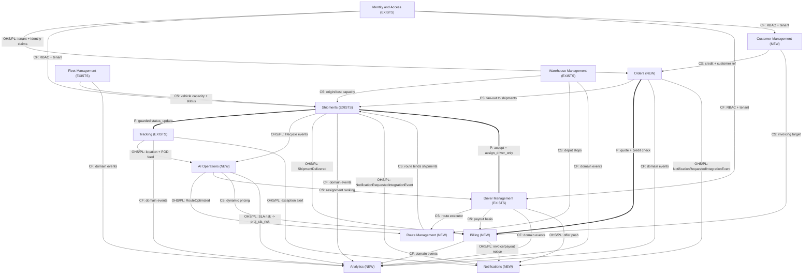
```mermaid
flowchart TB
  IDN["Identity and Access (EXISTS)"]
  CUS["Customer Management (NEW)"]
  ORD["Orders (NEW)"]
  SHP["Shipments (EXISTS)"]
  FLT["Fleet Management (EXISTS)"]
  DRV["Driver Management (EXISTS)"]
  RTE["Route Management (NEW)"]
  WHS["Warehouse Management (EXISTS)"]
  TRK["Tracking (EXISTS)"]
  NOT["Notifications (NEW)"]
  BIL["Billing (NEW)"]
  ANL["Analytics (NEW)"]
  AIO["AI Operations (NEW)"]

  IDN -->|"OHS/PL: tenant + identity claims"| ORD
  IDN -->|"CF: RBAC + tenant"| SHP
  IDN -->|"CF: RBAC + tenant"| DRV
  IDN -->|"CF: RBAC + tenant"| CUS

  CUS -->|"CS: credit + customer ref"| ORD
  ORD -->|"CS: fan-out to shipments"| SHP
  ORD ===|"P: quote + credit check"| BIL
  CUS -->|"CS: invoicing target"| BIL

  DRV ===|"P: accept = assign_driver_only"| SHP
  FLT -->|"CS: vehicle capacity + status"| SHP
  WHS -->|"CS: origin/dest capacity"| SHP
  SHP ===|"P: guarded status_update"| TRK

  RTE -->|"CS: route binds shipments"| SHP
  AIO -->|"OHS/PL: RouteOptimized"| RTE
  WHS -->|"CS: depot stops"| RTE
  DRV -->|"CS: route executor"| RTE

  TRK -->|"OHS/PL: location + POD feed"| AIO
  SHP -->|"OHS/PL: lifecycle events"| AIO
  AIO -->|"CS: assignment ranking"| DRV
  AIO -->|"CS: dynamic pricing"| BIL
  AIO -->|"OHS/PL: SLA risk -> proj_sla_risk"| ANL

  SHP -->|"OHS/PL: ShipmentDelivered"| BIL
  DRV -->|"CS: payout basis"| BIL

  SHP -->|"CF: domain events"| ANL
  DRV -->|"CF: domain events"| ANL
  FLT -->|"CF: domain events"| ANL
  WHS -->|"CF: domain events"| ANL
  ORD -->|"CF: domain events"| ANL
  TRK -->|"CF: domain events"| ANL
  BIL -->|"CF: domain events"| ANL

  SHP -->|"OHS/PL: NotificationRequestedIntegrationEvent"| NOT
  ORD -->|"OHS/PL: NotificationRequestedIntegrationEvent"| NOT
  DRV -->|"OHS/PL: offer push"| NOT
  BIL -->|"OHS/PL: invoice/payout notice"| NOT
  TRK -->|"OHS/PL: exception alert"| NOT
```

> Notation: a solid arrow `-->` is a directed Customer-Supplier / Conformist / OHS flow (label states which); a double line `===` marks a **Partnership** (mutually dependent, co-evolved). ACLs are applied by NEW contexts wrapping EXISTS contexts (see §3) and at external-system edges (maps, payment, SMS, ERP).

---

## 3. Upstream / downstream relationship table

| Context | Upstream (suppliers it depends on) | Downstream (consumers depending on it) | Relationship pattern (with key partners) | Integration mechanism |
|---|---|---|---|---|
| Identity & Access | — | All 12 contexts | OHS/PL (tenant+identity); downstream are Conformist | Sync API (JWT/claims) + domain event (`UserDeactivated`) |
| Customer Management | Identity | Orders, Billing | CS → Orders & Billing | Sync API + domain event (`CustomerCreditLimitChanged`) |
| Orders | Customer, Identity, Billing | Shipments, Analytics, Notifications | CS over Customer; **P** with Billing; CS → Shipments | Sync API + domain/integration events |
| Shipments | Orders, Driver, Fleet, Warehouse, Route, AI Ops | Tracking, Billing, Analytics, Notifications | **P** with Driver & Tracking; CS consumer of Fleet/Warehouse/Route | Sync API (assignment) + domain events |
| Fleet Management | Identity | Shipments, Analytics | CS → Shipments | Sync API (capacity/status) + `VehicleStatusChanged` |
| Driver Management | Identity, AI Ops, Shipments | Shipments, Route, Notifications, Analytics, Billing | **P** with Shipments; CF on AI Ops ranking | Sync API (offers/accept) + domain events |
| Route Management | AI Ops, Shipments, Warehouse, Driver | Shipments, Analytics, Tracking | CS consumer; CF/ACL on AI Ops; ACL on maps provider | Sync API + domain events |
| Warehouse Management | Identity | Shipments, Route, Analytics | CS → Shipments & Route | Sync API (capacity) + capacity-threshold events |
| Tracking | Shipments (partnership) | AI Ops, Analytics, Notifications | **P** with Shipments; OHS/PL to AI Ops/Analytics | Append-only events + domain events |
| Notifications | Shipments, Orders, Driver, Billing, Tracking | — (terminal sink) | CF on Published Language; ACL on each external channel | Integration event (`NotificationRequestedIntegrationEvent`) |
| Billing | Orders (P), Customer, Shipments, Driver, AI Ops | Notifications, Analytics | **P** with Orders; CS consumer of Shipments/Driver; ACL on payment/ERP | Integration event (`SettlementRequestedIntegrationEvent`) + domain events |
| Analytics | All write contexts | BI / control tower | CF on the published event language | Domain event consumption → projections (ADR-006) |
| AI Operations | Tracking, Shipments, Route, Warehouse, Driver | Driver, Route, Billing, Analytics | OHS/PL provider; CF on inbound feeds; ACL on model runtime | Domain events in → `PredictionGenerated` out |

---

## 4. Subdomain classification

| Context | Classification | Justification |
|---|---|---|
| Orders | **Core** | Splitting commercial intent and orchestrating fan-out into shipments is bespoke product logic and a competitive lever. |
| Shipments | **Core** | The operation's heart; richest invariant set (exclusivity, capacity, guarded lifecycle) already encoded in code. |
| Driver Management | **Core/Supporting** | Offer/accept matching + eligibility is differentiating (Core); profile/license bookkeeping is Supporting. |
| Route Management | **Core** | Route planning/optimization directly drives cost and SLA; a primary operational differentiator. |
| Tracking | **Core/Supporting** | Live location/POD/exception trail feeding ETA/SLA is Core; as an immutable audit ledger it is Supporting. |
| AI Operations | **Core** | ETA/SLA/pricing/assignment/forecast/anomaly intelligence is the strategic differentiator. |
| Customer Management | **Supporting** | Necessary commercial master data; not differentiating, standard CRM-style modeling. |
| Fleet Management | **Supporting** | Asset/maintenance bookkeeping that enables the core flow; standard lifecycle. |
| Warehouse Management | **Supporting** | Node capacity/receiving bookkeeping; enables core assignment, not a differentiator. |
| Billing | **Supporting** | Essential monetization but built on conventional quote/settlement/payout patterns. |
| Analytics | **Supporting** | Decision-support read models over the canonical event stream (ADR-006). |
| Identity & Access | **Generic/Supporting** | Auth mechanics are Generic (commodity); tenant/RBAC *policy* tailored to logistics is Supporting. |
| Notifications | **Generic** | Commodity multi-channel messaging; integrate, don't differentiate. |

---

## 5. Context → Aggregates → Events emitted / consumed

Event names are canonical (`<Aggregate><PastTenseVerb>`; integration events `*IntegrationEvent`). Each event carries `event_id` (UUIDv7), `tenant_id`, `aggregate_type`, `aggregate_id`, `aggregate_version`, `occurred_at`, `correlation_id`, `causation_id`, `payload` (per `docs/03` §7).

| Context | Owned Aggregates | Key Events Emitted | Key Events Consumed |
|---|---|---|---|
| Identity & Access | User/Role/Permission, Tenant | `UserRegistered`, `UserActivated`, `UserDeactivated`, `RoleAssigned`, `RoleRevoked`, `PermissionGranted`, `PermissionRevoked`, `TenantProvisioned`, `TenantSuspended` | — |
| Customer Management | Customer | `CustomerCreated`, `CustomerUpdated`, `CustomerDeactivated`, `CustomerCreditLimitChanged` | `UserRegistered`, `TenantProvisioned` |
| Orders | Order, OrderLine | `OrderCreated`, `OrderSubmitted`, `OrderApproved`, `OrderRejected`, `OrderCancelled`, `OrderFulfilmentStarted`, `OrderFulfilmentFailed`, `OrderCancellationFeeApplied`, `OrderCompleted` | `CustomerCreditLimitChanged`, `PriceQuoted`, `ShipmentDelivered`, `ShipmentFailed`, `ShipmentCancelled` |
| Shipments | Shipment, Assignment | `ShipmentCreated`, `ShipmentMarkedReady`, `ShipmentAssigned`, `ShipmentPickedUp` (assigned→in_transit), `ShipmentDelivered`, `ShipmentFailed`, `ShipmentReturned`, `ShipmentCancelled`, `ShipmentDelayed` (SLA overlay) | `OrderApproved`, `DriverAssigned`, `VehicleAssigned`, `WarehouseCapacityThresholdReached`, `RouteOptimized`, `PredictionGenerated` |
| Fleet Management | Vehicle | `VehicleRegistered`, `VehicleAssigned`, `VehicleReleased`, `VehicleStatusChanged`, `VehicleMaintenanceStarted`, `VehicleMaintenanceCompleted`, `VehicleDecommissioned` | `ShipmentAssigned`, `ShipmentDelivered`, `ShipmentCancelled` |
| Driver Management | Driver | `DriverCreated`, `DriverWentOnline`, `DriverWentOffline`, `DriverAssigned`, `DriverStatusChanged`, `DriverSuspended`, `DriverReinstated` | `ShipmentAssigned`, `ShipmentPickedUp`, `ShipmentDelivered`, `PredictionGenerated` (ranking), `UserDeactivated` |
| Route Management | Route, RouteStop | `RouteCreated`, `RoutePlanned`, `RouteOptimized`, `RouteStarted`, `RouteStopCompleted`, `RouteCompleted`, `RouteCancelled` | `ShipmentAssigned`, `ShipmentLocationReported`, `PredictionGenerated`, `WarehouseRegistered` |
| Warehouse Management | Warehouse | `WarehouseRegistered`, `ShipmentReceivedAtWarehouse`, `ShipmentDispatchedFromWarehouse`, `WarehouseCapacityThresholdReached`, `WarehouseCapacityExceeded` | `ShipmentCreated`, `ShipmentAssigned`, `ShipmentDelivered`, `ShipmentCancelled` |
| Tracking | ShipmentTrackingEvent | `ShipmentLocationReported`, `ProofOfDeliveryCaptured`, `ShipmentExceptionRaised` (+ carries guarded `status_update`) | `ShipmentAssigned`, `ShipmentPickedUp` |
| Notifications | Notification | `NotificationSent`, `NotificationFailed` | `NotificationRequestedIntegrationEvent` |
| Billing | Invoice, Settlement, Quote, Payout | `PriceQuoted`, `InvoiceGenerated`, `PaymentCaptured`, `PaymentFailed`, `DriverPayoutCalculated` | `OrderSubmitted`, `SettlementRequestedIntegrationEvent`, `ShipmentDelivered`, `ShipmentReturned`, `OrderCancellationFeeApplied` |
| Analytics | Projection, KPI (read-model) | `ProjectionRebuilt`, `KpiSnapshotComputed` | All domain events (write-side); notably `ShipmentAssigned`, `ShipmentDelivered`, `DriverWentOnline`, `WarehouseCapacityThresholdReached` |
| AI Operations | Prediction, Embedding, Feature | `PredictionRequested`, `PredictionGenerated`, `ModelFeedbackRecorded`, `AnomalyDetected` | `ShipmentLocationReported`, `ShipmentPickedUp`, `ShipmentDelivered`, `RoutePlanned`, `WarehouseCapacityThresholdReached` |

> **Integration-event boundaries.** `NotificationRequestedIntegrationEvent` and `SettlementRequestedIntegrationEvent` are the two explicit cross-boundary integration events (per `docs/event-catalog.md`); all other listed events are in-context domain events published to the in-process bus and the transactional outbox (ADR-004, `docs/03` §7) for asynchronous, idempotent consumption (`event_id` + `processed_events`).

---

## Part 2 — Event Storming

Status: **Draft for approval.** This section reconstructs the Mesaar domain as a Big-Picture / Process-Level Event Storming board. It is behavioral elaboration of the authoritative model — the shipment 8-state machine (`shipment_service.py`), exclusivity/capacity/eligibility guards, tenancy (ADR-001), the event model (ADR-004), and the event store (docs/03 §7) are **not redesigned here**. Existing contexts are marked **EXISTS**; target contexts are marked **NEW**. Reconciliation rules are applied throughout: `ShipmentPickedUp` is the `assigned → in_transit` transition (no separate "PickedUp" node), `ShipmentDelayed` is an SLA **overlay** policy (never a core state node), and a declined offer leaves the shipment **READY** with no state mutation.

### 2.1 Legend (Event Storming notation)

| Sticky | Colour | Meaning | Mermaid convention used in this doc |
|---|---|---|---|
| **Command** | Blue | An intent / imperative request to change state (`AssignDriver`). | `cmd` class, rectangle |
| **Domain Event** | Orange | An immutable fact that happened (`ShipmentAssigned`). Past tense. | `evt` class, rounded |
| **Actor** | Yellow | A human or role that issues commands. | `actor` class, stadium |
| **Policy / Reactive** | Lilac (purple) | A "whenever X then Y" reaction; listens to an event, issues a command/integration. | `pol` class, hexagon |
| **External System** | Pink | A system outside our boundary (SMS gateway, maps, payment, ML runtime). | `ext` class, rectangle |
| **Aggregate** | Tan | The consistency boundary that accepts the command and emits the event. | `agg` class, subroutine shape |
| **Read Model** | Green | A projection queried by UIs/policies (`proj_sla_risk`, ADR-006). | `rm` class |
| **Hotspot** | Red | A contested assumption / open question to resolve before build. | `hot` class |

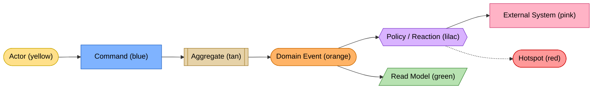
```mermaid
flowchart LR
  A(["Actor (yellow)"]):::actor --> C["Command (blue)"]:::cmd
  C --> AG[["Aggregate (tan)"]]:::agg
  AG --> E(["Domain Event (orange)"]):::evt
  E --> P{{"Policy / Reaction (lilac)"}}:::pol
  P --> X["External System (pink)"]:::ext
  E --> R[/"Read Model (green)"/]:::rm
  P -.-> H(["Hotspot (red)"]):::hot
  classDef actor fill:#ffe08a,stroke:#caa700,color:#000
  classDef cmd fill:#7fb3ff,stroke:#1f5fbf,color:#000
  classDef evt fill:#ffb366,stroke:#cc6a00,color:#000
  classDef pol fill:#d9b3ff,stroke:#7a33cc,color:#000
  classDef ext fill:#ffb3c6,stroke:#cc3366,color:#000
  classDef agg fill:#e6d2a8,stroke:#a37e2c,color:#000
  classDef rm fill:#b7e2b1,stroke:#3c8a36,color:#000
  classDef hot fill:#ff9999,stroke:#cc0000,color:#000
```

### 2.2 Inventory — Actors

| Actor | Role (code) | Context(s) | Issues commands for |
|---|---|---|---|
| **Client / Shipper** | `client` | Customer Mgmt (NEW), Orders (NEW) | Create/submit/cancel order, track shipment |
| **Dispatcher / Manager** | `manager` | Shipments, Driver, Fleet, Route | Approve order, mark ready, assign driver+vehicle, plan/optimize route |
| **Admin** | `admin` | Identity, all | Provision tenant, manage users/roles, suspend/reinstate driver, decommission vehicle |
| **Driver** | `driver` | Driver Mgmt, Shipments, Tracking | Go online/offline, accept/decline offer, confirm pickup, report location, deliver+POD, raise exception |
| **Warehouse Operator** | `manager` (warehouse-scoped) | Warehouse Mgmt | Receive package, dispatch package |
| **Fleet Maintenance** | `manager` (fleet-scoped) | Fleet Mgmt | Start/complete vehicle maintenance |
| **Billing Officer** | `manager`/system | Billing (NEW) | Quote price, generate invoice, calculate payout |
| **System / Scheduler** | (automated) | Analytics, AI Ops, Notifications, SLA | Run SLA sweep, rebuild projections, request predictions, fan out notifications |

### 2.3 Inventory — Commands

| Command | Actor | Target Aggregate | Context |
|---|---|---|---|
| `RegisterUser`, `ActivateUser`, `DeactivateUser`, `AssignRole`, `RevokeRole`, `ProvisionTenant`, `SuspendTenant` | Admin | User / Tenant | Identity (EXISTS) |
| `CreateCustomer`, `UpdateCustomer`, `DeactivateCustomer`, `ChangeCustomerCreditLimit` | Dispatcher/Admin | Customer | Customer Mgmt (NEW) |
| `CreateOrder`, `SubmitOrder`, `ApproveOrder`, `RejectOrder`, `CancelOrder`, `StartOrderFulfilment` | Client / Dispatcher | Order | Orders (NEW) |
| `CreateShipment`, `MarkShipmentReady`, `AssignDriverAndVehicle`, `AssignDriverOnly`, `ConfirmPickup`, `ReportLocation`, `DeliverShipment`, `CaptureProofOfDelivery`, `FailShipment`, `ReturnShipment`, `CancelShipment`, `RaiseShipmentException` | Dispatcher / Driver | Shipment | Shipments (EXISTS) |
| `RegisterVehicle`, `ChangeVehicleStatus`, `StartVehicleMaintenance`, `CompleteVehicleMaintenance`, `DecommissionVehicle`, `AssignVehicle`, `ReleaseVehicle` | Admin / Maintenance | Vehicle | Fleet (EXISTS) |
| `CreateDriver`, `GoOnline`, `GoOffline`, `AcceptOffer`, `DeclineOffer`, `SuspendDriver`, `ReinstateDriver` | Driver / Admin | Driver | Driver Mgmt (EXISTS) |
| `CreateRoute`, `PlanRoute`, `OptimizeRoute`, `StartRoute`, `CompleteRouteStop`, `CompleteRoute`, `CancelRoute` | Dispatcher | Route | Route Mgmt (NEW) |
| `RegisterWarehouse`, `ReceiveShipmentAtWarehouse`, `DispatchShipmentFromWarehouse` | Operator / Admin | Warehouse | Warehouse Mgmt (EXISTS) |
| `RequestNotification`, `SendNotification` | System | Notification | Notifications (NEW) |
| `QuotePrice`, `GenerateInvoice`, `CapturePayment`, `CalculateDriverPayout` | Billing / System | Invoice / Quote / Settlement | Billing (NEW) |
| `RebuildProjection`, `ComputeKpiSnapshot` | System | Projection / KPI | Analytics (NEW) |
| `RequestPrediction`, `RecordModelFeedback` | System | Prediction | AI Ops (NEW) |

### 2.4 Inventory — Domain Events

The full event catalog (payload schema, triggers, consumers) is enumerated in **Part 3 — Domain Event Catalog**. Every event carries `event_id` (UUIDv7 idempotency key), `tenant_id`, `aggregate_type`, `aggregate_id`, `aggregate_version`, `occurred_at`, `correlation_id`, `causation_id`, `payload` (jsonb) per docs/03 §7. Summary by context:

| Context | Domain Events (canonical) |
|---|---|
| Identity | `UserRegistered`, `UserActivated`, `UserDeactivated`, `RoleAssigned`, `RoleRevoked`, `PermissionGranted`, `PermissionRevoked`, `TenantProvisioned`, `TenantSuspended` |
| Customer | `CustomerCreated`, `CustomerUpdated`, `CustomerDeactivated`, `CustomerCreditLimitChanged` |
| Orders | `OrderCreated`, `OrderSubmitted`, `OrderApproved`, `OrderRejected`, `OrderCancelled`, `OrderFulfilmentStarted`, `OrderFulfilmentFailed`, `OrderCancellationFeeApplied`, `OrderCompleted` |
| Shipments | `ShipmentCreated`, `ShipmentMarkedReady`, `ShipmentAssigned`, `ShipmentPickedUp` (= entering `in_transit`), `ShipmentLocationReported`, `ShipmentDelayed` (SLA overlay), `ShipmentDelivered`, `ProofOfDeliveryCaptured`, `ShipmentFailed`, `ShipmentReturned`, `ShipmentCancelled`, `ShipmentExceptionRaised` |
| Driver | `DriverCreated`, `DriverWentOnline`, `DriverWentOffline`, `DriverAssigned`, `DriverStatusChanged`, `DriverSuspended`, `DriverReinstated` |
| Fleet | `VehicleRegistered`, `VehicleAssigned`, `VehicleReleased`, `VehicleStatusChanged`, `VehicleMaintenanceStarted`, `VehicleMaintenanceCompleted`, `VehicleDecommissioned` |
| Route | `RouteCreated`, `RoutePlanned`, `RouteOptimized`, `RouteStarted`, `RouteStopCompleted`, `RouteCompleted`, `RouteCancelled` |
| Warehouse | `WarehouseRegistered`, `ShipmentReceivedAtWarehouse`, `ShipmentDispatchedFromWarehouse`, `WarehouseCapacityThresholdReached`, `WarehouseCapacityExceeded` |
| Notifications | `NotificationRequestedIntegrationEvent`, `NotificationSent`, `NotificationFailed` |
| Billing | `PriceQuoted`, `SettlementRequestedIntegrationEvent`, `InvoiceGenerated`, `PaymentCaptured`, `PaymentFailed`, `DriverPayoutCalculated` |
| Analytics | `ProjectionRebuilt`, `KpiSnapshotComputed` |
| AI Ops | `PredictionRequested`, `PredictionGenerated`, `ModelFeedbackRecorded`, `AnomalyDetected` |

### 2.5 Inventory — Policies (reactive "whenever X then Y" rules)

| # | Policy (lilac) | Trigger event | Reaction (command / integration) | Notes |
|---|---|---|---|---|
| P1 | **Offer-Broadcast** | `ShipmentMarkedReady` | Query `proj_driver_status` for nearby available drivers → present offers (15s window) | Soft rule; offer window is advisory (re-queue after timeout) |
| P2 | **Offer-Timeout / Re-queue** | offer 15s elapsed, no accept | Re-broadcast to next driver; shipment stays **READY** | Decline = no state mutation |
| P3 | **Assignment-Notify** | `ShipmentAssigned` | `RequestNotification` (push to driver, info to client) | Integration event |
| P4 | **Driver-Status-Sync** | `ShipmentAssigned` / `ShipmentDelivered` / `ShipmentFailed` / `ShipmentReturned` | Update `proj_driver_status` (Assigned↔Available); emit `DriverStatusChanged` | Derived operational overlay |
| P5 | **Vehicle-Status-Sync** | `ShipmentAssigned` / shipment terminal | `VehicleAssigned` / `VehicleReleased`; update `proj_active_shipments` | Operational overlay Available/Assigned |
| P6 | **Warehouse-Load-Sync** | `ShipmentCreated` / `ShipmentAssigned` / shipment terminal / receive / dispatch | Recompute `proj_warehouse_load` | HARD capacity checked at create+assign |
| P7 | **Warehouse-Threshold-Alert** | `WarehouseCapacityThresholdReached` | `RequestNotification` to ops; flag in control tower | Soft (throughput target) |
| P8 | **Capacity-Exceeded-Block** | `WarehouseCapacityExceeded` (attempted) | Reject command (HARD); raise hotspot to dispatcher | Hard constraint at create/assign |
| P9 | **SLA-Risk-Sweep (Delayed overlay)** | scheduler tick vs `delivery_due_at` | If clock past threshold and not terminal → emit `ShipmentDelayed`; update `proj_sla_risk` | **Overlay only — never changes the 8-state node** |
| P10 | **ETA-Recompute** | `ShipmentLocationReported` / `ShipmentPickedUp` | `RequestPrediction` (ETA) to AI Ops | Feeds P9 |
| P11 | **Delivery-Settlement** | `ShipmentDelivered` | `SettlementRequestedIntegrationEvent`; `CalculateDriverPayout` | Billing (NEW) |
| P12 | **POD-Required-Gate** | `DeliverShipment` command | Require `ProofOfDeliveryCaptured` before/with `delivered` stamp | Process rule |
| P13 | **Order-Fulfilment** | `OrderApproved` | `StartOrderFulfilment` → `CreateShipment` (1..N) | Orders→Shipments (NEW) |
| P14 | **Order-Completion** | all child `ShipmentDelivered` | `OrderCompleted` | Fan-in |
| P15 | **Credit-Check** | `SubmitOrder` | Query Customer credit / `proj` → `ApproveOrder` or `OrderRejected` | Soft/Validation, Billing+Customer |
| P16 | **Exception-Escalation** | `ShipmentExceptionRaised` / `ShipmentFailed` | `RequestNotification` to ops; create control-tower task | Exception center |
| P17 | **Anomaly-Watch** | `ShipmentLocationReported` stream | `AnomalyDetected` (route deviation) → notify | AI Ops (NEW) |
| P18 | **Route-Bind** | `ShipmentAssigned` with route | Attach shipment to `RouteStop`; on `RouteStopCompleted` advance | Route Mgmt (NEW) |

### 2.6 Inventory — External Systems

| External System (pink) | Direction | Used by | Notes |
|---|---|---|---|
| **SMS / Push Gateway** (FCM/APNs/SMS) | outbound | Notifications | via `NotificationRequestedIntegrationEvent` |
| **Email Provider** | outbound | Notifications, Billing | invoices, alerts |
| **Maps / Geocoding / Routing API** | inbound/outbound | Route Mgmt, AI Ops | distance, sequencing, ETA inputs |
| **Payment Gateway / ERP** | outbound | Billing | `PaymentCaptured`, settlement |
| **OTP Provider** | outbound | Identity / Driver | phone login (currently stubbed) |
| **ML Runtime / Feature Store** | inbound/outbound | AI Ops | ETA/SLA/pricing/anomaly models |
| **Object Storage (POD evidence)** | outbound | Tracking | `evidence_url` for POD |

### 2.7 Inventory — Aggregates

| Aggregate (tan) | Owning Context | Status | Key invariants enforced |
|---|---|---|---|
| **User / Tenant** | Identity & Access | EXISTS | role domain; `is_active`; tenant isolation (RLS) |
| **Customer** | Customer Mgmt | NEW | credit limit; active state |
| **Order** | Orders | NEW | `draft→submitted→approved→fulfilling→completed`; cannot fulfil unless approved; completed/cancelled immutable |
| **Shipment** | Shipments | EXISTS (richest) | authoritative 8-state map; exclusivity; capacity; monotonic tracking; `reference_code` unique/tenant |
| **Vehicle** | Fleet | EXISTS | stored lifecycle `active/maintenance/decommissioned`; assignable only if `active` |
| **Driver** | Driver Mgmt | EXISTS | `is_available` + role=driver to assign; single active shipment; (proposed status machine) |
| **Route** | Route Mgmt | NEW | `created→planned→optimized→started→completed`; stops `pending→completed/skipped` |
| **Warehouse** | Warehouse Mgmt | EXISTS | weight/volume capacity (HARD); `max_daily_shipments` (soft) |
| **ShipmentTrackingEvent** | Tracking | EXISTS | append-only; monotonic `event_time`; guarded status change |
| **Notification** | Notifications | NEW | delivery attempt/retry |
| **Invoice / Quote / Settlement / Payout** | Billing | NEW | positive money; ISO-4217 currency |
| **Projection / KPI** | Analytics | NEW | idempotent rebuild; `as_of` |
| **Prediction / Embedding / Feature** | AI Ops | NEW | model+version provenance |

### 2.8 Core Process Catalog

`Process → Actor | Command | Aggregate | Business Rule(s) | Event(s) | Policy/Reaction | Outcome` (rule class: **H**=Hard, **S**=Soft, **V**=Validation).

| Process | Actor | Command | Aggregate | Business Rule(s) | Event(s) | Policy/Reaction | Outcome |
|---|---|---|---|---|---|---|---|
| Customer creates order | Client | `CreateOrder` → `SubmitOrder` | Order | V: required fields, positive money, ISO currency; H: tenant_id | `OrderCreated`, `OrderSubmitted` | P15 Credit-Check | Order `submitted`, awaiting approval |
| Order approved | Dispatcher | `ApproveOrder` | Order | H: cannot fulfil unless approved; S: credit ok | `OrderApproved` | P13 Order-Fulfilment → `CreateShipment` | Order `approved`, fulfilment starts |
| Shipment created | Dispatcher/System | `CreateShipment` | Shipment | V: weight>0, volume>0, ref 3-64 no-ws, warehouses exist; H: origin+dest warehouse capacity, ref unique/tenant | `ShipmentCreated` | P6 Warehouse-Load-Sync; notify client | Shipment `created` |
| Shipment marked ready | Dispatcher | `MarkShipmentReady` | Shipment | H: transition `created→ready` | `ShipmentMarkedReady` | P1 Offer-Broadcast | Shipment `ready`, enters dispatch queue |
| Dispatcher assigns driver+vehicle | Dispatcher | `AssignDriverAndVehicle` | Shipment | H: driver role+`is_available`; vehicle `active`; driver & vehicle exclusivity; vehicle capacity ≥ shipment; warehouse capacity; transition `created/ready→assigned` | `ShipmentAssigned`, `DriverAssigned`, `VehicleAssigned` | P3 Notify; P4 Driver-Sync; P5 Vehicle-Sync; P18 Route-Bind | Shipment `assigned`, `assigned_at` stamped |
| Driver self-accepts offer | Driver | `AcceptOffer` (= `AssignDriverOnly`) | Shipment + Driver | H: same assignment guards; only `available` drivers; S: 15s window | `ShipmentAssigned`, `DriverAssigned`, `DriverStatusChanged` | P3 Notify; P4 Driver-Sync | Shipment `assigned` to that driver |
| Driver declines offer | Driver | `DeclineOffer` | (none — no state change) | S: 15s window; **no mutation** | *(none)* | P2 Offer-Timeout/Re-queue | Shipment **stays READY**, re-offered |
| Driver confirms pickup | Driver | `ConfirmPickup` | Shipment | H: transition `assigned→in_transit` (= `ShipmentPickedUp`); monotonic event_time | `ShipmentPickedUp`, `ShipmentDispatchedFromWarehouse` | P10 ETA-Recompute | Shipment `in_transit` (state = "in transit") |
| Driver reports location | Driver | `ReportLocation` | ShipmentTrackingEvent | H: monotonic `event_time`; V: lat∈[-90,90], lng∈[-180,180] | `ShipmentLocationReported` | P10 ETA; P9 SLA-Sweep; P17 Anomaly-Watch | Live position updated, ETA refreshed |
| Driver completes delivery (+POD) | Driver | `CaptureProofOfDelivery` → `DeliverShipment` | Shipment + ShipmentTrackingEvent | H: transition `in_transit→delivered`; P12 POD required; stamps `delivered_at` | `ProofOfDeliveryCaptured`, `ShipmentDelivered` | P11 Settlement; P4/P5 release; P14 Order-Completion | Shipment `delivered` (terminal) |
| Delivery fails | Driver | `FailShipment` | Shipment | H: transition `in_transit→failed`; terminal/immutable | `ShipmentFailed`, `ShipmentExceptionRaised` | P16 Exception-Escalation; P4/P5 release | Shipment `failed` (terminal) |
| Shipment returned | Driver/Dispatcher | `ReturnShipment` | Shipment | H: transition `in_transit→returned`; compensating, not edit | `ShipmentReturned` | P16 Escalation; P11 settlement adjust | Shipment `returned` (terminal) |
| Customer cancels order/shipment | Client/Dispatcher | `CancelOrder` / `CancelShipment` | Order / Shipment | H (Shipment): cancel only from non-terminal (`created/ready/assigned→cancelled`, `in_transit` **not** cancellable); stamps `cancelled_at`. H (Order): cancellable from `submitted`/`approved` **and from `fulfilling`** → `cancelled` (**CF1 resolved — Phase 6.5, see `docs/09a`**); a `fulfilling → cancelled` fires the **compensation workflow** (cascade `ShipmentCancelled` to in-flight children; `OrderFulfilmentFailed` where a child cannot be unwound), an **audit event**, an **`OrderCancellationFeeApplied`** charge (Billing), and a **`NotificationRequestedIntegrationEvent`**. Only `completed` is non-cancellable. Both: completed/cancelled immutable | `OrderCancelled`, `OrderFulfilmentFailed`, `OrderCancellationFeeApplied`, `ShipmentCancelled` | P6 Warehouse-Load-Sync; P-CF1 cancellation-compensation; notify | Order/shipment `cancelled` (terminal) |
| Warehouse receives package | Operator | `ReceiveShipmentAtWarehouse` | Warehouse + Tracking | H: capacity not exceeded; append-only event | `ShipmentReceivedAtWarehouse` | P6 Load-Sync; P7 Threshold-Alert | Inventory load incremented |
| Warehouse capacity exceeded | System | (any create/assign/receive) | Warehouse | H: weight/volume over ACTIVE > capacity → reject | `WarehouseCapacityExceeded` (attempted) | P8 Capacity-Exceeded-Block → hotspot | Command rejected; dispatcher alerted |
| Vehicle maintenance start | Maintenance | `StartVehicleMaintenance` | Vehicle | H: transition `active→maintenance`; not on active shipment | `VehicleMaintenanceStarted`, `VehicleStatusChanged` | P5 mark unavailable | Vehicle `maintenance` (temporary OutOfService) |
| Vehicle maintenance complete | Maintenance | `CompleteVehicleMaintenance` | Vehicle | H: transition `maintenance→active` | `VehicleMaintenanceCompleted`, `VehicleStatusChanged` | P5 mark Available | Vehicle `active`, assignable |
| Route created | Dispatcher | `CreateRoute` | Route | V: valid stops/sequence | `RouteCreated` | P18 Route-Bind | Route `created` |
| Route optimized | Dispatcher/System | `OptimizeRoute` | Route | S: route efficiency / proximity preferences | `RoutePlanned`, `RouteOptimized` | Maps API; P18 bind | Route `optimized`, ready to start |

### 2.9 Big-Picture Event Storming Board

> **Scope note:** This board is a **representative slice** that traces the primary Command → Aggregate → Event → Policy → (Command/External) chains across the operational core (Orders, Shipments, Driver, Warehouse, Fleet, Route, SLA/AI-Ops, Billing, Notifications, Analytics) plus the supporting **Identity**, **Customer**, and **Tracking** contexts and the **AI-Ops feedback** loop. It is not exhaustive (full per-context detail lives in §2.3–§2.8 and Part 3). Every legend class referenced below — including the red **Hotspot** (`hot`) — is declared in this diagram's `classDef` block.

```mermaid
flowchart TB
  classDef actor fill:#ffe08a,stroke:#caa700,color:#000
  classDef cmd fill:#7fb3ff,stroke:#1f5fbf,color:#000
  classDef evt fill:#ffb366,stroke:#cc6a00,color:#000
  classDef pol fill:#d9b3ff,stroke:#7a33cc,color:#000
  classDef ext fill:#ffb3c6,stroke:#cc3366,color:#000
  classDef agg fill:#e6d2a8,stroke:#a37e2c,color:#000
  classDef rm fill:#b7e2b1,stroke:#3c8a36,color:#000
  classDef hot fill:#ff9999,stroke:#cc0000,color:#000

  subgraph IDN["Identity & Access (EXISTS)"]
    C_idn["ProvisionTenant / RegisterUser / AssignRole"]:::cmd --> AG_idn[["User / Tenant"]]:::agg
    AG_idn --> E_idn(["TenantProvisioned / UserRegistered"]):::evt
  end

  subgraph CUST["Customer Management (NEW)"]
    C_cust["CreateCustomer / ChangeCustomerCreditLimit"]:::cmd --> AG_cust[["Customer"]]:::agg
    AG_cust --> E_cust(["CustomerCreated / CustomerCreditLimitChanged"]):::evt
  end

  subgraph ORD["Orders (NEW)"]
    C_ord["CreateOrder / SubmitOrder / ApproveOrder"]:::cmd --> AG_ord[["Order"]]:::agg
    AG_ord --> E_sub(["OrderSubmitted"]):::evt
    E_sub --> P_credit{{"P15 Credit-Check"}}:::pol
    P_credit -. "reads credit" .-> AG_cust
    AG_ord --> E_ord(["OrderApproved"]):::evt
    E_ord --> P_ful{{"P13 Order-Fulfilment"}}:::pol
  end

  subgraph SHP["Shipments (EXISTS)"]
    P_ful --> C_create["CreateShipment"]:::cmd
    C_create --> AG_shp[["Shipment"]]:::agg
    AG_shp --> E_created(["ShipmentCreated"]):::evt
    E_created --> C_ready["MarkShipmentReady"]:::cmd --> AG_shp
    AG_shp --> E_ready(["ShipmentMarkedReady"]):::evt
    E_ready --> P_offer{{"P1 Offer-Broadcast"}}:::pol
    C_assign["AssignDriverAndVehicle"]:::cmd --> AG_shp
    AG_shp --> E_assigned(["ShipmentAssigned"]):::evt
    C_pickup["ConfirmPickup"]:::cmd --> AG_shp
    AG_shp --> E_picked(["ShipmentPickedUp (in_transit)"]):::evt
    C_deliver["DeliverShipment + CapturePOD"]:::cmd --> AG_shp
    AG_shp --> E_delivered(["ShipmentDelivered"]):::evt
    AG_shp --> E_failed(["ShipmentFailed / ShipmentReturned"]):::evt
  end

  subgraph TRK["Tracking (EXISTS)"]
    C_loc["ReportLocation / CaptureProofOfDelivery"]:::cmd --> AG_trk[["ShipmentTrackingEvent"]]:::agg
    AG_trk --> E_loc(["ShipmentLocationReported / ProofOfDeliveryCaptured"]):::evt
    E_loc --> P_anom{{"P17 Anomaly-Watch"}}:::pol
  end

  subgraph DRV["Driver Management (EXISTS)"]
    P_offer --> A_drv(["Driver"]):::actor
    A_drv --> C_accept["AcceptOffer / DeclineOffer"]:::cmd
    C_accept --> AG_drv[["Driver"]]:::agg
    AG_drv --> E_drvst(["DriverStatusChanged / DriverAssigned"]):::evt
    C_accept -. "accept" .-> C_assign
    C_accept -. "decline = stays READY" .-> P_offer
  end

  subgraph WH["Warehouse (EXISTS)"]
    AG_wh[["Warehouse"]]:::agg --> E_recv(["ShipmentReceivedAtWarehouse"]):::evt
    AG_wh --> E_capx(["WarehouseCapacityExceeded"]):::evt
    E_capx --> P_block{{"P8 Capacity-Block"}}:::pol
    P_block -.-> HOT1(["Hotspot: hard-block vs queue?"]):::hot
  end

  subgraph FLEET["Fleet (EXISTS)"]
    C_maint["StartVehicleMaintenance"]:::cmd --> AG_veh[["Vehicle"]]:::agg
    AG_veh --> E_veh(["VehicleStatusChanged"]):::evt
  end

  subgraph RTE["Route (NEW)"]
    C_route["CreateRoute / OptimizeRoute"]:::cmd --> AG_rte[["Route"]]:::agg
    AG_rte --> E_rte(["RouteOptimized"]):::evt
    E_rte --> EXT_maps["Maps / Routing API"]:::ext
  end

  subgraph SLA["SLA + AI Ops (NEW)"]
    E_picked --> P_eta{{"P10 ETA-Recompute"}}:::pol
    P_eta --> EXT_ml["ML Runtime"]:::ext
    EXT_ml --> E_pred(["PredictionGenerated"]):::evt
    E_pred --> P_feedback{{"AI-Ops feedback: ModelFeedbackRecorded"}}:::pol
    P_sla{{"P9 SLA-Sweep"}}:::pol --> E_delayed(["ShipmentDelayed (overlay)"]):::evt
    E_delayed --> RM_sla[/"proj_sla_risk"/]:::rm
  end

  subgraph BILL["Billing (NEW)"]
    E_delivered --> P_settle{{"P11 Delivery-Settlement"}}:::pol
    P_settle --> E_settle(["SettlementRequestedIntegrationEvent"]):::evt
    P_settle --> EXT_pay["Payment / ERP"]:::ext
  end

  subgraph NOTIF["Notifications (NEW)"]
    E_assigned --> P_notify{{"P3 Assignment-Notify"}}:::pol
    P_notify --> E_notif(["NotificationRequestedIntegrationEvent"]):::evt
    E_notif --> EXT_sms["SMS / Push Gateway"]:::ext
  end

  subgraph ANALYTICS["Analytics (NEW)"]
    E_assigned --> RM_active[/"proj_active_shipments"/]:::rm
    E_drvst --> RM_drv[/"proj_driver_status"/]:::rm
    E_recv --> RM_wh[/"proj_warehouse_load"/]:::rm
  end

  E_delivered --> P_complete{{"P14 Order-Completion"}}:::pol
  P_complete --> AG_ord
```

### 2.10 Process Flow (a) — Happy Path: create → ready → assign → pickup → location → deliver+POD

```mermaid
sequenceDiagram
  actor Disp as "Dispatcher"
  actor Drv as "Driver"
  participant Shp as "Shipment (aggregate)"
  participant Trk as "Tracking"
  participant Proj as "Projections (ADR-006)"
  participant Bill as "Billing"

  Disp->>Shp: CreateShipment
  Note over Shp: HARD warehouse capacity + ref unique
  Shp-->>Proj: ShipmentCreated  [state: created]
  Disp->>Shp: MarkShipmentReady
  Shp-->>Proj: ShipmentMarkedReady  [state: ready]
  Disp->>Shp: AssignDriverAndVehicle
  Note over Shp: HARD exclusivity + vehicle active + capacity
  Shp-->>Proj: "ShipmentAssigned + DriverAssigned + VehicleAssigned"  [state: assigned]
  Drv->>Shp: ConfirmPickup
  Note over Shp: transition assigned -> in_transit
  Shp-->>Proj: "ShipmentPickedUp"  [state: in_transit]
  loop while moving
    Drv->>Trk: ReportLocation
    Note over Trk: monotonic event_time
    Trk-->>Proj: ShipmentLocationReported
  end
  Drv->>Trk: CaptureProofOfDelivery
  Trk-->>Proj: ProofOfDeliveryCaptured
  Drv->>Shp: DeliverShipment
  Note over Shp: POD-gate (P12) — POD captured before delivered stamp; transition in_transit -> delivered, stamp delivered_at
  Shp-->>Proj: ShipmentDelivered  [state: delivered TERMINAL]
  Shp-->>Bill: SettlementRequestedIntegrationEvent
```

### 2.11 Process Flow (b) — Driver Offer Accept / Decline

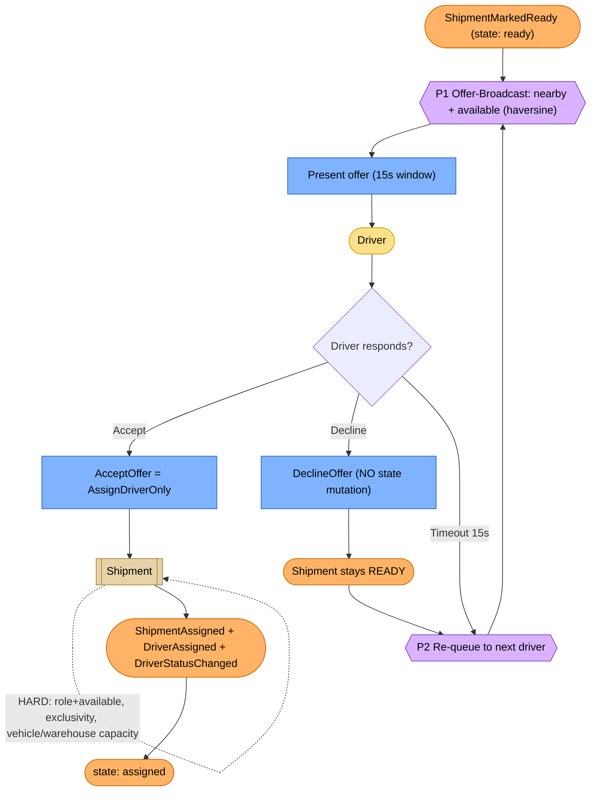
```mermaid
flowchart TD
  classDef actor fill:#ffe08a,stroke:#caa700,color:#000
  classDef cmd fill:#7fb3ff,stroke:#1f5fbf,color:#000
  classDef evt fill:#ffb366,stroke:#cc6a00,color:#000
  classDef pol fill:#d9b3ff,stroke:#7a33cc,color:#000
  classDef agg fill:#e6d2a8,stroke:#a37e2c,color:#000

  R(["ShipmentMarkedReady (state: ready)"]):::evt --> P1{{"P1 Offer-Broadcast: nearby + available (haversine)"}}:::pol
  P1 --> OFFER["Present offer (15s window)"]:::cmd
  OFFER --> DRV(["Driver"]):::actor
  DRV --> Q{"Driver responds?"}
  Q -- "Accept" --> ACC["AcceptOffer = AssignDriverOnly"]:::cmd
  ACC --> AGG[["Shipment"]]:::agg
  AGG -. "HARD: role+available, exclusivity, vehicle/warehouse capacity" .-> AGG
  AGG --> E1(["ShipmentAssigned + DriverAssigned + DriverStatusChanged"]):::evt
  E1 --> DONE(["state: assigned"]):::evt
  Q -- "Decline" --> DEC["DeclineOffer (NO state mutation)"]:::cmd
  DEC --> STAY(["Shipment stays READY"]):::evt
  STAY --> P2{{"P2 Re-queue to next driver"}}:::pol
  P2 --> P1
  Q -- "Timeout 15s" --> P2
```

### 2.12 Process Flow (c) — Failure / Return / Cancellation

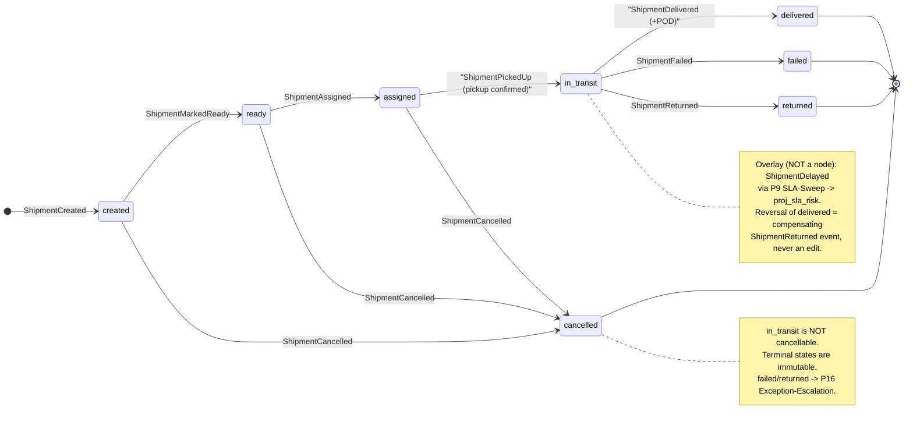
```mermaid
stateDiagram-v2
  direction LR
  [*] --> created: ShipmentCreated
  created --> ready: ShipmentMarkedReady
  created --> cancelled: ShipmentCancelled
  ready --> assigned: ShipmentAssigned
  ready --> cancelled: ShipmentCancelled
  assigned --> in_transit: "ShipmentPickedUp (pickup confirmed)"
  assigned --> cancelled: ShipmentCancelled
  in_transit --> delivered: "ShipmentDelivered (+POD)"
  in_transit --> failed: ShipmentFailed
  in_transit --> returned: ShipmentReturned

  delivered --> [*]
  cancelled --> [*]
  failed --> [*]
  returned --> [*]

  note right of in_transit
    Overlay (NOT a node): ShipmentDelayed
    via P9 SLA-Sweep -> proj_sla_risk.
    Reversal of delivered = compensating
    ShipmentReturned event, never an edit.
  end note
  note right of cancelled
    in_transit is NOT cancellable.
    Terminal states are immutable.
    failed/returned -> P16 Exception-Escalation.
  end note
```

**Reconciliation reminders embedded above:** (1) `ShipmentPickedUp` is the single `assigned → in_transit` transition — there is no separate "PickedUp" state and "in transit" is the resulting state. (2) `ShipmentDelayed` is an orthogonal SLA overlay produced by policy **P9**, surfaced through `proj_sla_risk` (ADR-006); it never appears as a node in the authoritative 8-state machine. (3) A declined offer triggers **no command against the Shipment aggregate** — the shipment remains `ready` and is re-queued by **P2**. (4) Vehicle "OutOfService" maps to `maintenance` (temporary) or `decommissioned` (permanent); operational Available/Assigned is a derived overlay, not a stored field. (5) Order cancellation is permitted only from `submitted`/`approved`; once an order reaches `fulfilling` or `completed` it is no longer cancellable, and completed/cancelled orders are immutable.

---

## Part 3 — Domain Event Catalog

This catalog enumerates **every** canonical domain and integration event across the 13 bounded contexts of Mesaar. It is authoritative for Phase 4 and is consistent with `docs/event-catalog.md` (Shipment producer/consumer mappings), ADR-004 (CQRS-lite event model), ADR-006 (projection read-models), and the event store / transactional outbox designed in `docs/03-database-architecture.md` sections 6 (Audit) and 7 (Event Store). It does **not** redesign those decisions; it elaborates them behaviorally.

### 3.0 Event envelope and conventions (stated once)

Every event — domain or integration — is appended to `event_store` in the **same transaction** that mutates its producing aggregate (transactional outbox, ADR-004). It is **immutable and append-only**; reversals are new compensating events, never edits or deletes. Each event carries the canonical envelope (`docs/03` section 7):

| Field | Meaning |
|---|---|
| `event_id` | UUIDv7, monotonic, **idempotency key** — consumers dedupe on it via `processed_events(consumer, event_id)`. |
| `tenant_id` | Tenancy scope (ADR-001); all consumption is RLS-scoped. |
| `aggregate_type` | Producing aggregate class (e.g. `Shipment`, `Order`). |
| `aggregate_id` | Producing aggregate instance id. |
| `aggregate_version` | Optimistic-concurrency version; `UNIQUE(aggregate_id, aggregate_version)` gives total per-aggregate order. |
| `occurred_at` | Domain time of the transition. |
| `correlation_id` | Ties all events of one business flow (e.g. one order's fulfilment). |
| `causation_id` | `event_id` of the event/command that caused this one. |
| `payload` | `jsonb` — the event-specific key fields listed in the tables below. |

**Naming convention:** `<Aggregate><PastTenseVerb>` (e.g. `ShipmentAssigned`). **Integration events** that cross a context boundary toward an external system or independently-deployed consumer (ERP, notification gateway, settlement) are suffixed `*IntegrationEvent`. All other events are **internal domain events** consumed in-process by projection builders and Celery workers (ADR-003/006).

**Guarantees (catalog-wide):**
- **Ordering** is guaranteed **per-aggregate** (via `aggregate_version` / `UNIQUE`, and for tracking via monotonic `event_time`). There is **no** global cross-aggregate ordering — consumers must tolerate interleaving and use `correlation_id` to reassemble a flow.
- **Idempotency** is mandatory: every consumer is idempotent and dedupes on `event_id`.
- **Compensation:** state reversals are modeled as new forward events (e.g. `ShipmentReturned` after `ShipmentDelivered`, `OrderCancelled`, `VehicleReleased`), never as history mutation.
- **Replay** rebuilds **projections**, not aggregates (CQRS-lite; the relational row is the current-state snapshot).

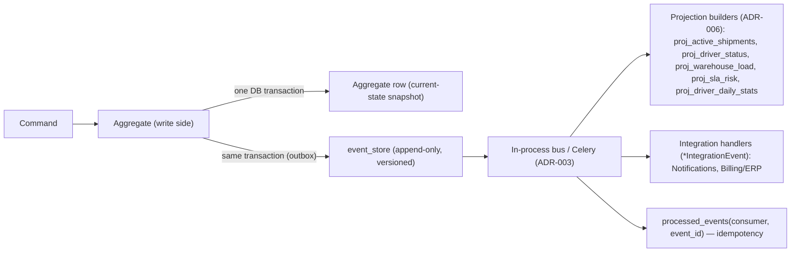
```mermaid
flowchart LR
  CMD["Command"] --> AGG["Aggregate (write side)"]
  AGG -->|"one DB transaction"| ROW["Aggregate row (current-state snapshot)"]
  AGG -->|"same transaction (outbox)"| ES["event_store (append-only, versioned)"]
  ES --> BUS["In-process bus / Celery (ADR-003)"]
  BUS --> PROJ["Projection builders (ADR-006): proj_active_shipments, proj_driver_status, proj_warehouse_load, proj_sla_risk, proj_driver_daily_stats"]
  BUS --> INT["Integration handlers (*IntegrationEvent): Notifications, Billing/ERP"]
  BUS --> DEDUP["processed_events(consumer, event_id) — idempotency"]
```

---

### 3.1 Identity & Access context (EXISTS)

Producer aggregates: `IdentityAccess.User`, `IdentityAccess.Tenant`, `IdentityAccess.RoleAssignment`.

| Event | Type | Description | Producer | Consumers | Payload (key fields) | Business Meaning / Triggers |
|---|---|---|---|---|---|---|
| `UserRegistered` | Domain | A user account is created. | User | Notifications, Analytics | user_id, email/phone, role, tenant_id | User onboarding; signup or admin-provisioning. |
| `UserActivated` | Domain | Account enabled (`is_active=true`). | User | proj_driver_status (if driver), Notifications | user_id | Account becomes usable; may unblock driver availability. |
| `UserDeactivated` | Domain | Account disabled (`is_active=false`). | User | Session/token revocation, Driver Management (→ `DriverSuspended`), proj_driver_status | user_id, reason | Disables login; cascades to driver suspension. |
| `RoleAssigned` | Domain | A role is granted to a user. | RoleAssignment | RBAC cache, Analytics | user_id, role | Authorization change. |
| `RoleRevoked` | Domain | A role is removed. | RoleAssignment | RBAC cache, Analytics | user_id, role | Authorization change. |
| `PermissionGranted` | Domain | A fine-grained permission is granted. | RoleAssignment | RBAC cache | user_id/role, permission | Policy refinement. |
| `PermissionRevoked` | Domain | A permission is removed. | RoleAssignment | RBAC cache | user_id/role, permission | Policy refinement. |
| `TenantProvisioned` | Domain | A new tenant is created. | Tenant | All contexts (bootstrap), Analytics | tenant_id, plan | Multitenancy onboarding (ADR-001). |
| `TenantSuspended` | Domain | A tenant is suspended. | Tenant | Auth gateway, all read models | tenant_id, reason | Global block on tenant access. |

---

### 3.2 Customer Management context (NEW)

Producer aggregate: `CustomerManagement.Customer`.

| Event | Type | Description | Producer | Consumers | Payload (key fields) | Business Meaning / Triggers |
|---|---|---|---|---|---|---|
| `CustomerCreated` | Domain | A customer/shipper org profile is created. | Customer | Orders, Billing, Analytics | customer_id, name, contacts, credit_limit | Establishes the commercial counterparty for Orders. |
| `CustomerUpdated` | Domain | Profile/contact data changed. | Customer | Orders, Billing | customer_id, changed_fields | Master-data maintenance. |
| `CustomerDeactivated` | Domain | Customer can no longer place orders. | Customer | Orders (block intake), Billing | customer_id, reason | Commercial offboarding/hold. |
| `CustomerCreditLimitChanged` | Domain | Credit limit adjusted. | Customer | Billing, Orders (approval/credit check) | customer_id, old_limit, new_limit | Drives order-approval credit gate. |

---

### 3.3 Orders context (NEW, Core)

Producer aggregate: `Orders.Order` (commercial request/contract; fans out to 1+ Shipments). See Order state machine below.

| Event | Type | Description | Producer | Consumers | Payload (key fields) | Business Meaning / Triggers |
|---|---|---|---|---|---|---|
| `OrderCreated` | Domain | Draft order captured. | Order | Billing (`PriceQuoted`), Analytics | order_id, customer_id, line_items, requested_window | Customer intent recorded (`draft`). |
| `OrderSubmitted` | Domain | Order submitted for approval. | Order | Billing (credit check), Notifications | order_id | `draft → submitted`. |
| `OrderApproved` | Domain | Order approved (credit + validation passed). | Order | Shipments (creation), Route Management, Notifications | order_id, approved_by | `submitted → approved`; precondition for fulfilment. |
| `OrderRejected` | Domain | Order declined. | Order | Notifications, Analytics | order_id, reason | `submitted → rejected` (terminal). |
| `OrderCancelled` | Domain | Order cancelled before completion. | Order | Shipments (cancel fan-out), Billing, Notifications | order_id, reason | `submitted`/`approved` → `cancelled` (terminal). |
| `OrderFulfilmentStarted` | Domain | Fulfilment orchestration begins; shipments spawned. | Order | Shipments, Route Management, Analytics | order_id, shipment_ids | `approved → fulfilling`; cannot start unless approved. |
| `OrderCompleted` | Domain | All child shipments reached terminal-success. | Order | Billing (`InvoiceGenerated`), Analytics, Notifications | order_id, completed_at | `fulfilling → completed` (terminal, immutable). |

---

### 3.4 Shipments context (EXISTS, Core — richest)

Producer aggregate: `Shipments.Shipment` (+ assignment). Producer/consumer mappings align with `docs/event-catalog.md`. `ShipmentPickedUp` **is** the `assigned → in_transit` transition (entering `in_transit`); there is no separate stored "PickedUp" or "InTransit" state. `ShipmentDelayed` is an **SLA overlay** (projection `proj_sla_risk`), not a state-machine node.

| Event | Type | Description | Producer | Consumers | Payload (key fields) | Business Meaning / Triggers |
|---|---|---|---|---|---|---|
| `ShipmentCreated` | Domain | A shipment (execution unit) is created. | Shipment | proj_warehouse_load, Notifications (client), Analytics | shipment_id, reference_code, client_id, origin/dest warehouse, weight_kg, volume_m3 | `create_shipment()`; state `created`. May be spawned by `OrderFulfilmentStarted`. |
| `ShipmentMarkedReady` | Domain | Shipment becomes dispatch-ready. | Shipment | Dispatch queue, Driver Management (offers), proj_active_shipments | shipment_id | `created → ready`; enters offer pool for nearby drivers. |
| `ShipmentAssigned` | Domain | Driver (+vehicle) bound to shipment. | Shipment | Driver push (Notifications), proj_active_shipments, proj_driver_status, Fleet (`VehicleAssigned`) | shipment_id, driver_id, vehicle_id, assigned_at | `assign_driver_and_vehicle()` / `assign_driver_only()`; `created`/`ready → assigned`. Enforces exclusivity, capacity, eligibility (hard rules). |
| `ShipmentPickedUp` | Domain | Pickup confirmed; shipment in transit. | Shipment | ETA worker (AI Ops), client tracking, Route Management, proj_active_shipments | shipment_id, event_time | `assigned → in_transit`. **== entering `in_transit`** (no separate state). |
| `ShipmentLocationReported` | Domain | A GPS ping / location update. | Shipment (Tracking event) | Live-map projection, ETA/AI Ops, proj_sla_risk | shipment_id, lat, lng, event_time | Tracking `location_update`; monotonic `event_time`. High-volume stream. |
| `ShipmentDelayed` | Domain | SLA-risk overlay raised. | Shipment (derived) | proj_sla_risk, Notifications, Analytics, AI Ops | shipment_id, delivery_due_at, projected_eta, risk_level | **Overlay only** — clock vs `delivery_due_at`; never a state node. |
| `ShipmentDelivered` | Domain | Shipment delivered. | Shipment | `SettlementRequestedIntegrationEvent`, proj_driver_daily_stats, Notifications, Orders (completion check) | shipment_id, delivered_at, evidence_url | `in_transit → delivered`; stamps `delivered_at`. |
| `ProofOfDeliveryCaptured` | Domain | POD evidence recorded. | Shipment (Tracking event) | Document store, Billing/settlement | shipment_id, evidence_url, recorded_by | Tracking `proof_of_delivery`; supports settlement. |
| `ShipmentFailed` | Domain | Delivery failed. | Shipment | Exception center, Notifications, Analytics | shipment_id, failure_reason | `in_transit → failed` (terminal). |
| `ShipmentReturned` | Domain | Shipment returned. | Shipment | Exception center, Billing/settlement | shipment_id, reason | `in_transit → returned` (terminal); compensating outcome. |
| `ShipmentCancelled` | Domain | Shipment cancelled pre-transit. | Shipment | proj_warehouse_load, Notifications, Fleet (`VehicleReleased`) | shipment_id, cancelled_at, reason | From `created`/`ready`/`assigned → cancelled` (terminal). Frees warehouse/vehicle/driver capacity. |
| `ShipmentExceptionRaised` | Domain | An operational exception logged. | Shipment (Tracking event) | Exception center, SLA/AI Ops anomaly | shipment_id, notes | Tracking `exception`; does not change core state. |

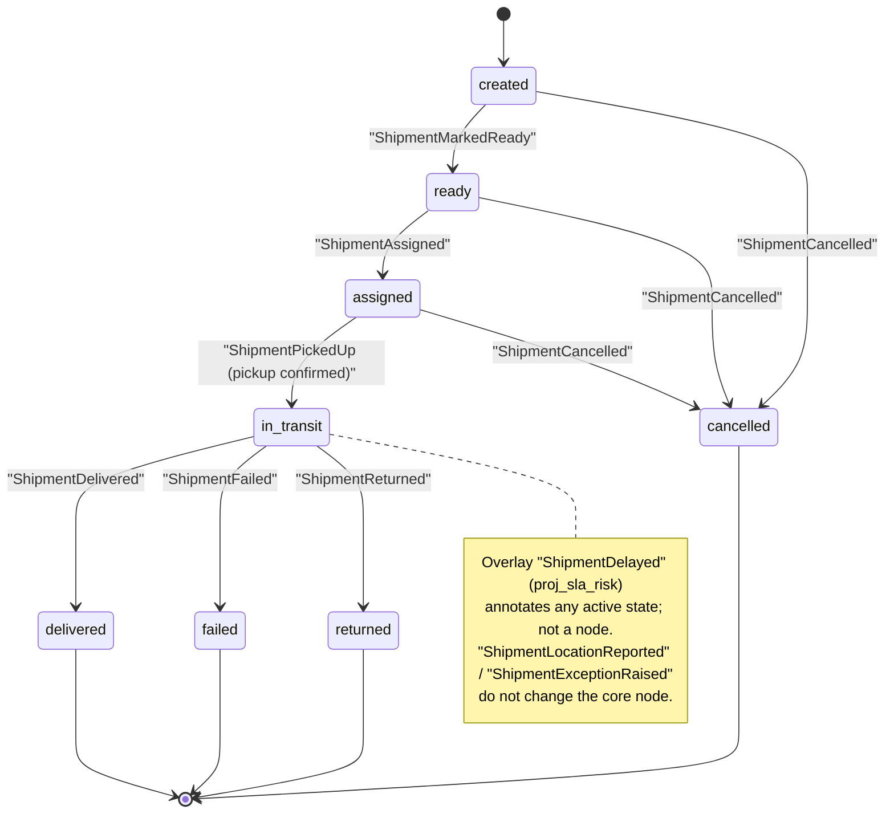
```mermaid
stateDiagram-v2
  [*] --> created
  created --> ready: "ShipmentMarkedReady"
  created --> cancelled: "ShipmentCancelled"
  ready --> assigned: "ShipmentAssigned"
  ready --> cancelled: "ShipmentCancelled"
  assigned --> in_transit: "ShipmentPickedUp (pickup confirmed)"
  assigned --> cancelled: "ShipmentCancelled"
  in_transit --> delivered: "ShipmentDelivered"
  in_transit --> failed: "ShipmentFailed"
  in_transit --> returned: "ShipmentReturned"
  delivered --> [*]
  cancelled --> [*]
  failed --> [*]
  returned --> [*]
  note right of in_transit
    Overlay "ShipmentDelayed" (proj_sla_risk)
    annotates any active state; not a node.
    "ShipmentLocationReported" / "ShipmentExceptionRaised"
    do not change the core node.
  end note
```

---

### 3.5 Driver Management context (EXISTS; state machine PROPOSED)

Producer aggregate: `DriverManagement.Driver`. **The driver state machine is PROPOSED** (no driver status enum in code today — only `is_available` bool + `user.is_active`); states `offline`/`available`/`assigned`/`busy`/`suspended` are target design.

| Event | Type | Description | Producer | Consumers | Payload (key fields) | Business Meaning / Triggers |
|---|---|---|---|---|---|---|
| `DriverCreated` | Domain | Driver profile created (linked to driver-role user). | Driver | proj_driver_status, Analytics | driver_id, user_id, license_*, home_warehouse | Onboarding a driver. |
| `DriverWentOnline` | Domain | Driver sets availability on. | Driver | proj_driver_status, Dispatch (offer pool) | driver_id, at | `is_available=true`; `offline → available`. Enters offer eligibility. |
| `DriverWentOffline` | Domain | Driver sets availability off. | Driver | proj_driver_status, Dispatch | driver_id, at | `is_available=false`; `available → offline`. Removed from offers. |
| `DriverAssigned` | Domain | Driver bound to an active shipment. | Driver | proj_driver_status, Route Management | driver_id, shipment_id | Mirrors `ShipmentAssigned`; `available → assigned`. Enforces single active shipment. |
| `DriverStatusChanged` | Domain | Proposed status transition (derived from shipment phase). | Driver | proj_driver_status, Analytics | driver_id, from, to | Generic status change (e.g. `assigned → busy` on pickup, `busy → available` on terminal). |
| `DriverSuspended` | Domain | Driver suspended (admin / `user.is_active=false`). | Driver | Dispatch (remove), Notifications, proj_driver_status | driver_id, reason | `any → suspended`; blocks offers/assignment. |
| `DriverReinstated` | Domain | Suspension lifted. | Driver | proj_driver_status, Notifications | driver_id | `suspended → offline`. |

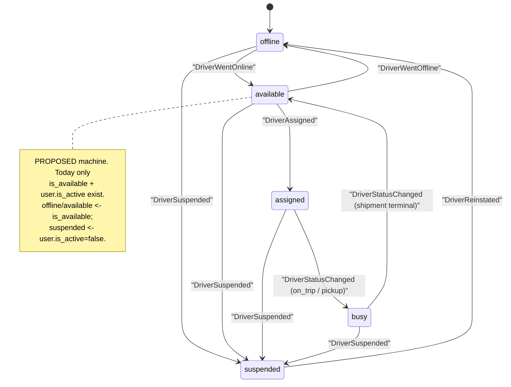
```mermaid
stateDiagram-v2
  [*] --> offline
  offline --> available: "DriverWentOnline"
  available --> offline: "DriverWentOffline"
  available --> assigned: "DriverAssigned"
  assigned --> busy: "DriverStatusChanged (on_trip / pickup)"
  busy --> available: "DriverStatusChanged (shipment terminal)"
  offline --> suspended: "DriverSuspended"
  available --> suspended: "DriverSuspended"
  assigned --> suspended: "DriverSuspended"
  busy --> suspended: "DriverSuspended"
  suspended --> offline: "DriverReinstated"
  note right of available
    PROPOSED machine. Today only
    is_available + user.is_active exist.
    offline/available <- is_available;
    suspended <- user.is_active=false.
  end note
```

---

### 3.6 Fleet Management context (EXISTS)

Producer aggregate: `Fleet.Vehicle`. Stored lifecycle enum `{active, maintenance, decommissioned}` is AUTHORITATIVE; operational `{Available, Assigned}` is **derived overlay**.

| Event | Type | Description | Producer | Consumers | Payload (key fields) | Business Meaning / Triggers |
|---|---|---|---|---|---|---|
| `VehicleRegistered` | Domain | Vehicle added to fleet. | Vehicle | Eligibility, Analytics | vehicle_id, capacity_weight_kg, capacity_volume_m3, type | Onboarding; status `active`. |
| `VehicleAssigned` | Domain | Vehicle bound to an active shipment. | Vehicle | proj_active_shipments (overlay → Assigned), Eligibility | vehicle_id, shipment_id | Derived from `ShipmentAssigned`; vehicle exclusivity (hard). |
| `VehicleReleased` | Domain | Vehicle freed from a shipment. | Vehicle | Eligibility (overlay → Available), Dispatch | vehicle_id, shipment_id | On shipment terminal/cancel; restores `Available`. |
| `VehicleStatusChanged` | Domain | Stored lifecycle status change. | Vehicle | Eligibility, capacity, Analytics | vehicle_id, from, to | Generic enum transition. |
| `VehicleMaintenanceStarted` | Domain | Vehicle enters maintenance. | Vehicle | Eligibility (ineligible), Dispatch | vehicle_id, reason | `active → maintenance` (temporary OutOfService). |
| `VehicleMaintenanceCompleted` | Domain | Maintenance done. | Vehicle | Eligibility (eligible again) | vehicle_id | `maintenance → active`. |
| `VehicleDecommissioned` | Domain | Vehicle permanently retired. | Vehicle | Eligibility, Analytics | vehicle_id, reason | `active`/`maintenance → decommissioned` (terminal, permanent OutOfService). |

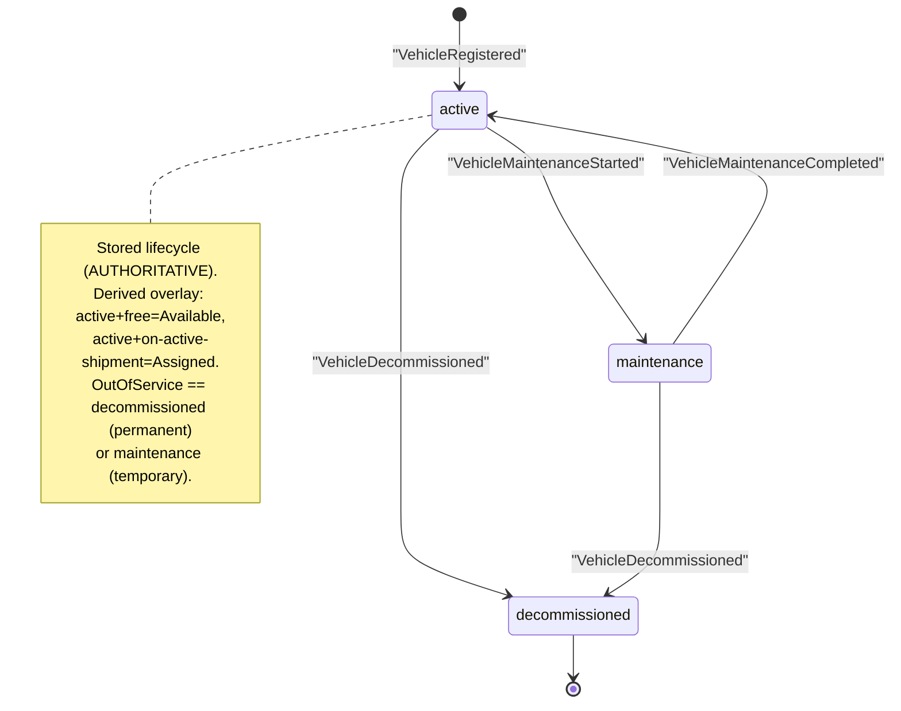
```mermaid
stateDiagram-v2
  [*] --> active: "VehicleRegistered"
  active --> maintenance: "VehicleMaintenanceStarted"
  maintenance --> active: "VehicleMaintenanceCompleted"
  active --> decommissioned: "VehicleDecommissioned"
  maintenance --> decommissioned: "VehicleDecommissioned"
  decommissioned --> [*]
  note right of active
    Stored lifecycle (AUTHORITATIVE).
    Derived overlay: active+free=Available,
    active+on-active-shipment=Assigned.
    OutOfService == decommissioned (permanent)
    or maintenance (temporary).
  end note
```

---

### 3.7 Route Management context (NEW, Core)

Producer aggregate: `RouteManagement.Route` (+ `RouteStop`). State machine PROPOSED.

| Event | Type | Description | Producer | Consumers | Payload (key fields) | Business Meaning / Triggers |
|---|---|---|---|---|---|---|
| `RouteCreated` | Domain | A route shell created. | Route | Analytics | route_id, shipment_ids | `created`; grouping of stops/shipments. |
| `RoutePlanned` | Domain | Stops sequenced into a plan. | Route | Dispatch, AI Ops (ETA) | route_id, stops[] | `created → planned`. |
| `RouteOptimized` | Domain | Plan optimized (sequence/ETA). | Route | Dispatch, AI Ops | route_id, optimized_sequence, total_eta | `planned → optimized`. |
| `RouteStarted` | Domain | Driver begins the route. | Route | Tracking, proj_active_shipments | route_id, started_at | `optimized → started`. |
| `RouteStopCompleted` | Domain | A stop completed/skipped. | Route (RouteStop) | proj_active_shipments, Analytics | route_id, stop_id, outcome | Stop `pending → completed/skipped`. |
| `RouteCompleted` | Domain | All stops resolved. | Route | Billing, Analytics | route_id, completed_at | `started → completed` (terminal). |
| `RouteCancelled` | Domain | Route aborted/cancelled. | Route | Dispatch, Notifications | route_id, reason | `planned`/`optimized`/`started → cancelled`. |

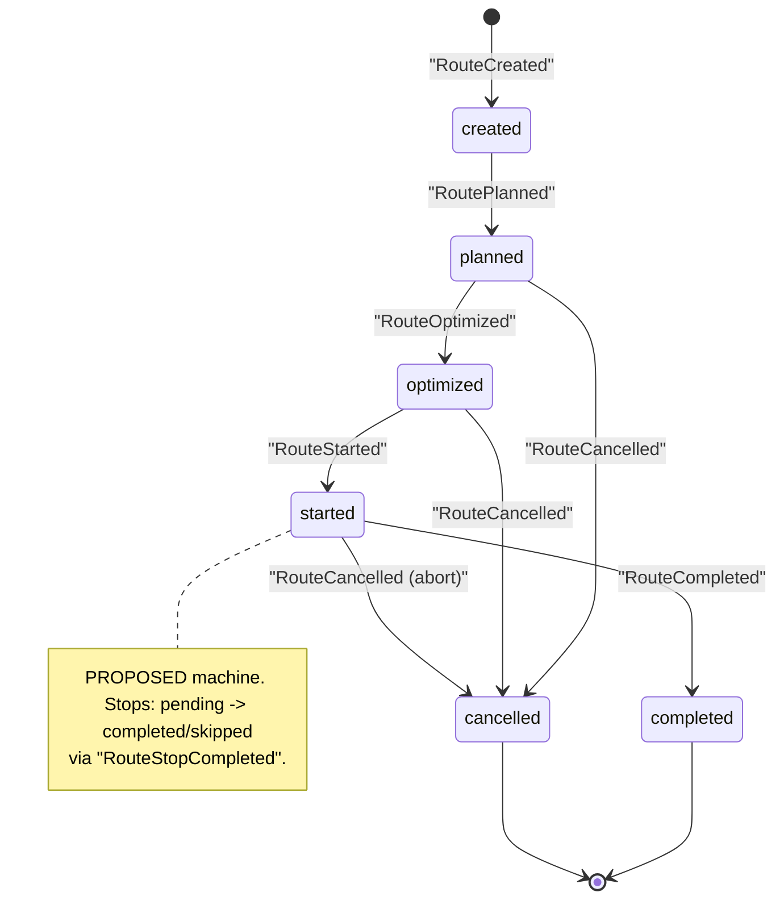
```mermaid
stateDiagram-v2
  [*] --> created: "RouteCreated"
  created --> planned: "RoutePlanned"
  planned --> optimized: "RouteOptimized"
  optimized --> started: "RouteStarted"
  started --> completed: "RouteCompleted"
  planned --> cancelled: "RouteCancelled"
  optimized --> cancelled: "RouteCancelled"
  started --> cancelled: "RouteCancelled (abort)"
  completed --> [*]
  cancelled --> [*]
  note right of started
    PROPOSED machine. Stops: pending -> completed/skipped
    via "RouteStopCompleted".
  end note
```

---

### 3.8 Warehouse Management context (EXISTS)

Producer aggregate: `WarehouseManagement.Warehouse`.

| Event | Type | Description | Producer | Consumers | Payload (key fields) | Business Meaning / Triggers |
|---|---|---|---|---|---|---|
| `WarehouseRegistered` | Domain | A warehouse node is registered. | Warehouse | proj_warehouse_load, Route Management | warehouse_id, code, lat, lng, capacity_weight_kg, capacity_volume_m3, max_daily_shipments | Onboarding a node. |
| `ShipmentReceivedAtWarehouse` | Domain | Shipment received/inbound at a node. | Warehouse | proj_warehouse_load, Tracking | warehouse_id, shipment_id, at | Receiving; adds to load. |
| `ShipmentDispatchedFromWarehouse` | Domain | Shipment dispatched/outbound. | Warehouse | proj_warehouse_load, Tracking | warehouse_id, shipment_id, at | Dispatch; reduces load. |
| `WarehouseCapacityThresholdReached` | Domain | Soft capacity/throughput threshold reached. | Warehouse | Notifications, Analytics, Dispatch | warehouse_id, metric, current, threshold | **Soft** signal (incl. `max_daily_shipments` target); warn, not hard-fail. |
| `WarehouseCapacityExceeded` | Domain | Hard capacity exceeded by an attempted booking. | Warehouse | Dispatch (reject), Analytics | warehouse_id, metric, attempted | **Hard** weight/volume invariant breached at create/assign. |

---

### 3.9 Tracking context (EXISTS)

Tracking is the append-only event source for several Shipment events. The physical events `ShipmentLocationReported`, `ProofOfDeliveryCaptured`, and `ShipmentExceptionRaised` are produced from `ShipmentTrackingEvent` rows (`location_update` / `proof_of_delivery` / `exception`) and are catalogued under **3.4 Shipments** (their natural aggregate). Tracking-context guarantee: **per-shipment monotonic `event_time`**; a status-bearing tracking event must satisfy the authoritative transition map. No additional context-unique event names are introduced (per SPEC canonical list).

---

### 3.10 Notifications context (NEW, Generic — integration)

Producer aggregate: `Notifications.Notification`. Inbound trigger is an **integration event**; outbound delivery results are internal domain events.

| Event | Type | Description | Producer | Consumers | Payload (key fields) | Business Meaning / Triggers |
|---|---|---|---|---|---|---|
| `NotificationRequestedIntegrationEvent` | **Integration** | Cross-boundary request to fan out a message. | Any context (e.g. Shipments, Orders) | Notifications | channel (push/sms/email), recipient, template, context_ref | Raised on assignment, delivery, exception, approval, etc. |
| `NotificationSent` | Domain | Message successfully delivered to gateway. | Notification | Analytics | notification_id, channel, recipient, provider_ref | Delivery confirmation. |
| `NotificationFailed` | Domain | Delivery failed. | Notification | Analytics, retry worker | notification_id, channel, error | Triggers retry/escalation. |

---

### 3.11 Billing context (NEW, Supporting)

Producer aggregate: `Billing.Quote` / `Billing.Invoice` / `Billing.Settlement` / `Billing.Payout`.

| Event | Type | Description | Producer | Consumers | Payload (key fields) | Business Meaning / Triggers |
|---|---|---|---|---|---|---|
| `PriceQuoted` | Domain | A price/quote computed for an order. | Quote | Orders (approval), Customer (credit), AI Ops | quote_id, order_id, amount, currency | Pricing on `OrderCreated`; ISO-4217, positive money. |
| `SettlementRequestedIntegrationEvent` | **Integration** | Cross-boundary settlement request to ERP/Billing. | Shipments / Billing | ERP/Billing engine | shipment_id, order_id, amount | Raised on `ShipmentDelivered` (and `ShipmentReturned`). |
| `InvoiceGenerated` | Domain | Invoice produced for a completed order. | Invoice | Customer, Analytics, Notifications | invoice_id, order_id, customer_id, total, currency | On `OrderCompleted`. |
| `PaymentCaptured` | Domain | Payment received against an invoice. | Invoice | Analytics, Customer (credit restore) | invoice_id, amount, captured_at | Settles receivable. |
| `DriverPayoutCalculated` | Domain | Driver earnings computed. | Payout | Notifications (driver), proj_driver_daily_stats, Analytics | driver_id, period, amount, currency | On delivery/settlement; driver app fare. |

---

### 3.12 Analytics context (NEW, Supporting)

Producer aggregate: `Analytics.Projection` / `Analytics.Kpi`. These are read-model lifecycle events (ADR-006), not write-side aggregates.

| Event | Type | Description | Producer | Consumers | Payload (key fields) | Business Meaning / Triggers |
|---|---|---|---|---|---|---|
| `ProjectionRebuilt` | Domain | A projection was (re)built via replay. | Projection builder | Control-tower UI, ops monitoring | projection_name, as_of, lag | Idempotent replay rebuilds projections, not aggregates (CQRS-lite). |
| `KpiSnapshotComputed` | Domain | A KPI snapshot computed. | Kpi | Dashboards, AI Ops | kpi_name, period, value, as_of | Periodic control-tower metric. |

---

### 3.13 AI Operations context (NEW, Core — differentiator)

Producer aggregate: `AIOperations.Prediction` / `AIOperations.Model`.

| Event | Type | Description | Producer | Consumers | Payload (key fields) | Business Meaning / Triggers |
|---|---|---|---|---|---|---|
| `PredictionRequested` | Domain | A model inference is requested. | Prediction | Model serving worker | request_id, model, features_ref, subject_ref | ETA/SLA/pricing/assignment/forecast request. |
| `PredictionGenerated` | Domain | A prediction is produced. | Prediction | Shipments (ETA), proj_sla_risk, Billing (pricing), Dispatch (assignment) | request_id, model, output, confidence | Drives ETA, SLA-risk overlay (`ShipmentDelayed`), dynamic pricing, assignment ranking. |
| `ModelFeedbackRecorded` | Domain | Ground-truth feedback recorded. | Model | Training pipeline, Analytics | model, subject_ref, actual, predicted | Closes the loop for retraining. |
| `AnomalyDetected` | Domain | An anomaly flagged. | Prediction | Exception center, Notifications, Analytics | subject_ref, anomaly_type, score | Surfaces operational anomalies (e.g. impossible location jump, SLA breach pattern). |

---

### 3.14 Integration events summary (cross-boundary)

The following are the **only** `*IntegrationEvent`s; all other catalogued events are internal domain events. Integration events cross a context/deployment boundary, are delivered at-least-once, and are deduped by the consumer on `event_id`.

| Integration Event | Source boundary | Target boundary | Typical trigger |
|---|---|---|---|
| `NotificationRequestedIntegrationEvent` | Any context | Notifications gateway (SMS/Push/Email) | Assignment, delivery, exception, order approval |
| `SettlementRequestedIntegrationEvent` | Shipments / Billing | ERP / Billing settlement engine | `ShipmentDelivered`, `ShipmentReturned` |

All other events listed in sections 3.1–3.13 are **internal domain events** consumed in-process by projection builders and Celery workers (ADR-003/006), governed by the per-aggregate ordering, idempotency, and compensation guarantees stated in section 3.0.

---

## Part 4 — State Machines

This section specifies the lifecycle state machines for the five lifecycle-bearing aggregates in Mesaar: **Order**, **Shipment**, **Driver**, **Vehicle**, and **Route**. For each entity we give (1) a States table, (2) an Allowed Transitions table, (3) explicit Invalid Transitions with the invariant that forbids them, (4) Business Rules / guards, (5) Exceptions & compensations, and (6) a Mermaid `stateDiagram-v2`.

Authority and drift policy:

| Machine | Status | Source of truth | Drift rule |
|---|---|---|---|
| Shipment | **EXISTS — AUTHORITATIVE** | `app/services/shipment_service.py::_is_transition_allowed` + `app/models/enums.py::ShipmentStatus` | This diagram is generated from code. The doc MUST match the code; if code changes, regenerate the doc. The doc never overrides code. |
| Vehicle (stored) | **EXISTS — AUTHORITATIVE** | `app/models/enums.py::VehicleStatus` | Stored enum `{active, maintenance, decommissioned}` is fixed. Operational overlay is derived, not stored. |
| Driver | **PROPOSED** | No enum in code today (only `is_available` bool + `user.is_active`) | Marked proposed, mirroring `docs/diagrams/vehicle-state-machine.mmd` convention. Must not be read as shipped behavior. |
| Order | **NEW / PROPOSED** | Target design (SPEC) — Shipment doubles as the order today | Forward-looking; no current enforcement. |
| Route | **NEW / PROPOSED** | Target design (SPEC) | Forward-looking; no current enforcement. |

Cross-cutting invariants that apply to every machine below:

- **Terminal immutability**: a state with no outgoing transitions is final; any transition out of it is rejected.
- **Append-only events**: state changes emit immutable domain events; reversals are *compensating* events, never edits/deletes (ADR-004, docs/03 §7).
- **Tenant isolation**: every transition is scoped to `tenant_id`; cross-tenant transitions are denied by RLS (ADR-001).
- **Optimistic concurrency**: each transition increments `aggregate_version` under `UNIQUE(aggregate_id, aggregate_version)`; a stale version aborts the transition.

---

## 4.1 Shipment (EXISTS — AUTHORITATIVE)

> Generated from `app/services/shipment_service.py::_is_transition_allowed` and `app/models/enums.py::ShipmentStatus`. **This is the canonical 8-state machine and must not drift.** `PickedUp` is NOT a stored state — it is the `assigned -> in_transit` trigger (the `ShipmentPickedUp` event). `Delayed` is NOT a node — it is an orthogonal SLA-risk overlay (`proj_sla_risk`, ADR-006), surfaced as `ShipmentDelayed`.

### 4.1.1 States

| State | Meaning | Entry effects | Exit effects |
|---|---|---|---|
| `created` | Shipment record exists; not yet released for assignment. | `ShipmentCreated` emitted; `reference_code` stamped; capacity reservation evaluated. | — |
| `ready` | Released and eligible for driver/vehicle assignment (and for driver offers). | `ShipmentMarkedReady` emitted; becomes visible to nearby-offer query. | — |
| `assigned` | Driver (and optionally vehicle) bound; pre-transit. | `ShipmentAssigned` emitted; `assigned_at` stamped; driver/vehicle exclusivity locked. | — |
| `in_transit` | Pickup confirmed; cargo moving. (ShipmentInTransit state == this node.) | `ShipmentPickedUp` emitted (the pickup confirmation); location reporting active. | — |
| `delivered` | Successfully delivered (terminal). | `ShipmentDelivered` emitted; `delivered_at` stamped; usually `ProofOfDeliveryCaptured`. | none (terminal) |
| `cancelled` | Aborted before completion (terminal). | `ShipmentCancelled` emitted; `cancelled_at` stamped. | none (terminal) |
| `returned` | Returned to origin after transit (terminal). | `ShipmentReturned` emitted. | none (terminal) |
| `failed` | Delivery attempt failed terminally (terminal). | `ShipmentFailed` emitted. | none (terminal) |

`ACTIVE_STATUSES = {created, ready, assigned, in_transit}`. Terminal = `{delivered, cancelled, returned, failed}`.

### 4.1.2 Allowed Transitions

| From | To | Trigger (command / domain event) | Guard / business rule |
|---|---|---|---|
| `created` | `ready` | MarkReady / `ShipmentMarkedReady` | Required fields present; validation passed. |
| `created` | `cancelled` | Cancel / `ShipmentCancelled` | Stamps `cancelled_at`. |
| `ready` | `assigned` | AssignDriver(+Vehicle) / `ShipmentAssigned` | All HARD assignment guards (see 4.1.4); stamps `assigned_at`. |
| `ready` | `cancelled` | Cancel / `ShipmentCancelled` | Stamps `cancelled_at`. |
| `assigned` | `in_transit` | ConfirmPickup / **`ShipmentPickedUp`** | Driver/vehicle still valid; pickup confirmed. ("PickedUp" lives here.) |
| `assigned` | `cancelled` | Cancel / `ShipmentCancelled` | Releases driver/vehicle exclusivity. |
| `in_transit` | `delivered` | Deliver / `ShipmentDelivered` | Stamps `delivered_at`; POD typically captured. |
| `in_transit` | `failed` | Fail / `ShipmentFailed` | Terminal failure. |
| `in_transit` | `returned` | Return / `ShipmentReturned` | Cargo returned to origin. |

Note: the same transition map gates **both** `transition_status(...)` and an attached `status_update` tracking event — a tracking event whose status change violates the map raises `StatusTransitionError`.

### 4.1.3 Invalid Transitions (explicit)

| Forbidden transition | Why rejected (invariant) |
|---|---|
| `delivered -> in_transit` | Terminal immutability — `delivered` has no outgoing edges. |
| `delivered -> returned` | Terminal immutability (a return after delivery is a *new compensating* `ShipmentReturned` flow, not a state edit). |
| `cancelled -> assigned` | Terminal immutability — cancelled is final; cannot be re-activated. |
| `returned -> in_transit` / `failed -> in_transit` | Terminal immutability. |
| `created -> assigned` | Skips `ready`; map only allows `created -> {ready, cancelled}`. |
| `created -> in_transit` | Skips `ready` and `assigned`; pickup requires a prior assignment. |
| `ready -> in_transit` | Cannot enter transit without a bound driver (must pass through `assigned`). |
| `assigned -> delivered` | Cannot deliver without confirming pickup (`in_transit`) first. |
| `in_transit -> cancelled` | `in_transit` only exits to `{delivered, failed, returned}`; mid-transit abort is modeled as `failed`/`returned`, not `cancelled`. |
| any transition into a state with a **non-monotonic** tracking `event_time` | Tracking `event_time` must be monotonic non-decreasing per shipment. |

### 4.1.4 Business Rules / guards

**HARD (enforced in code today):**
- Driver exclusivity: a driver cannot hold a 2nd shipment in an ACTIVE status (`AssignmentError`).
- Vehicle exclusivity: a vehicle cannot hold a 2nd ACTIVE shipment.
- Vehicle must be `status == active` to be assigned.
- Driver must be `is_available == true` AND linked to a `role=driver` user.
- `shipment.weight_kg <= vehicle.capacity_weight_kg` AND `volume_m3 <= vehicle.capacity_volume_m3`.
- Origin AND destination warehouse capacity (sum of weight/volume over ACTIVE shipments + new) must not exceed `capacity_weight_kg` / `capacity_volume_m3`.
- Transition must follow the authoritative map (`StatusTransitionError` otherwise).
- Tracking `event_time` monotonic non-decreasing per shipment.
- `weight_kg > 0`, `volume_m3 > 0`; `reference_code` unique per tenant.

**SOFT / overlay (advisory):**
- **Delayed overlay**: `ShipmentDelayed` is raised when `clock > delivery_due_at` (or risk threshold), projected into `proj_sla_risk`. It is an annotation on any ACTIVE node; it never changes the core node and never appears as a transition target.
- Warehouse `max_daily_shipments` (throughput target — column exists, not hard-enforced).
- Offer 15s acceptance window before re-queue.

### 4.1.5 Exceptions & compensations

| Scenario | Mechanism |
|---|---|
| Illegal transition attempted | `StatusTransitionError` (synchronous reject). |
| Assignment guard violated | `AssignmentError`. |
| Shipment missing | `NotFoundError`. |
| Reversal after delivery | NOT an edit — emit a compensating event (e.g. `ShipmentReturned` modeled as a new flow / order-level reversal); the `delivered` event stays in the append-only store. |
| Exception during transit | `ShipmentExceptionRaised` (tracking `exception` event) — overlay/annotation; does not move the core node unless an accompanying guarded `status_update` does. |

### 4.1.6 Diagram

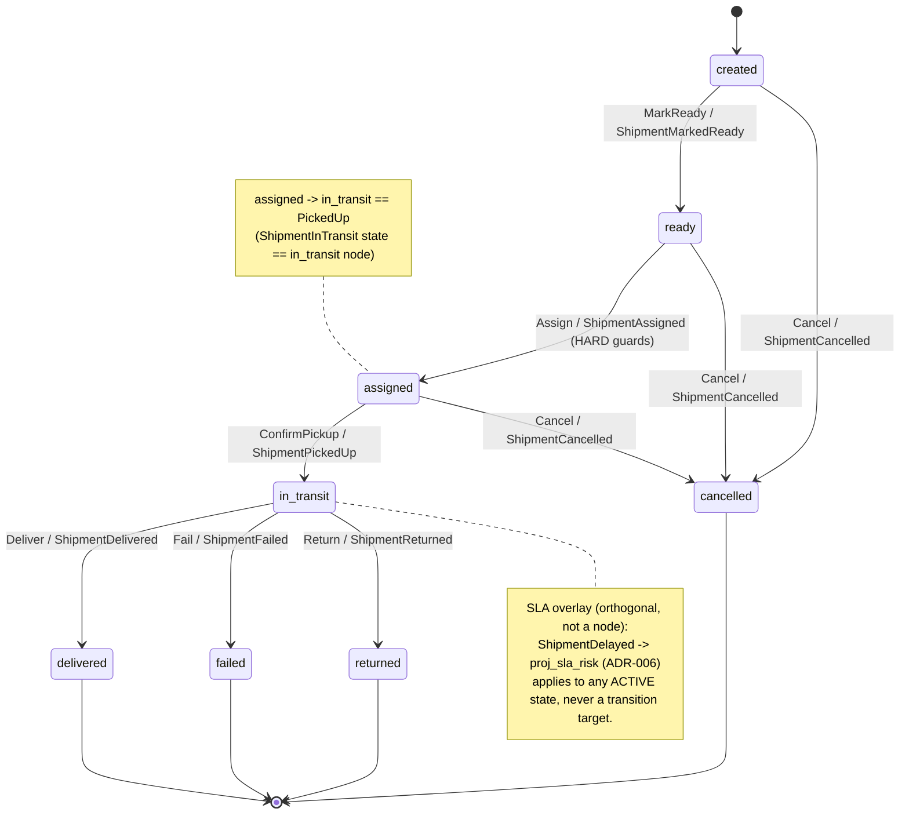
```mermaid
stateDiagram-v2
    [*] --> created
    created --> ready : MarkReady / ShipmentMarkedReady
    created --> cancelled : Cancel / ShipmentCancelled
    ready --> assigned : Assign / ShipmentAssigned (HARD guards)
    ready --> cancelled : Cancel / ShipmentCancelled
    assigned --> in_transit : ConfirmPickup / ShipmentPickedUp
    assigned --> cancelled : Cancel / ShipmentCancelled
    in_transit --> delivered : Deliver / ShipmentDelivered
    in_transit --> failed : Fail / ShipmentFailed
    in_transit --> returned : Return / ShipmentReturned
    delivered --> [*]
    cancelled --> [*]
    returned --> [*]
    failed --> [*]

    note right of in_transit
        SLA overlay (orthogonal, not a node):
        ShipmentDelayed -> proj_sla_risk (ADR-006)
        applies to any ACTIVE state, never a transition target.
    end note
    note left of assigned
        assigned -> in_transit == PickedUp
        (ShipmentInTransit state == in_transit node)
    end note
```

---

## 4.2 Order (NEW / PROPOSED)

> Today the **Shipment doubles as the order**. The target design splits a commercial **Order** (customer's request/contract; may fan out to 1+ Shipments) from the physical Shipment. This machine is proposed; owned by the **Orders** context (Core).

### 4.2.1 States

| State | Meaning | Entry effects | Exit effects |
|---|---|---|---|
| `draft` | Order being composed; not yet submitted. | `OrderCreated` emitted. | — |
| `submitted` | Submitted for approval (incl. credit check). | `OrderSubmitted` emitted; credit/eligibility evaluation requested. | — |
| `approved` | Approved; ready to fan out into Shipments. | `OrderApproved` emitted; pricing/quote may be finalized (`PriceQuoted`). | — |
| `rejected` | Approval denied (terminal). | `OrderRejected` emitted. | none (terminal) |
| `fulfilling` | Shipments being created/executed for the order. | `OrderFulfilmentStarted` emitted; child Shipments spawned. | — |
| `completed` | All shipments terminal-success; order satisfied (terminal). | `OrderCompleted` emitted; `InvoiceGenerated` may follow (Billing). | none (terminal) |
| `cancelled` | Order aborted before completion — from `submitted`, `approved`, **or `fulfilling`** (terminal). | `OrderCancelled` emitted; compensation workflow cascades `ShipmentCancelled` (+ `OrderFulfilmentFailed` if a child cannot be unwound); `OrderCancellationFeeApplied` (Billing); audit + `NotificationRequestedIntegrationEvent`. | none (terminal) |

### 4.2.2 Allowed Transitions

| From | To | Trigger | Guard / business rule |
|---|---|---|---|
| `draft` | `submitted` | Submit / `OrderSubmitted` | Required fields + line items valid. |
| `submitted` | `approved` | Approve / `OrderApproved` | Credit check (Customer/Billing) passes. |
| `submitted` | `rejected` | Reject / `OrderRejected` | Approval denied. |
| `submitted` | `cancelled` | Cancel / `OrderCancelled` | Customer/admin withdrawal pre-approval. |
| `approved` | `fulfilling` | StartFulfilment / `OrderFulfilmentStarted` | **Must be approved** before any shipments are created. |
| `approved` | `cancelled` | Cancel / `OrderCancelled` | Allowed pre-fulfilment (or with compensation). |
| `fulfilling` | `completed` | Complete / `OrderCompleted` | All child Shipments reached terminal success. |
| `fulfilling` | `cancelled` | Cancel / `OrderCancelled` | **ALLOWED (CF1 resolved, Phase 6.5).** Fires the compensation workflow (cascade `ShipmentCancelled`; `OrderFulfilmentFailed` if a child cannot be unwound), an `OrderCancellationFeeApplied` charge (Billing), an audit event, and a `NotificationRequestedIntegrationEvent`. |

### 4.2.3 Invalid Transitions (explicit)

| Forbidden transition | Why rejected (invariant) |
|---|---|
| `draft -> fulfilling` | Cannot fulfil unless **approved** (skips submit + approval). |
| `submitted -> fulfilling` | Cannot fulfil unless approved. |
| `rejected -> approved` | Terminal immutability. |
| `completed -> cancelled` / `completed -> fulfilling` | A completed order is immutable. |
| `cancelled -> *` | Terminal immutability. |
| `approved -> completed` | Cannot complete without going through `fulfilling`. |

### 4.2.4 Business Rules / guards

- **HARD**: an Order cannot move to `fulfilling` (spawn shipments) unless `approved`. A `completed` or `cancelled` order is immutable.
- **HARD**: order completion requires all child Shipments to be terminal-success (`delivered`).
- **SOFT**: approval may require a credit check / `CustomerCreditLimitChanged` evaluation; quote (`PriceQuoted`) finalized at approval.
- **VALIDATION**: required fields, positive money, ISO-4217 currency shape, referenced Customer exists.

### 4.2.5 Exceptions & compensations

| Scenario | Mechanism |
|---|---|
| Cancel during `fulfilling` (**CF1 — explicitly ALLOWED, Phase 6.5**) | Compensation workflow: cascade `ShipmentCancelled` to live children; emit `OrderFulfilmentFailed` if any child cannot be unwound; apply `OrderCancellationFeeApplied` (Billing); write audit event; emit `NotificationRequestedIntegrationEvent`. |
| Credit check fails at approval | Route to `rejected` (`OrderRejected`). |
| Partial shipment failure | Order stays `fulfilling`; failed child handled per Shipment machine; re-shipment may spawn. If the fan-out cannot complete, emit **`OrderFulfilmentFailed`** (compensation/abort path). |

### 4.2.6 Diagram

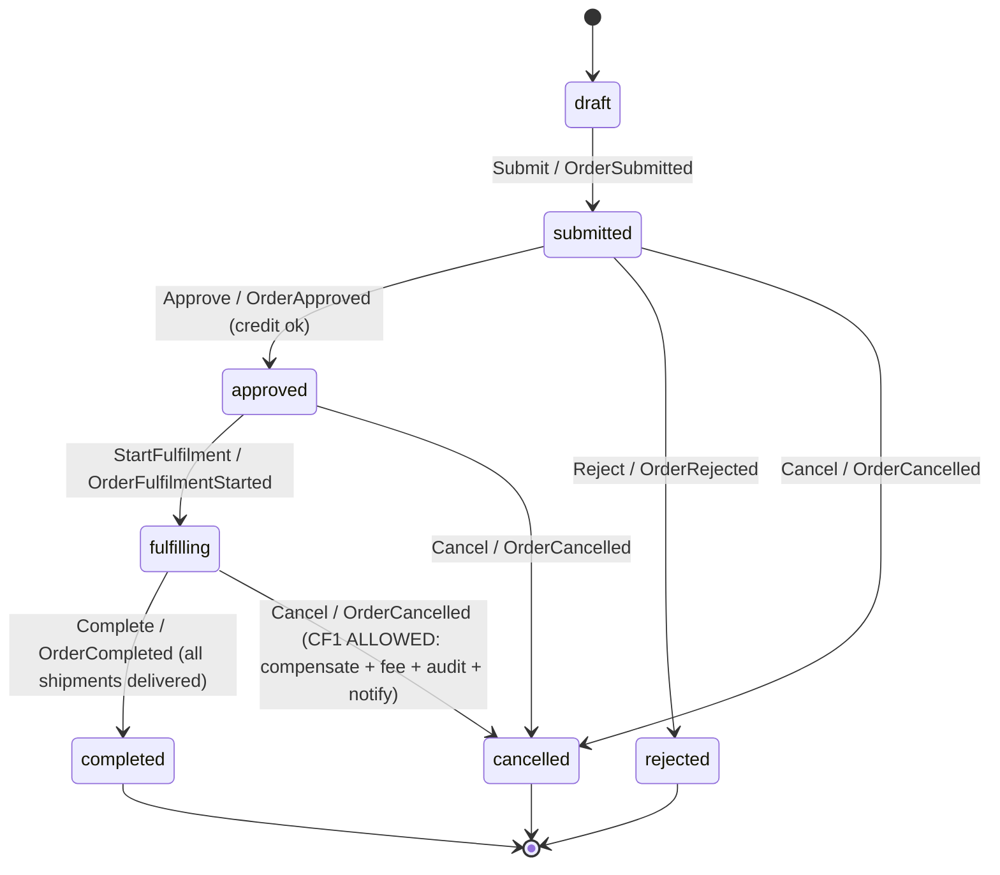
```mermaid
stateDiagram-v2
    [*] --> draft
    draft --> submitted : Submit / OrderSubmitted
    submitted --> approved : Approve / OrderApproved (credit ok)
    submitted --> rejected : Reject / OrderRejected
    submitted --> cancelled : Cancel / OrderCancelled
    approved --> fulfilling : StartFulfilment / OrderFulfilmentStarted
    approved --> cancelled : Cancel / OrderCancelled
    fulfilling --> completed : Complete / OrderCompleted (all shipments delivered)
    fulfilling --> cancelled : Cancel / OrderCancelled (CF1 ALLOWED: compensate + fee + audit + notify)
    rejected --> [*]
    completed --> [*]
    cancelled --> [*]
```

---

## 4.3 Driver (NEW / PROPOSED)

> **PROPOSED** — there is **no driver status enum in code today** (only `is_available: bool` + `user.is_active`). Marked proposed by convention (like `docs/diagrams/vehicle-state-machine.mmd`). Owned by **Driver Management**.

### 4.3.1 States and mapping

| State | Meaning | Maps to (today) | Entry effects | Exit effects |
|---|---|---|---|---|
| `offline` | Logged in but not accepting work. | `is_available = false` | `DriverWentOffline` emitted; removed from offer pool. | — |
| `available` | Online and accepting offers/assignment. | `is_available = true` | `DriverWentOnline` emitted; eligible for nearby-offer query. | — |
| `assigned` | Bound to a shipment, pre-pickup. | derived (active shipment in `assigned`) | `DriverAssigned` / `DriverStatusChanged`; exclusivity locked. | — |
| `busy` (on_trip) | Driving an `in_transit` shipment. | derived (active shipment in `in_transit`) | `DriverStatusChanged`. | — |
| `suspended` | Blocked by admin (non-terminal but isolating). | `user.is_active = false` / admin action | `DriverSuspended` emitted; removed from all pools. | — |

`assigned` / `busy` are **derived** from the active shipment phase; `offline` / `available` come from `is_available`; `suspended` from `user.is_active = false`.

### 4.3.2 Allowed Transitions

| From | To | Trigger | Guard / business rule |
|---|---|---|---|
| `offline` | `available` | GoOnline / `DriverWentOnline` | Sets `is_available = true`; user active. |
| `available` | `offline` | GoOffline / `DriverWentOffline` | Only if not holding an active shipment. |
| `available` | `assigned` | AcceptOffer / `DriverAssigned` | Single-active-shipment guard; driver eligible. |
| `assigned` | `busy` | (shipment `assigned -> in_transit`) / `DriverStatusChanged` | Pickup confirmed on the bound shipment. |
| `busy` | `available` | (shipment reaches terminal) / `DriverStatusChanged` | Active shipment cleared. |
| `assigned` | `available` | (shipment cancelled pre-transit) / `DriverStatusChanged` | Exclusivity released. |
| any | `suspended` | Suspend / `DriverSuspended` | Admin action; `user.is_active = false`. |
| `suspended` | `offline` | Reinstate / `DriverReinstated` | Admin re-enables; returns to `offline` (must re-go-online). |

### 4.3.3 Invalid Transitions (explicit)

| Forbidden transition | Why rejected (invariant) |
|---|---|
| `offline -> assigned` | Only **available** drivers receive offers/assignment. |
| `available -> busy` (direct) | `busy` requires a bound shipment in transit; must pass through `assigned`. |
| `available -> assigned` while already holding an active shipment | Single-active-shipment exclusivity. |
| `assigned -> offline` / `busy -> offline` | Cannot go offline while holding an active shipment. |
| `suspended -> available` (direct) | Reinstatement returns to `offline`; driver must explicitly go online. |
| `suspended -> assigned` | Suspended drivers are excluded from all assignment. |

### 4.3.4 Business Rules / guards

- **HARD**: only `available` drivers receive offers/assignment; `assigned`/`busy` enforce a single active shipment (mirrors Shipment driver-exclusivity).
- **HARD**: a `suspended` driver is excluded from offers, assignment, and proximity ranking.
- **SOFT**: 15s offer window; proximity/route-efficiency ranking for offer order.
- **VALIDATION**: phone/OTP login (stubbed today); `role = driver`.

### 4.3.5 Exceptions & compensations

| Scenario | Mechanism |
|---|---|
| Offer expires (no accept in 15s) | Offer re-queued to other drivers; driver stays `available` (decline = no state mutation). |
| Suspension mid-trip | Admin policy: reassign/abort the live shipment (compensating `ShipmentReturned`/`ShipmentFailed`) before/at suspension. |
| Decline offer | No state mutation; offer stays READY for others. |

### 4.3.6 Diagram

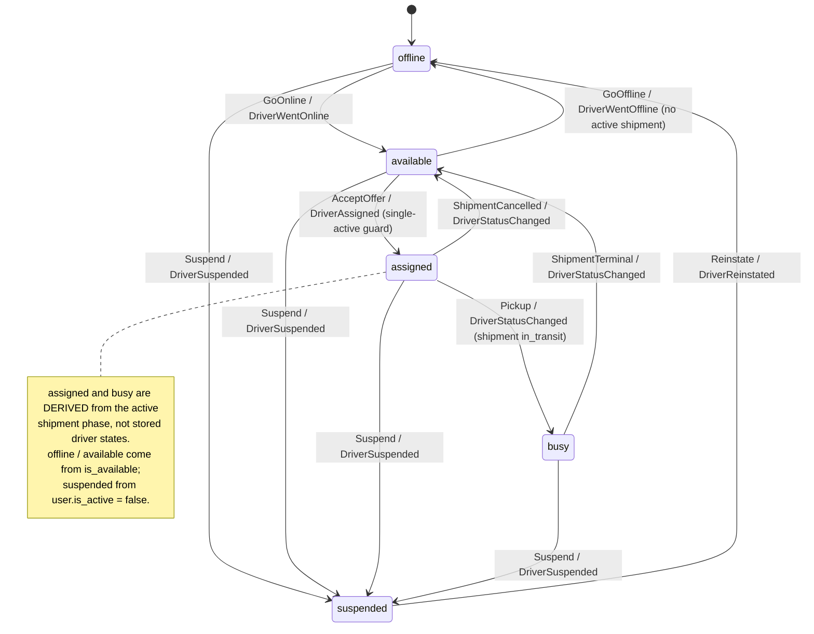
```mermaid
stateDiagram-v2
    [*] --> offline
    offline --> available : GoOnline / DriverWentOnline
    available --> offline : GoOffline / DriverWentOffline (no active shipment)
    available --> assigned : AcceptOffer / DriverAssigned (single-active guard)
    assigned --> busy : Pickup / DriverStatusChanged (shipment in_transit)
    busy --> available : ShipmentTerminal / DriverStatusChanged
    assigned --> available : ShipmentCancelled / DriverStatusChanged
    offline --> suspended : Suspend / DriverSuspended
    available --> suspended : Suspend / DriverSuspended
    assigned --> suspended : Suspend / DriverSuspended
    busy --> suspended : Suspend / DriverSuspended
    suspended --> offline : Reinstate / DriverReinstated

    note right of assigned
        assigned and busy are DERIVED from the active
        shipment phase, not stored driver states.
        offline / available come from is_available;
        suspended from user.is_active = false.
    end note
```

---

## 4.4 Vehicle (EXISTS — AUTHORITATIVE stored lifecycle + DERIVED overlay)

> Stored lifecycle enum `{active, maintenance, decommissioned}` is **authoritative** (`app/models/enums.py::VehicleStatus`). Operational availability `{Available, Assigned}` is **DERIVED**, not stored. Owned by **Fleet Management**.
>
> **OutOfService mapping**: the user's "OutOfService" maps to `decommissioned` (permanent) or `maintenance` (temporary). State explicitly: temporary out-of-service = `maintenance`; permanent retirement = `decommissioned`.

### 4.4.1 Stored states (authoritative)

| State | Meaning | Entry effects | Exit effects |
|---|---|---|---|
| `active` | In service; assignable to shipments. | `VehicleRegistered` (initial) / `VehicleMaintenanceCompleted` (return). | — |
| `maintenance` | Temporarily out of service (servicing/repair). (OutOfService — temporary.) | `VehicleMaintenanceStarted` / `VehicleStatusChanged`; excluded from assignment. | `VehicleMaintenanceCompleted` on return. |
| `decommissioned` | Permanently retired (terminal). (OutOfService — permanent.) | `VehicleDecommissioned` emitted. | none (terminal) |

### 4.4.2 Allowed Transitions (stored)

| From | To | Trigger | Guard / business rule |
|---|---|---|---|
| `active` | `maintenance` | StartMaintenance / `VehicleMaintenanceStarted` | Vehicle must not be on an active shipment (release first). |
| `maintenance` | `active` | CompleteMaintenance / `VehicleMaintenanceCompleted` | Returns to service. |
| `active` | `decommissioned` | Decommission / `VehicleDecommissioned` | Vehicle must not be on an active shipment. |
| `maintenance` | `decommissioned` | Decommission / `VehicleDecommissioned` | Permanent retirement from maintenance. |

### 4.4.3 Invalid Transitions (explicit)

| Forbidden transition | Why rejected (invariant) |
|---|---|
| `decommissioned -> active` | Terminal immutability — retirement is permanent. |
| `decommissioned -> maintenance` | Terminal immutability. |
| `active -> maintenance` / `active -> decommissioned` while on an active shipment | Vehicle exclusivity — a vehicle on an ACTIVE shipment cannot be pulled from service until released. |
| assign a non-`active` vehicle to a shipment | HARD rule: a vehicle must be `status == active` to be assigned. |

### 4.4.4 Derived operational overlay (secondary view)

Operational availability is **computed**, never stored:

| Derived state | Definition |
|---|---|
| `Available` | `status == active` AND not bound to any ACTIVE shipment. |
| `Assigned` | `status == active` AND bound to an ACTIVE shipment. |

A vehicle in `maintenance` or `decommissioned` is, by definition, neither `Available` nor `Assigned` (it is out of the operational pool). The overlay surfaces via `proj_active_shipments` / fleet read-models (ADR-006) and emits `VehicleAssigned` / `VehicleReleased` as the binding changes — these do **not** alter the stored lifecycle node.

### 4.4.5 Business Rules / guards

- **HARD**: only `active` vehicles are assignable; vehicle exclusivity (one ACTIVE shipment) holds.
- **HARD**: `decommissioned` is terminal.
- **SOFT**: utilization targets; maintenance scheduling.

### 4.4.6 Exceptions & compensations

| Scenario | Mechanism |
|---|---|
| Maintenance needed mid-assignment | Release the shipment binding (`VehicleReleased`, reassign vehicle) before `VehicleMaintenanceStarted`. |
| Decommission of a bound vehicle | Reassign the shipment first; then `VehicleDecommissioned`. |

### 4.4.7 Diagrams

Stored lifecycle (authoritative):

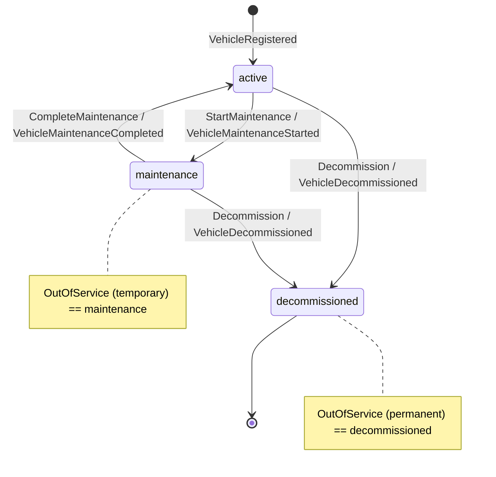
```mermaid
stateDiagram-v2
    [*] --> active : VehicleRegistered
    active --> maintenance : StartMaintenance / VehicleMaintenanceStarted
    maintenance --> active : CompleteMaintenance / VehicleMaintenanceCompleted
    active --> decommissioned : Decommission / VehicleDecommissioned
    maintenance --> decommissioned : Decommission / VehicleDecommissioned
    decommissioned --> [*]

    note right of maintenance
        OutOfService (temporary) == maintenance
    end note
    note right of decommissioned
        OutOfService (permanent) == decommissioned
    end note
```

Derived operational overlay (computed from `status==active` + active-shipment binding; not stored):

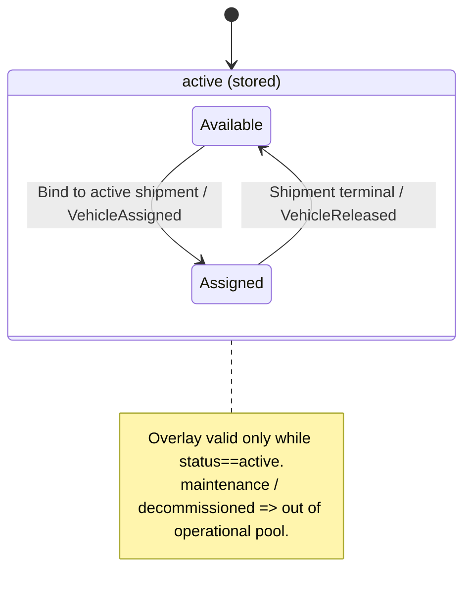
```mermaid
stateDiagram-v2
    state "active (stored)" as A {
        Available --> Assigned : Bind to active shipment / VehicleAssigned
        Assigned --> Available : Shipment terminal / VehicleReleased
    }
    [*] --> A
    note right of A
        Overlay valid only while status==active.
        maintenance / decommissioned => out of operational pool.
    end note
```

---

## 4.5 Route (NEW / PROPOSED)

> **NEW / PROPOSED** — owned by **Route Management** (Core). Route groups ordered stops for execution; stops have their own sub-machine.

### 4.5.1 States

| State | Meaning | Entry effects | Exit effects |
|---|---|---|---|
| `created` | Route shell exists; stops not yet planned. | `RouteCreated` emitted. | — |
| `planned` | Stops and sequence defined. | `RoutePlanned` emitted; stops set to `pending`. | — |
| `optimized` | Sequence optimized (AI Operations / solver). | `RouteOptimized` emitted; `PredictionGenerated` may feed sequencing. | — |
| `started` | Execution in progress. | `RouteStarted` emitted; driver/vehicle engaged. | — |
| `completed` | All stops completed/skipped (terminal). | `RouteCompleted` emitted. | none (terminal) |
| `cancelled` | Route abandoned (terminal). | `RouteCancelled` emitted. | none (terminal) |

Stop sub-states: `pending -> completed` or `pending -> skipped`.

### 4.5.2 Allowed Transitions

| From | To | Trigger | Guard / business rule |
|---|---|---|---|
| `created` | `planned` | Plan / `RoutePlanned` | At least one stop defined. |
| `planned` | `optimized` | Optimize / `RouteOptimized` | Optional optimization pass. |
| `planned` | `started` | Start / `RouteStarted` | May start without optimizing. |
| `optimized` | `started` | Start / `RouteStarted` | Driver/vehicle assigned. |
| `started` | `completed` | Complete / `RouteCompleted` | All stops `completed` or `skipped`. |
| `planned` | `cancelled` | Cancel / `RouteCancelled` | Pre-execution cancel. |
| `optimized` | `cancelled` | Cancel / `RouteCancelled` | Pre-execution cancel. |
| `started` | `cancelled` | Abort / `RouteCancelled` | In-flight abort; un-completed stops compensated. |
| stop `pending` | `completed` | `RouteStopCompleted` | Arrival/POD at stop. |
| stop `pending` | `skipped` | (skip) | Stop bypassed per policy. |

### 4.5.3 Invalid Transitions (explicit)

| Forbidden transition | Why rejected (invariant) |
|---|---|
| `created -> started` | Cannot start before planning (no stops). |
| `created -> optimized` | Nothing to optimize before planning. |
| `completed -> *` | Terminal immutability. |
| `cancelled -> *` | Terminal immutability. |
| `started -> planned` / `started -> optimized` | No backward edits once execution begins (re-plan = new route). |
| `optimized -> planned` | Optimization is forward-only; re-planning spawns a fresh pass. |

### 4.5.4 Business Rules / guards

- **HARD**: a route cannot `start` without at least one planned stop; `completed`/`cancelled` are terminal.
- **HARD**: route completion requires every stop to be `completed` or `skipped`.
- **SOFT**: optimization, proximity/route-efficiency, and SLA windows are advisory inputs to `RouteOptimized`.

### 4.5.5 Exceptions & compensations

| Scenario | Mechanism |
|---|---|
| Abort mid-route | `RouteCancelled`; remaining `pending` stops marked `skipped`; affected shipments handled per Shipment machine. |
| Optimization solver failure | Fall back to `planned` sequence; proceed to `started` without `optimized`. |
| Stop unreachable | Mark stop `skipped` (advisory exception), continue route. |

### 4.5.6 Diagram

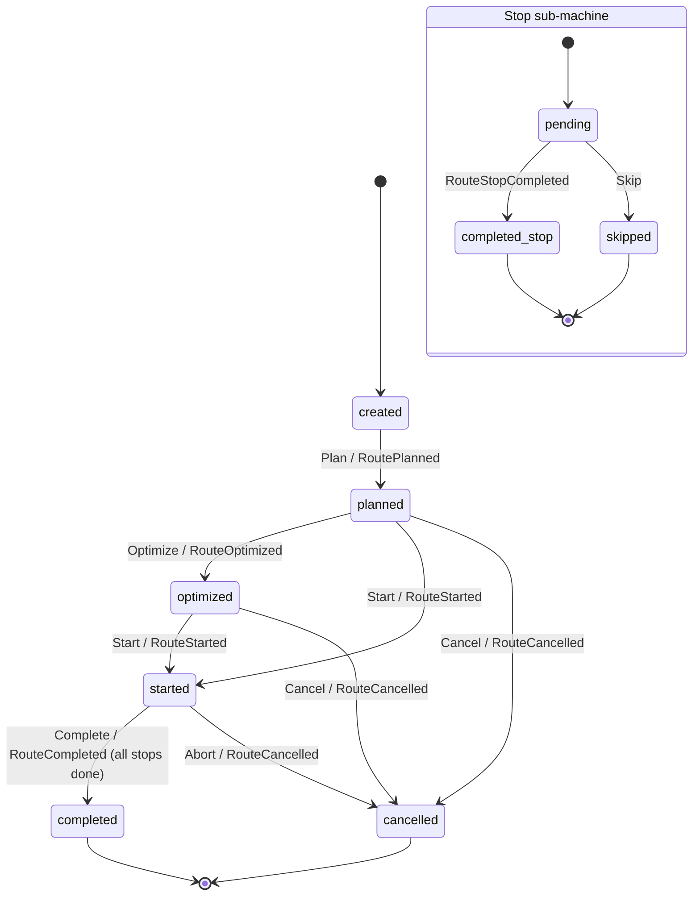
```mermaid
stateDiagram-v2
    [*] --> created
    created --> planned : Plan / RoutePlanned
    planned --> optimized : Optimize / RouteOptimized
    planned --> started : Start / RouteStarted
    optimized --> started : Start / RouteStarted
    started --> completed : Complete / RouteCompleted (all stops done)
    planned --> cancelled : Cancel / RouteCancelled
    optimized --> cancelled : Cancel / RouteCancelled
    started --> cancelled : Abort / RouteCancelled
    completed --> [*]
    cancelled --> [*]

    state "Stop sub-machine" as Stop {
        [*] --> pending
        pending --> completed_stop : RouteStopCompleted
        pending --> skipped : Skip
        completed_stop --> [*]
        skipped --> [*]
    }
```

---

## 4.6 Cross-machine summary

| Entity | Status | Terminal states | Key forbidding invariant |
|---|---|---|---|
| Shipment | EXISTS — authoritative | `delivered, cancelled, returned, failed` | Authoritative transition map + terminal immutability + monotonic tracking time. |
| Order | NEW / proposed | `completed, cancelled, rejected` | Cannot fulfil unless approved; completed/cancelled immutable. |
| Driver | PROPOSED (no enum) | none (suspended is non-terminal) | Only `available` drivers assignable; single active shipment. |
| Vehicle | EXISTS — authoritative stored + derived overlay | `decommissioned` | Only `active` assignable; vehicle exclusivity; decommissioned terminal. |
| Route | NEW / proposed | `completed, cancelled` | Cannot start before planned; completed/cancelled immutable. |

Overlays (never core nodes): **Delayed** (Shipment SLA → `proj_sla_risk`), **Vehicle operational** (`Available/Assigned`, derived), **Driver assigned/busy** (derived from shipment phase). These annotate state but never participate in the authoritative transition maps.

---

## Part 5 — Business Rules Catalog

This catalog enumerates every governing rule across the 13 bounded contexts. Rules are partitioned into three enforcement classes. Each rule carries a stable **Rule ID** so downstream artifacts (tests, ADRs, OpenAPI error tables) can reference it. Rules transcribed from existing code are marked **(code)**; rules that elaborate the NEW/target contexts are marked **(target)**.

## 5.1 Legend & classification model

| Class | Prefix | Semantics | When violated |
|---|---|---|---|
| **Hard constraint** | `BR-H-*` | An invariant that must ALWAYS hold. Enforced at the aggregate boundary, a DB constraint, or a service guard, inside the same transaction that mutates state. Non-negotiable. | **Reject** the command. Raise a typed exception; no partial write. |
| **Soft constraint** | `BR-S-*` | An advisory, SLA, throughput, or optimization preference. Does not block a legal state change. | **Warn / queue / score / flag** — emit an overlay event or projection, never hard-fail. |
| **Validation rule** | `BR-V-*` | A boundary input-shape or pre-condition check at the API edge (Pydantic v2 schema / referential existence) before the command reaches the domain. | **422 / 404** at the API boundary; the command never reaches the aggregate. |

**Code exception vocabulary** (the only five exception types backed by existing code, cross-referenced in the tables): `StatusTransitionError`, `AssignmentError`, `CapacityError`, `TrackingEventError`, `NotFoundError`. Target-context exceptions are **proposed naming only** and follow the same convention (`OrderStateError`, `RouteStateError`, `ConcurrencyError`, `TenantIsolationError`, `ConflictError`); they do not yet exist in `exceptions.py`.

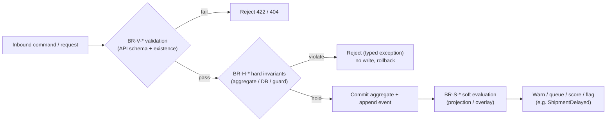
```mermaid
flowchart LR
    REQ["Inbound command / request"] --> V{"BR-V-* validation<br/>(API schema + existence)"}
    V -- "fail" --> R422["Reject 422 / 404"]
    V -- "pass" --> H{"BR-H-* hard invariants<br/>(aggregate / DB / guard)"}
    H -- "violate" --> REJ["Reject (typed exception)<br/>no write, rollback"]
    H -- "hold" --> COMMIT["Commit aggregate + append event"]
    COMMIT --> S["BR-S-* soft evaluation<br/>(projection / overlay)"]
    S --> OVL["Warn / queue / score / flag<br/>(e.g. ShipmentDelayed)"]
```

---

## 5.2 Hard constraints (`BR-H-*`)

Hard constraints are invariants; the command is rejected and rolled back on violation. Most Shipment/assignment rules below are **enforced in code today**.

### 5.2.1 Shipment lifecycle & transitions

| Rule ID | Rule statement | Context | Enforcement point | Related states & events | Violation handling |
|---|---|---|---|---|---|
| BR-H-01 | Shipment status transitions must follow the authoritative map (`created→{ready,cancelled}`, `ready→{assigned,cancelled}`, `assigned→{in_transit,cancelled}`, `in_transit→{delivered,failed,returned}`). **(code)** | Shipments | Service guard `_is_transition_allowed` (aggregate invariant) | All shipment states; `ShipmentMarkedReady`, `ShipmentAssigned`, `ShipmentPickedUp`, `ShipmentDelivered`, `ShipmentFailed`, `ShipmentReturned`, `ShipmentCancelled` | `StatusTransitionError` |
| BR-H-02 | Terminal shipment states `{delivered, cancelled, returned, failed}` are immutable — no outgoing transition is permitted (e.g. `delivered` cannot return to `in_transit`; `cancelled` cannot be assigned). **(code)** | Shipments | Service guard (empty successor set) | Terminal nodes; any reversal must be a compensating event, not an edit | `StatusTransitionError` |
| BR-H-03 | Entering `in_transit` (the `assigned→in_transit` "PickedUp" transition) is the only way pickup is recorded; there is no separate stored "PickedUp" state. **(code)** | Shipments | Service guard | `assigned → in_transit`; `ShipmentPickedUp` event; resulting state == `in_transit` | `StatusTransitionError` |
| BR-H-04 | `delivered` stamps `delivered_at`; `cancelled` stamps `cancelled_at` on entry. **(code)** | Shipments | Aggregate invariant on transition | `delivered`, `cancelled`; `ShipmentDelivered`, `ShipmentCancelled` | `StatusTransitionError` (transition itself); stamping is unconditional on success |
| BR-H-05 | `weight_kg > 0` and `volume_m3 > 0`. **(code, DB CHECK)** | Shipments | DB CHECK constraint (duplicates the BR-V positivity validation) | `created`; `ShipmentCreated` | DB CHECK violation; surfaced as 422 validation at the API boundary |
| BR-H-06 | `reference_code` is unique per tenant. **(code)** | Shipments | DB UNIQUE `(tenant_id, reference_code)` | `created`; `ShipmentCreated` | Unique-violation → 409; surfaced as `ConflictError` (**proposed/target naming**; not in `exceptions.py` today) |

### 5.2.2 Assignment, exclusivity & eligibility

| Rule ID | Rule statement | Context | Enforcement point | Related states & events | Violation handling |
|---|---|---|---|---|---|
| BR-H-07 | A driver cannot hold more than one shipment in an ACTIVE status `{created, ready, assigned, in_transit}` (driver exclusivity). **(code)** | Shipments ↔ Driver | Service guard (`assign_driver_*`) | `assigned`; `ShipmentAssigned`, `DriverAssigned` | `AssignmentError` |
| BR-H-08 | A vehicle cannot hold more than one shipment in an ACTIVE status (vehicle exclusivity). **(code)** | Shipments ↔ Fleet | Service guard | `assigned`; `ShipmentAssigned`, `VehicleAssigned` | `AssignmentError` |
| BR-H-09 | A vehicle must have stored lifecycle status `active` to be assigned (a `maintenance` or `decommissioned` vehicle is ineligible). **(code)** | Fleet | Service guard | Vehicle `active`; `VehicleAssigned`, `ShipmentAssigned` | `AssignmentError` |
| BR-H-10 | A driver must be linked to a `role=driver` user AND `is_available == true` to be assigned. **(code)** | Driver | Service guard | Driver `available`; `DriverAssigned`, `ShipmentAssigned` | `AssignmentError` |
| BR-H-11 | Shipment `weight_kg ≤ vehicle.capacity_weight_kg` AND `volume_m3 ≤ vehicle.capacity_volume_m3`. **(code)** | Shipments ↔ Fleet | Service guard `_assert_vehicle_capacity` (capacity check) | `assigned`; `ShipmentAssigned` | `AssignmentError` (raised for both weight and volume overage) |
| BR-H-12 | Origin warehouse capacity: Σ weight/volume over ACTIVE shipments referencing the origin warehouse + new shipment must not exceed `capacity_weight_kg` / `capacity_volume_m3`. **(code — hard at create & assign)** | Warehouse ↔ Shipments | Service guard | `created`, `assigned`; `ShipmentCreated`, `ShipmentAssigned`, `WarehouseCapacityExceeded` | `CapacityError` |
| BR-H-13 | Destination warehouse capacity: same Σ rule applied to the destination warehouse. **(code — hard at create & assign)** | Warehouse ↔ Shipments | Service guard | `created`, `assigned`; `ShipmentAssigned`, `WarehouseCapacityExceeded` | `CapacityError` |
| BR-H-14 | Assignment only promotes a shipment in `{created, ready}` to `assigned` and sets `assigned_at`; it never mutates an `in_transit`/terminal shipment into `assigned`. **(code)** | Shipments | Service guard (`assign_driver_and_vehicle` / `assign_driver_only`) | `created`/`ready → assigned`; `ShipmentAssigned` | `StatusTransitionError` / `AssignmentError` |
| BR-H-26 | A `decommissioned` vehicle can never re-enter service or be assigned (terminal lifecycle node). **(code/target — implied by enum terminal)** | Fleet | Service guard + state machine | Vehicle `decommissioned` (terminal); `VehicleDecommissioned` | `AssignmentError` / `StatusTransitionError` |

### 5.2.3 Tracking (append-only)

| Rule ID | Rule statement | Context | Enforcement point | Related states & events | Violation handling |
|---|---|---|---|---|---|
| BR-H-15 | A tracking event's `event_time` must be **monotonic non-decreasing** per shipment (≥ last recorded `event_time`). **(code)** | Tracking | Service guard (`create` tracking event) | All active states; `ShipmentLocationReported`, `ProofOfDeliveryCaptured`, `ShipmentExceptionRaised` | `TrackingEventError` |
| BR-H-16 | A tracking event carrying a `status_update` must satisfy the authoritative transition map (tracking cannot bypass BR-H-01). **(code)** | Tracking ↔ Shipments | Service guard | Guarded `status_update`; `ShipmentDelivered`/`ShipmentFailed`/`ShipmentReturned` | `StatusTransitionError` |
| BR-H-17 | Tracking events are append-only: `status_update`, `location_update`, `proof_of_delivery`, `exception` — never updated or deleted. **(code)** | Tracking | Aggregate design (append-only table) | All; `ShipmentLocationReported`, `ProofOfDeliveryCaptured`, `ShipmentExceptionRaised` | Update/delete not exposed; rejected |

### 5.2.4 Orders (target)

| Rule ID | Rule statement | Context | Enforcement point | Related states & events | Violation handling |
|---|---|---|---|---|---|
| BR-H-18 | An Order cannot move to `fulfilling` (fan out to Shipments) unless it is `approved`. **(target)** | Orders | Aggregate invariant | `approved → fulfilling`; `OrderApproved`, `OrderFulfilmentStarted` | `OrderStateError` (proposed naming) |
| BR-H-19 | A `completed` or `cancelled` Order is immutable (no further transitions). **(target)** | Orders | Aggregate invariant (terminal nodes) | `completed`, `cancelled`; `OrderCompleted`, `OrderCancelled` | `OrderStateError` (proposed naming) |
| BR-H-20 | An Order with zero order lines cannot be `submitted`. **(target — implied)** | Orders | Aggregate invariant | `draft → submitted`; `OrderSubmitted` | `OrderStateError` (proposed naming) |
| BR-H-27 | An Order cannot be cancelled once `completed`. **(target)** | Orders | Aggregate invariant | `completed` terminal; `OrderCancelled` rejected | `OrderStateError` (proposed naming) |

### 5.2.5 Route (target)

| Rule ID | Rule statement | Context | Enforcement point | Related states & events | Violation handling |
|---|---|---|---|---|---|
| BR-H-21 | A Route cannot be `started` with zero stops. **(target — implied)** | Route | Aggregate invariant | `optimized → started`; `RouteStarted` | `RouteStateError` (proposed naming) |
| BR-H-22 | Route transitions must follow `created→planned→optimized→started→completed` (with `planned/optimized→cancelled`, `started→cancelled` abort); illegal transitions rejected. **(target)** | Route | Aggregate invariant | All route states; `RoutePlanned`, `RouteOptimized`, `RouteStarted`, `RouteCompleted`, `RouteCancelled` | `RouteStateError` (proposed naming) |
| BR-H-28 | A Route cannot be `completed` while any stop remains `pending` (every stop must be `completed` or `skipped`). **(target — implied)** | Route | Aggregate invariant | `started → completed`; `RouteStopCompleted`, `RouteCompleted` | `RouteStateError` (proposed naming) |

### 5.2.6 Cross-cutting: tenancy, concurrency, event integrity

| Rule ID | Rule statement | Context | Enforcement point | Related states & events | Violation handling |
|---|---|---|---|---|---|
| BR-H-23 | Every aggregate carries `tenant_id`; cross-tenant read/write is denied by RLS (ADR-001). | All | DB Row-Level Security policy + tenant-scoped session | All events (all carry `tenant_id`) | RLS filter → `NotFoundError` / `TenantIsolationError` (proposed naming) |
| BR-H-24 | Domain events are immutable & append-only; a reversal is a compensating event (e.g. `ShipmentReturned` after `ShipmentDelivered`), never an edit or delete (ADR-004, docs/03 §7). | All | Event store design (append-only) | All compensating events | Write rejected; no UPDATE/DELETE path |
| BR-H-25 | Optimistic concurrency: `UNIQUE(aggregate_id, aggregate_version)` in the event store; a command appending against a stale version is rejected (ADR-004). | All | DB UNIQUE + aggregate `version` | All events (carry `aggregate_version`) | Unique-violation → 409; surfaced as `ConcurrencyError` (**proposed/target naming**; not in `exceptions.py` today), retry |

---

## 5.3 Soft constraints (`BR-S-*`)

Soft constraints never block a legal state change; they emit overlay events, populate projections (ADR-006), or feed scoring. None raise the hard-fail exceptions.

| Rule ID | Rule statement | Context | Enforcement point | Related states & events | Violation handling (soft action) |
|---|---|---|---|---|---|
| BR-S-01 | Warehouse `max_daily_shipments` is a daily throughput target (column exists, NOT hard-enforced in code). | Warehouse | Projection / monitoring | `created`; `WarehouseCapacityThresholdReached` | **Warn / flag** — surface threshold breach; queue for ops review |
| BR-S-02 | An offer has a **15s acceptance window**; if not accepted it is re-queued to other nearby drivers (decline = no state mutation, offer stays READY). **(code/glossary)** | Driver ↔ Shipments | Service / worker timer | Shipment stays `ready`; `DriverAssigned` (on accept) | **Re-queue** offer to next eligible driver; no exception |
| BR-S-03 | SLA / `delivery_due_at` adherence drives the **Delayed overlay** — an orthogonal SLA-risk annotation, never a core state node. | Shipments ↔ Analytics | Projection `proj_sla_risk` (ADR-006) | Active shipment + `ShipmentDelayed` overlay | **Flag** `proj_sla_risk`; emit `ShipmentDelayed`; no transition change |
| BR-S-04 | Driver proximity (haversine) / route efficiency preferences rank assignment candidates. **(code: nearby offers)** | Driver ↔ Route ↔ AI | Service scoring / AI Operations | `ready` offers; `PredictionGenerated` | **Score / rank**; advisory ordering only |
| BR-S-05 | Vehicle and warehouse utilization targets are monitored for capacity planning. | Fleet / Warehouse / Analytics | Projection `proj_warehouse_load` / KPI | `KpiSnapshotComputed` | **Warn / report**; no command rejection |
| BR-S-06 | Order approval **may require** a customer credit check before approval (advisory gate from Billing/Customer). | Orders ↔ Billing ↔ Customer | Service / saga (advisory) | `submitted → approved`; `CustomerCreditLimitChanged`, `PriceQuoted` | **Warn / hold for review**; not a hard invariant on the Order aggregate |
| BR-S-07 | Anomaly detection (out-of-pattern dwell, route deviation, duplicate POD) surfaces operational alerts. | AI Operations ↔ Tracking | AI consumer over event stream | `AnomalyDetected` | **Alert / queue** for control-tower triage |
| BR-S-08 | Projection lag is monitored against an "as_of" freshness target; read models are eventually consistent (ADR-006). | Analytics | Lag gauge / monitoring | `ProjectionRebuilt`, `KpiSnapshotComputed` | **Warn** (lag gauge); trigger rebuild if threshold exceeded |

---

## 5.4 Validation rules (`BR-V-*`)

Boundary input-shape and referential pre-conditions enforced by Pydantic v2 schemas and existence checks at the `/v1` API edge, before the command reaches the aggregate.

| Rule ID | Rule statement | Context | Enforcement point | Related states & events | Violation handling |
|---|---|---|---|---|---|
| BR-V-01 | `reference_code`: no whitespace, length 3–64 chars. | Shipments | API schema (Pydantic v2) | `ShipmentCreated` | 422 validation error |
| BR-V-02 | Latitude in `[-90, 90]`, longitude in `[-180, 180]`. | Tracking / Warehouse | API schema | `ShipmentLocationReported`, `WarehouseRegistered` | 422 validation error |
| BR-V-03 | Required fields present; enum values must be within the canonical domain (e.g. shipment status, vehicle status, tracking event type). | All | API schema | All `*Created` events | 422 validation error |
| BR-V-04 | Money: currency is ISO-4217 shape and amount is positive (e.g. `price_sar`, quote totals). | Billing / Shipments | API schema | `PriceQuoted`, `InvoiceGenerated` | 422 validation error |
| BR-V-05 | Referenced warehouses, driver, and vehicle must **exist** (and be tenant-visible) before assignment. **(code: NotFoundError)** | Shipments ↔ Fleet ↔ Driver ↔ Warehouse | Existence check / repository lookup | Pre-`ShipmentAssigned` | `NotFoundError` (404) |
| BR-V-06 | On create, referenced origin/destination warehouses must exist (`_assert_warehouses_exist`). **(code: NotFoundError)** The `client_id` (customer) existence check belongs to Customer Management and is **(target)** — no such check exists in code today. | Shipments ↔ Warehouse ↔ Customer | Existence check (warehouses, code) / Customer existence check (target) | Pre-`ShipmentCreated` | Warehouses: `NotFoundError` (404, code). Customer: 404 once Customer Management exists (target) |
| BR-V-07 | `event_time` and timestamps must be well-formed (ISO-8601) before the monotonic guard BR-H-15 runs. | Tracking | API schema | Tracking events | 422 validation error |
| BR-V-08 | Idempotency: a replayed command/event carrying a known `event_id` (UUIDv7) is recognized via `processed_events(consumer, event_id)` and not re-applied. | All | Consumer idempotency check | All events (carry `event_id`) | Silently no-op (idempotent accept) |
| BR-V-09 | Order line quantities and weights/volumes are positive and well-formed before order submission. **(target)** | Orders | API schema | `OrderCreated`, `OrderSubmitted` | 422 validation error |
| BR-V-10 | Phone (driver OTP login) and contact fields conform to expected shape before authentication. **(code: OTP stubbed)** | Driver / Identity | API schema | `DriverWentOnline`, OTP flow | 422 validation error |

---

## 5.5 Enforcement-point coverage map

The diagram shows where each class is enforced relative to the write path. Hard constraints sit inside the transaction; validation precedes it; soft constraints run on the read/overlay side after commit.

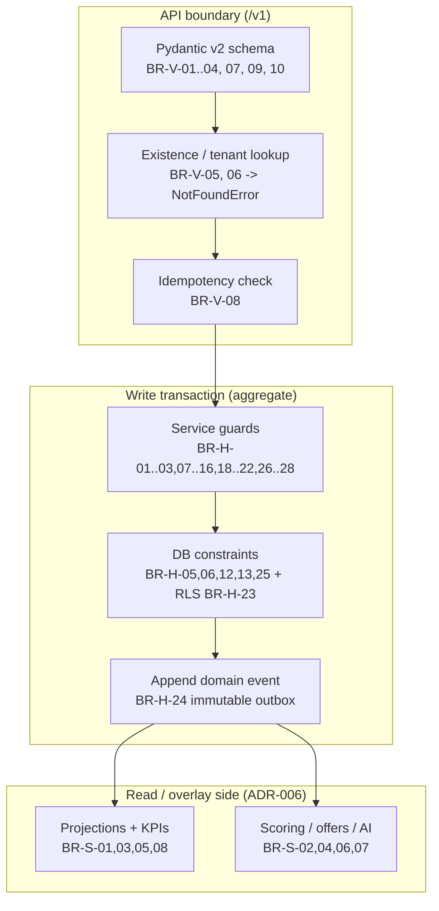
```mermaid
flowchart TB
    subgraph BOUNDARY["API boundary (/v1)"]
        SCHEMA["Pydantic v2 schema<br/>BR-V-01..04, 07, 09, 10"]
        EXIST["Existence / tenant lookup<br/>BR-V-05, 06 -> NotFoundError"]
        IDEM["Idempotency check<br/>BR-V-08"]
    end
    subgraph WRITE["Write transaction (aggregate)"]
        GUARD["Service guards<br/>BR-H-01..03,07..16,18..22,26..28"]
        DBC["DB constraints<br/>BR-H-05,06,12,13,25 + RLS BR-H-23"]
        EVT["Append domain event<br/>BR-H-24 immutable outbox"]
    end
    subgraph READ["Read / overlay side (ADR-006)"]
        PROJ["Projections + KPIs<br/>BR-S-01,03,05,08"]
        SCORE["Scoring / offers / AI<br/>BR-S-02,04,06,07"]
    end
    SCHEMA --> EXIST --> IDEM --> GUARD
    GUARD --> DBC --> EVT
    EVT --> PROJ
    EVT --> SCORE
```

**Reading the catalog:** a command must clear all applicable `BR-V-*` checks at the boundary, then satisfy every applicable `BR-H-*` invariant within the write transaction (or be rejected with the named typed exception and rolled back). Only after a successful commit and event append do `BR-S-*` rules evaluate on the projection/overlay side, producing advisory flags, re-queues, scores, and SLA overlays such as `ShipmentDelayed` — none of which alter the authoritative 8-state shipment machine.

---

## Part 6 — Event Store Design

This section **elaborates** — never redesigns — the event store and transactional outbox already specified in [`docs/03-database-architecture.md`](../03-database-architecture.md) §6–§7 and ADR-001/002/003/004/005/006. It is the behavioral companion to that schema: it explains *how the structures defined there are written, read, replayed, and projected* in the Mesaar platform. Everything here is **CQRS-lite (ADR-004), not full event sourcing** — the relational aggregate row is the source of truth for current state; `event_store` is the durable, append-only record of *what happened* and the **transactional outbox** that feeds Celery consumers and projection builders. (Tenant isolation leans on ADR-001 in §6.1; additive payload evolution leans on ADR-005 in §6.3.)

> **One sentence to anchor the whole section:** the state change *and* its event row are written in **one local transaction**; a relay then publishes asynchronously; consumers dedupe by `event_id`; projections are disposable folds of the log. The aggregate is never reconstructed from events — only **projections** are.

---

## 6.1 Event Store Structure — the envelope

Every domain event in Mesaar is a row in `event_store` (partitioned monthly by `occurred_at`, ADR-002). The **envelope** is the fixed set of columns wrapping the variable `payload` JSONB. These fields are canonical (per CANONICAL SPEC and `docs/03` §7.2) and identical for every aggregate type.

| Envelope field | Type | Role | Notes |
|---|---|---|---|
| `event_id` | UUIDv7 (PK) | **Idempotency key** | Time-ordered → near-sequential inserts; the single dedupe handle for consumers |
| `tenant_id` | uuid (FK) | Tenant isolation | RLS-scoped; events never leak across tenants (ADR-001) |
| `aggregate_type` | varchar | Stream class | `Shipment`, `Order`, `Driver`, `Vehicle`, `Route`, `Warehouse`, `Customer`, `User`/`Tenant` |
| `aggregate_id` | uuid | **Stream identity** | The stream *is* the aggregate; all of a shipment's events share this id |
| `aggregate_version` | bigint | **Per-aggregate monotonic sequence** | `UNIQUE(aggregate_id, aggregate_version)` → per-stream ordering + optimistic concurrency |
| `event_type` | varchar | Event name | `<Aggregate><PastTenseVerb>` (e.g. `ShipmentAssigned`); integration events suffixed `*IntegrationEvent` |
| `payload` | jsonb | Event-specific body | Additive evolution; GIN (`jsonb_path_ops`) indexed; carries `schema_version` (see §6.3) |
| `correlation_id` | uuid | Trace a business flow | Stable across a whole chain (e.g. one order fulfilment) |
| `causation_id` | uuid | Direct cause link | The `event_id` (or command id) that produced this event |
| `occurred_at` | timestamptz | Business time + **partition key** | Server `now()` UTC at append |
| `recorded_at` | timestamptz | Persist time | Equals/near `occurred_at`; separates wall-clock from ingest |
| `published_at` | timestamptz NULL | **Outbox marker** | `NULL` ⇒ unpublished; the relay polls `WHERE published_at IS NULL` and stamps it |

**Immutability is structural, not conventional.** The application DB role is granted `INSERT`/`SELECT` only on `event_store` — no `UPDATE`/`DELETE` (`docs/03` §6 enforcement controls). The *only* permitted mutation is the relay stamping `published_at`, which is performed by the relay's narrowly-scoped role. Corrections are **new forward events** (§6.6), never edits.

---

## 6.2 Aggregate Streams — the stream is the aggregate

A **stream** is the totally-ordered sequence of events sharing one `aggregate_id`. There is no global order across streams, and Mesaar deliberately does not need one (`docs/03` §7.3) — every consumer reasons **per aggregate**.

| Property | Mechanism | Consequence |
|---|---|---|
| Stream identity | `aggregate_id` | All events of shipment X are `WHERE aggregate_id = X` |
| Intra-stream order | `aggregate_version` 1,2,3,… monotonic, gap-free | Deterministic fold order; the audit timeline |
| Ordering guarantee | `UNIQUE(aggregate_id, aggregate_version)` | DB rejects two writers at the same version |
| Optimistic concurrency | aggregate `version` column + the unique above | Loser of a race hits the unique violation, **re-reads, re-validates, retries** |
| No cross-stream order | (intentional) | Consumers must not assume Shipment vs Driver event interleaving |

**Concurrency, concretely.** Two dispatchers try to assign the same `ready` shipment. Both read `version = N`, both attempt to append `ShipmentAssigned` at `aggregate_version = N+1`. PostgreSQL admits exactly one; the other gets a unique violation, reloads the now-`assigned` aggregate, finds the **driver-exclusivity HARD invariant** (CANONICAL SPEC) already satisfied by the winner, and fails the command cleanly with `StatusTransitionError`/conflict — no double-booking, no lost update. This *is* the optimistic-concurrency control paired with `shipments.version` (`docs/03` §7.3).

The **tracking table relationship** (`docs/03` §7.5): `shipment_tracking_events` is the *user-facing slice* of the Shipment stream (status updates, location pings, POD, exceptions). `event_store` is the *complete* internal log (it also carries Fleet/Identity/Route events that have no tracking row). When an event has both representations, **both rows are written inside the same transaction** — they cannot diverge.

---

## 6.3 Event Versioning — additive evolution, upcast on read

Stored events are **immutable**, so schema change is handled by evolving the *payload shape* additively and reconciling old shapes at read time. This mirrors the ADR-005 "/v1 stays additive" stance applied to event payloads.

| Rule | Practice |
|---|---|
| Carry a version | Each `payload` includes `schema_version` (integer, per `event_type`) |
| Additive only | New optional fields; never remove/rename/retype an existing field in place |
| Never mutate stored events | A v1 row stays v1 forever on disk |
| Upcast on read | Consumers/replayers pass each event through an **upcaster** that maps v(n) → current shape (e.g. default a newly-added field, split a renamed one) |
| Breaking change ⇒ new event | If semantics truly change, mint a new `event_type` (e.g. `ShipmentAssignedV2`) and upcast old → new in projection logic, rather than overloading the original |

This keeps replay (§6.5) correct across years of accumulated history: a projection rebuilt today folds 2026 v1 events and 2027 v2 events through the same upcasting front-door.

---

## 6.4 Idempotency Strategy — at-least-once in, exactly-once effect

The outbox + Celery (ADR-003) delivery is **at-least-once**: an event may be redelivered (relay crash after publish but before stamping, broker retry, consumer redeploy). Correctness comes from **consumer-side dedupe**, not from trying to make delivery exactly-once.

| Layer | Key | Behavior |
|---|---|---|
| Per-consumer ledger | `processed_events(consumer, event_id)` (composite PK) | Each consumer records what it has handled; a re-seen `(consumer, event_id)` is a **no-op** |
| Idempotent handlers | upsert semantics | Folding the same event twice yields the same projection row (ADR-003 rule: "all handlers idempotent, keyed by event id") |
| API edge | `idempotency_keys` (`docs/03` §2.2) | De-dupes unsafe POSTs (assign/accept/create) *before* a command ever runs |

The flow per consumer: **claim → check `processed_events` → if new, apply handler + insert the ledger row in one tx → else skip.** Because `event_id` is UUIDv7 and globally unique, it is a perfect idempotency token end-to-end.

---

## 6.5 Replay Strategy — rebuild projections, never aggregates

**Replay rebuilds projections, not aggregates** (ADR-004, `docs/03` §7.4). This is the defining property of CQRS-lite here: the aggregate's current state already lives in its relational row, so there is nothing to "replay" it from. The log exists to (re)derive **read models**.

| Step | Action |
|---|---|
| 1 | Quiesce/serialize writes to the target `proj_*` (or rebuild a shadow copy and swap) |
| 2 | `TRUNCATE` the projection (it is **derived & disposable**, `docs/03` §2.3) |
| 3 | Stream the relevant events in `(aggregate_id, aggregate_version)` order, upcast (§6.3), and re-fold via the **same idempotent handler** used live |
| 4 | Stamp `as_of`; swap the shadow in; resume the live consumer from its cursor |

Replay is **bounded and cheap** (`docs/03` §7.4): it is how a *new* read model is back-filled and how a *diverged* projection is healed (`docs/03` §10 "periodic replay-and-compare"). Aggregates and the `event_store` itself are untouched.

---

## 6.6 Snapshot Strategy — the aggregate row *is* the snapshot

In full event sourcing, snapshots avoid re-folding huge streams to get current state. **Mesaar is CQRS-lite, so the relational aggregate row already is the live, always-current snapshot** — no aggregate fold, no snapshot cadence needed for state.

| Concern | CQRS-lite answer |
|---|---|
| Current state of shipment X | Read `shipments` row — O(1), already there |
| Snapshot of an aggregate | The aggregate row itself; updated transactionally with each event |
| When are stream snapshots ever useful? | **Optionally**, only for *very long* streams read as timelines — e.g. a shipment with thousands of `ShipmentLocationReported` pings — to bound a *timeline reconstruction* (§6.7), never to recover state |
| Mechanism if adopted | A periodic *materialized timeline checkpoint* (last-N positions / rolled-up path) so audit-timeline reads don't scan the whole partition; purely an optimization, disposable like a projection |

So: **no snapshotting is required for correctness.** The only snapshots that ever appear are optional read-optimizations on pathological streams.

---

## 6.7 Reconstructing shipment history — current-state vs full audit timeline

There are two distinct "reads" of a shipment, and conflating them is the classic CQRS-lite mistake:

1. **Current state** — read the `shipments` aggregate row (the live snapshot). One row, instant, authoritative for the 8-state machine (`created → … → delivered/cancelled/returned/failed`).
2. **Full audit timeline** — fold the **Shipment stream** (`event_store WHERE aggregate_id = X ORDER BY aggregate_version`), optionally joined with its user-facing `shipment_tracking_events` slice, to answer *"what happened, when, by whom, in what order."*

Folding is a left-fold over the ordered stream: start empty, apply each event (`ShipmentCreated → ShipmentMarkedReady → ShipmentAssigned → ShipmentPickedUp` *(= entering `in_transit`)* `→ ShipmentLocationReported* → ShipmentDelivered → ProofOfDeliveryCaptured`).

**Event-level compensation vs core-state transitions.** A `ShipmentReturned` event appended after a `ShipmentDelivered` event in the same stream — the phrasing inherited verbatim from `docs/03` §7.6 — is recorded **purely as an event-level compensation/correction for audit**. It does **not** represent a legal core-state move: the AUTHORITATIVE 8-state transition map keeps `delivered` **terminal** (`delivered -> {}`), and `returned` is reachable **only** from `in_transit`. So such an after-the-fact `ShipmentReturned` is a forward correcting event layered onto the immutable log (never a mutation of the delivered event, and never a `delivered → returned` node transition). For a genuine legal return, the core-state path is `in_transit → returned`; the delivered event is never rewritten. The **`ShipmentDelayed` SLA overlay** likewise appears in the timeline as an annotation event; it does **not** alter the authoritative node — consistent with the RECONCILIATION RULES (Delayed is a derived overlay, not a stored state).

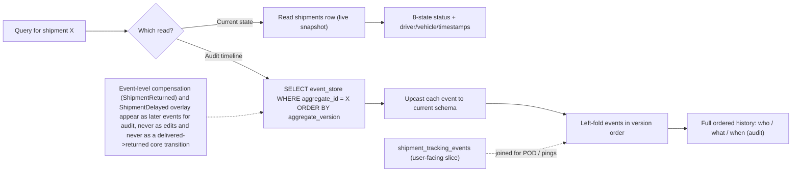
```mermaid
flowchart LR
    Q["Query for shipment X"] --> A{"Which read?"}
    A -->|"Current state"| R1["Read shipments row (live snapshot)"]
    R1 --> S1["8-state status + driver/vehicle/timestamps"]
    A -->|"Audit timeline"| R2["SELECT event_store WHERE aggregate_id = X ORDER BY aggregate_version"]
    R2 --> UP["Upcast each event to current schema"]
    UP --> F["Left-fold events in version order"]
    TRK["shipment_tracking_events (user-facing slice)"] -.->|"joined for POD / pings"| F
    F --> S2["Full ordered history: who / what / when (audit)"]
    note1["Event-level compensation (ShipmentReturned) and ShipmentDelayed overlay appear as later events for audit, never as edits and never as a delivered->returned core transition"] -.-> R2
```

| Question | Source | Cost |
|---|---|---|
| "Is X delivered right now?" | `shipments` row (snapshot) | O(1) |
| "Show the assignment → pickup → delivery sequence with actors" | fold of `event_store` stream | O(stream length) |
| "What does the customer see?" | `shipment_tracking_events` slice | indexed `(tenant_id, shipment_id, event_time)` |

---

## 6.8 How audit logs are generated — three layers, immutable

Audit (`docs/03` §6) is **defense-in-depth across three layers**, with the event store as the *business* audit trail and a trigger-driven generic table as the forensic safety-net beneath it.

| Layer | What | Mechanism | Mutability |
|---|---|---|---|
| 1 — Column lineage | `created_by`/`updated_by`/`version` on every aggregate | Actor pushed as GUC `app.current_user_id` from JWT | rewritten in place (cheap "who last touched") |
| 2 — Row history | `audit.audit_log`: `old_row`/`new_row` JSONB per I/U/D | One reusable `AFTER` row trigger per audited table | **append-only, partitioned monthly** |
| 3 — Domain/business | `event_store` + `shipment_tracking_events` | Emitted on each transition; what auditors & control tower read | **immutable, ordered, attributable** |

**Immutability is enforced by grants** (`docs/03` §6): the app role holds `INSERT`/`SELECT` only on `event_store`, `audit_log`, and tracking partitions; only a maintenance role detaches/drops aged partitions (retention). **Optional tamper-evidence**: each `audit_log`/`event_store` row may carry `prev_hash` + `row_hash` over its canonical payload, forming a **hash-chain** — any break is detectable, satisfying high-assurance compliance without a separate ledger DB. Both layers carry `tenant_id` and are RLS-scoped, so a tenant can safely be shown *its own* trail.

```mermaid
flowchart TD
    CMD["Command mutates aggregate row"] --> TX["One DB transaction"]
    TX --> AGG["UPDATE shipments (version++, updated_by from GUC)"]
    TX --> EVT["INSERT event_store (immutable business event)"]
    AGG --> TRG["AFTER row trigger fires"]
    TRG --> AUD["INSERT audit.audit_log (old_row/new_row, actor, txid)"]
    EVT --> H1["optional: prev_hash + row_hash (hash-chain)"]
    AUD --> H2["optional: prev_hash + row_hash (hash-chain)"]
    GRANTS["App role: INSERT/SELECT only — no UPDATE/DELETE"] -.->|"enforces immutability"| EVT
    GRANTS -.-> AUD
    RLS["tenant_id + RLS"] -.->|"scopes reads"| AUD
```

---

## 6.9 How projections are updated — outbox → relay → bus → consumers → `proj_*`

Projections (ADR-006) are **idempotent folds** maintained by Celery consumers. The transactional outbox guarantees the events that drive them are never lost.

```mermaid
flowchart LR
    subgraph TXN["Single local DB transaction"]
        AGG["Aggregate row (write model, source of truth)"]
        ES["event_store (published_at = NULL)"]
    end
    AGG -. "same commit" .- ES
    ES --> RELAY["Outbox relay / poller: SELECT WHERE published_at IS NULL"]
    RELAY -->|"publish"| BUS["Redis broker (Celery)"]
    RELAY -->|"stamp"| STAMP["UPDATE published_at = now()"]
    BUS --> C1["Projection consumer (idempotent)"]
    C1 --> PE{"event_id in processed_events?"}
    PE -->|"yes"| SKIP["No-op (dedupe)"]
    PE -->|"no"| UPS["Upsert proj_* + insert processed_events (one tx)"]
    UPS --> P1["proj_active_shipments"]
    UPS --> P2["proj_driver_status"]
    UPS --> P3["proj_warehouse_load"]
    UPS --> P4["proj_sla_risk"]
    UPS --> P5["proj_driver_daily_stats"]
    UPS --> ASOF["Stamp as_of timestamp"]
    LAG["outbox_relay_state cursor → Prometheus lag gauge"] -.-> RELAY
```

| Projection | Folded from (canonical events) |
|---|---|
| `proj_active_shipments` | `ShipmentAssigned`, `ShipmentPickedUp`, `ShipmentLocationReported`, `ShipmentDelivered`, `ShipmentFailed`, `ShipmentReturned` |
| `proj_driver_status` | `DriverWentOnline`, `DriverWentOffline`, `DriverAssigned`, `DriverStatusChanged` |
| `proj_warehouse_load` | `ShipmentCreated`, `ShipmentAssigned` (load **added** to origin/destination over ACTIVE shipments), `ShipmentCancelled` + terminal `ShipmentDelivered`/`ShipmentFailed`/`ShipmentReturned` (load **removed** as the shipment leaves ACTIVE), `ShipmentReceivedAtWarehouse`, `ShipmentDispatchedFromWarehouse`, plus threshold signals `WarehouseCapacityThresholdReached` / `WarehouseCapacityExceeded` — folded as committed weight/volume over ACTIVE shipments vs `capacity_weight_kg` / `capacity_volume_m3` (aligns with Part 2 policy P6 Warehouse-Load-Sync and Part 7 Table B) |
| `proj_sla_risk` | clock vs `delivery_due_at` → `ShipmentDelayed` overlay |
| `proj_driver_daily_stats` | `ShipmentDelivered` + tracking distance |

**Eventual consistency is explicit.** Each `proj_*` row carries an `as_of` timestamp the UI renders ("as of HH:MM:SS"); the sub-second target is monitored by a **Prometheus projection-lag gauge** fed from `outbox_relay_state` (ADR-006; `docs/03` §10). Divergence is healed by bounded **replay** (§6.5).

---

## 6.10 End-to-end command → read-model sequence

This ties the whole write→read path together and shows precisely where the **dual-write problem** is solved: there is exactly **one** transaction touching the database for the state change, and the broker is **never** written directly.

```mermaid
sequenceDiagram
    autonumber
    participant API as "API (/v1 command)"
    participant SVC as "Application service"
    participant DB as "PostgreSQL"
    participant AGG as "Aggregate row (write model)"
    participant ES as "event_store (outbox)"
    participant RLY as "Outbox relay"
    participant BUS as "Redis / Celery bus"
    participant CON as "Idempotent consumer"
    participant PRJ as "proj_* read models"

    API->>SVC: "assign_driver_and_vehicle(cmd)"
    SVC->>DB: "BEGIN (SET LOCAL tenant/user GUC)"
    SVC->>AGG: "validate HARD invariants + transition map"
    AGG-->>SVC: "ok (created/ready -> assigned)"
    SVC->>AGG: "UPDATE shipments (version++, assigned_at)"
    SVC->>ES: "INSERT ShipmentAssigned (aggregate_version N+1, published_at=NULL)"
    Note over AGG,ES: "Same transaction — solves the dual-write problem"
    SVC->>DB: "COMMIT (UNIQUE(aggregate_id,version) guards the race)"
    DB-->>API: "201 / command result"

    RLY->>ES: "poll WHERE published_at IS NULL"
    ES-->>RLY: "unpublished events"
    RLY->>BUS: "publish event (at-least-once)"
    RLY->>ES: "UPDATE published_at = now()"

    BUS->>CON: "deliver ShipmentAssigned"
    CON->>PRJ: "check processed_events(consumer,event_id)"
    alt "already processed"
        CON-->>BUS: "ack (no-op, dedupe)"
    else "new"
        CON->>PRJ: "upsert proj_active_shipments + proj_driver_status, stamp as_of"
        CON->>PRJ: "insert processed_events (same tx)"
        CON-->>BUS: "ack"
    end
```

**Why this is correct and why it is CQRS-lite:**

- **Dual-write solved by the outbox.** The aggregate mutation and the event row commit *atomically*; publishing to Redis is a *separate, later* step performed only by the relay reading committed rows. We never write to the broker inside the request — eliminating the "DB committed but event lost" (or vice-versa) failure documented in `docs/03` §10 risks.
- **At-least-once + dedupe = effectively-once.** A relay crash after publish/before stamp simply replays the event; `processed_events` makes the consumer a no-op (§6.4).
- **CQRS-lite, not event sourcing.** The aggregate row is read for current state and *is* the snapshot (§6.6); events drive **projections and audit only**; replay rebuilds **projections, never aggregates** (§6.5). This delivers full auditability and fast control-tower reads while keeping the existing models and queries intact — exactly the ADR-004 bargain.

---

## Part 7 — CQRS Design

Status: **Draft for approval (Phase 4).** Elaborates the CQRS-lite split already decided in **ADR-004** (aggregate is source of truth), **ADR-006** (projection read-models), and the `event_store` + transactional-outbox design in **docs/03-database-architecture.md** §6–7. Nothing here contradicts the authoritative shipment state machine or the assignment/capacity/exclusivity guards in `app/services/shipment_service.py`; it formalizes how those writes feed reads. Write aggregates that **exist** today (Shipment, Driver, Vehicle, Warehouse, User/Tenant) are marked accordingly; Order, Route, Customer, Invoice/Settlement, Notification, Prediction are **new/target**.

### 7.1 The split, in one sentence

The **write side** mutates a single authoritative aggregate row and appends the corresponding immutable domain event **in the same transaction** (outbox); the **read side** projects those events asynchronously into denormalized, query-shaped tables that the console, driver app, and `/v1` APIs read. Writes optimize for **consistency** (optimistic concurrency, invariants enforced in the aggregate/DB); reads optimize for **availability** (eventual consistency, `as_of` timestamps, lag-monitored).

This is **CQRS-lite**: the relational aggregate row **is** the current-state snapshot (no aggregate rehydration from the log for normal operation). Replay rebuilds **projections**, not aggregates.

---

### 7.2 Write models (command side)

Source of truth. Each command runs in **one transaction** that (a) loads the aggregate, (b) checks invariants/guards, (c) mutates state, (d) appends the domain event(s) to `event_store` via the outbox, and (e) bumps `aggregate_version`. Concurrency is protected by `UNIQUE(aggregate_id, aggregate_version)` (optimistic locking) — a stale writer collides and retries. Every event carries `event_id` (UUIDv7), `tenant_id`, `aggregate_type`, `aggregate_id`, `aggregate_version`, `occurred_at`, `correlation_id`, `causation_id`, `payload` (docs/03 §7).

#### Write aggregates → commands → events (summary)

| Aggregate | Status | Representative commands | Emits |
|---|---|---|---|
| User / Tenant (Identity) | exists | RegisterUser, ActivateUser, DeactivateUser, AssignRole, RevokeRole, GrantPermission, RevokePermission, ProvisionTenant, SuspendTenant | UserRegistered, UserActivated, UserDeactivated, RoleAssigned, RoleRevoked, PermissionGranted, PermissionRevoked, TenantProvisioned, TenantSuspended |
| Customer | **new** | CreateCustomer, UpdateCustomer, DeactivateCustomer, ChangeCustomerCreditLimit | CustomerCreated, CustomerUpdated, CustomerDeactivated, CustomerCreditLimitChanged |
| Order | **new** | CreateOrder, SubmitOrder, ApproveOrder, RejectOrder, CancelOrder, StartFulfilment, CompleteOrder | OrderCreated, OrderSubmitted, OrderApproved, OrderRejected, OrderCancelled, OrderFulfilmentStarted, OrderCompleted |
| **Shipment** | exists (richest) | CreateShipment, MarkShipmentReady, AssignDriverAndVehicle / AssignDriverOnly, ConfirmPickup, ReportLocation, MarkDelivered, CaptureProofOfDelivery, MarkFailed, ReturnShipment, CancelShipment, RaiseException | ShipmentCreated, ShipmentMarkedReady, ShipmentAssigned, ShipmentPickedUp, ShipmentLocationReported, ShipmentDelivered, ProofOfDeliveryCaptured, ShipmentFailed, ShipmentReturned, ShipmentCancelled, ShipmentExceptionRaised |
| Driver | exists | CreateDriver, GoOnline, GoOffline, AcceptOffer (→assign), SuspendDriver, ReinstateDriver | DriverCreated, DriverWentOnline, DriverWentOffline, DriverAssigned, DriverStatusChanged, DriverSuspended, DriverReinstated |
| Vehicle (Fleet) | exists | RegisterVehicle, StartMaintenance, CompleteMaintenance, DecommissionVehicle (assign/release driven by Shipment) | VehicleRegistered, VehicleMaintenanceStarted, VehicleMaintenanceCompleted, VehicleDecommissioned, VehicleAssigned, VehicleReleased, VehicleStatusChanged |
| Route | **new** | CreateRoute, PlanRoute, OptimizeRoute, StartRoute, CompleteRouteStop, CompleteRoute, CancelRoute | RouteCreated, RoutePlanned, RouteOptimized, RouteStarted, RouteStopCompleted, RouteCompleted, RouteCancelled |
| Warehouse | exists | RegisterWarehouse, ReceiveShipment, DispatchShipment | WarehouseRegistered, ShipmentReceivedAtWarehouse, ShipmentDispatchedFromWarehouse, WarehouseCapacityThresholdReached, WarehouseCapacityExceeded |
| Notification | **new** | (reacts to NotificationRequestedIntegrationEvent) DispatchNotification | NotificationSent, NotificationFailed |
| Billing | **new** | QuotePrice, RequestSettlement, GenerateInvoice, CapturePayment, CalculateDriverPayout | PriceQuoted, SettlementRequestedIntegrationEvent, InvoiceGenerated, PaymentCaptured, DriverPayoutCalculated |
| AI Operations | **new** | RequestPrediction, RecordModelFeedback | PredictionRequested, PredictionGenerated, ModelFeedbackRecorded, AnomalyDetected |

> Note: `ShipmentPickedUp` **is** the `assigned → in_transit` transition (== entering `in_transit`); there is no separate stored "PickedUp" state. `ShipmentDelayed` is **not** a command-driven state change — it is an SLA overlay emitted by an SLA evaluation process on the Shipment context (see §7.3), never a node in the authoritative 8-state machine.

#### Table A — Write (Command catalog)

| Command | Actor / Role | Aggregate | Pre-conditions / Guards (invariant class) | Emitted Event(s) |
|---|---|---|---|---|
| CreateShipment | client, manager, admin | Shipment | `weight_kg > 0`, `volume_m3 > 0` (Validation, DB CHECK); `reference_code` 3–64 no-whitespace & **unique per tenant** (Validation/Hard); origin+destination warehouses exist (Validation); origin **and** destination warehouse capacity not exceeded over ACTIVE shipments (Hard at create) | ShipmentCreated |
| MarkShipmentReady | manager, admin | Shipment | state `created` (transition `created→ready`); else StatusTransitionError (Hard) | ShipmentMarkedReady |
| AssignDriverAndVehicle / AssignDriverOnly | manager, admin | Shipment (+Driver, +Vehicle) | state ∈ `{created, ready}`; driver linked to **driver-role** user **and** `is_available` (Hard); vehicle `status==active` (Hard); driver **and** vehicle exclusivity — no 2nd ACTIVE shipment (Hard); `weight_kg ≤ vehicle.capacity_weight_kg` and volume likewise (Hard); origin+destination warehouse capacity (Hard); driver proximity/route-efficiency ranking (Soft, advisory only) | ShipmentAssigned (+ VehicleAssigned, DriverAssigned) |
| ConfirmPickup | driver, manager | Shipment | state `assigned` (transition `assigned→in_transit`) (Hard) | **ShipmentPickedUp** (== in_transit) |
| ReportLocation | driver | Shipment / Tracking | `event_time ≥ last event_time` (**monotonic**, Hard); `lat∈[-90,90]`, `lng∈[-180,180]` (Validation); no core-state change | ShipmentLocationReported |
| MarkDelivered | driver, manager | Shipment | state `in_transit` (transition `in_transit→delivered`); stamps `delivered_at` (Hard) | ShipmentDelivered |
| CaptureProofOfDelivery | driver | Shipment / Tracking | shipment `delivered`/in delivery; append-only POD tracking event, monotonic `event_time` (Hard) | ProofOfDeliveryCaptured |
| MarkFailed / ReturnShipment | driver, manager | Shipment | state `in_transit` (transitions `→failed` / `→returned`) (Hard) | ShipmentFailed / ShipmentReturned |
| CancelShipment | manager, admin | Shipment | state ∈ `{created, ready, assigned}` only; terminal states immutable (Hard); stamps `cancelled_at` | ShipmentCancelled |
| RaiseException | driver, manager | Shipment / Tracking | append-only `exception` tracking event; monotonic `event_time` (Hard); no forced core transition | ShipmentExceptionRaised |
| GoOnline / GoOffline | driver | Driver | `is_available` toggle; suspended driver cannot go online (Hard, proposed) | DriverWentOnline / DriverWentOffline (+ DriverStatusChanged) |
| AcceptOffer | driver | Driver→Shipment | offer still `READY` & unassigned within 15s window (Soft window); then full assignment guards (Hard) | DriverAssigned, ShipmentAssigned |
| SuspendDriver / ReinstateDriver | admin | Driver | admin action; suspend forbidden while holding ACTIVE shipment unless force-reassign (Hard, proposed) | DriverSuspended / DriverReinstated |
| StartMaintenance / CompleteMaintenance / DecommissionVehicle | manager, admin | Vehicle | follow vehicle enum `active↔maintenance`, `→decommissioned` (terminal) (Hard); cannot maintenance/decommission a vehicle on an ACTIVE shipment (Hard) | VehicleMaintenanceStarted / VehicleMaintenanceCompleted / VehicleDecommissioned (+ VehicleStatusChanged) |
| SubmitOrder / ApproveOrder / StartFulfilment | client / manager / system | Order | `submitted` requires complete order; `approved` may require **credit check** (Customer/Billing) (Soft→Hard gate); **cannot fulfil unless approved**; completed/cancelled order immutable (Hard) | OrderSubmitted / OrderApproved / OrderFulfilmentStarted |
| OptimizeRoute / StartRoute | manager, system | Route | route `planned`→`optimized`→`started`; stops `pending→completed/skipped` (Hard, proposed) | RouteOptimized / RouteStarted (+ RouteStopCompleted) |
| QuotePrice / GenerateInvoice / CalculateDriverPayout | system, billing-admin | Billing | positive money, currency ISO-4217 shape (Validation); invoice only against delivered/completed work (Hard) | PriceQuoted / InvoiceGenerated / DriverPayoutCalculated |

**Cross-cutting write invariants (all aggregates):** tenant isolation via `tenant_id` + RLS (cross-tenant write denied); events are **immutable & append-only** — a reversal is a **compensating event** (e.g. `ShipmentReturned` after `ShipmentDelivered`), never an edit or delete; optimistic concurrency on `aggregate_version`.

---

### 7.3 Read models (query side)

Projections are denormalized PostgreSQL tables (ADR-006), rebuilt by **idempotent** event consumers keyed on `processed_events(consumer, event_id)`. Reads are eventually consistent (sub-second target) and surface an `as_of` timestamp; projection lag is monitored via a Prometheus gauge. Replay from the append-only `event_store` rebuilds these tables (bounded replay), never the aggregates.

The canonical ADR-006 projection set is exactly **five**; Order and Route read needs are served from these plus generic Analytics roll-ups, not from new bespoke projections (Part 7 does not add projections beyond the ADR-006 baseline agreed with Analytics in Part 1 §1.12, the Event Store design in Part 6 §6.9, and AI Readiness in Part 8 §8.4).

| Projection | Status | Shape / purpose |
|---|---|---|
| `proj_active_shipments` | ADR-006 | One row per non-terminal shipment: driver, vehicle, origin/dest, current node, last location → ops board & live map. The **driver offers list** is a filtered view (`status == ready` AND `driver_id IS NULL`) over this projection — see the `driver_service` nearby-offer query. |
| `proj_driver_status` | ADR-006 | Per-driver derived operational status (offline/available/assigned/busy) + last-seen → dispatch |
| `proj_warehouse_load` | ADR-006 | Per-warehouse weight/volume committed over ACTIVE shipments vs capacity, daily count vs `max_daily_shipments` → capacity overview |
| `proj_sla_risk` | ADR-006 | Per-shipment SLA-risk overlay (`on_track` / `at_risk` / `delayed`) from clock vs `delivery_due_at` → exception center; surfaces the **ShipmentDelayed** overlay (event emitted by the Shipment-context SLA evaluation, not by this projection — see note below) |
| `proj_driver_daily_stats` | ADR-006 | Per-driver/day deliveries, distance, earnings → driver app KPIs |

> **Order/Route read views.** Order console and route-board read needs are served by querying the commercial Order / Route aggregate rows directly (current-state snapshots), joined to `proj_active_shipments` for execution status, and by generic **Analytics roll-ups** over the canonical event stream — **not** by new dedicated projections. This keeps the projection set aligned at the agreed ADR-006 five.

#### Table B — Read (Query / view catalog)

| Query / View | Read model (projection) | Source events | Consumer |
|---|---|---|---|
| Live ops board / live map | `proj_active_shipments` | ShipmentAssigned, ShipmentPickedUp, ShipmentLocationReported, ShipmentDelivered, ShipmentFailed, ShipmentReturned, ShipmentCancelled | Console (control tower) |
| Dispatch availability grid | `proj_driver_status` | DriverWentOnline, DriverWentOffline, DriverAssigned, DriverStatusChanged, DriverSuspended, DriverReinstated, ShipmentDelivered/Failed/Returned (release) | Console / `/v1` dispatch API |
| Warehouse capacity overview | `proj_warehouse_load` | ShipmentCreated, ShipmentAssigned, ShipmentReceivedAtWarehouse, ShipmentDispatchedFromWarehouse, ShipmentDelivered, WarehouseCapacityThresholdReached, WarehouseCapacityExceeded | Console |
| Exception / SLA-risk center | `proj_sla_risk` | ShipmentPickedUp, ShipmentLocationReported, ShipmentExceptionRaised, ShipmentDelayed (+ clock vs `delivery_due_at`) | Console (control tower) |
| Driver app home (earnings/KPIs) | `proj_driver_daily_stats` | ShipmentDelivered, ProofOfDeliveryCaptured, ShipmentLocationReported (distance), DriverPayoutCalculated | Driver app |
| Driver nearby offers list | `proj_active_shipments` filtered view (`status==ready` AND `driver_id IS NULL`) + `proj_driver_status` | ShipmentMarkedReady, ShipmentAssigned (removes), DriverWentOnline | Driver app |
| Order console / fulfilment tracker | Order aggregate rows + `proj_active_shipments` (fan-out roll-up) | OrderCreated, OrderSubmitted, OrderApproved, OrderRejected, OrderFulfilmentStarted, OrderCompleted, OrderCancelled, ShipmentCreated/Delivered (fan-out) | Console / client portal |
| Route board / dispatcher sequencing | Route aggregate rows + `proj_active_shipments` | RouteCreated, RoutePlanned, RouteOptimized, RouteStarted, RouteStopCompleted, RouteCompleted, RouteCancelled | Console |
| KPI / control-tower snapshots | (Analytics roll-ups over above) | all delivery/SLA domain events (ShipmentDelivered, ShipmentFailed, ShipmentReturned, ShipmentDelayed, OrderCompleted, …) | Analytics dashboards |

> Note: the KPI roll-up **consumes** delivery/SLA domain events and **emits** its own Analytics lifecycle events (`ProjectionRebuilt`, `KpiSnapshotComputed`); those are outputs of the Analytics context, not source events feeding the roll-up.

> **ShipmentDelayed** is emitted by an **SLA evaluation process on the Shipment context** — the scheduled SLA-Risk-Sweep policy (Part 2, P9) ticks against the Shipment domain, compares the clock against `delivery_due_at`, and appends `ShipmentDelayed` via the aggregate's outbox (producer = Shipment, derived; Part 3 §3.4). The `proj_sla_risk` projection then **consumes** that event to flip its overlay to `delayed` and **surface** the risk in the exception center; the projection consumer never appends events to the authoritative store. It never mutates the shipment's authoritative node.

---

### 7.4 The full CQRS loop

```mermaid
flowchart TB
  Actor["Actor (manager / driver / client / system)"]

  subgraph WRITE["Write Side (consistency)"]
    direction TB
    CMD["Command (e.g. AssignDriverAndVehicle)"]
    HANDLER["Command Handler / Service (RBAC + tenant scope)"]
    AGG["Aggregate (Shipment / Order / Driver / Vehicle / Route)"]
    GUARD["Invariants and Guards (exclusivity, capacity, transition map)"]
    TX["Single Transaction (optimistic concurrency on aggregate_version)"]
    ROW[("Aggregate Row = current-state snapshot")]
    ES[("event_store (append-only, immutable)")]
    OUTBOX[("Transactional Outbox")]
  end

  subgraph READ["Read Side (availability / eventual consistency)"]
    direction TB
    RELAY["Outbox Relay / Dispatcher (runs on the ADR-003 worker tier)"]
    PROJ["Projector / Consumer (idempotent: processed_events)"]
    RM[("Read Models: proj_active_shipments, proj_driver_status, proj_warehouse_load, proj_sla_risk, proj_driver_daily_stats")]
    QUERY["Query / Console View (returns data + as_of timestamp)"]
  end

  Actor -->|"issues"| CMD
  CMD --> HANDLER
  HANDLER --> AGG
  AGG --> GUARD
  GUARD -->|"pass"| TX
  GUARD -->|"violation"| Actor
  TX --> ROW
  TX --> ES
  ES --> OUTBOX

  OUTBOX -->|"async, at-least-once"| RELAY
  RELAY --> PROJ
  PROJ -->|"upsert"| RM
  RM --> QUERY
  QUERY -->|"eventually-consistent read"| Actor

  ROW -.->|"replay rebuilds projections, not aggregates"| ES
```

---

### 7.5 Alignment notes

| Concern | Decision | Authority |
|---|---|---|
| Source of truth | The aggregate row is authoritative current state; commands mutate it in one transaction that also appends the event. Projections are derived, disposable, rebuildable. | ADR-004 |
| Event store / outbox | Domain event appended to `event_store` in the same transaction as the aggregate mutation (transactional outbox); relay (running on the ADR-003 worker tier) forwards to consumers. | docs/03 §7 |
| Projections | Denormalized PG tables (the ADR-006 five) built by idempotent consumers; `as_of` surfaced; lag gauge. | ADR-006, docs/03 §6 |
| Write-side concurrency | Optimistic locking via `UNIQUE(aggregate_id, aggregate_version)`; stale writer collides and retries. | ADR-004 |
| Read-side consistency | Eventual (sub-second target); UI shows "as of"; never blocks the write path. | ADR-006 |
| Idempotency | `event_id` (UUIDv7) + `processed_events(consumer, event_id)`; re-delivery is safe. | docs/03 §7 |
| SLA overlay emitter | `ShipmentDelayed` is appended by the Shipment-context SLA-Risk-Sweep (Part 2 P9; producer = Shipment/derived, Part 3 §3.4) via the outbox; `proj_sla_risk` only consumes and surfaces it. | Part 2 P9 / Part 3 §3.4 |
| Snapshots | CQRS-lite — aggregate row **is** the snapshot; optional periodic stream snapshots only for very long streams (e.g. a shipment with thousands of location pings); replay rebuilds **projections**. | ADR-004 / §7.1 |
| Reversals | Compensating events only (e.g. `ShipmentReturned` after `ShipmentDelivered`); no edits/deletes of stored events. | docs/03 §7 |

Relevant existing artifacts: `docs/03-database-architecture.md` (§6 audit, §7 event store/outbox), `docs/adr/ADR-004-event-model.md`, `docs/adr/ADR-006-read-models.md`, `docs/adr/ADR-003-background-jobs.md`, `app/services/shipment_service.py` (authoritative guards), `app/services/driver_service.py` (nearby-offer query), `app/models/enums.py` (authoritative shipment statuses).

---

## Part 8 — AI Readiness & AI Event Catalog

Status: **NEW (target capability).** This part does not introduce any new storage design — it specifies *how* the AI Operations context (context 13) consumes the substrate already designed in [`docs/03-database-architecture.md` §9](../03-database-architecture.md) (`event_store`, `proj_*`, `ml_features_*`, `ml_predictions`, `embeddings`, PostGIS). The event log is the training stream; projections are the online feature surface; `ml_predictions.actual_outcome` closes the feedback loop. Nothing here redesigns ADR-002/004/006 or §9 — it elaborates their behavioral use for machine learning.

> **AI Operations is a Core/differentiator context (context 13), but it is strictly *downstream and read-only* over the authoritative model.** No model output mutates an aggregate directly. Predictions land in `ml_predictions` and surface as overlays (e.g. `proj_sla_risk`, the `ShipmentDelayed` SLA overlay) or as advisory **Soft constraints** (assignment ranking, dynamic price) — never as Hard constraints and never as a node that breaks the authoritative 8-state shipment machine.

---

## 8.1 Design principle — "capture-by-default, model-later"

The platform is already emitting, into an immutable ordered log, every signal a future model needs. AI readiness is therefore **a discipline of capture and reconstruction, not of new pipelines**:

| Principle | Mechanism (already designed) | Why it matters for ML |
|---|---|---|
| **Point-in-time correctness** | `event_store.occurred_at`, per-aggregate `aggregate_version`, monotonic tracking `event_time` | Features/labels reconstructed *as of* a decision time → no target leakage |
| **Immutable, append-only history** | `event_store` + `shipment_tracking_events` (ADR-004, §6/§7); reversals are compensating events | Stable, replayable training set; the label can never be silently overwritten |
| **Online/offline parity** | `proj_*` (live) and `ml_features_shipment` (snapshot) share derivation (§9.3) | Training features == serving features → no train/serve skew |
| **Tenant-scoped by construction** | every event/projection/feature/prediction/embedding carries `tenant_id` under RLS (ADR-001, §8.3/§9.6) | No cross-tenant training or retrieval by default |
| **Reproducibility** | `ml_predictions.model_version` + `features_ref` + point-in-time events (§9.6) | Any prediction is auditable and replayable |
| **Additive label space** | enum-as-VARCHAR (`native_enum=False`, §0) | New cargo/exception/anomaly categories are migrations, not `ALTER TYPE` locks |

---

## 8.2 Signals to capture for future AI

The signals below are **already produced** by the canonical domain events (Part — Event Catalog / §7) and the `proj_*` read models (ADR-006). The AI Operations context subscribes to them off the outbox; it does not require new write paths.

| Signal | Primary canonical event(s) | Where it materializes |
|---|---|---|
| **Delivery delays / SLA risk** | `ShipmentDelayed`, `ShipmentDelivered`, `ShipmentPickedUp` | `proj_sla_risk`, `shipments.delivery_due_at` vs `delivered_at` |
| **Route changes / deviations** | `RoutePlanned`, `RouteOptimized`, `RouteStopCompleted`, `ShipmentLocationReported` | `event_store` (Route streams) + tracking pings vs planned corridor (PostGIS, §9.5) |
| **Driver performance** | `ShipmentDelivered`, `ProofOfDeliveryCaptured`, `ShipmentFailed`, `ShipmentReturned`, `ShipmentExceptionRaised`, `DriverAssigned` | `proj_driver_daily_stats` |
| **Driver accept/decline behavior** | `DriverAssigned` (accept path), offer expiry (no event = decline/timeout, 15s window) | `proj_driver_status` + offer-feed telemetry |
| **Vehicle utilization** | `VehicleAssigned`, `VehicleReleased`, `VehicleStatusChanged`, `VehicleMaintenanceStarted/Completed` | derived operational overlay (active+on-shipment = Assigned) |
| **Warehouse utilization** | `ShipmentReceivedAtWarehouse`, `ShipmentDispatchedFromWarehouse`, `WarehouseCapacityThresholdReached`, `WarehouseCapacityExceeded` | `proj_warehouse_load` |
| **Exceptions / anomalies** | `ShipmentExceptionRaised`, `ShipmentFailed`, `ShipmentReturned`, `AnomalyDetected` | exception center + `event_store` |
| **Location pings (geo trajectory)** | `ShipmentLocationReported` | `shipment_tracking_events` (partitioned, BRIN) → PostGIS features |
| **Pricing / offer outcomes** | `PriceQuoted`, `DriverAssigned` (offer accepted), offer expiry (declined) | `ml_predictions` (price) joined to acceptance outcome |
| **Demand / capacity intake** | `OrderCreated`, `OrderApproved`, `ShipmentCreated` | order/shipment arrival rate per warehouse/time bucket |

> **Decline capture caveat.** Per the authoritative driver self-service rules, *decline causes no state mutation* (the offer stays `ready`). A decline therefore produces **no domain event**. To make accept/decline learnable, the offer-feed interaction (offer shown → accepted/declined/expired, 15s window) must be captured as **operational telemetry written to `ml_features_*`** at offer time — it is a feature signal, not a state transition, and must not be promoted into the authoritative state machine.

---

## 8.3 AI Event Catalog

Each row maps observable signals to a prediction target, a candidate model class, a horizon, and — critically — how ground-truth labels are derived from the immutable log. All labels are computed **after** the outcome event lands, using `occurred_at`/timestamps for point-in-time alignment.

| Signal / Event(s) | Feature Source | Prediction Target | Candidate Model | Prediction Horizon | Label Source (ground-truth derivation) |
|---|---|---|---|---|---|
| `ShipmentPickedUp`, `ShipmentLocationReported`, route corridor, PostGIS distance-to-dest | `proj_active_shipments`, tracking pings, `ml_features_shipment` | **ETA** (predicted arrival time) | Gradient-boosted regressor / sequence model on ping trajectory | Continuous, refreshed per ping until delivery | `delivered_at` from `ShipmentDelivered` minus prediction time → residual |
| `ShipmentDelayed`, `delivery_due_at`, in-transit progress, warehouse load | `proj_sla_risk`, `proj_warehouse_load` | **SLA-breach risk** (P[late]) | Binary classifier (GBM / calibrated logistic) | Remaining time-to-due, refreshed each event | `SLA-met = delivered_at <= delivery_due_at` (§9.1); breach = late or terminal-non-delivered |
| `PriceQuoted`, cargo_type, required_vehicle_type, lane (origin→dest), demand, `DriverAssigned`/offer-expiry | `ml_features_shipment`, `proj_warehouse_load` | **Dynamic price / quote** | Regression + acceptance-uplift model | At quote/offer time | Realized: offer **accepted** (`DriverAssigned` within 15s) vs **expired/declined**; settled `price_sar` |
| `DriverAssigned`, accept/decline telemetry, proximity (haversine/PostGIS), driver history | `proj_driver_status`, `proj_driver_daily_stats` | **Driver-assignment ranking** | Learning-to-rank (pairwise/listwise) | Per offer event | Accepted offer + successful `ShipmentDelivered` (no `ShipmentFailed`/exception) = positive |
| `OrderCreated`/`OrderApproved`, `ShipmentCreated`, `ShipmentReceivedAtWarehouse` arrival rates | `proj_warehouse_load`, time-bucketed `event_store` folds | **Demand / capacity forecast per warehouse** | Time-series (Prophet/temporal GBM/seq) | Hourly–daily, 1–14 day horizon | Realized arrival/dispatch counts vs `max_daily_shipments` (Soft constraint) |
| `VehicleStatusChanged`, `VehicleMaintenanceStarted/Completed`, utilization, age/mileage | vehicle lifecycle stream, operational overlay | **Predictive maintenance** | Survival / classification (time-to-failure) | Days–weeks ahead | `VehicleMaintenanceStarted` / `VehicleDecommissioned` event as failure label |
| `ShipmentExceptionRaised`, `ShipmentFailed`, `ShipmentReturned`, off-corridor pings, POD anomalies, price outliers | `event_store` (all aggregates), embeddings (§9.2) | **Anomaly / fraud detection** | Unsupervised (isolation forest / autoencoder) + rules; `AnomalyDetected` | Near-real-time on event arrival | Confirmed exception/fraud disposition fed back to `ml_predictions.actual_outcome` |
| Tracking `notes`, exception text, POD/document content | `embeddings` (pgvector HNSW), `document_chunks` | **Semantic retrieval / RAG / dedup** | Embedding model + ANN; ops copilot | On demand | Human relevance / disposition labels; retrieval click-through |

---

## 8.4 Feature Sources (from §9 — not redesigned)

| Source | What it provides | ML role |
|---|---|---|
| **`event_store` streams** | Complete immutable, ordered, versioned domain-event history (all aggregates) | **Offline training substrate.** Fold/replay by aggregate, reconstruct state *as of* `occurred_at` for leak-free labels |
| **`proj_*` read models** (ADR-006) | Current-state, low-latency views (`proj_active_shipments`, `proj_driver_status`, `proj_warehouse_load`, `proj_sla_risk`, `proj_driver_daily_stats`) | **Online serving features** at inference time; each carries `as_of` for staleness control |
| **`ml_features_shipment`** (and sibling `ml_features_*`) | Versioned **point-in-time** feature snapshots; many columns are `proj_*` surfaced for reuse (§9.3) | **Offline/online parity** — same derivation trains and serves; eliminates train/serve skew; also where offer-feed telemetry (accept/decline) is captured |
| **`embeddings` (pgvector, HNSW)** (§9.2) | Semantic vectors over notes/exceptions/POD/documents; address normalization; similar-shipment / driver↔shipment retrieval | Retrieval features, ETA/assignment priors, RAG corpus — all RLS tenant-scoped |
| **PostGIS geo features** (§9.5, triggered) | `geography(Point,4326)` + GiST: distance-to-warehouse, geofence crossings, corridor deviation | Strong ETA / route-deviation / proximity-ranking signals once routing lands |

All five inherit `tenant_id` and RLS — **features never cross tenants** (§9.6).

---

## 8.5 Prediction Targets

| Target | Output surface | Consumes | Constraint class of the action |
|---|---|---|---|
| **ETA** | `proj_active_shipments.eta`, `ml_predictions` | trajectory pings, PostGIS distance | Informational overlay |
| **SLA-breach risk** | `proj_sla_risk`, `ShipmentDelayed` overlay | progress vs `delivery_due_at` | Soft (drives alerting, not blocking) |
| **Dynamic price / quote** | `PriceQuoted`, `ml_predictions` | lane, cargo, demand, acceptance history | Soft (advisory; human/policy gate) |
| **Driver-assignment ranking** | offer-feed ordering | proximity, performance, accept history | Soft (ranking only; Hard eligibility/exclusivity rules in `shipment_service` still gate the actual assign) |
| **Demand / capacity forecast** | `proj_warehouse_load` outlook | arrival/dispatch rates | Soft (planning vs `max_daily_shipments`) |
| **Predictive maintenance** | maintenance scheduling hint | vehicle lifecycle + utilization | Soft (advisory → human triggers `VehicleMaintenanceStarted`) |
| **Anomaly / fraud** | `AnomalyDetected`, exception center | full event stream | Soft/alert (never auto-mutates aggregates) |

> **Authoritative-model guardrail.** A high assignment-ranking score does **not** bypass the Hard constraints (driver `is_available` + `role=driver`, single active shipment exclusivity, vehicle `status=active`, capacity, warehouse capacity, transition map). The model *orders candidates*; the aggregate *enforces invariants*. Similarly `ShipmentDelayed` is the SLA overlay (`proj_sla_risk`), never a 9th node in the 8-state machine.

---

## 8.6 Training Data Requirements

| Requirement | Rule |
|---|---|
| **Point-in-time correctness (no leakage)** | Build feature vectors only from events with `occurred_at <= decision_time`; labels only from outcome events with `occurred_at > decision_time`. The immutable, versioned log makes this exact (§9.1). |
| **Label derivation** | Deterministic from the log: `SLA-met = delivered_at <= delivery_due_at`; assignment-success = accepted offer → `ShipmentDelivered` without `ShipmentFailed`/exception; price-accepted = `DriverAssigned` within the 15s window vs expiry; maintenance-failure = `VehicleMaintenanceStarted`/`VehicleDecommissioned`. |
| **Minimum volumes** | Defer supervised targets until the outcome class has enough positives (e.g. enough delivered shipments per lane / enough exceptions for anomaly baselining). Cold-start targets (new tenant/lane) fall back to heuristics + embedding priors (§9.2) until volume accrues. |
| **Tenant isolation under RLS** | Training reads run RLS-scoped; cross-tenant ("global") models require the deliberate platform-tenant elevation (`BYPASSRLS`/policy branch, §8.2) and an explicit data-sharing decision — never the default app role (§9.6). |
| **PII handling** | Pipelines read `proj_*` / `ml_features_*`, **not** raw PII columns; sensitive fields excluded or hashed before embedding (§9.6). Right-to-erasure (§8.5) crypto-shreds/redacts; affected models flagged for retrain. |
| **Reproducibility** | Every prediction stores `model_version` + `features_ref`; combined with point-in-time events any inference is replayable and auditable (§9.6). |
| **Drift & feedback** | `ml_predictions.actual_outcome` backfilled from the outcome event closes the loop; monitor prediction-vs-actual residuals for drift → trigger retrain. |

---

## 8.7 How models consume the substrate (offline → online → feedback)

1. **Offline training** reads the **immutable `event_store`** (and partitioned `shipment_tracking_events`), folding per aggregate to reconstruct point-in-time features and deriving labels from later outcome events — leak-free by construction (§9.1).
2. **Feature snapshots** are materialized into `ml_features_shipment` / `ml_features_*` so that the *same derivation* feeds training and serving (offline/online parity, §9.3).
3. **Online inference** reads low-latency features from `proj_*` (with `as_of` staleness checks), runs the registered model, and emits `PredictionRequested` → `PredictionGenerated`.
4. **Predictions are logged** to `ml_predictions` (`subject_type`/`subject_id`, `model_name`, `model_version`, `features_ref`, `output`, `score`, `predicted_at`) and surfaced as overlays (`proj_sla_risk`, ETA in `proj_active_shipments`) or advisory Soft constraints.
5. **Outcome capture** backfills `ml_predictions.actual_outcome` when the ground-truth event lands (`ShipmentDelivered`, exception disposition, maintenance start), **closing the feedback loop** (§9.3).
6. **Retraining** is driven by drift/residual monitoring over the actual-vs-predicted history; a new `model_version` is registered and rolled out; old predictions remain reproducible.

This reuses exactly the tables named in §9.3 (`ml_features_shipment`, `ml_predictions`), §9.2 (`embeddings`, `documents`/`document_chunks`), and §9.5 (PostGIS) — no new data platform at current scale (§9 opening).

---

## 8.8 AI lifecycle flow

```mermaid
flowchart TD
    subgraph WRITE["Authoritative write side (ADR-004)"]
        AGG["Aggregates (Shipment / Order / Driver / Vehicle / Route / Warehouse)"]
        ES["event_store (immutable, append-only, outbox)"]
        TRK["shipment_tracking_events (pings / POD / exceptions)"]
        AGG -->|"one transaction"| ES
        AGG --> TRK
    end

    subgraph READ["Read models (ADR-006)"]
        PROJ["proj_active_shipments / proj_sla_risk / proj_driver_status / proj_warehouse_load / proj_driver_daily_stats"]
    end
    ES -->|"idempotent consumers"| PROJ

    subgraph FEAT["Feature pipeline (docs/03 §9)"]
        OFFLINE["Offline fold / replay (point-in-time, occurred_at)"]
        FSTORE["ml_features_* snapshots"]
        EMB["embeddings (pgvector / HNSW)"]
        GEO["PostGIS geo features (distance / corridor)"]
    end
    ES --> OFFLINE
    TRK --> OFFLINE
    OFFLINE --> FSTORE
    ES --> EMB
    TRK --> GEO

    subgraph TRAIN["Training & registry"]
        LABEL["Label derivation (SLA-met = delivered_at <= delivery_due_at)"]
        TRAINER["Trainer"]
        REG["Model registry (model_version)"]
    end
    OFFLINE --> LABEL
    LABEL --> TRAINER
    FSTORE --> TRAINER
    TRAINER --> REG

    subgraph SERVE["Online inference"]
        INFER["Inference service (PredictionRequested)"]
        PRED["PredictionGenerated"]
    end
    REG --> INFER
    PROJ -->|"online features (as_of)"| INFER
    FSTORE --> INFER
    EMB --> INFER
    GEO --> INFER
    INFER --> PRED

    PRED --> MLP["ml_predictions (model_version + features_ref + output + score)"]
    MLP -->|"overlay / advisory soft constraint"| PROJ

    OUT["Outcome event (ShipmentDelivered / exception / maintenance)"]
    ES --> OUT
    OUT -->|"backfill actual_outcome"| MLP
    MLP -->|"drift / residual monitoring"| RETRAIN["Retrain trigger"]
    RETRAIN --> TRAINER
```

---

## 8.9 Summary

The Mesaar event store is, by design, a **training stream**; the projections are a **feature surface**; and `ml_predictions.actual_outcome` is the **feedback loop**. The AI Operations context (13) is a Core differentiator that consumes all of this **read-only and tenant-scoped**, emits its canonical events (`PredictionRequested`, `PredictionGenerated`, `ModelFeedbackRecorded`, `AnomalyDetected`), and writes predictions as **overlays and Soft constraints only** — the authoritative 8-state shipment machine, the Hard exclusivity/capacity/eligibility invariants, and the immutable-log guarantees of §6/§7 remain untouched.

---

## Part 9 — Consolidated Outputs Index

The nine requested deliverables map onto this document as follows:

| # | Deliverable | Where |
|---|---|---|
| 1 | Event Catalog | [Part 3](#part-3--domain-event-catalog) |
| 2 | Context Map | [Part 1](#part-1--bounded-contexts--context-map) |
| 3 | Event Storming Board | [Part 2](#part-2--event-storming) |
| 4 | State Machines | [Part 4](#part-4--state-machines) |
| 5 | Business Rules Catalog | [Part 5](#part-5--business-rules-catalog) |
| 6 | CQRS Design | [Part 7](#part-7--cqrs-design) |
| 7 | Event Store Design | [Part 6](#part-6--event-store-design) |
| 8 | AI Event Catalog | [Part 8](#part-8--ai-readiness--ai-event-catalog) |
| 9 | All Mermaid diagrams | Embedded throughout Parts 1–8 |

**Gate:** This phase is documentation. Per the Phase 4 instruction, **await approval before proceeding to Backend Architecture / implementation.**
