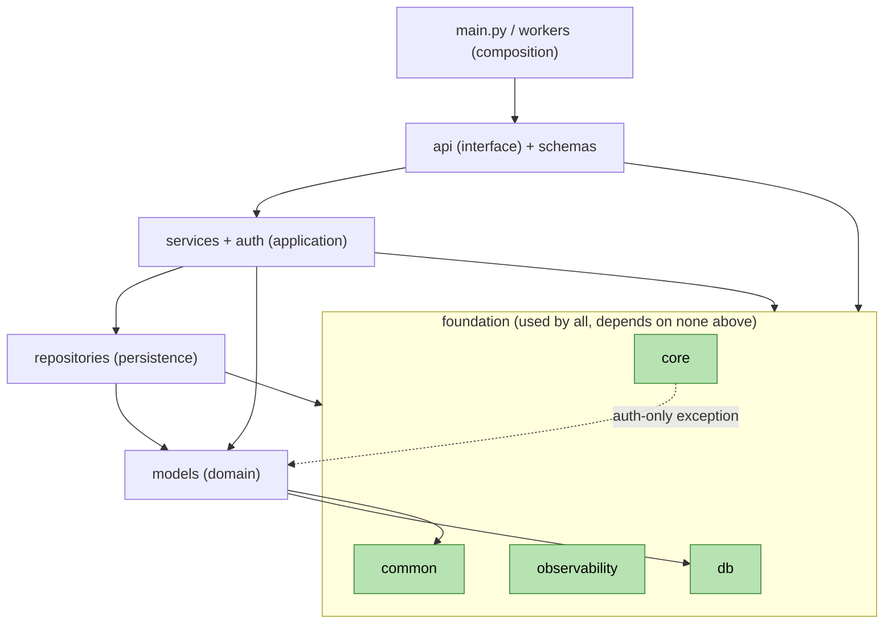

# Phase 5A — Backend Architecture (Mesaar)

Status: **Draft for approval.** Formalizes the backend package structure, boundaries, and
ownership for the existing `app/` package — including the Phase 5 foundation modules —
without renaming packages, refactoring imports, or touching Alembic. Architecture
documentation only (no code, SQL, or ORM).

| Reference | What this phase builds on |
|---|---|
| [`02-architecture.md`](02-architecture.md) | Clean Architecture layering of `app/`, bounded contexts, CQRS-lite |
| [`03-database-architecture.md`](03-database-architecture.md) | Aggregates, event store/outbox, projections, tenancy, AI substrate |
| [`04-event-storming-and-state-machines.md`](04-event-storming-and-state-machines.md) | 13 bounded contexts, aggregates, events, state machines, business rules |
| ADR-001…006 ([`adr/`](adr/)) | Tenancy, time-series, jobs, event model, versioning, read-models |

**Hard constraints honored (per the Phase 5A brief):**
- Keep the existing `app/` structure — **no package renames**.
- **No Alembic breakage** — `migrations/env.py` keeps importing `app.db.base:Base.metadata` + `app.models`; `alembic.ini` keeps `prepend_sys_path = .`.
- **No import refactor** of existing modules; new packages are additive.
- Every entity/repository/service/router below is marked **EXISTS** (on disk today) or **PLANNED** (target, per the approved contexts).

---

## 1. Folder Structure

The annotated tree below is the **as-built** `app/` package (Phase 5 foundation included),
with **PLANNED** additions overlaid where the approved contexts require new modules. Planned
nodes are marked `(P)`; everything else exists on disk.

```
Logistics_Management_System/
├─ app/                              # Backend Python package (the deployable)
│  ├─ main.py                        # Composition root: create_app() factory, app = create_app()
│  │
│  ├─ api/                           # ── INTERFACE layer (HTTP) ──
│  │  ├─ deps.py                     #   Shared FastAPI dependencies (auth, db, redis, tenant, paging)
│  │  ├─ health.py                   #   Liveness/readiness/health routers (unversioned)
│  │  ├─ v1/router.py                #   build_v1_router(): mounts business routers under /v1 (ADR-005)
│  │  ├─ middleware/request_context.py  # Request-id, tenant resolution, request logging/timing
│  │  └─ routes/                     #   Thin HTTP handlers (one module per context surface)
│  │     ├─ auth.py  users.py  drivers.py  driver_self.py
│  │     ├─ vehicles.py  warehouses.py  shipments.py
│  │     ├─ customers.py (P)  orders.py (P)  routes.py (P)  tracking.py (P)
│  │     └─ billing.py (P)  analytics.py (P)
│  │
│  ├─ schemas/                       # ── INTERFACE DTOs (Pydantic v2 request/response contracts) ──
│  │  ├─ common.py  enums.py  auth.py  user.py  driver.py  driver_self.py
│  │  ├─ vehicle.py  warehouse.py  shipment.py  shipment_actions.py  tracking_event.py
│  │  └─ customer.py (P)  order.py (P)  route.py (P)  billing.py (P)
│  │
│  ├─ services/                      # ── APPLICATION layer (use-cases, business rules, transitions) ──
│  │  ├─ exceptions.py               #   Domain error hierarchy (DomainError, NotFoundError, …)
│  │  ├─ auth_service.py  shipment_service.py  driver_service.py
│  │  └─ customer_service.py (P)  order_service.py (P)  fleet_service.py (P)
│  │     warehouse_service.py (P)  route_service.py (P)  billing_service.py (P)
│  │
│  ├─ models/                        # ── DOMAIN layer (SQLAlchemy aggregates + enums) ──
│  │  ├─ enums.py                    #   UserRole, VehicleStatus, ShipmentStatus, TrackingEventType
│  │  ├─ user.py  driver.py  vehicle.py  warehouse.py  shipment.py  shipment_tracking_event.py
│  │  └─ tenant.py (P)  role.py (P)  permission.py (P)  customer.py (P)
│  │     order.py (P)  route.py (P)  event_store.py (P)  projections.py (P)
│  │
│  ├─ repositories/                  # ── INFRASTRUCTURE: persistence boundary ──
│  │  ├─ errors.py
│  │  ├─ user_repository.py  driver_repository.py  vehicle_repository.py
│  │  ├─ warehouse_repository.py  shipment_repository.py  tracking_event_repository.py
│  │  └─ customer_repository.py (P)  order_repository.py (P)  route_repository.py (P)
│  │     event_store_repository.py (P)
│  │
│  ├─ db/                            # ── FOUNDATION: persistence engine + ORM primitives ──
│  │  ├─ base.py                     #   Base (DeclarativeBase) + NAMING_CONVENTION  [Alembic-critical]
│  │  ├─ base_model.py               #   BaseModel(Base) abstract, UUIDv7 PK (for FUTURE models)
│  │  ├─ mixins.py                   #   TimestampMixin (existing) + SoftDelete/Audit/Tenant mixins
│  │  ├─ session.py                  #   engine, SessionLocal, get_session, session_scope
│  │  ├─ uuidv7.py                   #   uuid7() time-ordered id generator
│  │  └─ tenant.py                   #   Tenant ContextVar + PLATFORM_TENANT_ID + apply_tenant_guc (RLS)
│  │
│  ├─ auth/                          # ── FOUNDATION/APPLICATION: security primitives ──
│  │  ├─ tokens.py                   #   Access/refresh JWT pair, rotation, Redis revocation
│  │  ├─ permissions.py              #   Permission enum + ROLE_PERMISSIONS (RBAC infra, no business rows)
│  │  └─ rbac.py                     #   require_permissions(...) dependency
│  │
│  ├─ core/                          # ── FOUNDATION: cross-cutting config & security ──
│  │  ├─ config.py                   #   Settings (env-driven) + cached get_settings()
│  │  ├─ constants.py                #   App-wide constants (headers, page sizes, platform tenant)
│  │  ├─ security.py                 #   Password hashing, JWT encode/decode, get_current_user, require_roles
│  │  ├─ exceptions.py               #   API error hierarchy + ErrorResponse + install_exception_handlers
│  │  └─ redis.py                    #   get_redis() singleton + redis_ping()
│  │
│  ├─ observability/                 # ── FOUNDATION: logging, metrics, health ──
│  │  ├─ logging.py                  #   Loguru config, stdlib intercept, get_logger, request-id ctx
│  │  ├─ metrics.py                  #   Prometheus middleware + /metrics ASGI app
│  │  └─ health.py                   #   check_database / check_redis / readiness aggregation
│  │
│  ├─ common/                        # ── FOUNDATION/SHARED: pure utilities (no app deps) ──
│  │  ├─ datetime.py                 #   utcnow(), to_epoch_ms()
│  │  ├─ pagination.py               #   PageParams, Page[T]
│  │  └─ responses.py                #   Uniform response envelopes (Message)
│  │
│  ├─ workers/                       # ── INFRASTRUCTURE: async execution (Celery) ──
│  │  ├─ celery_app.py               #   Configured Celery app (broker/result = Redis)
│  │  └─ tasks.py                    #   Diagnostic ping task; future projection/SLA/notify tasks (P)
│  │
│  ├─ events/        (P)             # PLANNED: domain event types + outbox publish (ADR-004)
│  ├─ projections/   (P)             # PLANNED: read-model builders proj_* (ADR-006)
│  └─ integrations/  (P)             # PLANNED: ACLs to Notifications/Billing-ERP/SMS-OTP
│
├─ migrations/        env.py, versions/*       # Alembic (bound to app.db.base + app.models)
├─ api/               openapi.yaml             # Curated contract (ADR-005), diffed vs runtime
├─ Dockerfile  docker-compose.yml  .dockerignore  .env.example  Makefile
├─ requirements.txt  alembic.ini  .github/workflows/ci.yml
└─ docs/              02..05 + adr/ + diagrams/
```

---

## 2. Module Boundaries

Each top-level `app/` package is a **boundary**: a unit with a defined responsibility and a
controlled surface. A boundary is crossed only through its public symbols.

| Package | Layer | Public surface (what others may use) | Must NOT contain |
|---|---|---|---|
| `app/api` | Interface | Routers, `deps.py` providers, middleware, `create_app` wiring | Business rules, persistence, SQL |
| `app/schemas` | Interface DTO | Pydantic request/response models | ORM models, business logic, DB access |
| `app/services` | Application | Service classes (use-cases), domain exceptions | HTTP/FastAPI types, router imports, response serialization |
| `app/models` | Domain | ORM aggregates, enums, relationships, invariants-as-constraints | Service/repository/API imports, network/IO |
| `app/repositories` | Infra (persistence) | Repository classes (CRUD + queries) | Business decisions, transaction orchestration spanning aggregates, HTTP |
| `app/db` | Foundation | `Base`, mixins, `engine`, `SessionLocal`, `get_session`, `uuid7`, tenant ctx | Domain/business logic, API imports |
| `app/auth` | Foundation/App | Token pair/rotation, `Permission`, `ROLE_PERMISSIONS`, `require_permissions` | Business policy rows, router imports |
| `app/core` | Foundation | `Settings`/`get_settings`, security helpers, `get_redis`, exception handlers | Domain/business logic (see noted exception for auth) |
| `app/observability` | Foundation | `get_logger`, `configure_logging`, metrics/health helpers | Domain/business logic, API route logic |
| `app/common` | Shared | Pure helpers (`utcnow`, pagination, envelopes) | Any `app.*` import (leaf package) |
| `app/workers` | Infra (async) | `celery_app`, task callables | Inline business rules (delegate to services) |
| `app/main.py` | Composition root | `app` (ASGI) | Being imported by any non-test module |

**Boundary-crossing rule:** a caller depends on a package's **public callables/classes**, never
on its internal helpers. Services orchestrate; repositories persist; routes translate
HTTP↔service; models hold state + invariants; foundation is used by all but knows none.

---

## 3. Dependency Rules

### 3.1 Layer ranks (dependencies point toward lower ranks / foundation)

| Rank | Layer | Packages |
|---|---|---|
| 4 | Composition root | `app/main.py`, `app/workers/celery_app.py` |
| 3 | Interface | `app/api/*`, `app/schemas/*` |
| 2 | Application | `app/services/*`, `app/auth/*`, (P) `app/events`, `app/projections`, `app/integrations` |
| 1b | Infra-persistence | `app/repositories/*` |
| 1a | Domain | `app/models/*` |
| 0 | Foundation / shared | `app/core`, `app/db`, `app/observability`, `app/common` |

### 3.2 Allowed-dependency matrix (✔ may import → )

| from ↓ \ to → | common | core | db | observ. | models | repos | services/auth | schemas | api | main |
|---|---|---|---|---|---|---|---|---|---|---|
| **common** | – | | | | | | | | | |
| **core** | ✔ | – | (config only) | ✔(log) | ✔*auth | ✔*auth | | | | |
| **db** | ✔ | ✔ | – | ✔ | | | | | | |
| **observability** | ✔ | ✔ | ✔ | – | | | | | | |
| **models** | ✔ | | ✔(base/mixins) | | – | | | | | |
| **repositories** | ✔ | ✔ | ✔ | ✔ | ✔ | – | | | | |
| **services/auth** | ✔ | ✔ | ✔ | ✔ | ✔ | ✔ | – | | | |
| **schemas** | ✔ | | | | (enums only) | | | – | | |
| **api** | ✔ | ✔ | ✔ | ✔ | ✔ | ✔ | ✔ | ✔ | – | |
| **workers/main** | ✔ | ✔ | ✔ | ✔ | ✔ | ✔ | ✔ | ✔ | ✔ | – |

`*auth` = the one accepted exception (§3.4).

### 3.3 Forbidden dependencies (the rules)

1. **Domain isolation:** `app/models` imports only `app/db` (Base/mixins), `app/models/enums`, and `app/common`. It must never import `services`, `repositories`, `api`, `schemas`, `auth`, or `workers`.
2. **Application is HTTP-agnostic:** `app/services` (and `app/auth`) must not import `app/api`, `app/main`, FastAPI request/response types, or `app/workers`. Async work is enqueued via a thin dispatch port, not by importing worker internals.
3. **Persistence is rule-free:** `app/repositories` must not import `app/services` or `app/api`. It returns aggregates/rows; it does not decide transitions or orchestrate multi-aggregate transactions.
4. **DTOs stay thin:** `app/schemas` must not import `app/models`, `app/services`, or `app/repositories`.
5. **No upward imports:** nothing imports `app/main` (composition root) except tests. Foundation packages (`common`, `core`, `db`, `observability`) must not import Interface/Application/Domain — with the single documented exception below.
6. **No import cycles:** `observability/logging` imports only stdlib + loguru + (typing-only) `core.config`; `core` and `db` import `observability` for logging but `observability` does not import `db`/`core` at runtime beyond config.

### 3.4 Accepted, documented exception

`app/core/security.py` provides `get_current_user` / `require_roles`, which resolve the
authenticated `User` from the database — so it imports `app.models.user`,
`app.repositories.user_repository`, and `app.db.session`. This is a pragmatic foundation→domain
coupling that **already exists** and is preserved (no import refactor). It is bounded to the
auth concern and may later move to `app/auth` or `app/api/deps` **without** changing call sites.
RBAC additions (`app/auth/rbac.require_permissions`) follow the same pattern intentionally.

### 3.5 Dependency graph



### 3.6 Keeping Alembic safe (non-negotiable)

- `migrations/env.py` imports `app.db.base:Base.metadata` and `app.models` to register tables;
  autogenerate targets `Base.metadata`. **Models must remain importable with zero side effects**
  (no DB connection, no `get_redis`, no `configure_logging` at import time).
- Do not rename or move `app`, `app.db`, `app.db.base`, or `app.models`. New models inherit the
  same `Base` (directly, as today, or via `BaseModel`) so they appear in the same metadata.
- The deterministic `NAMING_CONVENTION` in `app/db/base.py` is frozen (stable constraint names
  across environments). New constraints rely on it; never hand-rename generated constraints.

---

## 4. Aggregate Ownership

One aggregate has exactly **one owning context** and **one owning module**. Cross-aggregate
references are by id; cross-context changes happen via domain events (ADR-004), never by
reaching into another context's tables.

| Aggregate (root) | Owning context | Module | Status |
|---|---|---|---|
| `User` | Identity & Access | `app/models/user.py` | EXISTS |
| `Tenant` | Identity & Access | `app/models/tenant.py` | PLANNED (ADR-001) |
| `Role`, `Permission` | Identity & Access | `app/models/role.py`, `permission.py` | PLANNED (today: `UserRole` enum + `app/auth`) |
| `Customer` | Customer Management | `app/models/customer.py` | PLANNED |
| `Order` (+ `OrderLine`) | Orders | `app/models/order.py` | PLANNED (today `Shipment` doubles as order) |
| `Shipment` (+ assignment) | Shipments | `app/models/shipment.py` | EXISTS |
| `Vehicle` | Fleet Management | `app/models/vehicle.py` | EXISTS |
| `Driver` | Driver Management | `app/models/driver.py` | EXISTS |
| `Route` (+ `RouteStop`) | Route Management | `app/models/route.py` | PLANNED |
| `Warehouse` | Warehouse Management | `app/models/warehouse.py` | EXISTS |
| `ShipmentTrackingEvent` | Tracking | `app/models/shipment_tracking_event.py` | EXISTS (append-only) |
| `EventStore` record | (cross-cutting infra) | `app/models/event_store.py` | PLANNED (ADR-004; outbox) |
| `proj_*` read models | Analytics | `app/models/projections.py` / `app/projections` | PLANNED (ADR-006) |
| `Invoice`/`Settlement`/`Quote`/`Payout` | Billing | `app/models/billing.py` | PLANNED |
| `Notification` | Notifications | `app/models/notification.py` | PLANNED (often integration-only) |
| `Prediction`/`Embedding`/`Feature` | AI Operations | `app/models/ai_*.py` | PLANNED (ADR / docs/03 §9) |

**Invariant ownership:** an aggregate enforces its own invariants (e.g., `Shipment` owns the
8-state transition map + assignment exclusivity). Invariants spanning aggregates (warehouse
capacity over many shipments) are enforced in the owning **service**, not in a model.

---

## 5. Repository Ownership

Repositories are the persistence boundary for exactly one aggregate. They expose intention-
revealing queries; they never embed business decisions.

| Repository | Aggregate | Module | Status |
|---|---|---|---|
| `UserRepository` | User | `app/repositories/user_repository.py` | EXISTS |
| `DriverRepository` | Driver | `app/repositories/driver_repository.py` | EXISTS |
| `VehicleRepository` | Vehicle | `app/repositories/vehicle_repository.py` | EXISTS |
| `WarehouseRepository` | Warehouse | `app/repositories/warehouse_repository.py` | EXISTS |
| `ShipmentRepository` | Shipment | `app/repositories/shipment_repository.py` | EXISTS |
| `TrackingEventRepository` | ShipmentTrackingEvent | `app/repositories/tracking_event_repository.py` | EXISTS |
| (shared errors) | — | `app/repositories/errors.py` | EXISTS |
| `CustomerRepository` | Customer | `app/repositories/customer_repository.py` | PLANNED |
| `OrderRepository` | Order | `app/repositories/order_repository.py` | PLANNED |
| `RouteRepository` | Route | `app/repositories/route_repository.py` | PLANNED |
| `EventStoreRepository` | EventStore (append/outbox) | `app/repositories/event_store_repository.py` | PLANNED |
| `TenantRepository` | Tenant | `app/repositories/tenant_repository.py` | PLANNED |

**Rules:** one repository per aggregate root; repositories take a `Session` (DI); they do not
commit cross-aggregate transactions (the owning service controls the unit of work); tenant
scoping is applied via the session GUC / `TenantMixin` filter, not ad-hoc per query.

---

## 6. Service Ownership

Services are the application layer: they orchestrate aggregates + repositories, enforce
cross-aggregate invariants and state transitions, and (target) emit domain events.

| Service | Owning context(s) | Module | Responsibilities | Status |
|---|---|---|---|---|
| `AuthService` | Identity & Access | `app/services/auth_service.py` | Credential auth, access-token issuance | EXISTS |
| `ShipmentService` | Shipments (+ Warehouse capacity, Fleet/Driver eligibility) | `app/services/shipment_service.py` | Create, assign (exclusivity/capacity guards), transitions, tracking events | EXISTS |
| `DriverService` | Driver Management | `app/services/driver_service.py` | Phone login, availability, offers, accept/decline, daily stats | EXISTS |
| (domain errors) | — | `app/services/exceptions.py` | `DomainError` hierarchy mapped to HTTP in `core/exceptions` | EXISTS |
| `CustomerService` | Customer Management | `app/services/customer_service.py` | Customer/credit lifecycle | PLANNED |
| `OrderService` | Orders | `app/services/order_service.py` | Order intake/approval, fan-out to shipments (saga) | PLANNED |
| `FleetService` | Fleet Management | `app/services/fleet_service.py` | Vehicle lifecycle/maintenance (today inline in ShipmentService guards) | PLANNED |
| `WarehouseService` | Warehouse Management | `app/services/warehouse_service.py` | Capacity, receiving/dispatch (today inline in ShipmentService) | PLANNED |
| `RouteService` | Route Management | `app/services/route_service.py` | Route planning/optimization/stops | PLANNED |
| `BillingService` | Billing | `app/services/billing_service.py` | Quote/pricing, settlement, payout | PLANNED |

**Boundaries:** a service owns the **unit of work** (one transaction per command, which —
target — also appends the domain event to the outbox, ADR-004). Capacity/eligibility logic
currently centralized in `ShipmentService` is the seam from which `FleetService` /
`WarehouseService` will be extracted **without** moving the existing guards prematurely.

---

## 7. API Ownership

Routers are thin: authenticate/authorize (RBAC), validate via `schemas`, call one service,
map domain errors (handled centrally). All business routers mount under `/v1` (ADR-005) via
`app/api/v1/router.py`; health/metrics are unversioned.

| Router | Context | Path prefix | Module | Status |
|---|---|---|---|---|
| `auth` | Identity & Access | `/v1/auth` | `app/api/routes/auth.py` | EXISTS |
| `users` | Identity & Access | `/v1/users` | `app/api/routes/users.py` | EXISTS |
| `drivers` | Driver Management | `/v1/drivers` | `app/api/routes/drivers.py` | EXISTS |
| `driver_self` | Driver Management | `/v1/drivers/me`, `/v1/shipments/nearby`, `/v1/shipments/{id}/accept` | `app/api/routes/driver_self.py` | EXISTS (mounted FIRST — specific before generic) |
| `vehicles` | Fleet Management | `/v1/vehicles` | `app/api/routes/vehicles.py` | EXISTS |
| `warehouses` | Warehouse Management | `/v1/warehouses` | `app/api/routes/warehouses.py` | EXISTS |
| `shipments` | Shipments (+ Tracking) | `/v1/shipments` | `app/api/routes/shipments.py` | EXISTS |
| `health` | Ops/meta | `/health`, `/health/live`, `/health/ready` | `app/api/health.py` | EXISTS (unversioned) |
| `metrics` | Ops/meta | `/metrics` | `app/observability/metrics.py` | EXISTS (unversioned) |
| `customers` | Customer Management | `/v1/customers` | `app/api/routes/customers.py` | PLANNED |
| `orders` | Orders | `/v1/orders` | `app/api/routes/orders.py` | PLANNED |
| `routes` | Route Management | `/v1/routes` | `app/api/routes/routes.py` | PLANNED |
| `tracking` | Tracking | `/v1/shipments/{id}/events` | `app/api/routes/tracking.py` | PLANNED (today via shipments router) |
| `billing` | Billing | `/v1/billing` | `app/api/routes/billing.py` | PLANNED |
| `analytics` | Analytics | `/v1/analytics` | `app/api/routes/analytics.py` | PLANNED |

**Router-ordering rule (preserved):** `driver_self` is included before `drivers`/`shipments`
so specific paths win over generic `{id}` routes — keep this order in `build_v1_router()`.

---

## 8. Package Responsibilities

| Package | One-line responsibility | Owns | Depends on |
|---|---|---|---|
| `app/main.py` | Build + wire the ASGI app (logging, middleware, handlers, routers, lifespan) | Composition root | everything (one-way) |
| `app/api/routes` | Translate HTTP ↔ service calls; RBAC; no business logic | Endpoint handlers | services, schemas, deps, core, models(typing) |
| `app/api/deps.py` | Provide request-scoped dependencies (current user/driver, session, redis, tenant, paging) | DI providers | core/security, db/session, core/redis, db/tenant, common |
| `app/api/v1/router.py` | Aggregate business routers under `/v1` in the correct order | Versioned mount | api/routes |
| `app/api/health.py` | Liveness/readiness/health endpoints | Probes | observability/health |
| `app/api/middleware/request_context.py` | Request-id, tenant resolution, request logging/timing | Per-request context | observability, db/tenant, core/config |
| `app/schemas` | Pydantic request/response contracts (the wire shape) | DTOs/validation | enums, common |
| `app/services` | Use-cases, invariants, transitions, unit-of-work, (target) event emission | Application logic | models, repositories, auth, core, common, db |
| `app/models` | Aggregates, enums, relationships, table-level invariants | Domain state | db(base/mixins), enums, common |
| `app/repositories` | Persistence + queries per aggregate | Data access | models, db, core(errors/log), common |
| `app/db` | ORM `Base`, mixins, engine/session, UUIDv7, tenant context/GUC | Persistence foundation | core(config), observability, common |
| `app/auth` | JWT access/refresh + rotation/revocation, RBAC permissions/dependency | Security application | core(redis/security/exceptions), common, observability, models(UserRole) |
| `app/core` | Settings, constants, password/JWT primitives, exception handlers, redis client | Cross-cutting foundation | common, observability; (auth exception → models/repos) |
| `app/observability` | Structured logging, Prometheus metrics, health checks | Telemetry | core(config), db/session, core/redis, common |
| `app/common` | Pure shared helpers (time, pagination, envelopes) | Leaf utilities | stdlib only |
| `app/workers` | Celery app + tasks (diagnostic now; SLA/projection/notify later) | Async execution | core(config), observability; (tasks → services later) |
| `app/events` (P) | Domain event types + outbox publishing | Eventing | models, db, common |
| `app/projections` (P) | Read-model builders for `proj_*` (ADR-006) | Read side | event store, db, repositories |
| `app/integrations` (P) | Anti-corruption layers to Notifications/Billing-ERP/SMS-OTP | External boundaries | core, common, integration clients |

---

## Appendix — Mapping to Clean Architecture & program conventions

- **Dependency Rule:** source dependencies point inward toward Domain + downward toward
  Foundation; Interface and Application never leak into Domain. The single auth exception
  (§3.4) is explicit and bounded.
- **DDD:** one aggregate ↔ one model ↔ one repository ↔ one owning service ↔ one router surface
  per context; cross-context coupling only by id + domain events.
- **CQRS-lite (ADR-004/006):** write path = `api → service → repository/model (+ outbox event)`;
  read path (target) = `api → projection read model`. Projections live in `app/projections`.
- **Tenancy (ADR-001):** `TenantMixin` + `app/db/tenant` context/GUC; enforced by RLS, scoped at
  the session, resolved by `request_context` middleware.
- **Constraints honored:** no package renamed, no import refactor, Alembic untouched
  (`app.db.base:Base.metadata` + `app.models` remain the migration targets).

*Companion artifacts:* [`02-architecture.md`](02-architecture.md) ·
[`03-database-architecture.md`](03-database-architecture.md) ·
[`04-event-storming-and-state-machines.md`](04-event-storming-and-state-machines.md) ·
ADR-001…006 ([`adr/`](adr/)).
