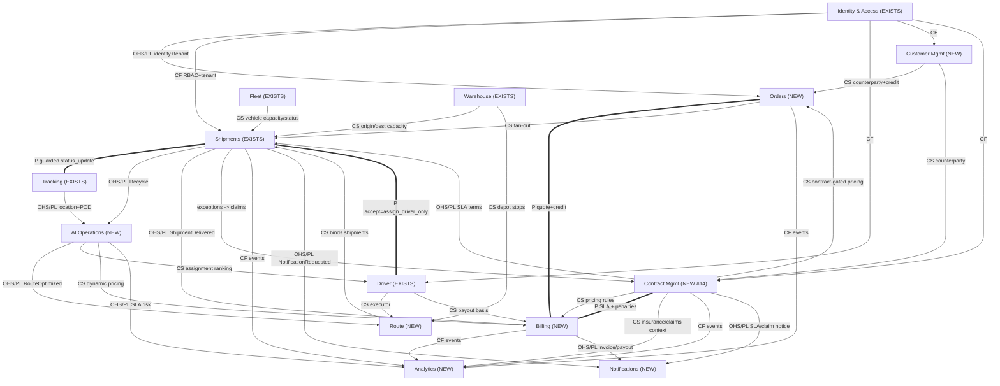

# Phase 4.5 — Architecture Audit, Validation & Phase 5 Readiness (Mesaar)

Status: **Audit / validation deliverable.** This document does **not** redesign any approved
artifact, generate code, APIs, or migrations. It reviews Phases 1–5A, validates internal
consistency, ratifies ADR-007 (already on disk), adds the **Contract Management** bounded
context, benchmarks the platform against the enterprise field, and gates Phase 5.

Authoritative inputs reviewed: `docs/02-architecture.md`, `docs/03-database-architecture.md`,
`docs/04-event-storming-and-state-machines.md`, `docs/05-backend-architecture.md`,
`docs/event-catalog.md`, `docs/domain-glossary.md`, `docs/api-gap-analysis.md`,
`docs/wcag-2.2-aa-checklist.md`, ADR-001…007, `docs/diagrams/*.mmd`, `design-system/*`,
`ui/screen-map.md`, and the as-built `app/`, `migrations/`, `api/`, `mobile/` trees.

> **Method note (locked-phase discipline).** Per the program rule, approved/Accepted phases
> are *reconciled, not redesigned*. Where a conflict exists it is **flagged**, not silently
> rewritten. ADR-007 already exists and is Accepted; this audit **validates** it rather than
> re-authoring it.

## Contents
- [Phase A — Architecture Compliance Report](#phase-a--architecture-compliance-report)
- [Phase B — Consistency Audit](#phase-b--consistency-audit)
- [Phase C — ADR Review & ADR-007 Validation](#phase-c--adr-review--adr-007-validation)
- [Phase D — Event Coverage Matrix](#phase-d--event-coverage-matrix)
- [Phase E — Bounded Context Review + Contract Management + Updated Context Map](#phase-e--bounded-context-review--contract-management--updated-context-map)
- [Phase F — Enterprise Logistics Gap Analysis](#phase-f--enterprise-logistics-gap-analysis)
- [Phase G — Backend Readiness Report](#phase-g--backend-readiness-report)

---

## Phase A — Architecture Compliance Report

Enterprise Readiness Score (ERS) is 0–5: 5 = production-grade & verified; 4 = sound design,
build pending; 3 = adequate with gaps; 2 = material gaps; 1 = stub/placeholder.

### A.1 Per-artifact review

#### 1. Product Blueprint — *partial (implicit)*
- **Status:** Present but distributed (README + `ui/screen-map.md` + driver app). No single
  consolidated product/PRD document.
- **Findings:** Vision and the delivered driver slice are clear; consoles (Admin/Ops/Dispatch/
  Customer) are mapped in `ui/screen-map.md`.
- **Risks:** No explicit success metrics, personas matrix, or non-functional SLOs in one place.
- **Contradictions:** None.
- **Missing:** Consolidated PRD, KPI/OKR tree, pricing/commercial model, **heavy-equipment
  product positioning** (see Phase F).
- **ERS: 3.0**

#### 2. Information Architecture — *good*
- **Status:** Present (`ui/screen-map.md`, navigation in mobile app, `design-system/components-index.md`).
- **Findings:** Console-to-context mapping is coherent; RTL/Arabic IA is first-class.
- **Risks:** IA covers operational consoles; no IA yet for Contracts/Billing/Claims surfaces.
- **Missing:** IA for the new commercial contexts (Orders, Billing, Contracts).
- **ERS: 3.5**

#### 3. UX Architecture — *good*
- **Status:** Present (`design-system/design-spec.md`, `tokens.json`, WCAG 2.2 AA checklist).
- **Findings:** Token-driven, WCAG-2.2-AA-gated, RTL-aware — above market norm for this stage.
- **Risks:** A11y items still `⚙️ build task`/`🔎 manual-audit`; gate is designed not yet enforced.
- **Missing:** Control-tower / map-heavy UX patterns not yet specified.
- **ERS: 4.0**

#### 4. Wireframes — *partial*
- **Status:** Driver app is **delivered** (high-fidelity, real components). Console wireframes
  exist as a screen map, not as per-screen wireframes.
- **Risks:** Console build may outrun design; dispatch board / control tower unspecified.
- **Missing:** Per-screen console wireframes (dispatch board, exception center, contract desk).
- **ERS: 3.0**

#### 5. Database Architecture — *excellent (design)*
- **Status:** `docs/03` is comprehensive: keys, constraints, indexing, partitioning, audit,
  event store, multi-tenancy, AI substrate.
- **Findings:** Senior-grade — partial-unique exclusivity indexes, tenant-leading composites,
  BRIN/GIN/HNSW strategy, outbox, point-in-time AI correctness.
- **Risks:** **Design only** — the live schema (`migrations/`) is still single-tenant baseline
  (6 tables, no `tenant_id`, no `event_store`, no RLS). Large design-to-reality delta.
- **Missing:** Heavy-equipment/cargo dimensional model; partition automation; DDL.
- **ERS: 4.5 (design) / 2.0 (as-built)**

#### 6. ERD — *good, dual-layer*
- **Status:** As-built ERD (`diagrams/erd.mmd`, 6 tables) + target ERD (`docs/03` §1).
- **Findings:** As-built matches `app/models` exactly; target ERD adds tenancy/event/AI tables.
- **Risks:** Two ERDs can drift; the target ERD omits Order/Customer/Route/Billing/Contract
  entities that Phase 4 introduces (kept conceptual).
- **Missing:** ERD coverage for commercial + contract aggregates.
- **ERS: 4.0**

#### 7. ADR-001 … ADR-006 — *strong*
- **Status:** All Accepted/Confirmed 2026-06-20. Tenancy, time-series, jobs, event model,
  versioning, read-models.
- **Findings:** Coherent set; each states context/decision/consequences/alternatives + revisit
  triggers. ADR-002/003 explicitly scoped to "SMB/regional" envelope.
- **Risks:** The SMB scale envelope (ADR-002 5k ev/s trigger; ADR-003 Celery/Redis) is **below**
  the "exceed Uber Freight" ambition — revisit triggers must be tracked, not forgotten.
- **Missing:** No ADR for AuthN/identity (OTP/Nafath), secrets/KMS, API gateway/rate-limiting,
  observability/SLOs, or data residency — all needed for enterprise.
- **ERS: 4.5**

#### 8. Multi-Tenant Strategy — *excellent design, not yet built*
- **Status:** `docs/03` §8 + ADR-001 + `app/db/tenant.py` (ContextVar, `PLATFORM_TENANT_ID`,
  `apply_tenant_guc`) + `TenantMixin` scaffolding present.
- **Findings:** Shared-schema + RLS + `SET LOCAL` GUC + nil-UUID platform tenant + hybrid
  "dedicated" escape hatch is the right model; defense-in-depth articulated.
- **Risks (HIGH):** **No table carries `tenant_id` yet, no RLS policy exists in any migration,
  no isolation test exists.** The most dangerous correctness rule (per-request `SET LOCAL` on
  pooled connections) is unverified.
- **Missing:** The tenancy migration (`docs/03` §8.4 steps 1–6), RLS policies, isolation tests.
- **ERS: 4.5 (design) / 1.5 (as-built)**

#### 9. Audit Strategy — *excellent design*
- **Status:** `docs/03` §6 three-layer model (column lineage, trigger row-history, domain/event
  audit) + immutability grants + optional hash-chain + `pgaudit`.
- **Risks:** None on disk yet — `audit_log`, triggers, immutability grants unbuilt.
- **Missing:** `audit` schema, trigger function, grant scripts.
- **ERS: 4.5 (design) / 1.0 (as-built)**

#### 10. AI Readiness Strategy — *excellent*
- **Status:** `docs/03` §9 + `docs/04` Part 8: pgvector/HNSW, point-in-time features,
  `ml_predictions` with `actual_outcome` feedback loop, RAG corpus, governance (tenant-scoped,
  PII discipline, reproducibility).
- **Findings:** Among the strongest artifacts; event log is explicitly a training stream.
- **Risks:** Substrate is all PLANNED; needs model registry/feature-store ADR before serving.
- **Missing:** AI serving runtime decision; drift/monitoring ops; MLOps ADR.
- **ERS: 4.5 (design)**

#### 11. Event Store Design — *excellent, now ratified*
- **Status:** `docs/03` §7 + `docs/04` Part 6 + ADR-007. Unified `event_store`, canonical
  envelope, `UNIQUE(aggregate_id, aggregate_version)`, monthly partitions, transactional outbox.
- **Risks:** Two-writes-per-command + relay worker + outbox-lag monitoring are real operational
  surface; none built yet.
- **Missing:** `event_store`/`processed_events` models+migrations, relay task, lag metric.
- **ERS: 4.5 (design) / 1.0 (as-built)**

#### 12. Event Storming Draft — *excellent*
- **Status:** `docs/04` Parts 1–2: 13 contexts, actors, commands, events, 18 policies (P1–P18),
  external systems, aggregates, process catalog, big-picture board.
- **Findings:** Thorough; reconciliations (PickedUp, Delayed overlay, decline=no-mutation) are
  explicit and disciplined.
- **Risks:** Big-picture board is a "representative slice" (acknowledged), not exhaustive.
- **Missing:** Contract/Claims/Insurance flows (added in Phase E).
- **ERS: 4.5**

#### 13. State Machines Draft — *strong, mixed authority*
- **Status:** Shipment (AUTHORITATIVE, from code) + Vehicle/Order/Driver/Route/RouteStop
  (PROPOSED). Diagrams transcribed from `_is_transition_allowed`.
- **Findings:** Shipment machine is code-faithful. Proposed machines are well-formed.
- **Risks:** Vehicle/Driver machines exist **only on paper** — code has no `VehicleStatus`
  transition guard and **no driver-status enum** (only `is_available` + `user.is_active`).
- **Contradiction:** Order cancellation rule conflicts between `docs/04` §2.8 and Part 4 (see
  Phase B, **C-1**).
- **ERS: 4.0 (design) / Shipment 5.0 (built)**

#### 14. Domain Events Draft — *strong but two sources of truth*
- **Status:** `docs/04` Part 3 (full, 13 contexts) + `docs/event-catalog.md` (older, shipment/
  fleet only).
- **Risks (drift):** `docs/event-catalog.md` predates Phase 4 and omits Order/Customer/Route/
  Billing/Analytics/AI events — **two catalogs, one stale** (see Phase B, **W-2**).
- **Missing:** Contract/Claims/Insurance events (Phase E); reconciliation of the two catalogs.
- **ERS: 4.0**

### A.2 Summary table

| Area | Status | Risk | Recommendation |
|---|---|---|---|
| Product Blueprint | Partial | Med | Write consolidated PRD incl. heavy-equipment positioning |
| Information Architecture | Good | Low | Extend IA to Orders/Billing/Contracts surfaces |
| UX Architecture | Good | Low | Enforce the WCAG gate in CI; spec control-tower UX |
| Wireframes | Partial | Med | Wireframe dispatch board / exception / contract desk |
| Database Architecture | Excellent design / weak as-built | **High** | Execute tenancy + event-store migrations (Phase 5 M1–M2) |
| ERD | Good | Low | Add commercial + contract entities to target ERD |
| ADR-001…006 | Strong | Low | Add ADRs for identity/KMS/gateway/SLO/residency |
| Multi-Tenant Strategy | Excellent design / not built | **High** | Build `tenant_id`+RLS+isolation test before any new context |
| Audit Strategy | Excellent design / not built | Med | Build audit schema + immutability grants with event store |
| AI Readiness | Excellent design | Low | Add MLOps/serving ADR before model serving |
| Event Store Design | Excellent / ratified | **High (build)** | Implement outbox + relay + lag metric (M2) |
| Event Storming | Excellent | Low | Extend with Contract/Claims flows |
| State Machines | Strong / mixed authority | Med | Implement Vehicle+Driver enums & guards; resolve C-1 |
| Domain Events | Strong / drift | Med | Supersede `event-catalog.md` with `docs/04` Part 3 |

**Phase A verdict:** The **design corpus is enterprise-grade (avg design ERS ≈ 4.4)**; the
**as-built reality is early (avg built ERS ≈ 2.0)**. The dominant risk is the *design-to-build
delta*, concentrated in tenancy, event store, and audit. No blocking contradictions in the
design itself except **C-1** (Order cancel) and the catalog drift **W-2**.

---

## Phase B — Consistency Audit

Validated against the locked decisions: **DDD, Clean Architecture, CQRS-lite, EDA, PostgreSQL,
Multi-Tenant RLS, Event Store, Projection Read Models, AI Readiness.**

### B.1 Structural / decision consistency

| # | Check | Result | Notes |
|---|---|---|---|
| 1 | DDD: 1 aggregate ↔ 1 model ↔ 1 repo ↔ 1 service ↔ 1 router | **PASS** | `docs/05` §4–7 enforces it; cross-context by id + events |
| 2 | Clean Architecture dependency rule (inward/downward) | **PASS** | `docs/05` §3 matrix; single documented auth exception (§3.4) |
| 3 | CQRS-lite (aggregate = truth, projections derived) | **PASS** | ADR-004/006 + `docs/03` §7 aligned |
| 4 | EDA via outbox (no direct broker dual-write) | **PASS** | ADR-007 §3 + `docs/03` §7.1 consistent |
| 5 | PostgreSQL-only at current envelope | **PASS** | ADR-002; OLAP deferred — consistent |
| 6 | Multi-tenant RLS on every aggregate | **PASS (design)** / **WARNING (built)** | Design complete; zero tables carry `tenant_id` yet → **W-1** |
| 7 | Unified event store (not per-aggregate) | **PASS** | ADR-007 §2 + `docs/03` §7 |
| 8 | Projection read models rebuildable from log | **PASS** | ADR-006 + `docs/03` §7.4 |
| 9 | AI readiness (point-in-time, tenant-scoped) | **PASS** | `docs/03` §9 + `docs/04` Part 8 |
| 10 | Alembic safety (no rename, `Base.metadata` target) | **PASS** | `docs/05` §3.6 + `migrations/env.py` honored |

### B.2 Concept / terminology / ownership conflicts

| # | Issue | Severity | Detail & recommendation |
|---|---|---|---|
| **C-1** | ~~Order cancellation rule contradicts itself~~ **RESOLVED (Phase 6.5)** | **RESOLVED** | `fulfilling → cancelled` is now **ALLOWED** with a **compensation workflow** + **cancellation fee** (`OrderCancellationFeeApplied`) + **audit event** + **`NotificationRequestedIntegrationEvent`**, and `OrderFulfilmentFailed` was added. `docs/04` §2.8 prose, §4.2.1/§4.2.2/§4.2.5 tables, and the §4.2.6 diagram were corrected to one consistent rule. See `docs/09a-reconciliation-and-closure.md`. |
| **W-1** | Tenancy designed everywhere, present nowhere | **WARNING** | Models/migrations are single-tenant; RLS is unbuilt. Not a design conflict — a build-state gap. Blocks multi-tenant claims until M1 done. |
| **W-2** | Two domain-event catalogs (one stale) | **WARNING** | `docs/event-catalog.md` (shipment/fleet only) vs `docs/04` Part 3 (13 contexts). Designate `docs/04` Part 3 + `docs/06` Phase D as **canonical**; mark `event-catalog.md` superseded. |
| **W-3** | Vehicle/Driver state machines paper-only | **WARNING** | No `VehicleStatus` transition guard; no driver-status enum (`is_available` + `user.is_active` only). Either build the enums/guards or relabel the machines "derived overlay" consistently. |
| **W-4** | `Assignment` modeled as aggregate vs attribute | **WARNING** | `docs/04` §2.7 lists `Assignment` as an aggregate; `docs/05` §4 treats it as part of `Shipment` ("+ assignment"). Today it is shipment columns (`driver_id`, `vehicle_id`, `assigned_at`). **Recommended:** keep as a value/part of `Shipment` until a standalone assignment lifecycle is needed. |
| **W-5** | Doc-vs-doc "added in Phase 4" vs already-built foundation | **WARNING** | `docs/02` §2 and `docs/03` §10 describe `events/`, `workers/`, `deps.py`, tenancy GUC as future; `docs/05` + disk show the **foundation** already scaffolded. Reconcile narrative (foundation exists; domain expansion pending). |
| **W-6** | Dual `Assigned` events (`ShipmentAssigned` + `DriverAssigned` + `VehicleAssigned`) | **WARNING** | Same business act emits three events across contexts. Acceptable in EDA but define the **owner of record** (`ShipmentAssigned` is authoritative; `DriverAssigned`/`VehicleAssigned` are downstream reactions via P4/P5) to avoid double-counting in Analytics. |
| **P-1** | Cross-context capacity ownership | **PASS (noted)** | Warehouse/vehicle capacity invariants live in `ShipmentService` today; `docs/05` §6 plans extraction to Fleet/Warehouse services. Consistent, intentional seam. |
| **P-2** | Circular dependencies | **PASS** | None found. Context map edges are DAG-like except declared Partnerships (Shipments↔Tracking, Shipments↔Driver, Orders↔Billing) which are intentional bidirectional co-evolution, not code cycles. `docs/05` §3 forbids import cycles. |
| **P-3** | Event naming convention | **PASS** | `<Aggregate><PastTenseVerb>` + `*IntegrationEvent` applied uniformly. |
| **P-4** | State-name collisions across aggregates | **PASS** | `created`/`cancelled`/`completed` reused across Shipment/Order/Route but always namespaced by aggregate; no ambiguous shared enum. |

### B.3 Verdict
- **CRITICAL: 0** — C-1 (Order cancel) **resolved in Phase 6.5** (`docs/09a`): `fulfilling → cancelled` ALLOWED with compensation + fee + audit + notification. *(Remaining `OrderService` work is build-state, not a design conflict.)*
- **WARNING: 6** (W-1…W-6) — none blocks design approval; all are Phase-5 build/reconciliation tasks.
- **PASS** on all 10 architectural-decision conformance checks and on circular-dependency,
  naming, and state-collision checks.

The architecture is **internally consistent at the decision level.** The open items are
predominantly *build-state* and *documentation-reconciliation*, not design contradictions.

---

## Phase C — ADR Review & ADR-007 Validation

### C.1 ADR-001 … ADR-006 health

| ADR | Decision | Status | Audit note |
|---|---|---|---|
| 001 | Shared multi-tenant + RLS, platform = tenant 0 | Accepted | Sound; **build gap (W-1)**. Add hybrid-isolation trigger to backlog. |
| 002 | PostgreSQL-only + monthly partitions | Accepted | Sound at SMB envelope; **track the 5k ev/s revisit trigger** vs the "exceed Uber Freight" goal. |
| 003 | Celery + Redis + beat | Accepted | Sound; ensure idempotent handlers (pairs with ADR-007). |
| 004 | CQRS-lite (not full ES) | Accepted | Coherent; aggregate stays source of truth. |
| 005 | `/v1` URI versioning + OpenAPI contract tests | Accepted | `app/api/v1/router.py` + `api/openapi.yaml` exist; **add the CI contract-diff test**. |
| 006 | PG projection tables | Accepted | Coherent; lag gauge still to build. |

**Gap:** No ADRs yet for **identity/OTP/Nafath**, **secrets/KMS**, **API gateway/rate-limiting**,
**observability/SLOs**, **data residency**, **MLOps/model-serving**. Recommend ADR-008…013 in
Phase 5 (non-blocking; see Execution Plan).

### C.2 ADR-007 validation (already Accepted on disk)

> ADR-007 (`docs/adr/ADR-007-uuidv7-event-store-outbox.md`) is **already authored and Accepted
> (2026-06-20)** covering exactly the requested scope: **UUIDv7 + Unified Event Store +
> Transactional Outbox.** Per locked-phase discipline it is **validated here, not rewritten.**

**Completeness vs the requested template:**

| Required element | Present in ADR-007? | Note |
|---|---|---|
| Problem / Context | ✅ | Three unratified mechanics (id-gen, log shape, dual-write) |
| Decision | ✅ | (1) UUIDv7 on append tables, (2) one `event_store`, (3) outbox + relay |
| Alternatives | ✅ | UUIDv4-everywhere, ULID/bigint, per-aggregate tables, bus-without-outbox, full ES |
| Consequences | ✅ | Index locality (+), single log (+), relay/lag ops (−), two writes/txn (−) |
| **Migration Plan** | ⚠️ **Light** | "Follow-ups" list models/migrations but no step-by-step/backfill/zero-downtime sequence |
| **Rollback Plan** | ❌ **Absent** | No explicit rollback for the outbox/relay rollout |

**Recommendation (additive, non-breaking):** append a **Migration Plan** and **Rollback Plan**
subsection to ADR-007 during Phase 5 M2 (it remains Accepted; this is an additive amendment, not
a reversal). Suggested content captured in the Execution Plan (M2 deliverables).

**Conflict check — ADR-007 vs ADR-001…006:**

| Against | Conflict? | Reasoning |
|---|---|---|
| ADR-001 (tenancy) | **None** | `event_store` carries `tenant_id`, RLS-scoped — reinforces 001 |
| ADR-002 (partitioning) | **None** | `event_store` range-partitioned monthly by `occurred_at` — implements 002 |
| ADR-003 (Celery/Redis) | **None** | Relay publishes to Celery/Redis; consumers idempotent — implements 003 |
| ADR-004 (CQRS-lite) | **None** | Aggregate stays source of truth; replay rebuilds projections — implements 004 |
| ADR-005 (`/v1`) | **None** | No API-surface impact; event envelope is internal |
| ADR-006 (projections) | **None** | Outbox feeds projection builders — implements 006 |

**ADR-007 verdict: VALID, COHERENT, NON-CONFLICTING.** Only gap is the missing
Migration/Rollback sections (additive fix).

---

## Phase D — Event Coverage Matrix

Canonical event set = `docs/04` Part 3 (supersedes `docs/event-catalog.md`, **W-2**). Every event
below has a **producer**, ≥1 **consumer**, a **payload**, and a **business meaning**. Envelope on
all events: `event_id` (UUIDv7), `tenant_id`, `aggregate_type/id`, `aggregate_version`,
`occurred_at`, `correlation_id`, `causation_id`, `payload` (per `docs/03` §7 / ADR-007).

### D.1 Matrix (Context · Command → Event · Producer · Consumers)

| Context | Command(s) | Event | Producer | Consumers |
|---|---|---|---|---|
| Identity | ProvisionTenant / SuspendTenant | `TenantProvisioned`, `TenantSuspended` | Tenant | All contexts (bootstrap), Auth gateway, Analytics |
| Identity | RegisterUser / Activate / Deactivate | `UserRegistered`, `UserActivated`, `UserDeactivated` | User | Notifications, Driver Mgmt, session revocation, Analytics |
| Identity | AssignRole / RevokeRole / Grant / Revoke | `RoleAssigned`, `RoleRevoked`, `PermissionGranted`, `PermissionRevoked` | Role/Permission | RBAC cache, Analytics |
| Customer | CreateCustomer / Update / Deactivate / ChangeCredit | `CustomerCreated`, `CustomerUpdated`, `CustomerDeactivated`, `CustomerCreditLimitChanged` | Customer | Orders (approval/credit), Billing, Analytics |
| Orders | Create/Submit/Approve/Reject/Cancel/StartFulfilment | `OrderCreated`, `OrderSubmitted`, `OrderApproved`, `OrderRejected`, `OrderCancelled`, `OrderFulfilmentStarted`, `OrderCompleted` | Order | Shipments (fan-out), Billing, Notifications, Analytics |
| Shipments | Create/MarkReady/Assign | `ShipmentCreated`, `ShipmentMarkedReady`, `ShipmentAssigned` | Shipment | Warehouse load, Driver/Vehicle sync (P4/P5), Notifications, Analytics, AI Ops |
| Shipments | ConfirmPickup | `ShipmentPickedUp` (=`in_transit`) | Shipment | ETA worker (P10), Tracking, Driver sync, Route |
| Shipments | Deliver (+POD) | `ShipmentDelivered`, `ProofOfDeliveryCaptured` | Shipment / Tracking | Billing (settlement P11), daily-stats, Order-completion (P14), Notifications |
| Shipments | Fail / Return / Cancel | `ShipmentFailed`, `ShipmentReturned`, `ShipmentCancelled` | Shipment | Exception center (P16), Billing adjust, warehouse load, Notifications |
| Shipments | (SLA sweep P9) | `ShipmentDelayed` *(overlay)* | Shipment (SLA policy) | `proj_sla_risk`, Notifications, control tower |
| Shipments | RaiseException | `ShipmentExceptionRaised` | Shipment/Tracking | Exception center, SLA, AI Ops |
| Tracking | ReportLocation | `ShipmentLocationReported` | ShipmentTrackingEvent | Live-map proj, ETA (P10), Anomaly-Watch (P17), Route |
| Driver | GoOnline / GoOffline | `DriverWentOnline`, `DriverWentOffline` | Driver | `proj_driver_status`, Dispatch |
| Driver | (offer accept) / status sync | `DriverAssigned`, `DriverStatusChanged` | Driver | Shipments (P-partnership), `proj_driver_status`, Analytics |
| Driver | Suspend / Reinstate / Create | `DriverCreated`, `DriverSuspended`, `DriverReinstated` | Driver | Dispatch, Notifications, `proj_driver_status` |
| Fleet | Register/Assign/Release/StatusChange/Maint/Decommission | `VehicleRegistered`, `VehicleAssigned`, `VehicleReleased`, `VehicleStatusChanged`, `VehicleMaintenanceStarted`, `VehicleMaintenanceCompleted`, `VehicleDecommissioned` | Vehicle | Shipments (eligibility), `proj_active_shipments`, Analytics |
| Route | Create/Plan/Optimize/Start/Complete/Cancel + StopComplete | `RouteCreated`, `RoutePlanned`, `RouteOptimized`, `RouteStarted`, `RouteStopCompleted`, `RouteCompleted`, `RouteCancelled` | Route/RouteStop | Shipments (bind P18), `proj_active_shipments`, Dispatch, AI Ops, Analytics |
| Warehouse | Register/Receive/Dispatch + capacity | `WarehouseRegistered`, `ShipmentReceivedAtWarehouse`, `ShipmentDispatchedFromWarehouse`, `WarehouseCapacityThresholdReached`, `WarehouseCapacityExceeded` | Warehouse | `proj_warehouse_load`, Notifications (P7), control tower (P8), Route |
| Notifications | RequestNotification / SendNotification | `NotificationRequestedIntegrationEvent`, `NotificationSent`, `NotificationFailed` | Notification | External channels (FCM/APNs/SMS/email), Analytics |
| Billing | QuotePrice / GenerateInvoice / CapturePayment / CalcPayout | `PriceQuoted`, `SettlementRequestedIntegrationEvent`, `InvoiceGenerated`, `PaymentCaptured`, `DriverPayoutCalculated` | Invoice/Quote/Settlement/Payout | Orders (credit), Notifications, Analytics, ERP/payment (ACL) |
| Analytics | RebuildProjection / ComputeKpi | `ProjectionRebuilt`, `KpiSnapshotComputed` | Projection/KPI | Ops dashboards (internal) |
| AI Ops | RequestPrediction / RecordFeedback | `PredictionRequested`, `PredictionGenerated`, `ModelFeedbackRecorded`, `AnomalyDetected` | Prediction | Driver (ranking), Route (optimize), Billing (pricing), `proj_sla_risk`, Notifications |

### D.2 Anomaly detection (missing / duplicate / orphan / unreachable)

| Type | Finding | Severity | Action |
|---|---|---|---|
| **Missing** | No **Contract/Claims/Insurance/Penalty** events at all | **High** | Added in Phase E §E.4 (e.g. `ContractActivated`, `ClaimFiled`, `SLAPenaltyApplied`) |
| **Missing → ADDED** | ~~No `PaymentFailed`~~ — **`PaymentFailed` added to Billing (Phase 6.5)** | Med | Done (`docs/09a`; canonical catalog `docs/04` Part 3). |
| **Missing → ADDED** | ~~No `OrderFulfilmentFailed`~~ — **`OrderFulfilmentFailed` added to Orders (Phase 6.5)** | Med | Done (`docs/09a`; canonical catalog `docs/04` Part 3). |
| **Duplicate (intentional)** | `ShipmentAssigned` + `DriverAssigned` + `VehicleAssigned` for one act | Low | Mark `ShipmentAssigned` authoritative (W-6); others are P4/P5 reactions |
| **Near-orphan** | `KpiSnapshotComputed`, `ProjectionRebuilt` have no domain consumer | Low (OK) | Internal ops events; acceptable — document as sink |
| **Near-orphan** | `PermissionGranted/Revoked` consumed only by RBAC cache | Low (OK) | Acceptable |
| **Ambiguous producer** | `ShipmentDispatchedFromWarehouse` emitted on `ConfirmPickup` (Shipments) **and** owned by Warehouse | Low | Assign producer = Warehouse reacting to `ShipmentPickedUp`; document |
| **Pseudo-event** | `WarehouseCapacityExceeded` "(attempted)" is a rejected-command signal, not a committed fact | Low | Model as a command-rejection / policy hotspot, not a persisted domain event |
| **Unreachable** | None found — every cataloged event has a producing command/policy | — | PASS |

**Phase D verdict:** Event model is **coherent and near-complete for operations**; the material
omissions are the **commercial/contract unhappy-paths** (Contracts, Claims, payment/fulfilment
failures), addressed in Phases E/F and the Execution Plan.

---

## Phase E — Bounded Context Review + Contract Management + Updated Context Map

### E.1 Existing 13 contexts — validation

All 13 contexts (`docs/04` Part 1) are **well-bounded** with clear ownership, subdomain
classification, and integration patterns. Confirmed: Core = Orders, Shipments, Route, AI Ops,
(Driver/Tracking partial); Supporting = Customer, Fleet, Warehouse, Billing, Analytics;
Generic = Identity (partial), Notifications. No two contexts own the same aggregate. **PASS.**

One classification note: **Tracking** as "Core/Supporting" and **Driver** as "Core/Supporting"
are acceptable hybrids; keep the split rationale documented.

### E.2 NEW context — Contract Management (#14)

**Purpose.** Own the *commercial and legal envelope* around execution: enterprise contracts,
customer agreements, pricing rules, SLAs, insurance, claims, penalties, carrier agreements, and
**heavy-equipment rental contracts.** It is the system of record for *what was promised and on
what terms* — distinct from Orders (a single commercial request) and Billing (money movement).

**Subdomain.** **Core** for SLA/pricing-rule/penalty logic (a differentiator and the basis of
"exceed Uber Freight" enterprise capability); Supporting for document/insurance bookkeeping.

**Responsibilities.**
- **Enterprise Contracts & Customer Agreements:** master agreements, terms, validity windows,
  renewal, versioning (immutable amendments).
- **Pricing Rules:** contract-based rate cards / lane pricing / surcharges feeding Billing's quote
  (Billing computes money; Contracts owns the *rules*).
- **SLA Management:** define SLA terms (delivery windows, response times) that the SLA-risk overlay
  (P9) and `proj_sla_risk` evaluate against; SLA breach → penalty.
- **Insurance Policies:** cargo/equipment insurance coverage linkage per shipment/contract.
- **Claims Management:** file/assess/settle claims for damage/loss/delay (links to
  `ShipmentFailed`/`ShipmentReturned`/`ShipmentExceptionRaised`).
- **Penalties:** SLA-breach penalty calculation feeding Billing settlement.
- **Carrier Agreements:** terms for external carriers (precondition for a future carrier
  marketplace — Phase F).
- **Heavy-Equipment Rental Contracts:** rental terms, mobilization/demobilization, hire periods,
  condition/inspection obligations, operator provisioning.

**Owned Entities.** `Contract`, `ContractLine`/`PricingRule`, `SLA`, `InsurancePolicy`, `Claim`,
`Penalty`, `CarrierAgreement`, `RentalContract` (+ `EquipmentItem` reference if equipment is
modeled here vs Fleet — see note).

**External Dependencies.** *Upstream:* Customer Management (counterparty), Identity (tenant).
*Downstream:* Billing (pricing rules, penalties → settlement), Orders (contract-gated approval &
pricing), Shipments/SLA overlay (SLA terms), AI Ops (pricing/penalty signals), Analytics.
*External:* insurer systems, e-signature/DMS, ERP, (future) carrier networks.

**Relationship patterns.** Customer→Contract = **CS**; Contract→Billing = **CS/Partnership**
(pricing+penalties); Contract→Orders = **CS** (contract-gated pricing/approval); Contract→SLA
overlay = **OHS/PL** (published SLA terms); ACL on insurer/e-sign/ERP.

> **Equipment-ownership note.** *Where does the heavy-equipment asset live?* Two options:
> (a) extend **Fleet** to model equipment as a vehicle-like asset, or (b) a dedicated
> **Equipment/Asset** context. Given the "heavy-equipment logistics" goal, recommend a
> **dedicated Equipment context (#15, future)** for the *physical asset/condition/telematics*, with
> **Contract Management** owning the *rental agreement*. Flagged as a Phase-5 decision (ADR
> candidate), not resolved here.

### E.3 Updated Context Map (14 contexts)

### E.4 Contract Management — event additions (close the Phase D "missing" gap)

| Event | Producer | Key consumers | Meaning |
|---|---|---|---|
| `ContractCreated` / `ContractActivated` / `ContractAmended` / `ContractExpired` | Contract | Orders, Billing, Analytics | Agreement lifecycle (amendments immutable, versioned) |
| `PricingRuleDefined` / `PricingRuleChanged` | Contract | Billing (quote), AI Ops | Rate card / lane pricing / surcharge rules |
| `SLADefined` / `SLABreached` | Contract / SLA overlay | `proj_sla_risk`, Penalties, Notifications | Promised terms & breach fact |
| `SLAPenaltyApplied` | Contract | Billing (settlement adjust), Analytics | Penalty for breach feeds money movement |
| `InsurancePolicyAttached` | Contract | Claims, Billing | Coverage linked to shipment/contract |
| `ClaimFiled` / `ClaimAssessed` / `ClaimSettled` / `ClaimRejected` | Contract | Billing, Notifications, Analytics | Damage/loss/delay claim lifecycle |
| `CarrierAgreementSigned` / `CarrierAgreementTerminated` | Contract | (future) Carrier Marketplace, Billing | Terms for external carriers |
| `RentalContractStarted` / `RentalContractClosed` | Contract | Billing, (future) Equipment | Heavy-equipment hire period & mobilization |

**Phase E verdict:** 13 contexts validated; **Contract Management (#14)** added as **Core**, with
its aggregates, dependencies, context-map edges, and event set. A future **Equipment/Asset
context (#15)** is flagged for the heavy-equipment asset itself (ADR decision in Phase 5).

---

## Phase F — Enterprise Logistics Gap Analysis

Benchmarked against **Uber Freight, Convoy, Flexport, SAP TM, Oracle OTM.** Priority: **P0** = needed
to credibly "exceed Uber Freight" / serve enterprise; **P1** = strong differentiator; **P2** =
later-stage.

| Category | Current State (Mesaar) | Target State (best-in-class) | Priority |
|---|---|---|---|
| **Carrier Marketplace** | None — internal drivers/fleet only | Multi-carrier sourcing, capacity matching, spot tendering, carrier scorecards (Uber Freight/Convoy core) | **P0** |
| **Financial Settlement** | Billing context NEW; quote/settle/payout designed, unbuilt | Automated settlement, quick-pay/factoring, multi-currency, GL/ERP posting, reconciliation | **P0** |
| **Contract Management** | **Added Phase E (#14)**; unbuilt | Rate cards, SLAs, penalties, insurance, claims, carrier & rental contracts, e-sign | **P0** |
| **Claims Management** | None (only `ShipmentFailed`/exceptions) | Full claim lifecycle, evidence, insurer integration, payout (added Phase E events) | **P1** |
| **Fleet Optimization** | Capacity guards; Route context NEW | Load consolidation, backhaul, multi-stop optimization, asset utilization (OTM/SAP TM strength) | **P1** |
| **Predictive Maintenance** | `VehicleMaintenance*` events only (reactive) | Telematics-driven failure prediction, maintenance scheduling, downtime avoidance | **P1** |
| **AI Dispatching** | Assignment-ranking planned (AI Ops) | Auto-dispatch, real-time re-optimization, ETA/SLA-aware matching, exception auto-resolution | **P0** |
| **Real-Time Visibility** | Projections + tracking designed; live-map proj | Control tower, predictive ETA, milestone alerts, shareable customer visibility | **P0** (foundation strong) |
| **Control Tower** | `proj_sla_risk`/exception center designed | Unified exception mgmt, what-if, proactive intervention workflows | **P1** |
| **Document Management** | POD `evidence_url` + object storage only | Full DMS: BOL, POD, customs docs, OCR/extraction, e-sign, RAG retrieval (substrate exists) | **P1** |
| **Customs / Cross-border** | None | Customs filing, HS classification, duty/tax, trade compliance, denied-party screening (Flexport strength) | **P2** (P1 if international) |
| **Multimodal (ocean/air/rail)** | Road only | Ocean/air/rail/intermodal legs, schedules, container mgmt (Flexport/OTM) | **P2** |
| **Telematics / IoT** | Listed as external system, unmodeled | GPS/ELD/sensor ingest, cold-chain, geofencing, driver behavior | **P1** |
| **Enterprise Integration (EDI/API)** | `/v1` REST + OpenAPI | EDI (X12/EDIFACT), partner API gateway, webhooks, iPaaS connectors (SAP/Oracle strength) | **P1** |
| **Sustainability / Emissions** | None | CO₂e per shipment, GLEC/ISO-14083 reporting, green-lane optimization | **P2** |
| **Heavy-Equipment Specialization** | **None** — cargo is `weight_kg`/`volume_m3`(+`cargo_type`) | Equipment catalog, dimensions/over-dimensional flags, **oversize/overweight permits**, escort/pilot-car planning, axle-load/route-restriction compliance, crane/specialized handling, **rental/hire & mobilization**, operator certifications, condition/inspection | **P0** (the stated product) |
| **Multi-tenancy & Governance** | Excellent design; **unbuilt** | RLS + per-tenant isolation tests + residency + audit + crypto-shred erasure | **P0** (build) |
| **Scalability envelope** | ADR-002/003 scoped SMB/regional | Horizontal scale, partition automation, read-store/OLAP, event throughput > 5k/s | **P1** (track triggers) |

### F.1 Headline conclusions
1. **The architecture's *foundations* (event store, projections, multi-tenancy, AI substrate,
   Clean/DDD layering) already match or exceed Uber-Freight-class design** — this is the platform's
   genuine strength.
2. **The biggest *product* gap is the stated domain itself:** there is **no heavy-equipment
   modeling** (permits, oversize, escorts, axle/route compliance, equipment rental, operator certs).
   For a "heavy equipment logistics platform," this is **P0** and currently absent.
3. **The biggest *capability* gaps vs the benchmark set are the commercial/marketplace layers:**
   Carrier Marketplace, Financial Settlement, Contract/Claims — all P0/P1, all NEW or just-added.
4. **Scale envelope is deliberately SMB** (ADR-002/003). "Exceeding Uber Freight" on scale requires
   tracking the revisit triggers and an OLAP/throughput ADR in a later phase.

---

## Phase G — Backend Readiness Report

### G.1 As-built reality (verified against disk)

**Present & solid (foundation):** `app/` Clean-Architecture layering; `core/` (config, security,
exceptions, redis, constants); `db/` (`base`, `base_model` w/ UUIDv7, `mixins` incl.
Soft/Audit/Tenant, `session`, `uuidv7`, `tenant` ContextVar+GUC); `auth/` (tokens+rotation,
permissions, rbac); `observability/` (logging, metrics, health); `workers/` (celery_app, tasks);
`api/v1/router.py`, `api/deps.py`, `api/middleware/request_context.py`, `api/health.py`;
`common/`; 6 domain models + repos + 3 services; `api/openapi.yaml`; CI workflow; Docker/compose.

**Designed but NOT built (the delta):**
- **No `tenant_id` on any model; no RLS policy; no isolation test.** (`migrations/0001_baseline`
  creates 6 single-tenant tables; `0002` adds shipment offer fields only.)
- **No `event_store` / `processed_events` / outbox relay** (ADR-007 follow-ups open).
- **No `audit_log` schema / triggers / immutability grants.**
- **No projection tables / builders** (`app/projections` PLANNED).
- **No `app/events`** (domain event types + publish port).
- **No partitioning** of tracking/event/audit tables.
- **No Customer/Order/Route/Billing/Contract** models, repos, services, routers.
- **Driver self-service gaps** (`/drivers/me`, `/shipments/nearby`, accept/decline) per
  `api-gap-analysis.md`; **no phone+OTP** identity flow.
- **No Vehicle/Driver state-machine enforcement** (W-3).

### G.2 Readiness Score

| Dimension | Score (0–5) | Basis |
|---|---|---|
| Architecture & layering (design) | 4.6 | DDD/Clean/CQRS-lite/EDA fully specified and partially scaffolded |
| Foundation code (as-built) | 4.0 | Auth, db, observability, workers, api/v1 all present and clean |
| Domain completeness (as-built) | 2.0 | 6 of ~16 aggregates; commercial/contract contexts absent |
| Multi-tenancy (as-built) | 1.5 | ContextVar/GUC exist; **no tenant_id, no RLS, no test** |
| Event store / outbox (as-built) | 1.0 | Designed + ratified (ADR-007); nothing built |
| Audit (as-built) | 1.0 | Designed; nothing built |
| Projections / read side (as-built) | 1.0 | Designed; nothing built |
| AI substrate (as-built) | 1.0 | Designed; nothing built |
| API contract & versioning | 4.0 | `/v1` + OpenAPI present; add CI contract-diff |
| Heavy-equipment domain fit | 1.0 | Not modeled (P0 product gap) |
| **Overall Phase-5 readiness** | **🟡 2.6 / 5 — "Conditionally Ready (foundation-ready, domain-pending)"** | Strong base; the multi-tenant + event-store + audit trio must land first |

### G.3 Blockers (must clear before / early in Phase 5)

| # | Blocker | Why blocking | Resolves in |
|---|---|---|---|
| B-1 | **No `tenant_id` + RLS + isolation test** | Every new table inherits the model; building contexts first means a painful retrofit (ADR-001 §8.4 is explicitly "do tenancy first") | M1 |
| B-2 | **No `event_store` + outbox relay** | CQRS-lite/EDA (ADR-004/006/007) can't function; projections & async consumers depend on it | M2 |
| B-3 | ~~C-1 Order-cancel contradiction~~ **RESOLVED (Phase 6.5)** | `fulfilling → cancelled` ALLOWED with compensation + fee + audit + notify; specs reconciled (`docs/09a`) | ✅ closed |
| B-4 | **Heavy-equipment domain undefined** | The stated product can't be built without permits/oversize/equipment model + ADR | M0 design spike → M4 |
| B-5 | **Pooled-connection `SET LOCAL` unverified** | Silent cross-tenant leakage is catastrophic; must be test-gated | M1 |

### G.4 Technical Debt (carry, manage — not blocking)

- Capacity/eligibility logic centralized in `ShipmentService` (planned extraction to Fleet/
  Warehouse services — keep until the seam is needed).
- Two event catalogs (W-2) → supersede `event-catalog.md`.
- Narrative drift docs 02/03 vs 05 (W-5) → reconcile "foundation exists" wording.
- ADR-007 missing Migration/Rollback sections (additive amendment).
- No ADRs for identity/OTP, KMS, gateway/rate-limit, SLO, residency, MLOps.

### G.5 Required Fixes (entry criteria into Phase 5 build)
1. Resolve **C-1** (Order cancel) — one-line decision + doc correction.
2. Approve **heavy-equipment domain spike** scope and an **Equipment/Asset context (#15)** ADR.
3. Confirm **tenancy-first** sequencing (ADR-001 §8.4) as M1 — no new aggregate before RLS lands.
4. Amend **ADR-007** with Migration + Rollback sections.
5. Mark `docs/event-catalog.md` superseded by `docs/04` Part 3 + this Phase D matrix.

### G.6 Structural compliance (Phase 5 guardrails) — **PASS**
The mandated tree (`api/ app/ docs/ migrations/ mobile/ ui/`) is intact; **no `apps/`** clean-arch
tree exists or is proposed; all additions are **additive to `app/`** and Alembic-safe
(`app.db.base:Base.metadata` + `app.models` remain the migration targets, `prepend_sys_path=.`).
This audit introduces **no** code, APIs, or migrations.

---

*Companion artifacts:* `docs/02…05`, ADR-001…007, `docs/event-catalog.md` (superseded),
`docs/domain-glossary.md`, `docs/api-gap-analysis.md`, `docs/diagrams/*`. Next:
[`docs/07-phase-5-execution-plan.md`](07-phase-5-execution-plan.md).
