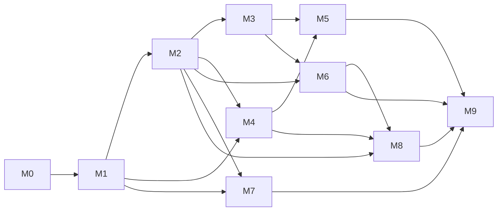
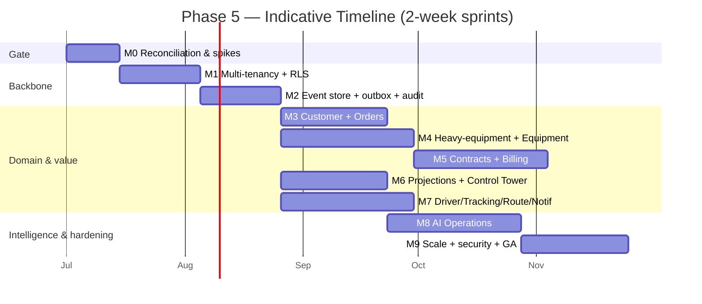

# Phase 5 — Execution Plan (Mesaar)

Status: **Execution planning only.** No implementation code, APIs, or migrations in this document.
Derived from the Phase 4.5 audit ([`06-architecture-audit-and-readiness.md`](06-architecture-audit-and-readiness.md))
and the locked decisions (DDD, Clean Architecture, CQRS-lite, EDA, PostgreSQL, Multi-Tenant RLS,
Event Store, Projections, AI Readiness; ADR-001…007).

**Goal:** build a world-class **heavy-equipment logistics platform** that exceeds Uber Freight on
architecture, scalability, AI readiness, multi-tenancy, governance, and enterprise capability —
**extending the existing `app/` package only** (no `apps/`, no redesign of approved phases,
Alembic-safe).

**Guiding sequencing principle (from audit):** *tenancy first → event backbone → domain expansion
→ heavy-equipment & commercial differentiators → intelligence & scale.* No new aggregate table is
created before `tenant_id` + RLS exist (ADR-001 §8.4).

---

## 1. Milestones

Ten milestones in three tracks. **M0** is a gate; **M1–M2** are the non-negotiable backbone;
**M3–M7** are domain/value; **M8–M9** are intelligence/scale/hardening.

| ID | Milestone | Theme | Exit gate (done = ) |
|---|---|---|---|
| **M0** | Pre-build reconciliation & design spikes | Gate | C-1 resolved; heavy-equipment + Equipment-context ADRs accepted; ADR-007 amended; event-catalog superseded; backlog frozen |
| **M1** | Multi-tenancy + RLS foundation | Backbone | Every aggregate carries `tenant_id`; RLS enabled; **automated cross-tenant isolation test green**; `SET LOCAL` verified on pooled conns |
| **M2** | Event store + transactional outbox + audit | Backbone | `event_store`/`processed_events`/`audit_log` live; relay worker + outbox-lag metric; immutability grants; partitioning + retention job |
| **M3** | Commercial core: Customer + Orders | Domain | Customer & Order aggregates/services/routers under `/v1`; Order→Shipment fan-out saga; credit-gated approval |
| **M4** | **Heavy-equipment domain + Equipment/Asset context** | Differentiator | Equipment catalog, dimensional/oversize model, permits, escorts, axle/route compliance, operator certs; shipment enrichment |
| **M5** | Contract Management (#14) + Billing | Differentiator | Contracts, pricing rules, SLA, penalties, insurance, claims, rental contracts; quote/settlement/payout |
| **M6** | Read side: projections + Control Tower | Value | `proj_*` builders folded from events; control-tower/exception/SLA console reads p95 < 300 ms |
| **M7** | Driver self-service + Tracking + Route + Notifications | Value | Close `api-gap-analysis.md`; phone+OTP; nearby offers/accept/decline; route planning; notification fan-out |
| **M8** | AI Operations (ETA / SLA / pricing / assignment / anomaly) | Intelligence | pgvector substrate; `ml_predictions` feedback loop; ETA + SLA-risk + assignment ranking serving |
| **M9** | Scale, security & enterprise hardening | Hardening | SLOs + load test to scale envelope; pen-test; residency; EDI/partner gateway; DR/PITR drill; GA readiness |

---

## 2. Deliverables (per milestone)

### M0 — Reconciliation & design spikes
- Decision record resolving **C-1** (Order `fulfilling → cancelled` with compensation) + doc fix.
- **ADR-008 Heavy-Equipment Domain Model** (dimensions, oversize/overweight, permits, escorts,
  hazmat, equipment vs cargo).
- **ADR-009 Equipment/Asset Context (#15)** (asset/condition/telematics vs Contract-owned rental).
- **ADR-007 amendment**: Migration Plan + Rollback Plan subsections.
- Supersede note on `docs/event-catalog.md` → canonical = `docs/04` Part 3 + Phase D matrix.
- Frozen, estimated Phase-5 backlog + updated target ERD (commercial + contract + equipment).

### M1 — Multi-tenancy + RLS
- `Tenant` aggregate + `tenants` table (nil-UUID platform tenant).
- `tenant_id` added to all aggregates; per-tenant composite uniques; tenant-leading indexes.
- RLS policies (`USING`/`WITH CHECK`) on every tenant table; non-superuser app role.
- `request_context` middleware wired to `SET LOCAL` tenant/user GUCs.
- **Cross-tenant isolation integration test** (the gate artifact).
- Tenant provisioning/suspension flow; per-tenant rate-limit + `statement_timeout` policy.

### M2 — Event store + outbox + audit
- `event_store` + `processed_events` models/migrations; `UNIQUE(aggregate_id, aggregate_version)`.
- `app/events` (domain event types + publish port); single-transaction state+event write.
- Outbox **relay** Celery task; **outbox-lag Prometheus gauge**; idempotent consumer base.
- `audit` schema + row-trigger + immutability grants (+ optional hash-chain).
- Monthly **partitioning** + pre-create/retention beat job (tracking/event/audit).

### M3 — Customer + Orders
- `Customer` aggregate/service/repo/router; credit-limit lifecycle events.
- `Order` (+`OrderLine`) aggregate; state machine (with corrected cancel rule); credit-gated approval.
- Order→Shipment **fan-out saga**; `OrderFulfilmentFailed` compensation path.
- Domain events emitted via outbox; OpenAPI `/v1` additions + contract tests.

### M4 — Heavy-equipment + Equipment/Asset context
- `Equipment`/`Asset` aggregate (type, dimensions, weight class, condition, telematics ref).
- Shipment enrichment: over-dimensional flags, `required_equipment_type`, hazmat, escort needs.
- **Permit** model (oversize/overweight) + lifecycle; **escort/pilot-car** planning.
- Axle-load / route-restriction compliance data; operator-certification linkage.
- Equipment availability → assignment eligibility (extends exclusivity/capacity guards).

### M5 — Contract Management + Billing
- `Contract`, `PricingRule`, `SLA`, `InsurancePolicy`, `Claim`, `Penalty`, `CarrierAgreement`,
  `RentalContract` aggregates + events (per audit §E.4).
- `Billing` (`Quote`, `Invoice`, `Settlement`, `Payout`); `SettlementRequestedIntegrationEvent`.
- Contract-based pricing feeding quote; SLA-breach → penalty → settlement adjust.
- Claims lifecycle wired to `ShipmentFailed`/`Returned`/`ExceptionRaised`.
- ACLs (`app/integrations`) to ERP/payment/insurer.

### M6 — Projections + Control Tower
- `proj_active_shipments`, `proj_driver_status`, `proj_warehouse_load`, `proj_sla_risk`,
  `proj_driver_daily_stats` builders (`app/projections`).
- Replay-rebuild tooling; projection-lag monitoring; "as of" surfacing.
- Control-tower/exception-center/SLA read APIs; console wireframes built to WCAG 2.2 AA gate.

### M7 — Driver self-service + Tracking + Route + Notifications
- Phone+OTP identity flow; `/v1/drivers/me`, `/me/stats`, availability toggle.
- `/v1/shipments/nearby` (geo/eligibility); self-accept/decline; assigned-driver RBAC read.
- Tracking surface (location/POD/exception) as first-class router; monotonic guard preserved.
- `Route`(+`RouteStop`) planning/optimization/sequencing; bind to shipments (P18).
- Notifications context: integration-event consumer + channel ACLs (FCM/APNs/SMS/email).

### M8 — AI Operations
- pgvector/HNSW `embeddings`; `documents`/`document_chunks` RAG corpus.
- `ml_features_shipment` (point-in-time), `ml_predictions` (+`actual_outcome` feedback).
- Serving: ETA, SLA-risk (`proj_sla_risk`), dynamic pricing, assignment ranking, anomaly detection.
- **ADR-010 MLOps/model-serving**; drift/monitoring; tenant-scoped governance + PII discipline.

### M9 — Scale, security & enterprise hardening
- SLO definitions + load test to ADR-002/003 envelope; revisit-trigger dashboards.
- **ADR-011 secrets/KMS**, **ADR-012 API gateway/rate-limiting**, **ADR-013 data residency**.
- EDI/partner API gateway + webhooks; PostGIS promotion (routing/geofence).
- Security review/pen-test; DR/PITR + partition-retention drill; per-tenant backup/export & erasure.
- GA acceptance (`qa/final-acceptance-test-plan.md`).

---

## 3. Dependencies

### 3.1 Milestone dependency graph

### 3.2 Critical path
**M0 → M1 → M2 → {M3, M4} → M5 → M6 → M8 → M9.** M1 (tenancy) and M2 (event backbone) are
**hard serial prerequisites** for everything else; M7 can run parallel to M5/M6 once M2 lands.

### 3.3 Key dependencies & rationale
| Dependency | Why |
|---|---|
| Everything → **M1** | New aggregates must be born tenant-scoped (ADR-001 §8.4); retrofitting `tenant_id`+RLS later is high-risk rework |
| Domain contexts → **M2** | CQRS-lite/EDA needs the outbox + event store before services can emit/consume (ADR-004/006/007) |
| M5 (Contracts/Billing) → **M3 + M4** | Pricing/SLA/penalties attach to Orders and to equipment/permit context |
| M6 (projections) → **M2** | Projections are folded from `event_store` (ADR-006) |
| M8 (AI) → **M2 + M6 + M4** | Point-in-time features come from the event log/projections; heavy-equipment features need M4 |
| M4 (heavy-equipment) → **M0 ADR-008/009** | Asset-vs-Contract ownership must be decided first |
| M9 → all | Hardening/SLO/security gate over the full surface |

### 3.4 External / cross-team dependencies
Maps/routing provider (M4/M7/M8) · SMS/OTP + Nafath SSO (M7) · payment gateway + ERP (M5) ·
insurer systems (M5) · permit/regulatory data sources (M4) · object storage (POD/DMS, M5/M6) ·
model runtime/feature store (M8) · EDI partners (M9).

---

## 4. Risks

| ID | Risk | Likelihood | Impact | Mitigation / owner gate |
|---|---|---|---|---|
| R-1 | **Cross-tenant data leakage** via pooled-connection GUC mishandling | Med | **Critical** | `SET LOCAL` in request txn; isolation test is M1 exit gate; RLS as defense-in-depth |
| R-2 | **Tenancy retrofit debt** if domain built before M1 | Med | High | Enforce sequencing; no new aggregate PR merges before M1 done |
| R-3 | **Heavy-equipment scope underestimated** (permits/oversize/compliance are deep) | High | High | M0 design spike + ADR-008/009; phase M4 incrementally; regulatory SME review |
| R-4 | **Outbox/relay reliability** (lost/duplicated events, lag) | Med | High | At-least-once + `processed_events` dedupe; lag gauge + alerting; replay tooling |
| R-5 | **Dual-write inconsistency** (aggregate vs event) | Med | High | Single-transaction write (ADR-007); never publish to broker directly |
| R-6 | **Scale envelope vs "exceed Uber Freight" ambition** (ADR-002/003 SMB) | Med | Med | Track revisit triggers (5k ev/s); M9 OLAP/throughput ADR; LIST sub-partitioning ready |
| R-7 | **Order saga / fan-out partial failure** complexity | Med | Med | Resolve C-1; explicit `OrderFulfilmentFailed` compensation; idempotent steps |
| R-8 | **Projection drift / divergence** from aggregates | Med | Med | Periodic replay-and-compare; lag SLO; rebuild-from-log |
| R-9 | **External integration fragility** (payment/insurer/maps/EDI) | High | Med | ACLs in `app/integrations`; circuit breakers; sandbox-first; contract tests |
| R-10 | **AI correctness / target leakage / drift** | Med | Med | Point-in-time features; `actual_outcome` feedback; ADR-010 monitoring; human-in-loop dispatch |
| R-11 | **Migration risk on live data** (per-tenant uniques, partitioning) | Med | High | Additive, `CREATE … CONCURRENTLY`, backfill→validate→`NOT NULL`; documented rollback |
| R-12 | **Scope creep across 14→16 contexts** dilutes delivery | High | Med | Milestone gates; P0-first (tenancy, event store, heavy-equipment, marketplace prereqs) |
| R-13 | **WCAG 2.2 AA gate slips** as consoles scale | Med | Low | CI axe-core + manual audit per release (already designed) |
| R-14 | **ADR debt** (no identity/KMS/gateway/SLO/residency ADRs) | High | Med | Schedule ADR-008…013 across M0/M8/M9 |

---

## 5. Timeline

Indicative, sprint-based (2-week sprints), single coordinated squad; parallelization noted. Adjust
to actual team size — durations are *effort envelopes*, not commitments.

| Milestone | Duration | Sprints | Parallelism |
|---|---|---|---|
| M0 Reconciliation & spikes | 2 wks | S1 | — (gate) |
| M1 Multi-tenancy + RLS | 3 wks | S2–S3 | serial (foundation) |
| M2 Event store + outbox + audit | 3 wks | S3–S4 | overlaps M1 tail |
| M3 Customer + Orders | 4 wks | S5–S6 | ∥ with M4 |
| M4 Heavy-equipment + Equipment ctx | 5 wks | S5–S7 | ∥ with M3 |
| M5 Contracts + Billing | 5 wks | S8–S10 | after M3+M4 |
| M6 Projections + Control Tower | 4 wks | S8–S9 | ∥ with M5 (needs M2) |
| M7 Driver self-svc + Tracking + Route + Notif | 5 wks | S8–S10 | ∥ (needs M1+M2) |
| M8 AI Operations | 5 wks | S11–S13 | after M2+M6+M4 |
| M9 Scale + security + hardening | 4 wks | S14–S15 | after M5–M8 |

**Headline:** ~**15 sprints / ≈ 30 weeks (~7 months)** end-to-end for a single squad to GA, with
M0–M2 (≈ 8 weeks) as the gating backbone. Adding a second squad lets the **M3/M4/M6/M7 band run in
parallel**, compressing to **≈ 20–22 weeks (~5 months)**. Critical path runs through the backbone
(M0→M1→M2) and the differentiator chain (M4→M5) into intelligence/hardening (M8→M9).

### Phase boundaries (release trains)
- **Train 1 — Foundation (M0–M2):** multi-tenant, event-driven, audited backbone. *Internal.*
- **Train 2 — Operate (M3–M4, M6–M7):** orders, heavy-equipment, control tower, driver live.
  *First customer-facing GA candidate.*
- **Train 3 — Monetize & Differentiate (M5):** contracts, pricing, SLA, claims, billing.
- **Train 4 — Intelligence & Scale (M8–M9):** AI ops, enterprise integration, GA hardening.

---

*Companion:* audit basis in [`06-architecture-audit-and-readiness.md`](06-architecture-audit-and-readiness.md);
locked decisions in ADR-001…007; structure constraint honored (`api/ app/ docs/ migrations/
mobile/ ui/`; no `apps/`; additive to `app/`).
