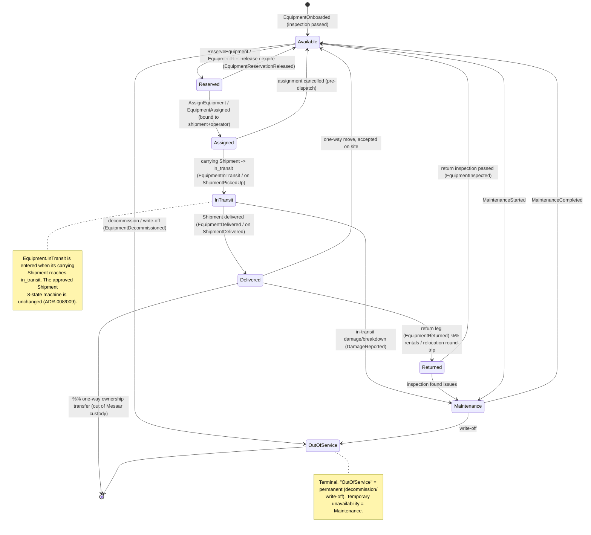
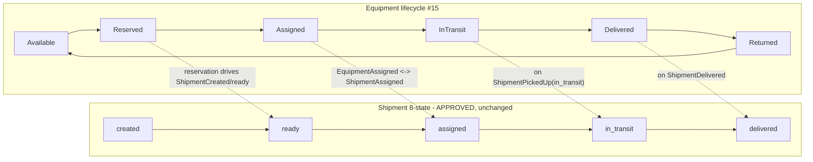
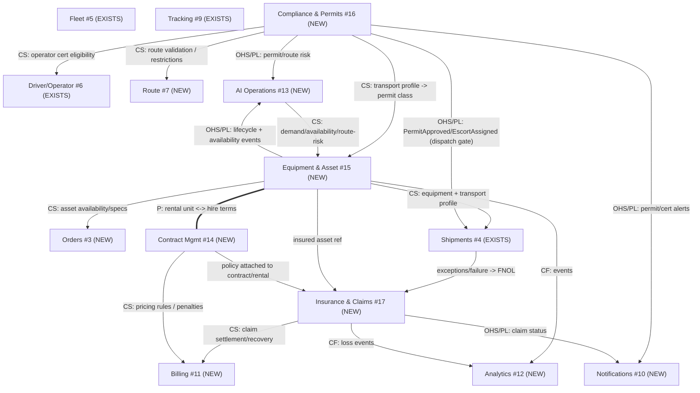

# Phase 5 — Heavy-Equipment Logistics Domain Design (Mesaar)

Status: **Architecture documentation only.** No code, SQL, ORM, or migrations. Extends the
approved platform (Phases 1–5A + audit `docs/06`) into a **world-class heavy-equipment logistics
platform** for **Aramco, SABIC, NEOM, EPC contractors, construction, mining, and industrial
operators**. It **does not redesign** any approved phase — the `Shipment` 8-state machine,
tenancy (ADR-001), event store/outbox (ADR-007), projections (ADR-006), and Clean/DDD layering
are authoritative and merely **extended** here.

| Reference | What this builds on |
|---|---|
| ADR-008 (`adr/ADR-008-heavy-equipment-domain.md`) | Ratifies contexts #15/#16/#17 + dimensional equipment modeling |
| ADR-009 (`adr/ADR-009-equipment-asset-context.md`) | Equipment↔Fleet boundary + Equipment lifecycle ownership |
| `docs/06` Phase E/F | Contract Mgmt (#14); heavy-equipment as the P0 product gap |
| ADR-001/004/006/007 | Tenancy/RLS, CQRS-lite events, projections, UUIDv7+event store+outbox |
| `docs/04` Part 1–8 | 13 base contexts, state machines, event model (unchanged) |

> **Reconciliation notes (locked-phase discipline).**
> 1. **New contexts:** #15 Equipment & Asset, #16 Compliance & Permits, #17 Insurance & Claims.
> 2. **Insurance & Claims (#17)** is *carved out* of Contract Management (#14): #14 keeps
>    contracts/pricing/SLA/penalties/carrier & **rental** agreements; #17 owns policies/claims.
> 3. **Equipment ≠ Vehicle** (ADR-009): `Vehicle` (Fleet) hauls; `Equipment` (#15) is the subject.
> 4. **Shipment machine unchanged:** equipment moves *through* a shipment; equipment lifecycle is a
>    complementary machine, reacting to shipment events.
> 5. All new tables are **tenant-scoped + RLS** (ADR-001); all events flow the **outbox** (ADR-007),
>    named `<Aggregate><PastTenseVerb>`; enums are **VARCHAR+CHECK** (additive evolution).

## Contents
- [Part 1 — Equipment Domain](#part-1--equipment-domain-context-15)
- [Part 2 — Compliance & Permit Domain](#part-2--compliance--permit-domain-context-16)
- [Part 3 — Operator Domain](#part-3--operator-domain)
- [Part 4 — Route Compliance](#part-4--route-compliance)
- [Part 5 — Insurance & Claims](#part-5--insurance--claims-context-17)
- [Part 6 — Equipment Lifecycle State Machines](#part-6--equipment-lifecycle-state-machines)
- [Part 7 — Heavy-Equipment Event Catalog](#part-7--heavy-equipment-event-catalog)
- [Part 8 — AI Readiness Extension](#part-8--ai-readiness-extension)
- [Updated Context Map & Aggregate Ownership](#updated-context-map-14--17-contexts)
- [Consistency Check vs Approved Decisions](#consistency-check-vs-approved-decisions)

---

## Part 1 — Equipment Domain (Context #15)

**Context #15 — Equipment & Asset · Core · NEW.** Owns the physical heavy asset: catalog, taxonomy,
specifications, dimensions, weight, transport requirements, condition, and the equipment lifecycle
(Part 6). Source of truth for *what the asset is* and *what moving it requires*.

**Owned aggregates:** `Equipment` (root, a physical unit), `EquipmentModel` (catalog entry /
make+model spec template), `EquipmentCategory` (taxonomy). Reference tables (catalog/category) are
low-churn → UUIDv4 acceptable (ADR-007); the `Equipment` unit + its events follow the standard
envelope.

### 1.1 Equipment Catalog & Categories

| Category | Sub-types (examples) | Primary transport profile |
|---|---|---|
| **Earthmoving** | Excavator, Bulldozer, Wheel Loader, Backhoe Loader, Motor Grader | Lowboy/step-deck; often oversize width/height |
| **Lifting** | Mobile Crane, Crawler Crane, Tower Crane (sections), Forklift, Telehandler | Multi-load (boom/counterweights separate); permits + escorts common |
| **Power** | Generator (genset), Air Compressor, Light Tower | Flatbed; usually in-gauge unless large genset |
| **Material Handling** | Loader, Reach Stacker, Skid-Steer | Flatbed/step-deck |
| **Transport assets (as subject)** | Heavy-Haul Truck, Lowboy/Flatbed/Extendable Trailer | Driven or hauled; see ADR-009 role rule |

> **Taxonomy rule.** `EquipmentCategory` is a tenant-scoped, extensible tree (VARCHAR+CHECK family
> code, not native enum) so new categories are additive (ADR-007 rationale). Each `EquipmentModel`
> belongs to one category and carries the default spec; an `Equipment` unit may override per-unit.

### 1.2 Equipment Specifications (per `EquipmentModel`, overridable per `Equipment`)

| Group | Fields (illustrative) |
|---|---|
| **Identity** | make, model, model_year, category_code, serial/VIN, asset_tag, ownership (owned/leased) |
| **Dimensions** | length_m, width_m, height_m, ground_clearance_m, working/stowed dimensions |
| **Weight** | operating_weight_kg, transport_weight_kg, max_load_kg, axle_count, axle_load_distribution |
| **Power/Capacity** | engine_power_kw, lifting_capacity_t (cranes), bucket_m3 (excavators), kVA (gensets) |
| **Operating** | fuel_type, attachments[], hazmat_flags (fuel/oil), requires_disassembly (bool) |
| **Condition** | condition_grade, last_inspection_at, hours/odometer, maintenance_due_at |
| **Commercial** | day/week/month rental_rate (ref → Contract #14), replacement_value (ref → Insurance #17) |

### 1.3 Dimensions → Oversize Classification (drives Compliance #16)

Derived, **point-in-time** classification computed from dimensions + the *loaded* trailer profile
(equipment height + trailer deck height = transport height):

| Class | Trigger (configurable per jurisdiction) | Implication |
|---|---|---|
| `in_gauge` | within legal width/height/length & axle limits | no special permit |
| `oversize_width` | width > legal (e.g. > 2.6 m) | width permit; possible escort |
| `oversize_height` | transport height > legal (e.g. > 4.5 m) | height permit; **route height-clearance check (Part 4)** |
| `oversize_length` | length > legal | length permit; possible escort |
| `overweight` | gross or per-axle > legal (Part 2) | overweight permit; bridge/axle analysis |
| `superload` | extreme dims/weight | multi-agency permit, engineered route, police escort |

### 1.4 Transport Requirements (per movement, derived)

`required_trailer_type` (lowboy/extendable/flatbed), `requires_crane_for_loading`,
`requires_disassembly`, `oversize_class[]`, `permit_classes_required[]` (→ Part 2),
`escort_required` + `escort_count`, `hazmat_handling`, `required_operator_certs[]` (→ Part 3),
`route_constraints` (max height/weight along corridor → Part 4). These populate the enrichment on
the moving `Shipment` (nullable `equipment_id` + derived flags — ADR-008/009, additive to ADR-005).

---

## Part 2 — Compliance & Permit Domain (Context #16)

**Context #16 — Compliance & Permits · Core · NEW.** Owns the regulatory envelope: permit
lifecycle, axle-weight profiles, road/route restrictions, escort planning, and a **compliance rule
engine** whose **Hard rules gate movement** (no dispatch without satisfied compliance).

**Owned aggregates:** `Permit`, `AxleWeightProfile`, `RouteRestriction` (shared with Part 4),
`Escort`, `ComplianceRule` (+ `ComplianceCheck` result). Jurisdiction data is **configurable**
(KSA references: Ministry of Transport & Logistic Services / **Roads General Authority** for
inter-city heavy/oversize permits; **municipalities/Amanah** for municipal movement; project owners
(Aramco/NEOM) for site-entry HSE permits) — never hard-coded.

### 2.1 Permit Management

| Permit type | Issued by (configurable) | Governs |
|---|---|---|
| **Oversize-load permit** | Roads authority | width/height/length over legal |
| **Overweight permit** | Roads authority | gross/axle over legal; bridge analysis |
| **Government (inter-city) permit** | National transport/roads authority | heavy-haul on national network |
| **Municipal permit** | Municipality/Amanah | movement inside city limits, timing windows |
| **Special-movement permit** | Authority + police | night movement, road closure, escort, superload |
| **Site-entry / HSE permit** | Project owner (e.g. Aramco) | gate access, site safety induction |

**Permit lifecycle (state machine):** `draft → requested → under_review → {approved | rejected}`;
`approved → active (on validity start) → expired`; `approved/active → revoked`. Each permit carries
a **validity window**, **conditions** (time-of-day, escort, route), and links to the
`Shipment`/`Equipment`/route it authorizes. Events in Part 7.

### 2.2 Axle Weight & Road Restrictions

- **`AxleWeightProfile`** — per equipment+trailer combination: per-axle loads, axle spacing, gross
  combination weight (GCW). Compared against legal **per-axle** and **GCW** limits and bridge
  ratings (Part 4).
- **Road restrictions** — designated heavy-haul corridors, permitted timing windows, seasonal
  load limits, and prohibited segments. Stored as restriction records (geo-referenced; PostGIS when
  routing lands — `docs/03` §9.5).

### 2.3 Compliance Rule Engine (rule classes per `docs/04` Part 5 convention)

| Rule | Class | Enforced where |
|---|---|---|
| No dispatch unless a valid **approved/active permit** covers the movement | **Hard** | Compliance service; gates Shipment `assigned → in_transit` |
| Transport height ≤ min route clearance (Part 4) | **Hard** | Route validation (Part 4) before dispatch |
| Per-axle & GCW ≤ legal/bridge limits along route | **Hard** | Axle + bridge check |
| Movement only within permitted **time-of-day / window** | **Hard/Soft** | Scheduler + dispatch guard |
| **Escort assigned** when oversize_class requires it | **Hard** | Escort planning before dispatch |
| Operator holds **current required certifications** (Part 3) | **Hard** | Assignment eligibility guard |
| Hazmat handling/segregation for fueled equipment | **Hard** | Compliance check |
| Permit **expiry warning** before validity end | **Soft (V)** | Scheduler → notification |

> **Integration with approved guards:** these Hard rules **extend** the existing assignment/dispatch
> path (exclusivity, capacity, vehicle `active`) — they are added as guards in the owning service,
> **not** a rewrite of the Shipment machine (ADR-008).

---

## Part 3 — Operator Domain

**Ownership:** operator identity/eligibility lives with **Driver Management (#6)** (a heavy-equipment
operator is a specialized driver/operator); **certification definitions & validity** are owned by
the **Compliance context (#16)** and *referenced* by Driver eligibility. This avoids a new context
while keeping certification rules with the regulatory authority of truth.

### 3.1 Operator Certifications

| Certification | Examples | Gates |
|---|---|---|
| **Crane / lifting** | Mobile/crawler crane operator, rigger, signaler (e.g. NCCCO-equivalent) | operating cranes; loading lifts |
| **Heavy-vehicle license** | KSA heavy/trailer license class; hazmat endorsement | driving the haul vehicle |
| **Safety training** | Defensive driving, load securement, HSE induction, site-specific (Aramco CSM/NEOM) | site entry; movement |
| **Medical / fitness** | Medical fitness, drug & alcohol clearance | eligibility |

### 3.2 Certification Model & Expiry Management

`OperatorCertification` (ref data in #16) ↔ `Driver`/operator (by id): `cert_type`, `issuing_body`,
`certificate_no`, `issued_at`, `expires_at`, `status` (`valid | expiring | expired | suspended`),
`evidence_url`. **Expiry management** is a scheduled sweep (celery-beat, ADR-003):

- `OperatorCertExpiring` emitted at configurable thresholds (e.g. 60/30/7 days) → Notifications.
- On `expires_at`, status → `expired`; operator becomes **ineligible** for any movement requiring
  that cert (Hard rule, Part 2 §2.3).
- Eligibility check at assignment: required certs (from Part 1 transport requirements) ∩ operator's
  **current valid** certs must cover all requirements, else assignment is rejected.

---

## Part 4 — Route Compliance

**Ownership:** **Compliance & Permits (#16)** owns restriction data and validation; **Route
Management (#7)** consumes it when planning/optimizing (CS/ACL). Route validation is a **Hard gate**
before a movement may enter `in_transit`.

### 4.1 Route Restriction Types

| Restriction | Data | Check vs equipment |
|---|---|---|
| **Height** | overpass/gantry/tunnel clearance per segment | transport height (equip + deck) ≤ min clearance |
| **Weight** | segment load limits | GCW ≤ segment limit |
| **Bridge capacity** | bridge load rating / class | GCW & axle config ≤ bridge rating (engineered for superloads) |
| **Tunnel** | height + hazmat prohibitions | clearance + hazmat compatibility |
| **Hazardous zones** | refinery/industrial/restricted/school zones, geofenced | avoid or special permit + timing |
| **Surface/grade** | unpaved, steep grade, turning radius | feasibility for long/heavy loads |

### 4.2 Route Validation Flow

1. Candidate route (Route #7, via maps/routing ACL) + equipment transport profile (Part 1) →
   Compliance #16 evaluates each segment against restrictions + `AxleWeightProfile` + bridge ratings.
2. Result: `RouteValidated` (compliant, with required permits/escorts) **or** `RouteRestricted`
   (violations listed → re-route, request engineered permit, or reject).
3. A compliant, permitted route + assigned escorts is a **precondition** for `assigned → in_transit`
   (Hard rule). Re-validation triggers on permit/restriction change.

> Geospatial restriction matching uses PostGIS `geography` + GiST when routing lands (`docs/03`
> §9.5) — additive, ADR-002 "adopt when triggered" pattern. Until then, segment restriction lookups
> are attribute-based.

---

## Part 5 — Insurance & Claims (Context #17)

**Context #17 — Insurance & Claims · Core/Supporting · NEW** (carved out of Contract Mgmt #14 — see
reconciliation note). Owns policies, coverage rules, the claims workflow, damage reporting, and
liability tracking for high-value equipment movements.

**Owned aggregates:** `InsurancePolicy`, `CoverageRule`, `Claim` (root of the claim workflow),
`DamageReport`, `LiabilityRecord`. References (by id): `Contract`/`RentalContract` (#14), `Shipment`,
`Equipment` (#15). ACL to insurer systems (`app/integrations`).

### 5.1 Insurance Policies & Coverage Rules

| Concept | Fields / rules |
|---|---|
| **InsurancePolicy** | policy_no, insurer, type (cargo/equipment-in-transit, marine inland, CAR/EAR project, third-party liability), insured_value, premium, validity window, attached_to (contract/equipment/shipment) |
| **CoverageRule** | per-incident limit, aggregate limit, deductible, exclusions[], covered_perils[], territory, sub-limits (e.g. crane operations) |
| **Coverage check** | at order/movement creation: required coverage ∈ active policy; gap → warning/Hard block per customer terms |

### 5.2 Claims Workflow (state machine)

`reported (FNOL) → under_assessment → {approved | rejected}`; `approved → settled`; any →
`reopened` (compensating). Driven by events (Part 7). Steps:

1. **Damage reporting / FNOL** — `DamageReport` with pre/post-move condition evidence (photos,
   inspection), incident description, location/time. Often triggered by `ShipmentFailed`/
   `ShipmentReturned`/`ShipmentExceptionRaised` (#4/#9) → `ClaimCreated`.
2. **Assessment** — surveyor/insurer assessment, coverage match (§5.1), reserve set.
3. **Liability tracking** — `LiabilityRecord`: at-fault party (carrier/driver/operator/third-party/
   customer), subrogation, recovery; feeds carrier/driver scorecards & penalties (#14).
4. **Resolution** — `ClaimApproved` → settlement (Billing #11 adjustment) or `ClaimRejected` (reason).

### 5.3 Relationships
Insurance #17 ← Contract #14 (policy attached to contract/rental) · ← Equipment #15 (insured asset)
· ← Shipment #4 (incident context) · → Billing #11 (settlement/recovery) · → Analytics #12
(loss ratio, claim frequency) · → Notifications #10.

---

## Part 6 — Equipment Lifecycle State Machines

**New, complementary to (not replacing) the Shipment machine.** An `Equipment` unit moves through a
reservation→delivery→return cycle; transitions are driven by commands **and** by reacting to
approved shipment events (ADR-009). Terminal: `OutOfService`. `Returned`/`Delivered` are cycle
states (a rental unit returns to `Available`).

### 6.1 Equipment unit lifecycle

### 6.2 Mapping: Equipment ↔ Shipment (no change to Shipment machine)

### 6.3 Permit & Claim sub-machines (cross-reference)
- **Permit** (Part 2.1): `draft → requested → under_review → approved|rejected → active → expired|revoked`.
- **Claim** (Part 5.2): `reported → under_assessment → approved|rejected → settled (→ reopened)`.

---

## Part 7 — Heavy-Equipment Event Catalog

Canonical naming `<Aggregate><PastTenseVerb>`; standard envelope (`event_id` UUIDv7, `tenant_id`,
`aggregate_type/id`, `aggregate_version`, `occurred_at`, `correlation_id`, `causation_id`, `payload`)
via the outbox (ADR-007). The 10 requested events are included **plus** the complementary events that
make each lifecycle reachable and each unhappy-path covered (closing the Phase D "missing" gaps).

| Context | Event | Producer | Key consumers | Payload (key) / meaning |
|---|---|---|---|---|
| Equipment #15 | **`EquipmentReserved`** | Equipment | Orders, Contract #14, `proj_equipment_availability`, Notifications | equipment_id, order/contract_id, window — unit held for a job |
| Equipment #15 | `EquipmentReservationReleased` | Equipment | availability proj, Orders | reservation expired/cancelled → back to Available |
| Equipment #15 | **`EquipmentAssigned`** | Equipment | Shipments, Driver/operator, Compliance #16, Analytics | equipment_id, shipment_id, operator_id, vehicle_id |
| Equipment #15 | `EquipmentInTransit` | Equipment (on `ShipmentPickedUp`) | Tracking, availability proj, AI Ops | enters InTransit with carrying shipment |
| Equipment #15 | **`EquipmentDelivered`** | Equipment (on `ShipmentDelivered`) | Billing #11, Contract #14, Notifications | delivered_at, site, POD ref |
| Equipment #15 | **`EquipmentReturned`** | Equipment | Contract #14 (rental close), Insurance #17, availability proj | return leg complete (rental/relocation) |
| Equipment #15 | `EquipmentInspected` | Equipment | Maintenance, Insurance #17, availability proj | condition grade; routes to Available/Maintenance |
| Equipment #15 | `EquipmentMaintenanceStarted` / `…Completed` | Equipment | availability proj, Analytics | temporary OutOfService |
| Equipment #15 | `EquipmentDecommissioned` | Equipment | Fleet/Analytics, Insurance #17 | terminal OutOfService (write-off) |
| Compliance #16 | `PermitRequested` | Permit | permit-authority ACL, Notifications | permit_class, movement ref |
| Compliance #16 | **`PermitApproved`** | Permit | Shipments (dispatch gate), Route #7, Notifications | permit_id, validity, conditions |
| Compliance #16 | **`PermitRejected`** | Permit | Dispatch (block), Notifications, control tower | reason → re-plan/re-request |
| Compliance #16 | `PermitExpiring` / `PermitExpired` / `PermitRevoked` | Permit (sweep) | Dispatch guard, Notifications | validity lifecycle; blocks movement |
| Compliance #16 | **`EscortAssigned`** | Escort | Shipments (dispatch gate), Route #7, Notifications | escort_id(s), pilot-car count |
| Compliance #16 | `RouteValidated` | ComplianceCheck | Route #7, Shipments (dispatch gate) | compliant route + required permits/escorts |
| Compliance #16 | **`RouteRestricted`** | ComplianceCheck | Route #7, Dispatch (block), control tower | violations[] (height/weight/bridge/tunnel/hazard) |
| Compliance #16 | `OperatorCertExpiring` / `OperatorCertExpired` | OperatorCertification (sweep) | Driver eligibility, Notifications | cert_type, operator_id, expires_at |
| Insurance #17 | `DamageReported` | DamageReport | Claims, Insurance, Analytics | incident, evidence_url, condition delta |
| Insurance #17 | **`ClaimCreated`** | Claim | Insurer ACL, Billing #11, Notifications | claim_id, policy_id, shipment/equipment ref |
| Insurance #17 | `ClaimAssessed` | Claim | Liability, Billing | assessment, reserve, coverage match |
| Insurance #17 | **`ClaimApproved`** | Claim | Billing #11 (settlement), Notifications, Analytics | approved amount → settlement |
| Insurance #17 | `ClaimRejected` / `ClaimSettled` / `ClaimReopened` | Claim | Notifications, Billing, Analytics | resolution / compensation |

> **No orphans/unreachable:** every state in Part 6 / the permit & claim sub-machines is entered and
> exited by an event above; the 10 mandated events are authoritative, the rest make the machines
> reachable and cover unhappy paths (per `docs/06` Phase D method).

---

## Part 8 — AI Readiness Extension

Reuses the approved AI substrate unchanged (`docs/03` §9, `docs/04` Part 8): immutable event log =
training stream; `ml_predictions(model_name, model_version, features_ref, output, score,
predicted_at, actual_outcome)` for the feedback loop; pgvector/HNSW; **tenant-scoped (RLS) — no
cross-tenant training/inference**; point-in-time features avoid leakage. New projection
`proj_equipment_availability` (ADR-006) feeds several models.

| AI capability | Inputs (events / features) | Model output | Consumers | Feedback (`actual_outcome`) |
|---|---|---|---|---|
| **Equipment Demand Forecasting** | reservations, orders by category/region/season, project pipeline (Contract #14), historical utilization | demand by category × region × horizon | Fleet/equipment acquisition, dispatch, sales | realized demand vs forecast |
| **Permit Delay Prediction** | `PermitRequested→Approved` lead times by authority/permit_class/route, calendar/seasonality | expected approval delay + risk band | dispatch scheduling, customer ETA, control tower | actual approval time |
| **Route Risk Prediction** | route restrictions, `RouteRestricted` history, weather, traffic, incident/`DamageReported`, terrain | route risk score + failure modes | Route #7 optimization, escort planning, pricing #14 | realized incidents/delays |
| **Fleet/Asset Optimization** | equipment availability, locations, jobs, backhaul opportunities, axle/permit constraints | optimal asset↔job assignment & consolidation | dispatch (AI Ops #13 ranking), Route #7 | utilization/cost vs plan |
| **Equipment Availability Forecasting** | lifecycle events (Part 6), maintenance schedules, rental return dates, inspection outcomes | available units by category × date | reservation promising, sales quoting, demand model | actual availability |

**Governance (unchanged):** reproducibility via `model_version` + `features_ref` + point-in-time
events; PII/sensitive fields excluded/hashed before embedding; predictions are advisory —
**human-in-the-loop for dispatch/permit/route decisions** with safety/regulatory impact. MLOps/
serving runtime is deferred to a dedicated ADR (per `docs/07` M8, ADR-010 candidate).

---

## Updated Context Map (14 → 17 contexts)

New: **#15 Equipment & Asset**, **#16 Compliance & Permits**, **#17 Insurance & Claims**. All
existing edges from `docs/06` Phase E remain; only additions shown around the new contexts.

### Aggregate ownership additions (extends `docs/05` §4)

| Aggregate(s) | Owning context | Status |
|---|---|---|
| `Equipment`, `EquipmentModel`, `EquipmentCategory` | Equipment & Asset #15 | PLANNED (ADR-008/009) |
| `Permit`, `Escort`, `AxleWeightProfile`, `RouteRestriction`, `ComplianceRule`/`ComplianceCheck` | Compliance & Permits #16 | PLANNED |
| `OperatorCertification` (ref) | Compliance #16 (def) ↔ Driver #6 (eligibility) | PLANNED |
| `InsurancePolicy`, `CoverageRule`, `Claim`, `DamageReport`, `LiabilityRecord` | Insurance & Claims #17 | PLANNED |
| `RentalContract`, `PricingRule`, `SLA`, `Penalty`, `CarrierAgreement` | Contract Mgmt #14 | PLANNED |

---

## Consistency Check vs Approved Decisions

| Approved decision | Honored? | How |
|---|---|---|
| **No redesign of prior phases** | ✅ | Shipment 8-state machine, Fleet `Vehicle`, tenancy, event store untouched; equipment is additive & complementary |
| **DDD / Clean Architecture** | ✅ | 3 new contexts, one owner per aggregate, cross-context by id + events; rules in services, not models |
| **Multi-tenant + RLS (ADR-001)** | ✅ | Every new table tenant-scoped + RLS; AI training tenant-scoped |
| **CQRS-lite + EDA (ADR-004)** | ✅ | Aggregates = truth; events emitted on transitions; projections (`proj_equipment_availability`) derived |
| **UUIDv7 + event store + outbox (ADR-007)** | ✅ | All new events via the outbox, standard envelope; UUIDv7 on event/append tables, UUIDv4 on catalog refs |
| **Projections (ADR-006)** | ✅ | New availability/compliance read models rebuildable from the log |
| **API versioning (ADR-005)** | ✅ | New surfaces additive under `/v1`; equipment fields on `Shipment` are additive/nullable |
| **Structure constraint** | ✅ | Additive to `app/` (planned `app/models|services|repositories|api/routes` per context); **no `apps/`**; Alembic-safe |
| **No code / docs-only** | ✅ | This document and ADR-008/009 contain no code, SQL, ORM, or migrations |
| **Reconcile, don't silently change** | ✅ | Insurance/Claims promotion out of #14 is flagged as a reconciliation note, not a silent redesign |

**Open decisions deferred to build (flagged, not resolved here):** (a) MLOps/serving runtime ADR
(ADR-010 candidate, `docs/07` M8); (b) jurisdiction permit/route data sourcing & ACL contracts;
(c) PostGIS promotion timing for route compliance (ADR-002 trigger).

*Companion artifacts:* `adr/ADR-008-heavy-equipment-domain.md` · `adr/ADR-009-equipment-asset-context.md`
· `docs/06-architecture-audit-and-readiness.md` (Phase E/F) · `docs/07-phase-5-execution-plan.md`
(M4–M5, M8) · `docs/03` §9 · `docs/04` Parts 1–8.
