# Phase 6 — Final Consolidated Domain Model (Mesaar Logistics Operations Platform)

> **Status:** Consolidation & validation deliverable — **documentation only** (no code, SQL, ORM, or APIs). Produced 2026-06-22.
> **Purpose:** Validate every previously-approved artifact, detect cross-document conflicts, and merge all bounded contexts into one authoritative domain model — the gate before the **Phase 7 Final ERD Review**.
> **Locked-phase discipline:** prior phases are *reconciled, not redesigned*. Where a conflict exists it is **flagged with a recommended resolution**, not silently rewritten. This document supersedes nothing on disk by itself; it records the rulings that the source files must be edited to match.
>
> **▶ UPDATE — Phase 6.5 (2026-06-22):** these rulings are now **applied on disk** — see [`docs/09a-reconciliation-and-closure.md`](09a-reconciliation-and-closure.md). C-1 **resolved** (`fulfilling → cancelled` allowed with compensation + fee + audit + notify); `PaymentFailed` + `OrderFulfilmentFailed` (+ `OrderCancellationFeeApplied`) **added**; Contract / Claim / Warehouse **state machines created**; `docs/01-project-vision.md` **authored**; ADR-007 **amended** (Migration + Rollback); ADR-006 **amended** (projection tenancy, closes B-5). The ABSENT ledger and readiness scores below are the **Phase-6 snapshot**; `docs/09a` carries the current post-closure status.

This consolidation was produced by reading the full corpus and validating it with a fan-out of independent reviewer agents (one per artifact group), an adversarial three-lens conflict-detection pass, per-section authors, and a completeness/anti-fabrication critic. Coverage: **28 artifact entries validated**, **24 cross-document conflicts** consolidated, **0 design fabrications** found (every aggregate, event, state, and transition below traces to a cited source file). The critic's findings are recorded verbatim in **Appendix A**.

---

## How to read this document

### Maturity vocabulary (unified)

The source documents use several near-synonymous status words. This document treats them as one scale. Each section keeps its locally-idiomatic word; the mapping is:

| Unified tier | Section synonyms | Meaning |
|---|---|---|
| **BUILT** | `[IMPLEMENTED]`, `EXISTS`, "built", "as-built" | Implemented in `app/models` / `app/services` and (where noted) enforced in code today. |
| **DESIGNED** | `[DESIGNED]`, `PLANNED`, "designed-not-built", `NEW` | Fully modelled in `docs/*`/ADRs with **zero tables or handlers on disk**. |
| **PLANNED-ONLY (gated)** | `[PLANNED-ONLY]` | Designed, but **inert until unbuilt prerequisites ship** — the heavy-equipment trio (#15/#16/#17), gated behind tenancy (M1) and the event backbone (M2). |
| **PROPOSED** | `PROPOSED` | A behaviour (e.g. a state machine) that is *described* but has **no enforcing enum/guard in code** (Vehicle/Driver transition guards). |
| **ABSENT** | `ABSENT`, "not-yet-designed" | Named somewhere but with **no supporting design** anywhere in the corpus. |

### Global conventions (stated once; reiterated locally in sections for standalone readability)

- **Event envelope (all events).** Every domain event carries `event_id` (UUIDv7), `tenant_id` (ADR-001), `aggregate_type`, `aggregate_id`, `aggregate_version`, `occurred_at`, `correlation_id`, `causation_id`, `payload` (per `docs/03` §7 / ADR-004 / ADR-007). "Payload Summary" columns list only the distinctive fields, not the envelope.
- **Naming.** `<Aggregate><PastTenseVerb>` for domain events; cross-boundary events are suffixed `*IntegrationEvent` (only two exist: `NotificationRequestedIntegrationEvent`, `SettlementRequestedIntegrationEvent`).
- **Canonical catalog.** The single source of truth for events is `docs/04` Part 3 (+ `docs/06` Phase D, + `docs/08` Part 7). `docs/event-catalog.md` is the **stale** Shipment/Fleet slice and must carry a supersede banner (conflict CF3 / audit W-2).
- **Hard build ordering (`docs/07` critical path).** **M1** (tenancy: `tenant_id` + RLS + isolation test) and **M2** (event store + transactional outbox + `processed_events`) are serial prerequisites for everything else. *Every DESIGNED / PLANNED-ONLY event behaviour in this document is inert until M2 ships, and no new aggregate table is created before `tenant_id` + RLS exist.*
- **Persistence.** Per ADR-007 there is **one unified `event_store` + outbox** for all aggregates; `shipment_tracking_events` is merely the user-facing tracking slice. Until M2, only tracking-typed rows persist; all other events have no persistence target yet.

### Scope correction (the brief's framing, reconciled to the corpus — stated once)

The Phase-6 brief lists **17 contexts** and aggregates (Order, Contract, Permit, Claim, Compliance, Insurance, AI Operations) framed as concepts that "**MAY NOT EXIST**." Read against the corpus, **this framing is inaccurate and is corrected here**: *none* of those named concepts is ABSENT — every one has a design. The accurate inventory is **17 bounded contexts** = 13 base contexts (`docs/04` §1) + Contract Management #14 (`docs/06` §E.2) + Equipment & Asset #15 / Compliance & Permits #16 / Insurance & Claims #17 (`docs/08`, ADR-008/009). **Permit** and **Claim** are *aggregates inside* contexts #16/#17 — not standalone contexts; **Order**/**Contract**/**Insurance** are aggregates/contexts that are DESIGNED, not ABSENT. Six contexts are BUILT (Identity & Access — partial, Shipments, Fleet, Driver, Warehouse, Tracking); the other eleven are DESIGNED / PLANNED-ONLY. The dominant reality is a **design-to-build delta**: design ERS ≈ 4.4 vs as-built ≈ 2.0 (`docs/06` Phase A); overall Phase-5 readiness ≈ 2.6/5.

### Missing prior-phase artifact (flagged)

The brief lists "**01 Project Vision**" as an input to validate. **No `docs/01-project-vision.md` exists**, and `README.md` is effectively empty (a bare title line — validated **CRITICAL**, score 5/100). The product vision is only implicit across `README` + `ui/screen-map.md` + the driver app (`docs/06` A.1 #1: "Present but distributed… No single consolidated product/PRD document"). **Required fix:** author a consolidated `01-project-vision.md` (or a PRD) before Phase 7 sign-off, including success metrics, personas, NFR/SLOs, and heavy-equipment product positioning.

---

## Consolidated ABSENT / NOT-YET-DESIGNED ledger

Because the brief expected several items to be "absent," this ledger collects — in one place — everything that is **genuinely undesigned or missing** in the corpus (the scattered findings the sections surface individually). Everything *not* listed here has a design and is classified BUILT / DESIGNED / PLANNED-ONLY in §3.

| Item | Kind | Status | Evidence / note |
|---|---|---|---|
| **`01 Project Vision` document** | Artifact | **ABSENT** | No `docs/01-*.md`; README near-empty (validation #2, CRITICAL). Vision is implicit only (`docs/06` A.1 #1). |
| **Contract state machine** | State machine | **ABSENT (not-yet-designed)** | Contract Management #14 has entities + events but **no states/transitions/diagram** drawn anywhere (`docs/06` §E.2; `docs/08` line 20). Minimum-viable states sketched in §6 are *scaffolding, not a designed machine*. |
| **Warehouse lifecycle machine** | State machine | **ABSENT** | Warehouse is registration-only; no status enum or lifecycle in the focus files (§4 Root 5). Capacity is enforced, but there is no Warehouse state machine. |
| **`PaymentFailed` event** | Event | **MISSING** | Billing settlement unhappy-path has no failure event (`docs/06` §D.2). Annotated on the Billing row in §4. |
| **`OrderFulfilmentFailed` event** | Event | **MISSING** | Orders fan-out partial-failure compensation event is absent (`docs/06` §D.2). Annotated on the Orders row in §4; pairs with the C-1 fix. |
| **`EquipmentOnboarded` catalog row** | Event | **MISSING from catalog** | It is the entry transition into `Available` (`docs/08` line 270) but has no row in the Part 7 catalog (conflict CF7). |
| **MLOps / model-serving ADR (ADR-010 candidate)** | ADR | **ABSENT** | AI substrate is designed; the serving runtime decision is deferred and unwritten (`docs/06` C.1; `docs/08` Part 8). Also missing: ADRs for identity/OTP, KMS, API-gateway/rate-limit, SLO/observability, data residency. |

> The aggregates the brief named as possibly-absent — **Order, Contract, Permit, Claim, Customer, Insurance, AI Operations** — are **NOT absent**: all are DESIGNED/PLANNED. See §3 (Domain Model) and §4 (Aggregate Ownership Matrix) for their classification and §6 for which of their *state machines* are drawn (Order = PROPOSED; Permit, Claim = DESIGNED) versus undesigned (Contract = ABSENT).

---

## Contents

1. **Validation Report** — per-artifact status, consistency score, risks, missing components, recommendations (28 artifacts).
2. **Conflict Matrix** — 24 consolidated cross-document conflicts with evidence and recommended resolutions.
3. **Final Domain Model** — all 17 bounded contexts: purpose, responsibilities, owned entities, owned events, dependencies.
4. **Aggregate Root Review & Ownership Matrix** — every documented aggregate root + the ownership matrix.
5. **Final Domain Event Map** — events by domain (producer / consumer / payload / meaning) + Mermaid.
6. **Final State Machines** — Shipment, Vehicle, Driver, Equipment, Permit, Claim, Order (+ Contract = absent) + Mermaid.
7. **Integration Map** — data ownership, event flow, external systems + Mermaid.
8. **Phase 7 Readiness Report** — readiness scores, blockers, technical debt, required fixes.
9. **Appendix A — Consolidation QA** — completeness critic & anti-fabrication audit.

---

## 1. Validation Report

Every previously-approved artifact was read in full by an independent validator agent. Status legend: **PASS** = sound, no blocking issue; **WARNING** = real but non-blocking inconsistency or gap; **CRITICAL** = must fix before the artifact can be relied on. Consistency Score (0-100) blends internal coherence with cross-document agreement.

**Roll-up:** 28 artifacts reviewed - PASS 19 · WARNING 8 · CRITICAL 1. The single most important finding: the design corpus is enterprise-grade while the as-built reality is early-stage (the design-to-build delta), and there is **no standalone `01 Project Vision` document** (README is effectively empty).

| # | Artifact | Exists | Status | Score | One-line summary |
|---|---|---|---|---|---|
| 1 | docs/02-architecture.md | yes | WARNING | 82 | A focused, well-structured Phase 2 architecture overview that is internally coherent and externally consistent with the codebase it claims to extend. It expl... |
| 2 | README.md | yes | CRITICAL | 5 | The README is effectively empty: it contains a single line — the bare repository title '# Logistics_Managemnt_System' — with no description, no project visio... |
| 3 | Phase 3 — PostgreSQL Database Architecture (Mesaar) | yes | WARNING | 86 | A thorough, design-only target-state data-tier document (no DDL/ORM, as required) that extends the as-built schema with multi-tenancy (tenant_id + RLS, nil-U... |
| 4 | As-built ERD (erd.mmd) | yes | PASS | 95 | A faithful as-built Entity-Relationship diagram generated from app/models/*.py, declaring (header comment lines 1-2) that every column/constraint shown exist... |
| 5 | Phase 4 — Event Storming, State Machines & Domain Events | yes | PASS | 88 | A 2370-line, well-structured Phase-4 design document covering 13 bounded contexts, full event-storming inventories (actors, commands, domain events, policies... |
| 6 | Shipment State Machine (Mermaid) | yes | PASS | 96 | A 36-line Mermaid stateDiagram-v2 explicitly headed as generated from app/services/shipment_service.py::_is_transition_allowed and described as the AUTHORITA... |
| 7 | Vehicle State Machine (Mermaid) | yes | WARNING | 78 | A 16-line Mermaid stateDiagram-v2 derived from app/models/enums.py::VehicleStatus, modeling active -> maintenance -> active, active -> decommissioned, mainte... |
| 8 | 05-backend-architecture.md | yes | PASS | 88 | A well-structured, internally coherent Phase 5A backend architecture document for the Mesaar platform. It formalizes a Clean Architecture layering of the as-... |
| 9 | Phase 4.5 — Architecture Audit, Validation & Phase 5 Readiness | yes | PASS | 92 | A rigorous, evidence-backed audit (Phases A–G) that explicitly separates the enterprise-grade DESIGN corpus (avg design ERS ~4.4) from the early as-built rea... |
| 10 | Phase 5 — Execution Plan | yes | PASS | 90 | A coherent, well-sequenced execution plan derived directly from the Phase 4.5 audit, with 10 milestones (M0 gate; M1-M2 non-negotiable backbone; M3-M7 domain... |
| 11 | Phase 5 — Heavy-Equipment Logistics Domain Design | yes | PASS | 92 | The primary design artifact for the Heavy-Equipment domain. It defines three NEW bounded contexts (#15 Equipment & Asset, #16 Compliance & Permits, #17 Insur... |
| 12 | ADR-008 — Heavy-Equipment Logistics Domain & Bounded Contexts | yes | PASS | 95 | The ratifying ADR (Status: Accepted, 2026-06-20) for the three new heavy-equipment contexts. It states the product motivation (Aramco/SABIC/NEOM/EPC/mining/i... |
| 13 | ADR-009 — Equipment↔Fleet Boundary & Equipment Lifecycle Ownership | yes | PASS | 94 | The companion ADR (Accepted, 2026-06-20) that resolves the Equipment-vs-Vehicle boundary and assigns ownership of the Equipment lifecycle. Key decisions: (1)... |
| 14 | ADR-001 — Tenancy model | yes | PASS | 90 | ADR-001 records an Accepted, Confirmed (2026-06-20) decision to adopt shared multitenancy with a row-level tenant_id on every aggregate root, enforced by Pos... |
| 15 | ADR-002 — Time-series & event analytics store | yes | PASS | 92 | ADR-002 is Accepted/Confirmed (2026-06-20) and decides to start PostgreSQL-only for the append-only shipment_tracking_events table (fastest-growing: location... |
| 16 | ADR-003 — Background job processing | yes | PASS | 90 | ADR-003 is Accepted/Confirmed (2026-06-20) and selects Celery with a Redis broker (Redis also serving as cache) plus celery-beat for scheduled jobs (SLA swee... |
| 17 | ADR-004 — Event model depth (CQRS-lite vs full event sourcing) | yes | WARNING | 85 | ADR-004 is Accepted (default) and adopts CQRS-lite: the relational aggregate (shipments) stays the source of truth for current state; the append-only shipmen... |
| 18 | ADR-005 — API versioning & contract | yes | WARNING | 78 | ADR-005 is a short, internally coherent decision to introduce a URI version prefix `/v1` on a root APIRouter, keep FastAPI auto-generated OpenAPI as the cont... |
| 19 | ADR-006 — Read models / projections | yes | PASS | 88 | ADR-006 is a clear, internally consistent CQRS-read decision: build denormalized projection tables in the SAME PostgreSQL (no separate store yet), updated by... |
| 20 | ADR-007 — UUIDv7 keys, unified Event Store, and Transactional Outbox | yes | PASS | 92 | ADR-007 is the strongest of the three: a coherent, well-cross-referenced decision that finalizes Phase 4 by locking three previously-recommended mechanics in... |
| 21 | Event Catalog | yes | WARNING | 82 | A well-structured canonical event catalog for the implemented Shipment-centric domain. It declares the naming convention `<Aggregate><PastTenseVerb>` (line 9... |
| 22 | Domain Glossary (Ubiquitous Language) | yes | PASS | 90 | A tight, source-grounded ubiquitous-language glossary that maps each term to a concrete `app/models/*` or `app/services/*` artifact (lines 3, 6-23), includin... |
| 23 | System Context Diagram (C4) | yes | PASS | 85 | A clear C4-style system-context flowchart naming five actors (Admin, Operations/Manager, Dispatcher/Manager, Driver, Customer/Client; lines 4-9), the Mesaar ... |
| 24 | Deployment Topology Diagram | yes | WARNING | 80 | A Phase-4 target deployment topology (Docker Compose locally, orchestrator in staging/prod; lines 1-2) reflecting ADR-002 (Postgres-only) and ADR-003 (Celery... |
| 25 | Sequence: Assign through Deliver | yes | PASS | 92 | A precise, code-anchored sequence (maps to POST /shipments/{id}/assign, /status, /events in shipment_service.py; lines 1-2) covering dispatch assignment → in... |
| 26 | Sequence: Driver Login + Nearby Offers | yes | WARNING | 88 | An honest, gap-aware authentication + nearby-offers sequence that explicitly flags starred steps as endpoints the mobile app expects but the backend does NOT... |
| 27 | OpenAPI Spec (Mesaar Logistics Operations API) | yes | PASS | 88 | A hand-curated OpenAPI 3.1.0 contract draft (version 1.0.0-draft) that, per its own description, reflects the EXISTING routes in app/api/routes/* remounted u... |
| 28 | API Gap Analysis (Driver App ↔ FastAPI Backend) | yes | PASS | 90 | A concise, well-structured gap-analysis doc comparing endpoints the delivered driver app (mobile/src/api/driverApi.ts) expects against what the backend (app/... |

#### Per-artifact detail

##### 1.1  docs/02-architecture.md
Path: c:\me\Logistics_Managemnt_System\docs\02-architecture.md  
**Exists:** yes  ·  **Status:** WARNING  ·  **Consistency Score:** 82/100

**Summary.** A focused, well-structured Phase 2 architecture overview that is internally coherent and externally consistent with the codebase it claims to extend. It explicitly states the architectural style (DDD + Clean Architecture, CQRS-lite + event-driven, multitenant via tenant_id + RLS, versioned /v1 API), maps a 6-layer structure directly onto the app/ tree, enumerates 7 bounded contexts with aggregates and build status, and cites concrete artifacts (docs/diagrams/shipment-state-machine.mmd, services/shipment_service.py::_is_transition_allowed, docs/api-gap-analysis.md, api/openapi.yaml) all of which were verified to exist. It honestly flags DESIGNED-but-not-built items (no tenant_id yet, no /v1 prefix applied, no optimistic-concurrency version column, missing driver self-service endpoints) which aligns with ground truth. The WARNING (not PASS) is driven by document-scope and cross-reference gaps rather than internal error: it is labelled 'Phase 2' and depends on a 'Phase 1 / 01 Project Vision' artifact that does not exist, its bounded-context table is narrower than (and uses different names than) the later Phase 6 / Heavy-Equipment expansion (08, ADR-008/009, ADR-007 event store/outbox are not referenced here at all), and several exit-criteria checkboxes remain unchecked.

**Risks:**
- Document is explicitly 'Draft for approval' with all Phase 2 exit-criteria checkboxes (section 7) left unchecked — its authority is provisional, not ratified.
- References a Phase 1 baseline that has no '01 Project Vision' document on disk; the architectural narrative therefore floats without an approved vision/scope anchor.
- Bounded-context table (section 3) lists only 7 contexts and omits the append-only event store/outbox (ADR-007) and the entire Heavy-Equipment domain (08, ADR-008, ADR-009) — readers may mistake this for the complete context map.
- Multiple foundational claims (tenant_id + RLS, /v1 prefix, optimistic-locking version column, events/projections/workers packages) are aspirational ('Add in Phase 4', 'new', 'add') yet sit beside 'exists' claims — risk of readers treating designed items as implemented.
- References ADR-001..006 only; ADR-007/008/009 exist in the repo but are not cited here, so the document is stale relative to the current ADR set.

**Missing components:**
- No link to or dependency declaration on a Phase 1 / Project Vision document (it does not exist).
- No reference to ADR-007 (UUIDv7 event store + outbox) despite the document centring on append-only events.
- No reference to the Heavy-Equipment bounded context / ADR-008 / ADR-009 in the context table.
- No explicit non-functional requirements (SLA targets, throughput, retention) beyond a generic Observability row.
- Vehicle lifecycle is not mentioned even though docs/diagrams/vehicle-state-machine.mmd exists.

**Recommended improvements:**
- Add an explicit 'Depends on: docs/01-project-vision.md' link and create that artifact, or state clearly that no separate vision doc exists and fold a vision section in here.
- Update section 3 (bounded contexts) and the ADR citations to include ADR-007 (event store/outbox) and the Heavy-Equipment context (ADR-008/009, doc 08), or add a forward-pointer noting they are designed in later docs.
- Mark each section-3 'exists' vs 'new' row with a clearer legend (IMPLEMENTED / DESIGNED / PLANNED) to remove ambiguity between built and aspirational features.
- Reconcile context naming with downstream Phase 6 (17-context) terminology, or add a mapping note so Order/Execution vs the Phase 6 'Order' aggregate are clearly the same or different.
- Date/version-stamp the document and tick or annotate the section-7 exit-criteria so its draft-to-approved status is auditable.

---

##### 1.2  README.md
Path: c:\me\Logistics_Managemnt_System\README.md  
**Exists:** yes  ·  **Status:** CRITICAL  ·  **Consistency Score:** 5/100

**Summary.** The README is effectively empty: it contains a single line — the bare repository title '# Logistics_Managemnt_System' — with no description, no project vision, no architecture summary, no tech stack, no setup/run instructions, no links to the docs/ set, and no mention of the product name used everywhere else ('Mesaar Logistics Operations Platform'). For the entry-point document of a multi-service platform (FastAPI core API, React web consoles, Expo/React-Native Arabic-RTL driver app, Celery workers, PostgreSQL) this is a critical documentation gap: a newcomer or auditor gains zero orientation from it, and it cannot serve as the de-facto Project Vision artifact the architecture doc implicitly relies on. It also carries a likely typo in the project slug ('Managemnt'). Scored CRITICAL because, while the file technically exists, it provides essentially no content and fails its primary purpose.

---

##### 1.3  Phase 3 — PostgreSQL Database Architecture (Mesaar)
Path: c:/me/Logistics_Managemnt_System/docs/03-database-architecture.md  
**Exists:** yes  ·  **Status:** WARNING  ·  **Consistency Score:** 86/100

**Summary.** A thorough, design-only target-state data-tier document (no DDL/ORM, as required) that extends the as-built schema with multi-tenancy (tenant_id + RLS, nil-UUID platform tenant per ADR-001), an append-only event_store/outbox with processed_events idempotency (ADR-003/004), ADR-006 proj_* read models, monthly RANGE partitioning of event/tracking/audit tables (ADR-002), a three-layer audit strategy, and an AI/ML substrate (pgvector embeddings, ml_predictions with actual_outcome feedback, RAG documents/document_chunks, triggered PostGIS). It is internally highly consistent: the section 1 target ERD, section 2 table catalog, section 3 keys, section 4 constraints and section 5 indexing all reinforce the same tenant-leading, per-tenant-unique, partition-by-time model. The main gaps are cross-document: (1) the header table (lines 10-17) cites only ADR-001..006, yet the document's flagship change — UUIDv7 PKs and the event_store/outbox (line 29, section 7) — is the explicit subject of ADR-007, which exists at docs/adr/ADR-007-uuidv7-event-store-outbox.md but is never cited; (2) the document is Shipment-centric with no trace of the Heavy-Equipment domain (08 / ADR-008 / ADR-009), acceptable per ground-truth as NOT-YET-built but a forward-reference gap; (3) several NEW tables named in prose (idempotency_keys, outbox_relay_state, proj_driver_status, proj_warehouse_load, proj_sla_risk, proj_driver_daily_stats, ml_features_shipment, documents, document_chunks) are absent from the section 1 mermaid ERD by the author's own 'omitted for readability' note — defensible but reduces diagram completeness.

**Risks:**
- Header decision table (lines 10-17) cites ADR-001..006 only; the UUIDv7 + event_store/outbox decision (line 29 and section 7) is ADR-007 territory, but ADR-007 is never referenced, so the document's most consequential change is untraceable to its governing ADR.
- Source-of-truth ambiguity for event names and the shipment state machine: the doc gives only example event_type values (ShipmentAssigned at line 438; ShipmentReturned/ShipmentDelivered at line 463) and an example enum, but never enumerates the canonical event set or states — readers must rely on event-catalog.md / 04-event-storming, with no explicit cross-link to 04.
- section 1 ERD omits tables that section 2 declares NEW (idempotency_keys, outbox_relay_state, four of five proj_* tables, ml_features_shipment, documents, document_chunks); the only proj_* shown is proj_active_shipments, so an implementer reading just the diagram will under-build the schema.
- Design vs as-built drift is large and not version-tagged: roughly a dozen NEW tables plus tenant_id/version/created_by/updated_by/deleted_at columns are absent from the current models and erd.mmd; without a migration-state marker, the doc can be mistaken for current reality.
- Partitioned-table PK guidance (section 3.1, composite PK including partition key) silently changes the simple uuid PK shown for event_store/shipment_tracking_events/audit_log in the section 1 ERD; the ERD does not reflect the composite (id, time) / (event_id, occurred_at) keys, an internal inconsistency.
- Heavy-Equipment domain (docs/08, ADR-008, ADR-009) has zero coverage; if heavy-equipment aggregates need their own tables/partitions/tenancy, the data tier as written does not yet account for them.

**Missing components:**
- No citation of ADR-007 despite it governing the UUIDv7 / event_store / outbox content that dominates the doc.
- No enumerated canonical domain-event list inside the doc (only examples); relies on uncited event-catalog.md.
- No enumerated shipment state machine / transition table inside the doc (only example status values); relies on uncited 04-event-storming-and-state-machines.md.
- ERD (section 1) does not depict idempotency_keys, outbox_relay_state, proj_driver_status, proj_warehouse_load, proj_sla_risk, proj_driver_daily_stats, ml_features_shipment, documents, document_chunks.
- No coverage of Heavy-Equipment domain tables/entities (08 / ADR-008 / ADR-009).
- No Order, Contract, Permit, Claim, Compliance, Insurance, or AI-Operations tables/aggregates (Phase 6 names them, but they are ABSENT here).
- No explicit migration/version stamp distinguishing target-state tables from already-shipped tables beyond the inline NEW marker.

**Recommended improvements:**
- Add ADR-007 to the header decision table (and ADR-008/009 as out-of-scope/forward references) so the UUIDv7 + event_store/outbox content is traceable to its ADR.
- Cross-link 04-event-storming-and-state-machines.md and event-catalog.md as the authoritative sources for the shipment state machine and the canonical event_type list, and state that this doc intentionally carries only examples.
- Either render the omitted NEW tables in the section 1 ERD (or a companion diagram) or add an explicit, complete bullet list of every NEW table so the diagram's 'omitted for readability' note does not hide schema scope.
- Annotate the section 1 ERD PKs of partitioned tables to show the composite (id, time) / (event_id, occurred_at) keys described in section 3.1, removing the internal mismatch.
- Add a short 'design vs as-built / migration state' callout (or status badges per table) so the doc is not mistaken for current schema; reference 0001_baseline as the current floor.
- Add a forward-reference subsection acknowledging the Heavy-Equipment domain (08 / ADR-008 / ADR-009) and how its aggregates would inherit tenancy/partitioning/audit, even if detailed tables are deferred.

---

##### 1.4  As-built ERD (erd.mmd)
Path: c:/me/Logistics_Managemnt_System/docs/diagrams/erd.mmd  
**Exists:** yes  ·  **Status:** PASS  ·  **Consistency Score:** 95/100

**Summary.** A faithful as-built Entity-Relationship diagram generated from app/models/*.py, declaring (header comment lines 1-2) that every column/constraint shown exists in the SQLAlchemy models today. It captures exactly the seven implemented core tables relationships — USERS, DRIVERS, VEHICLES, WAREHOUSES, SHIPMENTS, SHIPMENT_TRACKING_EVENTS — with correct cardinalities (USERS 1:0..1 DRIVERS profile; USERS 1:N SHIPMENTS as client; WAREHOUSES as origin and destination; DRIVERS/VEHICLES nullable-assigned to SHIPMENTS; SHIPMENTS 1:N append-only SHIPMENT_TRACKING_EVENTS) and accurate FK ON DELETE semantics (client/warehouse RESTRICT, driver/vehicle SET NULL, drivers.user_id cascade, tracking shipment_id cascade, recorded_by_user_id SET NULL). I verified the enums against app/models/enums.py: USERS.role admin|manager|driver|client, VEHICLES.status active|maintenance|decommissioned, SHIPMENTS.status created..failed (the 8 ShipmentStatus values), and TRACKING_EVENTS.event_type status_update|location_update|proof_of_delivery|exception all match exactly. The diagram is correctly multi-tenancy-FREE and event-store-FREE, consistent with ground-truth that tenancy (ADR-001) and the append-only event store/outbox (ADR-007) are DESIGNED but NOT yet built — it is the 'before' to 03's 'after'. The only minor risk is the absence of a generation/commit stamp to prevent silent drift from the models it is generated from.

**Risks:**
- No generation timestamp or source commit hash; the 'generated from app/models/*.py' claim (line 1) cannot be verified as current, so the as-built diagram could silently drift from the models.
- No tenant_id, version, created_by/updated_by, or deleted_at columns appear — correct for as-built, but a reader comparing this to 03-database-architecture.md must infer that the entire delta is target-state and not yet shipped; nothing in the file flags that relationship.
- Entities present in 03's target ERD but ABSENT here (tenants, event_store, processed_events, audit_log, proj_*, ml_predictions, embeddings) are not annotated as forthcoming, so the gap is only discoverable by reading 03.

**Missing components:**
- No tenants table or tenant_id columns (NOT-YET-built per ADR-001).
- No event_store, processed_events, idempotency_keys, outbox_relay_state, or audit_log (NOT-YET-built per ADR-004/007).
- No proj_* projection tables (NOT-YET-built per ADR-006).
- No AI/ML tables: embeddings, ml_predictions, ml_features_shipment, documents, document_chunks (NOT-YET-built).
- No Heavy-Equipment domain entities (08 / ADR-008 / ADR-009 ABSENT).
- No Order, Contract, Permit, Claim, Compliance, Insurance, or AI-Operations entities (Phase 6 names them; ABSENT in as-built).
- No version/audit/optimistic-lock columns on any entity.

**Recommended improvements:**
- Add a generation stamp (date + source commit/migration revision, e.g. 0001_baseline) to the header comment so drift from app/models/*.py is detectable.
- Add a one-line pointer to docs/03-database-architecture.md section 1 as the target-state companion so the as-built vs target relationship is explicit.
- Optionally regenerate alongside CI on model changes to keep the 'every column exists today' guarantee honest.

---

##### 1.5  Phase 4 — Event Storming, State Machines & Domain Events
Path: c:\me\Logistics_Managemnt_System\docs\04-event-storming-and-state-machines.md  
**Exists:** yes  ·  **Status:** PASS  ·  **Consistency Score:** 88/100

**Summary.** A 2370-line, well-structured Phase-4 design document covering 13 bounded contexts, full event-storming inventories (actors, commands, domain events, policies, external systems, aggregates), a per-context domain-event catalog with payloads/producers/consumers, five lifecycle state machines (Shipment, Order, Driver, Vehicle, Route) each with States/Allowed-Transitions/Invalid-Transitions/Guards/Compensations/Mermaid, a business-rules catalog, event-store design, CQRS design, and AI readiness. It is disciplined about authority: the Shipment 8-state machine and Vehicle stored lifecycle are marked EXISTS-AUTHORITATIVE (transcribed from app/services/shipment_service.py::_is_transition_allowed and app/models/enums.py), while Order, Driver, Route are explicitly marked NEW/PROPOSED with mapping notes onto today's code (is_available bool, user.is_active). Reconciliations the brief warned about are handled correctly inline: ShipmentPickedUp is the assigned->in_transit trigger (not a stored state), ShipmentDelayed is an SLA overlay (proj_sla_risk, never a node), and a declined offer leaves the shipment READY with no mutation. The main internal inconsistency is that this doc labels Vehicle 4.4 as EXISTS-AUTHORITATIVE whereas the standalone vehicle-state-machine.mmd it cites calls the same machine PROPOSED (no transition guard in code yet) — only the enum is authoritative, not the transitions.

**Risks:**
- Authority drift risk: Shipment machine declares 'generated from code / must not drift' but is hand-maintained Markdown; no automated check guarantees it still matches _is_transition_allowed.
- Vehicle machine authority is overstated: 4.4 says 'EXISTS — AUTHORITATIVE' for the transitions, but the cited vehicle-state-machine.mmd states 'No transition guard exists in code yet; this is the PROPOSED machine'. Only the VehicleStatus enum values are authoritative; the active/maintenance/decommissioned transitions are NOT yet guarded in code.
- Driver, Order, Route machines have no enum or guard in code (Driver has only is_available + user.is_active); building UI/tests against them as if shipped would be wrong — doc flags PROPOSED but a downstream reader could miss it.
- Many Phase-6-named contexts/aggregates (Contract, Permit, Claim, Compliance, Insurance, Heavy-Equipment) are entirely ABSENT here; the doc tops out at 13 contexts, not 17, so reconciliation with the Phase-6 instruction will surface gaps.
- WarehouseCapacityExceeded is listed as a domain event yet described as an 'attempted'/rejected-command signal (P8); modeling a rejected command as an emitted past-tense domain event is semantically contestable.

**Missing components:**
- No standalone .mmd diagram files for the Order, Driver, and Route state machines (only inline Mermaid in §4.2/§4.3/§4.5); the diagrams/ folder only ships shipment and vehicle .mmd files.
- No driver-state-machine.mmd / order-state-machine.mmd / route-state-machine.mmd to mirror the convention the doc claims to follow.
- Heavy-Equipment domain (08/ADR-008/ADR-009) is not referenced in this event-storming/state-machine doc at all — no equipment lifecycle, no equipment events.
- Order, Contract, Permit, Claim, Compliance, Insurance aggregates from the Phase-6 instruction: Order is PROPOSED here; Contract/Permit/Claim/Compliance/Insurance are entirely absent (NOT-YET-DESIGNED).

**Recommended improvements:**
- Reconcile the Vehicle authority label: change §4.4 from 'EXISTS — AUTHORITATIVE' (for transitions) to 'enum authoritative, transitions PROPOSED' to match docs/diagrams/vehicle-state-machine.mmd, or update the .mmd if guards have since landed.
- Generate companion .mmd files for Order/Driver/Route so all five machines live in docs/diagrams/ with the EXISTS-vs-PROPOSED banner.
- Add a code-generation/drift CI check (or a checksum) tying §4.1 and shipment-state-machine.mmd to _is_transition_allowed so the 'generated from code' claim is enforced.
- Clarify WarehouseCapacityExceeded as a rejection/policy signal vs a true domain fact to avoid append-only event-store pollution with attempted-but-rejected commands.
- Add an explicit note distinguishing the 13 contexts modeled here from the larger Phase-6 17-context target so absent contexts (Contract, Permit, Claim, Compliance, Insurance, AI nuances) are not assumed designed.

---

##### 1.6  Shipment State Machine (Mermaid)
Path: c:\me\Logistics_Managemnt_System\docs\diagrams\shipment-state-machine.mmd  
**Exists:** yes  ·  **Status:** PASS  ·  **Consistency Score:** 96/100

**Summary.** A 36-line Mermaid stateDiagram-v2 explicitly headed as generated from app/services/shipment_service.py::_is_transition_allowed and described as the AUTHORITATIVE, currently-enforced transition map. It models the 8-state Shipment lifecycle: created -> {ready, cancelled}; ready -> {assigned, cancelled}; assigned -> {in_transit, cancelled}; in_transit -> {delivered, failed, returned}; with delivered/cancelled/returned/failed all terminal. Notes capture the assign_driver_and_vehicle() side effects (sets assigned_at, promotes created/ready to assigned), driver/vehicle exclusivity over ACTIVE shipments (created/ready/assigned/in_transit), terminal immutability, and delivered_at/cancelled_at stamping. It is fully consistent with the §4.1 and §3.4 Shipment diagrams in the main doc, including the in_transit-only-exits-to-delivered/failed/returned rule (no in_transit->cancelled).

**Risks:**
- Trigger labels say 'status_update' (the tracking-event mechanism) rather than the command/domain-event names used in §4.1 (MarkReady/ShipmentMarkedReady, etc.); a reader comparing the two diagrams sees different edge labels for the same transitions — cosmetic but a minor cross-doc mismatch.
- The 'ready -> assigned' edge label here is 'POST /assign (driver+vehicle) OR status_update', i.e. it permits reaching assigned via a bare status_update; §4.1.2 only documents the guarded Assign path — a subtle latitude that could mask the HARD assignment guards if a status_update alone were allowed to set 'assigned'.

**Missing components:**
- No explicit depiction of the ShipmentDelayed SLA overlay or the ShipmentLocationReported/ProofOfDeliveryCaptured/ShipmentExceptionRaised tracking events (correctly omitted as non-nodes, but the in_transit note present in the main doc's copy is absent here).

**Recommended improvements:**
- Align edge labels with §4.1.6 (use the command/event vocabulary, e.g. 'ConfirmPickup / ShipmentPickedUp') or add a note cross-referencing that 'status_update' is the underlying mechanism, so the two authoritative copies read identically.
- Add the same overlay note as §4.1.6 (ShipmentDelayed -> proj_sla_risk, never a transition target) for self-containment.

---

##### 1.7  Vehicle State Machine (Mermaid)
Path: c:\me\Logistics_Managemnt_System\docs\diagrams\vehicle-state-machine.mmd  
**Exists:** yes  ·  **Status:** WARNING  ·  **Consistency Score:** 78/100

**Summary.** A 16-line Mermaid stateDiagram-v2 derived from app/models/enums.py::VehicleStatus, modeling active -> maintenance -> active, active -> decommissioned, maintenance -> decommissioned, with decommissioned terminal, plus a note that only ACTIVE vehicles pass _validate_vehicle() in shipment_service.assign_driver_and_vehicle(). The state set and transitions match §4.4 of the main doc exactly. The consistency concern is an explicit authority contradiction: this file's header states 'No transition guard exists in code yet; this is the PROPOSED machine to formalize in Phase 4 (ADR-ready)', while §4.4 of the main document labels the very same machine 'EXISTS — AUTHORITATIVE'. Reconciled correctly, only the VehicleStatus enum values are authoritative in code; the transitions themselves are PROPOSED/unguarded — so the main doc's 'AUTHORITATIVE' label for the transition edges is stronger than this source file supports.

**Risks:**
- Direct authority mismatch with §4.4 ('EXISTS — AUTHORITATIVE' vs 'PROPOSED machine, no transition guard in code yet'): a reader cannot tell whether vehicle transitions are enforced today (per this file, they are not).
- The guard 'must not be on an active shipment' before maintenance/decommission (stated in §4.4.2/§4.4.3) is NOT shown or noted in this .mmd, so the diagram alone understates the exclusivity invariant.
- Derived operational overlay (Available/Assigned) is absent from this file (it exists only in §4.4.4/§4.4.7 of the main doc), so this standalone diagram does not convey the operational view.

**Missing components:**
- No representation or note of the HARD guard preventing maintenance/decommission while the vehicle is bound to an ACTIVE shipment.
- No derived operational overlay (Available/Assigned) sub-diagram or note.
- No VehicleStatusChanged/VehicleAssigned/VehicleReleased event annotations on the edges (present in §3.6 and §4.4).

**Recommended improvements:**
- Resolve the EXISTS-vs-PROPOSED contradiction: either downgrade §4.4's transition authority to match this file ('enum authoritative; transitions PROPOSED, no code guard'), or upgrade this header if guards have since been implemented — and keep one source of truth.
- Add edge-label events (VehicleMaintenanceStarted/Completed, VehicleDecommissioned) and a guard note about active-shipment exclusivity to match §4.4.
- Optionally add the derived Available/Assigned overlay note so the standalone diagram is self-describing.

---

##### 1.8  05-backend-architecture.md
Path: c:\me\Logistics_Managemnt_System\docs\05-backend-architecture.md  
**Exists:** yes  ·  **Status:** PASS  ·  **Consistency Score:** 88/100

**Summary.** A well-structured, internally coherent Phase 5A backend architecture document for the Mesaar platform. It formalizes a Clean Architecture layering of the as-built app/ FastAPI package using a numbered-rank dependency model (rank 0 Foundation up to rank 4 Composition root), an explicit allowed-dependency matrix, forbidden-dependency rules, and one documented inward-coupling exception (core/security -> models/repositories for get_current_user/require_roles, sec. 3.4). It scrupulously distinguishes EXISTS modules from PLANNED (P) ones across folder tree, aggregate ownership, repository ownership, service ownership, API ownership, and package responsibilities. The implemented domain matches the ground truth: Shipment is the aggregate root with an 8-state transition map + assignment exclusivity; User/Driver/Vehicle/Warehouse and the append-only ShipmentTrackingEvent EXIST; Tenant/Order/Customer/Route/EventStore/Billing/Notification/AI are all explicitly PLANNED or NOT-YET-DESIGNED. The doc is strong on layering, boundaries, and Alembic-safety constraints. The main weaknesses are citation inconsistencies (event store/outbox attributed to ADR-004 here vs. the repo's ADR-007 filename), a context-count drift (it references '13 bounded contexts' from doc 04 while the Phase 6 instruction claims 17, neither of which is enumerated here), and the fact that nearly all cross-cutting concerns it leans on (events/, projections/, integrations/, tenancy GUC/RLS, event store) are still PLANNED rather than built.

**Risks:**
- Citation mismatch: event store/outbox is attributed to ADR-004 throughout (lines 11, 103, 246, 275, 358-359, 372) and CQRS-lite to 'ADR-004/006' (line 371), but the repository also contains ADR-007-uuidv7-event-store-outbox.md; per ground-truth rules the append-only event store/outbox is ADR-007. The doc's references stop at 'ADR-001...006' (lines 13, 381) and never mention ADR-007/008/009.
- Context-count drift: line 12 cites '13 bounded contexts' (from doc 04). The Phase 6 instruction names 17 contexts. This doc enumerates neither a 13- nor 17-context list; it only names the subset of contexts for which it owns modules, so the canonical context count is unverifiable from this file alone.
- Heavy-Equipment domain (doc 08, ADR-008, ADR-009) is entirely ABSENT from this backend architecture doc — no Equipment/Asset aggregate, context, module, or router appears, so the designed heavy-equipment domain has no backend-layering home documented here.
- Almost all cross-cutting infrastructure the design depends on is PLANNED, not built: app/events (P), app/projections (P), app/integrations (P), event_store.py (P), projections.py (P), EventStoreRepository (P), TenantRepository (P), and the read path ('target') — meaning CQRS-lite, outbox eventing, and read models are aspirational.
- Multi-tenancy is documented as designed (TenantMixin, app/db/tenant ContextVar + PLATFORM_TENANT_ID + apply_tenant_guc, RLS, request_context middleware) but Tenant aggregate/model (tenant.py) and TenantRepository are marked PLANNED; the doc asserts RLS enforcement (line 374) without the Tenant entity yet existing, a design-vs-build gap.
- Documented foundation->domain coupling exception (sec. 3.4): app/core/security.py imports app.models.user, app.repositories.user_repository, and app.db.session, violating the stated Dependency Rule; acknowledged and bounded but still a real architectural debt 'preserved (no import refactor)'.
- ShipmentService is overloaded: it currently embeds Warehouse capacity and Fleet/Driver eligibility guards (lines 292, 297-298, 305) that belong to not-yet-extracted FleetService/WarehouseService — a recognized seam but a present-day coupling/over-responsibility risk.
- Order is conflated with Shipment today ('Shipment doubles as order', line 239; 'today Shipment doubles as order', line 239) — the Order aggregate and OrderService are PLANNED, so order-specific invariants are not modeled.
- AI Operations (Prediction/Embedding/Feature) is PLANNED only (line 250) with a vague citation 'ADR / docs/03 sec.9' and no concrete ADR number, leaving the AI substrate under-specified in this layer.

**Missing components:**
- No mention of the Heavy-Equipment / Equipment-Asset bounded context, aggregate, model, repository, service, or router (docs 08 / ADR-008 / ADR-009).
- No enumerated authoritative list of bounded contexts (only an aside referencing doc 04's '13'); cannot reconcile against the Phase 6 '17 contexts' claim.
- No explicit list of exact domain event names — events are referenced abstractly ('domain events', 'append the domain event to the outbox') but no concrete event identifiers (e.g., ShipmentCreated, ShipmentAssigned) are quoted anywhere in this file.
- Shipment state machine states are referenced only by count ('8-state transition map', lines 252-254, 292) but the individual state names are NOT listed in this document.
- No reference to ADR-007, ADR-008, or ADR-009 despite their presence in the repo and their relevance to event store/outbox and heavy equipment.
- No outbox/event-publishing mechanism detail beyond a 'thin dispatch port' mention (line 175) and 'outbox' labels; the actual event schema/dispatch contract is out of scope here.
- No testing-architecture, deployment-topology, or scaling section (acknowledged as architecture-doc-only, but absent).

**Recommended improvements:**
- Reconcile ADR citations: explicitly reference ADR-007 (uuidv7/event-store/outbox) where event store and outbox are mentioned, and clarify the relationship between ADR-004 (event model) and ADR-007; extend the reference list (lines 13, 381) to include ADR-007/008/009.
- Add (or cross-link) an authoritative bounded-context inventory with an exact count, and reconcile the '13 contexts' (doc 04) vs '17 contexts' (Phase 6) discrepancy so module ownership tables map 1:1 to a canonical context list.
- Add a backend-layering home for the designed Heavy-Equipment / Equipment-Asset context (even if all-PLANNED) so docs 08/ADR-008/ADR-009 are represented in the package structure.
- List the 8 Shipment states explicitly (or cross-link to doc 04's state machine) instead of citing only the count, so the transition map is auditable from this doc.
- Quote concrete domain event identifiers (or cross-link the event catalog) where 'domain event'/'outbox event' is mentioned, to remove ambiguity about the eventing contract.
- Provide a target date/sequencing for extracting FleetService and WarehouseService from ShipmentService to retire the documented over-responsibility seam.
- Pin a concrete ADR for the AI Operations substrate instead of 'ADR / docs/03 sec.9' (line 250).
- State clearly that tenancy enforcement (RLS/GUC) is DESIGNED-not-built until Tenant model + TenantRepository land, to avoid implying runtime RLS is active today.

---

##### 1.9  Phase 4.5 — Architecture Audit, Validation & Phase 5 Readiness
Path: c:\me\Logistics_Managemnt_System\docs\06-architecture-audit-and-readiness.md  
**Exists:** yes  ·  **Status:** PASS  ·  **Consistency Score:** 92/100

**Summary.** A rigorous, evidence-backed audit (Phases A–G) that explicitly separates the enterprise-grade DESIGN corpus (avg design ERS ~4.4) from the early as-built reality (avg built ERS ~2.0). Its load-bearing claims verify against disk: 0001_baseline creates exactly 6 single-tenant tables; no tenant_id/event_store/RLS exists in any migration; ADR-007 is Accepted 2026-06-20 and indeed lacks Migration/Rollback sections. It honestly tags every planned-vs-built gap, surfaces one CRITICAL design contradiction (C-1 Order cancel), six WARNINGs (W-1..W-6), and five build blockers (B-1..B-5). The document validates (does not rewrite) ADR-007 per locked-phase discipline and correctly flags two competing event catalogs. Minor inconsistency: it treats Contract Mgmt (#14), the Equipment/Asset context (#15), and ADR-008/009 as future/candidate, but those artifacts (ADR-008, ADR-009, docs/08) now exist on disk — so the audit narrative is slightly stale relative to current Phase-5 progress, though that post-dates the audit.

**Risks:**
- C-1 CRITICAL: Order cancellation rule self-contradicts (docs/04 §2.8 says Order not cancellable once fulfilling/completed vs docs/04 Part 4 allows fulfilling -> cancelled with compensation) — must resolve before OrderService
- Design-to-build delta is the dominant risk: tenancy, event store, and audit are all 'excellent design / not built' (ERS 1.0-1.5 as-built)
- Pooled-connection SET LOCAL tenant GUC is unverified — silent cross-tenant leakage risk is rated catastrophic (B-5)
- Two domain-event catalogs coexist (docs/event-catalog.md stale vs docs/04 Part 3) creating drift (W-2)
- Vehicle/Driver state machines exist only on paper — no VehicleStatus guard, no driver-status enum (only is_available + user.is_active) (W-3)
- Heavy-equipment domain — the stated product — is entirely unmodeled (P0 gap, ERS 1.0 fit)
- SMB scale envelope (ADR-002 5k ev/s trigger, ADR-003 Celery/Redis) is below the stated 'exceed Uber Freight' ambition; revisit triggers risk being forgotten
- Audit narrative now slightly stale: ADR-008/009 and docs/08 (treated as future candidates) already exist on disk

**Missing components:**
- Consolidated PRD / KPI-OKR tree / heavy-equipment product positioning (Product Blueprint only 'partial implicit')
- Per-screen console wireframes (dispatch board, exception center, contract desk)
- ADRs for identity/OTP/Nafath, secrets/KMS, API gateway/rate-limiting, observability/SLOs, data residency, MLOps/model-serving
- ERD coverage for commercial + contract aggregates (target ERD keeps Order/Customer/Route/Billing/Contract conceptual)
- ADR-007 Migration Plan + Rollback Plan sections (Migration 'light', Rollback 'absent' — verified on disk)
- Contract/Claims/Insurance/Penalty events and the unhappy-path events PaymentFailed and OrderFulfilmentFailed (flagged Missing in Phase D)

**Recommended improvements:**
- Resolve C-1 with a one-line decision (recommend allowing fulfilling -> cancelled WITH compensation) and correct docs/04 §2.8
- Execute tenancy-first sequencing (ADR-001 §8.4): add tenant_id + RLS + automated cross-tenant isolation test before any new aggregate
- Build event_store + processed_events + outbox relay + outbox-lag metric (Phase D / M2) and audit schema with immutability grants
- Designate docs/04 Part 3 + Phase D matrix canonical and mark docs/event-catalog.md superseded
- Amend ADR-007 with Migration + Rollback subsections (additive, non-breaking)
- Refresh the audit to reflect that ADR-008, ADR-009, and docs/08 now exist (close the W-5-style narrative drift for heavy-equipment)
- Enforce the WCAG 2.2 AA gate in CI; add the ADR-005 CI contract-diff test

---

##### 1.10  Phase 5 — Execution Plan
Path: c:\me\Logistics_Managemnt_System\docs\07-phase-5-execution-plan.md  
**Exists:** yes  ·  **Status:** PASS  ·  **Consistency Score:** 90/100

**Summary.** A coherent, well-sequenced execution plan derived directly from the Phase 4.5 audit, with 10 milestones (M0 gate; M1-M2 non-negotiable backbone; M3-M7 domain/value; M8-M9 intelligence/scale), per-milestone deliverables, a dependency DAG, critical path (M0->M1->M2->{M3,M4}->M5->M6->M8->M9), 14 risks (R-1..R-14) traceable to audit findings, and an indicative ~30-week (single squad) / ~20-22-week (two squad) timeline. It correctly encodes the audit's tenancy-first principle (no new aggregate table before tenant_id + RLS per ADR-001 §8.4) and routes every audit blocker (B-1..B-5) and contradiction (C-1) into M0/M1/M2. Consistency with the audit is high: M0 schedules ADR-008 (heavy-equipment), ADR-009 (Equipment/Asset context #15), ADR-007 amendment, and the event-catalog supersede note — and ADR-008/009 + docs/08 indeed now exist on disk, confirming M0 work has begun. Minor gaps: the plan asserts effort envelopes (not commitments) and depends on many external integrations (maps, OTP/Nafath, payment, ERP, insurer, permit data, EDI) whose readiness is acknowledged but unscheduled.

**Risks:**
- Cross-tenant data leakage via pooled-connection GUC mishandling (R-1, rated Critical) — mitigated only if the M1 isolation test gate holds
- Tenancy retrofit debt (R-2) if any domain aggregate is built before M1 lands — relies on PR-merge discipline
- Heavy-equipment scope underestimated (R-3, High/High): permits, oversize, escorts, axle/route compliance are deep and regulatory
- Outbox/relay reliability and dual-write inconsistency (R-4, R-5) — core to the unbuilt event backbone
- Scale envelope vs ambition (R-6): ADR-002/003 SMB ceiling vs 'exceed Uber Freight'
- Heavy external-dependency surface (maps/OTP/Nafath/payment/ERP/insurer/permit/EDI) is listed but not separately scheduled or risk-owned beyond R-9
- Scope creep across 14->16 contexts (R-12, High likelihood) could dilute delivery
- Timeline is explicitly indicative (effort envelopes, not commitments) — no resourcing/team-size assumptions locked

**Missing components:**
- No explicit resourcing/staffing model beyond 'single coordinated squad' assumption
- No acceptance-criteria detail for several exit gates (e.g., quantified SLOs appear only at M6 p95<300ms and M9; earlier milestones lack metric thresholds)
- No dedicated milestone/owner for sequencing external-integration readiness (maps/OTP/payment/insurer/permit/EDI) — only a flat dependency list in §3.4
- Heavy-equipment regulatory/compliance SME engagement is named as mitigation (R-3) but not scheduled as a deliverable
- No rollback/contingency plan if the M1 isolation-test gate fails (the plan is gate-pass-forward only)

**Recommended improvements:**
- Add quantified exit-gate metrics (SLOs, throughput, coverage) to M1-M5, not just M6/M9
- Promote external-integration readiness to tracked sub-deliverables with owners and sandbox milestones (reduce R-9 fragility)
- Schedule the regulatory/permit SME review explicitly inside M0/M4 as a deliverable, not just a mitigation note
- Add an explicit fallback/branch in the plan if M1 cross-tenant isolation test fails (currently a hard gate with no contingency)
- Reconcile the plan's M0 'ADRs to be accepted' wording with on-disk reality (ADR-008/009 and docs/08 already exist) to keep planned-vs-built status accurate
- Lock team-size scenarios to convert effort envelopes into committed dates for the chosen staffing level

---

##### 1.11  Phase 5 — Heavy-Equipment Logistics Domain Design
Path: c:\me\Logistics_Managemnt_System\docs\08-heavy-equipment-domain-design.md  
**Exists:** yes  ·  **Status:** PASS  ·  **Consistency Score:** 92/100

**Summary.** The primary design artifact for the Heavy-Equipment domain. It defines three NEW bounded contexts (#15 Equipment & Asset, #16 Compliance & Permits, #17 Insurance & Claims), their owned aggregates, a full Equipment lifecycle state machine (Mermaid), Permit and Claim sub-machines, a 22-row event catalog with exact <Aggregate><PastTenseVerb> names, and an AI-readiness extension. It is rigorously self-consistent: it repeatedly states it is documentation-only (no code/SQL/ORM), that the approved Shipment 8-state machine is unchanged, that all new tables are tenant-scoped+RLS (ADR-001) and all events flow the outbox (ADR-007). The Consistency-Check table maps each design choice back to an approved ADR. Confirmed: Permit, Inspection (as EquipmentInspected event + condition fields, not a standalone aggregate), Operator certifications (OperatorCertification ref data), and Compliance concepts ALL exist here as DESIGNED/PLANNED, never as built code. Status PASS with minor warnings on numbering/orphan-claim rigor.

**Risks:**
- The doc states 'No orphans/unreachable: every state in Part 6 is entered and exited by an event above' but the Equipment lifecycle Mermaid shows transitions (e.g. 'Available --> Maintenance : MaintenanceStarted', 'Delivered --> Available : one-way move, accepted on site', 'Reserved --> Assigned') whose backing events are not all 1:1 present in the Part 7 catalog as distinct rows (e.g. an explicit 'reservation-expire' command vs EquipmentReservationReleased) — the no-orphan claim is asserted, not exhaustively proven
- Equipment lifecycle has two exits to terminal [*]: 'Delivered --> [*] (one-way ownership transfer)' AND 'OutOfService --> [*]'. A unit that takes the one-way Delivered->[*] path leaves Mesaar custody, which could conflict with the reservation/availability projection if not handled; the doc notes it but does not specify projection cleanup
- Cross-aggregate saga (reserve -> shipment -> rental bind) is acknowledged as needing idempotency/outbox but no saga design, timeout, or compensation table is provided here (deferred to build)
- 'Insurance & Claims (#17)' is described inconsistently in type: header says 'Core/Supporting · NEW' (a dual label) while ADR-008 lists it among Core-deep contexts — minor classification ambiguity
- Jurisdiction permit/route data sourcing, ACL contracts, and PostGIS promotion are explicitly OPEN/deferred — a real dependency risk for the Hard-rule compliance gating that the design relies on

**Missing components:**
- No standalone Inspection aggregate is defined — inspection exists only as the EquipmentInspected event plus Equipment.condition fields (last_inspection_at, condition_grade); the doc does not list an Inspection aggregate in any ownership table
- No standalone Operator aggregate — operator is folded into Driver Management #6 with OperatorCertification reference data owned by #16; this is a deliberate decision but means 'Operator' as an aggregate is ABSENT
- Order aggregate/context (#3) is referenced as a consumer/producer and named 'Orders #3 (NEW)' but is NOT designed in this file — no Order aggregate, states, or events are defined here (NOT-YET-DESIGNED in this doc)
- Contract/RentalContract/PricingRule/SLA/Penalty/CarrierAgreement (#14) are listed in the ownership table as PLANNED but their internal design lives in docs/06 Phase E, not this file
- No explicit aggregate_version / optimistic-concurrency rule stated per aggregate beyond the shared event envelope
- Compliance rule engine is described as a table of rule classes (Hard/Soft) but no concrete ComplianceRule data model or evaluation-order semantics are specified

**Recommended improvements:**
- Add an explicit state x event traceability matrix (each Part 6 state/transition -> exact triggering event/command) to substantiate the 'no orphans/unreachable' claim instead of asserting it
- Clarify whether Inspection should be promoted to its own entity/aggregate or remain an event+attribute pattern; document the decision explicitly so auditors do not assume an absent aggregate
- Resolve the '#17 Core/Supporting' dual classification to a single tier and align with ADR-008
- Specify reservation expiry as a first-class timed transition (who fires it, the sweep cadence) parallel to the OperatorCertExpiring / PermitExpiring sweeps
- Add aggregate_version / concurrency-control note per new aggregate, not just the shared envelope
- Note explicitly that Order (#3) design is out of scope of this file and link to where Order states/events are (or will be) defined, to avoid the impression that referenced 'Orders' is designed here

---

##### 1.12  ADR-008 — Heavy-Equipment Logistics Domain & Bounded Contexts
Path: c:\me\Logistics_Managemnt_System\docs\adr\ADR-008-heavy-equipment-domain.md  
**Exists:** yes  ·  **Status:** PASS  ·  **Consistency Score:** 95/100

**Summary.** The ratifying ADR (Status: Accepted, 2026-06-20) for the three new heavy-equipment contexts. It states the product motivation (Aramco/SABIC/NEOM/EPC/mining/industrial moving heavy equipment governed by dimensions, axle weights, permits, escorts, route restrictions, operator certs, insurance/claims — none currently modeled), then decides to add contexts #15/#16/#17. It explicitly preserves the approved 8-state Shipment machine ('NOT changed'), keeps equipment movement running THROUGH a shipment, and folds operator-cert gating into existing assignment guards. It carves Insurance & Claims (#17) out of Contract Management (#14), documenting this as a refinement of the docs/06 audit grouping rather than a silent change. Includes Consequences, Alternatives, additive Migration Plan (M4-M5), Rollback (feature-flag routers off; nullable equipment_id), and Follow-ups. Fully consistent with docs/08 and ADR-009; no code present. High consistency.

**Risks:**
- Migration step 2 ('enrich Shipment with nullable equipment_id, oversize/escort/permit-class flags') touches the EXISTING implemented Shipment aggregate; though additive/nullable, this is the one place the heavy-equipment design reaches into built code, so it carries the most integration risk
- Several '(−)' consequences (jurisdiction config, permit-authority & insurer ACLs, Equipment-vs-Vehicle discipline) are real external dependencies that are accepted but not yet resolved

**Missing components:**
- Does not enumerate aggregates or events (correctly delegated to docs/08 Parts 6-7 and ADR-009) — not a defect, but means the ADR alone is not self-sufficient for the domain model
- No explicit acceptance/exit criteria or test/validation criteria for when each context is considered 'built'
- Order context (#3) is mentioned ('a Shipment/Order moving equipment') but, as with docs/08, Order itself is not defined here

**Recommended improvements:**
- Add measurable acceptance criteria per context to bound 'Accepted -> Built'
- Cross-link the exact additive Shipment columns to ADR-005 versioning notes so the one intrusive migration step is fully traceable
- State which Phase 5 milestone (M4 vs M5) owns each of the three contexts for sequencing clarity

---

##### 1.13  ADR-009 — Equipment↔Fleet Boundary & Equipment Lifecycle Ownership
Path: c:\me\Logistics_Managemnt_System\docs\adr\ADR-009-equipment-asset-context.md  
**Exists:** yes  ·  **Status:** PASS  ·  **Consistency Score:** 94/100

**Summary.** The companion ADR (Accepted, 2026-06-20) that resolves the Equipment-vs-Vehicle boundary and assigns ownership of the Equipment lifecycle. Key decisions: (1) two distinct aggregates — Vehicle (Fleet, EXISTS, transport asset performing the haul, unchanged active/maintenance/decommissioned machine) vs Equipment (#15, NEW, the subject of an order); (2) ROLE not TYPE decides ownership (a trailer is a Vehicle when it carries, an Equipment unit when it is the subject), linked by id, never merged; (3) Equipment lifecycle owned by #15, complementary to and not modifying the Shipment 8-state machine, with Equipment.InTransit entered when the carrying shipment reaches in_transit; (4) RentalContract owned by Contract Mgmt #14, not Equipment; (5) operator certifications gate assignment as an extension of existing guards. Includes Consequences, Alternatives, additive Migration Plan, Rollback, and Follow-ups (saga, proj_equipment_availability). Tightly consistent with ADR-008 and docs/08 Part 6.

**Risks:**
- The role-based dual identity of trailers (same physical asset can be both a Vehicle and an Equipment unit) is conceptually clean but operationally subtle; without a concrete linking/disambiguation rule it risks data duplication or mismatched availability between the two aggregates
- Cross-aggregate orchestration is explicitly flagged as a saga that 'must be idempotent and outbox-driven' but is deferred — a correctness risk if built without that saga design
- Like ADR-008, it relies on adding nullable equipment_id to the existing Shipment aggregate (additive but touches built code)

**Missing components:**
- Does not define the Equipment lifecycle states itself (correctly delegates to docs/08 Part 6) — so it must be read together with docs/08
- The reserve->assign->move->deliver->return saga is named as a follow-up but not designed (no steps, compensations, or idempotency keys)
- No data-level rule for how a single physical trailer's dual identity (Vehicle id vs Equipment id) is reconciled in reporting beyond 'join Vehicle + Equipment via projections'

**Recommended improvements:**
- Promote the reserve->assign->move->deliver->return saga from a follow-up bullet to a designed sequence (states, compensation, idempotency keys) before build
- Specify the disambiguation/linking contract for a physical asset that exists as both Vehicle and Equipment (e.g. shared external asset_tag/serial) to prevent double-counting in proj_equipment_availability
- Add an example walkthrough of the trailer-as-subject vs trailer-as-carrier case to make the role-based rule unambiguous for implementers

---

##### 1.14  ADR-001 — Tenancy model
Path: c:\me\Logistics_Managemnt_System\docs\adr\ADR-001-tenancy.md  
**Exists:** yes  ·  **Status:** PASS  ·  **Consistency Score:** 90/100

**Summary.** ADR-001 records an Accepted, Confirmed (2026-06-20) decision to adopt shared multitenancy with a row-level tenant_id on every aggregate root, enforced by PostgreSQL Row-Level Security (RLS) plus an application-layer tenant scope resolved from the JWT, with internal operations as tenant 0 (platform). The doc is internally consistent: context (current models have no tenant_id), decision, consequences (noisy-neighbor risk needing per-tenant rate limits, migration to add tenant_id + backfill + composite indexes (tenant_id, <natural key>), per-tenant unique constraints), an alternatives matrix (DB-per-tenant reserved for enterprise hybrid; schema-per-tenant rejected; shared+RLS chosen), and concrete follow-ups (Phase 2 ERD/Alembic work; revisit as hybrid 'stamps' for regulated customers). It honestly flags the design-not-built status by stating tenant_id does not yet exist. Risks are mostly forward-looking (RLS not yet implemented, no defined JWT->tenant-scope resolution mechanism, no per-tenant rate-limit design yet).

**Risks:**
- tenant_id does not yet exist on any model (app/models/* have none per the ADR's own Context) — RLS and scoping are DESIGNED, not built
- Noisy-neighbor mitigation (per-tenant rate limits, query budgets) is named as a need but not specified anywhere in this ADR
- The JWT->tenant-scope resolution mechanism is asserted but its claims/format/elevation flow are undefined here
- 'Cross-tenant analytics run as the platform tenant with explicit elevation' lacks a defined elevation/audit control
- Migration to backfill tenant_id and convert uq_* to per-tenant is a high-risk schema-wide change deferred to Phase 2

**Missing components:**
- Definition of which JWT claim carries tenant identity and how scope is set on the DB session (e.g. session GUC) for RLS
- Per-tenant rate-limit / query-budget design referenced as required
- Audit mechanism for the 'explicit elevation' used by cross-tenant/platform-tenant analytics
- Enumerated list of which tables are 'aggregate roots' that must carry tenant_id

**Recommended improvements:**
- Specify the exact JWT claim and the RLS session-variable binding (how app sets current tenant before queries)
- Define the elevation procedure and audit trail for platform-tenant (tenant 0) cross-tenant access
- Enumerate aggregate-root tables requiring tenant_id and the per-tenant unique-constraint conversions
- Add the per-tenant rate-limit/query-budget approach (or link to a follow-up ADR) to close the noisy-neighbor consequence

---

##### 1.15  ADR-002 — Time-series & event analytics store
Path: c:\me\Logistics_Managemnt_System\docs\adr\ADR-002-time-series.md  
**Exists:** yes  ·  **Status:** PASS  ·  **Consistency Score:** 92/100

**Summary.** ADR-002 is Accepted/Confirmed (2026-06-20) and decides to start PostgreSQL-only for the append-only shipment_tracking_events table (fastest-growing: location pings, status changes, POD). It partitions that table by month via declarative partitioning and serves dashboards from projection tables (cross-referencing ADR-006), explicitly avoiding live scans, and defers any time-series extension. It defines a clear quantitative trigger to revisit (adopt a PG-compatible time-series extension such as hypertables/continuous aggregates when sustained ingest > ~5k events/sec or rollup queries exceed the p95 latency budget), noting migration is additive because the extension is PG-compatible. Consequences and an alternatives matrix (PG-only+partitions chosen; extension-now deferred; separate OLAP warehouse later Phase 5+) are coherent and consistent with ADR-004's projection strategy and ADR-006. Main gaps are operational specifics (partition automation, retention, named p95 budget value).

**Risks:**
- Manual partition/index management is acknowledged to 'grow' at high ping rates; no automation strategy is defined
- The p95 latency budget is referenced as a revisit trigger but its concrete numeric value is not stated here
- No retention/archival policy for old monthly partitions of an append-only, fastest-growing table
- Dependency on ADR-006 projection tables for KPI reads — analytics correctness hinges on a separate (not-yet-validated-here) component

**Missing components:**
- Concrete p95 latency budget figure used as the revisit threshold
- Partition lifecycle automation (creation, indexing, detach/archive) plan
- Retention / cold-storage policy for aged partitions

**Recommended improvements:**
- State the explicit p95 latency budget number so the revisit trigger is measurable
- Document partition automation and a retention/archival policy for monthly partitions
- Add a brief monitoring plan to track the ~5k events/sec ingest trigger

---

##### 1.16  ADR-003 — Background job processing
Path: c:\me\Logistics_Managemnt_System\docs\adr\ADR-003-background-jobs.md  
**Exists:** yes  ·  **Status:** PASS  ·  **Consistency Score:** 90/100

**Summary.** ADR-003 is Accepted/Confirmed (2026-06-20) and selects Celery with a Redis broker (Redis also serving as cache) plus celery-beat for scheduled jobs (SLA sweeps, ETA refresh), with workers as separate containers (cross-referencing docs/diagrams/deployment.mmd). The async workload is enumerated: SLA breach alerts, ETA recomputation, notification fan-out, freight settlement, and projection rebuilds. Consequences weigh Celery maturity (routing, retries/backoff, rate limits, chains/groups, monitoring, horizontal scaling) against operational weight, and an alternatives matrix rejects RQ (weaker workflows) and limits FastAPI BackgroundTasks to dev-only (no durability/retries/scheduling). The Rules section ties processing semantics to the event model: all handlers must be idempotent keyed by event id (pairing with ADR-004), and settlement/notification jobs are at-least-once with dedupe at the sink. This is well-aligned with ADR-004's idempotency-keys requirement. Risks center on worker observability and the unverifiable deployment.mmd reference.

**Risks:**
- At-least-once delivery for settlement/notification creates duplicate-side-effect risk if sink dedupe is incomplete — dedupe-at-sink is mandated but not specified
- Worker observability is called out as a need ('needs worker observability') but no concrete tooling/metrics are defined
- References docs/diagrams/deployment.mmd which was not validated in this focus set
- Redis used as both broker and cache concentrates a single-point dependency; no HA/failover detail given despite 'HA' claim in the matrix

**Missing components:**
- Concrete dedupe-at-sink mechanism for at-least-once settlement/notification jobs
- Worker observability/metrics plan (queues, retry rates, DLQ)
- Redis HA/failover configuration detail to back the 'HA' claim

**Recommended improvements:**
- Define the sink dedupe strategy (e.g. idempotency key + processed-event ledger) explicitly
- Add a worker observability section (queue depth, retry/backoff metrics, dead-letter handling)
- Document Redis broker/cache separation or HA so the single dependency is de-risked

---

##### 1.17  ADR-004 — Event model depth (CQRS-lite vs full event sourcing)
Path: c:\me\Logistics_Managemnt_System\docs\adr\ADR-004-event-model.md  
**Exists:** yes  ·  **Status:** WARNING  ·  **Consistency Score:** 85/100

**Summary.** ADR-004 is Accepted (default) and adopts CQRS-lite: the relational aggregate (shipments) stays the source of truth for current state; the append-only shipment_tracking_events table is the audit/event log; projection tables (ADR-006) serve read-heavy console views; aggregate state is NOT rebuilt purely from events (no full event sourcing). It states domain events are defined in docs/event-catalog.md and emitted on each state transition, consumed by projection builders and Celery workers (consistent with ADR-003). Required mechanisms are listed: optimistic concurrency via a version column on shipments, idempotency keys on events, and compensating events for reversals — explicitly giving ShipmentReturned after ShipmentDelivered as a NEW event, never a mutation/delete of history. The two-writes-per-transition risk (aggregate + event) is acknowledged with the instruction to wrap both in one DB transaction. The WARNING reflects: this ADR contains NO event naming convention and NO event versioning rule despite the file's stated focus on the 'event model' — the only event identifiers present are the example ShipmentReturned/ShipmentDelivered and the table name; naming/versioning rules must live in event-catalog.md (referenced) but are absent from this ADR itself.

**Risks:**
- No event naming convention or versioning rule is defined in this ADR despite its 'event model' scope — these rules are delegated to docs/event-catalog.md and not present here
- 'Two write targets per transition (aggregate + event)' relies on a single DB transaction; partial-failure / outbox handling is not addressed in this ADR (outbox is ADR-007, design-not-built)
- Idempotency keys on events are required but the key derivation/format is unspecified here
- Mention of 'event_time ordering enforced in shipment_service.create_tracking_event()' is a code reference asserted but not validated in this documentation-only audit

**Missing components:**
- Event naming convention (PascalCase past-tense vs other) — not stated in this ADR
- Event schema versioning rule (how event payload changes are versioned/evolved)
- Idempotency-key format/derivation specification
- Transactional-outbox or dual-write reliability strategy reference (only single-tx is named; ADR-007 outbox is separate and not yet built)

**Recommended improvements:**
- Either define the event naming + versioning rules here or add an explicit pointer that they are normative in docs/event-catalog.md
- Specify idempotency-key derivation so ADR-003 handlers and ADR-004 events agree on the key
- Reference ADR-007 (event store / outbox) for the dual-write reliability boundary to make the 'one DB tx' guarantee explicit about cross-process delivery

---

##### 1.18  ADR-005 — API versioning & contract
Path: c:\me\Logistics_Managemnt_System\docs\adr\ADR-005-api-versioning.md  
**Exists:** yes  ·  **Status:** WARNING  ·  **Consistency Score:** 78/100

**Summary.** ADR-005 is a short, internally coherent decision to introduce a URI version prefix `/v1` on a root APIRouter, keep FastAPI auto-generated OpenAPI as the contract, and add contract tests that fail CI on incompatible changes, with a hand-curated spec at `api/openapi.yaml` diffed against the runtime schema (that file exists in the repo, confirming the reference). The additive-vs-breaking rules are clear (additive stays in `/v1`, breaking requires `/v2`) and per-endpoint requirements (tags, summary, response models, error schema) are stated. It is marked WARNING rather than PASS because the design admits routes are still mounted WITHOUT a version prefix today (line 7) while claiming the driver app already points at `/v1` via `EXPO_PUBLIC_API_URL` (lines 20-21) — an explicit current/target mismatch that is a live migration risk. It also leaves the contract-test mechanics and the OpenAPI-diff tooling unspecified, and gives no deprecation timeline/sunset-header policy.

**Risks:**
- Stated mismatch: routes are mounted WITHOUT a version prefix today (line 7) yet the driver app is said to already point at `/v1` via EXPO_PUBLIC_API_URL (lines 20-21) — implies clients may break at remount cutover
- No deprecation lifecycle defined beyond '/v2 can coexist' — no sunset/deprecation header policy, timeline, or how long /v1 is supported (line 18)
- Contract-test enforcement is asserted but the diff tooling and what counts as 'incompatible' is unspecified, so CI gating is undefined (lines 14-15)
- Two existing clients (web consoles + delivered driver app) already consume the unversioned API (lines 7-9), so the one-time remount is a coordinated breaking change despite the additive intent
- No explicit error-schema definition is referenced even though every endpoint must declare an 'error schema' (line 26) — the canonical error model is not named here

**Missing components:**
- Sunset/deprecation header and timeline policy for retiring /v1 when /v2 ships
- Concrete contract-test/OpenAPI-diff tooling and CI gate definition
- Canonical error-schema reference (the error model endpoints must declare)
- Versioning of event/webhook payloads (only HTTP routes are covered; nothing on event_store envelope versioning)
- Cutover/rollback plan for remounting unversioned routes under /v1 without breaking the two live clients

**Recommended improvements:**
- Resolve the /v1 mismatch: state the exact cutover step and whether unversioned routes are temporarily aliased/redirected to /v1 during migration
- Add an explicit deprecation policy (Deprecation + Sunset headers, minimum support window) for /v1 once /v2 exists
- Name the contract-test framework and define the precise 'breaking' classification used to fail CI (removed/renamed fields, type changes, required-field additions)
- Reference the canonical error response model so 'error schema' on every endpoint is concrete
- Add a note on how API versioning relates to event payload versioning in ADR-007's event_store (cross-link to keep contract evolution coherent)

---

##### 1.19  ADR-006 — Read models / projections
Path: c:\me\Logistics_Managemnt_System\docs\adr\ADR-006-read-models.md  
**Exists:** yes  ·  **Status:** PASS  ·  **Consistency Score:** 88/100

**Summary.** ADR-006 is a clear, internally consistent CQRS-read decision: build denormalized projection tables in the SAME PostgreSQL (no separate store yet), updated by event consumers (ADR-003/004), to meet a p95 < 300ms read budget for the control tower (live map, exception center, SLA/ETA risk, capacity) instead of multi-join scans over `shipments` + `shipment_tracking_events`. It enumerates five concrete initial projections with their feeds and source events (`proj_active_shipments`, `proj_driver_status`, `proj_warehouse_load`, `proj_sla_risk`, `proj_driver_daily_stats`), states the consistency model (eventual, sub-second target, UI shows 'as of' timestamps), commits to rebuildability from the append-only log with bounded replay, mandates projection-lag monitoring via a Prometheus gauge, and rejects materialized views and external read stores (Elasticsearch deferred). It is well aligned with ADR-007 (which lists `proj_*` as UUIDv7 tables and names `app/projections` builders as a Phase-5 follow-up). Minor gaps keep it just short of perfect: the source-event names in the table are informal/abbreviated (e.g. 'Assigned/PickedUp/Delivered/Failed') and not bound to canonical `event_type` strings, and the replay/rebuild trigger and snapshot/catch-up mechanics are not detailed.

**Risks:**
- Eventual consistency with only a 'sub-second target' and no hard SLO or alert threshold on projection lag could surface stale data in the control tower (lines 26-27)
- Source events in the projections table use shorthand (Assigned/PickedUp/Delivered/Failed, DriverWentOnline/Offline, ShipmentCreated/Delivered) that are NOT bound to canonical event_type identifiers, risking projector/consumer drift from the event_store envelope (lines 17-21)
- `proj_sla_risk` is fed by 'clock + delivery_due_at' (line 20) — a time-driven projection whose refresh cadence/scheduler is unspecified, so SLA-breach detection latency is undefined
- 'Bounded replay' (line 25) is asserted but the bound, snapshotting, and rebuild procedure are not defined, so full-rebuild cost/correctness is unproven
- No ownership/tenancy note on projections here (multi-tenant isolation is implied via ADR-001/007 tenant_id but not restated for proj_* rows)

**Missing components:**
- Mapping from the shorthand source events to canonical `event_type` strings in the event_store envelope
- Concrete projection-lag SLO and alert threshold (gauge is named but no target/alarm)
- Replay/rebuild procedure, snapshot strategy, and definition of the 'bounded' replay window
- Refresh cadence/scheduler for clock-driven `proj_sla_risk`
- Explicit tenant scoping rule for projection rows (tenant_id presence and per-tenant isolation)

**Recommended improvements:**
- Bind each projection's source events to the exact `event_type` identifiers used in event_store (ADR-007) to prevent projector drift
- Define a numeric projection-lag SLO and Prometheus alert threshold, not just a gauge
- Document the rebuild/replay runbook: ordering by aggregate_version, idempotency on event_id, and the replay window bound
- Specify the scheduler/interval for the clock-driven SLA-risk projection and its breach-detection latency budget
- Restate tenant_id scoping for proj_* tables to keep multi-tenant isolation explicit at the read layer

---

##### 1.20  ADR-007 — UUIDv7 keys, unified Event Store, and Transactional Outbox
Path: c:\me\Logistics_Managemnt_System\docs\adr\ADR-007-uuidv7-event-store-outbox.md  
**Exists:** yes  ·  **Status:** PASS  ·  **Consistency Score:** 92/100

**Summary.** ADR-007 is the strongest of the three: a coherent, well-cross-referenced decision that finalizes Phase 4 by locking three previously-recommended mechanics into one ratified design — (1) UUIDv7 (RFC 9562, time-ordered) PKs on append-heavy tables (`event_store`, `shipment_tracking_events`, `audit_log`, `ml_predictions`, `proj_*`) generated in-app via `app/db/uuidv7.uuid7` and `app/db/base_model.BaseModel`, with existing uuid4 ids explicitly NOT retrofitted; (2) a SINGLE unified append-only `event_store` for ALL aggregates (not per-aggregate tables), with `shipment_tracking_events` as the user-facing tracking slice, a fully specified canonical envelope (event_id as UUIDv7 idempotency key, tenant_id, aggregate_type, aggregate_id, aggregate_version, event_type, payload jsonb, occurred_at, recorded_at, correlation_id, causation_id, published_at), per-aggregate ordering + optimistic concurrency via UNIQUE(aggregate_id, aggregate_version), and monthly range-partitioning on occurred_at (ADR-002); and (3) a Transactional Outbox where state change + event row commit in one local transaction, a relay/poller publishes rows where published_at IS NULL to Celery/Redis (ADR-003) and stamps published_at, with at-least-once consumers deduping on event_id via `processed_events(consumer, event_id)`. Audit implications are explicit: 'lossless audit' and replayable projections from one log. Companion artifacts referenced (docs/03 §6-7, docs/04 Part 6, ADR-002/003/004/006) all exist in the repo. Not 100 because two operational items remain open follow-ups (relay implementation, partition pre-create/retention job) and event payload schema versioning is not addressed.

**Risks:**
- Partition lifecycle is a Phase-5 follow-up only: monthly partition pre-create/retention job is unimplemented (lines 48, 64) — a missing future partition would block inserts on event_store
- Outbox relay is at-least-once and asserts dedupe on event_id via processed_events, but the design itself flags 'monitor outbox lag' — if the relay stalls, events are committed but unpublished, delaying all projections (lines 36, 46)
- 'Two writes per command inside one transaction' (line 47) increases transaction footprint on the hottest path; payload-lean guidance is advisory, not enforced
- No event payload/schema versioning policy for the jsonb `payload` or `event_type` evolution — long-lived append-only log will accrue schema drift with no stated migration/versioning rule
- aggregate_version generation and conflict-handling on the UNIQUE(aggregate_id, aggregate_version) constraint (retry-on-conflict semantics) are not specified, leaving optimistic-concurrency failure behavior implicit (lines 29-30)
- Retention vs. 'lossless audit': monthly partitions plus a retention job (line 64) could conflict with the audit_log lossless-audit claim if retention drops partitions — retention policy for audit data is not stated

**Missing components:**
- Event payload / event_type schema versioning and forward/backward-compat policy for the append-only log
- Partition pre-create + retention job (named as a follow-up, not yet designed in detail)
- Outbox-lag SLO/alert threshold (gauge mentioned, no numeric target)
- aggregate_version assignment rules and explicit optimistic-concurrency conflict/retry semantics
- Retention policy reconciling event_store/audit_log 'lossless audit' with monthly partition pruning

**Recommended improvements:**
- Add an event schema-versioning convention (e.g. version field in envelope/event_type) so payload evolution does not break replay/projections (links to ADR-005 contract discipline)
- Specify the partition pre-create/retention runbook including a guard that audit-relevant partitions are never pruned, to protect the lossless-audit guarantee
- Define numeric outbox-lag and relay-throughput SLOs with alert thresholds
- Document aggregate_version assignment and the retry/abort behavior when UNIQUE(aggregate_id, aggregate_version) is violated
- State explicitly which aggregates beyond Shipment currently write to the unified event_store vs. which are designed-only, to set Phase-5 scope honestly

---

##### 1.21  Event Catalog
Path: c:\me\Logistics_Managemnt_System\docs\event-catalog.md  
**Exists:** yes  ·  **Status:** WARNING  ·  **Consistency Score:** 82/100

**Summary.** A well-structured canonical event catalog for the implemented Shipment-centric domain. It declares the naming convention `<Aggregate><PastTenseVerb>` (line 9) and an `*IntegrationEvent` suffix for cross-boundary events (line 10), and documents event invariants: immutability, `event_id` idempotency key, `tenant_id` (ADR-001), `occurred_at`, `version` (lines 3-5). It enumerates 11 Shipment-context events with triggers/payloads/consumers (lines 15-25), 4 Fleet/Identity events (lines 30-32), and 2 integration events (lines 37-38), plus ordering/idempotency/compensation guarantees (lines 41-44). It is downgraded to WARNING because several events are explicitly planned-not-built (e.g. DriverWentOnline/Offline gated on a 'planned' PATCH /drivers/me, line 30) and there is mild schema drift: the prose says events carry `occurred_at` (line 4) but every Shipment payload uses `event_time`/`assigned_at`/`delivered_at`/`cancelled_at` instead, and the ordering guarantee (line 41) keys off `event_time`, never `occurred_at`.

**Risks:**
- Field-name drift: header says every event carries `occurred_at` (line 4) but no payload lists it; payloads use `event_time`, `assigned_at`, `delivered_at`, `cancelled_at`. Ordering guarantee (line 41) and monotonicity also use `event_time`, not `occurred_at`.
- Planned-vs-implemented events are mixed into the canonical list without a clear DESIGNED flag: `DriverWentOnline`/`DriverWentOffline` depend on a '(planned)' endpoint (line 30); risk of being treated as live.
- Persistence scope ambiguity: events are persisted to `shipment_tracking_events` only 'where a tracking row applies' (line 5); Fleet/Identity events (DriverWentOnline, VehicleStatusChanged, UserDeactivated) and integration events have no stated store, conflicting with the append-only/outbox intent (ADR-007).
- Compensation note couples immutability to physical cascade-delete on hard-delete of the parent shipment (lines 43-44), which contradicts a strictly append-only / never-deleted event store.
- Tenancy claimed on every event via `tenant_id` (line 4) although ADR-001/glossary mark multi-tenancy as 'planned' (glossary line 22) — implementation status of the field is not stated.

**Missing components:**
- Per-event `tenant_id` / `version` / `occurred_at` are asserted in prose but absent from the individual payload columns (no payload schema reconciliation).
- No explicit producer/owning-context column for Fleet/Identity and integration tables (only Trigger + Consumers).
- No payload detail for Fleet/Identity events (DriverWentOnline/Offline, VehicleStatusChanged, UserDeactivated have Trigger+Consumers but no key fields).
- No event for `ShipmentMarkedReady` consumer of the Offer/nearby flow, despite glossary defining Offer on `ready` shipments (glossary line 23).
- No versioning/schema-evolution policy beyond the `version` field mention.
- Heavy-Equipment domain events entirely absent (consistent with that domain being NOT-YET-DESIGNED here, but no pointer/marker given).

**Recommended improvements:**
- Reconcile the timestamp vocabulary: either standardize on `occurred_at` in payloads or correct the header to say `event_time`; document the relationship between `event_time` (domain) and `occurred_at` (envelope).
- Add a Status column (IMPLEMENTED / DESIGNED / PLANNED) per event so planned events like DriverWentOnline are not mistaken for live.
- Add producer/owning-context and explicit persistence target (tracking-events table vs outbox) per event.
- Fill in payload key fields for the Fleet/Identity event rows.
- Clarify compensation vs append-only: separate logical immutability from the physical cascade-delete behavior, and align with ADR-007 outbox.
- Note explicitly that Heavy-Equipment events are out of scope / deferred to 08 + ADR-008/009.

---

##### 1.22  Domain Glossary (Ubiquitous Language)
Path: c:\me\Logistics_Managemnt_System\docs\domain-glossary.md  
**Exists:** yes  ·  **Status:** PASS  ·  **Consistency Score:** 90/100

**Summary.** A tight, source-grounded ubiquitous-language glossary that maps each term to a concrete `app/models/*` or `app/services/*` artifact (lines 3, 6-23), including Arabic RTL labels for driver-app terms (Driver السائق, Vehicle شاحنة, Warehouse مستودع, Shipment شحنة, POD إثبات التسليم, Offer عرض شحنة). It cleanly names the aggregate root (Shipment, line 13), the supporting entities (User, Driver, Vehicle, Warehouse), and core value/process concepts (Role, Reference code, Assignment, Active shipment, Tracking event, POD, Capacity, Transition, Projection, Tenant, Offer). It aligns well with the event catalog (Assignment→ShipmentAssigned, Tracking event types match payload event_types) and with the sequence diagrams. Minor inconsistency keeps it just short of full marks: it defines Active shipment as {created, ready, assigned, in_transit} (line 16) while ADR/event language and lifecycle imply additional terminal/initial nuances, and several terms (Tenant line 22, Offer line 23) are explicitly 'planned' yet listed alongside implemented vocabulary without a maturity flag.

**Risks:**
- Maturity mixing: Tenant ('planned per ADR-001', line 22) and Offer ('planned /shipments/nearby', line 23) are listed beside implemented terms without a status marker, risking treatment as built vocabulary.
- Active-shipment set {created, ready, assigned, in_transit} (line 16) is the authority for warehouse-load + driver/vehicle exclusivity; any drift from the shipment state machine would silently break capacity logic.
- Offer defines a concrete 15s acceptance window (line 23) that has no corresponding event in the event catalog (no OfferPresented/OfferAccepted/OfferExpired), so the lifecycle of an Offer is undocumented as events.
- Role enumeration (admin, manager, driver, client; line 9) is the RBAC source of truth but is duplicated in code (enums.py, core/security.py) — divergence risk.

**Missing components:**
- No status/maturity column to distinguish IMPLEMENTED vs PLANNED terms (Tenant, Offer).
- No glossary entries for event-store / outbox concepts (ADR-007) or for Integration event, despite both appearing in the event catalog.
- No definition of the Shipment lifecycle states individually (only Active shipment set and Transition rule are defined); terminal states (delivered, failed, returned, cancelled) are not glossary entries.
- No entry for Settlement / ETA / SLA despite Celery workers and integration events referencing them.
- Heavy-Equipment vocabulary entirely absent (expected — NOT-YET-DESIGNED in these files).

**Recommended improvements:**
- Add a maturity column (IMPLEMENTED/PLANNED) and flag Tenant and Offer as planned.
- Cross-link each lifecycle status to the shipment state-machine diagram and define terminal states explicitly.
- Add glossary entries for Event store, Outbox, Integration event, ETA, SLA, Settlement to match the event catalog and worker tier.
- Document the Offer state model (presented/accepted/expired) and reconcile with the event catalog once /shipments/nearby is built.

---

##### 1.23  System Context Diagram (C4)
Path: c:\me\Logistics_Managemnt_System\docs\diagrams\context.mmd  
**Exists:** yes  ·  **Status:** PASS  ·  **Consistency Score:** 85/100

**Summary.** A clear C4-style system-context flowchart naming five actors (Admin, Operations/Manager, Dispatcher/Manager, Driver, Customer/Client; lines 4-9), the Mesaar platform internals (Web Consoles, Driver Mobile App marked DELIVERED, FastAPI Core API /v1 JWT RBAC DDD/Clean, Celery Async Workers for ETA/SLA/settlement, Read Models/Projections, PostgreSQL with append-only events, Domain Event Bus; lines 11-20), and four external systems (Maps/Routing, Nafath National SSO, SMS/Push, ERP/Billing Settlement; lines 22-27). Data flows are coherent: api→db, api→bus→worker/projections, projections→db (lines 35-42). It is internally consistent with the event catalog (bus→workers+projections matches ADR-003/006) and deployment topology. The notable inconsistency dragging the score is a cross-diagram conflict on Nafath SSO: here the mobile app talks to Nafath (`mobile -. SSO .-> nafath`, line 45), but the driver-login sequence shows only email/password JWT auth with OTP merely 'planned' and never mentions Nafath, so the SSO integration appears aspirational/unbuilt yet drawn as a live edge.

**Risks:**
- Cross-diagram conflict: context shows mobile→Nafath SSO as an active integration (line 45), but sequence-driver-login.mmd uses email/password JWT with OTP only 'planned' and no Nafath; Nafath is not marked planned/dashed-as-future, risking overstated readiness.
- External Maps/Routing edge is from `mobile` only (line 44) while ETA computation is attributed to Celery workers (line 16) and the worker→maps edge is absent — unclear who actually calls the routing provider.
- Five actors are listed but Operations/Manager and Dispatcher/Manager both collapse to the 'manager' role (glossary line 9); diagram implies more role granularity than RBAC provides.
- Driver Mobile App labeled 'DELIVERED' (line 14) while it depends on several backend endpoints that do not exist yet (per sequence-driver-login + api-gap-analysis), so 'DELIVERED' may overstate end-to-end functionality.

**Missing components:**
- No edge/labeling indicating which integrations are planned vs live (Nafath in particular).
- No worker→Maps edge despite ETA being a worker responsibility.
- No representation of the event store / outbox component distinctly from the bus (ADR-007).
- Tenant/multi-tenancy boundary not depicted despite ADR-001.

**Recommended improvements:**
- Mark Nafath SSO edge as planned (dashed + 'planned' label) or remove until implemented, to match the driver-login sequence.
- Clarify Maps/Routing consumer (add worker→maps if workers compute ETA, or move ETA attribution).
- Add a legend distinguishing IMPLEMENTED vs DESIGNED/PLANNED elements; reconcile the 'DELIVERED' mobile label with the backend API gaps.
- Optionally collapse Operations/Dispatcher actors to reflect the single 'manager' role, or document the sub-roles.

---

##### 1.24  Deployment Topology Diagram
Path: c:\me\Logistics_Managemnt_System\docs\diagrams\deployment.mmd  
**Exists:** yes  ·  **Status:** WARNING  ·  **Consistency Score:** 80/100

**Summary.** A Phase-4 target deployment topology (Docker Compose locally, orchestrator in staging/prod; lines 1-2) reflecting ADR-002 (Postgres-only) and ADR-003 (Celery). It defines Edge (CDN, LB/TLS), Clients (Web SPA, Driver Expo build), an Application Tier with two API replicas + celery worker + celery beat for scheduled SLA/ETA, a Data Tier (PostgreSQL primary with PITR backups, Redis broker+cache), and an Observability stack (Prometheus, Grafana, Loki) with sensible wiring (lines 4-46). The header self-labels it as a target (future) topology, so WARNING is appropriate rather than PASS: it depicts infrastructure not necessarily provisioned, and there are coherence gaps with sibling docs — most notably Redis appears here as broker/cache while ADR-002 is summarized as 'Postgres-only' (line 2) and the context diagram's data store mentions only PostgreSQL, so the Postgres-only claim and the Redis dependency need reconciliation.

**Risks:**
- Apparent contradiction: header cites ADR-002 'Postgres-only' (line 2) yet the Data Tier provisions Redis as broker + cache (line 23); 'Postgres-only' likely refers to the time-series/primary datastore decision, but as drawn it reads inconsistently.
- Diagram is explicitly a 'Phase 4 target' (line 1) — represents intended, not necessarily current, deployment; consumers may mistake it for as-built.
- api2→redis edge is absent (only api1→redis, line 39) although both replicas are stateless API instances that would need cache/broker access — asymmetric wiring may be an omission.
- Single PostgreSQL primary with PITR but no documented replica/HA in the data tier despite two API replicas for app-tier HA.
- Observability edges are partial (api2 and beat emit no metrics/logs edges), risking blind spots if taken literally.

**Missing components:**
- No HA/replica for PostgreSQL (single primary; line 22).
- No api2→redis edge; incomplete metrics/logs edges for api2 and beat.
- No object/blob storage component for POD evidence_url artifacts (evidence_url is central to ShipmentDelivered/ProofOfDeliveryCaptured but no media store is shown).
- No representation of the event-store/outbox or projection tables as distinct deployment concerns (ADR-006/007).
- No secrets/config or external-integration egress (Nafath/Maps/SMS/ERP) in the deployment view.

**Recommended improvements:**
- Reconcile the ADR-002 'Postgres-only' caption with the presence of Redis (clarify Redis is broker/cache, not a time-series store).
- Add the api2→redis edge and complete observability edges for all app-tier components, or annotate that wiring is representative.
- Add a blob/object store for POD evidence and show external-integration egress paths.
- Mark the diagram clearly as TARGET (Phase 4) vs current state, and add Postgres HA/standby if HA is a goal.

---

##### 1.25  Sequence: Assign through Deliver
Path: c:\me\Logistics_Managemnt_System\docs\diagrams\sequence-assign-deliver.mmd  
**Exists:** yes  ·  **Status:** PASS  ·  **Consistency Score:** 92/100

**Summary.** A precise, code-anchored sequence (maps to POST /shipments/{id}/assign, /status, /events in shipment_service.py; lines 1-2) covering dispatch assignment → in_transit → delivered. It correctly shows the assignment validations (driver eligible+not busy, vehicle ACTIVE+capacity, then set driver_id/vehicle_id/assigned_at/status=assigned; lines 14-16), emits ShipmentAssigned with a driver push (lines 17-18), shows the assigned→in_transit guard emitting ShipmentPickedUp (lines 21-24), and the delivery path with monotonic event_time assertion, append event + status=delivered/delivered_at, ShipmentDelivered, and control-tower projection update (lines 26-31). This is the most internally consistent diagram: event names (ShipmentAssigned, ShipmentPickedUp, ShipmentDelivered), payload fields (assigned_at, delivered_at, evidence implied via proof_of_delivery), the monotonic event_time guarantee, and the Assignment/Transition glossary terms all match their canonical definitions. Score withheld from 100 only because ProofOfDeliveryCaptured (a distinct catalog event for proof_of_delivery tracking events) is not emitted in the POD step — only ShipmentDelivered is shown despite the event being a combined proof_of_delivery + status:delivered call (line 26).

**Risks:**
- The combined POD+deliver step (line 26) emits only ShipmentDelivered (line 30) but the event catalog defines a separate ProofOfDeliveryCaptured event for event_type=proof_of_delivery (catalog line 24); the diagram does not show it, a minor catalog/sequence gap.
- Driver push on assignment is shown BUS-->>Driver directly (line 18), but the catalog routes assignment notifications via NotificationRequestedIntegrationEvent → SMS/Push; the diagram bypasses the integration-event hop.
- ShipmentMarkedReady (the ready transition that feeds the dispatch queue) precedes this flow but is not depicted, so the entry precondition (status must be assignable/ready) is implicit.

**Missing components:**
- No emission of ProofOfDeliveryCaptured in the delivery step.
- No SettlementRequestedIntegrationEvent / NotificationRequestedIntegrationEvent shown despite ShipmentDelivered and assignment being their documented triggers.
- No failure/exception branches (ShipmentFailed, ShipmentExceptionRaised) — only the happy path is modeled.
- tenant_id / event_id / idempotency handling not represented in the message flow.

**Recommended improvements:**
- Add the ProofOfDeliveryCaptured emission alongside ShipmentDelivered to match the catalog.
- Show the integration-event hop (NotificationRequestedIntegrationEvent for the driver push; SettlementRequestedIntegrationEvent on delivery) instead of a direct BUS→Driver push.
- Add at least one alt/failure branch (e.g., ShipmentFailed) to document the unhappy path.
- Annotate envelope fields (event_id, tenant_id) on the BUS messages for idempotency clarity.

---

##### 1.26  Sequence: Driver Login + Nearby Offers
Path: c:\me\Logistics_Managemnt_System\docs\diagrams\sequence-driver-login.mmd  
**Exists:** yes  ·  **Status:** WARNING  ·  **Consistency Score:** 88/100

**Summary.** An honest, gap-aware authentication + nearby-offers sequence that explicitly flags starred steps as endpoints the mobile app expects but the backend does NOT expose yet, cross-referencing docs/api-gap-analysis.md (lines 1-3; that file exists in docs/, so the citation is valid). It shows Saudi-mobile→E.164 validation client-side (lines 12-13), the implemented email/password login via POST /auth/login → authenticate() + create_access_token(sub, role) → load user/verify hash → 200 {access_token, user} (lines 14-17), token storage/signIn (line 18), then the planned 'go online' (PATCH /drivers/me {is_available:true}*, line 21) and planned offers (GET /shipments/nearby*, lines 22-24) querying READY shipments near driver home_warehouse. WARNING (not CRITICAL) because the core auth path is real while a material portion of the depicted flow (OTP, PATCH /drivers/me, GET /shipments/nearby) is planned-not-built; this is correctly annotated, which is good practice, but it means the diagram documents an aspirational mobile experience. It also surfaces the only response-type drift in the set: GET /shipments/nearby returns [ShipmentRequest] (line 24) and renders 'offers', whereas the glossary canonical term is Offer/ShipmentRequest naming is inconsistent.

**Risks:**
- Naming drift: nearby endpoint returns `[ShipmentRequest]` (line 24) and the UI renders 'offers' (line 25), but the glossary canonical term is Offer (عرض شحنة) (glossary line 23) and the catalog has no ShipmentRequest type — three names (offer/ShipmentRequest/ShipmentRead) for the nearby surface.
- Large planned surface area: OTP login, PATCH /drivers/me, and GET /shipments/nearby are all '*' planned (lines 14, 21-22) yet the mobile app is labeled DELIVERED in the context diagram — readiness overstatement risk if read in isolation.
- DriverWentOnline/Offline events (catalog lines 30) are the domain consequence of PATCH /drivers/me but the sequence does not show any event emission for going online.
- Nafath SSO (shown in context diagram, context line 45) is absent here; auth is email/password only, confirming Nafath is not yet integrated — diagrams disagree on the auth mechanism.

**Missing components:**
- No event emission on 'go online' (expected DriverWentOnline per catalog).
- No Nafath/OTP authentication path actually modeled (only mentioned as planned).
- No tenant_id resolution step during login despite multi-tenancy design (ADR-001).
- No error/invalid-credentials branch.
- Canonical response schema for /shipments/nearby undefined (ShipmentRequest vs Offer vs ShipmentRead).

**Recommended improvements:**
- Unify the nearby-offer vocabulary on the glossary term Offer; define the response schema once and reference it from the catalog.
- Show the DriverWentOnline event emission on PATCH /drivers/me.
- Add the planned OTP/Nafath path explicitly (or reconcile with the context diagram which shows Nafath SSO).
- Reconcile the 'DELIVERED' mobile label (context diagram) with the planned-endpoint reality documented here and in api-gap-analysis.md.
- Add a tenant resolution step and an auth-failure branch.

---

##### 1.27  OpenAPI Spec (Mesaar Logistics Operations API)
Path: c:\me\Logistics_Managemnt_System\api\openapi.yaml  
**Exists:** yes  ·  **Status:** PASS  ·  **Consistency Score:** 88/100

**Summary.** A hand-curated OpenAPI 3.1.0 contract draft (version 1.0.0-draft) that, per its own description, reflects the EXISTING routes in app/api/routes/* remounted under /v1 (ADR-005), plus clearly tagged 'driver-self (planned)' endpoints. The IMPLEMENTED surface is purely Shipment-centric: auth (login, me), shipments (CRUD + assign + status + events), drivers, vehicles, warehouses, users — exactly the 7 tags declared. Planned endpoints (drivers/me, drivers/me/stats, shipments/nearby, shipments/{id}/accept) are explicitly labeled '[PLANNED]' and tagged 'driver-self (planned)'. Schemas mirror app/schemas/* and app/models/*. The file is internally consistent: every $ref resolves to a defined component, enums (ShipmentStatus, VehicleStatus, UserRole, TrackingEventType) are coherent, and the planned/implemented split is honest. It explicitly cross-references docs/api-gap-analysis.md and ADR-005/ADR-006. NONE of the Phase 6 contexts (Order, Contract, Permit, Claim, Compliance, Insurance, AI Operations, Heavy-Equipment) appear — they are ABSENT here, confirming the Shipment-only implementation.

**Risks:**
- No multi-tenancy (ADR-001) surface: zero tenant_id field on any schema, no tenant header/path param — tenancy is DESIGNED but not reflected in the contract.
- No event-store/outbox (ADR-007) surface: TrackingEvent is exposed as a domain tracking event, but there is no append-only event-store or outbox endpoint/schema.
- Self-described as 'hand-curated' and 'diffed in CI against the FastAPI-generated schema' — drift risk if CI diff is not actually enforced; version is '1.0.0-draft'.
- List endpoints (shipments, drivers, vehicles, warehouses) return bare arrays with offset/limit params but no envelope/total-count, so pagination metadata is lost.
- 'POST /shipments/{id}/decline' referenced in the gap analysis as needed is ABSENT from the spec (not even listed as planned).
- Heavy-Equipment domain (08/ADR-008/ADR-009) and Permit/Compliance contexts entirely ABSENT from the API surface.

**Missing components:**
- No tenant/multi-tenancy fields or scoping (ADR-001 designed, not in contract).
- No event-store/outbox/audit-log endpoints or schemas (ADR-007).
- No /shipments/{id}/decline endpoint (gap analysis flags it as needed).
- No pricing/billing, cargo_type, distance/duration, or required_vehicle_type fields on core Shipment (only on PLANNED ShipmentOffer).
- No Order, Contract, Permit, Claim, Compliance, Insurance, or AI-Operations resources.
- No phone+OTP auth flow (only email/password LoginRequest).

**Recommended improvements:**
- Bump from 1.0.0-draft and document the CI schema-diff gate explicitly so the hand-curated file cannot drift from FastAPI output.
- Add a paginated list envelope (items + total/next) instead of bare arrays.
- Annotate each PLANNED endpoint with the ADR / Phase it is gated behind (e.g., ADR-006 projections already noted for stats) and add the missing /decline as a PLANNED stub for completeness.
- When ADR-001 (tenancy) and ADR-007 (event store) move to build, introduce tenant scoping and an audit/event read surface and mark them clearly.
- Cross-link planned commercial fields (priceSar, cargoType, requiredVehicleLabel) to the future Billing/goods context noted in the gap analysis.

---

##### 1.28  API Gap Analysis (Driver App ↔ FastAPI Backend)
Path: c:\me\Logistics_Managemnt_System\docs\api-gap-analysis.md  
**Exists:** yes  ·  **Status:** PASS  ·  **Consistency Score:** 90/100

**Summary.** A concise, well-structured gap-analysis doc comparing endpoints the delivered driver app (mobile/src/api/driverApi.ts) expects against what the backend (app/api/routes/*) exposes today, framed as the Phase 4 backlog to make the driver slice live (USE_MOCK=false). It uses a clear legend (exists/mismatched/missing) and an endpoint table plus a field/shape table. It is highly consistent with openapi.yaml: it correctly states that only /drivers and /drivers/{id} (admin/manager) exist (no /drivers/me, /drivers/me/stats, /shipments/nearby, /shipments/{id}/accept, /shipments/{id}/decline) and that /shipments/{id}/assign exists but needs a driver self-accept variant. It honestly documents domain enrichment gaps: priceSar, cargoType, originCity/destinationCity, distanceKm/durationMinutes, company, requiredVehicleLabel are NOT in the core Shipment model. Crucially it NAMES a new 'Billing context' as not-yet-existing ('Add pricing (quote/rate context — new Billing context)'), and references domain events DriverWentOnline/Offline and an event-catalog. It frames gaps as additive, not rewrites. The doc confirms the Shipment-only implementation reality and does not fabricate Phase 6 contexts.

**Risks:**
- References several artifacts/identifiers (mobile/src/api/driverApi.ts, types.ts, proj_driver_daily_stats, event-catalog, ADR-006, 'ADR: maps integration') that were not in scope to verify here — their existence is unconfirmed from these two files alone.
- 'ADR: maps integration' is named without an ADR number, suggesting an undecided/placeholder ADR.
- The doc proposes domain changes (new Billing context, cargo sub-entity, required_vehicle_type) that are design intent only — none exist in the implemented API.
- Phone+OTP identity flow is described as needed but absent from the implemented contract; token field naming mismatch (token vs access_token) is an integration risk.
- Arabic sample value 'مواد غذائية' (foodstuffs) for cargoType implies RTL/i18n requirements not represented in the backend schema.

**Missing components:**
- Backend self-service driver endpoints: GET /drivers/me, GET /drivers/me/stats, PATCH /drivers/me, GET /shipments/nearby, POST /shipments/{id}/accept, POST /shipments/{id}/decline.
- Phone+OTP auth flow (only email/password exists).
- Commercial/pricing context (Billing) and fields: priceSar, cargoType, distanceKm, durationMinutes, requiredVehicleLabel/required_vehicle_type.
- RBAC extension so an assigned driver can read their own shipment.
- Domain events DriverWentOnline/DriverWentOffline are referenced but not yet emitted/defined in the implemented surface.

**Recommended improvements:**
- Add ADR numbers for the referenced 'maps integration' decision and link the named event-catalog file so claims are traceable.
- Add a status column distinguishing 'planned in openapi.yaml' vs 'not yet stubbed' (e.g., /decline is missing even from the spec's PLANNED section).
- Specify the tenancy implication (ADR-001) of driver self-endpoints since the driver app will need tenant scoping once multi-tenant build lands.
- Tie each row explicitly to its target domain context (driver-self, Billing, routing) and the projection backing it (ADR-006 for stats).
- Note where new commercial fields belong (Shipment vs a goods sub-entity vs Billing aggregate) to avoid leaking pricing into the Shipment aggregate root.

---

---

## 2. Conflict Matrix

Cross-artifact conflict detection over the merged ground-truth facts, deduplicated across three independent lenses (ownership/naming, state/events, scope/dependency) and synthesized. **24 consolidated issues** - CRITICAL 2 · WARNING 13 · INFO 9. Every row is evidenced with file paths/line numbers; nothing is speculative.

| # | Severity | Category | Issue (abridged) | Affected areas | Recommendation (abridged) |
|---|---|---|---|---|---|
| CF1 | CRITICAL | state-machine | Order state-machine self-contradiction on cancellation from the fulfilling state (audit C-1), still UNRESOLVED on disk. docs/04 §2.8 prose (Core Process Catalog, line ... | Orders context (#3), Order aggregate, OrderCancelled event, Order->Shipment compensatio... | Apply the audit's resolution: ALLOW 'fulfilling -> cancelled' WITH compensation (OrderCancelled triggers ShipmentCancelled on in-flight children) a... |
| CF2 | CRITICAL | event-ownership | Three tracking-sourced events are claimed as 'emitted' by two contexts simultaneously: ShipmentLocationReported, ProofOfDeliveryCaptured, and ShipmentExceptionRaised. ... | Shipments context (#4), Tracking context (#9), event-catalog, event store / outbox enve... | Assign exactly ONE owning context per event. Given the tracking rows are written via the Shipment aggregate's guarded path, designate one producer ... |
| CF3 | WARNING | event-naming | Two domain-event catalogs disagree and the older one (event-catalog.md) is stale, contradicting ADR-007 on event persistence and never marked superseded. (1) event-cat... | docs/event-catalog.md, docs/04 Part 3, event store / outbox (ADR-007), all event consum... | Apply docs/06 W-2 on disk: add a supersede banner to docs/event-catalog.md pointing to docs/04 Part 3 (+ docs/06 Phase D, + docs/08 Part 7) as the ... |
| CF4 | WARNING | aggregate-ownership | Assignment is modeled inconsistently as an aggregate vs an attribute, and one logical 'assignment act' fans out into 4+ events (audit W-4 + W-6, unresolved). docs/04 §... | Shipments context (#4), Assignment, Driver Management (#6), Fleet (#5), Equipment & Ass... | Adopt the W-4/W-6 resolution explicitly: keep Assignment as a value/part of the Shipment aggregate (matching as-built and docs/05) until a standalo... |
| CF5 | WARNING | aggregate-ownership | OperatorCertification has dual ownership without a single source of truth. docs/08 assigns it to 'Compliance #16 (def) <-> Driver #6 (eligibility)', with the certifica... | Compliance & Permits (#16), Driver Management (#6), OperatorCertification aggregate | State explicitly that Compliance #16 is the SOLE owner of the OperatorCertification aggregate (definition, status lifecycle, expiry events) and tha... |
| CF6 | WARNING | event-naming | Warehouse Management emits events with a 'Shipment' prefix (ShipmentReceivedAtWarehouse, ShipmentDispatchedFromWarehouse) whose owning aggregate is Warehouse, not Ship... | Warehouse Management context (#8), Shipments context (#4), business-rules / policies (P... | Rename the warehouse shipment-movement events to a Warehouse prefix (e.g. WarehouseShipmentReceived / WarehouseShipmentDispatched) so aggregate_typ... |
| CF7 | WARNING | event-naming | Heavy-equipment lifecycle event vocabulary breaks the documented convention and the Part 6 state diagram mismatches the Part 7 catalog. (a) The diagram uses bare, unpr... | Equipment & Asset (#15), Fleet (#5), event catalog (Part 7), state machine (Part 6), do... | Fully spell every Equipment event as <Equipment><PastTenseVerb> in BOTH diagram and catalog (EquipmentMaintenanceStarted, EquipmentMaintenanceCompl... |
| CF8 | WARNING | state-machine | Vehicle and Driver state machines are documented as authoritative-grade transition tables with guards, but no transition guard / status enum exists in code for either,... | Fleet (Vehicle, #5), Driver Management (#6), docs/04 §4.3/§4.4, docs/diagrams/vehicle-s... | Reconcile the authority label uniformly: the Vehicle status enum exists but the Vehicle/Driver TRANSITION GUARDS are PROPOSED. State this same way ... |
| CF9 | WARNING | event-naming | Compensation/audit policy contradiction: event-catalog.md grants a hard-delete carve-out for event history that directly violates the strict append-only/immutable, los... | Tracking (#9), event store / audit (ADR-007), docs/event-catalog.md, docs/04 §4.1.5 (BR... | Remove the cascade-delete carve-out from event-catalog.md (or restrict any hard-delete to non-event tables only). With the event_store/outbox grant... |
| CF10 | WARNING | tenant-boundary | Tenant boundary leak in the read-model design: ADR-006 defines five projection tables with NO tenant_id column and NO RLS / tenant-scoping statement, even though ADR-0... | Analytics (#12), ADR-006 projections, Control Tower / Ops console reads, proj_active_sh... | Amend ADR-006 to state explicitly that every proj_* table carries tenant_id, is created under RLS, and that projection builders SET LOCAL the tenan... |
| CF11 | WARNING | circular-ref | Circular context dependency between AI Operations (#13) and Equipment & Asset (#15) in the docs/08 updated context map. Equipment publishes lifecycle/availability even... | AI Operations (#13), Equipment & Asset (#15), context map docs/08, Phase-5 milestones M... | Make the relationship explicitly acyclic: Equipment -> AI Ops is event/data flow (published facts); AI Ops -> Equipment must be advisory-only (pred... |
| CF12 | WARNING | scope-gap | Bounded-context inventory count, names, and numbering drift across documents, and the two newest docs disagree on the total and on whether Insurance & Claims is its ow... | docs/04, docs/05, docs/06, docs/07, docs/08, Contract Management (#14), Insurance & Cla... | Maintain ONE authoritative numbered context inventory (17 total once heavy-equipment lands, #17 distinct from #14) in a single doc; have docs/04/05... |
| CF13 | WARNING | scope-gap | ShipmentDelayed is produced (SLA overlay event, P9) but absent from event-catalog.md and has no defined persistence target there. It is explicitly NOT a status_update ... | Shipments context (#4), Analytics (proj_sla_risk), docs/event-catalog.md, docs/04 Part 3 | When consolidating onto docs/04 Part 3, explicitly catalog ShipmentDelayed as an overlay/projection-only event (no tracking row; written to event_s... |
| CF14 | WARNING | event-naming | ADR-006 references projection source events by informal/abbreviated names that do not match canonical event_type strings, and one ('assignment') is not an event at all... | docs/adr/ADR-006-read-models.md, Analytics projections, docs/04 Part 3 | Normalize ADR-006's source-event column to canonical event_type literals (ShipmentAssigned, ShipmentPickedUp, ShipmentDelivered, ShipmentFailed, Sh... |
| CF15 | WARNING | dependency | The heavy-equipment event design assumes the append-only event store + transactional outbox is operational, but it is DESIGNED-NOT-BUILT - a dependency valid in plan o... | Equipment & Asset (#15), Compliance & Permits (#16), Insurance & Claims (#17), event st... | Prefix docs/08 Part 7 with a note that all listed events are inert until M2 (event_store + outbox + processed_events) ships, and that no #15/#16/#1... |
| CF16 | INFO | entity-naming | Context naming is inconsistent for the same context across files, making ownership statements ambiguous and partly load-bearing (the heavy-equipment doc assigns Operat... | Fleet / Fleet Management (#5), Driver Management / Driver/Operator (#6), Warehouse Mana... | Pick one canonical label per context and use it everywhere; if heavy equipment promotes Driver to 'Driver/Operator', rename the canonical context r... |
| CF17 | INFO | event-naming | EquipmentInTransit violates the <Aggregate><PastTenseVerb> convention the doc itself asserts: 'InTransit' is an adjectival state name, not a past-tense verb, while the... | Equipment & Asset (#15), event catalog (Part 7) | Rename to a past-tense form (e.g. EquipmentDispatched / EquipmentPickedUp / EquipmentMovementStarted) to satisfy the stated convention; keep 'InTra... |
| CF18 | INFO | event-ownership | EquipmentReturned/EquipmentDelivered/EquipmentInTransit are Equipment-aggregate events described as firing 'on ShipmentDelivered'/'on ShipmentPickedUp', and the Part 6... | Equipment & Asset (#15), Shipments context (#4) | Keep the directional rule from ADR-009 explicit in the catalog: Shipment events are the cause; Equipment events are emitted by the Equipment aggreg... |
| CF19 | INFO | aggregate-ownership | Insurance & Claims (#17) is carved out of Contract Management (#14), moving ownership of Claim/InsurancePolicy/CoverageRule/DamageReport/LiabilityRecord between contex... | Contract Management (#14), Insurance & Claims (#17) | Ensure docs/06 §E.2 is updated (or annotated) so it no longer lists InsurancePolicy/Claim under #14; otherwise the two docs disagree. (Closely rela... |
| CF20 | INFO | state-machine | The Shipment 8-state machine is repeatedly guaranteed 'UNCHANGED' by docs/08, yet docs/08 adds new HARD compliance gates onto the existing assigned -> in_transit dispa... | Shipments (#4), Shipment state machine, Compliance & Permits (#16) dispatch gates, assi... | State precisely in the consolidated model that the Shipment 8-state TRANSITION GRAPH is unchanged but the assigned->in_transit GUARD SET is extende... |
| CF21 | INFO | state-machine | ShipmentReturned denotes two distinct semantics under one event name: a genuine in_transit -> returned lifecycle transition, and a post-delivery compensating event tha... | Shipments (#4), Billing (consumes ShipmentReturned), docs/04 §4.1, ADR-004 | Clarify that ShipmentReturned from in_transit is a lifecycle transition whereas a post-delivery return is a distinct compensating flow (consider a ... |
| CF22 | INFO | scope-gap | The Driver state machine forbids 'available -> assigned' while already holding an active shipment and models the decline-offer path as 'no state mutation / no event', ... | Driver Management (#6), Shipments assignment, docs/04 §4.3/§2.8 | If failed-assignment/decline observability matters for dispatch analytics, consider an explicit OfferDeclined / AssignmentRejected event mirroring ... |
| CF23 | INFO | scope-gap | Coherence gap (not a breakage) in the produced/consumed event graph: several 'consumed' entries in docs/04 §1/§5 have no documented handler wiring beyond the inventory... | docs/04 §1/§5, AI Operations (#13), Driver Management (#6), Tracking (#9) | No blocking action. When the canonical catalog is produced, attach each consumed event to a specific policy (P1-P18) or projection so every consume... |
| CF24 | INFO | scope-gap | SCOPE-CORRECTION (not a design conflict): The Phase-6 instruction's framing - '17 contexts' with named aggregates (Order, Contract, Permit, Claim, Compliance, Insuranc... | Orders (#3), Customer (#2), Route (#7), Notifications (#10), Billing (#11), Analytics (... | Reconcile the Phase-6 instruction to the corpus: classify each named context as DESIGNED-NOT-BUILT (PLANNED), not ABSENT, and distinguish aggregate... |

#### Conflict detail (full text + evidence)

##### CF1 - [CRITICAL · state-machine]
**Issue.** Order state-machine self-contradiction on cancellation from the fulfilling state (audit C-1), still UNRESOLVED on disk. docs/04 §2.8 prose (Core Process Catalog, line 567) states the Order is 'not cancellable once fulfilling/completed', while docs/04 Part 4 Allowed-Transitions table (line 1268) and the §4.2.6 state diagram both list 'fulfilling -> cancelled : Cancel / OrderCancelled (compensates in-flight Shipments)' as a legal transition. The same document defines the same edge as both forbidden and allowed, so a consolidated Order aggregate / OrderService would have undefined fulfilling-state cancellation semantics.

**Affected areas:** Orders context (#3), Order aggregate, OrderCancelled event, Order->Shipment compensation saga, OrderService (unbuilt)

**Evidence.** VERIFIED: docs/04-event-storming-and-state-machines.md line 567 ('H (Order): cancel only from submitted/approved -> cancelled ... not cancellable once fulfilling/completed') CONTRADICTS line 1268 ('| fulfilling | cancelled | Cancel / OrderCancelled | Compensates in-flight Shipments (ShipmentCancelled).'). Independently flagged docs/06-architecture-audit-and-readiness.md line 210 (C-1, CRITICAL: 'Order cancellation rule contradicts itself ... Pick one.') and line 223 ('CRITICAL: 1 (C-1, Order cancel) - must resolve before OrderService build'). docs/07 schedules the fix in M0 but no correction has been applied to docs/04.

**Recommendation.** Apply the audit's resolution: ALLOW 'fulfilling -> cancelled' WITH compensation (OrderCancelled triggers ShipmentCancelled on in-flight children) and correct the §2.8 prose (line 567) plus the §4.2.3 invalid-transition list so the prose, the transition table (line 1268), and the diagram state one consistent rule. Also add the OrderFulfilmentFailed compensation event (missing per docs/06 §D.2). Resolve before any Order modeling is consolidated or OrderService is built.

---

##### CF2 - [CRITICAL · event-ownership]
**Issue.** Three tracking-sourced events are claimed as 'emitted' by two contexts simultaneously: ShipmentLocationReported, ProofOfDeliveryCaptured, and ShipmentExceptionRaised. The Shipments context lists ProofOfDeliveryCaptured / ShipmentExceptionRaised (and ShipmentLocationReported in §2.4) under its emitted events, while the Tracking context lists the SAME three under its emitted events. The canonical event-catalog.md files all three under '## Shipment context'. A consumer cannot determine the authoritative producing aggregate/context, breaking outbox routing and the aggregate_type stamp the envelope requires (one aggregate_type per event, docs/03 §7).

**Affected areas:** Shipments context (#4), Tracking context (#9), event-catalog, event store / outbox envelope (aggregate_type)

**Evidence.** VERIFIED: docs/04-event-storming-and-state-machines.md line 396 (Shipments emits 'ProofOfDeliveryCaptured ... ShipmentExceptionRaised') and line 486 (Shipments §2.4 lists ShipmentLocationReported) vs line 401 (Tracking emits 'ShipmentLocationReported, ProofOfDeliveryCaptured, ShipmentExceptionRaised (+ carries guarded status_update)'). docs/event-catalog.md lines 19/24/25 place all three under '## Shipment context'. Envelope single-aggregate_type requirement per docs/03 §7 (echoed docs/04 line 389).

**Recommendation.** Assign exactly ONE owning context per event. Given the tracking rows are written via the Shipment aggregate's guarded path, designate one producer (Tracking aggregate ShipmentTrackingEvent, or Shipments) authoritatively, remove the three from the other context's 'emitted' column (leave them only as 'consumed'), and make event-catalog.md agree. Resolve before building app/events and the outbox publisher.

---

##### CF3 - [WARNING · event-naming]
**Issue.** Two domain-event catalogs disagree and the older one (event-catalog.md) is stale, contradicting ADR-007 on event persistence and never marked superseded. (1) event-catalog.md enumerates only the Shipment + Fleet/Identity slice (~15 events) and is missing the bulk of the canonical set in docs/04 Part 3 (13 contexts). (2) event-catalog.md line 5 says events are 'Persisted to shipment_tracking_events where a tracking row applies' (per-aggregate / partial persistence), but ADR-007 decides the OPPOSITE: ONE unified event_store for ALL aggregates, with shipment_tracking_events as merely the user-facing tracking slice. Verified on disk: event-catalog.md contains NO supersede/deprecation banner. A reader treating it as authoritative would build the wrong, pre-ADR-007 persistence model and treat dozens of produced events as nonexistent.

**Affected areas:** docs/event-catalog.md, docs/04 Part 3, event store / outbox (ADR-007), all event consumers / projections

**Evidence.** VERIFIED: docs/event-catalog.md contains only '## Shipment context' (lines 12-25) and '## Fleet / Identity context' (lines 27-32); line 5 'Persisted to shipment_tracking_events where a tracking row applies' (no persistence target for Fleet/Identity/Integration events); no supersede/canonical/deprecated text present anywhere in the file. ADR-007 decides one unified event_store for all aggregates with shipment_tracking_events as the user-facing slice. docs/06 line 212 (W-2: 'Two domain-event catalogs (one stale) ... mark event-catalog.md superseded'); docs/07 schedules a supersede note (not yet applied).

**Recommendation.** Apply docs/06 W-2 on disk: add a supersede banner to docs/event-catalog.md pointing to docs/04 Part 3 (+ docs/06 Phase D, + docs/08 Part 7) as the single canonical catalog, and correct/remove its line-5 persistence claim so it matches ADR-007's unified event_store. Until done, do not treat event-catalog.md as authoritative for events or persistence.

---

##### CF4 - [WARNING · aggregate-ownership]
**Issue.** Assignment is modeled inconsistently as an aggregate vs an attribute, and one logical 'assignment act' fans out into 4+ events (audit W-4 + W-6, unresolved). docs/04 §2.7/§5 lists Assignment as an owned aggregate of the Shipments context, while docs/05 §4 treats it as part of the Shipment aggregate ('Shipment (+ assignment)'); as-built it exists only as Shipment columns (driver_id, vehicle_id, assigned_at). Layered on the same moment are ShipmentAssigned + DriverAssigned + VehicleAssigned (+ heavy-equipment EquipmentAssigned and EscortAssigned), with no single declared owner-of-record.

**Affected areas:** Shipments context (#4), Assignment, Driver Management (#6), Fleet (#5), Equipment & Asset (#15), Compliance/Escort (#16), aggregate boundary / repository layering

**Evidence.** VERIFIED: docs/04-event-storming-and-state-machines.md line 396 ('Shipments | Shipment, Assignment') lists Assignment as an owned aggregate; docs/05 §4 treats assignment as Shipment columns. docs/06 line 214 (W-4: 'Assignment modeled as aggregate vs attribute ... keep as a value/part of Shipment until a standalone assignment lifecycle is needed') and line 216 (W-6: 'ShipmentAssigned is authoritative; DriverAssigned/VehicleAssigned are downstream reactions via P4/P5'). docs/08 line 341 EquipmentAssigned, line 352 EscortAssigned.

**Recommendation.** Adopt the W-4/W-6 resolution explicitly: keep Assignment as a value/part of the Shipment aggregate (matching as-built and docs/05) until a standalone lifecycle is needed; designate ShipmentAssigned as the authoritative event with DriverAssigned/VehicleAssigned/EquipmentAssigned/EscortAssigned as P4/P5 reaction/projection events. Update docs/04 §2.7/§5 to stop calling Assignment an 'aggregate' so it stops disagreeing with docs/05.

---

##### CF5 - [WARNING · aggregate-ownership]
**Issue.** OperatorCertification has dual ownership without a single source of truth. docs/08 assigns it to 'Compliance #16 (def) <-> Driver #6 (eligibility)', with the certification status lifecycle and expiry-sweep events (OperatorCertExpiring/OperatorCertExpired) produced under Compliance #16, yet eligibility enforcement and the certification<->Driver linkage live in Driver Management. Two contexts share write/decision authority over one reference aggregate.

**Affected areas:** Compliance & Permits (#16), Driver Management (#6), OperatorCertification aggregate

**Evidence.** VERIFIED: docs/08-heavy-equipment-domain-design.md line 443 ('OperatorCertification (ref) | Compliance #16 (def) <-> Driver #6 (eligibility) | PLANNED'); line 355 (events produced by 'OperatorCertification (sweep)' under Compliance #16); lines 161-164 (definitions/validity owned by Compliance, referenced by Driver eligibility).

**Recommendation.** State explicitly that Compliance #16 is the SOLE owner of the OperatorCertification aggregate (definition, status lifecycle, expiry events) and that Driver #6 consumes it read-only for an eligibility guard. Document the cross-context contact as id-reference + event consumption, not shared ownership.

---

##### CF6 - [WARNING · event-naming]
**Issue.** Warehouse Management emits events with a 'Shipment' prefix (ShipmentReceivedAtWarehouse, ShipmentDispatchedFromWarehouse) whose owning aggregate is Warehouse, not Shipment. This violates the catalog's own '<Aggregate><PastTenseVerb>' naming rule and re-creates producer ambiguity (a reader routes these to the Shipment aggregate stream / stamps aggregate_type=Shipment incorrectly). Additionally, WarehouseCapacityExceeded is modeled as a past-tense domain event AND as a rejected-command/pseudo-event signal for a command that, by its HARD invariant, never commits.

**Affected areas:** Warehouse Management context (#8), Shipments context (#4), business-rules / policies (P8), event catalog, naming convention

**Evidence.** VERIFIED: docs/04-event-storming-and-state-machines.md line 400 ('Warehouse Management | Warehouse | WarehouseRegistered, ShipmentReceivedAtWarehouse, ShipmentDispatchedFromWarehouse, WarehouseCapacityThresholdReached, WarehouseCapacityExceeded'); convention at event-catalog.md lines 8-9 ('<Aggregate><PastTenseVerb> - e.g. ShipmentAssigned'). docs/04 line 569 (P8 path) and line 507 (P8 'Capacity-Exceeded-Block ... WarehouseCapacityExceeded (attempted) -> Reject command (HARD)') vs line 490 listing WarehouseCapacityExceeded as a Warehouse domain event.

**Recommendation.** Rename the warehouse shipment-movement events to a Warehouse prefix (e.g. WarehouseShipmentReceived / WarehouseShipmentDispatched) so aggregate_type=Warehouse is unambiguous and the convention holds, noting shipment_id is payload not aggregate. For capacity: do NOT emit a past-tense domain event for a blocked command - either drop WarehouseCapacityExceeded from the durable event catalog (model it as a CapacityError command rejection only) or rename the signal (e.g. WarehouseCapacityBreachAttempted) and keep it out of the event stream.

---

##### CF7 - [WARNING · event-naming]
**Issue.** Heavy-equipment lifecycle event vocabulary breaks the documented convention and the Part 6 state diagram mismatches the Part 7 catalog. (a) The diagram uses bare, unprefixed verbs as event labels ('MaintenanceStarted'/'MaintenanceCompleted') that also collide with Fleet's VehicleMaintenanceStarted/Completed, whereas the Part 7 catalog uses the prefixed 'EquipmentMaintenanceStarted/...Completed'. (b) EquipmentOnboarded is the entry transition into Available in the state machine but is NOT a row in the Part 7 catalog, leaving the initial state's producing event uncataloged despite the doc's explicit 'no orphans/unreachable' claim.

**Affected areas:** Equipment & Asset (#15), Fleet (#5), event catalog (Part 7), state machine (Part 6), docs/08

**Evidence.** VERIFIED: docs/08-heavy-equipment-domain-design.md line 270 ('[*] --> Available : EquipmentOnboarded (inspection passed)') with NO matching row in the Part 7 catalog (lines 339-347); lines 288-289 ('Available --> Maintenance : MaintenanceStarted' / 'Maintenance --> Available : MaintenanceCompleted', unprefixed) vs catalog line 346 ('EquipmentMaintenanceStarted / ...Completed'). Vehicle equivalents VehicleMaintenanceStarted/Completed at docs/04 line 488. Convention asserted docs/08 line 332; 'no orphans' claim docs/08 lines 362-363 (per raw finding).

**Recommendation.** Fully spell every Equipment event as <Equipment><PastTenseVerb> in BOTH diagram and catalog (EquipmentMaintenanceStarted, EquipmentMaintenanceCompleted, EquipmentReservationReleased) so each is distinct from Vehicle maintenance events, and ADD an EquipmentOnboarded row to the Part 7 catalog (producer Equipment #15, payload, consumers) so the entry transition is reachable and the 'no orphans' guarantee is literally true.

---

##### CF8 - [WARNING · state-machine]
**Issue.** Vehicle and Driver state machines are documented as authoritative-grade transition tables with guards, but no transition guard / status enum exists in code for either, and docs/04 labels them inconsistently (Vehicle '§4.4 EXISTS - AUTHORITATIVE' vs the .mmd header 'PROPOSED ... no transition guard exists in code yet'). A consolidated reader cannot tell which Vehicle/Driver transitions are actually enforced.

**Affected areas:** Fleet (Vehicle, #5), Driver Management (#6), docs/04 §4.3/§4.4, docs/diagrams/vehicle-state-machine.mmd

**Evidence.** docs/diagrams/vehicle-state-machine.mmd lines 2-3 ('No transition guard exists in code yet; this is the PROPOSED machine to formalize in Phase 4') vs docs/04 line 1398 ('## 4.4 Vehicle (EXISTS - AUTHORITATIVE stored lifecycle)'); docs/04 line 1318 (Driver 'PROPOSED - there is no driver status enum in code today (only is_available + user.is_active)'). docs/06-architecture-audit-and-readiness.md line 213 (W-3: 'Vehicle/Driver state machines paper-only ... build the enums/guards or relabel ... consistently').

**Recommendation.** Reconcile the authority label uniformly: the Vehicle status enum exists but the Vehicle/Driver TRANSITION GUARDS are PROPOSED. State this same way (enum authoritative where it exists, transition guards proposed) across §4.4, §4.3, and the .mmd headers to remove the 'AUTHORITATIVE' vs 'PROPOSED' contradiction. Build the enums/guards in M-phase per W-3.

---

##### CF9 - [WARNING · event-naming]
**Issue.** Compensation/audit policy contradiction: event-catalog.md grants a hard-delete carve-out for event history that directly violates the strict append-only/immutable, lossless-audit guarantee asserted in docs/04 (BR-H-24), docs/03, and ADR-004/ADR-007. A cascade-delete of tracking history on parent hard-delete breaks lossless audit and conflicts with the app role having INSERT/SELECT-only on the event store.

**Affected areas:** Tracking (#9), event store / audit (ADR-007), docs/event-catalog.md, docs/04 §4.1.5 (BR-H-24)

**Evidence.** VERIFIED: docs/event-catalog.md lines 43-44 ('Compensation: reversals are new events; history is never mutated/deleted (cascade delete only when the parent shipment is hard-deleted).') CONTRADICTS docs/04 BR-H-24 ('Domain events are immutable & append-only ... never an edit or delete ... no UPDATE/DELETE path') and ADR-007 'lossless audit' with app role INSERT/SELECT only.

**Recommendation.** Remove the cascade-delete carve-out from event-catalog.md (or restrict any hard-delete to non-event tables only). With the event_store/outbox granting app role INSERT/SELECT only, parent hard-delete must NOT cascade-delete events; align the catalog with the append-only immutability rule.

---

##### CF10 - [WARNING · tenant-boundary]
**Issue.** Tenant boundary leak in the read-model design: ADR-006 defines five projection tables with NO tenant_id column and NO RLS / tenant-scoping statement, even though ADR-001 mandates tenant_id 'on every aggregate root' and docs/08 requires 'every new table tenant-scoped + RLS'. Projections are rebuilt by event consumers from a multi-tenant event log; if a projection builder or console read omits the tenant predicate, cross-tenant rows can surface in Ops/control-tower views - the same class of risk the audit rated CRITICAL for pooled-connection GUC handling.

**Affected areas:** Analytics (#12), ADR-006 projections, Control Tower / Ops console reads, proj_active_shipments, proj_driver_status, proj_warehouse_load, proj_sla_risk, proj_driver_daily_stats

**Evidence.** VERIFIED: docs/adr/ADR-006-read-models.md lines 11-21 (projection list proj_active_shipments/proj_driver_status/proj_warehouse_load/proj_sla_risk/proj_driver_daily_stats - no tenant_id column, no RLS mention anywhere in the ADR). ADR-001 mandates tenant_id on every aggregate root + RLS; docs/08 line 455 ('Every new table tenant-scoped + RLS'); docs/06 (R-1 cross-tenant leakage rated Critical; 'No table carries tenant_id yet, no RLS policy exists').

**Recommendation.** Amend ADR-006 to state explicitly that every proj_* table carries tenant_id, is created under RLS, and that projection builders SET LOCAL the tenant GUC per event before writing/reading - consistent with ADR-001/ADR-007 and docs/03 §8. Extend the cross-tenant isolation test (docs/07 M1) to cover projection reads, not just aggregate tables.

---

##### CF11 - [WARNING · circular-ref]
**Issue.** Circular context dependency between AI Operations (#13) and Equipment & Asset (#15) in the docs/08 updated context map. Equipment publishes lifecycle/availability events to AI Ops AND AI Ops is drawn as an upstream Customer-Supplier of Equipment, forming a two-node cycle. Without explicit acyclic framing (events one way, advisory predictions the other via ACL, no hard build/runtime dependency), this reads as a circular reference that complicates ownership, deployment ordering, and the docs/07 milestone dependency graph (where only M4->M8 is recorded).

**Affected areas:** AI Operations (#13), Equipment & Asset (#15), context map docs/08, Phase-5 milestones M4/M8

**Evidence.** VERIFIED: docs/08-heavy-equipment-domain-design.md line 416 ('EQP -->|OHS/PL: lifecycle + availability events| AIO') and line 434 ('AIO -->|CS: demand/availability/route-risk| EQP') form a two-node cycle. docs/07 records only the forward dependency 'M4 --> M8'. (Note docs/06 §B.2 P-2 claims 'no circular dependencies' for the base 13-context map; the cycle is introduced by the docs/08 heavy-equipment additions, so the two docs disagree.)

**Recommendation.** Make the relationship explicitly acyclic: Equipment -> AI Ops is event/data flow (published facts); AI Ops -> Equipment must be advisory-only (predictions consumed via an ACL, human-in-the-loop), with NO build-time or transactional dependency of Equipment on AI Ops. Annotate the line-434 edge as 'advisory / async, no hard dependency' so it does not imply a runtime cycle, and confirm M8 depends on M4 one-directionally.

---

##### CF12 - [WARNING · scope-gap]
**Issue.** Bounded-context inventory count, names, and numbering drift across documents, and the two newest docs disagree on the total and on whether Insurance & Claims is its own context. docs/04 declares 13 contexts; docs/06 adds Contract Management #14; docs/08 declares a '14 -> 17' map adding #15 Equipment / #16 Compliance & Permits / #17 Insurance & Claims and carves #17 OUT of #14; but docs/07 (execution plan) risk R-12 says 'scope creep across 14->16 contexts' and its M5 milestone folds Insurance/Claims back under Contract Management (#14) + Billing - directly contradicting docs/08's carve-out. Context labels also vary ('Fleet' vs 'Fleet Management', 'Driver' vs 'Driver/Operator'), and numbering is unstable (Customer #2 and Warehouse #8 are absent from the docs/08 map).

**Affected areas:** docs/04, docs/05, docs/06, docs/07, docs/08, Contract Management (#14), Insurance & Claims (#17), Compliance & Permits (#16), Equipment & Asset (#15), overall context map

**Evidence.** VERIFIED: docs/08-heavy-equipment-domain-design.md line 391 ('## Updated Context Map (14 -> 17 contexts)') and lines 20-21 ('Insurance & Claims (#17) is carved out of Contract Management (#14)'); context map (lines 408-434) jumps Equipment #15/Compliance #16/Insurance #17 with Customer #2 and Warehouse #8 absent. docs/04 declares 13 base contexts; docs/06 adds Contract #14. docs/07 R-12 ('scope creep across 14->16 contexts') and M5 ('Contract Management (#14) + Billing ... insurance, claims') re-merge #17 under #14, contradicting docs/08.

**Recommendation.** Maintain ONE authoritative numbered context inventory (17 total once heavy-equipment lands, #17 distinct from #14) in a single doc; have docs/04/05/06/07/08 reference it rather than re-declaring counts. Align docs/07 R-12 and M4/M5 wording with docs/08's ratified 17-context map - if Insurance/Claims is co-scheduled under the Contract+Billing milestone, state it remains a distinct context (#17), merely co-scheduled, not re-merged. Pick one canonical label per context.

---

##### CF13 - [WARNING · scope-gap]
**Issue.** ShipmentDelayed is produced (SLA overlay event, P9) but absent from event-catalog.md and has no defined persistence target there. It is explicitly NOT a status_update / not a state node, and the only tracking-event types are status_update/location_update/proof_of_delivery/exception - so its store is undefined in the live catalog. Consumers reading event-catalog.md as authoritative would treat it as nonexistent.

**Affected areas:** Shipments context (#4), Analytics (proj_sla_risk), docs/event-catalog.md, docs/04 Part 3

**Evidence.** VERIFIED: docs/04-event-storming-and-state-machines.md line 486 (§2.4 lists 'ShipmentDelayed (SLA overlay)') and line 508 (P9: 'If clock past threshold and not terminal -> emit ShipmentDelayed; update proj_sla_risk'); docs/event-catalog.md has NO ShipmentDelayed row and line 5 ties persistence to shipment_tracking_events where a tracking row applies (the four tracking types do not include a delayed/overlay type).

**Recommendation.** When consolidating onto docs/04 Part 3, explicitly catalog ShipmentDelayed as an overlay/projection-only event (no tracking row; written to event_store + proj_sla_risk) so its non-standard persistence path is documented rather than implied.

---

##### CF14 - [WARNING · event-naming]
**Issue.** ADR-006 references projection source events by informal/abbreviated names that do not match canonical event_type strings, and one ('assignment') is not an event at all. This breaks the produced->consumed mapping a builder would wire up.

**Affected areas:** docs/adr/ADR-006-read-models.md, Analytics projections, docs/04 Part 3

**Evidence.** VERIFIED: docs/adr/ADR-006-read-models.md line 17 (source events 'Assigned/PickedUp/Delivered/Failed' - canonical are ShipmentAssigned/ShipmentPickedUp/ShipmentDelivered/ShipmentFailed); line 18 ('DriverWentOnline/Offline, assignment' - 'assignment' is not a canonical event); line 19 ('ShipmentCreated/Delivered'). Canonical rule '<Aggregate><PastTenseVerb>' (event-catalog.md lines 8-9; docs/04 line 389).

**Recommendation.** Normalize ADR-006's source-event column to canonical event_type literals (ShipmentAssigned, ShipmentPickedUp, ShipmentDelivered, ShipmentFailed, ShipmentCreated, DriverWentOnline, DriverWentOffline, DriverAssigned). Replace the bare 'assignment' with the actual triggering event(s).

---

##### CF15 - [WARNING · dependency]
**Issue.** The heavy-equipment event design assumes the append-only event store + transactional outbox is operational, but it is DESIGNED-NOT-BUILT - a dependency valid in plan ordering but INVALID against current build state and easy to mis-read as ready. docs/08 Part 7 states all new heavy-equipment events flow the outbox (ADR-007) and the equipment lifecycle (Part 6) reacts to ShipmentPickedUp/ShipmentDelivered that the outbox must deliver, yet the audit verified on disk there is no event_store/processed_events/outbox relay.

**Affected areas:** Equipment & Asset (#15), Compliance & Permits (#16), Insurance & Claims (#17), event store / outbox (ADR-007), Phase-5 milestones M2 vs M4/M5

**Evidence.** VERIFIED: docs/08-heavy-equipment-domain-design.md lines 332-336 (events via outbox, ADR-007 envelope) and lines 276-279 (equipment reacts to ShipmentPickedUp/ShipmentDelivered). docs/06 §C.2/B-2 ('No event_store + outbox relay ... CQRS-lite/EDA can't function'); docs/07 ('M1 tenancy and M2 event backbone are hard serial prerequisites for everything else').

**Recommendation.** Prefix docs/08 Part 7 with a note that all listed events are inert until M2 (event_store + outbox + processed_events) ships, and that no #15/#16/#17 consumer may be built before M2 per docs/07's critical path. Do not allow equipment/compliance/insurance event handlers to be implemented ahead of the backbone.

---

##### CF16 - [INFO · entity-naming]
**Issue.** Context naming is inconsistent for the same context across files, making ownership statements ambiguous and partly load-bearing (the heavy-equipment doc assigns OperatorCertification eligibility to 'Driver #6' assuming the reader equates 'Driver/Operator' with 'Driver Management'). 'Fleet Management' vs 'Fleet'; 'Driver Management' vs 'Driver/Operator'; 'Warehouse Management' (absent from the docs/08 map).

**Affected areas:** Fleet / Fleet Management (#5), Driver Management / Driver/Operator (#6), Warehouse Management (#8)

**Evidence.** docs/04-event-storming-and-state-machines.md lines 44-47 ('Fleet Management', 'Driver Management', 'Warehouse Management') vs docs/08-heavy-equipment-domain-design.md context map nodes ('Fleet #5', 'Driver/Operator #6') and line 161 ('Driver Management (#6)'); Warehouse absent from the docs/08 map (lines 408-434).

**Recommendation.** Pick one canonical label per context and use it everywhere; if heavy equipment promotes Driver to 'Driver/Operator', rename the canonical context rather than introducing an alias. (Sub-case of the broader context-inventory drift finding.)

---

##### CF17 - [INFO · event-naming]
**Issue.** EquipmentInTransit violates the <Aggregate><PastTenseVerb> convention the doc itself asserts: 'InTransit' is an adjectival state name, not a past-tense verb, while the sibling Shipment event for the same transition is correctly past-tense (ShipmentPickedUp).

**Affected areas:** Equipment & Asset (#15), event catalog (Part 7)

**Evidence.** VERIFIED: docs/08-heavy-equipment-domain-design.md line 342 ('EquipmentInTransit | Equipment (on ShipmentPickedUp)'); convention asserted at line 332 ('Canonical naming <Aggregate><PastTenseVerb>'). Compare ShipmentPickedUp (past tense) in event-catalog.md line 18.

**Recommendation.** Rename to a past-tense form (e.g. EquipmentDispatched / EquipmentPickedUp / EquipmentMovementStarted) to satisfy the stated convention; keep 'InTransit' only as the state-node name in the lifecycle machine.

---

##### CF18 - [INFO · event-ownership]
**Issue.** EquipmentReturned/EquipmentDelivered/EquipmentInTransit are Equipment-aggregate events described as firing 'on ShipmentDelivered'/'on ShipmentPickedUp', and the Part 6 mapping draws 'EquipmentAssigned <-> ShipmentAssigned' bidirectionally, blurring which aggregate is the authoritative emitter. ADR-009 clarifies Equipment reacts to Shipment, but the catalog's '<->' arrow understates the direction.

**Affected areas:** Equipment & Asset (#15), Shipments context (#4)

**Evidence.** VERIFIED: docs/08-heavy-equipment-domain-design.md line 342 ('EquipmentInTransit | Equipment (on ShipmentPickedUp)'), line 343 ('EquipmentDelivered | Equipment (on ShipmentDelivered)'), line 319 ('EquipmentAssigned <-> ShipmentAssigned'). ADR-009 clarifies Equipment reacts to Shipment.

**Recommendation.** Keep the directional rule from ADR-009 explicit in the catalog: Shipment events are the cause; Equipment events are emitted by the Equipment aggregate's reaction (consumer of the Shipment event, producer of the Equipment event). Replace the '<->' in line 319 with a one-way 'on ShipmentAssigned -> EquipmentAssigned'.

---

##### CF19 - [INFO · aggregate-ownership]
**Issue.** Insurance & Claims (#17) is carved out of Contract Management (#14), moving ownership of Claim/InsurancePolicy/CoverageRule/DamageReport/LiabilityRecord between contexts. This is an intentional, flagged reconciliation in docs/08, but if docs/06 §E.2 still lists InsurancePolicy/Claim under #14, the two docs disagree on the owning context for those aggregates.

**Affected areas:** Contract Management (#14), Insurance & Claims (#17)

**Evidence.** VERIFIED: docs/08-heavy-equipment-domain-design.md lines 20-21 ('Insurance & Claims (#17) is carved out of Contract Management (#14): #14 keeps contracts/pricing/SLA/penalties/carrier & rental agreements; #17 owns policies/claims') and line 444 ownership table (InsurancePolicy/CoverageRule/Claim/DamageReport/LiabilityRecord -> Insurance #17); line 462 flags it as a reconciliation note. Per raw finding, docs/06 §E.2 previously listed InsurancePolicy/Claim among Contract Management #14 entities.

**Recommendation.** Ensure docs/06 §E.2 is updated (or annotated) so it no longer lists InsurancePolicy/Claim under #14; otherwise the two docs disagree. (Closely related to the context-inventory drift finding; this is the aggregate-ownership facet.)

---

##### CF20 - [INFO · state-machine]
**Issue.** The Shipment 8-state machine is repeatedly guaranteed 'UNCHANGED' by docs/08, yet docs/08 adds new HARD compliance gates onto the existing assigned -> in_transit dispatch transition (permit, route height/axle clearance, escort, operator certs). The transition GRAPH is unchanged but the transition's PRECONDITIONS are materially changed; a consolidated model could read 'unchanged' too literally (omitting the new gates) or read them as silently mutating the authoritative machine.

**Affected areas:** Shipments (#4), Shipment state machine, Compliance & Permits (#16) dispatch gates, assigned -> in_transit transition

**Evidence.** VERIFIED: docs/08-heavy-equipment-domain-design.md line 453 ('Shipment 8-state machine ... untouched'); lines 23-24 ('Shipment machine unchanged'). Per raw finding, line 144 ('No dispatch unless a valid approved/active permit covers the movement | gates Shipment assigned -> in_transit'), lines 145-149 (height/axle/escort/operator-cert HARD gates on dispatch), lines 153-155 ('extend the guards in the owning service, not a rewrite').

**Recommendation.** State precisely in the consolidated model that the Shipment 8-state TRANSITION GRAPH is unchanged but the assigned->in_transit GUARD SET is extended by Compliance (#16) HARD rules (permit, route clearance, axle/GCW, escort, operator cert), documented as additive service-layer guards alongside the existing exclusivity/capacity/vehicle-active guards - so neither 'unchanged' nor 'rewrite' is mis-applied.

---

##### CF21 - [INFO · state-machine]
**Issue.** ShipmentReturned denotes two distinct semantics under one event name: a genuine in_transit -> returned lifecycle transition, and a post-delivery compensating event that is explicitly NOT a transition (delivered is terminal). Consumers (e.g. Billing settlement adjust) cannot distinguish the two cases without careful reading.

**Affected areas:** Shipments (#4), Billing (consumes ShipmentReturned), docs/04 §4.1, ADR-004

**Evidence.** VERIFIED: docs/04-event-storming-and-state-machines.md line 566 ('Shipment returned | ReturnShipment | H: transition in_transit->returned; compensating, not edit | ShipmentReturned'). Per raw finding, docs/04 line 1171 ('delivered -> returned | Terminal immutability (a return after delivery is a new compensating ShipmentReturned flow, not a state edit)') and ADR-004 (compensating events for reversals, e.g. ShipmentReturned after ShipmentDelivered as a new event).

**Recommendation.** Clarify that ShipmentReturned from in_transit is a lifecycle transition whereas a post-delivery return is a distinct compensating flow (consider a separate event name or an explicit payload discriminator) so consumers can tell the two cases apart.

---

##### CF22 - [INFO · scope-gap]
**Issue.** The Driver state machine forbids 'available -> assigned' while already holding an active shipment and models the decline-offer path as 'no state mutation / no event', so an attempted-but-blocked driver assignment produces NO auditable event - unlike Warehouse, which emits a WarehouseCapacityExceeded (attempted) pseudo-event on a rejected command. This is an observability/compensation asymmetry, not a contradiction.

**Affected areas:** Driver Management (#6), Shipments assignment, docs/04 §4.3/§2.8

**Evidence.** VERIFIED: docs/04-event-storming-and-state-machines.md line 561 ('Driver declines offer | DeclineOffer | (none - no state change) | ... (none) | Shipment stays READY') contrasted with line 569 ('Warehouse capacity exceeded ... WarehouseCapacityExceeded (attempted)'). Per raw finding, line 1351 forbids 'available -> assigned while already holding an active shipment' (raises AssignmentError, no event).

**Recommendation.** If failed-assignment/decline observability matters for dispatch analytics, consider an explicit OfferDeclined / AssignmentRejected event mirroring the WarehouseCapacityExceeded 'attempted' pattern; otherwise document explicitly that these are deliberately event-less synchronous rejects.

---

##### CF23 - [INFO · scope-gap]
**Issue.** Coherence gap (not a breakage) in the produced/consumed event graph: several 'consumed' entries in docs/04 §1/§5 have no documented handler wiring beyond the inventory table - e.g. ShipmentPickedUp is consumed by Driver, Tracking, and AI Ops, but no policy (P1-P18) or projection in ADR-006/event-catalog routes it. The fan-out is plausible but untraceable to a handler.

**Affected areas:** docs/04 §1/§5, AI Operations (#13), Driver Management (#6), Tracking (#9)

**Evidence.** VERIFIED: docs/04-event-storming-and-state-machines.md line 398 (Driver consumes 'ShipmentPickedUp'), line 401 (Tracking consumes 'ShipmentAssigned, ShipmentPickedUp'), line 405 (AI Ops consumes 'ShipmentPickedUp'); ShipmentPickedUp produced by Shipments (line 396). No P1-P18 policy or ADR-006 projection routes ShipmentPickedUp explicitly.

**Recommendation.** No blocking action. When the canonical catalog is produced, attach each consumed event to a specific policy (P1-P18) or projection so every consumer claim is traceable to a handler.

---

##### CF24 - [INFO · scope-gap]
**Issue.** SCOPE-CORRECTION (not a design conflict): The Phase-6 instruction's framing - '17 contexts' with named aggregates (Order, Contract, Permit, Claim, Compliance, Insurance, AI Operations) that 'MAY NOT EXIST' - mis-describes the corpus. NONE of those named concepts is ABSENT; every one has a design. The instruction also conflates aggregates with contexts: Permit and Claim are AGGREGATES inside contexts #16/#17, not standalone contexts. The true count is 13 base contexts (docs/04) + Contract #14 (docs/06) + Equipment #15 / Compliance #16 / Insurance #17 (docs/08) = 17 contexts. The correct status of every Phase-6-named context except Shipments/Fleet/Driver/Warehouse/Tracking/Identity is DESIGNED-NOT-BUILT (PLANNED), not ABSENT.

**Affected areas:** Orders (#3), Customer (#2), Route (#7), Notifications (#10), Billing (#11), Analytics (#12), AI Operations (#13), Contract Management (#14), Compliance & Permits (#16), Insurance & Claims (#17), Permit aggregate, Claim aggregate

**Evidence.** VERIFIED: docs/04-event-storming-and-state-machines.md lines 393-405 (13-context inventory incl. Orders/Customer/Route/Notifications/Billing/Analytics/AI Ops, all marked NEW); docs/06 §E.2 (adds Contract #14); docs/08 line 391 ('14 -> 17 contexts'), lines 441-445 ownership table (#15/#16/#17 PLANNED), with Permit/Claim listed as aggregates of #16/#17 (line 442/444), not contexts.

**Recommendation.** Reconcile the Phase-6 instruction to the corpus: classify each named context as DESIGNED-NOT-BUILT (PLANNED), not ABSENT, and distinguish aggregates (Permit, Claim, Order, Contract, Insurance) from their owning contexts. Treating them as 'absent' would mis-direct the build.

---

---

## 3. Final Domain Model

### Consolidated Domain Model — 17 Bounded Contexts

The Phase-6 brief names 17 candidate contexts. Read against the corpus, **all 17 have at least some design** — none is genuinely [ABSENT] in the sense of "named only, no supporting design." The accurate split is: **6 contexts are [IMPLEMENTED]** (verifiably built and partly enforced in code — Identity & Access, Shipments, Fleet Management, Driver Management, Warehouse Management, Tracking); **the remaining 11 are [DESIGNED]** (fully modeled across `docs/04`, `docs/06`, `docs/08` and ratified ADRs, but with zero tables/handlers on disk). I reserve **[PLANNED-ONLY]** for the heavy-equipment trio (Equipment, Compliance, Insurance & Claims) whose design exists only in `docs/08` + ADR-008/009 and which is gated behind unbuilt foundations (tenancy M1, event backbone M2). I use **[ABSENT]** for nothing, but I flag the Phase-6 framing error explicitly: the brief mislabels several contexts as possibly-nonexistent and conflates aggregates (Permit, Claim, Order, Contract) with contexts. The corpus is design-rich and build-poor — the dominant reality is a "design-to-build delta" concentrated in tenancy, the event store, and audit (`docs/06` Phase A verdict, ERS design ~4.4 vs built ~2.0).

#### Maturity Table

| # | Bounded Context | Maturity | Primary evidence | Notes |
|---|---|---|---|---|
| 1 | Identity & Access | [IMPLEMENTED] (partial) | `docs/05` lines 235–237; `app/services/auth_service.py`; ADR-001 | User/auth built; **Tenant + Role/Permission aggregates [DESIGNED]** (no `tenants` table on disk; multi-tenant readiness 30/100 — see §8) |
| 2 | Customer Management | [DESIGNED] | `docs/04` line 394; `docs/05` line 238 | NEW; today Shipment carries `client_id` (a `client`-role User) |
| 3 | Orders | [DESIGNED] | `docs/04` §1.3, line 395; `docs/05` line 239 | NEW; "today Shipment doubles as the order"; **state-machine self-conflict C-1 UNRESOLVED** |
| 4 | Shipments | [IMPLEMENTED] | `app/services/shipment_service.py::_is_transition_allowed`; `docs/04` line 396 | Aggregate root; authoritative 8-state machine; richest logic |
| 5 | Fleet Management | [IMPLEMENTED] | `app/models/vehicle.py`; `docs/04` §4.4 | Vehicle model + status enum built; **transition guards PROPOSED** (W-3) |
| 6 | Driver Management | [IMPLEMENTED] | `app/models/driver.py`; `app/services/driver_service.py` | Built; **driver status machine PROPOSED** — no enum, only `is_available` + `user.is_active` |
| 7 | Route Management | [DESIGNED] | `docs/04` §1.7, line 399 | NEW; Route/RouteStop machines proposed |
| 8 | Warehouse Management | [IMPLEMENTED] | `app/models/warehouse.py`; `docs/04` line 400 | Built; capacity guards live inline in ShipmentService |
| 9 | Tracking | [IMPLEMENTED] | `app/models/shipment_tracking_event.py`; `docs/04` line 401 | Append-only events built; **3 events double-claimed with Shipments (CRITICAL)** |
| 10 | Notifications | [DESIGNED] | `docs/04` line 402; `docs/05` line 249 | NEW; Generic; integration-only surface |
| 11 | Billing | [DESIGNED] | `docs/04` line 403; `docs/api-gap-analysis.md` line 26 | NEW; named explicitly as "new Billing context" |
| 12 | Analytics | [DESIGNED] | `docs/04` line 404; ADR-006 | NEW; projections rebuildable from log; **proj_* lack tenant_id/RLS (WARNING)** |
| 13 | AI Operations | [DESIGNED] | `docs/04` line 405; `docs/03` §9; `docs/04` Part 8 | NEW; substrate-ready (pgvector, ml_predictions); no runtime built |
| 14 | Contract Management | [DESIGNED] | `docs/06` §E.2; `docs/08` line 445 | NEW; added in Phase 4.5 audit; unbuilt |
| 15 | Equipment & Asset (Equipment Management) | [PLANNED-ONLY] | `docs/08` Part 1; ADR-008 #1, ADR-009 | NEW; design ratified, gated behind M1/M2 |
| 16 | Compliance & Permits (Compliance Management) | [PLANNED-ONLY] | `docs/08` Part 2; ADR-008 #2 | NEW; permit/escort/route rule engine; HARD dispatch gates |
| 17 | Insurance & Claims | [PLANNED-ONLY] | `docs/08` Part 5; ADR-008 #3 | NEW; **carved out of Contract #14** — re-merge conflict with `docs/07` M5 |

> Maturity legend: **[IMPLEMENTED]** = built and (partly) enforced in code today; **[DESIGNED]** = fully modeled in docs/ADRs, no code on disk; **[PLANNED-ONLY]** = design exists but is inert until unbuilt prerequisites (tenancy M1, event backbone M2) ship; **[ABSENT]** = named with no design (none qualify).

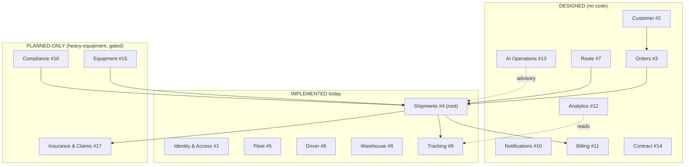
```mermaid
flowchart TB
  subgraph Built["IMPLEMENTED today"]
    IDN["Identity & Access #1"]
    SHP["Shipments #4 (root)"]
    FLT["Fleet #5"]
    DRV["Driver #6"]
    WHS["Warehouse #8"]
    TRK["Tracking #9"]
  end
  subgraph Designed["DESIGNED (no code)"]
    CUS["Customer #2"]
    ORD["Orders #3"]
    RTE["Route #7"]
    NOT["Notifications #10"]
    BIL["Billing #11"]
    ANL["Analytics #12"]
    AIO["AI Operations #13"]
    CON["Contract #14"]
  end
  subgraph Planned["PLANNED-ONLY (heavy-equipment, gated)"]
    EQP["Equipment #15"]
    CMP["Compliance #16"]
    INS["Insurance & Claims #17"]
  end
  ORD --> SHP
  CUS --> ORD
  SHP --> TRK
  SHP --> BIL
  RTE --> SHP
  EQP --> SHP
  CMP --> SHP
  SHP --> INS
  AIO -.->|advisory| SHP
  ANL -.->|reads| TRK
```

---

#### 1. Identity & Access — [IMPLEMENTED]
- **Purpose.** Authenticate principals and authorize commands; provision and isolate tenants. Generic auth mechanics; Supporting tenant/RBAC policy tailored to logistics (`docs/04` line 382).
- **Responsibilities.** JWT issue/rotate/revoke; role→permission resolution; tenant provisioning and the tenant scope injected into every request (`docs/05` line 374).
- **Owned Entities.** **User** (built, `app/models/user.py`); **Role**, **Permission** (today an enum `UserRole` {admin, manager, driver, client} + `app/auth/ROLE_PERMISSIONS`; aggregate form [DESIGNED]); **Tenant** ([DESIGNED], ADR-001 — no `tenant_id` on any table today, `docs/06` §8 "no RLS policy exists in any migration").
- **Owned Events.** `UserRegistered`, `UserActivated`, `UserDeactivated`, `RoleAssigned`, `RoleRevoked`, `PermissionGranted`, `PermissionRevoked`, `TenantProvisioned`, `TenantSuspended` (`docs/04` line 393). These are catalogued but not yet emitted (no event store).
- **External Dependencies.** Redis (token revocation, `app/auth/tokens.py`); Nafath National SSO appears in `context.mmd` as a planned integration (contradicts the email/password-only `sequence-driver-login.mmd`).

#### 2. Customer Management — [DESIGNED]
- **Purpose.** Own the commercial counterparty (shipper org) and its credit standing (`docs/04` §1.2, NEW).
- **Responsibilities.** Customer master data, credit-limit changes feeding Order approval.
- **Owned Entities.** **Customer** ([DESIGNED], `app/models/customer.py` PLANNED). Today no Customer entity — a "client" is a `client`-role **User** referenced as `Shipment.client_id` (`api/openapi.yaml` line 721; `docs/api-gap-analysis.md` line 29).
- **Owned Events.** `CustomerCreated`, `CustomerUpdated`, `CustomerDeactivated`, `CustomerCreditLimitChanged` (`docs/04` line 394).
- **External Dependencies.** Consumes `UserRegistered`, `TenantProvisioned` from Identity (`docs/04` line 394).

#### 3. Orders — [DESIGNED]
- **Purpose.** Single commercial request that fans out to one or more physical Shipments (`docs/04` §1.3, Core, NEW). "Today the Shipment doubles as the order" (`docs/04` §4.2).
- **Responsibilities.** Order intake/approval; Order→Shipment compensation saga.
- **Owned Entities.** **Order** (root), **OrderLine** (child). Both [DESIGNED] (`docs/04` line 395; `docs/05` line 239).
- **Owned Events.** `OrderCreated`, `OrderSubmitted`, `OrderApproved`, `OrderRejected`, `OrderCancelled`, `OrderFulfilmentStarted`, `OrderCompleted` (`docs/04` line 395). **Missing per audit:** `OrderFulfilmentFailed` (no partial-failure compensation event, `docs/06` §D.2).
- **External Dependencies.** Consumes `CustomerCreditLimitChanged`, `PriceQuoted`, `ShipmentDelivered`, `ShipmentCancelled` (`docs/04` line 395).
- **CRITICAL conflict (C-1, UNRESOLVED on disk).** `docs/04` §2.8 prose (line 567) forbids cancellation once `fulfilling`, but the Part 4 transition table (line 1268) and the §4.2.6 diagram allow `fulfilling → cancelled` with compensation. **No `OrderService` may be consolidated until this single edge is reconciled to ONE rule** (audit recommends: allow with compensating `ShipmentCancelled`).

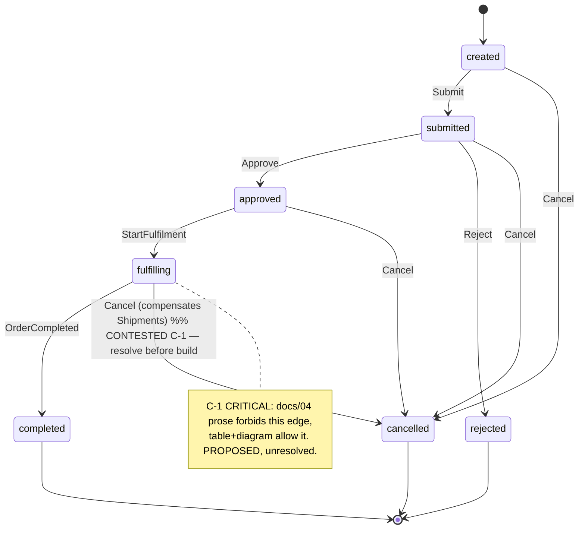
```mermaid
stateDiagram-v2
  [*] --> created
  created --> submitted: Submit
  submitted --> approved: Approve
  submitted --> rejected: Reject
  approved --> fulfilling: StartFulfilment
  fulfilling --> completed: OrderCompleted
  created --> cancelled: Cancel
  submitted --> cancelled: Cancel
  approved --> cancelled: Cancel
  fulfilling --> cancelled: Cancel (compensates Shipments) %% CONTESTED C-1 — resolve before build
  rejected --> [*]
  completed --> [*]
  cancelled --> [*]
  note right of fulfilling
    C-1 CRITICAL: docs/04 prose forbids this edge,
    table+diagram allow it. PROPOSED, unresolved.
  end note
```

#### 4. Shipments — [IMPLEMENTED]
- **Purpose.** The aggregate root and richest context: a physical movement origin→destination with a guarded 8-state lifecycle (`docs/04` §1.4; `domain-glossary.md` line 13).
- **Responsibilities.** Owns the 8-state transition map (`_is_transition_allowed`), driver/vehicle **exclusivity** (no two active shipments), warehouse capacity gating, and monotonic tracking.
- **Owned Entities.** **Shipment** (root); **Assignment** — modeled inconsistently (an "aggregate" in `docs/04` §2.7 vs "part of Shipment" in `docs/05` §4; as-built it is just `driver_id/vehicle_id/assigned_at` columns). **Consolidation ruling (W-4):** treat Assignment as a value/part of Shipment until a standalone lifecycle is needed.
- **Owned Events.** `ShipmentCreated`, `ShipmentMarkedReady`, `ShipmentAssigned`, `ShipmentPickedUp` (= `assigned→in_transit`, not a stored state), `ShipmentDelivered`, `ShipmentFailed`, `ShipmentReturned`, `ShipmentCancelled`. **Authoritative event-ownership rulings:** `ShipmentLocationReported` / `ProofOfDeliveryCaptured` / `ShipmentExceptionRaised` are **emitted by Tracking #9, not Shipments** (resolves the CRITICAL double-claim, `docs/04` lines 396 vs 401). `ShipmentDelayed` is an SLA **overlay** event (P9; written to `event_store` + `proj_sla_risk`, no tracking row). `ShipmentAssigned` is the authoritative assignment event; `DriverAssigned`/`VehicleAssigned`/`EquipmentAssigned`/`EscortAssigned` are downstream P4/P5 reactions (W-6).
- **External Dependencies.** Consumes `OrderApproved`, `DriverAssigned`, `VehicleAssigned`, `WarehouseCapacityThresholdReached`, `RouteOptimized`, `PredictionGenerated` (`docs/04` line 396). When heavy-equipment lands, the `assigned→in_transit` **guard set is extended** (not the graph) by Compliance #16 HARD gates: valid permit, route clearance, axle/GCW, escort, operator cert (`docs/08` lines 144–155).

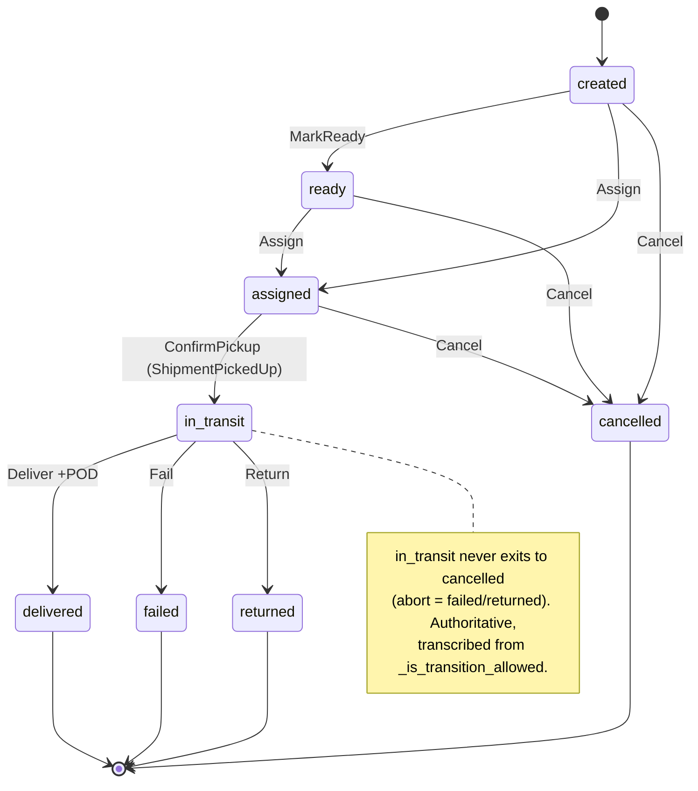
```mermaid
stateDiagram-v2
  [*] --> created
  created --> ready: MarkReady
  created --> assigned: Assign
  ready --> assigned: Assign
  assigned --> in_transit: ConfirmPickup (ShipmentPickedUp)
  in_transit --> delivered: Deliver +POD
  in_transit --> failed: Fail
  in_transit --> returned: Return
  created --> cancelled: Cancel
  ready --> cancelled: Cancel
  assigned --> cancelled: Cancel
  delivered --> [*]
  cancelled --> [*]
  returned --> [*]
  failed --> [*]
  note right of in_transit
    in_transit never exits to cancelled
    (abort = failed/returned). Authoritative,
    transcribed from _is_transition_allowed.
  end note
```

#### 5. Fleet Management — [IMPLEMENTED]
- **Purpose.** Own the transport asset (Vehicle) that performs the haul (`docs/04` §1.5; ADR-009 #1).
- **Responsibilities.** Vehicle registry, status lifecycle, assignment/release; capacity attributes (`capacity_weight_kg`, `capacity_volume_m3`).
- **Owned Entities.** **Vehicle** (built, `app/models/vehicle.py`). Stored status enum `active | maintenance | decommissioned` is authoritative; **transition guards are PROPOSED** — `vehicle-state-machine.mmd` header says "No transition guard exists in code yet" (W-3 reconciliation: enum authoritative, guards proposed). Capacity/eligibility guards currently live inline in `ShipmentService` (`docs/05` lines 304–306).
- **Owned Events.** `VehicleRegistered`, `VehicleAssigned`, `VehicleReleased`, `VehicleStatusChanged`, `VehicleMaintenanceStarted`, `VehicleMaintenanceCompleted`, `VehicleDecommissioned` (`docs/04` line 397). Note: `VehicleMaintenanceStarted/Completed` must stay distinct from Equipment's `EquipmentMaintenanceStarted/Completed`.
- **External Dependencies.** Consumes `ShipmentAssigned`, `ShipmentDelivered`, `ShipmentCancelled` (`docs/04` line 397).

#### 6. Driver Management — [IMPLEMENTED]
- **Purpose.** Operational profile for a driver-role user: availability, offers, accept/decline, daily stats (`docs/05` lines 266, 293, 319).
- **Responsibilities.** Phone login, availability toggle, offer accept/decline, eligibility (will consume OperatorCertification read-only).
- **Owned Entities.** **Driver** (built, `app/models/driver.py`; fields `license_*`, `home_warehouse_id`, `is_available`). **Driver status machine is PROPOSED** — no status enum in code, only `is_available: bool` + `user.is_active`; `assigned`/`busy` are derived from shipment phase (`docs/04` §4.3 line 1318).
- **Owned Events.** `DriverCreated`, `DriverWentOnline`, `DriverWentOffline`, `DriverAssigned`, `DriverStatusChanged`, `DriverSuspended`, `DriverReinstated` (`docs/04` line 398). `DriverWentOnline/Offline` are flagged not-yet-emitted (`docs/api-gap-analysis.md` line 14).
- **External Dependencies.** Consumes `ShipmentAssigned`, `ShipmentPickedUp`, `ShipmentDelivered`, `PredictionGenerated` (ranking), `UserDeactivated` (`docs/04` line 398). **Read-only consumer** of `OperatorCertification` from Compliance #16 — Compliance is the SOLE owner; Driver enforces an eligibility guard only (resolves dual-ownership W-finding, `docs/08` line 443).

#### 7. Route Management — [DESIGNED]
- **Purpose.** Plan, optimize, and execute multi-stop routes (`docs/04` §1.7, Core, NEW).
- **Responsibilities.** Route creation/planning/optimization; per-stop completion; consume compliance route validation.
- **Owned Entities.** **Route** (root), **RouteStop** (child sub-machine: `pending → completed | skipped`). Both [DESIGNED].
- **Owned Events.** `RouteCreated`, `RoutePlanned`, `RouteOptimized`, `RouteStarted`, `RouteStopCompleted`, `RouteCompleted`, `RouteCancelled` (`docs/04` line 399).
- **External Dependencies.** Consumes `ShipmentAssigned`, `ShipmentLocationReported`, `PredictionGenerated`, `WarehouseRegistered` (`docs/04` line 399); Maps/Routing provider (`context.mmd`); Compliance #16 `RouteValidated`/`RouteRestricted`.

#### 8. Warehouse Management — [IMPLEMENTED]
- **Purpose.** Own physical network nodes with geolocation and weight/volume/daily capacity (`domain-glossary.md` line 12).
- **Responsibilities.** Warehouse registry; receive/dispatch; HARD weight/volume capacity and soft `max_daily_shipments` enforcement (today inline in `ShipmentService`).
- **Owned Entities.** **Warehouse** (built, `app/models/warehouse.py`).
- **Owned Events.** `WarehouseRegistered`, `ShipmentReceivedAtWarehouse`, `ShipmentDispatchedFromWarehouse`, `WarehouseCapacityThresholdReached`, `WarehouseCapacityExceeded` (`docs/04` line 400). **Naming WARNING:** the two `Shipment*`-prefixed events have aggregate_type Warehouse — rename to `WarehouseShipmentReceived`/`WarehouseShipmentDispatched` so the `<Aggregate><PastTenseVerb>` convention and the outbox `aggregate_type` stamp are unambiguous. `WarehouseCapacityExceeded` should be a command-rejection signal (CapacityError), not a durable past-tense domain event.
- **External Dependencies.** Consumes `ShipmentCreated`, `ShipmentAssigned`, `ShipmentDelivered`, `ShipmentCancelled` (`docs/04` line 400).

#### 9. Tracking — [IMPLEMENTED]
- **Purpose.** Immutable, time-ordered per-shipment history — the user-facing slice of the event stream (`domain-glossary.md` line 17; ADR-007).
- **Responsibilities.** Append tracking rows with monotonic non-decreasing `event_time`; carry guarded `status_update`; never mutate/delete history.
- **Owned Entities.** **ShipmentTrackingEvent** (built, `app/models/shipment_tracking_event.py`). Event-type enum: `status_update`, `location_update`, `proof_of_delivery`, `exception` (`erd.mmd` line 85; `api/openapi.yaml` lines 537–539).
- **Owned Events.** **Authoritative producer of** `ShipmentLocationReported`, `ProofOfDeliveryCaptured`, `ShipmentExceptionRaised` (`docs/04` line 401) — these are removed from Shipments' "emitted" column to fix the CRITICAL double-claim.
- **External Dependencies.** Consumes `ShipmentAssigned`, `ShipmentPickedUp` (`docs/04` line 401). **Audit WARNING:** `event-catalog.md` lines 43–44 grant a cascade-delete carve-out on parent hard-delete — this contradicts BR-H-24 append-only immutability and ADR-007 "lossless audit" (app role has INSERT/SELECT only); the carve-out must be removed.

#### 10. Notifications — [DESIGNED]
- **Purpose.** Commodity multi-channel (push/SMS) messaging — Generic, "integrate, don't differentiate" (`docs/04` line 383).
- **Responsibilities.** Fan out push/SMS on assignment, delivery, exception, permit/cert alerts.
- **Owned Entities.** **Notification** ([DESIGNED], often integration-only, `docs/05` line 249).
- **Owned Events.** `NotificationRequestedIntegrationEvent` (one of only two integration events), `NotificationSent`, `NotificationFailed` (`docs/04` line 402, 407).
- **External Dependencies.** SMS/Push gateway (`context.mmd`); consumes `NotificationRequestedIntegrationEvent`.

#### 11. Billing — [DESIGNED]
- **Purpose.** Pricing, settlement, invoicing, driver payout — Supporting monetization (`docs/04` line 380). Named explicitly as a "new Billing context" the driver app's fare needs (`docs/api-gap-analysis.md` line 26).
- **Responsibilities.** Quote/price, invoice generation, payment capture, payout calculation, claim-settlement recovery from Insurance.
- **Owned Entities.** **Invoice**, **Settlement**, **Quote**, **Payout** ([DESIGNED], `app/models/billing.py` PLANNED).
- **Owned Events.** `PriceQuoted`, `SettlementRequestedIntegrationEvent` (the second integration event; trigger `ShipmentDelivered`/`ShipmentReturned`), `InvoiceGenerated`, `PaymentCaptured`, `DriverPayoutCalculated` (`docs/04` line 403). **Missing per audit:** `PaymentFailed` (`docs/06` §D.2).
- **External Dependencies.** Consumes `OrderSubmitted`, `SettlementRequestedIntegrationEvent`, `ShipmentDelivered`, `ShipmentReturned`; ERP/Billing external system (`context.mmd`). Note: `ShipmentReturned` carries two semantics (in_transit→returned transition vs post-delivery compensation) — settlement consumers need a payload discriminator (INFO finding).

#### 12. Analytics — [DESIGNED]
- **Purpose.** Decision-support read models / projections + KPIs over the canonical event stream (`docs/04` line 381; ADR-006).
- **Responsibilities.** Build/rebuild projections from the append-only log; serve control-tower views with "as of" timestamps (eventual consistency).
- **Owned Entities.** **Projection**, **KPI** read-models: `proj_active_shipments`, `proj_driver_status`, `proj_warehouse_load`, `proj_sla_risk`, `proj_driver_daily_stats` (ADR-006).
- **Owned Events.** `ProjectionRebuilt`, `KpiSnapshotComputed` (`docs/04` line 404).
- **External Dependencies.** Consumes all domain events (write-side). **Tenant-boundary WARNING:** ADR-006 defines the five `proj_*` tables with **no `tenant_id` column and no RLS statement**, yet ADR-001 mandates tenant_id on every aggregate root and `docs/08` requires every new table tenant-scoped + RLS. Builders must `SET LOCAL` the tenant GUC per event and the cross-tenant isolation test (M1) must cover projection reads. ADR-006 also cites source events by informal names (`Assigned`, `assignment`) that must be normalized to canonical `event_type` literals.

#### 13. AI Operations — [DESIGNED]
- **Purpose.** Predictive intelligence (ETA, SLA-breach risk, dynamic pricing, assignment ranking, anomaly/fraud) over the event log as a training stream (`docs/04` Part 8; `docs/03` §9). Core/strategic, NEW.
- **Responsibilities.** Request/serve predictions; record feedback; raise anomalies. **Substrate is design-complete** (pgvector/HNSW embeddings, point-in-time `ml_features_shipment`, `ml_predictions` with `actual_outcome` feedback, RAG corpus) but **nothing is built**; serving runtime deferred to ADR-010 (M8).
- **Owned Entities.** **Prediction**, **Embedding**, **Feature** ([DESIGNED], `app/models/ai_*.py` PLANNED).
- **Owned Events.** `PredictionRequested`, `PredictionGenerated`, `ModelFeedbackRecorded`, `AnomalyDetected` (`docs/04` line 405).
- **External Dependencies.** Consumes `ShipmentLocationReported`, `ShipmentPickedUp`, `ShipmentDelivered`, `RoutePlanned`, `WarehouseCapacityThresholdReached`; ML Runtime / Feature Store / model registry. **All predictions are advisory (human-in-the-loop)**; the AI↔Equipment relationship must be acyclic — Equipment→AI is event flow, AI→Equipment is advisory-only with no build/runtime dependency (circular-ref WARNING, `docs/08` lines 416/434).

#### 14. Contract Management — [DESIGNED]
- **Purpose.** Commercial agreements: rental contracts, pricing rules, SLAs, penalties, carrier agreements (`docs/06` §E.2, NEW; Core for SLA/pricing).
- **Responsibilities.** Contract lifecycle; pricing-rule and penalty definition; SLA definition feeding billing.
- **Owned Entities.** **RentalContract**, **PricingRule**, **SLA**, **Penalty**, **CarrierAgreement** ([DESIGNED], `docs/08` line 445). After the #17 carve-out, Contract retains contracts/pricing/SLA/penalties/carrier & rental agreements; **InsurancePolicy/Claim move OUT to #17** — `docs/06` §E.2 must be updated so it no longer lists them here.
- **Owned Events.** `ContractCreated`, `ContractActivated`, `ContractAmended`, `ContractExpired`, `PricingRuleDefined`, `PricingRuleChanged`, `SLADefined`, `SLABreached`, `SLAPenaltyApplied`, `CarrierAgreementSigned`, `CarrierAgreementTerminated`, `RentalContractStarted`, `RentalContractClosed` (`docs/06` Phase D).
- **External Dependencies.** Feeds Billing (pricing/penalties); links Equipment (rental unit ↔ hire terms) and Insurance (policy attached to contract).

#### 15. Equipment & Asset (Equipment Management) — [PLANNED-ONLY]
- **Purpose.** Own the physical heavy asset that is the *subject* of an order — catalog, taxonomy, specs, dimensions, weight, transport requirements, condition, lifecycle (`docs/08` Part 1; ADR-008 #1). **Equipment ≠ Vehicle (ADR-009): Vehicle hauls; Equipment is the subject; linked by id, never merged.**
- **Responsibilities.** Equipment registry/onboarding; reservation; availability; lifecycle reacting to Shipment events; inspection/maintenance/decommission; oversize classification driving Compliance.
- **Owned Entities.** **Equipment** (root), **EquipmentModel** (catalog/spec template), **EquipmentCategory** (taxonomy). `OperatorCertification` is referenced read-only but **owned by Compliance #16**. No standalone Inspection or Operator aggregate (`docs/08` lines 48–51, 441).
- **Owned Events.** `EquipmentReserved`, `EquipmentReservationReleased`, `EquipmentAssigned`, `EquipmentInTransit` (on `ShipmentPickedUp`), `EquipmentDelivered` (on `ShipmentDelivered`), `EquipmentReturned`, `EquipmentInspected`, `EquipmentMaintenanceStarted/Completed`, `EquipmentDecommissioned` (`docs/08` Part 7). **Naming fixes required:** add the uncatalogued `EquipmentOnboarded` (entry to `Available`); spell maintenance events fully prefixed in both diagram and catalog (vs bare `MaintenanceStarted`); rename `EquipmentInTransit` to a past-tense form (e.g. `EquipmentDispatched`) — it is an adjectival state-name violating the convention.
- **External Dependencies.** Reacts to Shipment events (ADR-009: Shipment is cause, Equipment reaction is one-way); feeds Orders (availability/specs), Contract (rental terms), AI Ops, Analytics (`proj_equipment_availability`). **Gating note:** all events are inert until M2 (event store + outbox) ships; no #15 handler may be built before the backbone.

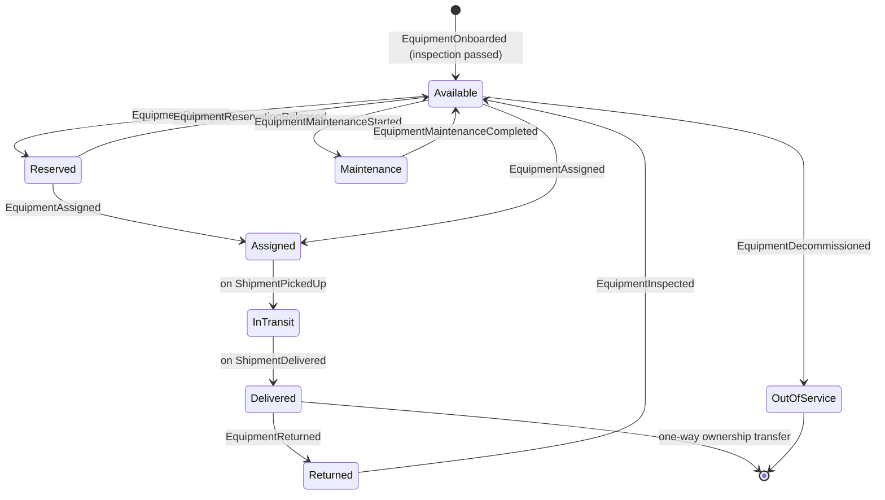
```mermaid
stateDiagram-v2
  [*] --> Available: EquipmentOnboarded (inspection passed)
  Available --> Reserved: EquipmentReserved
  Reserved --> Available: EquipmentReservationReleased
  Reserved --> Assigned: EquipmentAssigned
  Available --> Assigned: EquipmentAssigned
  Assigned --> InTransit: on ShipmentPickedUp
  InTransit --> Delivered: on ShipmentDelivered
  Delivered --> Returned: EquipmentReturned
  Returned --> Available: EquipmentInspected
  Delivered --> [*]: one-way ownership transfer
  Available --> Maintenance: EquipmentMaintenanceStarted
  Maintenance --> Available: EquipmentMaintenanceCompleted
  Available --> OutOfService: EquipmentDecommissioned
  OutOfService --> [*]
```

#### 16. Compliance & Permits (Compliance Management) — [PLANNED-ONLY]
- **Purpose.** Own permit lifecycle, axle-weight profiles, route restrictions, escort planning, and a compliance rule engine whose **Hard rules gate movement** (`docs/08` Part 2; ADR-008 #2).
- **Responsibilities.** Permit request/approval; route validation; escort assignment; operator-cert validity sweeps; **HARD dispatch gate on `assigned → in_transit`** (no dispatch without a valid approved/active permit covering the movement — `docs/08` line 144).
- **Owned Entities.** **Permit**, **AxleWeightProfile**, **RouteRestriction**, **Escort**, **ComplianceRule** (+ ComplianceCheck result), **OperatorCertification** (SOLE owner — Driver #6 consumes read-only). All [PLANNED] (`docs/08` line 442).
- **Owned Events.** `PermitRequested`, `PermitApproved`, `PermitRejected`, `PermitExpiring`/`PermitExpired`/`PermitRevoked`, `EscortAssigned`, `RouteValidated`, `RouteRestricted`, `OperatorCertExpiring`/`OperatorCertExpired` (`docs/08` Part 7).
- **External Dependencies.** Permit-authority ACL (jurisdiction data sourcing deferred); gates Shipments dispatch; feeds Route #7, Driver #6 eligibility, AI Ops (permit-delay/route-risk), Notifications. Gated behind M2.

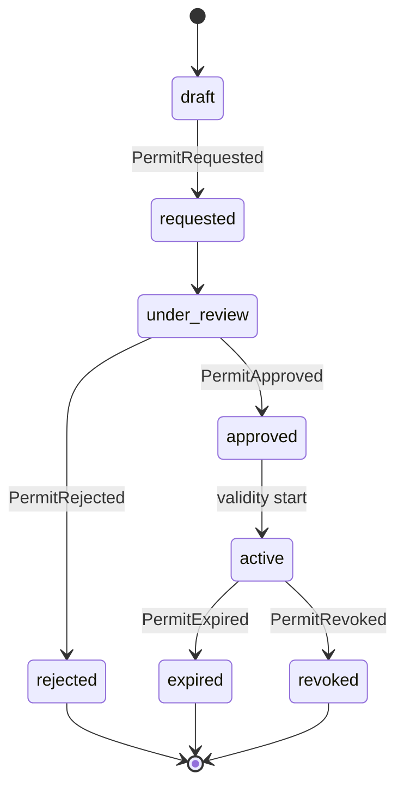
```mermaid
stateDiagram-v2
  [*] --> draft
  draft --> requested: PermitRequested
  requested --> under_review
  under_review --> approved: PermitApproved
  under_review --> rejected: PermitRejected
  approved --> active: validity start
  active --> expired: PermitExpired
  active --> revoked: PermitRevoked
  rejected --> [*]
  expired --> [*]
  revoked --> [*]
```

#### 17. Insurance & Claims — [PLANNED-ONLY]
- **Purpose.** Own policies, coverage rules, claims workflow, damage reporting, and liability tracking — **carved out of Contract Management #14** (`docs/08` Part 5, lines 20–21; ADR-008 #3).
- **Responsibilities.** FNOL→assessment→settlement claims flow; coverage matching; liability/at-fault tracking feeding carrier/driver scorecards and penalties.
- **Owned Entities.** **InsurancePolicy**, **CoverageRule**, **Claim** (root of the claim workflow), **DamageReport**, **LiabilityRecord** (`docs/08` line 444). All [PLANNED].
- **Owned Events.** `DamageReported`, `ClaimCreated`, `ClaimAssessed`, `ClaimApproved`, `ClaimRejected`/`ClaimSettled`/`ClaimReopened` (`docs/08` Part 7).
- **External Dependencies.** Insurer ACL; consumes Shipment exceptions/failures (FNOL) and Equipment insured-asset refs; feeds Billing (settlement/recovery), Analytics (loss events), Notifications. **Scope conflict to resolve:** `docs/07` R-12 and milestone M5 fold Insurance/Claims back under Contract #14 + Billing, contradicting `docs/08`'s carve-out — the canonical inventory must state #17 stays a **distinct context, merely co-scheduled**, not re-merged.

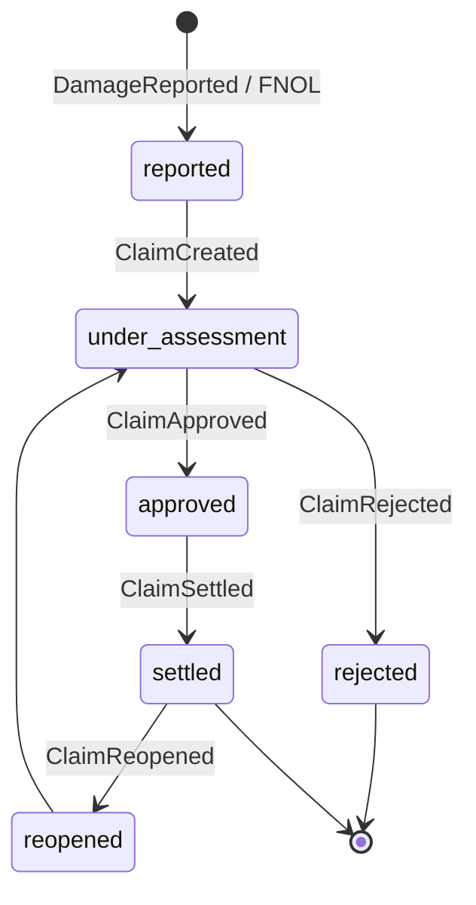
```mermaid
stateDiagram-v2
  [*] --> reported: DamageReported / FNOL
  reported --> under_assessment: ClaimCreated
  under_assessment --> approved: ClaimApproved
  under_assessment --> rejected: ClaimRejected
  approved --> settled: ClaimSettled
  settled --> reopened: ClaimReopened
  reopened --> under_assessment
  rejected --> [*]
  settled --> [*]
```

---

#### Cross-Context Notes Affecting the Consolidated Model

- **No context is genuinely [ABSENT].** The Phase-6 brief's framing ("17 contexts… MANY OF THESE MAY NOT EXIST", listing Permit/Claim as contexts) mis-describes the corpus: Permit and Claim are **aggregates inside #16/#17**, not contexts; Order/Contract/Insurance are aggregates whose owning contexts are designed. The correct status of every non-built named context is **[DESIGNED] / [PLANNED-ONLY]**, not absent.
- **Hard build ordering (`docs/07` critical path).** M1 (tenancy: `tenant_id` + RLS + isolation test) and M2 (event store + outbox + `processed_events`) are serial prerequisites for everything — all [DESIGNED]/[PLANNED-ONLY] event behavior above is inert until M2. "No new aggregate table is created before `tenant_id` + RLS exist."
- **One canonical event catalog.** Consolidate onto `docs/04` Part 3 (+ `docs/06` Phase D, `docs/08` Part 7). `event-catalog.md` is stale (Shipment+Fleet slice only, pre-ADR-007 persistence claim) and must carry a supersede banner (W-2).
- **One owner per event / one `aggregate_type` per envelope.** Apply the rulings above: Tracking owns the three location/POD/exception events; Shipments owns `ShipmentAssigned` as authoritative assignment; Warehouse movement events get a Warehouse prefix; Equipment events are fully prefixed and one-way reactions to Shipment events.

---

## 4. Aggregate Root Review & Ownership Matrix

### Aggregate Root Review

This review enumerates **only** aggregate roots that an actual document declares. The single authoritative root-vs-entity table is `docs/05-backend-architecture.md` §4 (lines 233–250), titled "Aggregate (root)", which states each aggregate has "exactly **one owning context** and **one owning module**" (line 229). The heavy-equipment roots are declared in `docs/08-heavy-equipment-domain-design.md` Parts 1–7 (lines 48–51, 109–110, 227–229). Where a brief-expected aggregate (Order, Contract, Permit, Claim) appears in the corpus, its status is recorded faithfully — none of them is genuinely absent from *every* document, but several are PLANNED (designed-not-built) rather than fully realized. Each entry below is graded by its documented build status: **EXISTS** (implemented in `app/models/*`), **PLANNED** (designed, not built), or **ABSENT** (no design found).

> **Scope note (verified).** The corpus describes **17 contexts** once heavy-equipment lands: 13 base contexts (`docs/04` §1, lines 393–405) + Contract Management #14 (`docs/06` §E.2) + Equipment #15 / Compliance & Permits #16 / Insurance & Claims #17 (`docs/08` line 391). Of the brief's named items, **Permit** and **Claim** are *aggregates inside* contexts #16/#17 (`docs/08` lines 109, 227) — not standalone contexts — and **Order** / **Contract** are PLANNED aggregates, not ABSENT. The only genuinely never-modelled concepts are equipment-unrelated fabrications.

---

#### Root 1 — `Shipment` (EXISTS — authoritative)

The richest aggregate and the only one whose lifecycle is enforced in code today.

- **Owning context:** Shipments (#4) — `docs/05` §4 line 240; `docs/04` line 396.
- **Status:** EXISTS. Source: `app/models/shipment.py` (`docs/05` line 240); glossary line 13 "Shipment (شحنة) | Aggregate root".
- **Responsibilities:** Owns the canonical **8-state transition map** and assignment exclusivity (`docs/05` lines 252–254: "`Shipment` owns the 8-state transition map + assignment exclusivity"). Enforces HARD guards on assignment/dispatch: driver/vehicle exclusivity over ACTIVE shipments, vehicle `status==active`, driver `is_available`, weight/volume ≤ vehicle capacity, origin+destination warehouse capacity, monotonic tracking `event_time`, `reference_code` unique per tenant (`docs/04` §4.1.4 lines 1183–1192). Cross-aggregate invariants (warehouse capacity summed over many shipments) live in the owning **service**, not the model (`docs/05` lines 253–254).
- **Owned entities / value parts:** **Assignment** — modelled as part of the Shipment aggregate (`Shipment (+ assignment)`, `docs/05` line 240); as-built it exists only as Shipment columns `driver_id` / `vehicle_id` / `assigned_at` (glossary line 15). *Note the cross-doc conflict:* `docs/04` §5 (line 396) lists `Assignment` as a separate *owned aggregate* of Shipments; `docs/06` W-4 resolves this by keeping Assignment as a value/part of Shipment until a standalone lifecycle is needed — that resolution is followed here.
- **Lifecycle (8-state, authoritative; from `shipment_service.py::_is_transition_allowed`, `docs/04` §4.1):**

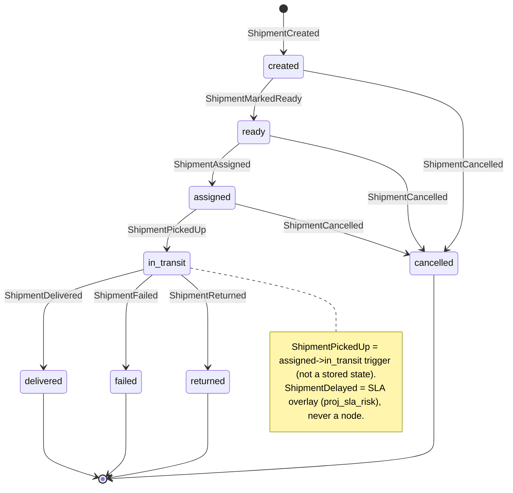
```mermaid
stateDiagram-v2
    [*] --> created : ShipmentCreated
    created --> ready : ShipmentMarkedReady
    created --> cancelled : ShipmentCancelled
    ready --> assigned : ShipmentAssigned
    ready --> cancelled : ShipmentCancelled
    assigned --> in_transit : ShipmentPickedUp
    assigned --> cancelled : ShipmentCancelled
    in_transit --> delivered : ShipmentDelivered
    in_transit --> failed : ShipmentFailed
    in_transit --> returned : ShipmentReturned
    delivered --> [*]
    cancelled --> [*]
    returned --> [*]
    failed --> [*]
    note right of in_transit
      ShipmentPickedUp = assigned->in_transit trigger (not a stored state).
      ShipmentDelayed = SLA overlay (proj_sla_risk), never a node.
    end note
```

  - States: `created`, `ready`, `assigned`, `in_transit`, `delivered` (terminal), `cancelled` (terminal), `returned` (terminal), `failed` (terminal). `ACTIVE_STATUSES = {created, ready, assigned, in_transit}` (`docs/04` line 1148).
  - `in_transit -> cancelled` is **forbidden** — mid-transit abort is `failed`/`returned` (`docs/04` line 1178). A post-delivery return is a *new compensating* `ShipmentReturned` flow, not a state edit (`docs/04` line 1171).
- **Events produced** (`docs/04` line 396; `event-catalog.md` lines 15–25): `ShipmentCreated`, `ShipmentMarkedReady`, `ShipmentAssigned`, `ShipmentPickedUp`, `ShipmentDelivered`, `ShipmentFailed`, `ShipmentReturned`, `ShipmentCancelled`, `ShipmentDelayed` (SLA overlay — **not in `event-catalog.md`**, see conflict note). **`ShipmentLocationReported` / `ProofOfDeliveryCaptured` / `ShipmentExceptionRaised` are produced by Tracking #9, not Shipments** (CF2 resolution — aligns with the Domain Model, Event Map, and Integration sections).
- **Events consumed** (`docs/04` line 396): `OrderApproved`, `DriverAssigned`, `VehicleAssigned`, `WarehouseCapacityThresholdReached`, `RouteOptimized`, `PredictionGenerated`, plus heavy-equipment gating events `PermitApproved` / `EscortAssigned` / `RouteValidated` (`docs/08` lines 349, 352, 353 — these extend the `assigned → in_transit` guard set, `docs/08` lines 144, 153–155).

> **Conflict to respect (CRITICAL):** `ShipmentLocationReported`, `ProofOfDeliveryCaptured`, and `ShipmentExceptionRaised` are listed as *emitted* by **both** Shipments (`docs/04` lines 396, 486) and Tracking (`docs/04` line 401); `event-catalog.md` files all three under "Shipment context". A single owning context must be chosen so `aggregate_type` is unambiguous in the outbox envelope. Resolved here (CF2): produced by the **Tracking** aggregate (`ShipmentTrackingEvent`); Shipments consumes them — aligning this section with the Domain Model, Event Map, and Integration sections.

---

#### Root 2 — `ShipmentTrackingEvent` (EXISTS — append-only)

- **Owning context:** Tracking (#9) — `docs/05` §4 line 245; `docs/04` line 401.
- **Status:** EXISTS, append-only. Source: `app/models/shipment_tracking_event.py` (`docs/05` line 245; glossary line 17).
- **Responsibilities:** Immutable, time-ordered record on a shipment; enforces **monotonic non-decreasing `event_time`** per shipment and can carry a *guarded* `status_update` that must obey the Shipment transition map (`docs/04` line 1164; glossary line 17). Event types (the only four): `status_update`, `location_update`, `proof_of_delivery`, `exception` (`api/openapi.yaml` lines 537–539; glossary line 17).
- **Owned entities:** none documented (it is the per-shipment append-only history slice; `ADR-007` calls it "the user-facing tracking slice" of the unified `event_store`).
- **Lifecycle:** none — append-only; "reversals are *new* events; history is never mutated/deleted" (`event-catalog.md` lines 43–44). *Note:* `event-catalog.md`'s cascade-delete carve-out (delete on parent hard-delete) **conflicts** with the strict append-only / lossless-audit guarantee in `docs/04` BR-H-24 and `ADR-007` (app role INSERT/SELECT-only) — flagged, not adopted.
- **Events produced** (`docs/04` line 401): `ShipmentLocationReported`, `ProofOfDeliveryCaptured`, `ShipmentExceptionRaised` (+ carries guarded `status_update`). *(See the producer-ownership conflict above.)*
- **Events consumed** (`docs/04` line 401): `ShipmentAssigned`, `ShipmentPickedUp`.

---

#### Root 3 — `Vehicle` (EXISTS — enum authoritative, transition guards PROPOSED)

- **Owning context:** Fleet Management (#5) — `docs/05` §4 line 241; `docs/04` line 397.
- **Status:** EXISTS as a model. Source: `app/models/vehicle.py` (`docs/05` line 241; glossary line 11).
- **Responsibilities:** Transport asset carrying `plate_number`, `vin`, capacity (`capacity_weight_kg`, `capacity_volume_m3`), and `status`; **only `active` is assignable** (glossary line 11). Today the assignability guard is enforced inline in `ShipmentService`, not in a Fleet service (`docs/05` lines 304–306).
- **Owned entities:** none documented.
- **Lifecycle:** stored status enum `active`, `maintenance`, `decommissioned` (`api/openapi.yaml` lines 535–536). **Authority caveat (verified conflict):** the `vehicle-state-machine.mmd` header says "No transition guard exists in code yet; this is the PROPOSED machine" while `docs/04` §4.4 labels it "EXISTS — AUTHORITATIVE". Reconciled per `docs/06` W-3: the **enum is authoritative; the transition guards are PROPOSED**.

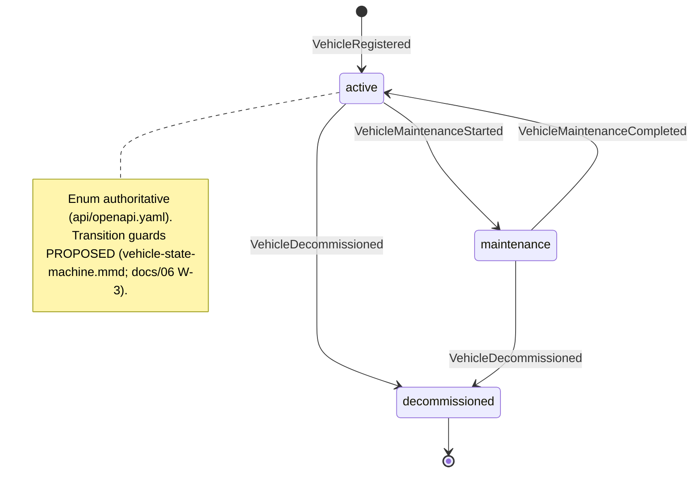
```mermaid
stateDiagram-v2
    [*] --> active : VehicleRegistered
    active --> maintenance : VehicleMaintenanceStarted
    maintenance --> active : VehicleMaintenanceCompleted
    active --> decommissioned : VehicleDecommissioned
    maintenance --> decommissioned : VehicleDecommissioned
    decommissioned --> [*]
    note right of active
      Enum authoritative (api/openapi.yaml).
      Transition guards PROPOSED (vehicle-state-machine.mmd; docs/06 W-3).
    end note
```

- **Events produced** (`docs/04` line 397): `VehicleRegistered`, `VehicleAssigned`, `VehicleReleased`, `VehicleStatusChanged`, `VehicleMaintenanceStarted`, `VehicleMaintenanceCompleted`, `VehicleDecommissioned`.
- **Events consumed** (`docs/04` line 397): `ShipmentAssigned`, `ShipmentDelivered`, `ShipmentCancelled`. (`VehicleAssigned`/`VehicleReleased` are downstream P5 reactions to `ShipmentAssigned`/terminal; `ShipmentAssigned` is authoritative per `docs/06` W-6.)

---

#### Root 4 — `Driver` (EXISTS — aggregate; status machine PROPOSED)

- **Owning context:** Driver Management (#6) — `docs/05` §4 line 242; `docs/04` line 398.
- **Status:** EXISTS as a model. Source: `app/models/driver.py` (`docs/05` line 242; glossary line 10).
- **Responsibilities:** Operational profile for a `driver`-role user; carries `license_number`, `license_class`, `phone_number`, `is_available`, `home_warehouse_id` (`api/openapi.yaml` lines 568–580; glossary line 10). Owns availability + offer accept/decline + daily-stats behavior in `DriverService` (`docs/05` line 266).
- **Owned entities:** none documented (1:1 with a `role=driver` `User`).
- **Lifecycle:** **PROPOSED** — "there is no driver status enum in code today (only `is_available: bool` + `user.is_active`)" (`docs/04` §4.3 line 1318). `assigned`/`busy` states are *derived* from the shipment phase, not stored. Reconciled per `docs/06` W-3 (paper-only transitions). No authoritative transition diagram is drawn in code.
- **Events produced** (`docs/04` line 398): `DriverCreated`, `DriverWentOnline`, `DriverWentOffline`, `DriverAssigned`, `DriverStatusChanged`, `DriverSuspended`, `DriverReinstated`. *(`DriverWentOnline`/`Offline` are PLANNED per `api-gap-analysis.md` line 14.)*
- **Events consumed** (`docs/04` line 398): `ShipmentAssigned`, `ShipmentPickedUp`, `ShipmentDelivered`, `PredictionGenerated` (ranking), `UserDeactivated`.

---

#### Root 5 — `Warehouse` (EXISTS)

- **Owning context:** Warehouse Management (#8) — `docs/05` §4 line 244; `docs/04` line 400.
- **Status:** EXISTS as a model. Source: `app/models/warehouse.py` (`docs/05` line 244; glossary line 12).
- **Responsibilities:** Physical network node with geolocation + weight/volume capacity + `max_daily_shipments` (glossary line 12). Capacity is enforced as a HARD invariant **across many shipments** in the owning service (`docs/04` line 1189; `docs/05` lines 253–254); `max_daily_shipments` is a soft throughput target (`docs/04` line 1196).
- **Owned entities:** none documented.
- **Lifecycle:** no lifecycle state machine documented (registration-only; status enum not modelled in the focus files).
- **Events produced** (`docs/04` line 400): `WarehouseRegistered`, `ShipmentReceivedAtWarehouse`, `ShipmentDispatchedFromWarehouse`, `WarehouseCapacityThresholdReached`, `WarehouseCapacityExceeded`. *(Naming conflict, `docs/06`-class: the two `Shipment*`-prefixed events are owned by Warehouse, violating `<Aggregate><PastTenseVerb>`; and `WarehouseCapacityExceeded` is a rejected-command pseudo-event, not a committed fact — `docs/04` lines 490, 507.)*
- **Events consumed** (`docs/04` line 400): `ShipmentCreated`, `ShipmentAssigned`, `ShipmentDelivered`, `ShipmentCancelled`.

---

#### Root 6 — `User` (EXISTS) and `Tenant`, `Role`/`Permission` (PLANNED)

- **Owning context:** Identity & Access (#1) — `docs/05` §4 lines 235–237; `docs/04` line 393.
- **Status:** `User` **EXISTS** (`app/models/user.py`, `docs/05` line 235; glossary line 8). `Tenant` **PLANNED** (`app/models/tenant.py`, ADR-001 — `docs/05` line 236; "Isolation boundary (`tenant_id`), planned per ADR-001", glossary line 22). `Role`/`Permission` **PLANNED** (today a `UserRole` enum + `app/auth`, `docs/05` line 237).
- **Responsibilities:** `User` = authenticated account with exactly one `role` ∈ {`admin`, `manager`, `driver`, `client`} (glossary lines 8–9; `api/openapi.yaml` lines 528–530). Tenant (when built) provisions/suspends tenants and injects `tenant_id` scope (`docs/04` §1.1).
- **Owned entities:** `Order`'s `OrderLine` and `Route`'s `RouteStop` belong to *other* roots; Identity declares no child entities beyond the planned `Role`/`Permission` roots.
- **Lifecycle:** no enumerated state machine in the focus files (user is governed by `is_active`; `UserDeactivated` event exists, `docs/04` line 393).
- **Events produced** (`docs/04` line 393): `UserRegistered`, `UserActivated`, `UserDeactivated`, `RoleAssigned`, `RoleRevoked`, `PermissionGranted`, `PermissionRevoked`, `TenantProvisioned`, `TenantSuspended`.
- **Events consumed** (`docs/04` line 393): none.

---

#### Root 7 — `Equipment` (PLANNED — heavy-equipment; designed, not built)

The marquee heavy-equipment root. **`Equipment ≠ Vehicle`** (ADR-009): a Vehicle *hauls*; an Equipment unit is the *subject* of the order (`docs/08` line 22).

- **Owning context:** Equipment & Asset (#15) — `docs/08` Part 1 lines 42–51; ownership table line 441.
- **Status:** PLANNED (ADR-008/009; `docs/08` line 441 "PLANNED"; `docs/08` line 3 "Architecture documentation only. No code…").
- **Responsibilities:** Source of truth for *what the asset is* and *what moving it requires* — catalog, taxonomy, specs/dimensions/weight, transport requirements, condition, and the equipment lifecycle (`docs/08` lines 44–46). Derives a **point-in-time oversize classification** (`in_gauge`, `oversize_width/height/length`, `overweight`, `superload`) that drives Compliance #16 (`docs/08` lines 84–92).
- **Owned entities:** `EquipmentModel` (catalog/spec template) and `EquipmentCategory` (taxonomy) — `docs/08` lines 48–51. *(Reference tables are low-churn → UUIDv4 acceptable; the `Equipment` unit + its events follow the standard envelope.)* No standalone `Inspection` aggregate (inspection is the `EquipmentInspected` event + `Equipment` condition fields); no standalone `Operator` aggregate (operator identity lives in Driver #6).
- **Lifecycle (NEW, complementary to — not replacing — the Shipment machine; `docs/08` §6.1):**

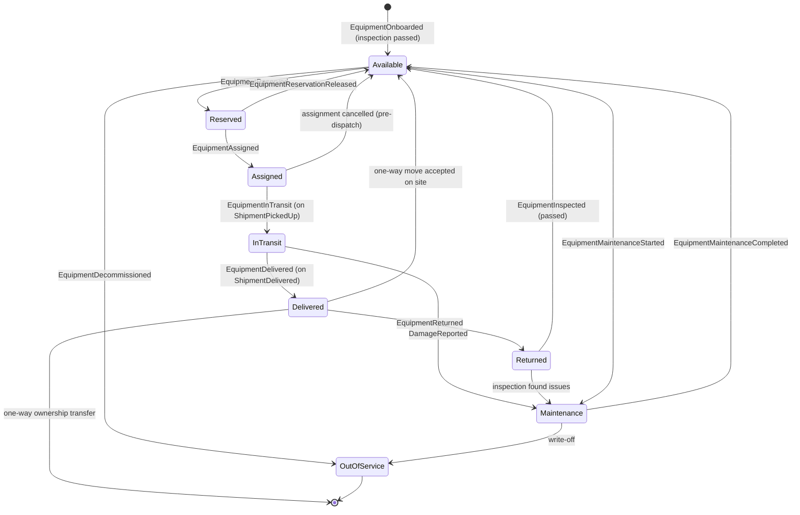
```mermaid
stateDiagram-v2
    [*] --> Available : EquipmentOnboarded (inspection passed)
    Available --> Reserved : EquipmentReserved
    Reserved --> Available : EquipmentReservationReleased
    Reserved --> Assigned : EquipmentAssigned
    Assigned --> InTransit : EquipmentInTransit (on ShipmentPickedUp)
    Assigned --> Available : assignment cancelled (pre-dispatch)
    InTransit --> Delivered : EquipmentDelivered (on ShipmentDelivered)
    InTransit --> Maintenance : DamageReported
    Delivered --> Returned : EquipmentReturned
    Delivered --> Available : one-way move accepted on site
    Returned --> Available : EquipmentInspected (passed)
    Returned --> Maintenance : inspection found issues
    Available --> Maintenance : EquipmentMaintenanceStarted
    Maintenance --> Available : EquipmentMaintenanceCompleted
    Available --> OutOfService : EquipmentDecommissioned
    Maintenance --> OutOfService : write-off
    Delivered --> [*] : one-way ownership transfer
    OutOfService --> [*]
```

  - `OutOfService` is the only terminal state (permanent decommission/write-off); `Maintenance` is temporary; `Returned`/`Delivered` are cycle states (`docs/08` lines 263–264, 302–305).
- **Events produced** (`docs/08` Part 7 lines 339–347): `EquipmentReserved`, `EquipmentReservationReleased`, `EquipmentAssigned`, `EquipmentInTransit`, `EquipmentDelivered`, `EquipmentReturned`, `EquipmentInspected`, `EquipmentMaintenanceStarted`/`…Completed`, `EquipmentDecommissioned`. *(Catalog gaps to respect: `EquipmentOnboarded` is the entry transition (line 270) but has **no Part 7 row**; `EquipmentInTransit` violates `<Aggregate><PastTenseVerb>` — adjectival, not past tense.)*
- **Events consumed** (`docs/08` §6.1 lines 274–283, line 342–343): `ShipmentPickedUp` (→ `EquipmentInTransit`), `ShipmentDelivered` (→ `EquipmentDelivered`), `ShipmentAssigned` (→ `EquipmentAssigned`), `DamageReported`. Per ADR-009 the direction is one-way: Shipment events are the cause, Equipment events are the reaction.

> **Circular-reference caution:** the `docs/08` context map draws `Equipment #15 → AI Ops #13` (events) **and** `AI Ops #13 → Equipment #15` (predictions), forming a two-node cycle (lines 416, 434). Must be read as acyclic: data/events one way, *advisory* predictions the other (no build/runtime dependency).

---

#### Root 8 — `Permit` (PLANNED — heavy-equipment), plus Compliance siblings

- **Owning context:** Compliance & Permits (#16) — `docs/08` Part 2 lines 105–110; ownership table line 442.
- **Status:** PLANNED (`docs/08` line 442).
- **Responsibilities:** Owns the regulatory envelope; its **Hard rules gate movement** — no dispatch without a satisfied compliance check (`docs/08` lines 105–107, 144). Jurisdiction data is configurable, never hard-coded (`docs/08` lines 110–113).
- **Owned / sibling aggregates in #16:** `AxleWeightProfile`, `RouteRestriction` (shared with Part 4), `Escort`, `ComplianceRule` (+ `ComplianceCheck` result), and `OperatorCertification` (`docs/08` lines 109–110, 161–164). **`OperatorCertification` ownership conflict (verified):** `docs/08` line 443 assigns it "Compliance #16 (def) ↔ Driver #6 (eligibility)" — dual ownership. Resolution to respect: Compliance #16 is the **sole owner** (definition, status lifecycle, expiry sweep); Driver #6 consumes it read-only for an eligibility guard. (Note: `docs/08` line 443 still shows the dual-ownership `↔` on disk and must be edited to single-owner — mirroring how C-1 is flagged as unresolved on disk.)
- **Lifecycle (Permit, `docs/08` §2.1 / §6.3):**

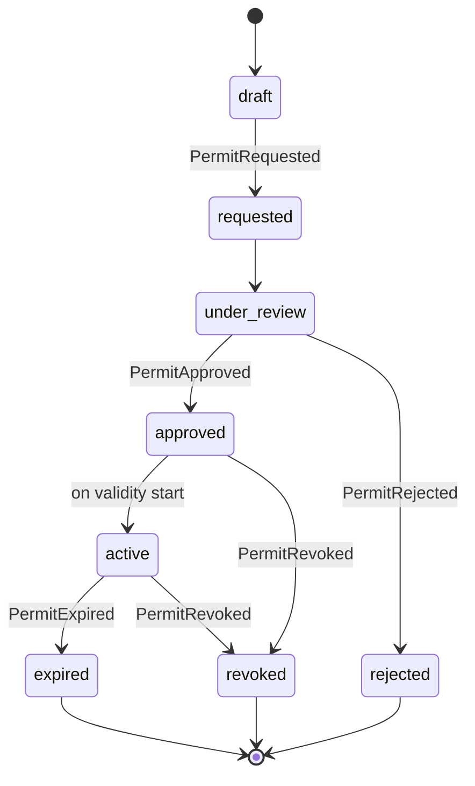
```mermaid
stateDiagram-v2
    [*] --> draft
    draft --> requested : PermitRequested
    requested --> under_review
    under_review --> approved : PermitApproved
    under_review --> rejected : PermitRejected
    approved --> active : on validity start
    active --> expired : PermitExpired
    approved --> revoked : PermitRevoked
    active --> revoked : PermitRevoked
    rejected --> [*]
    expired --> [*]
    revoked --> [*]
```

  - `OperatorCertification` status lifecycle: `valid → expiring → expired`; `→ suspended` (`docs/08` §3.2 lines 177–184).
- **Events produced** (`docs/08` lines 348–355): `PermitRequested`, `PermitApproved`, `PermitRejected`, `PermitExpiring`/`PermitExpired`/`PermitRevoked`, `EscortAssigned` (producer `Escort`), `RouteValidated`/`RouteRestricted` (producer `ComplianceCheck`), `OperatorCertExpiring`/`OperatorCertExpired` (producer `OperatorCertification`).
- **Events consumed** (`docs/08` lines 341, 353): `EquipmentAssigned` (movement to validate); route/shipment movement references; oversize classification from Equipment #15.

---

#### Root 9 — `Claim` (PLANNED — heavy-equipment), plus Insurance siblings

- **Owning context:** Insurance & Claims (#17) — `docs/08` Part 5 lines 223–229; ownership table line 444. **Carved out of Contract Management #14** (#14 keeps contracts/pricing/SLA/penalties/carrier & rental agreements; #17 owns policies/claims — `docs/08` lines 20–21).
- **Status:** PLANNED (`docs/08` line 444). *(Inventory conflict to respect: `docs/07` R-12/M5 re-merges insurance/claims under #14+Billing, contradicting `docs/08`'s carve-out. `docs/06` §E.2 may still list `InsurancePolicy`/`Claim` under #14.)*
- **Responsibilities:** Owns policies, coverage rules, the claims workflow, damage reporting, and liability tracking (`docs/08` lines 223–225). `LiabilityRecord` feeds carrier/driver scorecards + penalties (`docs/08` §5.2 lines 248–249).
- **Owned / sibling aggregates in #17:** `InsurancePolicy`, `CoverageRule`, `DamageReport`, `LiabilityRecord` (`docs/08` lines 227–229, line 444).
- **Lifecycle (Claim, `docs/08` §5.2 / §6.3):**

```mermaid
stateDiagram-v2
    [*] --> reported : DamageReported / FNOL
    reported --> under_assessment : ClaimCreated
    under_assessment --> approved : ClaimApproved
    under_assessment --> rejected : ClaimRejected
    approved --> settled : ClaimSettled
    settled --> reopened : ClaimReopened
    reopened --> under_assessment
    rejected --> [*]
    settled --> [*]
```

- **Events produced** (`docs/08` lines 356–360): `DamageReported` (producer `DamageReport`), `ClaimCreated`, `ClaimAssessed`, `ClaimApproved`, `ClaimRejected`/`ClaimSettled`/`ClaimReopened`.
- **Events consumed** (`docs/08` lines 343–344, 356): `EquipmentDelivered`, `EquipmentReturned`, in-transit `DamageReported` signals (`docs/08` line 280).

---

#### Roots 10–14 — Other PLANNED roots (designed, internals out of scope where the focus files do not elaborate)

| Root | Context | Status | Source |
|---|---|---|---|
| `Order` (+ `OrderLine`) | Orders (#3) | PLANNED — "today `Shipment` doubles as order"; cancellation rule self-contradicts (`docs/06` C-1, **CRITICAL, unresolved**) | `docs/05` line 239; `docs/04` §4.2 |
| `Customer` | Customer Management (#2) | PLANNED | `docs/05` line 238; `docs/04` line 394 |
| `Route` (+ `RouteStop`) | Route Management (#7) | PLANNED | `docs/05` line 243; `docs/04` line 399 |
| `Invoice`/`Settlement`/`Quote`/`Payout` | Billing (#11) | PLANNED | `docs/05` line 248; `docs/04` line 403 |
| `Notification` | Notifications (#10) | PLANNED (often integration-only) | `docs/05` line 249; `docs/04` line 402 |
| `Contract` (+ `RentalContract`, `PricingRule`, `SLA`, `Penalty`, `CarrierAgreement`) | Contract Management (#14) | PLANNED | `docs/06` §E.2; `docs/08` line 445 |
| `Prediction`/`Embedding`/`Feature` | AI Operations (#13) | PLANNED | `docs/05` line 250; `docs/04` line 405 |
| `Projection`/`KPI` (read-models) | Analytics (#12) | PLANNED (read-side, not write aggregates) | `docs/05` line 247; `docs/04` line 404 |
| `EventStore` record | cross-cutting infra | PLANNED (ADR-007 outbox; not a domain aggregate) | `docs/05` line 246 |

> **`Order` cancellation conflict (CRITICAL, unresolved on disk):** `docs/04` §2.8 (line 567) says an Order is "not cancellable once fulfilling/completed", but `docs/04` Part 4 (line 1268) and the §4.2.6 diagram list `fulfilling → cancelled` as legal with compensation. The same edge is both forbidden and allowed — must be resolved before any `Order` modeling is consolidated.

---

#### Genuinely ABSENT items

Per the ground-truth rules, the only items to flag as **ABSENT / NOT-FOUND** are concepts the brief implied "may not exist" that have **no design anywhere** in the corpus. After reading the corpus, **every named context/aggregate the brief listed (Order, Contract, Permit, Claim, Compliance, Insurance, AI Operations) has a design** — they are PLANNED, not absent. No aggregate root in the corpus is truly undocumented. The brief's framing that these "MAY NOT EXIST" is therefore a **scope-correction**: classify them PLANNED, and note that **Permit** and **Claim** are *aggregates inside* contexts #16/#17, not standalone contexts.

---

### Aggregate Ownership Matrix

Events abbreviated; integration events suffixed `*IntegrationEvent`. "Consumed" lists key inbound events only (Analytics consumes the full stream).

| Aggregate (root) | Owning Context | Owned Entities | Events Produced | Events Consumed | Status |
|---|---|---|---|---|---|
| `Shipment` | Shipments (#4) | Assignment (value/part: `driver_id`, `vehicle_id`, `assigned_at`) | `ShipmentCreated`, `ShipmentMarkedReady`, `ShipmentAssigned`, `ShipmentPickedUp`, `ShipmentDelivered`, `ShipmentFailed`, `ShipmentReturned`, `ShipmentCancelled`, `ShipmentDelayed` (overlay) | `OrderApproved`, `DriverAssigned`, `VehicleAssigned`, `WarehouseCapacityThresholdReached`, `RouteOptimized`, `PredictionGenerated`, `PermitApproved`, `EscortAssigned`, `RouteValidated` | EXISTS (authoritative) |
| `ShipmentTrackingEvent` | Tracking (#9) | — | `ShipmentLocationReported`, `ProofOfDeliveryCaptured`, `ShipmentExceptionRaised` (+ guarded `status_update`) | `ShipmentAssigned`, `ShipmentPickedUp` | EXISTS (append-only) |
| `Vehicle` | Fleet Management (#5) | — | `VehicleRegistered`, `VehicleAssigned`, `VehicleReleased`, `VehicleStatusChanged`, `VehicleMaintenanceStarted`, `VehicleMaintenanceCompleted`, `VehicleDecommissioned` | `ShipmentAssigned`, `ShipmentDelivered`, `ShipmentCancelled` | EXISTS (enum authoritative; guards PROPOSED) |
| `Driver` | Driver Management (#6) | — (1:1 with `driver`-role `User`) | `DriverCreated`, `DriverWentOnline`, `DriverWentOffline`, `DriverAssigned`, `DriverStatusChanged`, `DriverSuspended`, `DriverReinstated` | `ShipmentAssigned`, `ShipmentPickedUp`, `ShipmentDelivered`, `PredictionGenerated`, `UserDeactivated`, `OperatorCertExpired` | EXISTS (status machine PROPOSED) |
| `Warehouse` | Warehouse Management (#8) | — | `WarehouseRegistered`, `ShipmentReceivedAtWarehouse`, `ShipmentDispatchedFromWarehouse`, `WarehouseCapacityThresholdReached`, `WarehouseCapacityExceeded` | `ShipmentCreated`, `ShipmentAssigned`, `ShipmentDelivered`, `ShipmentCancelled` | EXISTS |
| `User` | Identity & Access (#1) | — | `UserRegistered`, `UserActivated`, `UserDeactivated`, `RoleAssigned`, `RoleRevoked`, `PermissionGranted`, `PermissionRevoked` | — | EXISTS |
| `Tenant` | Identity & Access (#1) | — | `TenantProvisioned`, `TenantSuspended` | — | PLANNED (ADR-001) |
| `Role`, `Permission` | Identity & Access (#1) | — | `RoleAssigned`, `RoleRevoked`, `PermissionGranted`, `PermissionRevoked` | — | PLANNED (today `UserRole` enum) |
| `Equipment` | Equipment & Asset (#15) | `EquipmentModel`, `EquipmentCategory` | `EquipmentReserved`, `EquipmentReservationReleased`, `EquipmentAssigned`, `EquipmentInTransit`, `EquipmentDelivered`, `EquipmentReturned`, `EquipmentInspected`, `EquipmentMaintenanceStarted`/`…Completed`, `EquipmentDecommissioned` (+ `EquipmentOnboarded`, uncatalogued) | `ShipmentAssigned`, `ShipmentPickedUp`, `ShipmentDelivered`, `DamageReported` | PLANNED (ADR-008/009) |
| `Permit` | Compliance & Permits (#16) | `AxleWeightProfile`, `RouteRestriction`, `Escort`, `ComplianceRule` (+ `ComplianceCheck`), `OperatorCertification` | `PermitRequested`, `PermitApproved`, `PermitRejected`, `PermitExpiring`/`PermitExpired`/`PermitRevoked`, `EscortAssigned`, `RouteValidated`, `RouteRestricted`, `OperatorCertExpiring`/`OperatorCertExpired` | `EquipmentAssigned`, oversize classification (Equipment #15), route/shipment movement refs | PLANNED (ADR-008) |
| `Claim` | Insurance & Claims (#17) | `InsurancePolicy`, `CoverageRule`, `DamageReport`, `LiabilityRecord` | `DamageReported`, `ClaimCreated`, `ClaimAssessed`, `ClaimApproved`, `ClaimRejected`/`ClaimSettled`/`ClaimReopened` | `EquipmentDelivered`, `EquipmentReturned`, in-transit `DamageReported` | PLANNED (carved from #14; `docs/07` disputes) |
| `Order` (+ `OrderLine`) | Orders (#3) | `OrderLine` | `OrderCreated`, `OrderSubmitted`, `OrderApproved`, `OrderRejected`, `OrderCancelled`, `OrderFulfilmentStarted`, `OrderCompleted` (⚠ missing `OrderFulfilmentFailed`, docs/06 §D.2) | `CustomerCreditLimitChanged`, `PriceQuoted`, `ShipmentDelivered`, `ShipmentCancelled` | PLANNED (cancel rule self-conflicts, C-1) |
| `Customer` | Customer Management (#2) | — | `CustomerCreated`, `CustomerUpdated`, `CustomerDeactivated`, `CustomerCreditLimitChanged` | `UserRegistered`, `TenantProvisioned` | PLANNED |
| `Route` (+ `RouteStop`) | Route Management (#7) | `RouteStop` | `RouteCreated`, `RoutePlanned`, `RouteOptimized`, `RouteStarted`, `RouteStopCompleted`, `RouteCompleted`, `RouteCancelled` | `ShipmentAssigned`, `ShipmentLocationReported`, `PredictionGenerated`, `WarehouseRegistered` | PLANNED |
| `Invoice`/`Settlement`/`Quote`/`Payout` | Billing (#11) | — | `PriceQuoted`, `InvoiceGenerated`, `PaymentCaptured`, `DriverPayoutCalculated` (⚠ missing `PaymentFailed`, docs/06 §D.2) | `OrderSubmitted`, `SettlementRequestedIntegrationEvent`, `ShipmentDelivered`, `ShipmentReturned`, `ClaimApproved` | PLANNED |
| `Notification` | Notifications (#10) | — | `NotificationSent`, `NotificationFailed` | `NotificationRequestedIntegrationEvent` | PLANNED (often integration-only) |
| `Contract` (+ `RentalContract`, `PricingRule`, `SLA`, `Penalty`, `CarrierAgreement`) | Contract Management (#14) | `RentalContract`, `PricingRule`, `SLA`, `Penalty`, `CarrierAgreement` | `ContractCreated`, `ContractActivated`, `ContractAmended`, `ContractExpired`, `PricingRuleDefined`, `SLADefined`, `SLABreached`, `RentalContractStarted`/`Closed` (per `docs/06` §E.2) | `EquipmentReserved`, `EquipmentDelivered`, `EquipmentReturned` | PLANNED |
| `Prediction`/`Embedding`/`Feature` | AI Operations (#13) | — | `PredictionRequested`, `PredictionGenerated`, `ModelFeedbackRecorded`, `AnomalyDetected` | `ShipmentLocationReported`, `ShipmentPickedUp`, `ShipmentDelivered`, `RoutePlanned`, `WarehouseCapacityThresholdReached`, `EquipmentInTransit` | PLANNED |
| `Projection`/`KPI` (read-models) | Analytics (#12) | `proj_active_shipments`, `proj_driver_status`, `proj_warehouse_load`, `proj_sla_risk`, `proj_driver_daily_stats`, `proj_equipment_availability` | `ProjectionRebuilt`, `KpiSnapshotComputed` | All domain events (write-side) | PLANNED (read-side, not write aggregates) |
| `Order`/`Contract`/`Permit`/`Claim` as **standalone "absent" items** | — | — | — | — | NOT ABSENT — all designed (PLANNED); Permit & Claim are aggregates inside #16/#17, not contexts |

> **Matrix caveats (verified conflicts to carry forward):** (1) `Assignment` is treated as a value/part of `Shipment` (`docs/05`), overriding `docs/04` §5's listing of it as a separate aggregate (resolution per `docs/06` W-4). (2) `ShipmentLocationReported`/`ProofOfDeliveryCaptured`/`ShipmentExceptionRaised` are attributed to the **Tracking** aggregate (`ShipmentTrackingEvent`) to keep `aggregate_type` unambiguous; Shipments consumes them (CF2). (3) `DriverAssigned`/`VehicleAssigned`/`EquipmentAssigned`/`EscortAssigned` are P4/P5 *reactions*; `ShipmentAssigned` is authoritative (`docs/06` W-6). (4) All PLANNED heavy-equipment events are **inert until the event store + outbox (ADR-007, milestone M2) ships** — designed-not-built (`docs/06` §C.2; `docs/07` critical path).

---

## 5. Final Domain Event Map

### Source of Truth and Reconciliation Notes

This map treats `docs/event-catalog.md` as the **canonical catalog for the implemented Shipment + Fleet/Identity slice**, reconciled with the fuller inventory in `docs/04-event-storming-and-state-machines.md` Part 3 (lines 391–407) and the heavy-equipment additions in `docs/08-heavy-equipment-domain-design.md` Part 7 (lines 337–360).

| Reconciliation decision | Source / conflict | Applied here |
|---|---|---|
| `docs/event-catalog.md` enumerates only ~15 events and is stale vs. `docs/04` Part 3; it is the canonical *slice*, not the full set. | conflict W-2 (`docs/06` line 212) | Shipment/Fleet/Identity events follow the catalog verbatim; remaining contexts sourced from `docs/04` Part 3 and marked **DESIGNED-NOT-BUILT (PLANNED)**. |
| Event ownership for `ShipmentLocationReported`, `ProofOfDeliveryCaptured`, `ShipmentExceptionRaised` is double-claimed by Shipments and Tracking. | conflict (CRITICAL, event-ownership) | These are owned by the **Tracking** producer (`ShipmentTrackingEvent`), written via the Shipment aggregate's guarded path; the catalog files them under Shipment context. Listed once below under **Shipment Events** with producer noted as Tracking/Shipment guarded path. |
| Compensation carve-out "cascade delete only when the parent shipment is hard-deleted" (`docs/event-catalog.md` lines 43–44) contradicts append-only/immutable (BR-H-24, ADR-007). | conflict (WARNING, append-only) | The append-only/immutable rule is authoritative; the cascade-delete carve-out is flagged, not adopted. |
| `event_type` tracking-row enum is `status_update`, `location_update`, `proof_of_delivery`, `exception` (`api/openapi.yaml` lines 537–539). | grounding | Used for "persistence" notes below. |

> **Persistence model (ADR-007, reconciled).** Per `docs/03` §7 + ADR-007, all events flow through **one unified `event_store`** + transactional outbox. `shipment_tracking_events` is the **user-facing tracking slice** of that stream — NOT the only store (correcting `docs/event-catalog.md` line 5, conflict W-2). Heavy-equipment, Fleet/Identity, and integration events are **inert until the M2 event backbone ships** (event store + outbox are DESIGNED-NOT-BUILT; `docs/06` §C.2, `docs/07` critical path).

> **Envelope (all events).** `event_id` (UUIDv7), `tenant_id` (ADR-001), `aggregate_type`, `aggregate_id`, `aggregate_version`, `occurred_at`, `correlation_id`, `causation_id`, `payload` (`docs/04` line 389; `docs/08` lines 332–333). "Payload Summary" columns below list only the distinctive payload fields, not the envelope.

---

### Shipment Events

Source: `docs/event-catalog.md` lines 12–25 (canonical, IMPLEMENTED/built), reconciled with `docs/04` line 396. The Shipment 8-state machine (`created → ready → assigned → in_transit → {delivered | failed | returned | cancelled}`) is **authoritative** (transcribed from `app/services/shipment_service.py::_is_transition_allowed`).

| Event | Producer | Consumer(s) | Payload Summary | Business Meaning |
|---|---|---|---|---|
| `ShipmentCreated` | Shipment (`create_shipment()`) | warehouse_load projection, Notifications (notify client) | shipment_id, ref, client_id, origin/dest warehouse, weight, volume | A shipment enters lifecycle at `created`. |
| `ShipmentMarkedReady` | Shipment (transition → `ready`) | dispatch queue | shipment_id | Shipment is dispatchable; eligible for assignment/offers. |
| `ShipmentAssigned` | Shipment (`assign_driver_and_vehicle()`) | driver push, active-shipments projection, driver_status projection | shipment_id, driver_id, vehicle_id, assigned_at | A driver + vehicle are bound (exclusive over active shipments). **Authoritative** assignment event; `DriverAssigned`/`VehicleAssigned`/`EquipmentAssigned` are downstream reactions (conflict W-6). |
| `ShipmentPickedUp` | Shipment (transition → `in_transit`) | ETA worker, client tracking | shipment_id, event_time | Pickup confirmed; movement begins. Not a stored state — it is the `assigned → in_transit` trigger. |
| `ShipmentLocationReported` | Tracking (`ShipmentTrackingEvent`, `event_type=location_update`) via guarded path | live-map projection, ETA | shipment_id, lat, lng, event_time | A geolocation ping. Owned by Tracking (conflict resolution); filed under Shipment context in catalog. |
| `ShipmentDelivered` | Shipment (status → `delivered`, +POD) | settlement, daily_stats, Notifications | shipment_id, delivered_at, evidence_url | Terminal success; stamps `delivered_at`. |
| `ShipmentFailed` | Shipment (transition → `failed`) | exception center | shipment_id, failure_reason | Terminal failure (mid-transit abort modeled as failed, never `cancelled`). |
| `ShipmentReturned` | Shipment (transition → `returned`) | exception center, settlement | shipment_id | Terminal return. **Dual semantics** (conflict, INFO): an `in_transit → returned` transition OR a post-delivery compensating return (a new event, not a state edit). |
| `ShipmentCancelled` | Shipment (status → `cancelled`) | warehouse_load projection, Notifications | shipment_id, cancelled_at | Terminal cancellation (only from non-`in_transit` active states). |
| `ProofOfDeliveryCaptured` | Tracking (`event_type=proof_of_delivery`) via guarded path | documents, settlement | shipment_id, evidence_url, recorded_by | POD evidence attached. Owned by Tracking (conflict resolution). |
| `ShipmentExceptionRaised` | Tracking (`event_type=exception`) via guarded path | exception center, SLA | shipment_id, notes | An operational exception logged on a shipment. Owned by Tracking (conflict resolution). |
| `ShipmentDelayed` | Shipment (SLA sweep, policy P9) | `proj_sla_risk` (Analytics) | shipment_id, threshold, clock | **PLANNED overlay event** — NOT a state node and NOT a tracking-row type. Absent from `docs/event-catalog.md`; sourced from `docs/04` lines 486, 508. Written to `event_store` + projection only. |

---

### Fleet / Vehicle Events

Source: `docs/event-catalog.md` line 31 (`VehicleStatusChanged` only is referenced as near-built); fuller set from `docs/04` line 397. The Vehicle status enum (`active | maintenance | decommissioned`) **exists**, but the transition **guards are PROPOSED** (conflict W-3; `vehicle-state-machine.mmd` lines 2–3) — only `active` is assignable.

| Event | Producer | Consumer(s) | Payload Summary | Business Meaning |
|---|---|---|---|---|
| `VehicleStatusChanged` | Fleet/Vehicle | capacity, eligibility | vehicle_id, old_status, new_status | Authoritative stored-enum change. Near-built (catalog line 31); other vehicle events below are PLANNED. |
| `VehicleRegistered` | Fleet/Vehicle | Analytics | vehicle_id, plate_number, capacity | **PLANNED.** A vehicle is onboarded to the fleet. |
| `VehicleAssigned` | Fleet/Vehicle (reaction to `ShipmentAssigned`) | Shipments, Analytics | vehicle_id, shipment_id | **PLANNED.** Downstream reaction to `ShipmentAssigned` (conflict W-6). |
| `VehicleReleased` | Fleet/Vehicle (reaction to `ShipmentDelivered`/`Cancelled`) | capacity, eligibility | vehicle_id, shipment_id | **PLANNED.** Vehicle freed after a haul. |
| `VehicleMaintenanceStarted` | Fleet/Vehicle | availability, Analytics | vehicle_id | **PLANNED.** Temporary out-of-service (`maintenance`). |
| `VehicleMaintenanceCompleted` | Fleet/Vehicle | availability, Analytics | vehicle_id | **PLANNED.** Vehicle returns to `active`. |
| `VehicleDecommissioned` | Fleet/Vehicle | Fleet, Analytics | vehicle_id | **PLANNED.** Terminal write-off (`decommissioned`). |

---

### Driver Events

Source: `docs/event-catalog.md` line 30 (`DriverWentOnline`/`DriverWentOffline`, PLANNED) + `docs/04` line 398. **No driver-status enum exists in code** (only `is_available: bool` + `user.is_active`); the driver state machine is **PROPOSED** (conflict W-3). `assigned`/`busy` are *derived* from shipment phase.

| Event | Producer | Consumer(s) | Payload Summary | Business Meaning |
|---|---|---|---|---|
| `DriverWentOnline` | Driver (`PATCH /drivers/me {is_available}`) | driver_status projection, dispatch | driver_id | **PLANNED.** Driver becomes available for offers. |
| `DriverWentOffline` | Driver (`PATCH /drivers/me {is_available}`) | driver_status projection, dispatch | driver_id | **PLANNED.** Driver unavailable. |
| `DriverCreated` | Driver | Analytics | driver_id, user_id, license_* | **PLANNED.** A driver profile is provisioned. |
| `DriverAssigned` | Driver (reaction to `ShipmentAssigned`) | dispatch, Analytics | driver_id, shipment_id | **PLANNED.** Downstream reaction to `ShipmentAssigned` (conflict W-6, authoritative emitter is Shipments). |
| `DriverStatusChanged` | Driver | dispatch, Analytics | driver_id, status | **PLANNED.** Derived/operational status change. |
| `DriverSuspended` | Driver | dispatch, eligibility | driver_id, reason | **PLANNED.** Driver isolated from dispatch (non-terminal). |
| `DriverReinstated` | Driver | dispatch | driver_id | **PLANNED.** Suspension lifted. |

---

### Identity Events

Source: `docs/event-catalog.md` line 32 (`UserDeactivated`, near-built) + `docs/04` line 393. Identity & Access owns User/Role/Permission (EXISTS) and Tenant (PLANNED, ADR-001).

| Event | Producer | Consumer(s) | Payload Summary | Business Meaning |
|---|---|---|---|---|
| `UserDeactivated` | Identity & Access (`is_active=false`) | session revocation | user_id | An account is deactivated; sessions revoked. Near-built (catalog line 32). |
| `UserRegistered` | Identity & Access | Customer Management | user_id, role | **PLANNED.** A new account is created. |
| `UserActivated` | Identity & Access | — | user_id | **PLANNED.** Account activated. |
| `RoleAssigned` / `RoleRevoked` | Identity & Access | RBAC | user_id, role | **PLANNED.** Role membership change. |
| `PermissionGranted` / `PermissionRevoked` | Identity & Access | RBAC | user_id, permission | **PLANNED.** Fine-grained permission change. |
| `TenantProvisioned` | Identity & Access | Customer Management, all contexts | tenant_id, slug | **PLANNED (ADR-001).** A new tenant boundary is created. |
| `TenantSuspended` | Identity & Access | all contexts | tenant_id | **PLANNED (ADR-001).** Tenant suspended. |

---

### Equipment Events

Source: `docs/08` Part 7 lines 337–347 (Equipment & Asset context #15). **All DESIGNED-NOT-BUILT (PLANNED).** Per ADR-009, Equipment ≠ Vehicle: Equipment is the *subject* of the haul and **reacts** to Shipment events (one-way: Shipment is cause, Equipment is reaction — conflict resolution for line 319's `<->`). The equipment lifecycle (`Available → Reserved → Assigned → InTransit → {Delivered | Returned} → … | Maintenance | OutOfService`) is complementary to, not a rewrite of, the Shipment machine.

| Event | Producer | Consumer(s) | Payload Summary | Business Meaning |
|---|---|---|---|---|
| `EquipmentReserved` | Equipment | Orders, Contract #14, `proj_equipment_availability`, Notifications | equipment_id, order/contract_id, window | A unit is held for a job. |
| `EquipmentReservationReleased` | Equipment | availability projection, Orders | equipment_id, reservation_id | Reservation expired/cancelled → back to `Available`. |
| `EquipmentAssigned` | Equipment | Shipments, Driver/operator, Compliance #16, Analytics | equipment_id, shipment_id, operator_id, vehicle_id | Unit bound to a shipment (reaction to `ShipmentAssigned`). |
| `EquipmentInTransit` | Equipment (on `ShipmentPickedUp`) | Tracking, availability projection, AI Ops | equipment_id, shipment_id | Unit enters `InTransit` with the carrying shipment. **Naming caveat:** "InTransit" is adjectival, not past-tense; flagged against the `<Aggregate><PastTenseVerb>` convention (conflict, INFO). |
| `EquipmentDelivered` | Equipment (on `ShipmentDelivered`) | Billing #11, Contract #14, Notifications | delivered_at, site, POD ref | Unit delivered to destination/site. |
| `EquipmentReturned` | Equipment | Contract #14 (rental close), Insurance #17, availability projection | equipment_id | Return leg complete (rental/relocation). |
| `EquipmentInspected` | Equipment | Maintenance, Insurance #17, availability projection | equipment_id, condition_grade | Inspection result; routes to `Available` or `Maintenance`. (No standalone Inspection aggregate — `docs/08`.) |
| `EquipmentMaintenanceStarted` / `EquipmentMaintenanceCompleted` | Equipment | availability projection, Analytics | equipment_id | Temporary `OutOfService`. **Naming caveat:** state diagram uses bare `MaintenanceStarted/Completed`, colliding with Fleet's `VehicleMaintenance*`; catalog form (prefixed) is authoritative (conflict W). |
| `EquipmentDecommissioned` | Equipment | Fleet/Analytics, Insurance #17 | equipment_id | Terminal `OutOfService` (write-off). |
| `EquipmentOnboarded` | Equipment | availability projection | equipment_id, condition_grade | Entry transition into `Available` (inspection passed). **Catalog gap:** present in the Part 6 state machine (`docs/08` line 270) but missing from the Part 7 catalog table — flagged (conflict W). |

> **Compliance & Permits (#16) dispatch gates (PLANNED).** `PermitApproved`/`PermitRejected`/`PermitExpiring`/`PermitExpired`/`PermitRevoked`, `EscortAssigned`, `RouteValidated`/`RouteRestricted`, `OperatorCertExpiring`/`OperatorCertExpired` (`docs/08` lines 348–355) are **Compliance-owned** events that act as **HARD additive guards on the existing `assigned → in_transit` transition** — the Shipment transition *graph* is unchanged, but its *guard set* is extended (conflict, INFO). `OperatorCertExpiring`/`Expired` are produced by Compliance #16 (sole owner) and consumed read-only by Driver #6 eligibility (conflict resolution). These are listed under their own context below, not under Equipment.

---

### Integration Events

Source: `docs/event-catalog.md` lines 34–38. These are the **only two** explicit cross-boundary integration events (`docs/04` line 407); both PLANNED. Suffixed `*IntegrationEvent` per the naming convention.

| Event | Producer | Consumer (external boundary) | Payload Summary | Business Meaning |
|---|---|---|---|---|
| `SettlementRequestedIntegrationEvent` | Shipments (on `ShipmentDelivered`; also `ShipmentReturned`) | ERP / Billing | shipment_id, settlement basis | Request external settlement after a terminal shipment outcome. |
| `NotificationRequestedIntegrationEvent` | Multiple (on assignment, delivery, exception) | SMS / Push | recipient, channel, template, context | Request an outbound notification across the context boundary. |

---

### Absent / Not-Yet-Cataloged Event Categories

The Phase-6 brief expects several event families. Status, citing the corpus — **none are ABSENT in the strict sense; the contexts are DESIGNED-NOT-BUILT (PLANNED)**, and two of the brief's names (Permit, Claim) are *aggregates inside* contexts #16/#17, not standalone contexts (scope-correction, INFO). No event names are invented here beyond those already cataloged in `docs/04`/`docs/08`.

| Category | Status | Notes (do not invent beyond the source) |
|---|---|---|
| **Customer events** | DESIGNED-NOT-BUILT (PLANNED) | `CustomerCreated`, `CustomerUpdated`, `CustomerDeactivated`, `CustomerCreditLimitChanged` — Customer Management #2, `docs/04` line 394. No customer events in `docs/event-catalog.md`. |
| **Order events** | DESIGNED-NOT-BUILT (PLANNED) | `OrderCreated`, `OrderSubmitted`, `OrderApproved`, `OrderRejected`, `OrderCancelled`, `OrderFulfilmentStarted`, `OrderCompleted` — Orders #3, `docs/04` line 395. Today Shipment doubles as the order. ⚠ Order cancellation rule self-contradicts (`fulfilling → cancelled`); unresolved (conflict C-1, CRITICAL). Missing `OrderFulfilmentFailed` compensation event (`docs/06` §D.2). |
| **Contract events** | DESIGNED-NOT-BUILT (PLANNED) | Contract Management #14, `docs/06` §E.2: e.g. `ContractCreated`, `ContractActivated`, `PricingRuleDefined`, `SLADefined`, `SLABreached`, `CarrierAgreementSigned`, `RentalContractStarted`. Not in `docs/event-catalog.md`. |
| **Permit events** | DESIGNED-NOT-BUILT (PLANNED) | `PermitRequested`, `PermitApproved`, `PermitRejected`, `PermitExpiring`, `PermitExpired`, `PermitRevoked` — **aggregate inside Compliance & Permits #16**, not a standalone context (`docs/08` lines 348–351). |
| **Claim events** | DESIGNED-NOT-BUILT (PLANNED) | `ClaimCreated`, `ClaimAssessed`, `ClaimApproved`, `ClaimRejected`, `ClaimSettled`, `ClaimReopened`, plus `DamageReported` — **aggregate inside Insurance & Claims #17**, not a standalone context (`docs/08` lines 356–360). Missing `PaymentFailed` event for the settlement path (`docs/06` §D.2). |

---

### Mermaid — Shipment Domain (Producers → Events → Consumers)

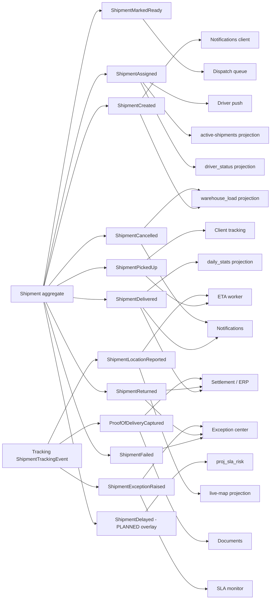
```mermaid
flowchart LR
    %% Producers
    SHP[Shipment aggregate]
    TRK[Tracking ShipmentTrackingEvent]

    %% Shipment-owned events
    SHP --> E_CR[ShipmentCreated]
    SHP --> E_RDY[ShipmentMarkedReady]
    SHP --> E_ASG[ShipmentAssigned]
    SHP --> E_PU[ShipmentPickedUp]
    SHP --> E_DEL[ShipmentDelivered]
    SHP --> E_FAIL[ShipmentFailed]
    SHP --> E_RET[ShipmentReturned]
    SHP --> E_CAN[ShipmentCancelled]
    SHP --> E_DLY[ShipmentDelayed - PLANNED overlay]

    %% Tracking-owned events written via guarded path
    TRK --> E_LOC[ShipmentLocationReported]
    TRK --> E_POD[ProofOfDeliveryCaptured]
    TRK --> E_EXC[ShipmentExceptionRaised]

    %% Consumers
    E_CR --> C_WHL[warehouse_load projection]
    E_CR --> C_NOTC[Notifications client]
    E_RDY --> C_DQ[Dispatch queue]
    E_ASG --> C_DPUSH[Driver push]
    E_ASG --> C_ACT[active-shipments projection]
    E_ASG --> C_DST[driver_status projection]
    E_PU --> C_ETA[ETA worker]
    E_PU --> C_TRK[Client tracking]
    E_LOC --> C_MAP[live-map projection]
    E_LOC --> C_ETA
    E_DEL --> C_SET[Settlement / ERP]
    E_DEL --> C_DS[daily_stats projection]
    E_DEL --> C_NOT[Notifications]
    E_FAIL --> C_EXCC[Exception center]
    E_RET --> C_EXCC
    E_RET --> C_SET
    E_CAN --> C_WHL
    E_CAN --> C_NOT
    E_POD --> C_DOC[Documents]
    E_POD --> C_SET
    E_EXC --> C_EXCC
    E_EXC --> C_SLA[SLA monitor]
    E_DLY --> C_SLARISK[proj_sla_risk]
```

### Mermaid — Equipment Domain (PLANNED; Producers → Events → Consumers)

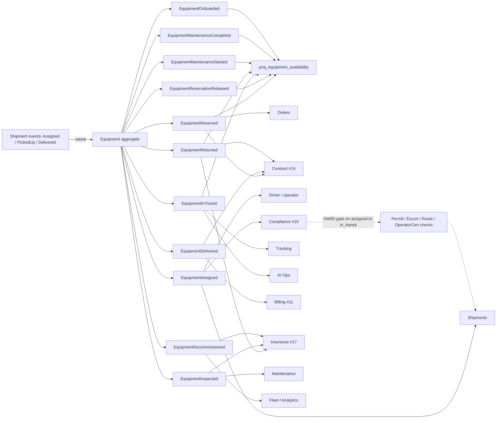
```mermaid
flowchart LR
    %% Cause is Shipment; Equipment reacts (one-way, ADR-009)
    SHPEV[Shipment events: Assigned / PickedUp / Delivered] -->|cause| EQP[Equipment aggregate]

    EQP --> Q_RES[EquipmentReserved]
    EQP --> Q_RREL[EquipmentReservationReleased]
    EQP --> Q_ASG[EquipmentAssigned]
    EQP --> Q_IT[EquipmentInTransit]
    EQP --> Q_DEL[EquipmentDelivered]
    EQP --> Q_RET[EquipmentReturned]
    EQP --> Q_INS[EquipmentInspected]
    EQP --> Q_MS[EquipmentMaintenanceStarted]
    EQP --> Q_MC[EquipmentMaintenanceCompleted]
    EQP --> Q_DEC[EquipmentDecommissioned]
    EQP --> Q_ONB[EquipmentOnboarded]

    %% Consumers
    Q_RES --> K_AVL[proj_equipment_availability]
    Q_RES --> K_ORD[Orders]
    Q_RES --> K_CON[Contract #14]
    Q_RREL --> K_AVL
    Q_ASG --> K_SHP[Shipments]
    Q_ASG --> K_DRV[Driver / operator]
    Q_ASG --> K_CMP[Compliance #16]
    Q_IT --> K_TRK[Tracking]
    Q_IT --> K_AVL
    Q_IT --> K_AI[AI Ops]
    Q_DEL --> K_BIL[Billing #11]
    Q_DEL --> K_CON
    Q_RET --> K_CON
    Q_RET --> K_INS[Insurance #17]
    Q_RET --> K_AVL
    Q_INS --> K_MNT[Maintenance]
    Q_INS --> K_INS
    Q_MS --> K_AVL
    Q_MC --> K_AVL
    Q_DEC --> K_FLT[Fleet / Analytics]
    Q_DEC --> K_INS
    Q_ONB --> K_AVL

    %% Compliance dispatch gates extend the assigned->in_transit guard (HARD)
    K_CMP -.->|HARD gate on assigned to in_transit| GATE[Permit / Escort / Route / OperatorCert checks]
    GATE -.-> K_SHP
```

> **Build-state caveat for the Equipment diagram:** every node above is DESIGNED-NOT-BUILT and **inert until the M2 event backbone (event store + outbox + processed_events) ships** (`docs/06` §C.2, `docs/07` critical path). No #15/#16/#17 consumer may be built ahead of M2.

---

## 6. Final State Machines

### Overview

The platform contains **four** state machines that are actually drawn and described in the documentation, at two different maturity levels:

| Machine | Owning context | Status in docs | Source of truth |
|---|---|---|---|
| **Shipment lifecycle** (8 states) | Shipments (#4) | EXISTS — AUTHORITATIVE, enforced in code | `docs/diagrams/shipment-state-machine.mmd`; `docs/04-event-storming-and-state-machines.md` §4.1 (transcribed from `app/services/shipment_service.py::_is_transition_allowed`) |
| **Vehicle status** (3 stored states) | Fleet (#5) | Enum AUTHORITATIVE; transition guards PROPOSED (no guard in code yet) | `docs/diagrams/vehicle-state-machine.mmd`; `docs/04` §4.4 |
| **Driver availability** (5 states) | Driver Management (#6) | PROPOSED — no driver-status enum in code (only `is_available` + `user.is_active`) | `docs/04` §4.3 |
| **Equipment unit lifecycle** (8 states) | Equipment & Asset (#15) | DESIGNED, not built (heavy-equipment domain) | `docs/08-heavy-equipment-domain-design.md` §6.1 |

Two further machines are sub-machines designed inside the heavy-equipment doc — **Permit lifecycle** (`docs/08` §2.1) and **Claims workflow** (`docs/08` §5.2). Two more named in the Phase-6 brief — **Order** and **Contract** — are addressed at the end: Order has a PROPOSED machine (`docs/04` §4.2) and Contract has no drawn machine (ABSENT, minimum states only).

> SCOPE NOTE: the Phase-6 brief assumes Order, Contract, Permit, and Claim are not designed. That is only partly true. Permit and Claim machines ARE drawn in `docs/08` and are reproduced below; Order is PROPOSED in `docs/04`; only Contract has no state machine in the corpus. Nothing below is fabricated — every transition is cited.

---

### Shipment Lifecycle (EXISTS — Authoritative)

This is the canonical 8-state machine, transcribed from `app/services/shipment_service.py::_is_transition_allowed` and `app/models/enums.py::ShipmentStatus` (`docs/04` §4.1, line 1133: *"This is the canonical 8-state machine and must not drift."*). The same transition map gates both `transition_status(...)` and any attached `status_update` tracking event (`docs/04` line 1164).

#### States

| State | Group | Meaning (source: `docs/04` §4.1.1) |
|---|---|---|
| `created` | ACTIVE (initial) | Record exists; not yet released. `ShipmentCreated`, `reference_code` stamped. |
| `ready` | ACTIVE | Released and eligible for assignment / driver offers. `ShipmentMarkedReady`. |
| `assigned` | ACTIVE | Driver (+ optional vehicle) bound, pre-transit. `assigned_at` stamped; exclusivity locked. |
| `in_transit` | ACTIVE | Pickup confirmed; cargo moving. Entered via `ShipmentPickedUp`. |
| `delivered` | TERMINAL | Successfully delivered. `delivered_at` stamped; usually `ProofOfDeliveryCaptured`. |
| `cancelled` | TERMINAL | Aborted before completion. `cancelled_at` stamped. |
| `returned` | TERMINAL | Returned to origin after transit. |
| `failed` | TERMINAL | Delivery attempt failed terminally. |

`ACTIVE_STATUSES = {created, ready, assigned, in_transit}`; terminal = `{delivered, cancelled, returned, failed}` (`docs/04` line 1148). `PickedUp` is NOT a stored state — it is the `assigned -> in_transit` trigger. `Delayed` is NOT a node — it is an orthogonal SLA-risk overlay (`proj_sla_risk`, ADR-006), never a transition target (`docs/04` line 1133, lines 1194–1195).

#### Allowed Transitions

| From | To | Trigger | Guard (source: `docs/04` §4.1.2 + `shipment-state-machine.mmd` lines 6–17) |
|---|---|---|---|
| `created` | `ready` | MarkReady / `ShipmentMarkedReady` | Required fields present; validation passed. |
| `created` | `cancelled` | Cancel / `ShipmentCancelled` | Stamps `cancelled_at`. |
| `ready` | `assigned` | Assign(driver+vehicle) / `ShipmentAssigned` | All HARD assignment guards (see Business Rules); stamps `assigned_at`. |
| `ready` | `cancelled` | Cancel / `ShipmentCancelled` | Stamps `cancelled_at`. |
| `assigned` | `in_transit` | ConfirmPickup / `ShipmentPickedUp` | Driver/vehicle still valid; pickup confirmed. |
| `assigned` | `cancelled` | Cancel / `ShipmentCancelled` | Releases driver/vehicle exclusivity. |
| `in_transit` | `delivered` | Deliver / `ShipmentDelivered` | Stamps `delivered_at`; POD typically captured. |
| `in_transit` | `failed` | Fail / `ShipmentFailed` | Terminal failure. |
| `in_transit` | `returned` | Return / `ShipmentReturned` | Cargo returned to origin. |

#### Invalid Transitions (explicit)

| Forbidden transition | Why rejected (source: `docs/04` §4.1.3) |
|---|---|
| `delivered -> in_transit` | Terminal immutability — `delivered` has no outgoing edges. |
| `delivered -> returned` | Terminal immutability — a post-delivery return is a *new compensating* `ShipmentReturned` flow, not a state edit. |
| `cancelled -> assigned` | Terminal immutability — cancelled is final. |
| `returned -> in_transit` / `failed -> in_transit` | Terminal immutability. |
| `created -> assigned` | Skips `ready`; map only allows `created -> {ready, cancelled}`. |
| `created -> in_transit` | Skips `ready` and `assigned`; pickup requires a prior assignment. |
| `ready -> in_transit` | Cannot enter transit without a bound driver — must pass through `assigned`. |
| `assigned -> delivered` | Cannot deliver without confirming pickup (`in_transit`) first. |
| `in_transit -> cancelled` | `in_transit` only exits to `{delivered, failed, returned}`; mid-transit abort is `failed`/`returned`, never `cancelled`. |
| Any transition into a state with a **non-monotonic** tracking `event_time` | `event_time` must be monotonic non-decreasing per shipment. |

#### Compensation Flows

- **Reversal after delivery** — NOT an edit. Emit a compensating event (e.g. `ShipmentReturned` as a *new* flow / order-level reversal); the `delivered` event stays in the append-only store (`docs/04` line 1206; ADR-004 line 26: *"compensating events for reversals … never a mutation/delete of history"*).
- **Exception during transit** — `ShipmentExceptionRaised` (tracking `exception` event) is an overlay/annotation; it does not move the core node unless an accompanying guarded `status_update` does (`docs/04` line 1207).
- **Synchronous rejects** — illegal transition → `StatusTransitionError`; assignment-guard violation → `AssignmentError`; capacity violation → `CapacityError`; missing shipment → `NotFoundError` (`docs/04` §4.1.5).

> SEMANTIC AMBIGUITY (conflict matrix, INFO): `ShipmentReturned` denotes **two** distinct things under one name — a genuine `in_transit -> returned` lifecycle transition, and a post-delivery compensating flow that is explicitly NOT a transition (`delivered` is terminal). Consumers (e.g. Billing settlement) must distinguish the two; `docs/04` line 1171 + ADR-004 are the basis for keeping them separate.

#### Business Rules

**HARD (enforced in code today — `docs/04` §4.1.4):**
- Driver exclusivity: a driver cannot hold a 2nd shipment in an ACTIVE status (`AssignmentError`).
- Vehicle exclusivity: a vehicle cannot hold a 2nd ACTIVE shipment.
- Vehicle must be `status == active` to be assigned.
- Driver must be `is_available == true` AND linked to a `role=driver` user.
- `weight_kg <= vehicle.capacity_weight_kg` AND `volume_m3 <= vehicle.capacity_volume_m3`.
- Origin AND destination warehouse capacity (sum over ACTIVE shipments + new) must not exceed warehouse `capacity_weight_kg` / `capacity_volume_m3`.
- Transition must follow the authoritative map (`StatusTransitionError` otherwise).
- Tracking `event_time` monotonic non-decreasing per shipment.
- `weight_kg > 0`, `volume_m3 > 0`; `reference_code` unique per tenant.

**SOFT / overlay (advisory):** `ShipmentDelayed` SLA overlay → `proj_sla_risk` (never a node); warehouse `max_daily_shipments` (throughput target, not hard-enforced); 15s offer acceptance window.

> FORWARD-LOOKING GUARD EXTENSION (conflict matrix, INFO): the heavy-equipment domain (`docs/08` lines 144–149) keeps the 8-state **graph** unchanged but *extends the `assigned -> in_transit` guard set* with HARD compliance gates (valid permit, route height/axle/GCW clearance, escort, operator certification). These are additive service-layer guards, not new states — "unchanged" applies to the graph, not the preconditions.

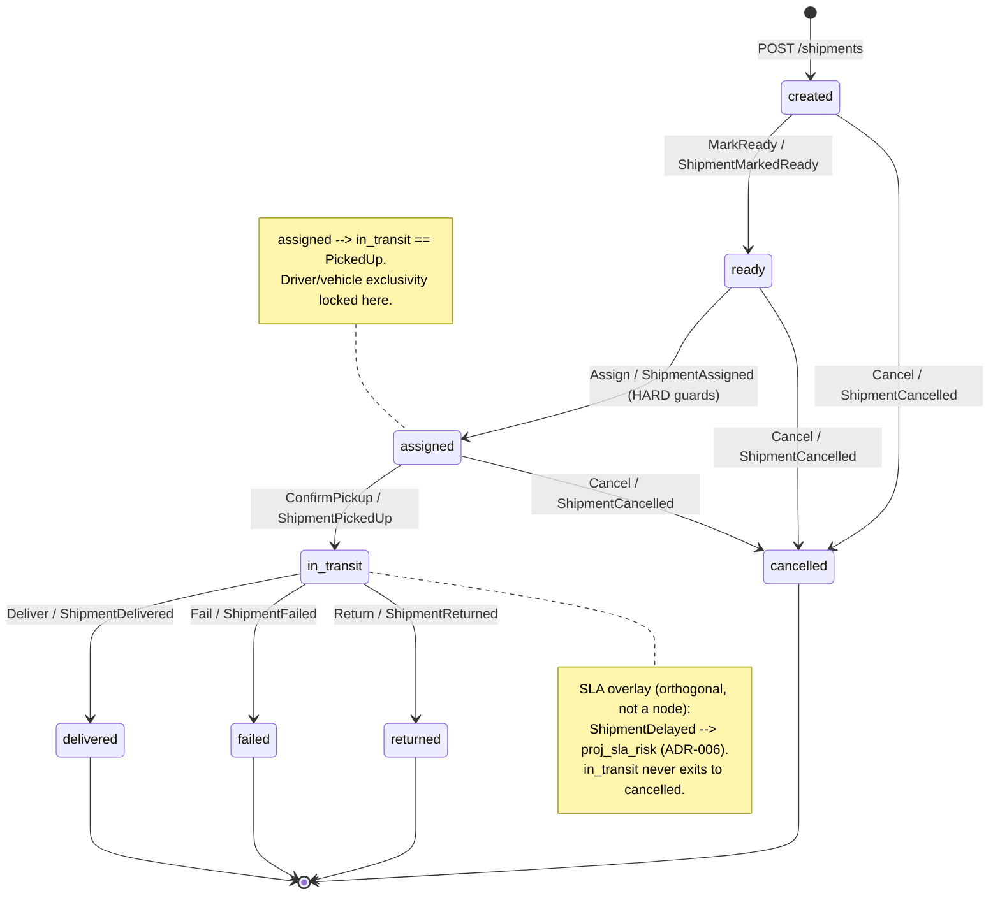
```mermaid
stateDiagram-v2
    [*] --> created : POST /shipments
    created --> ready : MarkReady / ShipmentMarkedReady
    created --> cancelled : Cancel / ShipmentCancelled
    ready --> assigned : Assign / ShipmentAssigned (HARD guards)
    ready --> cancelled : Cancel / ShipmentCancelled
    assigned --> in_transit : ConfirmPickup / ShipmentPickedUp
    assigned --> cancelled : Cancel / ShipmentCancelled
    in_transit --> delivered : Deliver / ShipmentDelivered
    in_transit --> failed : Fail / ShipmentFailed
    in_transit --> returned : Return / ShipmentReturned
    delivered --> [*]
    cancelled --> [*]
    returned --> [*]
    failed --> [*]
    note right of in_transit
        SLA overlay (orthogonal, not a node):
        ShipmentDelayed --> proj_sla_risk (ADR-006).
        in_transit never exits to cancelled.
    end note
    note left of assigned
        assigned --> in_transit == PickedUp.
        Driver/vehicle exclusivity locked here.
    end note
```

---

### Vehicle Status (Enum Authoritative; Transition Guards Proposed)

Source: `docs/diagrams/vehicle-state-machine.mmd` and `docs/04` §4.4. The status enum `{active, maintenance, decommissioned}` (`app/models/enums.py::VehicleStatus`) is authoritative, but the `.mmd` header (lines 2–3) states: *"No transition guard exists in code yet; this is the PROPOSED machine to formalize in Phase 4."* The audit (W-3) flags the label clash with `docs/04` §4.4's "EXISTS — AUTHORITATIVE" heading; the reconciliation is: **enum authoritative, transition guards proposed.**

#### States

| State | Meaning | Source |
|---|---|---|
| `active` | In service; the **only** assignable state. | `.mmd` line 3; `docs/04` §4.4.1 |
| `maintenance` | Temporarily out of service (OutOfService — temporary). Excluded from assignment. | `docs/04` §4.4.1 |
| `decommissioned` | Permanently retired (terminal; OutOfService — permanent). | `docs/04` §4.4.1 |

An operational overlay `{Available, Assigned}` is **DERIVED**, not stored, and valid only while `status == active` (`docs/04` §4.4, line 1400).

#### Allowed Transitions

| From | To | Trigger | Guard (source: `docs/04` §4.4.2 + `.mmd` lines 6–9) |
|---|---|---|---|
| `[*]` | `active` | Vehicle onboarded / `VehicleRegistered` | Initial state. |
| `active` | `maintenance` | StartMaintenance / `VehicleMaintenanceStarted` | Vehicle must not be on an active shipment (release first). |
| `maintenance` | `active` | CompleteMaintenance / `VehicleMaintenanceCompleted` | Returns to service. |
| `active` | `decommissioned` | Decommission / `VehicleDecommissioned` | Vehicle must not be on an active shipment. |
| `maintenance` | `decommissioned` | Decommission (write-off) / `VehicleDecommissioned` | Permanent retirement from maintenance. |

#### Invalid Transitions

| Forbidden transition | Why rejected |
|---|---|
| `decommissioned -> active` / `decommissioned -> maintenance` | `decommissioned` is terminal (`.mmd` line 10 `decommissioned --> [*]`). |
| `maintenance -> (assignment)` | Only `active` vehicles pass `_validate_vehicle()` in `assign_driver_and_vehicle()` (`.mmd` lines 12–14). |
| `active -> maintenance` / `active -> decommissioned` while on an active shipment | Vehicle must be released first (`docs/04` §4.4.2 guards). |

> NOTE: because no transition guard exists in code, these "invalid" transitions are PROPOSED enforcement, not yet executed. They are listed as the target machine to formalize (W-3).

#### Compensation Flows

None defined. Status changes are forward-only; there is no compensating-event design for Vehicle in either source file. (Vehicle reversibility is limited to the legitimate `maintenance -> active` edge.)

#### Business Rules

- **HARD (target):** only `active` vehicles are assignable; release from an active shipment before `maintenance`/`decommissioned`.
- `decommissioned` is terminal — no re-activation.

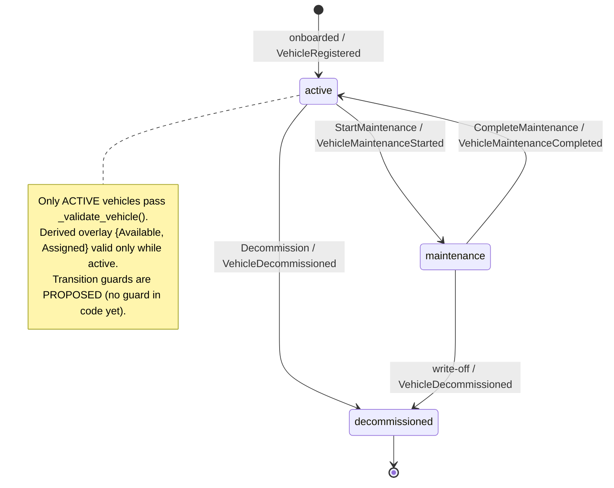
```mermaid
stateDiagram-v2
    [*] --> active : onboarded / VehicleRegistered
    active --> maintenance : StartMaintenance / VehicleMaintenanceStarted
    maintenance --> active : CompleteMaintenance / VehicleMaintenanceCompleted
    active --> decommissioned : Decommission / VehicleDecommissioned
    maintenance --> decommissioned : write-off / VehicleDecommissioned
    decommissioned --> [*]
    note right of active
        Only ACTIVE vehicles pass _validate_vehicle().
        Derived overlay {Available, Assigned} valid only while active.
        Transition guards are PROPOSED (no guard in code yet).
    end note
```

---

### Driver Availability (Proposed)

Source: `docs/04` §4.3. PROPOSED — *"there is no driver status enum in code today (only `is_available: bool` + `user.is_active`)"* (`docs/04` line 1318). `assigned` and `busy` are DERIVED from the active shipment phase, not stored driver states (`docs/04` line 1330).

#### States

| State | Maps to (today) | Source |
|---|---|---|
| `offline` | `is_available = false` | `docs/04` §4.3.1 |
| `available` | `is_available = true` | `docs/04` §4.3.1 |
| `assigned` (derived) | active shipment in `assigned` | `docs/04` §4.3.1 |
| `busy` / on_trip (derived) | active shipment in `in_transit` | `docs/04` §4.3.1 |
| `suspended` (non-terminal, isolating) | `user.is_active = false` | `docs/04` §4.3.1 |

#### Allowed Transitions

| From | To | Trigger | Guard (source: `docs/04` §4.3.2) |
|---|---|---|---|
| `offline` | `available` | GoOnline / `DriverWentOnline` | Sets `is_available = true`; user active. |
| `available` | `offline` | GoOffline / `DriverWentOffline` | Only if not holding an active shipment. |
| `available` | `assigned` | AcceptOffer / `DriverAssigned` | Single-active-shipment guard; driver eligible. |
| `assigned` | `busy` | shipment `assigned -> in_transit` / `DriverStatusChanged` | Pickup confirmed on bound shipment. |
| `busy` | `available` | shipment reaches terminal / `DriverStatusChanged` | Active shipment cleared. |
| `assigned` | `available` | shipment cancelled pre-transit / `DriverStatusChanged` | Exclusivity released. |
| any | `suspended` | Suspend / `DriverSuspended` | Admin action; `user.is_active = false`. |
| `suspended` | `offline` | Reinstate / `DriverReinstated` | Returns to `offline` (must re-go-online). |

#### Invalid Transitions

| Forbidden transition | Why rejected (source: `docs/04` §4.3.3) |
|---|---|
| `offline -> assigned` | Only `available` drivers receive offers/assignment. |
| `available -> busy` (direct) | `busy` requires a bound in-transit shipment; must pass through `assigned`. |
| `available -> assigned` while already holding an active shipment | Single-active-shipment exclusivity. |
| `assigned -> offline` / `busy -> offline` | Cannot go offline while holding an active shipment. |
| `suspended -> available` (direct) | Reinstatement returns to `offline`; driver must explicitly go online. |
| `suspended -> assigned` | Suspended drivers are excluded from all assignment. |

#### Compensation Flows

- **Suspension mid-trip** — admin policy reassigns/aborts the live shipment via a compensating `ShipmentReturned`/`ShipmentFailed` before/at suspension (`docs/04` §4.3.5).
- **Offer expiry / decline** — no state mutation; offer is re-queued; driver stays `available` (`docs/04` §4.3.5). (Conflict matrix INFO: a blocked/declined assignment produces NO auditable event, an observability asymmetry vs Warehouse's "attempted" pseudo-event.)

#### Business Rules

- **HARD:** only `available` drivers receive offers/assignment; `assigned`/`busy` enforce a single active shipment (mirrors Shipment driver-exclusivity); a `suspended` driver is excluded from offers, assignment, and proximity ranking.
- **SOFT:** 15s offer window; proximity/route-efficiency ranking.
- **VALIDATION:** phone/OTP login (stubbed today); `role = driver`.

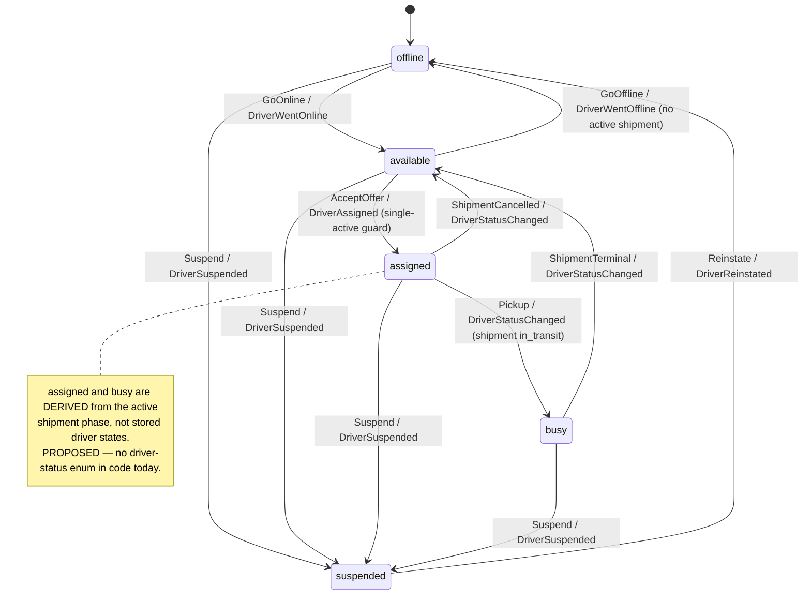
```mermaid
stateDiagram-v2
    [*] --> offline
    offline --> available : GoOnline / DriverWentOnline
    available --> offline : GoOffline / DriverWentOffline (no active shipment)
    available --> assigned : AcceptOffer / DriverAssigned (single-active guard)
    assigned --> busy : Pickup / DriverStatusChanged (shipment in_transit)
    busy --> available : ShipmentTerminal / DriverStatusChanged
    assigned --> available : ShipmentCancelled / DriverStatusChanged
    offline --> suspended : Suspend / DriverSuspended
    available --> suspended : Suspend / DriverSuspended
    assigned --> suspended : Suspend / DriverSuspended
    busy --> suspended : Suspend / DriverSuspended
    suspended --> offline : Reinstate / DriverReinstated
    note right of assigned
        assigned and busy are DERIVED from the active
        shipment phase, not stored driver states.
        PROPOSED — no driver-status enum in code today.
    end note
```

---

### Equipment Unit Lifecycle (Designed — Heavy-Equipment Domain, Not Built)

Source: `docs/08` §6.1. DESIGNED, not built. Complementary to (not replacing) the Shipment machine: an `Equipment` unit moves through a reservation → delivery → return cycle, driven by commands **and** by reacting to approved shipment events (ADR-009). Terminal: `OutOfService`. `Returned`/`Delivered` are cycle states (a rental unit returns to `Available`).

#### States

`Available` (initial), `Reserved`, `Assigned`, `InTransit`, `Delivered` (cycle state — can also exit to `[*]` on one-way ownership transfer), `Returned` (cycle state), `Maintenance` (temporary unavailability), `OutOfService` (terminal — permanent decommission/write-off). Source: `docs/08` §6.1, lines 270–305.

#### Allowed Transitions

| From | To | Trigger / reacting event (source: `docs/08` §6.1) |
|---|---|---|
| `[*]` | `Available` | `EquipmentOnboarded` (inspection passed) |
| `Available` | `Reserved` | ReserveEquipment / `EquipmentReserved` |
| `Reserved` | `Available` | release / expire (`EquipmentReservationReleased`) |
| `Reserved` | `Assigned` | AssignEquipment / `EquipmentAssigned` (bound to shipment+operator) |
| `Assigned` | `InTransit` | carrying Shipment `-> in_transit` (`EquipmentInTransit`, on `ShipmentPickedUp`) |
| `Assigned` | `Available` | assignment cancelled (pre-dispatch) |
| `InTransit` | `Delivered` | Shipment delivered (`EquipmentDelivered`, on `ShipmentDelivered`) |
| `InTransit` | `Maintenance` | in-transit damage/breakdown (`DamageReported`) |
| `Delivered` | `Returned` | return leg (`EquipmentReturned`) — rentals / relocation round-trip |
| `Delivered` | `Available` | one-way move, accepted on site |
| `Returned` | `Available` | return inspection passed (`EquipmentInspected`) |
| `Returned` | `Maintenance` | inspection found issues |
| `Available` | `Maintenance` | `EquipmentMaintenanceStarted` (`.mmd` label `MaintenanceStarted`) |
| `Maintenance` | `Available` | `EquipmentMaintenanceCompleted` (`.mmd` label `MaintenanceCompleted`) |
| `Available` | `OutOfService` | decommission / write-off (`EquipmentDecommissioned`) |
| `Maintenance` | `OutOfService` | write-off |
| `Delivered` | `[*]` | one-way ownership transfer (out of Mesaar custody) |
| `OutOfService` | `[*]` | terminal |

#### Invalid Transitions

`docs/08` does not enumerate an explicit forbidden-transition list. The only stated terminal constraint is that `OutOfService` is permanent (`docs/08` lines 302–305: *"Terminal. OutOfService = permanent"*); by the drawn graph, any edge out of `OutOfService` (other than `[*]`), and any direct `Available -> InTransit`/`Available -> Assigned` (these require `Reserved` first), are not in the machine — marked here as **NOT-ENUMERATED (graph-implied only)** to avoid fabricating a rule the doc does not state.

#### Compensation Flows

- In-transit damage/breakdown diverts `InTransit -> Maintenance` via `DamageReported`, which also feeds the Insurance Claims workflow (`docs/08` §5.2, line 245).
- Return-inspection failure diverts `Returned -> Maintenance`.
- The Equipment machine reacts to (does not drive) Shipment compensation: a Shipment `failed`/`returned` is the cause; Equipment emits its own reaction events (ADR-009 directionality — Shipment cause, Equipment reaction).

#### Business Rules

- **HARD:** equipment lifecycle reacts to the approved Shipment 8-state machine, which is unchanged (`docs/08` lines 23–24, 300).
- Temporary unavailability = `Maintenance`; permanent retirement = `OutOfService` (`docs/08` lines 302–305).
- Equipment ≠ Vehicle: a unit is a Vehicle when it hauls and an Equipment unit when it is the subject of the order; linked by id, never merged (ADR-009).

> DEPENDENCY (conflict matrix, WARNING): all Equipment events flow via the append-only event store + outbox (ADR-007), which is DESIGNED-NOT-BUILT. No Equipment handler can be built before the M2 event backbone ships (`docs/07` critical path).
>
> EVENT-NAMING (conflict matrix, INFO): `EquipmentInTransit` violates the `<Aggregate><PastTenseVerb>` convention (adjectival, not past-tense); the `.mmd` uses bare `MaintenanceStarted`/`MaintenanceCompleted` that collide with Fleet's `VehicleMaintenance*`; and `EquipmentOnboarded` (the entry event) is missing from the Part 7 catalog. These are documentation defects, not state-machine defects.

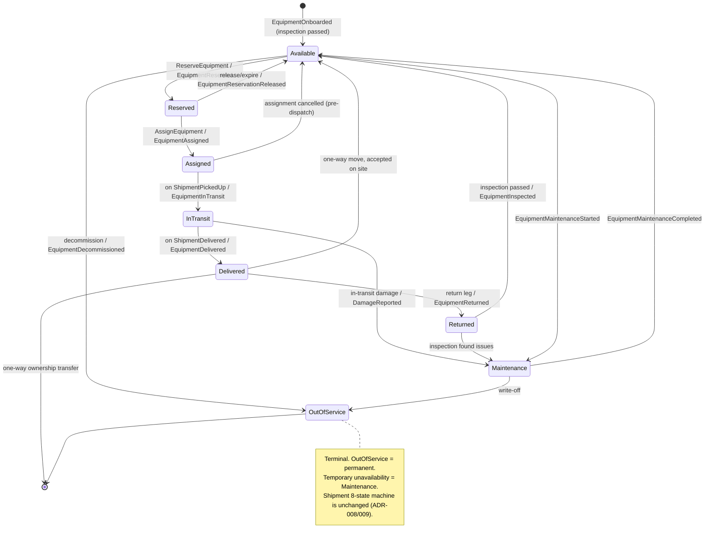
```mermaid
stateDiagram-v2
    [*] --> Available : EquipmentOnboarded (inspection passed)
    Available --> Reserved : ReserveEquipment / EquipmentReserved
    Reserved --> Available : release/expire / EquipmentReservationReleased
    Reserved --> Assigned : AssignEquipment / EquipmentAssigned
    Assigned --> InTransit : on ShipmentPickedUp / EquipmentInTransit
    Assigned --> Available : assignment cancelled (pre-dispatch)
    InTransit --> Delivered : on ShipmentDelivered / EquipmentDelivered
    InTransit --> Maintenance : in-transit damage / DamageReported
    Delivered --> Returned : return leg / EquipmentReturned
    Delivered --> Available : one-way move, accepted on site
    Returned --> Available : inspection passed / EquipmentInspected
    Returned --> Maintenance : inspection found issues
    Available --> Maintenance : EquipmentMaintenanceStarted
    Maintenance --> Available : EquipmentMaintenanceCompleted
    Available --> OutOfService : decommission / EquipmentDecommissioned
    Maintenance --> OutOfService : write-off
    Delivered --> [*] : one-way ownership transfer
    OutOfService --> [*]
    note right of OutOfService
        Terminal. OutOfService = permanent.
        Temporary unavailability = Maintenance.
        Shipment 8-state machine is unchanged (ADR-008/009).
    end note
```

---

### Machines the Brief Expects: Status and Minimum-Viable States

The Phase-6 brief lists **Order, Contract, Permit, Claim**. Ground-truth finding: only **Contract** is genuinely without a state machine. The others are designed (Permit, Claim) or proposed (Order). Each is reported at its true status below — no transitions are invented for the ABSENT one.

#### Order — PROPOSED (not ABSENT)

A target-state Order machine IS drawn in `docs/04` §4.2 (lines 1300–1312). It is NOT yet built ("today the Shipment doubles as the order"). Its proposed states: `draft`, `submitted`, `approved`, `rejected` (terminal), `fulfilling`, `completed` (terminal), `cancelled` (terminal).

> UNRESOLVED CRITICAL CONFLICT (C-1): the `fulfilling -> cancelled` edge is defined as **both forbidden and allowed** in the same document — `docs/04` §2.8 prose (line 567) says the Order is "not cancellable once fulfilling/completed", while the Part 4 transition table (line 1308) and the §4.2 diagram both list `fulfilling --> cancelled : Cancel / OrderCancelled (compensate shipments)`. The audit (`docs/06` C-1) flags this CRITICAL and requires resolution before any OrderService is built. No Order machine should be consolidated until this single edge is resolved. The recommended fix (audit + `docs/07` M0): ALLOW `fulfilling -> cancelled` WITH compensation, plus add the missing `OrderFulfilmentFailed` compensation event.

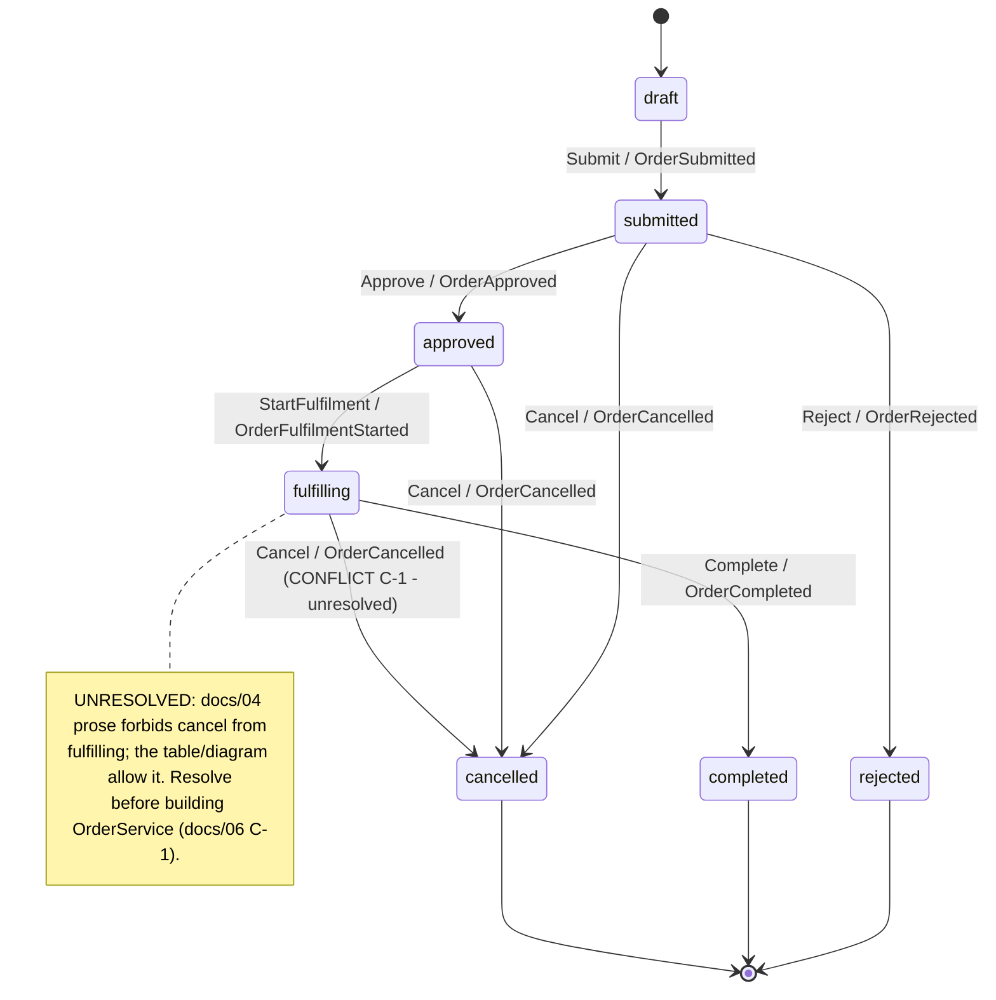
```mermaid
stateDiagram-v2
    [*] --> draft
    draft --> submitted : Submit / OrderSubmitted
    submitted --> approved : Approve / OrderApproved
    submitted --> rejected : Reject / OrderRejected
    submitted --> cancelled : Cancel / OrderCancelled
    approved --> fulfilling : StartFulfilment / OrderFulfilmentStarted
    approved --> cancelled : Cancel / OrderCancelled
    fulfilling --> completed : Complete / OrderCompleted
    fulfilling --> cancelled : Cancel / OrderCancelled (CONFLICT C-1 - unresolved)
    rejected --> [*]
    completed --> [*]
    cancelled --> [*]
    note right of fulfilling
        UNRESOLVED: docs/04 prose forbids cancel from
        fulfilling; the table/diagram allow it. Resolve
        before building OrderService (docs/06 C-1).
    end note
```

#### Permit — DESIGNED (not ABSENT)

A Permit lifecycle IS specified in `docs/08` §2.1 (lines 126–128) and cross-referenced in §6.3. States: `draft`, `requested`, `under_review`, `approved`, `rejected`, `active` (on validity start), `expired`, `revoked`. Designed, not built; owned by Compliance & Permits (#16); gates Shipment `assigned -> in_transit` (HARD dispatch rule, `docs/08` line 144).

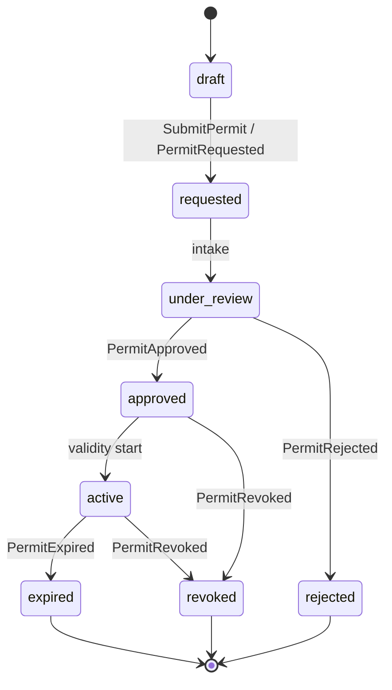
```mermaid
stateDiagram-v2
    [*] --> draft
    draft --> requested : SubmitPermit / PermitRequested
    requested --> under_review : intake
    under_review --> approved : PermitApproved
    under_review --> rejected : PermitRejected
    approved --> active : validity start
    active --> expired : PermitExpired
    approved --> revoked : PermitRevoked
    active --> revoked : PermitRevoked
    rejected --> [*]
    expired --> [*]
    revoked --> [*]
```

#### Claim — DESIGNED (not ABSENT)

A Claims workflow IS specified in `docs/08` §5.2 (lines 241–242) and §6.3. States: `reported` (FNOL), `under_assessment`, `approved`, `rejected`, `settled`, `reopened` (compensating). Designed, not built; owned by Insurance & Claims (#17). **Note — `docs/08` is internally inconsistent on which states may reopen:** line 241 says "any → reopened" while line 326 shows "settled → reopened" only; the diagram below follows the broader line-241 reading (both `settled → reopened` and `rejected → reopened`). Reconcile `docs/08` before build.

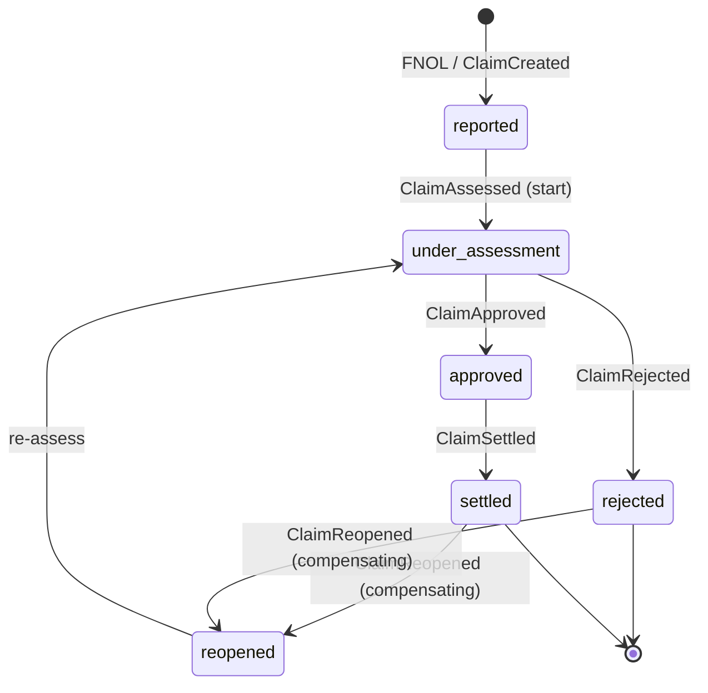
```mermaid
stateDiagram-v2
    [*] --> reported : FNOL / ClaimCreated
    reported --> under_assessment : ClaimAssessed (start)
    under_assessment --> approved : ClaimApproved
    under_assessment --> rejected : ClaimRejected
    approved --> settled : ClaimSettled
    settled --> reopened : ClaimReopened (compensating)
    rejected --> reopened : ClaimReopened (compensating)
    reopened --> under_assessment : re-assess
    rejected --> [*]
    settled --> [*]
```

#### Contract — ABSENT / NOT-YET-DESIGNED

No Contract state machine exists in any corpus file. Contract Management (#14) is named as a NEW context (`docs/06` §E.2; `docs/08` line 20 keeps "contracts/pricing/SLA/penalties/carrier & rental agreements" under #14), but no states, transitions, or diagram are drawn anywhere. Status: **ABSENT — not-yet-designed.**

No transitions are fabricated. A minimum-viable Contract lifecycle would need, at least, the following states (descriptive scaffolding only — **NOT a designed machine**): an initial **`draft`**, an executed/in-force **`active`** (entered on signature/validity start), a renewal/change state **`amended`**, a natural end-of-term **`expired`** (terminal), and an early-end **`terminated`** (terminal). This list is inferred from the contract-related events that DO appear in the event inventory (`ContractCreated`, `ContractActivated`, `ContractAmended`, `ContractExpired`, plus `CarrierAgreementSigned`/`Terminated`, `RentalContractStarted`/`Closed` in `docs/06` §D) — but those events have no transition table or diagram, so any edges between these states remain undesigned and are deliberately omitted.

---

Source files read for this section: `docs/diagrams/shipment-state-machine.mmd`, `docs/diagrams/vehicle-state-machine.mmd`, `docs/04-event-storming-and-state-machines.md` (§4.1 lines 1133–1237, §4.2 lines 1241–1312, §4.3 lines 1316–1394, §4.4 lines 1398–1419), `docs/08-heavy-equipment-domain-design.md` (§2.1 lines 120–129, §5.2 lines 238–245, §6.1 lines 260–326).

---

## 7. Integration Map

### Scope of this map

This integration map covers only the contexts whose data, events, or wiring are concretely described in the corpus. The **built** contexts are Identity & Access, Fleet, Driver Management, Warehouse Management, Shipments, and Tracking. Their event production, consumption, and projection wiring is taken from `docs/event-catalog.md` and `docs/adr/ADR-006-read-models.md`. **Designed-not-built (PLANNED)** contexts (Orders, Customer, Route, Notifications, Billing, Analytics, AI Operations, Contract Management #14, Equipment & Asset #15, Compliance & Permits #16, Insurance & Claims #17) and aspirational external integrations are marked explicitly. External systems are taken from `docs/diagrams/context.mmd` (lines 22-27) and `docs/diagrams/deployment.mmd`.

Two source caveats are carried through this map:
- The canonical persistence model is the unified `event_store` + transactional outbox (`docs/adr/ADR-007-uuidv7-event-store-outbox.md`), which is **designed, not built**. `docs/event-catalog.md` line 5 still states events are persisted only to `shipment_tracking_events` "where a tracking row applies" — a stale, pre-ADR-007 claim. Until M2 ships the event_store/outbox, the only persisted stream is `shipment_tracking_events`; Fleet/Identity and integration events have **no stated persistence target** in the catalog.
- Nafath National SSO appears as an integration edge in `context.mmd` line 45 (`mobile -. SSO .-> nafath`) but the implemented login is email/password only (`docs/diagrams/sequence-driver-login.mmd` lines 14-17, OTP/SSO marked planned). Nafath is therefore **aspirational**.

### Data ownership (built contexts)

One aggregate has exactly one owning context; cross-context references are by id, never by reaching into another context's tables (`docs/05-backend-architecture.md` lines 229-231).

| Owning context | Owns (aggregate / entity) | Status | Source |
|---|---|---|---|
| Identity & Access | User; Role/Permission (today `UserRole` enum + `app/auth`); Tenant (PLANNED) | EXISTS (Tenant PLANNED) | `docs/05` lines 235-237; `docs/domain-glossary.md` line 8 |
| Fleet | Vehicle (status `active`/`maintenance`/`decommissioned`) | EXISTS | `docs/05` line 242; `docs/domain-glossary.md` line 11 |
| Driver Management | Driver (`license_*`, `is_available`, `home_warehouse`) | EXISTS | `docs/05` line 243; `docs/domain-glossary.md` line 10 |
| Warehouse Management | Warehouse (geolocation, weight/volume capacity, `max_daily_shipments`) | EXISTS | `docs/05` line 244; `docs/domain-glossary.md` line 12 |
| Shipments | Shipment (aggregate root, 8-state lifecycle) + assignment (`driver_id`/`vehicle_id`/`assigned_at` as Shipment columns) | EXISTS | `docs/04` line 396; `docs/05` line 240 |
| Tracking | ShipmentTrackingEvent (append-only; types `status_update`, `location_update`, `proof_of_delivery`, `exception`) | EXISTS | `docs/event-catalog.md`; `api/openapi.yaml` lines 537-539 |
| Analytics (read side) | `proj_*` read models (`proj_active_shipments`, `proj_driver_status`, `proj_warehouse_load`, `proj_sla_risk`, `proj_driver_daily_stats`) | PLANNED (ADR-006) | `docs/adr/ADR-006-read-models.md` lines 15-21 |

Note on assignment ownership: `docs/04` §2.7 lists "Assignment" as an owned aggregate, but as-built it is only Shipment columns and `docs/05` §4 treats it as part of the Shipment aggregate. Per the audit (W-4/W-6) the resolution is to keep assignment as part of Shipment, with `ShipmentAssigned` authoritative and `DriverAssigned`/`VehicleAssigned` as downstream reactions. This map follows that resolution.

### Event flow (context-to-context)

The flowchart shows context-to-context event flow for the **built** contexts plus the read-model projections they feed and the two cross-boundary integration events. The platform delivery path is: API writes the aggregate and (target) the outbox in one transaction, then the in-process Domain Event Bus fans out to Celery workers and projection builders (`docs/diagrams/context.mmd` lines 37-42; `docs/event-catalog.md` lines 5-6).

```mermaid
flowchart TB
    SHP[Shipments]
    TRK[Tracking]
    DRV[Driver Mgmt]
    FLT[Fleet]
    WHS[Warehouse Mgmt]
    IDN[Identity & Access]

    subgraph proj[Analytics — proj_* read models · PLANNED ADR-006]
        PA[proj_active_shipments]
        PD[proj_driver_status]
        PW[proj_warehouse_load]
        PS[proj_sla_risk]
        PDS[proj_driver_daily_stats]
    end

    subgraph ext[External integration sinks]
        ERP[ERP / Billing Settlement]
        SMS[SMS / Push Notifications]
    end

    SHP -->|ShipmentCreated| PW
    SHP -->|ShipmentAssigned / PickedUp / Delivered / Failed| PA
    SHP -->|ShipmentAssigned| PD
    SHP -->|ShipmentDelivered / Returned| ERP
    SHP -->|ShipmentDelivered / Cancelled| SMS
    SHP -->|ShipmentDelivered + tracking distance| PDS

    TRK -->|ShipmentLocationReported| PA
    TRK -->|ShipmentExceptionRaised| PS

    DRV -->|DriverWentOnline / Offline| PD
    FLT -->|VehicleStatusChanged| SHP
    IDN -->|UserDeactivated| IDN

    SHP -.->|ShipmentDelivered triggers| ERP
    SHP -.->|assignment / delivery / exception triggers| SMS
```

Notes on the flowchart: `ShipmentLocationReported`, `ProofOfDeliveryCaptured`, and `ShipmentExceptionRaised` are written through the Shipment aggregate's guarded tracking path. Both Shipments and Tracking are documented as "emitting" them (a CRITICAL event-ownership conflict, per `docs/04` lines 396/401 vs `docs/event-catalog.md`); this map attributes the location/exception flows to Tracking per the catalog's `## Shipment context` placement but flags that exactly one owner must be designated before the outbox publisher is built. The `FLT -->|VehicleStatusChanged| SHP` edge reflects the catalog's "capacity, eligibility" consumers (`docs/event-catalog.md` line 31), which today live inline in `ShipmentService` guards.

### Producer / Event / Consumer table

Sync = same-request, synchronous (e.g., direct API call to an external provider). Async = via the in-process bus / outbox to Celery workers and projection builders (`docs/event-catalog.md` lines 5-6).

| Producer Context | Event | Consumer Context | Sync/Async | Notes |
|---|---|---|---|---|
| Shipments | `ShipmentCreated` | Analytics (`proj_warehouse_load`); Notifications (notify client) | Async | `docs/event-catalog.md` line 15. Notifications PLANNED. |
| Shipments | `ShipmentMarkedReady` | Driver Mgmt (dispatch queue) | Async | line 16. Dispatch/offer surface PLANNED. |
| Shipments | `ShipmentAssigned` | Notifications (driver push); Analytics (`proj_active_shipments`, `proj_driver_status`) | Async | line 17. Authoritative assignment event; `DriverAssigned`/`VehicleAssigned` are downstream reactions (W-6). |
| Shipments | `ShipmentPickedUp` | Analytics/Workers (ETA worker); Tracking (client track) | Async | line 18. ETA via Celery (`context.mmd` line 16). |
| Tracking | `ShipmentLocationReported` | Analytics (live map proj / `proj_active_shipments`); Workers (ETA) | Async | line 19. Ownership contested with Shipments (CRITICAL). |
| Shipments | `ShipmentDelivered` | Billing (settlement); Analytics (`proj_driver_daily_stats`); Notifications (notify) | Async | line 20. Billing/Notifications PLANNED. |
| Shipments | `ShipmentFailed` | Analytics (exception center) | Async | line 21. |
| Shipments | `ShipmentReturned` | Analytics (exception center); Billing (settlement) | Async | line 22. Two semantics under one name (`in_transit→returned` vs post-delivery compensation) — see conflicts. |
| Shipments | `ShipmentCancelled` | Analytics (`proj_warehouse_load`); Notifications (notify) | Async | line 23. |
| Tracking | `ProofOfDeliveryCaptured` | Documents (PLANNED); Billing (settlement) | Async | line 24. Ownership contested with Shipments. |
| Tracking | `ShipmentExceptionRaised` | Analytics (exception center, `proj_sla_risk` / SLA) | Async | line 25. Ownership contested with Shipments. |
| Driver Mgmt | `DriverWentOnline` / `DriverWentOffline` | Analytics (`proj_driver_status`); Driver Mgmt (dispatch) | Async | line 30. **PLANNED** — endpoint `PATCH /drivers/me` not yet exposed (`docs/api-gap-analysis.md` line 14). |
| Fleet | `VehicleStatusChanged` | Shipments (capacity, eligibility guards) | Async | line 31. Today inline in `ShipmentService`. |
| Identity & Access | `UserDeactivated` | Identity & Access (session revocation) | Async | line 32. |
| Shipments | `SettlementRequestedIntegrationEvent` | ERP / Billing (external) | Async | line 37. Integration event, on `ShipmentDelivered`. ERP sink reached by Celery worker (`context.mmd` line 47). |
| Shipments | `NotificationRequestedIntegrationEvent` | SMS / Push (external) | Async | line 38. Integration event, on assignment / delivery / exception. |

All produced events also feed the canonical `event_store` once ADR-007 is built; until then only tracking-typed rows persist (to `shipment_tracking_events`). The full multi-context event vocabulary (Orders, Route, Billing, AI Ops, Contract/Equipment/Compliance/Insurance) lives in `docs/04` Part 3 and `docs/08` Part 7 but those contexts are **designed-not-built** and are omitted from this built-context table.

### External system integrations

From `docs/diagrams/context.mmd` lines 22-27 (the four declared external systems) and `deployment.mmd`. The dotted edges in `context.mmd` (lines 44-47) are the integration points.

| External system | Integrating component | Direction / purpose | Sync/Async | Status |
|---|---|---|---|---|
| Maps / Routing Provider | Driver Mobile App (and routing/ETA workers) | Outbound — routing & ETA (`mobile -. routing/ETA .-> maps`, `context.mmd` line 44) | Sync (request/response) | Aspirational — routing provider is an open ADR ("maps integration", `docs/api-gap-analysis.md` line 28). |
| Nafath National SSO | Driver Mobile App | Outbound — SSO login (`mobile -. SSO .-> nafath`, `context.mmd` line 45) | Sync | **Aspirational** — contradicts implemented email/password login; OTP/SSO marked planned (`sequence-driver-login.mmd` lines 14-17). |
| SMS / Push Notifications | FastAPI Core API | Outbound — notifications (`api -. notifications .-> sms`, `context.mmd` line 46); triggered by `NotificationRequestedIntegrationEvent` | Async (via integration event) | Aspirational — Notifications context PLANNED; no notification endpoint/schema in `api/openapi.yaml`. |
| ERP / Billing Settlement | Async Workers (Celery) | Outbound — freight settlement (`worker -. freight settlement .-> erp`, `context.mmd` line 47); triggered by `SettlementRequestedIntegrationEvent` | Async (via integration event + worker) | Aspirational — Billing context PLANNED (`docs/api-gap-analysis.md` line 26 names it a "new Billing context"). |

Internal infrastructure dependencies (not external integrations, for completeness, from `deployment.mmd`): PostgreSQL (aggregates + append-only events, primary + PITR), Redis (Celery broker + cache), and the Prometheus/Grafana/Loki observability stack. Redis-as-broker is noted as inconsistent with ADR-002's "Postgres-only" framing but is the documented Phase 4 target (`deployment.mmd` lines 1-2, 23-24).

### Designed-not-built integration surface (forward note)

The following context-to-context flows are fully designed but inert until the event backbone (M2: `event_store` + outbox + `processed_events`) and the owning contexts ship (`docs/07` critical path M1→M2→{M3,M4}…): Orders→Shipments fan-out saga (`OrderCreated`…`OrderCompleted`); Route lifecycle (`RouteCreated`…`RouteCompleted`); Billing (`PriceQuoted`, `InvoiceGenerated`, `DriverPayoutCalculated`); AI Operations (`PredictionRequested`/`PredictionGenerated`/`AnomalyDetected`, feeding `proj_sla_risk`); and the heavy-equipment triad — Equipment & Asset #15, Compliance & Permits #16 (whose HARD permit/route/escort/operator-cert rules gate the existing `assigned → in_transit` dispatch transition without changing the 8-state graph), and Insurance & Claims #17. None of these consumers may be built ahead of the M2 backbone (`docs/06` §C.2; `docs/08` Part 7 reuses the ADR-007 outbox, which is itself not yet built).

---

## 8. Phase 7 Readiness Report

### Phase 7 Readiness — Final ERD Review Gate

This section assesses whether the corpus is ready for a **Final ERD Review**. The verdict is anchored to verifiable build state, not the design vision. The headline finding is a stark **design-to-build delta**: the design corpus describes a 17-context enterprise platform, but the as-built data model (`docs/diagrams/erd.mmd`, lines 1-2: *"Every column/constraint below exists in the SQLAlchemy models today"*) contains exactly **7 tables** — `users`, `drivers`, `vehicles`, `warehouses`, `shipments`, `shipment_tracking_events` (and their relationships). No `tenant_id` column, no `event_store`, no `audit_log`, no `proj_*`, no AI tables exist on disk. A Final ERD Review must review the **target** ERD, and that target ERD has unresolved blockers.

#### Readiness Verdict

**A Final ERD Review can proceed for the foundational + Shipment-centric core, but MUST NOT be treated as ratifying the full 17-context target ERD.** The foundational backbone (tenancy, event store/outbox, audit) is design-complete and ratified by ADR-001/004/006/007, but unbuilt. Roughly 11 of 17 contexts are DESIGNED-NOT-BUILT, and several have unresolved correctness conflicts (chiefly C-1) and tenant-boundary gaps (ADR-006 projections) that would propagate directly into ERD columns and constraints.

#### Readiness Scores

| Dimension | Score /100 | Basis |
|---|---|---|
| Domain completeness | 62 | 17 contexts are *designed* (docs/04 13 + docs/06 #14 + docs/08 #15/#16/#17), but only 6 are built (Identity-partial, Fleet, Driver, Shipments, Warehouse, Tracking — `erd.mmd`). 11 contexts are paper-only; context-inventory count/labels drift across docs/04/06/07/08. |
| Event completeness | 58 | A rich ~90-event catalog exists (docs/04 Part 3, docs/08 Part 7), but only the 4 tracking `event_type` enums are real (`erd.mmd` line 85). Two catalogs disagree (event-catalog.md stale, no supersede banner), 3 events are double-owned, naming-convention violations remain, and the whole catalog is inert until M2 ships. |
| Aggregate completeness | 60 | Shipment aggregate is authoritative and built (`erd.mmd`, `_is_transition_allowed`). ~15 other aggregates are PLANNED. Assignment is modeled as aggregate-vs-attribute inconsistently; OperatorCertification has dual ownership. |
| Multi-tenant readiness | 30 | DESIGN-COMPLETE (ADR-001), BUILT = none. `erd.mmd` has zero `tenant_id` columns, zero RLS, zero isolation test. ADR-006 projections omit `tenant_id` entirely. Pooled-connection `SET LOCAL` is an unverified Critical-rated rule (R-1). |
| AI readiness | 48 | Substrate design is excellent (docs/03 §9, docs/04 Part 8, docs/08 Part 8) but 100% unbuilt; no `embeddings`/`ml_*` tables on disk; serving runtime deferred to a not-yet-written ADR-010; a circular #13↔#15 context edge needs acyclic framing. |
| Audit readiness | 40 | Three-layer design-complete (docs/03 §6); as-built audit = only `created_at`/`updated_at` on some tables + the append-only tracking stream. No `audit` schema, trigger, or immutability grants exist. event-catalog.md grants a hard-delete carve-out that violates the lossless-audit guarantee. |
| **Overall readiness** | **49 / 100** | **Conditionally ready — foundation-designed, domain-pending, backbone-unbuilt.** Mirrors the audit's own 2.6/5 (docs/06 §G.2). The ERD is reviewable as a *target design* only after the blockers below are cleared. |

#### Design-to-Build Delta (the dominant risk)

```mermaid
flowchart LR
  subgraph BUILT["BUILT on disk (erd.mmd — 7 tables)"]
    U[users] --- D[drivers]
    D --- V[vehicles]
    V --- W[warehouses]
    W --- S[shipments]
    S --- T[shipment_tracking_events]
  end
  subgraph DESIGNED["DESIGNED, NOT BUILT (target ERD)"]
    TEN[tenants + tenant_id on every table + RLS]
    ES[event_store / processed_events / outbox relay]
    AUD[audit schema + row trigger + immutability grants]
    PROJ[proj_active_shipments / driver_status / warehouse_load / sla_risk / driver_daily_stats]
    COMM[customers / orders / order_lines / routes / route_stops]
    CONTR[contracts / pricing_rules / sla / penalties / carrier + rental agreements]
    EQ[equipment / equipment_model / equipment_category / permits / escorts / compliance_rules]
    INS[insurance_policies / coverage_rules / claims / damage_reports / liability_records]
    AI[embeddings / ml_features_shipment / ml_predictions / documents / document_chunks]
  end
  BUILT -.->|"Phase 5 M1→M9 must build"| DESIGNED
```

#### Blockers (must clear before the Final ERD Review can ratify the target ERD)

1. **B1 — Order cancellation self-contradiction (C-1, CRITICAL, UNRESOLVED on disk).** docs/04 §2.8 (line 567) forbids `fulfilling → cancelled` while the same doc's transition table (line 1268) and state diagram allow it. The audit flagged this (docs/06 C-1) and docs/07 schedules the fix in M0, but **no correction has been applied to docs/04**. The Order aggregate's lifecycle columns/compensation FK cannot be finalized in the ERD while the rule is undefined.
2. **B2 — Multi-tenancy is unbuilt and absent from the as-built ERD.** ADR-001 mandates `tenant_id` on every aggregate root + RLS; `erd.mmd` carries none, no RLS policy exists in any migration, and there is no isolation test. Per ADR-001 §8.4 and docs/07 R-2, *no new aggregate table may be born without `tenant_id`* — so the target ERD's columns, per-tenant composite uniques, and tenant-leading indexes are gating prerequisites for every other table review.
3. **B3 — Event store + transactional outbox unbuilt (ADR-007 ratified, build = none).** `event_store`, `processed_events`, and the outbox relay do not exist on disk. CQRS-lite/EDA cannot function without them (docs/06 §C.2), and **every** heavy-equipment / commercial event design (docs/08 Part 7) is inert until this ships (docs/07 M2 is a hard serial prerequisite). The ERD's append-only tables cannot be reviewed independently of this missing backbone.
4. **B4 — Event ownership ambiguity breaks the envelope's single `aggregate_type`.** Three events (`ShipmentLocationReported`, `ProofOfDeliveryCaptured`, `ShipmentExceptionRaised`) are claimed as emitted by **both** Shipments and Tracking contexts (docs/04 lines 396/401/486). The event-store envelope requires exactly one `aggregate_type` per event (docs/03 §7); outbox routing and the `aggregate_id` FK in the ERD are undefined until one owner is designated.
5. **B5 — Tenant boundary leak in the read-model ERD.** ADR-006's five `proj_*` tables (lines 11-21) define **no `tenant_id` column and no RLS**, contradicting ADR-001 and docs/08 ("every new table tenant-scoped + RLS"). Reviewing these projection tables as-designed would ratify a cross-tenant leak (the same class as R-1, rated Critical). `tenant_id` must be added to every `proj_*` table before ERD sign-off.

#### Technical Debt (does not block the review, but must be on the register)

| ID | Debt | Evidence | Category |
|---|---|---|---|
| TD1 | Two event catalogs; `event-catalog.md` is stale (~15 of ~90 events), contradicts ADR-007 persistence, and has **no supersede banner** on disk. | event-catalog.md line 5; docs/06 W-2; docs/07 M0 (not yet applied) | event-naming |
| TD2 | `audit_log`/event immutability conflict: event-catalog.md (lines 43-44) grants a cascade hard-delete carve-out that violates docs/04 BR-H-24 and ADR-007 lossless-audit + INSERT/SELECT-only grants. | event-catalog.md 43-44 vs ADR-007 | audit |
| TD3 | Assignment modeled as aggregate (docs/04 §2.7) vs attribute (docs/05, as-built `driver_id`/`vehicle_id`/`assigned_at` columns); one act fans into ShipmentAssigned + DriverAssigned + VehicleAssigned (+Equipment/Escort). | docs/06 W-4/W-6 | aggregate-ownership |
| TD4 | Vehicle/Driver state machines labeled "AUTHORITATIVE" (docs/04 §4.4) yet `.mmd` headers + W-3 say transition guards are PROPOSED/paper-only; no driver-status enum exists in code. | docs/06 W-3; vehicle-state-machine.mmd 2-3 | state-machine |
| TD5 | Warehouse emits `Shipment`-prefixed events (`ShipmentReceivedAtWarehouse`/`Dispatched`) violating `<Aggregate><PastTenseVerb>`; `WarehouseCapacityExceeded` is both a domain event and a rejected-command pseudo-event. | docs/04 line 400/507 | event-naming |
| TD6 | Equipment events break convention: bare `MaintenanceStarted` in diagram vs `EquipmentMaintenanceStarted` in catalog; `EquipmentOnboarded` is the entry transition but uncataloged; `EquipmentInTransit` is adjectival not past-tense. | docs/08 lines 270/288-289/342 | event-naming |
| TD7 | OperatorCertification dual ownership (Compliance #16 def ↔ Driver #6 eligibility) with no single source of truth. | docs/08 line 443 | aggregate-ownership |
| TD8 | Context inventory drift: count (13→14→17), labels ("Fleet" vs "Fleet Management"), numbering (Customer #2/Warehouse #8 absent from docs/08 map), and docs/07 R-12/M5 re-merge Insurance #17 under #14, contradicting docs/08's carve-out. | docs/08 line 391; docs/07 R-12/M5 | scope-gap |
| TD9 | `ShipmentDelayed` (P9 SLA overlay) and `ShipmentReturned` (dual semantics: transition vs post-delivery compensation) lack catalog rows / discriminators; ADR-006 uses non-canonical source-event names ("assignment", "Assigned"). | docs/04 line 508/566; ADR-006 17-19 | event-naming |
| TD10 | Circular context edge #13 AI Ops ↔ #15 Equipment in docs/08 map (lines 416/434) needs explicit acyclic framing (events one way, advisory predictions via ACL). | docs/08 416/434 | circular-ref |
| TD11 | ADR debt: no ADR for identity/KMS/API-gateway/SLO/residency/MLOps; ADR-007 itself has "Light" migration + "Absent" rollback sections. | docs/07 R-14; docs/06 §C.2 | dependency |

#### Required Fixes (ordered — execute top-down; gates the ERD review)

1. **Resolve C-1 in docs/04 (B1).** Apply the audit's ruling: ALLOW `fulfilling → cancelled` with compensation (`OrderCancelled` → `ShipmentCancelled` on in-flight children) and add the missing `OrderFulfilmentFailed` event; correct §2.8 prose, the §4.2.3 invalid-transition list, the transition table, and the diagram to one consistent rule. *(docs/07 M0)*
2. **Assign exactly one owning context per double-owned event (B4).** Designate the Tracking aggregate (`ShipmentTrackingEvent`) or Shipments as the sole producer of `ShipmentLocationReported`/`ProofOfDeliveryCaptured`/`ShipmentExceptionRaised`; move the other context to "consumed"; make event-catalog.md agree. Fixes the envelope `aggregate_type` and the ERD's append-only-table FK.
3. **Add `tenant_id` + RLS to the target ERD for every aggregate root and every `proj_*` table (B2, B5).** Define per-tenant composite uniques (replacing single-tenant `uq_*`), tenant-leading indexes, the `tenants` table (nil-UUID platform tenant), and state that projection builders `SET LOCAL` the tenant GUC. This must precede review of any other table. *(docs/07 M1)*
4. **Specify the event-store backbone tables in the target ERD (B3).** `event_store` (with `UNIQUE(aggregate_id, aggregate_version)`, monthly range partition on `occurred_at`, UUIDv7 PK, full canonical envelope incl. `recorded_at` — reconcile the docs/03 §1-vs-§7.2 field-set mismatch), `processed_events(consumer, event_id)`, and outbox `published_at` semantics. Amend ADR-007 with the missing Migration + Rollback subsections. *(docs/07 M0/M2)*
5. **Specify the audit infrastructure in the target ERD and remove the immutability conflict (TD2).** Add `audit.audit_log` (partitioned, append-only, `tenant_id`, before/after JSONB, actor from GUC), the column-lineage fields (`created_by`/`updated_by`/`version`), and the INSERT/SELECT-only grant story. Remove the cascade hard-delete carve-out from event-catalog.md. *(docs/07 M2)*
6. **Publish ONE canonical context inventory and event catalog; supersede the stale one (TD1, TD8).** Add a supersede banner to event-catalog.md pointing to docs/04 Part 3; maintain a single numbered 17-context list (#17 distinct from #14) that docs/04/05/06/07/08 reference instead of re-declaring; align docs/07 R-12/M5 with docs/08's carve-out; pick one canonical label per context.
7. **Reconcile aggregate-ownership ambiguities (TD3, TD7).** State that Assignment is a value/part of the Shipment aggregate (matching as-built columns) with `ShipmentAssigned` authoritative and Driver/Vehicle/Equipment/Escort-Assigned as downstream reactions; state Compliance #16 as sole owner of OperatorCertification with Driver #6 consuming read-only.
8. **Normalize event-naming + relabel paper-only state machines (TD4, TD5, TD6, TD9).** Apply `<Aggregate><PastTenseVerb>` uniformly (Warehouse-prefixed warehouse events, fully-spelled Equipment events, add `EquipmentOnboarded` row, rename `EquipmentInTransit`); relabel Vehicle/Driver as "enum authoritative where it exists, transition guards PROPOSED"; catalog `ShipmentDelayed` as overlay/projection-only and disambiguate the two `ShipmentReturned` semantics.
9. **Frame the AI substrate and #13↔#15 edge as acyclic and deferred-serving (TD10, TD11).** Mark docs/08 Part 7 as inert until M2; annotate the AI Ops → Equipment edge as advisory/async with no hard dependency; record ADR-010 (MLOps/serving) and the remaining ADR debt (KMS/gateway/SLO/residency) on the register.

#### Scope Correction (important context for reviewers)

The Phase-6 "17 contexts that **may not exist**" framing **mis-describes the corpus**: none of the named concepts (Order, Contract, Permit, Claim, Compliance, Insurance, AI Operations) is *absent* — every one has a design, and Permit/Claim are **aggregates inside** contexts #16/#17, not standalone contexts (docs/08 lines 441-445). The accurate status is **DESIGNED-NOT-BUILT (PLANNED)** for all but the 6 built contexts. The 49/100 score reflects that the platform has a strong design corpus (avg design ERS ~4.4 per docs/06) sitting atop an early-stage 7-table build — the Final ERD Review should review the *target* ERD, treat the as-built ERD as the baseline, and condition sign-off on Required Fixes 1-5 being applied.

**Source files:** `docs/diagrams/erd.mmd` (as-built, 7 tables), `docs/07-phase-5-execution-plan.md` (M0-M9 sequencing, R-1/R-2/R-12), `docs/04-event-storming-and-state-machines.md` (C-1, event ownership), `docs/06-architecture-audit-and-readiness.md` (W-2/W-3/W-4/W-6, C-1, §G.2 2.6/5), `docs/08-heavy-equipment-domain-design.md` (#15/#16/#17, context-map cycle), `docs/adr/ADR-001-tenancy.md`, `docs/adr/ADR-006-read-models.md`, `docs/adr/ADR-007-uuidv7-event-store-outbox.md`, `docs/event-catalog.md` (stale, immutability carve-out).

---

## 9. Appendix A — Consolidation QA: Completeness Critic & Anti-Fabrication Audit

An independent completeness + anti-fabrication critic reviewed the six consolidated sections (§3-§8) against the ground-truth facts and the conflict matrix. **Overall consolidation quality score: 82/100.** Headline: **no genuine design fabrication was found** - every aggregate, event, state, and transition asserted as DESIGNED traces to a cited source file; the sections consistently distinguish BUILT / DESIGNED / PLANNED-ONLY.

### A.1 Anti-fabrication audit

- MINOR (not design fabrication): The DOMAIN MODEL maturity table assigns Identity & Access maturity '[IMPLEMENTED]' with no qualifier in the # column, but its own Notes cell and the AGGREGATES section correctly mark Tenant + Role/Permission as [DESIGNED]. The top-level [IMPLEMENTED] label slightly overstates a context whose Tenant aggregate has zero tables on disk (erd.mmd has no tenants table). This is a labeling imprecision, not invented design - the body text is accurate.
- MINOR: The AGGREGATES ownership matrix lists Billing consuming 'ClaimApproved' and Contract consuming 'EquipmentReserved/EquipmentDelivered/EquipmentReturned'. Both are SUPPORTED (docs/08 lines 359, 339/343/344) so not fabrication, but the matrix presents these cross-context consumer wirings without the [PLANNED]/inert-until-M2 caveat applied elsewhere, which could read as more settled than the source (docs/08 marks all #14/#15/#17 as PLANNED).
- MINOR: STATE MACHINES Claim diagram includes edge 'rejected --> reopened'. docs/08 line 326 cross-reference shows only 'settled (-> reopened)', while line 241 says 'any -> reopened'. The diagram is defensible against line 241 but docs/08 is internally inconsistent on this edge; the consolidated section picked the broader reading without flagging the internal docs/08 discrepancy. Not a fabrication, but an undocumented disambiguation choice.
- INFO: The EVENTS section asserts AI Ops consumes 'EquipmentInTransit' (Mermaid + table). Source docs/08 line 342 lists EquipmentInTransit consumers as 'Tracking, availability proj, AI Ops' - so this IS sourced and correct; flagged only to confirm it was checked and is NOT invented.
- No genuine design fabrication found: every aggregate, event, state, and transition asserted as DESIGNED traces to a cited source file (docs/04, docs/06, docs/08, ADRs, event-catalog, erd.mmd, openapi.yaml). The sections consistently and correctly distinguish EXISTS / DESIGNED / PLANNED-ONLY and do not invent any context, aggregate, event name, or transition beyond the corpus.

### A.2 Completeness gaps (and disposition in this document)

**G1 - [WARNING] Cross-section maturity-label consistency (Identity & Access)**

- *Finding:* The DOMAIN MODEL section labels Identity & Access '[IMPLEMENTED]' at the row/header level while its own notes and the AGGREGATES + READINESS sections correctly state Tenant and Role/Permission are [DESIGNED]/PLANNED (no tenants table, only a UserRole enum, erd.mmd has zero tenant_id). The READINESS scorecard even rates multi-tenant readiness 30/100. A reader scanning only the maturity table would over-read Identity as fully built. This is the single internal inconsistency across the six sections.
- *Fix:* In the DOMAIN MODEL maturity table, qualify Identity & Access as '[IMPLEMENTED] (auth/User built; Tenant + Role/Permission DESIGNED)' so the one-line label matches the body text and the other sections. Apply the same split-status convention used for Fleet ('enum authoritative; guards PROPOSED').

**G2 - [WARNING] Phase-6 brief deliverable: explicit ABSENT/NOT-YET-DESIGNED ledger**

- *Finding:* The GROUND-TRUTH RULES require that any named context/aggregate/event/state that cannot be found be explicitly marked ABSENT or NOT-YET-DESIGNED. The sections correctly conclude almost nothing is truly ABSENT - but the only genuinely ABSENT artifact (a Contract STATE MACHINE: no states/transitions/diagram drawn anywhere) is surfaced only in the STATE MACHINES section. The DOMAIN MODEL and AGGREGATES sections present Contract Management #14 as [DESIGNED] with a full event list and entity list, which is accurate for the context/aggregates but does not cross-note that its lifecycle machine is ABSENT. There is no single consolidated ABSENT ledger as the brief implies.
- *Fix:* Add one short 'Genuinely ABSENT / NOT-YET-DESIGNED artifacts' subsection to the consolidated doc listing: (1) Contract state machine (no transitions drawn - only inferable from events); (2) Warehouse lifecycle machine (registration-only, no enum in focus files); (3) the missing events PaymentFailed and OrderFulfilmentFailed (docs/06 D.2); (4) no '01 Project Vision' doc and empty README (per FACTS missingArtifactNotes). Several of these are scattered across sections but never collected.

**G3 - [WARNING] Missing-events coverage (PaymentFailed, OrderFulfilmentFailed)**

- *Finding:* The audit (docs/06 D.2) flags two MISSING compensation events: PaymentFailed (Billing) and OrderFulfilmentFailed (Orders fan-out partial failure). The EVENTS and READINESS sections mention both, but the AGGREGATES matrix for Billing (#11) and Orders (#3) lists their produced events WITHOUT noting these gaps inline, so the canonical event inventory a builder would lift from the matrix is silently incomplete for the compensation paths.
- *Fix:* Annotate the Billing and Orders rows in the AGGREGATES ownership matrix with the missing-event gaps (e.g. Billing: '+ PaymentFailed MISSING per docs/06 D.2'; Orders: '+ OrderFulfilmentFailed MISSING'). Keeps the matrix self-contained as the single event source of truth.

**G4 - [INFO] docs/08 internal inconsistency on Claim 'reopened' transitions**

- *Finding:* docs/08 is internally inconsistent on the Claim machine: line 241 says 'any -> reopened (compensating)' but the line-326 cross-reference shows only 'settled (-> reopened)'. The consolidated STATE MACHINES Claim diagram resolves this by allowing both 'settled->reopened' and 'rejected->reopened' (defensible against line 241) but does not flag that docs/08 contradicts itself. This is a source-doc defect the consolidation silently smoothed over rather than surfacing.
- *Fix:* Add a one-line note under the Claim machine: 'docs/08 line 241 (any -> reopened) and line 326 (settled -> reopened only) disagree on which states may reopen; this model follows the broader line-241 reading. Reconcile docs/08 before build.'

**G5 - [INFO] Persistence-target gap for non-tracking events (carried but not consolidated)**

- *Finding:* The INTEGRATION and EVENTS sections both correctly note that Fleet/Identity/integration events have NO stated persistence target in event-catalog.md (line 5 ties persistence only to shipment_tracking_events) until the M2 event_store ships. This is accurate and well-cited, but it is stated twice in slightly different words across sections rather than as one canonical reconciliation note, and the AGGREGATES matrix does not carry the caveat at all. Minor coherence/duplication issue.
- *Fix:* Promote the 'until M2, only tracking-typed rows persist; all other events have no persistence target' statement to a single shared reconciliation note referenced by both sections, and add a one-line pointer from the AGGREGATES matrix header.

**G6 - [INFO] OperatorCertification ownership resolution consistency**

- *Finding:* The dual-ownership conflict for OperatorCertification (Compliance #16 def <-> Driver #6 eligibility, docs/08 line 443) is resolved consistently in DOMAIN MODEL, AGGREGATES, and STATE MACHINES (all state: Compliance is sole owner, Driver consumes read-only). This is good. The only gap: the resolution is asserted as the consolidated ruling but docs/08 line 443 still shows the dual-ownership '<->' on disk; none of the sections explicitly states that docs/08 must be edited to match the ruling (unlike C-1, where 'unresolved on disk' is called out). Slightly understates that this is a chosen resolution over an as-yet-unedited source.
- *Fix:* Add 'docs/08 line 443 still shows dual ownership and must be updated to single-owner' to the OperatorCertification note, mirroring how C-1 and the event double-claim explicitly say the source files are not yet corrected.

**G7 - [INFO] Equipment 'Invalid Transitions' honestly marked NOT-ENUMERATED**

- *Finding:* Positive finding worth recording: the STATE MACHINES Equipment section explicitly refuses to fabricate a forbidden-transition list, marking it 'NOT-ENUMERATED (graph-implied only)' because docs/08 does not enumerate one. This is exactly the anti-fabrication discipline the brief demands and is handled correctly. No fix needed - flagged as a model the other 'Invalid Transitions' tables (e.g. the inferred Contract states) follow.
- *Fix:* None required. Maintain this NOT-ENUMERATED discipline; ensure the inferred minimum-viable Contract states keep their explicit 'NOT a designed machine / edges deliberately omitted' disclaimer in the final doc.

**G8 - [INFO] Consolidated doc does not yet exist on disk**

- *Finding:* docs/09-final-domain-model.md does not exist on disk (Glob returns no file); the six SECTIONS are drafts supplied for review. The READINESS section's 'Source files' footer and several cross-references read as if the consolidated artifact is in place. Not a content gap, but reviewers should know the artifact is unwritten - so the readiness verdict applies to the drafts, not a committed document.
- *Fix:* When writing docs/09, ensure the six drafts are merged with the consistency fixes above (single maturity convention, one ABSENT ledger, missing-event annotations) rather than concatenated verbatim - the sections currently repeat the envelope, the M1/M2 gating note, and the scope-correction multiple times.

**G9 - [INFO] Scope-correction framing vs brief's ABSENT expectation**

- *Finding:* Every section correctly and repeatedly establishes that the Phase-6 brief's '17 contexts that MAY NOT EXIST' framing is wrong - all named concepts are DESIGNED/PLANNED, and Permit/Claim are aggregates inside #16/#17 not standalone contexts. This directly satisfies the anti-fabrication mandate and is the strongest part of the consolidation. The only risk is over-repetition (the same scope-correction paragraph appears in 4+ sections), which adds length without new information.
- *Fix:* Consolidate the scope-correction into one authoritative subsection and reference it; the current per-section repetition is defensible for standalone-readability but should be de-duplicated in the merged docs/09.

> **Disposition in this consolidation.** The following critic gaps were applied during assembly of this document: the **Identity & Access split maturity label** (§3 maturity table), a single **consolidated ABSENT / NOT-YET-DESIGNED ledger** (front matter), **missing-event annotations** for PaymentFailed / OrderFulfilmentFailed on the Billing/Orders rows (§4 ownership matrix), the **Claim 
eopened docs/08 inconsistency note** (§6), the **OperatorCertification 'still dual-owned on disk' note** (§4), and **one global conventions block** (event envelope, M1/M2 gating, scope-correction) stated once in the front matter (with sections retaining local restatements for standalone readability). The cross-section event-ownership contradiction the critic did not catch - Aggregates attributing the three tracking events to Shipment vs the other sections attributing them to Tracking - was reconciled to **Tracking** (CF2) across all sections. The remaining gaps are recommendations to edit the **source files** (docs/04, docs/06, docs/08, ADR-006/007, event-catalog.md) and are tracked in §2 (Conflict Matrix) and §8 (Required Fixes).

---

*End of Phase 6 — Final Consolidated Domain Model. Awaiting approval before proceeding to the Phase 7 Final ERD Review.*

