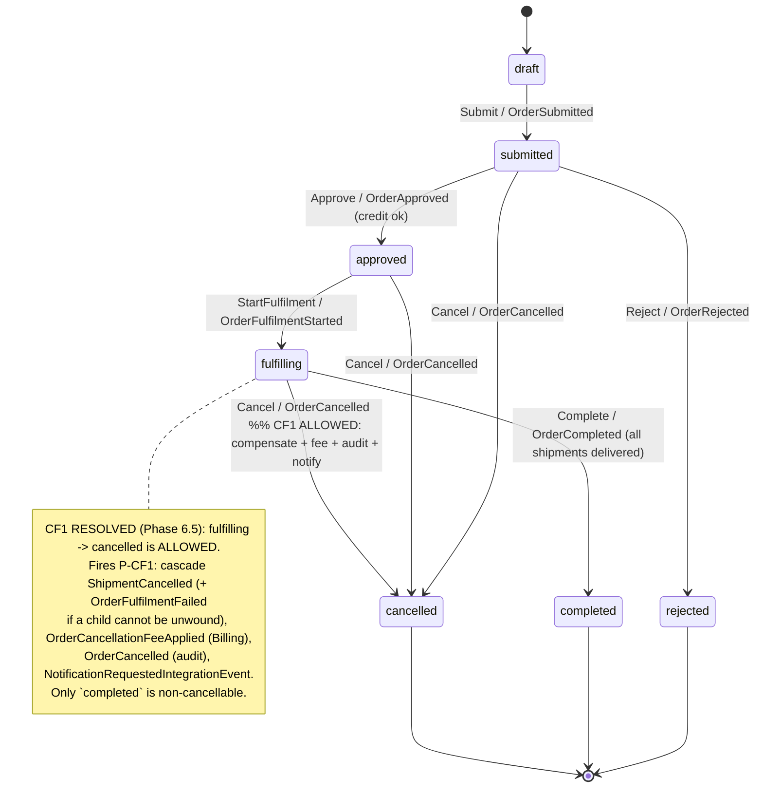
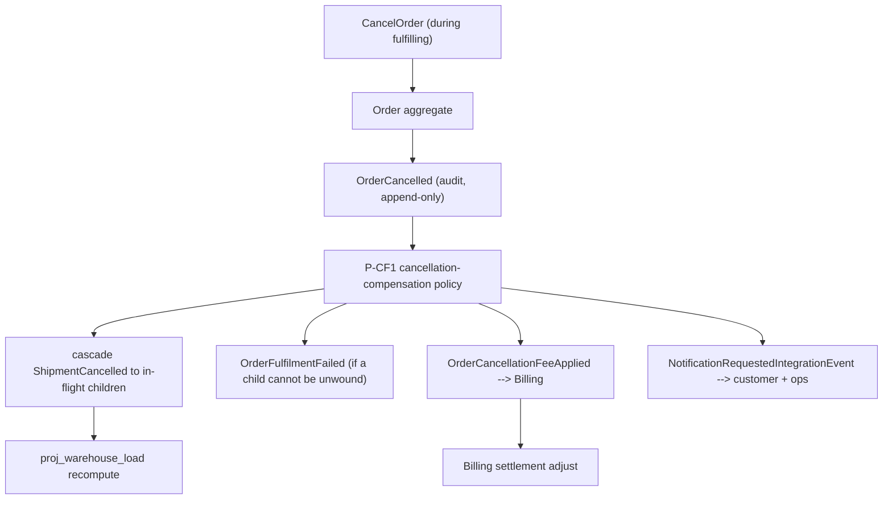
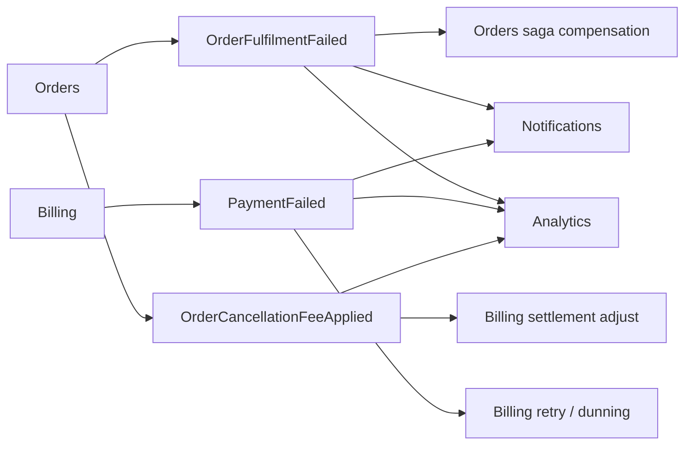
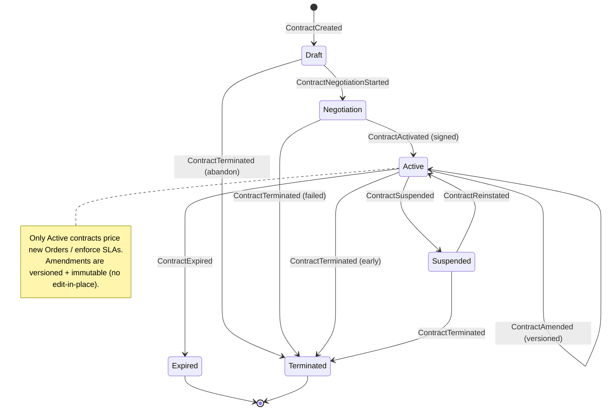
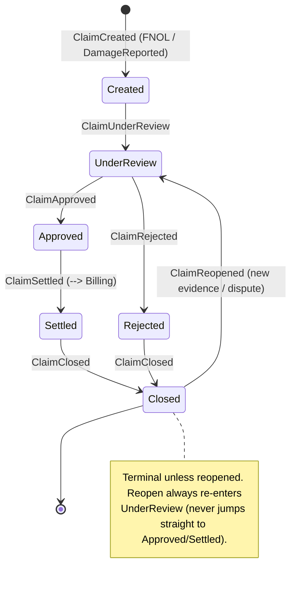
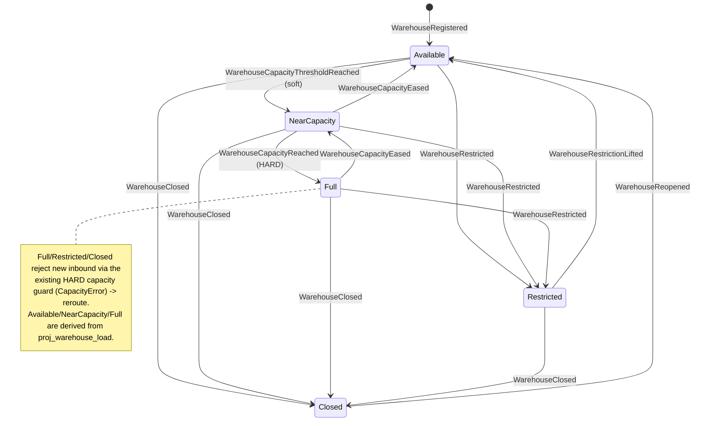

# Phase 6.5 — Reconciliation & Closure (Mesaar Logistics Operations Platform)

> **Status:** Closure deliverable — **documentation only** (no code, SQL, ORM, or APIs). Produced 2026-06-22.
> **Purpose:** Resolve the remaining blockers from `docs/09-final-domain-model.md` before the **Phase 7 Final ERD Review**: ratify the CF1 (Order-cancel) resolution, add the missing events, create the three missing state machines, author the Project Vision, amend ADR-007, and issue the final readiness verdict.
> **Discipline:** *reconcile, don't redesign.* Each change below was **applied on disk** to the source documents; this file is the authoritative record of what changed and why.

## Executive summary

| Closure item | Type | Status |
|---|---|---|
| **CF1 / C-1** — Order `fulfilling → cancelled` | CRITICAL conflict | ✅ **Resolved** — allowed, with compensation + fee + audit + notification |
| **CF2 / B4** — 3 events double-owned (Shipments vs Tracking) | CRITICAL conflict | ✅ **Resolved** — owner = Tracking (authoritative table corrected) |
| **PaymentFailed**, **OrderFulfilmentFailed** | Missing events | ✅ **Added** (+ `OrderCancellationFeeApplied` from CF1) |
| **Contract / Claim / Warehouse** state machines | Missing/draft machines | ✅ **Created** (Mermaid below) |
| **`01-project-vision.md`** | Missing artifact | ✅ **Authored** |
| **ADR-007** Migration + Rollback | ADR gap | ✅ **Amended** |
| **ADR-006 / B5 / CF10** — projection tenancy | Tenant-boundary gap | ✅ **Amended** (tenant_id + RLS) |
| **CF3 / W-2** — stale event catalog | Doc drift | ✅ **Superseded banner added** |
| **CF9 / TD2** — cascade-delete carve-out | Audit violation | ✅ **Removed** |
| **B2** tenancy build · **B3** event-store build | Build-state blockers | ⛔ **Remain** (Phase-5 M1/M2 — cannot be closed by documentation) |

**Verdict:** all **design-level** blockers are resolved. The only items still open are **build-state** (actually creating the multi-tenant + event-store schema in Phase 5 M1/M2), which the Final ERD Review will *specify* (target ERD) rather than be blocked by. **Phase 7 Final ERD Review is cleared to proceed.**

---

## Task 1 — CF1 resolution: Order `fulfilling → cancelled` (APPROVED)

**Decision (ratified).** An Order **may be cancelled from `fulfilling`** (as well as from `submitted`/`approved`). Only `completed` is non-cancellable. This ends the C-1 self-contradiction (`docs/04` §2.8 prose said "not cancellable once fulfilling"; the §4.2 table/diagram allowed it). The prose, the transition table, the exceptions table, and the diagram in `docs/04` were all corrected to this single rule.

**A `fulfilling → cancelled` MUST trigger four effects** (the cancellation policy **P-CF1**):

| # | Required effect | Mechanism | Event |
|---|---|---|---|
| 1 | **Compensation workflow** | Cascade-cancel every in-flight child Shipment; if a child cannot be unwound (already `delivered`/in irreversible transit), emit a fulfilment-failure for reconciliation. | `ShipmentCancelled` (per child) · `OrderFulfilmentFailed` (if un-unwindable) |
| 2 | **Cancellation fee** | Apply the contract/policy cancellation charge to Billing settlement (fee basis carried in payload). | `OrderCancellationFeeApplied` → Billing |
| 3 | **Audit event** | The cancellation is recorded immutably in the event store / audit log (actor, reason, timestamp). | `OrderCancelled` (append-only; ADR-007) |
| 4 | **Notification** | Notify the customer + ops of the cancellation and fee. | `NotificationRequestedIntegrationEvent` |

**New event introduced by this task:** `OrderCancellationFeeApplied` (producer **Orders**, consumer **Billing**; payload: `order_id`, `fee_amount`, `currency`, `basis`, `cancelled_at`). It is the explicit "Cancellation Fee" trigger required by Task 1.

### Updated Order state machine (authoritative)

### Cancellation compensation flow (P-CF1)

**Documents updated for Task 1:** `docs/04` §2.8 (line 567 prose), §4.2.1 (cancelled state), §4.2.2 (transition table), §4.2.5 (exceptions), §4.2.6 (diagram); `docs/06` §B.2 (C-1 → RESOLVED), §B.3 (CRITICAL: 0), §G.3 (B-3 closed); `docs/09` (closure banner).

---

## Task 2 — Missing events added

Three events are now in the **canonical catalog** (`docs/04` Part 3 §5 + §2.4; consolidated in `docs/09` §5). Envelope per ADR-007 (`event_id` UUIDv7, `tenant_id`, `aggregate_type/id`, `aggregate_version`, `occurred_at`, `correlation_id`, `causation_id`, `payload`).

| Event | Producer | Consumer(s) | Payload (key) | Business meaning |
|---|---|---|---|---|
| **`PaymentFailed`** | Billing | Billing (retry/dunning), Orders, Notifications, Analytics | `invoice_id`, `order_id`, `amount`, `currency`, `reason`, `attempt` | A settlement/payment attempt failed — the Billing unhappy path (closes `docs/06` §D.2). Drives retry/backoff + notification; never silently lost. |
| **`OrderFulfilmentFailed`** | Orders | Orders (saga compensation), Notifications, Analytics | `order_id`, `failed_shipment_ids[]`, `reason` | The order fan-out could not complete (partial/total failure). Drives the Orders saga compensation/abort path (closes `docs/06` §D.2). |
| **`OrderCancellationFeeApplied`** | Orders | Billing (settlement adjust), Analytics | `order_id`, `fee_amount`, `currency`, `basis`, `cancelled_at` | The cancellation fee charged when an Order is cancelled (Task 1 / P-CF1). |

### Event-map deltas

- **Orders** now emits: …, `OrderFulfilmentFailed`, `OrderCancellationFeeApplied` (and consumes `ShipmentFailed`).
- **Billing** now emits: …, `PaymentFailed` (and consumes `OrderCancellationFeeApplied`).

### CQRS treatment (ADR-004 / ADR-006 / ADR-007)

These follow the platform's CQRS-lite + outbox model unchanged — they are **write-side domain facts**, not read models:

1. **Emit on transition:** each is appended to the unified `event_store` **in the same transaction** as the aggregate state change (no dual-write; ADR-007 §3).
2. **Publish via outbox:** the relay publishes to Celery/Redis; consumers are **at-least-once** and **idempotent** on `event_id` (`processed_events`).
3. **Projections (read side, ADR-006):** `PaymentFailed` → a billing/settlement-status projection + dunning worker; `OrderFulfilmentFailed` → the order-status projection + exception center; `OrderCancellationFeeApplied` → billing settlement + `proj_driver_daily_stats`/revenue KPIs. All `proj_*` are tenant-scoped + RLS (ADR-006 Phase 6.5 amendment).
4. **Compensation, not mutation:** all three are **new events**; no history is edited (BR-H-24 / ADR-004 compensating-event rule).

**Documents updated for Task 2:** `docs/04` Part 3 §5 (Orders + Billing rows), §2.4 (Orders + Billing inventories); `docs/event-catalog.md` (supersede banner pointing here); `docs/06` §D.2 (both marked ADDED); ADR-006 (canonical source-event names, CF14).

---

## Task 3 — New state machines

Three machines that were **draft or absent** in the corpus are now canonical. Each lists States · Allowed Transitions · Invalid Transitions · Compensation · Business Rules + Mermaid. The states are exactly those mandated by the Phase-6.5 brief.

### 3.1 Contract state machine (was **ABSENT** — Contract Mgmt #14)

`Draft → Negotiation → Active → {Suspended ⇄ Active} → {Expired | Terminated}`. Owned by **Contract Management (#14)**; gates pricing/SLA for Orders & Billing.

**States.** `Draft` (composing terms), `Negotiation` (counterparty review/redlining), `Active` (signed, in force), `Suspended` (temporarily on hold — breach/credit/dispute), `Expired` (end of term, terminal), `Terminated` (ended early, terminal).

**Allowed transitions.**

| From | To | Trigger / event | Guard |
|---|---|---|---|
| `Draft` | `Negotiation` | Submit / `ContractNegotiationStarted` | Required terms + counterparty present. |
| `Draft` | `Terminated` | Abandon / `ContractTerminated` | Withdrawn before signing. |
| `Negotiation` | `Active` | Sign / `ContractActivated` | Both parties accept; validity window set. |
| `Negotiation` | `Terminated` | Abandon / `ContractTerminated` | Negotiation failed. |
| `Active` | `Active` | Amend / `ContractAmended` | Versioned, immutable amendment (no edit-in-place). |
| `Active` | `Suspended` | Suspend / `ContractSuspended` | Breach / credit / dispute hold. |
| `Suspended` | `Active` | Reinstate / `ContractReinstated` | Cause cleared. |
| `Active` | `Expired` | Term end / `ContractExpired` | Validity window elapsed. |
| `Active` | `Terminated` | Terminate / `ContractTerminated` | Early termination (with penalties). |
| `Suspended` | `Terminated` | Terminate / `ContractTerminated` | Terminated while suspended. |

**Invalid transitions.** `Expired`/`Terminated` → anything (terminal immutability); `Active` → `Draft`/`Negotiation` (no regression); `Draft` → `Active` (must be negotiated/signed); `Suspended` → `Expired` (reinstate or terminate first).

**Compensation.** Termination/expiry closes linked `RentalContract`s, settles outstanding `SLAPenaltyApplied`, and triggers Billing reconciliation; `Suspended` freezes new pricing but preserves in-flight orders.

**Business rules.** Only an **`Active`** contract may price new Orders / define enforceable SLAs; `Suspended` blocks **new** orders but not in-flight execution; amendments are **versioned and immutable** (ADR-004); terminal states are immutable.

### 3.2 Claim state machine (supersedes the `docs/08` draft — Insurance & Claims #17)

Canonical: `Created → UnderReview → {Approved → Settled | Rejected} → Closed`, with `Closed → UnderReview` reopen. **Supersedes** the earlier `docs/08` §5.2 draft (`reported/under_assessment/settled/reopened`); `docs/08` now points here. Owned by **Insurance & Claims (#17)**.

**States.** `Created` (FNOL filed), `UnderReview` (surveyor/insurer assessment + coverage match), `Approved` (liability/coverage accepted), `Rejected` (denied), `Settled` (payout/settlement executed), `Closed` (terminal — resolved & reconciled).

**Allowed transitions.**

| From | To | Trigger / event | Guard |
|---|---|---|---|
| `Created` | `UnderReview` | Start assessment / `ClaimUnderReview` | Policy + incident reference present; reserve set. |
| `UnderReview` | `Approved` | Approve / `ClaimApproved` | Coverage matches; liability accepted. |
| `UnderReview` | `Rejected` | Reject / `ClaimRejected` | No coverage / out of policy. |
| `Approved` | `Settled` | Settle / `ClaimSettled` | Payout/settlement executed → Billing. |
| `Settled` | `Closed` | Close / `ClaimClosed` | Reconciled; nothing outstanding. |
| `Rejected` | `Closed` | Close / `ClaimClosed` | Denial communicated; appeal window elapsed. |
| `Closed` | `UnderReview` | Reopen / `ClaimReopened` | New evidence / dispute (compensating). |

**Invalid transitions.** `Created` → `Approved`/`Settled` (must be reviewed); `Rejected` → `Approved` directly (must `Reopen` → `UnderReview`); `Closed` → `Approved`/`Settled` directly (reopen first); `Settled` → `Rejected`.

**Compensation.** `Approved`/`Settled` drive a Billing settlement/recovery (subrogation via `LiabilityRecord`); `Reopen` is the compensating path for disputes/new evidence; a damage event (`DamageReported`) originates the claim.

**Business rules.** A claim requires a referenced `InsurancePolicy` + incident (`Shipment`/`Equipment`); settlement feeds Billing (#11) and loss-ratio analytics (#12); liability/at-fault recorded before close; `Closed` is terminal unless reopened.

### 3.3 Warehouse state machine (was **ABSENT** — Warehouse Mgmt #8)

An **operational availability machine** layered over the (already-enforced, HARD) weight/volume capacity invariants. Available/NearCapacity/Full are **derived from `proj_warehouse_load`**; Restricted/Closed are **admin/compliance** states.

**States.** `Available` (accepting inbound, below soft threshold), `NearCapacity` (≥ soft threshold, e.g. `max_daily_shipments` or % capacity — still accepting), `Full` (at hard weight/volume capacity — **blocks new inbound**), `Restricted` (admin/compliance hold — limited/blocked ops), `Closed` (out of service — all ops blocked).

**Allowed transitions.**

| From | To | Trigger / event | Guard |
|---|---|---|---|
| `Available` | `NearCapacity` | load ≥ soft threshold / `WarehouseCapacityThresholdReached` | Derived from `proj_warehouse_load`. |
| `NearCapacity` | `Full` | load = hard capacity / `WarehouseCapacityReached` | HARD weight/volume limit hit. |
| `Full` | `NearCapacity` | load drops below hard / `WarehouseCapacityEased` | Outbound dispatch frees capacity. |
| `NearCapacity` | `Available` | load < soft threshold / `WarehouseCapacityEased` | — |
| `Available`/`NearCapacity`/`Full` | `Restricted` | Restrict / `WarehouseRestricted` | Admin/compliance hold (HSE, audit). |
| `Restricted` | `Available` | Lift / `WarehouseRestrictionLifted` | Re-evaluate live load on lift. |
| `Available`/`NearCapacity`/`Full`/`Restricted` | `Closed` | Close / `WarehouseClosed` | Decommission / temporary closure. |
| `Closed` | `Available` | Reopen / `WarehouseReopened` | Returns to service; load re-derived. |

**Invalid transitions.** Inbound create/assign targeting `Full`/`Restricted`/`Closed` (HARD capacity/availability guard → reject, reroute); `Closed` → `NearCapacity`/`Full`/`Restricted` directly (reopen to `Available` first, then re-derive).

**Compensation.** When a node is `Full`/`Restricted`/`Closed`, the existing HARD capacity guard rejects the create/assign (`CapacityError`) and dispatch reroutes to another node — no partial commit.

**Business rules.** Inbound accepted only in `Available`/`NearCapacity`; `Full` blocks new inbound (HARD weight/volume, already enforced in `ShipmentService`); `Restricted` blocks per compliance; `Closed` blocks all. `NearCapacity` is the **soft** `max_daily_shipments`/threshold signal (advisory + alert).

> **Naming note.** The capacity-signal events above use a **Warehouse** prefix (`WarehouseCapacity*`), correcting the `<Aggregate><PastTenseVerb>` violation flagged in CF6 for the legacy `ShipmentReceivedAtWarehouse`/`ShipmentDispatchedFromWarehouse`; `WarehouseCapacityExceeded` remains a **command-rejection signal** (CapacityError), not a committed domain event.

---

## Task 4 — Project Vision (created)

**`docs/01-project-vision.md`** has been authored, closing the long-standing gap (`docs/06` A.1 #1; Phase-6 ABSENT ledger). It documents **Mission, Vision, Business Objectives (O1–O7), Target Customers, Competitive Positioning, and Success Metrics**, grounded in the corpus (heavy-equipment logistics for Aramco/SABIC/NEOM/EPC/mining; KSA + Arabic-RTL; multi-tenant; event-sourced; AI-ready; "exceed Uber Freight" via heavy-equipment + compliance specialization). See that file for the full content. *(Recommended minor follow-up: point the bare `README.md` at `docs/01-project-vision.md`.)*

---

## Task 5 — ADR-007 amended

**`ADR-007`** now carries a **Migration Plan** and a **Rollback Plan** (the two gaps the audit flagged in `docs/06` §C.2). Highlights:

- **Migration:** additive, zero-downtime, Alembic-safe, **after M1 (tenancy)** — schema (additive) → dual-write behind `EVENT_STORE_ENABLED` → optional bounded backfill → relay rollout (one idempotent consumer at a time) → projection cutover → enforce.
- **Rollback:** every step independently reversible; **the aggregate stays the source of truth**, so disabling the event path never loses business state; **rollback = stop appending/publishing, never DELETE committed events** (append-only / BR-H-24). Includes a per-failure rollback table.

Status line updated to note the 2026-06-22 amendment. ADR-007 remains **Accepted** (additive amendment, not a reversal).

---

## Task 6 — Final Readiness Report (Phase 7 gate)

Legend: **PASS** = resolved/ready · **WARNING** = non-blocking; tidy-up or build-time verification · **CRITICAL** = blocks, must be addressed.

### 6.1 Blocker / conflict disposition

| ID | Item | Prior severity | Status now | Note |
|---|---|---|---|---|
| C-1 / CF1 | Order `fulfilling → cancelled` contradiction | CRITICAL | **PASS** | Allowed + compensation + fee + audit + notify (Task 1). |
| CF2 / B-4 | 3 events double-owned (Shipments vs Tracking) | CRITICAL | **PASS** | Owner = Tracking; `docs/04` Part 3 §5 ownership table corrected; `docs/09` §4 aligned. |
| D.2-a | `PaymentFailed` missing | — | **PASS** | Added (Task 2). |
| D.2-b | `OrderFulfilmentFailed` missing | — | **PASS** | Added (Task 2). |
| Ledger | Contract state machine ABSENT | — | **PASS** | Created (§3.1). |
| Ledger | Warehouse state machine ABSENT | — | **PASS** | Created (§3.3). |
| docs/08 | Claim state machine draft/inconsistent | — | **PASS** | Canonical machine (§3.2); `docs/08` points here. |
| A.1 #1 | `01 Project Vision` missing | — | **PASS** | Authored (Task 4). |
| C.2 | ADR-007 missing Migration/Rollback | WARNING | **PASS** | Amended (Task 5). |
| B-5 / CF10 | Projection tables lack tenant_id/RLS | WARNING | **PASS** | ADR-006 amended (tenant_id + RLS + GUC). |
| CF3 / W-2 | Stale event catalog, no supersede banner | WARNING | **PASS** | Supersede banner added to `event-catalog.md`. |
| CF9 / TD2 | Cascade-delete carve-out vs append-only | WARNING | **PASS** | Carve-out removed. |
| CF14 | ADR-006 non-canonical source-event names | WARNING | **PASS** | Normalized in the ADR-006 amendment. |
| **B-1 / W-1** | **Multi-tenancy unbuilt** (`tenant_id` + RLS + isolation test) | **CRITICAL (build)** | ⛔ **CRITICAL — remains** | Design complete (ADR-001); **build = Phase-5 M1**. Not closable by docs. |
| **B-2 / B-3** | **Event store + outbox unbuilt** | **CRITICAL (build)** | ⛔ **CRITICAL — remains** | Design + migration/rollback complete (ADR-007); **build = Phase-5 M2**. |
| B-5(test) | Pooled-conn `SET LOCAL` unverified | CRITICAL (test) | **WARNING** | Design closed; **verification = M1 isolation test**. |
| CF6/CF7/CF8/CF12 | Naming + context-inventory tidy-ups | WARNING | **WARNING** | Non-blocking doc hygiene; partially applied (Warehouse/Equipment naming noted). |

### 6.2 Readiness for the Final ERD Review

| Dimension | Verdict | Basis |
|---|---|---|
| Domain completeness | **PASS** | 17 contexts modelled; all state machines now exist (incl. Contract/Claim/Warehouse). |
| Event completeness | **PASS** | Canonical catalog complete incl. the unhappy-path events; one owner per event; supersede banner in place. |
| Aggregate completeness | **PASS** | Ownership unambiguous (Assignment = part of Shipment; OperatorCertification = Compliance; events single-owner). |
| State-machine completeness | **PASS** | Shipment, Vehicle, Driver, Equipment, Order, Permit, Claim, Contract, Warehouse all specified. |
| Multi-tenant readiness | **WARNING** | Design complete (ADR-001 + ADR-006 amendment); **build is M1** — the target ERD must carry `tenant_id` + RLS on every table incl. `proj_*`. |
| Event-store / audit readiness | **WARNING** | Design + migration/rollback complete (ADR-007); **build is M2** — the target ERD must include `event_store`/`processed_events`/`audit_log`. |
| AI readiness | **PASS (design)** | Substrate designed; serving deferred to ADR-010 (non-blocking for ERD). |

**Overall verdict: ✅ CLEARED for Phase 7 Final ERD Review.** No design-level CRITICAL conflicts remain. The two CRITICAL items still open (**B-1 tenancy build, B-2/B-3 event-store build**) are **execution-phase (M1/M2)**; the ERD review's job is precisely to ratify the *target* ERD that those milestones will build — so they are inputs to the review, not blockers of it. The build must still land M1→M2 before any new aggregate table is created.

---

## Documents updated in Phase 6.5

| File | Change |
|---|---|
| `docs/01-project-vision.md` | **Created** (Task 4). |
| `docs/09a-reconciliation-and-closure.md` | **Created** (this file). |
| `docs/04-event-storming-and-state-machines.md` | CF1 resolution (§2.8, §4.2.1/2/5/6); added `PaymentFailed`/`OrderFulfilmentFailed`/`OrderCancellationFeeApplied` (Part 3 §5 + §2.4); CF2 ownership fix (Shipments emitted row). |
| `docs/adr/ADR-007-uuidv7-event-store-outbox.md` | Added **Migration Plan** + **Rollback Plan**; status amended. |
| `docs/adr/ADR-006-read-models.md` | Projection **tenancy** (tenant_id + RLS + GUC); canonical source-event names. |
| `docs/06-architecture-audit-and-readiness.md` | C-1 → RESOLVED (§B.2/§B.3); D.2 events → ADDED; G.3 B-3 → closed. |
| `docs/event-catalog.md` | Supersede banner (CF3/W-2); cascade-delete carve-out removed (CF9). |
| `docs/08-heavy-equipment-domain-design.md` | Claim machine → points to canonical (§3.2). |
| `docs/09-final-domain-model.md` | Phase-6.5 closure banner. |

---

*End of Phase 6.5 — Reconciliation & Closure. All design-level blockers resolved; build-state blockers (M1 tenancy, M2 event store) carried into Phase 5 execution. **Awaiting approval to proceed to the Phase 7 Final ERD Review.***
