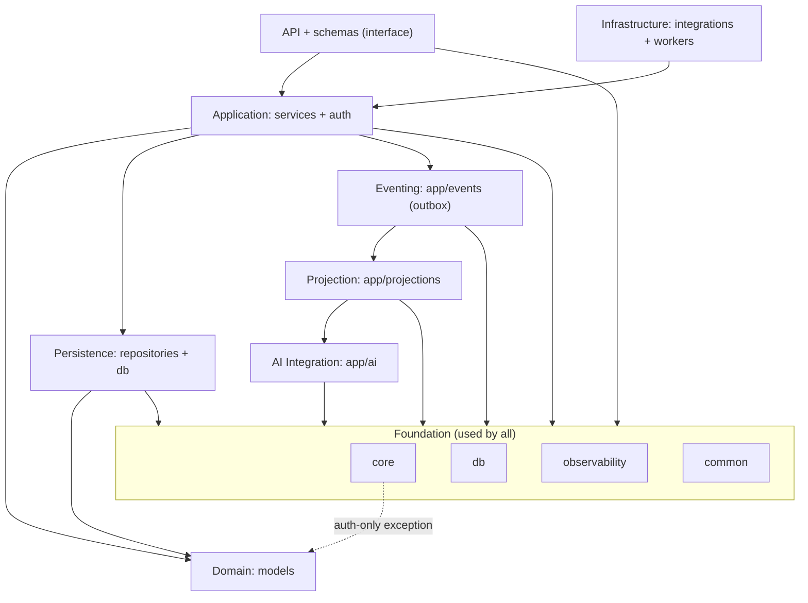
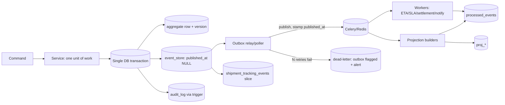
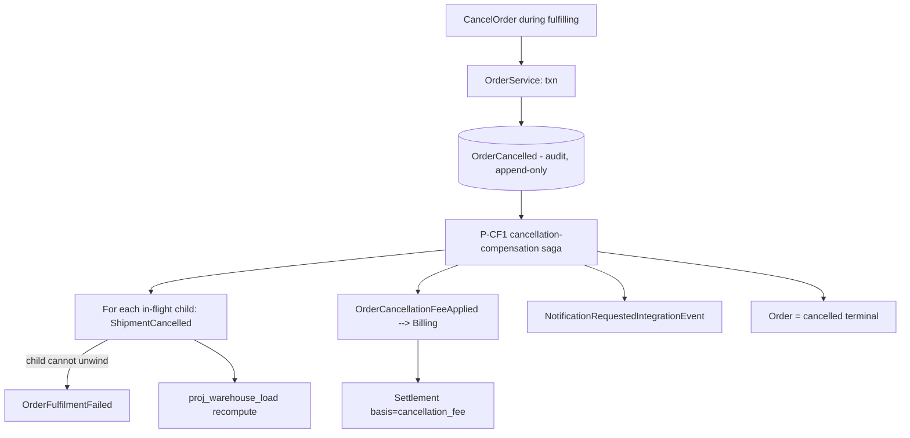

# Phase 8 — Backend Architecture & Implementation Blueprint (Mesaar)

> **Status:** Backend architecture & implementation blueprint — **documentation only** (no code, SQL, ORM, DDL, or implementation). Produced 2026-06-22.
> **Purpose:** Turn the frozen domain + database design into a build-ready backend blueprint: column-spec the `[STRUCTURAL]` tables, then define context architecture, layering, CQRS, API, eventing, tenancy, security, consistency, AI, observability, and the readiness gate.
> **Locked-phase discipline:** **extends** `docs/05-backend-architecture.md` (Phase 5A) without renaming packages or refactoring imports; **does not change** frozen aggregate ownership, relationships, tenancy, or the event-store model (`docs/03`/`docs/09`/`docs/10`). Where this doc adds detail it is **additive**.
> **Data-type notation** below (`uuid`, `varchar+check`, `numeric(12,2)`, `timestamptz`, `jsonb`, `vector`) is the conceptual type vocabulary from `docs/03` §0 — **not DDL**. No `CREATE`/`ALTER` appears anywhere.

**Inputs:** `docs/01`–`docs/04`, `docs/05` (package structure), `docs/06`–`docs/10`, ADR-001…009.

---

## 1. Column-Spec Completion (closes Phase-7 condition W-COL)

This completes backend-ready columns for every `[STRUCTURAL]` table from `docs/10` §2, **without** changing aggregate boundaries, relationships, the tenancy model, or the event-store model. Already-`[COLUMN-SPEC]` tables (Shipments, Tracking, Fleet, Warehouses core, event/audit/projection/AI) stay as `docs/03` defines them; only their **additive** columns are noted.

**Ⓐ Standard aggregate envelope** (every aggregate root table carries these; do not repeat per table): `id uuid PK` (UUIDv7 for append-heavy), `tenant_id uuid NOT NULL FK→tenants` (RLS, RESTRICT), `created_at/updated_at timestamptz`, `created_by/updated_by uuid`, `version int ≥1` (optimistic lock), `deleted_at timestamptz NULL` (soft-delete). Owned **child** tables carry `id`, `tenant_id`, `created_at/updated_at` and drop `version`/`deleted_at` unless they have an independent lifecycle. Money = `numeric(12,2)` + `currency_code char(3) ~ '^[A-Z]{3}$'`; enums = `varchar + CHECK`; geo = `numeric(9,6)` → PostGIS later (`docs/03` §0/§9.5). **Audit fields** = `created_by/updated_by/version` + the row-trigger `audit_log` (§6). **All FKs are indexed** (`docs/03` §3.3 caveat).

### 1.1 Customers (Customer Mgmt #2)
**`customers`** — purpose: shipper/counterparty org + credit standing. PK `id`; Ⓐ. FKs: `tenant_id`. Domain cols: `name`, `legal_name`, `customer_code` (uq `(tenant_id, customer_code)`), `status varchar+check {active|suspended|inactive}` (lifecycle), `credit_limit numeric(12,2)`, `credit_currency char(3)`, `credit_status varchar+check {ok|hold|exceeded}`, `default_terms jsonb`. Constraints: status/credit_status enums; `credit_limit ≥ 0`. Index intent: `(tenant_id, status)`; uq `(tenant_id, customer_code)`; GIN `pg_trgm(name)`. Owner: #2.
**`customer_contacts`** (child) — PK `id`; `tenant_id`, `customer_id FK→customers CASCADE`, `name`, `email`, `phone`, `role`, `is_primary bool`, `billing_address jsonb`. uq `(tenant_id, customer_id, lower(email))`. Index `(tenant_id, customer_id)`.

### 1.2 Orders (Orders #3)
**`orders`** — commercial request that fans out to shipments. PK `id`; Ⓐ. FKs: `tenant_id`, `customer_id FK→customers RESTRICT`, `contract_id FK→contracts SET NULL (nullable)`. Domain cols: `order_ref` (uq `(tenant_id, order_ref)`), `status varchar+check {draft|submitted|approved|rejected|fulfilling|completed|cancelled}`, `total_amount numeric(12,2)`, `currency_code char(3)`, `requested_pickup_at`, `requested_delivery_at`, `approved_at`, `cancelled_at`, `cancellation_reason`, `cancellation_fee numeric(12,2) NULL` (CF1). Constraints: status enum; money ≥ 0; currency shape; temporal sanity (`approved_at ≥ created_at`, etc.). Index: `(tenant_id, status)` **partial** WHERE not terminal; `(tenant_id, customer_id)`; uq `(tenant_id, order_ref)`. Owner: #3.
**`order_lines`** (child) — PK `id`; `tenant_id`, `order_id FK→orders CASCADE`, `line_no`, `description`, `quantity numeric(12,2)`, `weight_kg numeric(12,2)`, `volume_m3 numeric(12,3)`, `equipment_model_id FK→equipment_models SET NULL (nullable)`, `unit_price numeric(12,2)`, `currency_code`. uq `(tenant_id, order_id, line_no)`.

### 1.3 Shipments (#4) — *already `[COLUMN-SPEC]` in `docs/03` §1; additive only*
Additive FKs (Phase 7): `order_id FK→orders SET NULL (nullable)`, `equipment_id FK→equipment SET NULL (nullable)`. No change to the 8-state `status`, exclusivity partial-uniques, capacity, or `version`. Existing audit/tenant/soft-delete per `docs/03`.

### 1.4 Equipment (Equipment & Asset #15)
**`equipment_categories`** — PK `id` (UUIDv4, low-churn); `tenant_id`, `parent_id FK→self NULL` (extensible tree), `code` (uq `(tenant_id, code)`), `name`, `family_code`. Guard tree depth/loops in service.
**`equipment_models`** — PK `id` (UUIDv4); `tenant_id`, `equipment_category_id FK`, `make`, `model`, `model_year`, `default_specs jsonb` (dimensions/weight/power), `default_rental_rate jsonb` (ref → Contract). uq `(tenant_id, make, model, model_year)`.
**`equipment`** — PK `id`; Ⓐ. FKs: `tenant_id`, `equipment_model_id FK RESTRICT`, `home_warehouse_id FK→warehouses SET NULL (nullable)`. Domain cols: `asset_tag` (uq `(tenant_id, asset_tag)`), `serial_vin`, `ownership varchar+check {owned|leased}`, `status varchar+check {Available|Reserved|Assigned|InTransit|Delivered|Returned|Maintenance|OutOfService}` (lifecycle, `docs/08` §6.1), `condition_grade`, `last_inspection_at`, `hours_odometer numeric`, `oversize_class jsonb` (derived, point-in-time). Index: `(tenant_id, status)` partial WHERE `status='Available'`; uq `(tenant_id, asset_tag)`. Owner: #15.

### 1.5 Contracts (Contract Mgmt #14) — states per `docs/09a` §3.1
**`contracts`** — PK `id`; Ⓐ. FKs: `tenant_id`, `customer_id FK RESTRICT`. Cols: `contract_no` (uq), `type`, `status varchar+check {Draft|Negotiation|Active|Suspended|Expired|Terminated}`, `valid_from`, `valid_to`, `signed_at`, `terminated_at`, `termination_reason`. Index `(tenant_id, status)`, uq `(tenant_id, contract_no)`. Owner: #14.
**`rental_contracts`** (child) — `id`, `tenant_id`, `contract_id FK CASCADE`, `equipment_id FK→equipment RESTRICT`, `hire_start`, `hire_end`, `rate numeric(12,2)`, `currency_code`, `mobilization jsonb`, `status` (mirrors hire).
**`pricing_rules`** — `id`, `tenant_id`, `contract_id FK CASCADE`, `rule_type`, `scope jsonb` (lane/surcharge), `rate numeric(12,2)`, `currency_code`, `valid_from/to`.
**`slas`** — `id`, `tenant_id`, `contract_id FK CASCADE`, `metric`, `target`, `window`, `penalty_id FK→penalties SET NULL`.
**`penalties`** — `id`, `tenant_id`, `contract_id FK CASCADE`, `sla_id FK→slas NULL`, `basis`, `amount numeric(12,2)`/`percent numeric(5,2)`, `currency_code`.
**`carrier_agreements`** — `id`, `tenant_id`, `contract_id FK CASCADE`, `carrier_ref`, `terms jsonb`, `status`.

### 1.6 Claims (Insurance & Claims #17) — states per `docs/09a` §3.2
**`insurance_policies`** — PK `id`; Ⓐ. FKs: `tenant_id`, `contract_id FK SET NULL (nullable)`, `equipment_id FK SET NULL (nullable)`. Cols: `policy_no` (uq), `insurer`, `type`, `insured_value numeric(12,2)`, `premium numeric(12,2)`, `currency_code`, `valid_from/to`. Owner: #17.
**`coverage_rules`** (child) — `id`, `tenant_id`, `insurance_policy_id FK CASCADE`, `per_incident_limit numeric(12,2)`, `aggregate_limit numeric(12,2)`, `deductible numeric(12,2)`, `exclusions jsonb`, `covered_perils jsonb`, `territory`.
**`claims`** — PK `id`; Ⓐ. FKs: `tenant_id`, `insurance_policy_id FK RESTRICT`, `shipment_id FK→shipments SET NULL (nullable)`, `equipment_id FK→equipment SET NULL (nullable)`. Cols: `claim_no` (uq), `status varchar+check {Created|UnderReview|Approved|Rejected|Settled|Closed}`, `reserve_amount numeric(12,2)`, `approved_amount numeric(12,2) NULL`, `currency_code`, `fnol_at`, `closed_at`. Index `(tenant_id, status)`, uq `(tenant_id, claim_no)`. Owner: #17.
**`damage_reports`** (child) — `id`, `tenant_id`, `claim_id FK CASCADE`, `incident_at`, `location jsonb`, `description`, `evidence_url`, `condition_delta jsonb`.
**`liability_records`** (child) — `id`, `tenant_id`, `claim_id FK CASCADE`, `at_fault_party varchar+check {carrier|driver|operator|third_party|customer}`, `subrogation jsonb`, `recovery_amount numeric(12,2)`, `currency_code`.

### 1.7 Permits (Compliance & Permits #16)
**`permits`** — PK `id`; Ⓐ. FKs: `tenant_id`, `shipment_id FK RESTRICT`, `equipment_id FK SET NULL (nullable)`. Cols: `permit_no` (uq), `permit_class`, `issuing_authority`, `status varchar+check {draft|requested|under_review|approved|rejected|active|expired|revoked}`, `valid_from/to`, `conditions jsonb`. Index `(tenant_id, status)` partial active; `(tenant_id, shipment_id)`. Owner: #16. **Gate:** an `approved`/`active` permit is a HARD precondition for shipment `assigned→in_transit`.
**`escorts`** — `id`, `tenant_id`, `shipment_id FK CASCADE`, `escort_type`, `pilot_car_count int`, `status`, `assigned_at`.
**`axle_weight_profiles`** — `id`, `tenant_id`, `equipment_id FK CASCADE`, `per_axle_loads jsonb`, `axle_spacing jsonb`, `gcw numeric(12,2)`.
**`route_restrictions`** — `id`, `tenant_id`, `restriction_type varchar+check {height|weight|bridge|tunnel|hazard|surface}`, `geo numeric(9,6)`→PostGIS, `segment_ref`, `limit_value numeric`, `units`, `conditions jsonb`. GiST when PostGIS lands.
**`compliance_rules`** — `id`, `tenant_id`, `rule_code` (uq), `rule_class varchar+check {Hard|Soft}`, `scope jsonb`.
**`compliance_checks`** — `id` (UUIDv7, append-y), `tenant_id`, `shipment_id FK CASCADE`, `result varchar+check {validated|restricted}`, `violations jsonb`, `checked_at`.
**`operator_certifications`** — PK `id`; Ⓐ. FKs: `tenant_id`, `driver_id FK→drivers RESTRICT`. Cols: `cert_type`, `issuing_body`, `certificate_no` (uq `(tenant_id, cert_type, certificate_no)`), `issued_at`, `expires_at`, `status varchar+check {valid|expiring|expired|suspended}`, `evidence_url`. **Sole owner = #16**; Driver #6 reads for eligibility. Index `(tenant_id, expires_at)` partial WHERE not expired (sweep).

### 1.8 Tracking (#9) — *already `[COLUMN-SPEC]` (`docs/03`)*; no change. Append-only, partitioned, monotonic `event_time`.

### 1.9 Fleet (#5) — *already `[COLUMN-SPEC]`*; additive: build the `VehicleStatus` transition guard (W-3); no column change.

### 1.10 Warehouses (#8) — *core `[COLUMN-SPEC]`*; additive ops machine (`docs/09a` §3.3): add stored `availability_status varchar+check {available|restricted|closed}` (admin). The capacity tiers `NearCapacity`/`Full` are **derived** from `proj_warehouse_load` (not stored) + soft `max_daily_shipments`. Index `(tenant_id, availability_status)`.

### 1.11 Billing (#11)
**`quotes`** — `id`; Ⓐ. FKs `tenant_id`, `order_id FK SET NULL (nullable)`, `shipment_id FK SET NULL (nullable)`. Cols: `amount numeric(12,2)`, `currency_code`, `valid_until`, `status varchar+check {draft|issued|accepted|expired}`.
**`invoices`** — `id`; Ⓐ. FKs `tenant_id`, `order_id FK RESTRICT`. Cols: `invoice_no` (uq), `amount`, `currency_code`, `status varchar+check {draft|issued|paid|failed|void}`, `issued_at`, `due_at`, `paid_at`. Index `(tenant_id, status)`.
**`settlements`** — `id`; Ⓐ. FKs `tenant_id`, `shipment_id FK SET NULL (nullable)`, `claim_id FK SET NULL (nullable)`. Cols: `basis varchar+check {delivery|return|claim|penalty|cancellation_fee}`, `amount`, `currency_code`, `status`, `settled_at`.
**`payouts`** — `id`; Ⓐ. FKs `tenant_id`, `driver_id FK RESTRICT`. Cols: `period`, `amount`, `currency_code`, `status`, `calculated_at`.

### 1.12 Routes / Route Plans (Route Mgmt #7)
**`routes`** — `id`; Ⓐ. FKs `tenant_id`, `driver_id FK SET NULL`, `vehicle_id FK SET NULL`. Cols: `route_code` (uq), `status varchar+check {created|planned|optimized|started|completed|cancelled}`, `planned_at`, `started_at`, `completed_at`. Owner: #7.
**`route_stops`** (child) — `id`, `tenant_id`, `route_id FK CASCADE`, `seq_no`, `shipment_id FK→shipments SET NULL (nullable)`, `warehouse_id FK→warehouses SET NULL (nullable)`, `stop_type`, `eta`, `status varchar+check {pending|completed|skipped}`. uq `(tenant_id, route_id, seq_no)`.

### 1.13 Notifications (#10, outside the 15 groups but required)
**`notifications`** — `id`, `tenant_id`, `created_at`; `channel varchar+check {push|sms|email}`, `recipient`, `template`, `context jsonb`, `status varchar+check {requested|sent|failed}`, `sent_at`, `failure_reason`. Often integration-only (a delivery ledger).

> **Column-spec result:** all `[STRUCTURAL]` tables now have purpose, PK, FKs, tenant_id, lifecycle/status, audit + soft-delete fields, owning context, conceptual constraints, and indexing intent — **additive to the frozen contract** (no aggregate, relationship, tenancy, or event-store change). This closes Phase-7 **W-COL**.

---

## 2. Backend Bounded Context Architecture

Per context: Responsibility · Aggregates/Entities · Services · Commands · Queries · Domain events · Integration events · External deps · Data ownership · Forbidden deps. (Events are canonical per `docs/04` Part 3 + `docs/09a`.) Maturity: **E**=exists, **P**=planned.

| Context | Responsibility | Aggregates (entities) | App service(s) | Key commands | Key queries | Domain events (emit) | Integration events | External deps | Owns (tables) | Forbidden deps |
|---|---|---|---|---|---|---|---|---|---|---|
| **Identity & Access** (E) | AuthN, RBAC, tenant provisioning | `User` (E), `Tenant`/`Role`/`Permission` (P) | `AuthService`(E), `TenantService`(P) | Register/Activate/Deactivate user, AssignRole, ProvisionTenant | currentUser, listUsers | `UserRegistered/Activated/Deactivated`, `RoleAssigned`, `TenantProvisioned/Suspended` | — | JWT/crypto, Redis (revocation), OTP/Nafath (P) | `tenants`,`users`,(roles/perm) | must not import Orders/Shipments domain |
| **Customer Mgmt** (P) | Counterparty + credit master | `Customer` (+contacts) | `CustomerService` | CreateCustomer, ChangeCreditLimit, DeactivateCustomer | getCustomer, searchCustomers | `CustomerCreated/Updated/Deactivated/CreditLimitChanged` | — | ERP master-data (ACL, P) | `customers`,`customer_contacts` | no reach into Orders tables |
| **Orders** (P) | Commercial intent → fulfilment saga | `Order` (+`OrderLine`) | `OrderService` | CreateOrder, Submit, Approve, Reject, **Cancel**, StartFulfilment | getOrder, listOrders | `OrderCreated/Submitted/Approved/Rejected/Cancelled/FulfilmentStarted/Completed`, **`OrderFulfilmentFailed`**, **`OrderCancellationFeeApplied`** | consumes Billing/Shipment events | — | `orders`,`order_lines` | no direct write to `shipments` (via events/commands) |
| **Shipments** (E) | Physical execution, 8-state lifecycle, assignment | `Shipment` (assignment = cols) | `ShipmentService`(E) | Create, MarkReady, AssignDriver(+Vehicle), ConfirmPickup, Deliver, Fail, Return, Cancel | getShipment, activeShipments, nearbyOffers | `ShipmentCreated/MarkedReady/Assigned/PickedUp/Delivered/Failed/Returned/Cancelled/Delayed` | `SettlementRequestedIntegrationEvent`, `NotificationRequestedIntegrationEvent` | Compliance gate (P), Maps (P) | `shipments` | no reach into Tracking/Driver internals |
| **Tracking** (E) | Append-only history; location/POD/exception | `ShipmentTrackingEvent` | (in `ShipmentService` today; `TrackingService` P) | ReportLocation, CapturePOD, RaiseException | shipmentHistory, lastPosition | **`ShipmentLocationReported`, `ProofOfDeliveryCaptured`, `ShipmentExceptionRaised`** (sole producer, CF2) | — | object storage (POD), GPS | `shipment_tracking_events` | immutable — no update/delete |
| **Fleet** (E) | Vehicle asset lifecycle/capacity | `Vehicle` | `FleetService`(P; guards in `ShipmentService` today) | RegisterVehicle, StartMaintenance, Complete, Decommission | listVehicles, availableVehicles | `VehicleRegistered/Assigned/Released/StatusChanged/MaintenanceStarted/Completed/Decommissioned` | — | telematics (P) | `vehicles` | no shipment lifecycle decisions |
| **Driver Mgmt** (E) | Driver profile, availability, offers | `Driver` | `DriverService`(E) | CreateDriver, GoOnline/Offline, AcceptOffer, Decline, Suspend, Reinstate | nearbyOffers, driverStats | `DriverCreated/WentOnline/WentOffline/Assigned/StatusChanged/Suspended/Reinstated` | offer push (Notifications) | OTP, geo | `drivers` | reads `operator_certifications` read-only |
| **Route Mgmt** (P) | Plan/optimize/sequence stops | `Route` (+`RouteStop`) | `RouteService` | CreateRoute, Plan, Optimize, Start, CompleteStop, Complete, Cancel | getRoute, routeProgress | `RouteCreated/Planned/Optimized/Started/StopCompleted/Completed/Cancelled` | — | Maps/routing (ACL), AI Ops (advisory) | `routes`,`route_stops` | consumes Compliance route validation |
| **Warehouse Mgmt** (E) | Node capacity, receive/dispatch | `Warehouse` | `WarehouseService`(P; inline today) | RegisterWarehouse, Receive, Dispatch, Restrict, Close, Reopen | warehouseLoad, capacity | `WarehouseRegistered`, `WarehouseCapacityThresholdReached/Reached/Eased`, `WarehouseRestricted/RestrictionLifted/Closed/Reopened` | — | WMS/yard (P) | `warehouses` | capacity invariant in service, not model |
| **Equipment & Asset** (P) | Heavy-asset catalog/lifecycle/specs | `Equipment` (+`Model`,`Category`) | `EquipmentService` | OnboardEquipment, Reserve, Assign, Inspect, StartMaintenance, Decommission | availability, specs, oversize | `EquipmentOnboarded/Reserved/ReservationReleased/Assigned/InTransit/Delivered/Returned/Inspected/MaintenanceStarted/Completed/Decommissioned` | — | (reacts to Shipment events) | `equipment*` | **reacts to** Shipment (one-way, ADR-009); AI→Equipment advisory only |
| **Compliance & Permits** (P) | Permits, escorts, route/axle compliance, operator certs | `Permit`,`Escort`,`AxleWeightProfile`,`RouteRestriction`,`ComplianceRule`/`Check`,`OperatorCertification` | `ComplianceService`, `PermitService` | RequestPermit, Approve/Reject, AssignEscort, ValidateRoute, sweepCerts | permitStatus, routeValidation, certExpiry | `PermitRequested/Approved/Rejected/Expiring/Expired/Revoked`, `EscortAssigned`, `RouteValidated/Restricted`, `OperatorCertExpiring/Expired` | permit-authority ACL | jurisdiction data (configurable) | `permits`,`escorts`,`axle_weight_profiles`,`route_restrictions`,`compliance_rules/checks`,`operator_certifications` | **HARD gate** on Shipment dispatch (via guard, not rewrite) |
| **Insurance & Claims** (P) | Policies, coverage, claims workflow | `Claim`,`InsurancePolicy`,`CoverageRule`,`DamageReport`,`LiabilityRecord` | `ClaimService`, `PolicyService` | FileClaim, StartReview, Approve, Reject, Settle, Close, Reopen | claimStatus, lossRatio | `ClaimCreated/UnderReview/Approved/Rejected/Settled/Closed/Reopened`, `DamageReported` | insurer ACL | insurer systems | `claims`,`insurance_policies`,`coverage_rules`,`damage_reports`,`liability_records` | settlement via Billing events |
| **Contract Mgmt** (P) | Agreements, pricing rules, SLA, penalties, rentals | `Contract` (+`RentalContract`,`PricingRule`,`SLA`,`Penalty`,`CarrierAgreement`) | `ContractService` | CreateContract, StartNegotiation, Activate, Amend, Suspend, Reinstate, Terminate | contractTerms, pricing | `ContractCreated/NegotiationStarted/Activated/Amended/Suspended/Reinstated/Expired/Terminated`, `PricingRuleDefined`, `SLADefined/Breached`, `SLAPenaltyApplied` | e-sign/DMS (ACL) | insurer/ERP refs | `contracts`,`rental_contracts`,`pricing_rules`,`slas`,`penalties`,`carrier_agreements` | pricing rules feed Billing (Billing computes money) |
| **Billing** (P) | Quote, settle, invoice, payout | `Invoice`,`Settlement`,`Quote`,`Payout` | `BillingService` | QuotePrice, GenerateInvoice, CapturePayment, CalcPayout, ApplyCancellationFee | invoice, settlementStatus | `PriceQuoted`, `InvoiceGenerated`, `PaymentCaptured`, **`PaymentFailed`**, `DriverPayoutCalculated` | `SettlementRequestedIntegrationEvent` (in), payment gateway/ERP (out) | payment gateway, ERP | `quotes`,`invoices`,`settlements`,`payouts` | consumes `OrderCancellationFeeApplied`, `ClaimApproved` |
| **Audit** (P) | Generic row history; immutability | `audit_log` (infra) | trigger-driven (no app service) | — | recordHistory | — | — | — | `audit_log` | append-only; INSERT/SELECT only |
| **Event Store** (P) | Canonical log + outbox + dedupe | `event_store`,`processed_events`,`idempotency_keys`,`outbox_relay_state` | `app/events` (publish port), relay worker | append (in txn), publish, markProcessed | unpublished, byAggregate | — (carries all) | relays integration events | Celery/Redis | `event_store`,`processed_events`,`idempotency_keys`,`outbox_relay_state` | app role INSERT/SELECT only on `event_store` |
| **Analytics** (P) | Projections / KPIs (read side) | `proj_*` (read models) | `app/projections` builders | rebuildProjection, computeKpi | all console reads | `ProjectionRebuilt`, `KpiSnapshotComputed` | — | BI tooling | `proj_*` | derived/disposable; never source of truth |
| **AI Operations** (P) | ETA/SLA/pricing/assignment/anomaly + RAG | `Prediction`,`Feature`,`Embedding` (+ `documents`) | `app/ai` recommendation services | requestPrediction, recordFeedback | prediction, similar | `PredictionRequested/Generated`, `ModelFeedbackRecorded`, `AnomalyDetected` | — | model registry/feature store/inference runtime | `ml_predictions`,`ml_features_shipment`,`embeddings`,`documents/chunks` | **advisory only**, human-in-the-loop; tenant-scoped, no cross-tenant training |
| **Notifications** (P) | Multi-channel fan-out | `Notification` | `NotificationService`/integration | RequestNotification, Send | deliveryStatus | `NotificationSent/Failed` | consumes `NotificationRequestedIntegrationEvent` | FCM/APNs/SMS/email | `notifications` | terminal sink; no business decisions |

**Universal forbidden dependencies** (from `docs/05` §3.3): Domain (`models`) imports only `db`/`enums`/`common`; Application (`services`) never imports `api`/FastAPI/`workers`; Persistence (`repositories`) holds no business rules; cross-context coupling is **by id + domain events only** — never by importing another context's repository/model.

---

## 3. Layered Backend Structure

Extends `docs/05` §2–3 (six packages) with the three eventing/read/AI layers. Dependencies point **inward to Domain** and **downward to Foundation**; the one accepted exception is auth (`docs/05` §3.4).

| Layer | Package(s) | Purpose | Allowed | Forbidden | Depends on | Error boundary |
|---|---|---|---|---|---|---|
| **API** | `app/api/*`, `app/schemas` | HTTP translation, RBAC, validation, tenant resolution | routers, deps, middleware, DTOs | business rules, SQL, persistence | Application, Foundation | maps `DomainError`→HTTP (central handler); never leaks stack/SQL |
| **Application** | `app/services`, `app/auth` | Use-cases, transitions, **unit of work**, emit events | orchestrate aggregates+repos, enforce cross-aggregate invariants | HTTP types, router imports, worker internals | Domain, Persistence, Foundation | raises typed `DomainError` (NotFound/Conflict/Capacity/Transition/Assignment) |
| **Domain** | `app/models` | Aggregates, enums, invariants-as-constraints | state + table-level invariants | service/repo/api imports, IO | `db`(base/mixins), `common` | invariant violation → DB constraint / `ValueError` surfaced by service |
| **Infrastructure** | `app/integrations`, `app/workers` | ACLs to external systems; async execution | ACL clients, Celery tasks (delegate to services) | inline business rules | Application (tasks), Foundation | external failures isolated behind ACL; ret/backoff |
| **Persistence** | `app/repositories`, `app/db` | One repo per aggregate; engine/session/UUIDv7/tenant GUC | CRUD + intention queries, session/GUC | business decisions, cross-aggregate txn | Domain, Foundation | `RepositoryError`; no cross-aggregate commit |
| **Eventing** | `app/events` (P) | Domain event types + outbox publish port + relay | append event in same txn, publish `published_at IS NULL` | dual-write to broker, business logic | Domain, Persistence | at-least-once; relay ret/lag metric |
| **Projection** | `app/projections` (P) | Read-model builders folded from events | rebuild/replay `proj_*`, idempotent apply | being a source of truth, write to aggregates | Eventing, Persistence | idempotent on `event_id`; lag gauge; replay on divergence |
| **AI Integration** | `app/ai` (P) | Feature read, inference, recommendation contracts | read projections/features, call model runtime | training on raw PII, cross-tenant reads, authoritative decisions | Projection/Persistence (read), Foundation | advisory; failures degrade gracefully (no block on dispatch) |

---

## 4. CQRS Blueprint

Write path: `api → service → repository/model (+ append event to outbox in the same txn)`. Read path: `api → projection read model` (ADR-004/006). **Idempotency:** commands that mutate via unsafe POST (assign/accept/create/cancel) require an `Idempotency-Key` (→ `idempotency_keys`); event consumers dedupe on `event_id` (→ `processed_events`).

| Context | Commands (→ handler = service method) | Queries (→ read model) | Events emitted | Events consumed | Idempotency |
|---|---|---|---|---|---|
| Identity | RegisterUser, AssignRole, ProvisionTenant | currentUser, listUsers (`users`) | UserRegistered, RoleAssigned, TenantProvisioned | — | key on register/provision |
| Customers | CreateCustomer, ChangeCreditLimit | getCustomer (`customers`) | CustomerCreated, CreditLimitChanged | UserRegistered | key on create |
| Orders | CreateOrder, Approve, **Cancel**, StartFulfilment | getOrder, listOrders (`proj_*`/`orders`) | OrderApproved, **OrderCancelled**, **OrderFulfilmentFailed**, **OrderCancellationFeeApplied** | CreditLimitChanged, PriceQuoted, ShipmentDelivered/Cancelled/Failed | key on create/cancel; saga steps idempotent |
| Shipments | CreateShipment, Assign, ConfirmPickup, Deliver, Cancel | activeShipments (`proj_active_shipments`), nearbyOffers | ShipmentAssigned, PickedUp, Delivered, Cancelled | OrderApproved, PermitApproved, EscortAssigned, RouteValidated, PredictionGenerated | key on assign/accept/create; `aggregate_version` concurrency |
| Tracking | ReportLocation, CapturePOD, RaiseException | shipmentHistory, lastPosition (`proj_active_shipments`) | ShipmentLocationReported, ProofOfDeliveryCaptured, ShipmentExceptionRaised | ShipmentAssigned/PickedUp | monotonic `event_time`; dedupe on event_id |
| Fleet | RegisterVehicle, StartMaintenance, Decommission | availableVehicles (`vehicles`) | VehicleStatusChanged, MaintenanceStarted | ShipmentAssigned/Delivered/Cancelled | key on register |
| Driver | GoOnline/Offline, AcceptOffer, Suspend | nearbyOffers, driverStats (`proj_driver_status`, `proj_driver_daily_stats`) | DriverWentOnline/Offline, DriverAssigned, DriverStatusChanged | ShipmentAssigned/PickedUp/Delivered, PredictionGenerated, OperatorCertExpired | key on accept (offer 15s window) |
| Route | CreateRoute, Optimize, Start, CompleteStop | routeProgress (`routes`/`route_stops`) | RouteOptimized, RouteStopCompleted | ShipmentAssigned, ShipmentLocationReported, RouteValidated | key on create |
| Warehouse | RegisterWarehouse, Receive, Dispatch, Restrict, Close | warehouseLoad (`proj_warehouse_load`) | WarehouseCapacityThresholdReached/Reached/Eased, Restricted/Closed | ShipmentCreated/Assigned/Delivered/Cancelled | key on receive/dispatch |
| Equipment | Onboard, Reserve, Assign, Inspect, Decommission | availability (`proj_equipment_availability`) | Equipment* (lifecycle) | ShipmentAssigned/PickedUp/Delivered, DamageReported | dedupe on reacting event_id |
| Compliance | RequestPermit, Approve, ValidateRoute, sweepCerts | permitStatus, routeValidation | PermitApproved/Rejected, EscortAssigned, RouteValidated/Restricted, OperatorCertExpiring | EquipmentAssigned, oversize classification | key on permit request; sweep idempotent |
| Insurance/Claims | FileClaim, StartReview, Approve, Settle, Close, Reopen | claimStatus, lossRatio | ClaimCreated/UnderReview/Approved/Settled/Closed | DamageReported, EquipmentDelivered/Returned | key on file; settlement idempotent |
| Contract | CreateContract, Activate, Amend, Terminate | contractTerms, pricing | ContractActivated/Amended/Terminated, SLADefined/Breached, SLAPenaltyApplied | EquipmentReserved/Delivered/Returned | key on create/amend (versioned) |
| Billing | QuotePrice, GenerateInvoice, CapturePayment, CalcPayout, ApplyCancellationFee | invoice, settlementStatus (`invoices`) | PriceQuoted, InvoiceGenerated, PaymentCaptured, **PaymentFailed**, DriverPayoutCalculated | SettlementRequested, ShipmentDelivered/Returned, **OrderCancellationFeeApplied**, ClaimApproved, SLAPenaltyApplied | key on capture; gateway-ref dedupe |
| Analytics | RebuildProjection, ComputeKpi | all reads | ProjectionRebuilt, KpiSnapshotComputed | (all domain events) | idempotent fold on event_id |
| AI Ops | RequestPrediction, RecordFeedback | prediction, similar | PredictionRequested/Generated, AnomalyDetected | location/lifecycle feeds | key on request; replayable |

---

## 5. API Architecture

All business resources under `/v1` (ADR-005) via `build_v1_router()`; health/metrics unversioned. Auth = JWT bearer + RBAC (`require_permissions`). **Tenant isolation = required on every business endpoint** (resolved from JWT → `SET LOCAL` GUC + RLS). Router-ordering rule preserved (specific before generic). Maturity E/P per `docs/05` §7.

| API group | Resource / endpoint | Method | Purpose | Auth (role/perm) | Tenant-iso | Request intent | Response intent | Error cases |
|---|---|---|---|---|---|---|---|---|
| Auth (E) | `/v1/auth/login`,`/refresh`,`/logout` | POST | Issue/rotate/revoke tokens | public→authed | n/a→tenant from creds | credentials / refresh token | token pair | 401 bad creds, 423 locked |
| Identity (E/P) | `/v1/users`, `/v1/users/{id}` | GET/POST/PATCH | Manage users | admin | required | user data | user / list | 403, 404, 409 dup email |
| Customers (P) | `/v1/customers`, `/{id}`, `/{id}/credit` | GET/POST/PATCH | Customer + credit | manager+ | required | customer / credit change | customer | 404, 409, 422 |
| Orders (P) | `/v1/orders`, `/{id}/submit`,`/approve`,`/cancel` | GET/POST/POST | Order lifecycle + **cancel (CF1)** | client/manager | required | order / cancel reason | order + saga ack | 409 invalid transition, 422, 402 credit |
| Shipments (E) | `/v1/shipments`, `/{id}/assign`,`/status`,`/events` | GET/POST | Create/assign/transition/track | manager/driver | required | shipment / action | shipment | 409 transition, 409 exclusivity, 422 capacity, 404 |
| Driver-self (E) | `/v1/drivers/me`, `/v1/shipments/nearby`, `/{id}/accept` | GET/PATCH/POST | Availability, offers, accept | driver | required | availability / accept | offers / shipment | 409 already-assigned, 410 offer expired |
| Fleet (E) | `/v1/vehicles`, `/{id}/maintenance` | GET/POST/PATCH | Vehicle lifecycle | manager | required | vehicle / maintenance | vehicle | 409 on-active-shipment, 404 |
| Warehouses (E) | `/v1/warehouses` | GET/POST/PATCH | Node + capacity + restrict/close | manager | required | warehouse / state | warehouse | 404, 422 capacity |
| Routes (P) | `/v1/routes`, `/{id}/optimize`,`/stops` | GET/POST | Plan/optimize/sequence | manager | required | route / stops | route | 409 transition, 404 |
| Equipment (P) | `/v1/equipment`, `/{id}/reserve`,`/inspect` | GET/POST | Catalog + lifecycle | manager | required | equipment / action | equipment + availability | 409 not-available, 404 |
| Compliance (P) | `/v1/permits`, `/{id}/approve`, `/v1/compliance/route-check` | GET/POST | Permits, escorts, route validation | manager/compliance | required | permit / route | permit / validation | 409, 422 restricted-route |
| Claims (P) | `/v1/claims`, `/{id}/review`,`/approve`,`/settle` | GET/POST | Claim workflow | manager/claims | required | claim / decision | claim | 409 transition, 404 |
| Contracts (P) | `/v1/contracts`, `/{id}/activate`,`/amend`,`/terminate` | GET/POST | Agreement lifecycle | manager | required | contract / amendment | contract | 409 transition, 404 |
| Billing (P) | `/v1/billing/quotes`,`/invoices`,`/payouts` | GET/POST | Quote/invoice/payout | manager/billing | required | quote / invoice | quote / invoice | 402 payment-failed, 409 |
| Analytics (P) | `/v1/analytics/*` | GET | Control-tower reads (projections) | manager+ | required | filters | KPI / projection | 403 |
| Ops/meta (E) | `/health`,`/health/live`,`/health/ready`,`/metrics` | GET | Probes/metrics | none (network-scoped) | none | — | status | 503 not-ready |

**API rules:** versioned `/v1`; additive changes only within a major (ADR-005); OpenAPI contract diffed in CI; idempotency header on unsafe POSTs; uniform error envelope (`ErrorResponse`); pagination via `PageParams`/`Page[T]`.

---

## 6. Event Sourcing & Outbox Architecture

Validates `event_store`, outbox, `processed_events`, `audit_log`, projections, replay, idempotency, ordering, retries, DLQ, rollback (ADR-004/007; `docs/03` §6–7; `docs/10` §5).

### 6.1 Event processing rules
1. **Atomic write:** aggregate change + `event_store` row in **one transaction**; never publish to the broker inside that transaction (no dual-write).
2. **Ordering:** per-aggregate via `UNIQUE(aggregate_id, aggregate_version)`; the version-loser retries & re-validates (optimistic concurrency). No global order.
3. **Delivery:** relay polls `published_at IS NULL`, publishes, stamps `published_at` → **at-least-once**.
4. **Idempotency:** consumers record `(consumer, event_id)`; re-delivery is a no-op. Handlers must be idempotent (ADR-003).
5. **Retries:** exponential backoff on consumer failure; the event stays unprocessed until success.
6. **Dead-letter:** after N attempts, flag the outbox row / move to a DLQ table + alert; never silently drop. Manual/automated re-drive after fix.
7. **Replay:** truncate a `proj_*` and re-fold events (rebuilds **projections, not aggregates**) — how new read models are back-filled and divergence repaired.
8. **Rollback:** disable relay/append (flag), **never DELETE committed events** (append-only, BR-H-24; CF9 carve-out removed). Aggregate stays source of truth (ADR-007 Rollback Plan).
9. **Compensation:** reversals (`ShipmentReturned`, `OrderCancelled`, `ClaimReopened`) are **new forward events**.

### 6.2 Consumer responsibility matrix
| Consumer | Subscribes to | Produces / effect | Idempotency key | Failure mode |
|---|---|---|---|---|
| `proj_active_shipments` builder | Shipment* , Location | upsert projection row | `event_id` | retry; replay rebuild |
| `proj_driver_status` builder | DriverWentOnline/Offline, ShipmentAssigned/terminal | upsert | `event_id` | retry |
| `proj_warehouse_load` builder | ShipmentCreated/Assigned/terminal, Receive/Dispatch | recompute load → drives Warehouse state | `event_id` | retry |
| `proj_sla_risk` builder | Location, PickedUp, ShipmentDelayed | upsert risk | `event_id` | retry |
| SLA sweep (celery-beat) | scheduler tick vs `delivery_due_at` | emit `ShipmentDelayed` | per-(shipment, window) | re-run safe |
| ETA worker | Location, PickedUp | `RequestPrediction` (AI) | `event_id` | degrade (advisory) |
| Settlement worker | ShipmentDelivered/Returned, `OrderCancellationFeeApplied`, ClaimApproved, SLAPenaltyApplied | `SettlementRequestedIntegrationEvent` → Billing | `event_id` | retry; DLQ |
| Notification dispatcher | `NotificationRequestedIntegrationEvent` | push/SMS/email; `NotificationSent/Failed` | request id | retry/backoff |
| Equipment reactor | ShipmentAssigned/PickedUp/Delivered, DamageReported | Equipment* lifecycle events | `event_id` | retry |
| Compliance cert sweep | scheduler | `OperatorCertExpiring/Expired` | per-(cert, threshold) | re-run safe |

---

## 7. Multi-Tenancy Enforcement (ADR-001; `docs/03` §8)

| Concern | Backend enforcement |
|---|---|
| **tenant_id propagation** | JWT carries tenant; `request_context` middleware resolves it into a request-scoped `ContextVar` (`app/db/tenant`) and **`SET LOCAL app.current_tenant`** inside the request transaction (the single most important rule — never leak across pooled checkouts). `app.current_user_id` set likewise for audit. |
| **Tenant context resolver** | `app/db/tenant` (`ContextVar` + `PLATFORM_TENANT_ID` nil-UUID + `apply_tenant_guc`); `api/deps` provides the tenant to services; repositories rely on the session GUC, not ad-hoc filters. |
| **Request-level validation** | Middleware rejects requests with no/invalid tenant claim (401/403); platform-tenant elevation is explicit (a `BYPASSRLS` service role / policy branch), never the default app role. |
| **RLS expectations** | Every tenant table has RLS `USING`+`WITH CHECK` (= row's `tenant_id` = session tenant). A forgotten `WHERE tenant_id` still cannot read other tenants; wrong-tenant writes are blocked. Projections, `event_store`, `audit_log`, AI tables all RLS-scoped (incl. the Phase-6.5 projection fix). |
| **Service-level authorization** | Beyond RLS, services check resource ownership (e.g., driver ↔ own shipment) and RBAC before acting — defense-in-depth above the row filter. |
| **Cross-tenant prevention** | No cross-context call passes a foreign `tenant_id`; cross-tenant analytics only via the elevated platform role, deliberately. AI training/retrieval is tenant-scoped (no cross-tenant). |
| **Per-tenant uniqueness** | All natural keys are `(tenant_id, …)` composites (`docs/03` §3.2): users email, warehouse code, vehicle plate/vin, driver license, shipment ref, plus the new commercial keys (order_ref, customer_code, contract_no, claim_no, permit_no, invoice_no, asset_tag, route_code). |
| **Test strategy** | A mandatory **isolation integration test** (Phase-5 M1) asserts: (a) tenant A cannot read/write tenant B rows even with a missing filter; (b) `SET LOCAL` does not leak across pooled connections; (c) per-tenant unique collisions are allowed across tenants but blocked within; (d) platform-role elevation is opt-in. CI gate before any new aggregate table. |

---

## 8. Security & Access Control

| Area | Design |
|---|---|
| **Authentication** | OAuth2 password → JWT **access + refresh** pair with rotation; refresh revocation via Redis (`app/auth/tokens`). **Add** driver phone+OTP and (planned) Nafath SSO — gap noted in `docs/06` (no identity/OTP ADR yet; recommend ADR-011). |
| **Authorization** | RBAC: one `role` per user ∈ {admin, manager, driver, client}; `Permission` enum + `ROLE_PERMISSIONS` map; `require_permissions(...)` dependency on routers; **resource-ownership** checks in services (driver ↔ own shipment). |
| **Roles / permissions** | Coarse role today (enum) → planned `Role`/`Permission` aggregates for fine-grained, tenant-scoped grants (`RoleAssigned`/`PermissionGranted` events). |
| **API security** | All `/v1` require bearer + RBAC + tenant; idempotency header on unsafe POSTs; rate-limits per tenant + `statement_timeout` (noisy-neighbor); CORS/headers via middleware; OpenAPI contract test in CI. Gateway/rate-limit ADR is a documented gap. |
| **Audit event rules** | Every state transition → immutable `event_store` + (where applicable) `shipment_tracking_events`; every row change → `audit_log` (actor from GUC). Security-relevant acts (`UserDeactivated`, `RoleAssigned`, permit approve, claim settle, cancellation) are audited with actor + reason. |
| **Sensitive data / PII** | PII (contacts, license, phone) in aggregate tables under RLS; AI pipelines read **projections/features, not raw PII**; sensitive fields excluded/hashed before embedding (`docs/03` §9.6). |
| **Token handling** | Short-lived access, longer refresh w/ rotation + revocation list; never log tokens; secrets via env/KMS (KMS ADR is a gap). |
| **Admin / platform access** | Platform tenant (nil-UUID) elevation is explicit and audited; `BYPASSRLS` only for the platform service role; admin actions fully audited; right-to-erasure is the one sanctioned hard-delete path (tenant-scoped purge; event/audit rows crypto-shredded/redacted, not row-deleted). |

---

## 9. Transaction & Consistency Model

| Rule | Design |
|---|---|
| **Transaction boundary** | **One transaction per command**, owned by the service; it writes the aggregate **and** appends the event (outbox) atomically. Repositories never commit cross-aggregate transactions. |
| **Aggregate consistency** | **Strong** within an aggregate (its invariants enforced synchronously: Shipment exclusivity/capacity/transition; `version` optimistic lock). |
| **Eventual consistency** | **Across aggregates/contexts** via events + projections (sub-second target; UIs show "as of"). Cross-aggregate invariants (warehouse capacity over many shipments) enforced in the owning service at command time, not by a model. |
| **Saga / process manager** | Long-running cross-context flows are **orchestration sagas** driven by events: Order fulfilment (Order→Shipments), **Order cancellation (CF1)**, settlement, claims, permit-gated dispatch. Each saga step is idempotent and emits compensating events on failure. |
| **Retry** | Consumer/saga steps: exponential backoff; idempotent via `event_id`; DLQ after N attempts (§6). |

### 9.1 Special focus — Order `Fulfilling → Cancelled` (CF1) saga

- **Compensation workflow:** cascade `ShipmentCancelled` to live children; a child already `delivered`/irreversibly `in_transit` cannot be unwound → emit `OrderFulfilmentFailed` for reconciliation (the order still reaches `cancelled`; the un-unwindable child is settled normally).
- **Cancellation fee:** `OrderCancellationFeeApplied` → Billing creates a settlement (`basis=cancellation_fee`). Idempotent on `order_id`.
- **Failure handling:** any saga step retries; the audit `OrderCancelled` is the durable anchor; partial progress is safe because each step is idempotent.

### 9.2 Special focus — failure & lifecycle flows
| Flow | Boundary & consistency |
|---|---|
| **PaymentFailed** | Billing capture txn fails at the gateway → emit `PaymentFailed`; saga schedules retry/dunning + `NotificationRequestedIntegrationEvent`; invoice → `failed` (not lost). |
| **OrderFulfilmentFailed** | Orders saga: if fan-out cannot complete (no capacity/eligibility, or compensation), emit `OrderFulfilmentFailed`; order stays/returns to a defined state; ops exception raised. |
| **Contract lifecycle** | `Draft→Negotiation→Active⇄Suspended→Expired/Terminated` (09a §3.1); termination compensates linked rentals/penalties → Billing reconciliation; amendments are versioned-immutable. |
| **Claim lifecycle** | `Created→UnderReview→Approved→Settled→Closed` (+reopen) (09a §3.2); `Approved/Settled` → Billing settlement; `Reopen` is the compensating path. |
| **Warehouse lifecycle** | `Available→NearCapacity→Full / Restricted / Closed` (09a §3.3); capacity tiers derived from `proj_warehouse_load`; `Full/Restricted/Closed` reject new inbound via the existing HARD capacity guard (`CapacityError`) → reroute (compensation = no partial commit). |

---

## 10. AI Backend Integration Blueprint

| Component | Backend design |
|---|---|
| **feature_store** | `ml_features_shipment` — point-in-time snapshots (offline/online parity); many features surfaced from `proj_*`. Read via `app/ai`; never writes aggregates. |
| **embeddings** | `embeddings` (pgvector, HNSW) + `documents`/`document_chunks` (RAG). Tenant-scoped (RLS); semantic search, address dedup, similar-shipment retrieval, ops copilot. |
| **predictions** | `ml_predictions` — inference log with `model_name`+`model_version`, `features_ref`, `output`, `score`, `predicted_at`, **`actual_outcome`** (feedback loop). |
| **AI recommendation services** | `app/ai` exposes advisory services (ETA, SLA-risk, assignment ranking, route risk, demand/availability, pricing) consumed by Driver/Route/Billing/Shipments — **advisory only, human-in-the-loop** for dispatch/permit/route decisions. |
| **Model input/output contracts** | Inputs = point-in-time features (`features_ref`); outputs = typed `output jsonb` + `score`. Contracts versioned by `model_version`; published as `PredictionGenerated`. |
| **Data freshness** | Online features from projections (sub-second "as of"); batch features replayed from `event_store`. Freshness surfaced with the prediction. |
| **Auditability** | Every prediction is logged immutably with provenance (`model_version` + `features_ref` + point-in-time events) → fully replayable. |
| **Explainability** | `output jsonb` carries feature attributions/reason codes where the model supports it; advisory predictions never silently override a guard. |
| **Tenant isolation for AI data** | embeddings/features/predictions all carry `tenant_id` + RLS; **no cross-tenant training or retrieval** by default; PII excluded/hashed before embedding. |

Serving runtime/MLOps deferred to **ADR-010** (M8) — non-blocking for backend architecture; the AI layer degrades gracefully (a missing prediction never blocks a command).

---

## 11. Observability & Operations

| Area | Design (extends `docs/05` observability/workers; ADR-003) |
|---|---|
| **Logging** | Structured (Loguru) with request-id + tenant-id context; stdlib intercept; no PII/tokens in logs; one line per request (method, path, status, latency, tenant). |
| **Metrics** | Prometheus middleware + `/metrics`: request rate/latency/error by route; **outbox lag gauge**, projection lag, Celery queue depth, DB pool, RLS-denied counter. |
| **Tracing** | `correlation_id`/`causation_id` on every event thread a chain across API→service→worker→consumer; OpenTelemetry spans (planned) keyed by request-id. |
| **Audit trails** | Three layers (`docs/03` §6): column lineage (`created_by/updated_by/version`), generic `audit_log` (trigger), domain `event_store`/tracking. Immutable; tenant-scoped reads. |
| **Health checks** | `/health/live` (process), `/health/ready` (DB + Redis), aggregated readiness (`app/observability/health`). |
| **Background workers** | Celery (Redis broker): outbox relay, projection builders, ETA/SLA/settlement/notify, equipment reactor — all idempotent. |
| **Scheduled jobs** | celery-beat: SLA-risk sweep, operator-cert expiry sweep, partition pre-create/retention, projection replay-and-compare, permit-expiry sweep. |
| **Alerting** | Alerts on outbox lag, DLQ depth, projection divergence, RLS-denied spikes, error-rate SLO burn, payment-failure rate, health-ready failures. |
| **Operational dashboards** | Control tower (active shipments/SLA risk/exceptions from projections); ops dashboards for queue/outbox/projection lag and per-tenant rate. |

---

## 12. Backend Readiness Report

Legend: **PASS** = ready · **WARNING** = manage/track · **CRITICAL** = blocks. Each issue classified: **[DB]** design blocker · **[BP]** build prerequisite · **[IR]** implementation risk · **[DG]** documentation gap.

| # | Item | Verdict | Class | Note |
|---|---|---|---|---|
| 1 | Column-spec of `[STRUCTURAL]` tables (W-COL) | **PASS** | — | §1; additive to frozen contract |
| 2 | Bounded-context backend architecture (15 contexts) | **PASS** | — | §2; extends `docs/05`, one owner per aggregate |
| 3 | Layered structure (+ Eventing/Projection/AI layers) | **PASS** | — | §3; dependency rules honored, auth exception bounded |
| 4 | CQRS blueprint (commands/queries/events/idempotency) | **PASS** | — | §4 |
| 5 | API architecture (`/v1`, RBAC, tenant, idempotency) | **PASS** | — | §5; OpenAPI contract test in CI |
| 6 | Event/outbox architecture (ordering/idempotency/replay/DLQ/rollback) | **PASS (design)** | — | §6; ADR-007 incl. Migration/Rollback |
| 7 | Multi-tenancy enforcement design | **PASS (design)** | — | §7 |
| 8 | Security & access control | **PASS (design)** | — | §8 |
| 9 | Transaction/consistency incl. CF1 saga + lifecycle flows | **PASS** | — | §9 |
| 10 | AI integration blueprint | **PASS (design)** | — | §10; advisory, tenant-scoped |
| 11 | Observability & ops | **PASS (design)** | — | §11 |
| 12 | **Build M1: tenancy (`tenant_id` + RLS + isolation test)** | **CRITICAL** | [BP] | hard prerequisite; no new aggregate table before it |
| 13 | **Build M2: event_store + outbox + processed_events** | **CRITICAL** | [BP] | no event consumer/saga before it |
| 14 | Pooled-connection `SET LOCAL` verified | **WARNING** | [IR] | M1 isolation test gates it |
| 15 | Commercial/heavy-equipment **indexes** finalized from §1 columns | **WARNING** | [BP] | enumerate per-table indexes during build |
| 16 | Identity ADR (OTP/Nafath), KMS, API-gateway/rate-limit, SLO, residency, **MLOps (ADR-010)** | **WARNING** | [DG] | recommend ADR-011…015; non-blocking for this phase |
| 17 | Extract `FleetService`/`WarehouseService` from `ShipmentService` seam | **WARNING** | [IR] | keep guards until the seam is needed |
| 18 | Vehicle/Driver transition guards (enums + enforcement) | **WARNING** | [IR] | W-3; build with the contexts |
| 19 | Saga/process-manager framework choice (orchestration) | **WARNING** | [IR] | needed for Orders/CF1/settlement sagas; pick at build |

### 12.1 Verdict

**🟢 BACKEND ARCHITECTURE APPROVED — ready for Implementation Planning.** No **design blockers** remain: the column-spec is complete (additive, frozen contract intact), and the context/layer/CQRS/API/event/tenancy/security/consistency/AI/observability designs are coherent and consistent with all approved phases. The only **CRITICAL** items (12, 13) are **build prerequisites** already specified by the frozen design — **M1 tenancy → M2 event store**, in that order — and the standing rule holds: *no new aggregate table before M1; no event-driven consumer/saga before M2.* WARNINGs are implementation risks and documentation (ADR) gaps to schedule, none blocking.

---

## Appendix — Documents reviewed
`docs/01`–`docs/04`, `docs/05` (package structure, extended here), `docs/06`–`docs/10`, ADR-001…009, `event-catalog.md`, `domain-glossary.md`, `diagrams/*`.

*End of Phase 8 — Backend Architecture & Implementation Blueprint. No code, SQL, ORM, or implementation produced. Frozen aggregates/relationships/tenancy/event-store unchanged. **Awaiting approval before Implementation Planning.***
