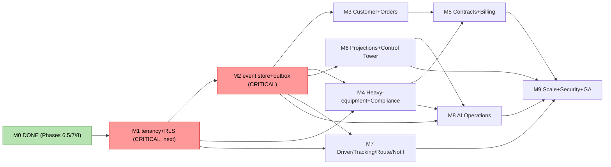

# Phase 9 — Implementation Plan & Build Sequencing (Mesaar)

> **Status:** Implementation planning — **documentation only** (no code, SQL, ORM, or migrations *in this document*). Produced 2026-06-22. This is the bridge from the now-complete architecture corpus (`docs/01`–`docs/11`, ADR-001…009) to the actual build.
> **Relationship to `docs/07`:** **refreshes and extends** the Phase-5 Execution Plan. `docs/07` defined the milestones (M0–M9), dependency graph, risks, and timeline — all still authoritative. This plan **updates milestone status** (M0 is now closed), and adds the **build-ready detail** `docs/07` lacks: per-milestone task breakdown mapped to the `docs/05` package structure and `docs/11` blueprint, additive migration ordering, Definition of Done, CI/test exit gates, and the ADR schedule. It **does not** change frozen aggregates, relationships, tenancy, the event-store model, or the ERD.

**The one rule that governs everything:** *tenancy first → event backbone → domain → differentiators → intelligence/scale.* **No new aggregate table is created before `tenant_id` + RLS exist (M1); no event-driven consumer/saga before the event store + outbox exist (M2).**

---

## 0. Status reconciliation vs `docs/07`

Phases 6 → 8 have **closed the entire M0 gate** and produced the inputs M1+ consume. Current state:

| Milestone | `docs/07` exit gate | Status now | Evidence |
|---|---|---|---|
| **M0** Reconciliation & design spikes | C-1 resolved; ADR-008/009 accepted; ADR-007 amended; catalog superseded; backlog + ERD frozen | ✅ **DONE** | C-1 → `docs/09a` §Task1; ADR-008/009 accepted; ADR-007 Migration+Rollback → `docs/09a` Task5; event-catalog supersede banner; **ERD frozen** `docs/10`; **column-spec complete** `docs/11` §1 |
| **M1** Multi-tenancy + RLS | tenant_id everywhere; RLS; **isolation test green**; `SET LOCAL` verified | 🔴 **NOT STARTED (build)** — *immediate next action* | design complete: `docs/03` §8, ADR-001, `docs/11` §7 |
| **M2** Event store + outbox + audit | event_store/processed_events/audit live; relay + lag metric; immutability; partitioning | 🔴 **NOT STARTED (build)** | design complete: `docs/03` §6–7, ADR-007 (+Migration/Rollback), `docs/11` §6 |
| **M3** Customer + Orders | aggregates/services/routers; fan-out saga; credit-gated approval | ⚪ Planned (blocked on M1+M2) | `docs/11` §1.1–1.2, §2, §9.1 |
| **M4** Heavy-equipment + Equipment ctx | equipment catalog, permits, escorts, axle/route compliance, operator certs | ⚪ Planned (blocked on M1+M2) | `docs/08`, `docs/11` §1.4/1.7 |
| **M5** Contract Mgmt + Billing | contracts/pricing/SLA/penalties/claims/rental; quote/settle/payout | ⚪ Planned (blocked on M3+M4) | `docs/11` §1.5/1.6/1.11 |
| **M6** Projections + Control Tower | proj_* builders; console reads p95<300 ms | ⚪ Planned (blocked on M2) | ADR-006, `docs/11` §6.2 |
| **M7** Driver self-svc + Tracking + Route + Notifications | close `api-gap-analysis.md`; OTP; nearby/accept; routes; notifications | ⚪ Planned (blocked on M1+M2) | `docs/11` §1.12/1.13, §5 |
| **M8** AI Operations | pgvector; ml_predictions feedback; ETA/SLA/assignment serving | ⚪ Planned (blocked on M2+M6+M4) | `docs/11` §10 |
| **M9** Scale, security & hardening | SLOs + load test; pen-test; residency; EDI; DR/PITR; GA | ⚪ Planned (last) | `docs/07` §2 M9 |

> **Net:** the planning/design program is **complete through M0**. The build begins at **M1**. Everything below is implementation-level detail for M1→M9.

---

## 1. Build-readiness entry point

The architecture is frozen and self-consistent. To start coding, the team needs only:
1. The **frozen ERD** (`docs/10`) + **column-spec** (`docs/11` §1) → translate to additive Alembic migrations (M1 onward).
2. The **package map** (`docs/05` §1) → where each new module lives (additive, no renames, Alembic-safe).
3. The **CQRS/event/tenancy/security/consistency** blueprints (`docs/11` §4/6/7/8/9) → how each command/handler behaves.
4. The **standing rule** (M1 before any aggregate table; M2 before any consumer).

**No design decisions remain to start M1.** (Implementation-detail ADRs 010–015 are scheduled in §5; none block M1/M2.)

---

## 2. Per-milestone implementation breakdown

Each milestone lists: **Objective · Build tasks (module → `docs/05` package) · Migrations (conceptual, additive, Alembic-safe) · Events/APIs · Definition of Done · Exit-gate tests · ADRs**. "Additive" = new tables/columns only, `app.db.base:Base.metadata` + `app.models` remain migration targets, `CREATE … CONCURRENTLY` for indexes on live data, backfill→validate→`NOT NULL`.

### M1 — Multi-tenancy + RLS (backbone, CRITICAL, serial)
- **Objective:** every aggregate is tenant-scoped and RLS-enforced; cross-tenant leakage is impossible and proven by test.
- **Build tasks:** `Tenant` model (`app/models/tenant.py`) + `TenantRepository` + provisioning in `TenantService` (`app/services`); wire `TenantMixin` onto every existing aggregate; `request_context` middleware → `SET LOCAL app.current_tenant`/`app.current_user_id` (`app/api/middleware`, `app/db/tenant`); switch app to a **non-superuser** DB role.
- **Migrations (additive, ordered — `docs/03` §8.4):** (1) create `tenants` + insert nil-UUID platform; (2) add `tenant_id` **nullable**, backfill → platform; (3) `NOT NULL` + FK + tenant-leading indexes `CONCURRENTLY`; (4) swap single-col uniques → `(tenant_id, …)` composites; (5) enable RLS `USING`/`WITH CHECK` per table; (6) per-tenant rate-limit + `statement_timeout`.
- **DoD:** all 7 existing tables carry `tenant_id` + RLS; per-tenant uniques live; platform-tenant elevation is opt-in and audited.
- **Exit-gate tests:** **cross-tenant isolation integration test** (tenant A cannot read/write B even with a missing filter); **pooled-connection `SET LOCAL` non-leak** test; per-tenant unique collision test; platform-elevation opt-in test. *CI must gate merges on these.*
- **ADRs:** ADR-011 identity/OTP/Nafath may begin (not blocking).

### M2 — Event store + transactional outbox + audit (backbone, CRITICAL, serial)
- **Objective:** durable append-only event log + outbox relay + generic audit, all tenant-scoped, partitioned, immutable.
- **Build tasks:** `event_store`/`processed_events`/`idempotency_keys`/`outbox_relay_state` models (`app/models/event_store.py`) + `EventStoreRepository`; `app/events` (domain event types + publish port; single-txn state+event write); outbox **relay** Celery task + **outbox-lag gauge** (`app/workers`, `app/observability/metrics`); idempotent consumer base; `audit` schema + row-trigger + immutability grants (INSERT/SELECT-only app role).
- **Migrations:** `event_store` (UUIDv7 PK `(event_id, occurred_at)`, `UNIQUE(aggregate_id, aggregate_version)`, monthly RANGE partition); `processed_events (consumer, event_id)`; `audit_log` (partitioned); partition pre-create/retention beat job.
- **Events/APIs:** wire existing Shipment transitions to **emit via outbox** (first real producer); no public API change.
- **DoD:** a Shipment transition writes aggregate+event in one txn; relay publishes; a consumer dedupes; audit trigger records row history; immutability grants verified.
- **Exit-gate tests:** dual-write atomicity (event present iff state changed); at-least-once + idempotent replay; outbox-lag metric emits; immutability (UPDATE/DELETE on `event_store` denied); replay rebuilds a projection.
- **ADRs:** confirm ADR-007 Migration/Rollback followed.

### M3 — Customer + Orders (domain; needs M1+M2; ∥ M4)
- **Objective:** commercial intake → fan-out, incl. the CF1 cancellation saga.
- **Build tasks:** `Customer`(+contacts), `Order`(+`OrderLine`) models/repos; `CustomerService`, `OrderService` (`app/services`); routers `/v1/customers`, `/v1/orders` (`app/api/routes`, schemas); **Order→Shipment fan-out saga** + **CF1 cancellation-compensation saga** (orchestration, `docs/11` §9.1) — emit `OrderFulfilmentFailed`, `OrderCancellationFeeApplied`.
- **Migrations:** `customers`, `customer_contacts`, `orders`, `order_lines` (per `docs/11` §1.1–1.2; tenant-scoped, RLS); additive `shipments.order_id` FK.
- **Events/APIs:** Order events via outbox; `/v1` additions + OpenAPI contract test.
- **DoD:** approved order fans out to shipments; `fulfilling→cancelled` runs the compensation workflow + fee + audit + notify; credit-gated approval works.
- **Exit-gate tests:** fan-out saga happy + partial-failure (`OrderFulfilmentFailed`); CF1 cancellation with compensation + idempotent retry; credit-hold blocks approval; contract diff green.

### M4 — Heavy-equipment + Equipment/Asset + Compliance (differentiator; needs M1+M2; ∥ M3)
- **Objective:** the marquee domain — equipment lifecycle + permit/escort/route/axle/operator compliance as **HARD dispatch gates**.
- **Build tasks:** `Equipment`(+`Model`,`Category`), Compliance aggregates (`Permit`,`Escort`,`AxleWeightProfile`,`RouteRestriction`,`ComplianceRule`/`Check`,`OperatorCertification`) models/repos; `EquipmentService`, `ComplianceService`/`PermitService`; **equipment reactor** consumer (reacts to Shipment events, ADR-009 one-way); extend the `assigned→in_transit` **guard set** in the owning service (not a machine rewrite) with permit/route/escort/cert checks; cert-expiry sweep (beat).
- **Migrations:** all `docs/11` §1.4/1.7 tables; additive `shipments.equipment_id` FK + derived oversize flags.
- **Events/APIs:** Equipment/Compliance events; `/v1/equipment`, `/v1/permits`, `/v1/compliance/route-check`.
- **DoD:** an oversize movement cannot dispatch without approved permit + cleared route + escort + valid operator cert; equipment lifecycle tracks the shipment.
- **Exit-gate tests:** dispatch blocked when any HARD compliance gate fails; equipment reacts correctly to Shipment events; cert-expiry makes an operator ineligible.

### M5 — Contract Management + Billing (differentiator; needs M3+M4)
- **Objective:** monetize — contracts/pricing/SLA/penalties/rental + quote/settle/payout/claims.
- **Build tasks:** Contract aggregates + `ContractService`; Billing aggregates + `BillingService`; Insurance/Claims aggregates + `ClaimService`/`PolicyService`; ACLs (`app/integrations`) to ERP/payment/insurer; wire `SettlementRequestedIntegrationEvent`, `PaymentFailed`, claims to `ShipmentFailed/Returned/Exception`, SLA-breach → penalty → settlement, `OrderCancellationFeeApplied` → settlement.
- **Migrations:** `docs/11` §1.5/1.6/1.11 tables.
- **DoD:** delivered shipment settles; SLA breach applies penalty; claim FNOL→settle→close; `PaymentFailed` drives retry/dunning; cancellation fee settles.
- **Exit-gate tests:** contract lifecycle (incl. terminate→reconcile); claim lifecycle (incl. reopen); payment-failure path; pricing→quote; penalty→settlement.

### M6 — Projections + Control Tower (value; needs M2; ∥ M5/M7)
- **Objective:** the read side + control tower at p95 < 300 ms.
- **Build tasks:** `proj_*` builders (`app/projections`) folded from events (tenant-scoped + RLS per the 6.5 amendment); replay-rebuild tooling; projection-lag gauge; control-tower/exception/SLA read APIs; consoles to WCAG 2.2 AA gate.
- **Migrations:** `proj_active_shipments`, `proj_driver_status`, `proj_warehouse_load`, `proj_sla_risk`, `proj_driver_daily_stats` (+ `proj_equipment_availability`).
- **DoD:** projections rebuildable from the log; reads meet the latency budget; "as of" surfaced; SLA sweep emits `ShipmentDelayed` → `proj_sla_risk`.
- **Exit-gate tests:** replay-and-compare (no divergence); read p95 < 300 ms; tenant-scoped projection reads (no cross-tenant); lag alert fires.

### M7 — Driver self-service + Tracking + Route + Notifications (value; needs M1+M2; ∥)
- **Objective:** close `api-gap-analysis.md`; routes; notifications.
- **Build tasks:** phone+OTP identity flow; `/v1/drivers/me`, `/me/stats`, availability; `/v1/shipments/nearby` (geo/eligibility) + self-accept/decline; first-class Tracking router (monotonic guard preserved); `Route`(+`RouteStop`) + `RouteService`; Notifications consumer + channel ACLs (FCM/APNs/SMS/email).
- **Migrations:** `routes`, `route_stops`, `notifications`.
- **DoD:** driver app's expected endpoints all exist; offers/accept/decline work; routes bind shipments; notifications fan out on assignment/delivery/exception.
- **Exit-gate tests:** offer 15s window + idempotent accept; decline = no mutation; route stop completion; notification delivery + retry.

### M8 — AI Operations (intelligence; needs M2+M6+M4)
- **Objective:** advisory ETA/SLA/pricing/assignment/anomaly + RAG, with feedback loop.
- **Build tasks:** pgvector/HNSW `embeddings` + `documents`/`document_chunks`; `ml_features_shipment` (point-in-time) + `ml_predictions` (+`actual_outcome`); `app/ai` recommendation services (advisory, human-in-the-loop); PostGIS promotion when routing lands.
- **DoD:** ETA + SLA-risk + assignment ranking serve advisorily; predictions logged with provenance; feedback captured; tenant-scoped, PII-disciplined.
- **Exit-gate tests:** point-in-time correctness (no target leakage); tenant isolation for AI data; prediction reproducible from `model_version`+`features_ref`; a missing prediction never blocks a command.
- **ADRs:** **ADR-010 MLOps/model-serving** (the deferred decision).

### M9 — Scale, security & enterprise hardening (last; needs M5–M8)
- **Objective:** GA-grade scale, security, residency, integration, DR.
- **Build tasks:** SLO definitions + load test to the ADR-002/003 envelope + revisit-trigger dashboards; EDI/partner gateway + webhooks; security review/pen-test; DR/PITR + partition-retention drill; per-tenant backup/export + right-to-erasure.
- **DoD:** SLOs met under load; pen-test passed; residency + erasure flows verified; DR drill green; GA acceptance plan signed.
- **ADRs:** **ADR-012 secrets/KMS · ADR-013 API gateway/rate-limit · ADR-014 data residency · ADR-015 OLAP/throughput** (scale revisit).

---

## 3. Cross-cutting build governance

| Area | Rule |
|---|---|
| **Branch/PR policy** | No PR adding an aggregate table merges before **M1** is green; no PR adding an event consumer/saga before **M2** is green. CI enforces the isolation + outbox gates. |
| **Migrations** | Always additive; `app.db.base:Base.metadata` + `app.models` stay the targets; `CREATE … CONCURRENTLY`; backfill→validate→`NOT NULL`; UUIDv7 default adopted **before** event/audit tables ship; never rename generated constraints (frozen `NAMING_CONVENTION`). |
| **Test pyramid** | Unit (domain invariants/transitions) · integration (repos + RLS + outbox) · **isolation** (cross-tenant) · **contract** (OpenAPI diff vs runtime) · saga (happy + compensation) · load (M9). |
| **CI gates (each merge)** | lint/type · unit+integration green · OpenAPI contract diff · isolation test (post-M1) · outbox/replay test (post-M2) · WCAG axe-core (consoles). |
| **Observability from day one** | Every new consumer/worker emits its metric (outbox lag, projection lag, queue depth) and structured logs with request-id+tenant. |
| **Definition of Done (global)** | code + tests + migration (additive) + events wired via outbox + RLS verified + OpenAPI updated + metric/log + docs cross-ref. |

---

## 4. Sequencing & critical path (refreshed)

**Critical path:** **M1 → M2 → {M3, M4} → M5 → M8 → M9** (M0 closed). Backbone (M1+M2) is the hard serial prerequisite; M6/M7 parallelize once M2 lands; a second squad runs the M3/M4/M6/M7 band in parallel (`docs/07` §5: ≈ 20–22 weeks two-squad vs ≈ 30 weeks single-squad — **minus the ~2-week M0**, already spent in Phases 6.5–8).

---

## 5. ADR schedule (implementation-detail decisions)

| ADR | Topic | When | Blocking? |
|---|---|---|---|
| ADR-010 | MLOps / model-serving runtime | M8 | No (AI deferred) |
| ADR-011 | Identity: phone+OTP / Nafath SSO | M1/M7 | No |
| ADR-012 | Secrets / KMS | M9 (start M1) | No |
| ADR-013 | API gateway / rate-limiting | M9 | No |
| ADR-014 | Data residency | M9 | No |
| ADR-015 | OLAP / throughput (scale revisit, ADR-002 trigger) | M9 | No |

None block M1/M2. Authoring each is a documentation task scheduled with its milestone.

---

## 6. Risk delta vs `docs/07` §4

`docs/07`'s 14 risks (R-1…R-14) remain the register. Status changes after Phases 6.5–8:

| Risk | Change |
|---|---|
| R-7 Order saga / fan-out partial failure | **Mitigated (design)** — C-1 resolved; `OrderFulfilmentFailed` + CF1 compensation specified (`docs/11` §9.1). Build-verify in M3. |
| R-3 Heavy-equipment scope | **Reduced** — ADR-008/009 accepted; column-spec done (`docs/11` §1.4/1.7). Still High at build (M4). |
| R-14 ADR debt | **Scheduled** — ADR-010…015 mapped (§5). |
| R-1/R-2 tenancy leakage/retrofit | **Unchanged, CRITICAL** — gated by M1 isolation test + branch policy (§3). |
| R-4/R-5 outbox reliability / dual-write | **Unchanged** — design complete (ADR-007 +Migration/Rollback); build-verify in M2. |
| Others (R-6/8/9/10/11/12/13) | Unchanged; carried into their milestones. |

---

## 7. Implementation Readiness Report

Legend: **PASS** · **WARNING** (track) · **CRITICAL** (build prerequisite). Class: **[DB]** design blocker · **[BP]** build prerequisite · **[IR]** implementation risk · **[DG]** doc gap.

| # | Item | Verdict | Class |
|---|---|---|---|
| 1 | Architecture corpus complete & consistent (`docs/01`–`docs/11`, ADR-001…009) | **PASS** | — |
| 2 | M0 gate (reconciliation, ADRs, frozen ERD, column-spec) | **PASS** | — |
| 3 | Per-milestone build breakdown + DoD + exit gates | **PASS** | — |
| 4 | Migration ordering (additive, Alembic-safe) | **PASS** | — |
| 5 | CI/test governance + branch policy | **PASS** | — |
| 6 | **M1 tenancy build** (the next action) | **CRITICAL** | [BP] |
| 7 | **M2 event store build** | **CRITICAL** | [BP] |
| 8 | Saga/process-manager framework choice | **WARNING** | [IR] |
| 9 | ADR-010…015 authoring | **WARNING** | [DG] |
| 10 | External integrations (payment/insurer/maps/EDI) sandboxing | **WARNING** | [IR] |

### 7.1 Verdict

**🟢 READY TO BEGIN IMPLEMENTATION — start at M1 (tenancy).** No design blockers; M0 is closed. The plan is build-ready: every milestone has tasks mapped to the frozen package/table/event/API design, additive migration ordering, a Definition of Done, and concrete exit-gate tests. The only CRITICAL items are the **M1 → M2 backbone build** (in that order), already fully specified. The standing rule holds: *no aggregate table before M1; no consumer/saga before M2.*

**Recommended first action:** open the **M1 tenancy** workstream — `tenants` model + `tenant_id`/RLS migrations + `SET LOCAL` middleware + the **cross-tenant isolation test as the CI gate**.

---

## Appendix — Documents reviewed
`docs/01`–`docs/11` (full corpus), ADR-001…009, `api-gap-analysis.md`, `event-catalog.md`, `domain-glossary.md`, `diagrams/*`. Companion: `docs/07` (milestone definitions, dependency graph, risk register, timeline — refreshed here).

*End of Phase 9 — Implementation Plan & Build Sequencing. Documentation only; no code, SQL, ORM, or migrations produced. Frozen architecture unchanged. **Recommended next action: begin M1 (tenancy) build — awaiting your go-ahead.***
