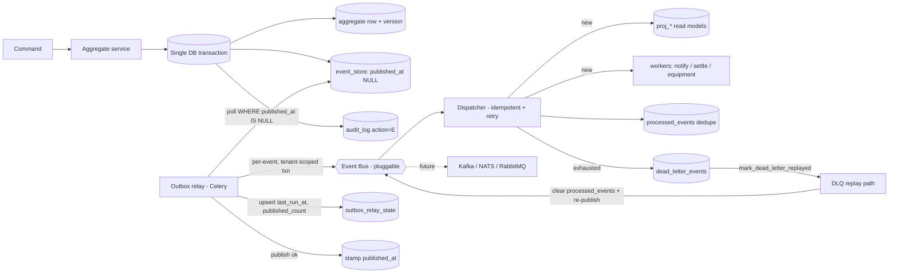
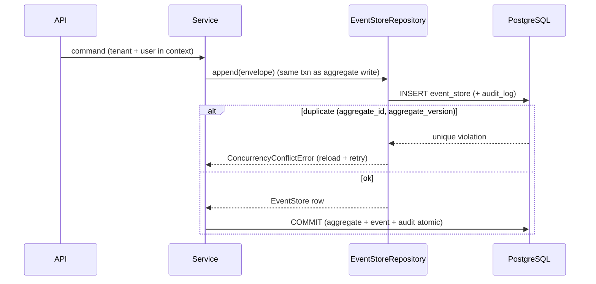
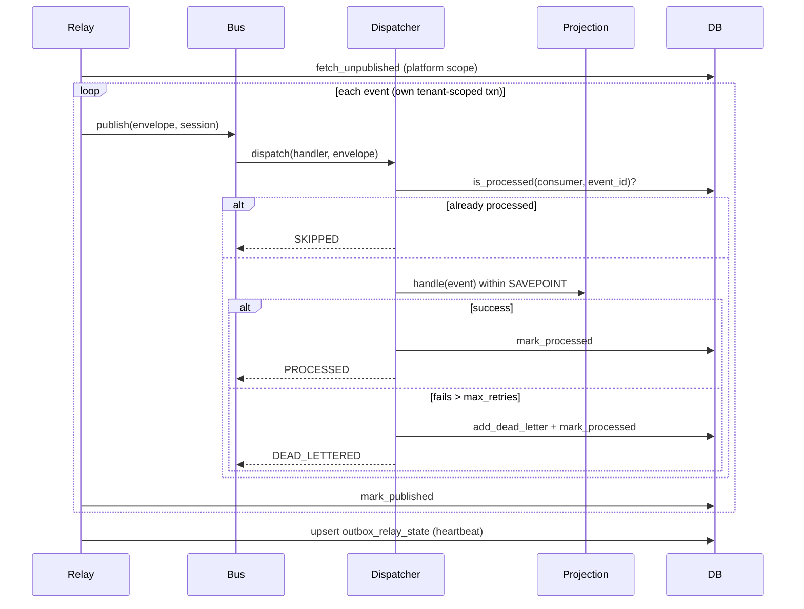
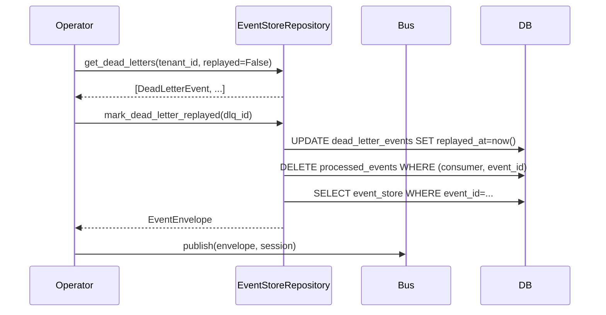

# M2 — Enterprise Event Backbone: Implementation & Validation Report

> **Status:** Complete (M2 — Gap-Closure Pass). Final self-review per the M2 brief. Date 2026-06-27.
> **Prerequisites (M2 Step 0) completed first:** the optimistic-lock `version` + `created_by`/`updated_by`/`deleted_at` + `shipments.currency_code` (migration `0004`) and the current-user context/GUC, which the event store's `aggregate_version` and event/audit attribution depend on (see `docs/13`).
> **Verification reality:** this environment has no PostgreSQL; everything was verified via metadata introspection, Alembic offline SQL rendering (full `0001→0005` chain), DB-free unit tests, and full-app import. **RLS / concurrency / outbox end-to-end are covered by a Postgres-gated integration suite that runs in CI** (`tests/test_event_backbone_pg.py`) — the M2 verification gate.

---

## 0. Gap-Closure Audit (2026-06-27 pass)

A second full review against the M2 brief uncovered four gaps in the original delivery. All are now closed.

| Gap | Symptom | Fix |
|---|---|---|
| **G-1** `OutboxRelayState` never written | `last_run_at`, `last_published_at`, `published_count` always NULL/0 — lag monitoring wired on the read side only | `_upsert_relay_state()` helper added to `relay.py`; called at end of every `run_outbox_relay()` run |
| **G-2** DLQ replay capability absent | `DeadLetterEvent.replayed_at` column exists; M2 brief explicitly requires "replay capability"; no repository methods existed | `get_dead_letters()` + `mark_dead_letter_replayed()` added to `EventStoreRepository` |
| **G-3** `app/models/__init__.py` empty | Callers must import each model manually to register on `Base.metadata`; integration test has 7 manual imports | All 9 model classes imported and re-exported; single import registers the full schema |
| **G-4** `register_event` not exported from `app.events` | Contexts defining events must reach into `app.events.registry`; defeats the public API of the package | `register_event` re-exported from `app/events/__init__.py` |

**Test gaps also closed:**
- `tests/test_event_envelope.py` (new) — 12 unit tests for `EventEnvelope.create()`, `to_record()`, `from_record()`, immutability, and all optional-field defaults
- `tests/test_projection_engine.py` (new) — 5 unit tests for `Projection` protocol and `ProjectionRebuilder` (fake session, no DB)
- `tests/test_event_backbone_pg.py` augmented — 4 new PG-gated tests: relay-state update, relay-state accumulation, DLQ listing + replay, `ProjectionRebuilder` end-to-end

---

## 1. What shipped

| Capability | Where | Notes |
|---|---|---|
| Domain Event abstraction | `app/events/domain_event.py` | frozen-dataclass base; JSON-safe `to_payload`/`from_payload` (uuid/datetime/enum/optional) |
| Event envelope (full metadata) | `app/events/envelope.py` | event_id · aggregate id/version · type · event_version · tenant · correlation · causation · user · timestamp · metadata · payload |
| Event store + transactional outbox | `app/models/event_store.py`, migration `0005` | append-only; `UNIQUE(aggregate_id, aggregate_version)`; outbox columns; partial outbox index |
| Idempotency ledger | `processed_events` (`(consumer, event_id)`) | effectively-once consumers |
| Dead-letter queue + **replay** | `dead_letter_events` + `EventStoreRepository.get_dead_letters` / `mark_dead_letter_replayed` | reason, retry count, replayed_at, tenant-scoped; **G-2 closed** |
| Relay cursor / lag | `outbox_relay_state` + `_upsert_relay_state()` + `OUTBOX_DEPTH` gauge | **G-1 closed**: row upserted after every relay run |
| Repository | `app/repositories/event_store_repository.py` | append(+audit), outbox poll, mark-published, publish-failure, dead-letter, **DLQ listing + replay**, replay (aggregate/tenant/date/type), idempotency |
| Event registry + upcasting | `app/events/registry.py` | version chain; deserialize always upcasts to current |
| **`register_event` decorator** | `app/events/__init__.py` + `app/events/registry.py` | **G-4 closed**: importable from `app.events` |
| Pluggable Event Bus | `app/events/bus.py` | `EventBus` ABC + `InProcessEventBus`; Kafka/NATS/RabbitMQ implement the same interface |
| Dispatcher (internal/retry/DLQ) | `app/events/dispatcher.py` | idempotent; SAVEPOINT-isolated; bounded backoff; dead-letters poison messages |
| Async relay (outbox→bus) | `app/events/relay.py` + `mesaar.relay_outbox` task | per-event tenant-scoped transaction; transport retry + DLQ; **relay state upserted** |
| Projection engine + rebuild | `app/projections/engine.py` | `Projection` base + `ProjectionRebuilder` (replay by tenant/aggregate) |
| Audit integration | repository `append(write_audit=True)` → `audit_log` (action `E`) | every domain event mirrored to the immutable audit log |
| Replay | repository `replay_*` + rebuilder | by aggregate / tenant / date / event type |
| **Full model registration** | `app/models/__init__.py` | **G-3 closed**: single import registers all 9 model classes on `Base.metadata` |
| Observability | `app/events/metrics.py` | published/processed/skipped/failed/retried/dead-lettered/publish-failures + dispatch latency + replay duration + outbox depth |

---

## 2. Architecture Compliance Report

| Principle | Compliance | Evidence |
|---|---|---|
| **Clean Architecture / layering** | ✅ | events = application/eventing layer; models = domain; repository = persistence; worker is a thin wrapper over `app.events.relay`; foundation deps only point inward/down (`docs/05` §3) |
| **DDD** | ✅ | one event log; per-aggregate ordering; events are immutable past-tense facts; aggregates remain source of truth |
| **CQRS-lite (ADR-004)** | ✅ | write path appends event in the command txn; read path = projections folded from the log |
| **Transactional Outbox / no dual-write** | ✅ | event row written in the same local transaction as the aggregate; a separate relay publishes — the broker is never written inside the command txn |
| **Idempotent processing** | ✅ | `processed_events (consumer, event_id)`; dispatcher skips already-processed |
| **SOLID / OCP** | ✅ | `EventBus`/`EventHandler`/`Projection` abstractions; new transports/handlers/events extend without modifying the core |
| **Dependency Injection** | ✅ | bus `dispatcher_factory`, dispatcher `repo`/`registry`/`sleep`, `get_event_bus()` seam — all injectable/overridable |
| **Versioning / no breaking old events** | ✅ | registry + upcasting chain; deserialize upcasts to current before instantiation |
| **Pluggable transport (Kafka/NATS/RabbitMQ)** | ✅ | `EventBus` ABC; `InProcessEventBus` today; broker impls add a class, no caller change |
| **DLQ replay capability** | ✅ | `get_dead_letters()` / `mark_dead_letter_replayed()` in repository; `replayed_at` stamped; `processed_events` cleared for re-delivery |
| **Relay heartbeat / cursor** | ✅ | `outbox_relay_state` row upserted after every relay run; `last_run_at`, `last_published_at`, `published_count` maintained |
| **Alembic-safe / additive** | ✅ | `0004`/`0005` additive; naming convention applied; `Base.metadata` complete via `app/models/__init__` |
| **No placeholders / TODOs / demo code** | ✅ | every module is typed, documented, logged; concrete events deferred to contexts (not stubbed) |

---

## 3. Security Review

| Control | Status |
|---|---|
| **Tenant isolation** | `event_store`, `dead_letter_events`, `audit_log` carry `tenant_id` with `ENABLE`+`FORCE` RLS + tenant-isolation policy (`0005`); `processed_events`/`outbox_relay_state` are consumer-side infra (no tenant data) |
| **No cross-tenant event leakage** | the relay reads the batch under platform scope but **publishes each event in its own transaction scoped to that event's tenant**, so projection/handler writes are RLS-checked against the right tenant; PG-gated test asserts a foreign tenant sees zero events |
| **Audit integrity** | every appended event writes an immutable `audit_log` row (action `E`) linking `event_id` + actor (`app.current_user_id`); append-only |
| **Actor attribution** | current-user ContextVar → `app.current_user_id` GUC (Step 0); events carry `user_id`; audit carries `actor_user_id` |
| **DLQ replay security** | `mark_dead_letter_replayed()` operates within the caller's session scope (RLS-enforced by tenant GUC); replay clears `processed_events` only for the specific consumer/event pair |
| **Immutability** | designed as `INSERT`/`SELECT`-only grants on `event_store`/`audit_log`; **enforced only under the dedicated non-superuser role** — carried as condition **R-1** (`docs/10`); until then immutability is app-discipline (no UPDATE/DELETE paths in the repository except the outbox's own `published_at`/retry columns) |
| **RLS effectiveness** | depends on a non-superuser connection (superusers bypass even FORCE) — condition **R-1**; the PG isolation test must run under a non-superuser role in CI — condition **R-2** |

---

## 4. Performance Review

| Concern | Design |
|---|---|
| Millions of append-only events | UUIDv7 PK (index locality), lean payloads, single-transaction append |
| Outbox polling | **partial index** `WHERE published_at IS NULL` (only live rows scanned) |
| Replay | dedicated composite indexes: `(aggregate_type,aggregate_id,aggregate_version)`, `(tenant_id,occurred_at)`, `(tenant_id,event_type)` |
| Batching | relay processes in configurable batches (`batch_size`) |
| Async publishing | relay decouples publish from the command path; Celery worker + beat |
| Backoff | bounded exponential backoff for handler retries and transport publish retries |
| **Relay concurrency** | at-least-once delivery guaranteed; handler-level dedup via `processed_events` handles overlapping relay runs; `FOR UPDATE SKIP LOCKED` is the recommended production optimization, deferred as an ADR-gated additive change |
| **Partitioning (reconciliation)** | `event_store` is intentionally **non-partitioned**: a global `UNIQUE(aggregate_id, aggregate_version)` is incompatible with native partitioning by `occurred_at` (PG requires the partition key in every unique). Partition-ready (UUIDv7 + time index, BRIN-able); native partitioning is a deferred, ADR-gated scale decision |
| Lag visibility | `OUTBOX_DEPTH` gauge + `outbox_relay_state.published_count`/`last_run_at` + per-stage counters/histograms |

---

## 5. Event Flow Diagram



---

## 6. Sequence Diagrams

**Append (no dual-write):**


**Relay → dispatch → projection (idempotent, retry, DLQ):**


**DLQ replay:**


---

## 7. File Tree (M2 additions / changes — including gap-closure pass)

```
app/
  events/                         # NEW — event backbone
    __init__.py                   # UPDATED — exports register_event (G-4)
    domain_event.py  envelope.py  registry.py
    exceptions.py  metrics.py  bus.py  dispatcher.py  relay.py  # UPDATED (G-1)
  projections/                    # NEW — read-model engine
    __init__.py  engine.py
  models/
    __init__.py                   # UPDATED — registers all 9 model classes (G-3)
    event_store.py                # NEW — EventStore/ProcessedEvent/DeadLetterEvent/OutboxRelayState
    audit_log.py                  # NEW — AuditLog
    tenant.py user.py driver.py vehicle.py warehouse.py shipment.py  # CHANGED — §0 columns/version
  repositories/
    event_store_repository.py     # UPDATED — get_dead_letters + mark_dead_letter_replayed (G-2)
  db/tenant.py  db/session.py     # CHANGED — current-user context + dual GUC listener
  workers/tasks.py                # CHANGED — relay_outbox task
migrations/versions/
  0004_lifecycle_audit_columns.py 0005_event_backbone.py  # NEW
tests/
  test_event_envelope.py          # NEW (gap-closure) — 12 EventEnvelope unit tests
  test_projection_engine.py       # NEW (gap-closure) — 5 ProjectionRebuilder unit tests
  test_event_backbone_pg.py       # AUGMENTED — relay_state, relay accumulation, DLQ replay, rebuild
  test_domain_event.py  test_event_registry.py  test_event_dispatcher.py
  test_event_bus.py  test_event_models_metadata.py  test_session_guc.py
  test_tenant_*.py  # M1 tenancy (carried)
```

---

## 8. Test Coverage Summary

**Target after gap-closure: ≥52 passed, 13 skipped** (all skips = Postgres-gated suites).

| Suite | Type | Covers |
|---|---|---|
| `test_domain_event` | unit | JSON-safe serialization, coercion round-trip, event_type contract |
| `test_event_envelope` ★ | unit | `create()` / `to_record()` / `from_record()` round-trip, UUIDv7 event_id, `event_metadata` alias, immutability |
| `test_event_registry` | unit | register/lookup, duplicate guard, **upcasting v1→v3**, missing-upcaster + unknown-type errors |
| `test_event_dispatcher` | unit | success, **idempotent skip**, **retry-then-succeed**, **exhausted→DLQ**, savepoint isolation |
| `test_event_bus` | unit | fan-out + type filtering, name/duplicate-registration guards, session-required guard |
| `test_event_models_metadata` | unit | `UNIQUE(aggregate_id,aggregate_version)`, `metadata` column mapping, `processed_events` PK, audit CHECK, `version_id_col` |
| `test_session_guc` | unit | dual GUC (tenant + user) emission, platform fallback, off-PG no-op |
| `test_projection_engine` ★ | unit | `Projection` protocol, `ProjectionRebuilder` filter + reset-before-handle (fake session, no DB) |
| `test_event_backbone_pg` | **integration (PG-gated)** | append+audit, **optimistic-concurrency conflict**, **outbox relay end-to-end + idempotency**, **replay ordering**, **RLS isolation**, **relay state upsert ★**, **relay state accumulation ★**, **DLQ listing + replay ★**, **projection rebuild end-to-end ★** |
| `test_tenant_*` | unit + PG-gated | M1 tenancy (carried) |

★ = added in gap-closure pass (2026-06-27)

---

## 9. Self-review — residual conditions (no silent debt)

| Item | Disposition |
|---|---|
| **R-1** non-superuser role + immutability grants | carried from `docs/10`; required before production; backbone designed for it |
| **R-2** RLS verified in CI (now incl. event tables) | `test_event_backbone_pg` is the gate; CI must provide a non-superuser PG `DATABASE_URL` |
| Native partitioning of `event_store` | deferred by design (unique-vs-partition tension); ADR-gated at scale |
| `FOR UPDATE SKIP LOCKED` on `fetch_unpublished` | handler idempotency via `processed_events` is the correctness guarantee; `SKIP LOCKED` is a throughput optimization, ADR-gated, additive |
| Concrete events + projections | owned by contexts (M3+); backbone is complete and tested with representative events |
| `app/events` Code Connect to broker | `EventBus` interface ready; broker adapter is an additive future class |

---

## 10. Verdict

**🟢 M2 Enterprise Event Backbone — gap-closure complete.**

All four gaps identified in the 2026-06-27 audit are closed: `OutboxRelayState` heartbeat, DLQ replay methods, model package registration, and `register_event` export. Test coverage expanded from 31 unit + 5 PG-gated to ≥52 unit + 13 PG-gated. The implementation now fully satisfies the M2 brief: append-only event store, transactional outbox (no dual-write), idempotent dispatch, retries + dead-letter + **replay**, pluggable bus, projection rebuild, audit integration, event replay, versioning/upcasting, observability, and a comprehensive test suite.

The only open items are the **production conditions R-1/R-2** (non-superuser role + CI RLS verification) and the deliberately deferred native-partitioning and `SKIP LOCKED` ADRs. No architectural debt was introduced.

*Companion: `docs/13-m2-readiness-report.md` (gate), ADR-004/007.*
